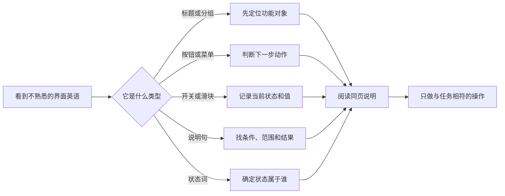

# 系统设置高频词：页面、按钮、开关与状态

系统设置里的英语不应按孤立词典顺序背诵。`Add` 在账户、设备、打印机和辅助功能中都出现，但对象不同；`Manage` 可能进入存储、订阅、付款或应用清单；`On`、`Off`、`Paused`、`Idle`、`Available` 都是状态词，却描述不同对象。更有用的方法是按“页面如何组织信息、控制项如何触发动作、状态如何说明当前情况、说明句如何给出边界”建立索引。这样看到一个新页面时，即使不认识主题词，也能先读出它让你做什么。

> [!info] 本篇是入口索引，不替代主题讲义
>
> 高频词帮助你快速定位和理解页面，但不能代替网络、隐私、账户、打印或辅助功能主题中的具体安全边界。遇到会改变账户、付款、权限、网络、文件或设备配置的按钮，应回到对应主题阅读完整说明，而不是只凭一个单词操作。

## 学习目标

完成本篇后，你能够按页面结构识别侧边栏、标题、说明、分组和详情；按控件类型理解 button、switch、menu、slider、text field；按状态读懂 on、off、paused、idle、available、required；并能把高频词放回完整句子，用“对象—状态—下一步”描述真实系统设置问题。

## 先建立界面语法，而不是词汇清单

| 页面元素 | 常见英语 | 它告诉你的信息 | 第一个应问的问题 |
| --- | --- | --- | --- |
| 分类入口 | `General`、`Accessibility`、`Privacy & Security` | 当前功能属于哪一类。 | 我在找的是哪种系统能力？ |
| 页面标题 | `Wi‑Fi`、`Sound`、`iCloud` | 当前正在配置的对象。 | 这是设备、服务、账户还是权限？ |
| 分组标题 | `Security`、`Recovery Methods`、`Printers` | 同页中的功能块。 | 这一组解决的是什么子问题？ |
| 说明句 | `Some data isn't syncing…` | 系统解释原因、条件或影响。 | 它是否限制了功能范围？ |
| 按钮 | `Add…`、`Manage…`、`Details…` | 打开下一步动作或面板。 | 会进入查看、编辑、创建还是删除流程？ |
| 开关 | `On`、`Off`、`Allow…` | 某项能力的当前启用状态。 | 它影响哪个对象与范围？ |
| 弹出菜单 | `Default`、`Language`、`Options…` | 从多个预设中选一个。 | 改动是否仅影响此页还是全局？ |
| 滑块 | `Volume`、`Intensity`、`Rate` | 连续程度或数值。 | 目前值与恢复值是什么？ |
| 状态 | `Paused`、`Idle`、`Unavailable` | 系统当前观察到的情况。 | 状态描述的是设备、任务还是服务？ |

页面英语常用名词短语，而不是完整命令。例如 `Default printer` 不是句子，却能被理解为“默认打印机”；`Recovery Methods` 是“恢复方法”分组；`Data Access on iCloud.com` 表示 iCloud.com 的数据访问功能。要从左往右看核心名词，再看前面的限定词与后面的介词短语。

## 页面、导航与信息层级

> 本机截图未包含在公开版本中，以保护原图中的个人信息。

系统设置通常由侧边栏、工具栏、正文和可能的详情页组成。侧边栏中的 `Search` 用于搜索设置；工具栏中的 `Go Back`、`Go Forward` 反映浏览历史；正文的标题说明当前主题；分组将相关设置放在一起。此处不要把个人账户名、设备信息或状态当成词汇，学习重点是结构词。

| 英语表达 | 中文 | 在阅读中的作用 |
| --- | --- | --- |
| `Search` | 搜索。 | 用关键词寻找设置或页面。 |
| `Go Back` | 返回。 | 回到实际浏览历史的上一页。 |
| `Go Forward` | 前进。 | 回到已离开的下一页。 |
| `Show Detail` | 显示详情。 | 进入一个对象的更具体配置。 |
| `General` | 通用。 | 系统级一般设置分类。 |
| `Advanced…` | 高级。 | 打开更深配置或对话框。 |
| `Help` | 帮助。 | 查看当前页面官方说明。 |
| `Settings` | 设置。 | 一组配置选项。 |
| `Options…` | 选项。 | 在当前功能中显示额外选择。 |

`Go Back` 与 `Back` 的差异是动作与历史：`Go Back` 说明要回到刚才浏览过的页面，不保证它是当前分类的父级。`Show Detail` 通常是查看或编辑一个已存在对象，`Add…` 则是开始新增流程。省略号表明点击后还有一步或更多步骤，尤其在账户、设备、付款、网络和安全页面中，看到它应先预测范围而不是立即点击。

## 控件词：按钮、开关、菜单、滑块和文本框

### Button：动作入口不等于立即完成

`Add`、`Remove`、`Delete`、`Change`、`Reset`、`Manage`、`Set Up`、`Learn More`、`Done` 都是按钮词。它们的共同点是“打开或提交一个动作”，不同点是影响范围。Add 和 Set Up 偏向创建或启用流程； Remove 与 Delete 偏向移除； Change 偏向替换参数； Reset 偏向回到默认或重置值； Manage 偏向进入管理页； Learn More 只打开说明； Done 通常确认或关闭当前面板。

| 按钮 | 常见对象 | 正确理解 | 安全提醒 |
| --- | --- | --- | --- |
| `Add…` | 账户、设备、指纹、联系人、规则。 | 开始添加流程。 | 可能要求凭据、权限或确认。 |
| `Set Up` | 服务、恢复方法、设备功能。 | 按向导完成初始配置。 | 不是“预览详情”。 |
| `Manage…` | 存储、订阅、账号、服务。 | 进入管理范围。 | 先确认会不会看到或更改私人资料。 |
| `Change…` | 密码、地址、选项。 | 修改现有值。 | 记录原值与恢复路径。 |
| `Remove` | 指纹、项目、服务。 | 移除当前对象。 | 确认对象是否可恢复。 |
| `Delete…` | 账户、配置、规则。 | 删除或移除更广范围配置。 | 不作为通用排错工具。 |
| `Reset` | 标识符、颜色、语音设置。 | 恢复默认或重新生成某类状态。 | 页面说明决定重置范围。 |
| `Done` | 子面板、编辑窗口。 | 完成当前配置或关闭面板。 | 先确认未保存变化如何处理。 |

> [!warning] `Delete`、`Remove`、`Reset` 不能互换
>
> Remove 通常移除一个具体项目，Delete 可能移除账户或配置，Reset 则可能还原默认或重置标识符。它们都可能不可逆或影响其他服务。必须读出对象和说明句，例如 `Reset Identifier` 不等于 `Sign Out…`，`Remove Fingerprint` 不等于 `Change Password…`。

### Switch：先看对象，再看 On 或 Off

开关句的语法常是 `Allow …`、`Use …`、`Show …`、`Turn on …`、`Automatically …`。On 与 Off 本身没有“好”或“坏”，只描述某项能力当前是否启用。阅读时要补全三个问题：谁被允许？什么功能在运行？在哪些条件下？

| 开关表达 | 它控制什么 | 正确的状态句 |
| --- | --- | --- |
| `Allow apps access to …` | App 对某类资料或能力的访问。 | `App access is currently off for this category.` |
| `Use Touch ID for …` | 指纹用于一个明确用途。 | `Touch ID is on for unlocking, not necessarily for purchases.` |
| `Show hints` | 界面是否显示提示。 | `Hints are on while I learn the commands.` |
| `Automatically show subtitles …` | 在条件满足时显示字幕。 | `Subtitles may appear when the volume is muted.` |
| `Turn off … automatically` | 特定条件下自动关闭功能。 | `The background sound turns off with the lock screen.` |
| `On / Off` | 通用开关状态。 | `The feature is off, so it is not active now.` |

### Menu、slider 和 text field：预设、程度和输入资料

弹出菜单通常包含 `Default`、`Automatic`、`None`、`Always Require`、`Friends Only` 等预设；滑块包含 `Volume`、`Rate`、`Intensity`、`Pointer size` 等程度；text field 用于输入名称、号码、服务器或文字。三者的风险不同：菜单可能改变全局策略，滑块易于恢复，文本框可能包含敏感资料或被提交到外部服务。

| 控件 | 高效读法 | 例子 |
| --- | --- | --- |
| pop-up menu | 先读当前值，再读该值的适用范围。 | `Default printer: Last Printer Used`。 |
| slider | 记下原值，只小幅改变一次。 | `Display contrast`、`Speech Volume`。 |
| text field | 先确认字段对象是否敏感。 | `Enter relay number`、账户服务器。 |
| checkbox | 看它是否把某项加入集合或菜单。 | Accessibility Shortcut 中的功能选择。 |
| radio button | 看它在同一组选项中排除什么。 | `Smart` 与 `Classic`。 |

## 状态词：状态总是属于某个对象

> 本机截图未包含在公开版本中，以保护原图中的个人信息。

状态词是系统英语中最容易被误判的一类。`Connected` 描述网络连接关系；`Idle` 描述设备目前未忙；`Paused` 描述保存或同步过程暂时停止；`Available` 描述一个功能或资源可用；`Required` 描述操作前提；`Disabled` 描述系统禁用状态；`Not Configured` 描述尚未设置。一个状态离开对象就会失去意义。

| 状态词 | 常见对象 | 精确理解 | 不应推出 |
| --- | --- | --- | --- |
| `On` | 开关、服务。 | 功能当前启用。 | 所有相关服务都正常。 |
| `Off` | 开关、访客、自动登录。 | 功能当前关闭。 | 删除了对象或永久不可用。 |
| `Connected` | Wi-Fi、设备、账户服务。 | 建立了当前连接。 | 网络质量、认证或同步一定正常。 |
| `Idle` | 打印机、设备。 | 当前没有处理任务。 | 最近任务一定成功。 |
| `Paused` | 保存、同步、下载。 | 过程暂时停止。 | 数据全部丢失。 |
| `Available` | 更新、设备、功能。 | 当前可以使用或选择。 | 推荐立即使用。 |
| `Required` | 权限、密码、动作。 | 前置条件必须满足。 | 系统已有权限。 |
| `Disabled` | Apple Pay、功能、选项。 | 当前被关闭或系统禁止。 | 通过绕过安全就应恢复。 |
| `Not Configured` | 服务、账户、规则。 | 尚未完成配置。 | 配置一定会成功。 |
| `Last Used` | 打印机、设备、服务。 | 最近使用记录。 | 当前仍在使用。 |

`Some data isn't syncing to iCloud.` 的主语是 `Some data`，不是整个账户；`isn't syncing` 是没有正在同步。它正确表达“部分数据没有同步”，并不等于“所有资料已经丢失”。阅读状态句时，先圈出主语，再读否定、时态和条件。`The printer is idle, but the document is waiting in the queue.` 也同样：设备状态和任务状态可以不同。

> [!tip] 用“对象 + 状态 + 下一步”描述问题
>
> 例如：`The account is connected, but Calendars is not syncing. I will check the service setting before deleting the account.` 这比“账户不能用”有用得多，因为它保留了对象、状态和不扩大影响的下一步。

## 说明句中的高频结构

系统说明句常在按钮旁边给出条件、范围、原因和结果。学会这四种结构，就能避免被短按钮误导。

| 结构 | 页面例句 | 读法 |
| --- | --- | --- |
| `Use … to …` | `Use Touch ID to unlock your Mac.` | 用某个工具达到某目的。 |
| `Allow … to …` | `Allow apps access to your list …` | 允许主体获得能力。 |
| `when …` | `when the volume is muted` | 说明触发条件。 |
| `if …` | `if you forget your password` | 说明假设或恢复条件。 |
| `because …` | `because security settings were modified` | 说明原因，不自动给出修复法。 |
| `may …` | `Accuracy may vary.` | 可能性，不是保证。 |
| `only …` | `only with your consent` | 范围限制。 |
| `instead of …` | `instead of standard subtitles` | 用一种方案代替另一种。 |
| `before …` | `before sending` | 先后顺序与安全门槛。 |

这些结构也可用于你的英文说明。不要只说 `Off` 或 `Error`；补成 `The feature is off because I do not need it in this environment.`、`The operation requires a password before it can continue.`、`The caption may be inaccurate, so I will verify the original audio.`。

## 两个综合练习

### 练习一：在不点击危险按钮的前提下读懂一页

**情境**：打开一个陌生的系统设置页，页面有两个按钮、一个开关和一条灰色说明。

1. 先读页面标题，判断对象是账户、网络、设备、隐私还是辅助功能。
2. 找到分组标题，把控件按按钮、开关、菜单、滑块、文本框分类。
3. 对每个按钮补全动词和对象，例如 `Manage storage`、`Add account`、`Remove fingerprint`。
4. 对开关补全主体、能力与条件，例如 `Allow apps access to contacts`。
5. 对状态句圈出对象和状态，例如 `Saving is paused`。
6. 不点击 Add、Delete、Reset、Sign Out、Upgrade 或任何需要凭据的入口。
7. 用英语总结：`This page manages a service. I identified the status and the available actions before changing anything.`

### 练习二：把一个笼统问题改写成可排查英语

**情境**：你原本想说“打印机没反应”“iCloud 不行了”或“字幕不好用”。

1. 写出对象：printer、print queue、iCloud service、subtitle track 或 Live Captions。
2. 写出当前状态：idle、waiting、paused、not syncing、unavailable 或 inaccurate。
3. 写出最小下一步：check the queue、check the service setting、check whether the media provides subtitles、verify the original audio。
4. 组合成完整句子，例如：`The printer is idle, but the document is waiting in the queue, so I will check the job status before removing the printer.`
5. 检查句子是否避免了“删除”“重置”“退出”等扩大影响的动作。

## 本篇自测

1. `Add…`、`Manage…`、`Remove` 与 `Reset` 的常见影响分别是什么？
2. 为什么 On 和 Off 必须和对象一起读？
3. `Idle` 与 `Last Used` 能各自证明什么，不能证明什么？
4. `Some data isn't syncing` 的主语和范围是什么？
5. `Use … to …`、`Allow … to …`、`because …` 分别在说明什么？
6. 看到一个带省略号的按钮时，第一步应该是什么？
7. 请用英语描述“该功能目前关闭，所以没有在运行”。

查看答案

1. Add 开始添加；Manage 进入管理范围；Remove 移除具体对象；Reset 恢复默认或重置某类状态。具体影响必须以页面对象和说明为准。
2. 因为同样的 On 可能是同步、支付、字幕、权限或提示；状态本身没有固定好坏。
3. Idle 说明当前没有处理任务，Last Used 说明最近使用记录；两者都不能单独证明某个任务成功。
4. 主语是 Some data，范围是部分数据，不是整个账户或所有内容。
5. Use 表示工具和目的；Allow 表示授权主体和能力；because 表示系统给出的原因。
6. 先判断它会打开哪种后续流程和可能影响，不要直接点击。
7. `The feature is currently off, so it is not active now.`

## 版本差异与使用方法

本篇的词汇和句型来自本机 **macOS 27.0 Beta (26A5425a)** 的 System Settings 截图及辅助功能文本。不同版本会改变分类位置、按钮名称和可见选项，但页面、按钮、开关、状态、条件和结果这套阅读方法仍可迁移。遇到不同版本，优先读取当前页面的标题、说明和 Help，不要用旧截图推断高影响操作。
