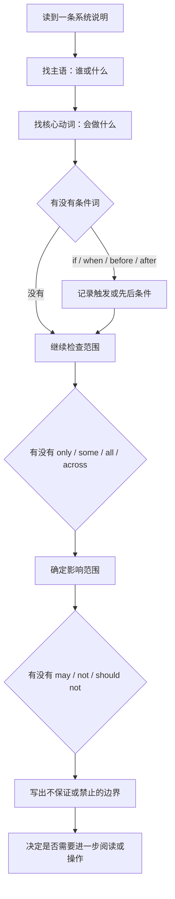

# 读懂说明句：条件、权限、时间与设备关系

系统设置中真正决定操作风险的通常不是按钮，而是按钮旁边那一行灰色说明。`if you forget your password` 说的是恢复条件；`when the volume is muted` 说的是自动触发时机；`only with your consent` 说的是授权边界；`may vary` 说的是不确定性；`across all apps` 说的是范围；`because security settings were modified` 说的是系统已观察到的原因。把它们读完整，才能知道一个开关为什么出现、什么时候生效、影响谁以及不能承诺什么。

> [!warning] 说明句中的限制词不能跳过
>
> `may`、`only`、`when`、`if`、`before`、`instead of`、`across`、`not`、`cannot` 这些词有时只占一两个字符，却决定了功能是否可靠、是否会自动发生、是否需要授权或是否不适合高风险情形。不要为了快速翻译删掉它们；高影响操作前应先完整复述限制条件。

## 学习目标

完成本篇后，你能从一条系统说明中识别对象、动作、条件、范围、原因和限制；理解 if、when、because、may、only、before、after、across、instead of、without 的实际语境；将一条灰色说明改写成“对象—状态—条件—下一步”的中文或英文；并用两组练习避免把可能、自动或限定范围误解成绝对承诺。

## 说明句的六个问题

任何一条说明句都可依次问六个问题：谁或什么对象？系统会做什么？在什么条件下？影响范围多大？为什么或基于什么？有什么不保证？例如 `Your Mac will use on-device intelligence to automatically display captions across all apps. Accuracy of Live Captions may vary and should not be relied upon in high-risk or emergency situations.` 的对象是 Mac 与 Live Captions，动作是自动显示字幕，范围是 across all apps，限制是准确性 may vary 且高风险时不应依赖。

| 要找的成分 | 常见形式 | 你得到的信息 | 例子 |
| --- | --- | --- | --- |
| 对象 | `your Mac`、`apps`、`some data` | 谁受到影响。 | `Some data isn't syncing.` |
| 动作 | `will use`、`allows`、`turn on` | 系统或用户要做什么。 | `Mac will speak the text.` |
| 条件 | `if`、`when`、`while`、`after`、`before` | 什么情况下发生。 | `when the volume is muted` |
| 原因 | `because`、`due to` | 为什么出现这个状态。 | `because security settings were modified` |
| 范围 | `only`、`all`、`some`、`across`、`for` | 影响到哪些对象。 | `across all apps` |
| 限制 | `may`、`cannot`、`should not` | 功能不保证什么或不应怎样使用。 | `Accuracy may vary.` |

## 条件：if、when、while 和 before 不可替换

### if：假设或恢复条件

`Regain access to your account and data if you forget your password or device passcode.` 里的 if 表示“如果发生忘记密码或设备密码的情况”。它不是说系统此刻正在恢复，也不表示任何人都可以重置账户。Recovery Methods 正是为这个未来条件提前准备。

| 结构 | 页面语境 | 正确理解 | 常见误读 |
| --- | --- | --- | --- |
| `if you forget …` | 账户恢复。 | 忘记凭据时的恢复条件。 | 现在就应该重置密码。 |
| `if you need …` | 服务或权限。 | 只有需要时才启用。 | 系统建议每个人都开启。 |
| `if available` | 字幕、设备或功能。 | 资源可用时才会出现。 | 一定有对应资源。 |
| `if enabled` | 开关功能。 | 前提是该功能已开启。 | 即使 Off 也会运行。 |

`if` 可以让操作更安全，因为它迫使你承认前提还没有发生。要表达“只有必要时才改”，可说 `I will enable it only if I need this feature for a specific task.`。

### when：自动触发的时机

`Automatically turn on subtitles when the volume is muted or turned all the way down.` 中的 when 说明系统检测到音量静音或调到最低时，字幕会自动开启。它不是“每次打开字幕都会静音”，也不保证媒体本身有字幕。相同结构还包括 `when command is recognized`、`when you need to perform an action` 和 `when mouse or wireless trackpad is present`。

| 表达 | 触发条件 | 发生的结果 |
| --- | --- | --- |
| `when the volume is muted` | 音量被静音。 | 自动显示字幕。 |
| `when the command is recognized` | 命令被识别。 | 播放识别反馈声音。 |
| `when you need to perform an action` | App 等待你操作。 | 系统朗读对话框文字并通知你。 |
| `when mouse … is present` | 检测到鼠标或无线触控板。 | 可按设置忽略内建触控板。 |
| `when making a purchase` | 正在进行购买。 | 使用交易默认付款资料。 |

### before、after 与 while：顺序、结果和同时发生

`Turn off to complete messages before sending.` 表示先完成消息，再发送；`Resume auto scanning after selection.` 表示选择完成后恢复扫描；`while holding the Command key` 表示按住 Command 的同时执行另一动作。三个词都与时间有关，却分别表达先后、后续和并行。

| 词 | 时间关系 | 可用例句 |
| --- | --- | --- |
| `before` | 先做 A，再做 B。 | `Check the queue before removing the printer.` |
| `after` | 先做 A，之后做 B。 | `Restore the setting after the test.` |
| `while` | A 和 B 同时发生。 | `Press the key while holding Command.` |
| `until` | 一直持续到某时。 | `Keep the device nearby until pairing is complete.` |

> [!tip] 不要把“自动”当作“无条件”
>
> Automatically 往往仍依赖 when、if 或支持范围。例如字幕会在静音时自动显示，但前提是 App 和媒体能提供字幕。读到 automatically 时，继续找后面的条件词和对象，不能只记住“系统会自动做”。

## 权限与范围：allow、only、all、some 和 across

> 本机截图未包含在公开版本中，以保护原图中的个人信息。

权限说明的关键不是 `Allow` 一个动词，而是 allow 谁 access 什么。`Allow apps access to your list of Game Center friends` 的主体是 apps，对象是 Game Center friends list；`Allow applications to request to use Personal Voice` 的主体是 applications，动作是 request，最终用途是 speak aloud。允许请求不等于所有 App 自动获得使用权。

| 词或结构 | 表示的范围 | 例句中的准确含义 |
| --- | --- | --- |
| `allow` | 授予某主体某种能力。 | `Allow apps access to …` |
| `only` | 限定唯一或最小范围。 | `only with your consent` |
| `all` | 全部。 | `across all apps` |
| `some` | 部分。 | `Some data isn't syncing.` |
| `each` | 逐个。 | `each app separately` |
| `across` | 跨越多个对象或 App。 | `apply across apps` |
| `for` | 用途或适用对象。 | `Use Touch ID for purchases.` |
| `with` | 伴随方式或条件。 | `with your consent` |

`When Apply Across Apps is off, you can control subtitles for each app separately.` 是范围词的好例子。`Across Apps` 开启时，一个 App 中的字幕开关会影响所有 App；关闭后，each app separately 表示逐个应用控制。它不是“字幕彻底关闭”，而是从全局策略改成各应用独立策略。

`This information is sent only with your consent and is submitted anonymously to Apple.` 有两个限制：only with your consent 规定发送需要你的同意；submitted anonymously 描述提交方式。两句都不能删减为“系统会发送信息”。同意的范围、资料类型和当前版本说明仍应逐项阅读。

> [!warning] “允许”也可能只是允许请求
>
> `Allow applications to request to use Personal Voice` 的核心是 request。它允许 App 发起使用申请，并不表示所有 App 已获得长期、无条件的语音使用权。出现请求时仍要检查 App 名称、用途、输出位置和是否能撤销。

## 原因与状态：because、due to、is paused 和 isn't syncing

系统状态说明经常把原因放在 because 后面。`Apple Pay has been disabled because the security settings of this Mac were modified.` 中主语是 Apple Pay，状态是 has been disabled，原因是 security settings were modified。它没有说明具体哪项设置，也没有建议降低安全措施。正确下一步是读当前官方说明、确认设备归属与安全状态，而不是“把安全关掉”。

| 状态句 | 主语 | 状态 | 原因或范围 | 安全的下一步 |
| --- | --- | --- | --- | --- |
| `Saving Is Paused` | 保存过程。 | 已暂停。 | 当前服务或条件待查。 | 确认受影响服务、网络和存储。 |
| `Some data isn't syncing to iCloud.` | 部分数据。 | 没在同步。 | 不是所有资料。 | 查看具体服务，再判断容量或账户。 |
| `Apple Pay has been disabled because …` | Apple Pay。 | 已禁用。 | 与安全设置修改有关。 | 不降低未知安全保护。 |
| `The printer is idle.` | 打印机。 | 空闲。 | 当前未处理任务。 | 查看任务队列与文档状态。 |
| `No Personal Voices` | Personal Voice 项目。 | 当前没有项目。 | 不代表功能永远不可用。 | 只在理解资料与隐私后决定是否创建。 |

`has been disabled` 是现在完成时被动语态，表示某项功能已经被禁用并且当前仍处在该状态。`is paused` 与 `isn't syncing` 是现在进行或现在状态，强调当前过程。句型不同会影响你的判断：一个是服务当前状态，一个是已有变更后的结果；都不等于用户应立即执行危险“修复”。

## 不确定性和禁止：may、cannot、should not

`Accuracy of Live Captions may vary and should not be relied upon in high-risk or emergency situations.` 是系统说明中最重要的安全句型之一。may vary 表示准确性可能变化；should not be relied upon 表示在高风险或紧急情形不应作为依赖依据。它不是“多数情况下可以，当关键时再小心一点”，而是要求你在这类场景使用别的验证渠道。

| 词或句型 | 它表达什么 | 不应误读为 |
| --- | --- | --- |
| `may` | 可能。 | 一定会。 |
| `may vary` | 程度或准确性可能变化。 | 只偶尔有小错误。 |
| `cannot` | 不能。 | 只是不推荐。 |
| `should not be relied upon` | 不应依赖。 | 可以作为唯一高风险依据。 |
| `not available` | 当前不可用。 | 永远不支持。 |
| `requires` | 必须具备前置条件。 | 系统已替你满足。 |

不确定性不是产品缺陷的同义词，它是系统对边界的诚实表述。软件英语学习要把这些边界完整记下来。若页面说 `may need a log out for the changes … to take effect`，你应理解部分变化可能需要注销才生效，不是立即强制注销；若页面说 `may help reduce motion sickness`，你应理解它可能帮助，不是医疗承诺。

## 两个综合练习

### 练习一：把说明句拆成可验证步骤

**情境**：你看到：`Automatically show subtitles when the language of the video you are watching does not match your preferred system language.`

1. 找对象：subtitles 与 video language。
2. 找动作：automatically show subtitles。
3. 找条件：when the video language does not match preferred system language。
4. 找范围：是当前视频语言与系统偏好语言的比较，不是所有视频。
5. 写出验证方法：使用提供字幕的公开视频，改变或观察语言条件；不在重要视频中依赖它。
6. 写出英文复述：`Subtitles may appear automatically when the video language differs from my preferred system language.`

### 练习二：把风险限制改写成行动规则

**情境**：你看到：`Accuracy of Live Captions may vary and should not be relied upon in high-risk or emergency situations.`

1. 圈出 may vary：转写准确性不是保证。
2. 圈出 should not be relied upon：不能把它当作唯一依据。
3. 圈出 high-risk or emergency situations：医疗、紧急、身份、金额、地址和安全指令都应更谨慎。
4. 写出替代渠道：原始声音、书面确认、可信人员或紧急服务。
5. 写出行动句：`I will use Live Captions as an aid, but I will verify critical information through a reliable source.`

## 本篇自测

1. if 和 when 在系统说明中通常分别表达什么？
2. `before sending` 与 `after selection` 的顺序有什么不同？
3. `Allow apps access to …` 应至少补全哪两个对象？
4. `Some data isn't syncing` 为什么不能翻译成“iCloud 全坏了”？
5. `because security settings were modified` 给出了什么，又没有给出什么？
6. `may vary` 和 `should not be relied upon` 怎样改变你的操作判断？
7. 请用英语写出一句包含对象、状态、条件和下一步的排查句。

查看答案

1. if 通常表达假设或恢复条件；when 通常表达发生动作的时机或触发条件。
2. before sending 是先完成消息再发送；after selection 是完成选择后再恢复扫描或执行后续行为。
3. 谁被允许，例如 apps；访问什么，例如 contacts、friends list、camera 或 Personal Voice 的请求能力。
4. 主语是 Some data，范围是部分数据，真实原因还需按具体服务检查。
5. 给出了 Apple Pay 被禁用与安全设置修改有关；没有给出具体改了什么，也没有建议关闭安全保护。
6. 前者说明准确性可能变化，后者规定高风险或紧急情形不能作为唯一依据，因此要使用独立可靠来源确认。
7. 示例：`The printer is idle, but the document is waiting in the queue, so I will check the job status before changing the printer settings.`

## 版本差异与使用方法

本篇例句来自本机 **macOS 27.0 Beta (26A5425a)** 的网络、账户、隐私、辅助功能和设备页面。不同版本可能更改控件位置或具体词语，但条件、范围、原因和限制的阅读方法可直接迁移。读到新页面时，优先保留原文中的限定词，再结合当前页面 Help 与正式文档判断实际行为。
