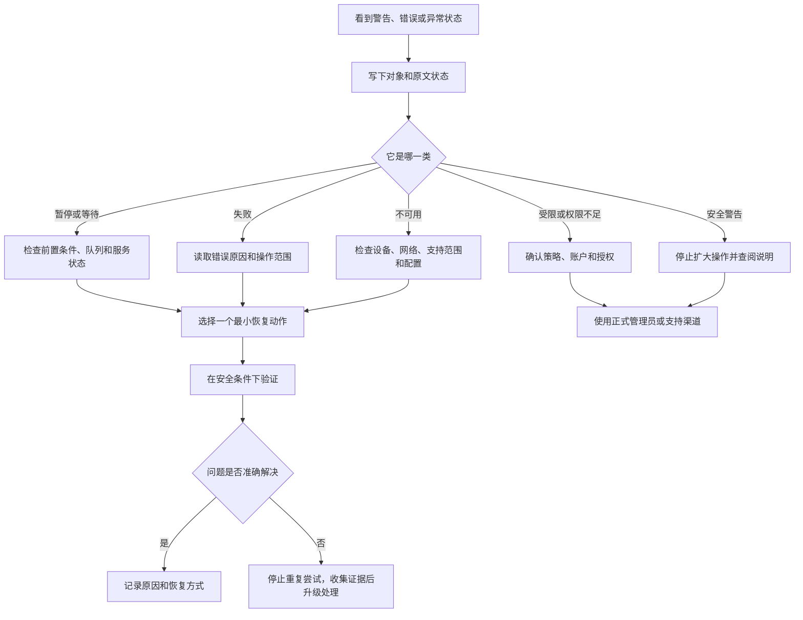

# 描述问题和恢复操作：警告、失败、受限与解决方案

系统设置里许多看上去相似的红字、黄字、灰字和开关状态，实际表示完全不同的事情：`Paused` 是过程暂时停止，`Disabled` 是功能被禁用，`Not Available` 是当前不可用，`Required` 是前置条件，`Failed` 是操作没有完成，`Restricted` 是受策略或权限限制，`Warning` 是需要注意但不一定已经失败。把它们都翻译成“出问题了”，会让下一步变成盲目重启、删除或重置。正确的表达应包含对象、当前状态、已知原因、影响范围和最小恢复动作。

> [!warning] 警告不是要求你立即绕过保护
>
> 当页面提到 security settings、password required、permission denied、restricted、recovery key、high-risk situation 或 emergency 时，优先保护数据和身份边界。不要通过降低安全设置、关闭权限保护、删除账户、退出服务、重置设备或猜测凭据来制造“已修复”的表面状态。先读原文、保留证据、确认对象和恢复路径。

## 学习目标

完成本篇后，你能区分 warning、error、failure、restriction、paused、disabled、unavailable、required 和 recovery；把一句模糊抱怨改写为可排查的英语；使用“先确认、后最小变更、再验证”的恢复流程；知道哪些问题应停止自行操作、查阅 Help、使用正式支持或联系管理员。

## 先对问题做分类

| 类型 | 常见英语 | 它通常意味着 | 不要直接做什么 |
| --- | --- | --- | --- |
| 信息性状态 | `Idle`、`Last Used`、`On`。 | 当前观察到的状态。 | 把它当成成功或失败证明。 |
| 暂停或等待 | `Paused`、`Waiting`、`Pending`。 | 过程还没完成或暂时停止。 | 删除整个配置。 |
| 失败 | `Failed`、`Could not`、`Unable to`。 | 一项具体操作没有完成。 | 重复触发同样操作而不看原因。 |
| 受限 | `Restricted`、`Not allowed`、`Permission denied`。 | 权限、策略、账户或环境阻止操作。 | 绕过策略或猜凭据。 |
| 不可用 | `Unavailable`、`Not available`、`Not configured`。 | 当前条件未满足。 | 假定功能永久不存在。 |
| 安全警告 | `Weak Security`、`High-risk`、`Warning`。 | 有需要理解的风险。 | 忽略或关闭防护以消除提示。 |
| 恢复与重置 | `Recovery`、`Restore`、`Reset`。 | 找回访问、还原设置或重新生成状态。 | 当作轻量排错按钮。 |

## 状态不是结论：Paused、Idle、Disabled 与 Not Configured

`Saving Is Paused`、`The printer is idle`、`Apple Pay has been disabled`、`No Personal Voices` 和 `Not Configured` 看起来都是“某功能不能用”，但语义不同。Paused 表示一个过程暂时停止； Idle 表示设备没有正在处理任务； Disabled 表示一个功能当前被禁用； No Personal Voices 表示目前没有创建项目； Not Configured 表示配置尚未完成。恢复动作必须匹配状态，而不能照搬。

| 原文状态 | 所属对象 | 可能需要检查的范围 | 不应推断 |
| --- | --- | --- | --- |
| `Saving Is Paused` | iCloud 保存或同步。 | 服务、网络、存储、账户状态。 | 本机资料已经被删除。 |
| `Idle` | 打印机。 | 打印队列、文档、纸张、网络。 | 所有打印任务都已完成。 |
| `has been disabled` | Apple Pay 或某项功能。 | 页面给出的原因与安全状态。 | 关闭安全保护就可恢复。 |
| `No Personal Voices` | 个人声音列表。 | 是否确实需要创建、资料与隐私边界。 | 系统故障或无法使用朗读。 |
| `Not Configured` | 服务或账号。 | 是否拥有准确、受授权配置资料。 | 随便填写参数就会成功。 |
| `Off` | 开关。 | 是否需要启用、启用后范围与恢复。 | 项目已删除。 |

> 本机截图未包含在公开版本中，以保护原图中的个人信息。

`Connected` 只说当前已建立连接；`Weak Security` 则表示网络安全配置需要注意。前者不是安全保证，后者也不是“网络无法使用”的同义词。面对安全状态，先确认网络归属和组织要求，不要为了隐藏提示在不理解的情况下修改路由器、加密或系统网络策略。

> [!tip] 先用完整状态句复述
>
> 例如：`The Mac is connected to the network, but the network security is weak.` 或 `The printer is idle, but a job is still waiting in the queue.` 把两个对象与两个状态分开，能显著减少误诊。

## 原因和限制：because、requires、not allowed、only with

系统会用 because 解释已知原因，用 requires 表示前提，用 not allowed 或 permission denied 表示当前不能执行，用 only with 限定授权范围。它们不一定告诉你全部根因，但能排除不安全的猜测。

| 结构 | 页面语境 | 正确读法 | 下一步 |
| --- | --- | --- | --- |
| `because …` | `disabled because security settings …` | 系统将状态与一个原因关联。 | 查明该原因的正式说明。 |
| `requires …` | 密码、权限、网络或设备。 | 该条件是继续前必须满足的前置。 | 不猜测或绕过，确认授权来源。 |
| `not allowed` | 账户、策略或服务操作。 | 当前主体无权或此环境禁止。 | 联系管理员或使用授权账户。 |
| `permission denied` | 文件、隐私或控制访问。 | 请求的访问未获批准。 | 确认具体权限类别与 App。 |
| `only with your consent` | 语音资料或数据提交。 | 需主动同意才会发生。 | 阅读数据范围再决定。 |
| `only people from your contacts` | Game Center 请求。 | 来源被限制在联系人范围。 | 不理解为所有人都可请求。 |

> 本机截图未包含在公开版本中，以保护原图中的个人信息。

Privacy & Security 中的某个权限没有获得批准，不等于“应用坏了”。可能是功能确实不需要、用户尚未同意、组织策略限制、App 尚未正确请求或系统需要重新启动相关流程。排查时必须先确定是哪一个 App、哪一种资源、当前是否有真实任务需要访问，再决定是否授予、保留关闭或联系支持。

> [!warning] Permission denied 不等于应立即授权
>
> 权限被拒绝时，先问“为什么这个 App 需要这项能力”“只在什么任务中使用”“关闭后发生什么”“是否有更小范围替代方式”。特别是 Accessibility、Automation、Input Monitoring、Full Disk Access、Screen Recording、Camera 和 Microphone，授权范围可能大于普通数据读取。

## 恢复、还原、重置和退出：动词不同，后果不同

`Recover` 通常指恢复账户访问；`Restore` 指还原设置、文件或备份；`Reset` 指恢复默认或重新生成特定状态；`Remove` 指移除一个项目；`Delete` 指删除账户、配置或对象；`Sign Out` 指退出账户或服务。它们都可能使问题“看起来消失”，但不表示同一种安全恢复。

| 动词 | 常见对象 | 正确理解 | 开始前必须确认 |
| --- | --- | --- | --- |
| `recover` | account access。 | 重新获得访问权。 | 可信恢复方法是否可用。 |
| `restore` | setting、backup、previous behavior。 | 回到先前状态或从备份还原。 | 要恢复的版本和数据范围。 |
| `reset` | identifier、voice settings、colors。 | 恢复默认或重新生成指定状态。 | 说明中定义的重置范围。 |
| `remove` | fingerprint、service、device。 | 移除明确对象。 | 是否有替代或重新添加方式。 |
| `delete` | account、rule、configuration。 | 删除较完整的对象或配置。 | 数据、连接和依赖是否已处理。 |
| `sign out` | Apple Account、Game Center、Media & Purchases。 | 退出当前账户服务。 | 本机数据、购买、登录与重新进入方式。 |

`Reset Identifier` 只与报告 Game Center 使用统计的标识符相关；它不等于删除好友、购买、游戏进度或 Apple Account。`Restore the previous setting` 是把一个测试项回到记录的原值；它不是从 Time Machine 恢复整台 Mac。遇到重置类按钮，先找对象名和说明句，不能只根据“reset”判断安全性。

### 案例一：把一个“无法使用”问题变成可验证描述

**情境**：用户说“iCloud 不行了”。

1. 不要马上退出 Apple Account、升级订阅、删除服务或改密码。
2. 打开 iCloud 页面，确认原文状态是 `Saving Is Paused`、`Some data isn't syncing` 还是某个具体服务显示异常。
3. 记录对象：是 Photos、Drive、Notes、Mail，还是账户整体；本文不记录真实项目数或个人资料。
4. 记录状态：paused、not syncing、storage full、not available 或 requires sign-in。
5. 选择最小下一步：检查受影响服务、网络、存储和账户状态；若需要账户安全变更，先确认恢复方法。
6. 用英语改写：`Some data is not syncing to iCloud. I will identify the affected service and check its status before signing out or changing account settings.`

## 警告与高风险：应该停止、验证还是升级处理

高风险不是“系统显示红色”这么简单。页面可能明确说 `should not be relied upon in high-risk or emergency situations`，可能显示 Weak Security，可能要求 password 或 recovery key，也可能提示这是组织管理设备的限制。共同点是：继续试错的成本可能高于暂停确认的成本。

| 信号 | 应做什么 | 不应做什么 |
| --- | --- | --- |
| `high-risk or emergency` | 使用原始信息、可信人员或紧急渠道复核。 | 只凭自动字幕、自动识别或单一界面提示决策。 |
| `Weak Security` | 确认网络归属、加密配置和组织要求。 | 随意改路由器或关闭保护。 |
| `Recovery Key` | 了解当前官方流程和保管后果。 | 为学习创建、复制或公开真实密钥。 |
| `Password Required` | 使用自己的合法凭据或恢复方法。 | 尝试绕过、共享密码或猜测。 |
| `Managed` / policy restriction | 查阅组织政策或联系管理员。 | 试图解除设备管理。 |
| `Permission denied` | 判断具体 App、资源和真实用途。 | 全盘授予高权限。 |

> [!warning] 重复失败不是更多尝试的理由
>
> 同一个操作在没有新证据的情况下反复失败，继续重复可能带来账户锁定、重复任务、数据冲突、噪声日志或更大的配置变化。应保留原文错误、时间、页面路径和已尝试的可逆步骤，再使用 Help、正式文档、厂商支持或管理员渠道升级处理。

### 案例二：从一个高风险提示得出正确行动

**情境**：Live Captions 生成了一段看似合理的文字，但内容涉及紧急地点或重要金额。

1. 读出页面的限制：`Accuracy … may vary` 与 `should not be relied upon in high-risk or emergency situations.`
2. 识别风险：地点和金额属于一旦误听就会产生重大后果的信息。
3. 停止把字幕当作唯一输入，不要根据它发送付款、前往地点或下达紧急指令。
4. 使用原始声音、书面确认、可信人员或正式紧急渠道复核。
5. 若需要记录问题，写“字幕与原始信息不一致”，不要记录私人姓名、号码或通话内容到讲义。
6. 用英语说：`Live Captions helped me notice that information was being spoken, but I verified the critical details through a reliable source.`

## 可直接使用的故障与恢复英语

| 你想表达的意思 | 英文表达 | 使用说明 |
| --- | --- | --- |
| 这个功能当前已暂停。 | `This feature is currently paused.` | 仍需补充对象。 |
| 部分资料没有同步。 | `Some data is not syncing.` | 不扩大成所有数据。 |
| 该操作需要额外权限。 | `This action requires additional permission.` | 下一步是确认具体权限。 |
| 我不清楚重置会影响什么。 | `I do not understand what the reset will affect.` | 应先停止点击并阅读说明。 |
| 我会先检查队列，再移除设备。 | `I will check the queue before removing the device.` | 体现最小影响排查。 |
| 这项服务受当前策略限制。 | `This service is restricted by the current policy.` | 适合组织管理场景。 |
| 我需要一个可靠的恢复方式。 | `I need a reliable recovery method before changing this setting.` | 适合账户与安全变更。 |

## 本篇自测

1. Paused、Disabled 与 Not Configured 的核心区别是什么？
2. 为什么 Connected 与 Weak Security 可以同时出现？
3. Permission denied 后应先问哪些问题？
4. Recover、Restore、Reset、Remove、Delete 和 Sign Out 为什么不能互换？
5. 面对重复失败，应该保留哪些信息再升级处理？
6. 为什么 Live Captions 不适合单独处理紧急信息？
7. 请将“打印机没反应”改写成一条可排查的英文句子。

查看答案

1. Paused 是过程暂时停止；Disabled 是功能当前被禁用；Not Configured 是配置还未完成。对象和说明决定具体恢复方式。
2. Connected 描述当前已连接，Weak Security 描述该网络安全配置存在风险；连接成功不等于安全足够。
3. 哪个 App、请求哪种资源、完成什么真实任务、是否有更小范围替代、关闭后会怎样。
4. 它们分别涉及重新获得访问、还原先前状态、恢复默认或标识、移除对象、删除配置和退出服务，范围不同。
5. 原文错误、时间、页面路径、受影响对象、已尝试的可逆步骤和没有改变过的高影响设置。
6. 准确性可能变化，且页面明确说高风险或紧急情形不应依赖。
7. 示例：`The printer is idle, but the document has not appeared in the print queue, so I will check the print dialog and selected device first.`

## 版本差异与使用方法

本篇状态词与例句来自本机 **macOS 27.0 Beta (26A5425a)** 的 Wi‑Fi、iCloud、Privacy & Security、Live Captions、Wallet 和打印机页面。不同版本的具体错误文案可能不同，但“对象—状态—原因—范围—最小恢复动作”的排查方法不变。只有在当前页面、Help 或正式支持资料证明影响范围后，才应执行重置、删除、退出、账户或安全变更。
