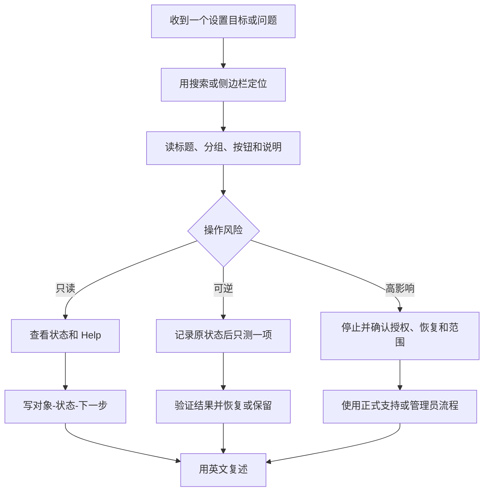

# 综合自测：从找到设置到用英语说明结果

学完系统设置英语后，真正的检验不是能否翻译一个按钮，而是遇到目标时能否完成完整链路：知道要去哪个分类，读懂页面标题和说明句，判断这是只读、可恢复还是高影响操作，选择最小范围的下一步，验证结果并用英语说明发生了什么。本篇把网络、账户、隐私、辅助功能、设备和常见状态放回任务中。它不要求你修改真实配置，也不鼓励用危险动作证明自己会操作。

> [!warning] 自测不等于执行高影响操作
>
> 本篇的“操作”默认是导航、阅读、核对状态和在安全页面测试一个可恢复选项。不要为了完成题目添加账户、修改密码、创建恢复密钥、调整付款、删除设备、关闭安全保护、授权高权限、连接陌生网络或打印私人资料。若题目涉及这些动作，只需说明正确路径、影响和应先确认的条件。

## 学习目标

完成本篇后，你能够在不求助 AI 的情况下，用系统搜索和目录找到目标页面；把完整界面英语转为任务判断；用对象—状态—条件—下一步描述问题；选择可逆测试而不是扩大操作；并写出一段自然英文，解释你做了什么、看到了什么以及为什么保留或恢复设置。

## 一套通用的六步法

| 步骤 | 你要做什么 | 需要说出的英语 |
| --- | --- | --- |
| 1. 定位 | 找到正确的分类和页面。 | `I opened … in System Settings.` |
| 2. 识别 | 找标题、对象、分组和控件类型。 | `This page manages …` |
| 3. 阅读 | 读完整说明，找条件、范围和限制。 | `The setting applies when …` |
| 4. 判断 | 区分只读、可逆或高影响动作。 | `This change would affect …` |
| 5. 验证 | 只做最小安全测试或保持只读。 | `I tested one reversible option …` |
| 6. 复述 | 说明状态、结果、恢复或升级路径。 | `I restored … because …` |

六步法的重点不在速度，而在避免错误链条：在错误页面操作、只看按钮不看说明、把状态误读为原因、把危险动作当作排错、验证后忘记恢复、最后只能说“我调了一下”。如果任何一步不清楚，下一步应是 Help、主题讲义或受授权支持，而不是继续点击。

## 开始前的自测规则

1. 只使用你拥有或受授权的 Mac、账户和设备。
2. 不把真实姓名、邮箱、号码、网络名称、地址、卡片、密码、密钥、设备编号、工作目录或私人内容写入答案。
3. 所有截图中的动态资料都只作为界面背景，不作为学习词或判断依据。
4. 如需修改，先记录原状态，并只改一个能通过同一路径恢复的选项。
5. 遇到 `Delete`、`Sign Out`、`Reset`、`Add Account`、`Change Password`、`Recovery Key`、付款、权限或网络安全设置，默认停止在“说明影响与路径”这一步。
6. 每题都用至少一句英语描述对象、状态或下一步。

> [!tip] 可恢复测试的三个条件
>
> 第一，知道开始时的状态；第二，知道在哪里关闭或改回；第三，测试对象不含私人或不可逆内容。只满足其中一个条件不够。例如知道开关位置但不知道它影响哪些 App，仍不应随意测试。

## 第一组：定位与页面结构

### 任务 1：我要让系统朗读一段选中的文字

**目标判断**：这不是 VoiceOver 总览，也不是普通 Sound 页面。目标是 Read & Speak 中的选中文本朗读能力。

1. 写出路径：`System Settings → Accessibility → Vision → Read & Speak`。
2. 在页面中找出 `Hear selected text spoken aloud.`。
3. 解释 `selected text` 的范围为何比“读整页界面”小。
4. 说明你会选择哪种安全材料测试：公开短句、系统帮助文字或本讲义的英文句子。
5. 写出完成句：`I found the selected-text speech option. I would test it with a short public sentence, not with private text.`

**检查点**：若答案只写“打开声音”或“打开 VoiceOver”，说明没有完成对象定位。

### 任务 2：我要检查一个账户到底同步了哪些服务

**目标判断**：进入 Internet Accounts，而不是直接退出 Apple Account 或打开 Mail App。

1. 写出路径：`System Settings → Internet Accounts`。
2. 找到账户服务摘要中的 `Mail`、`Contacts`、`Calendars`、`Notes`。
3. 进入 Details 时只读服务开关，不记录账户名称、邮箱、服务器或组织资料。
4. 解释关闭 Calendars 与 `Delete Account…` 的影响差异。
5. 写出完成句：`I reviewed the enabled services before deleting anything. Turning off Calendars has a smaller scope than deleting the account from this Mac.`

### 任务 3：我想确认打印机为什么没有输出文件

**目标判断**：先区分 Default printer、设备状态和 Print Queue。

1. 写出路径：`System Settings → Printers & Scanners`。
2. 解释 `Idle` 只代表什么，不代表什么。
3. 先查看 Print Queue，再看文档的打印对话框、纸张与 Options。
4. 不点击 Remove Printer。
5. 写出完成句：`The printer is idle, but I will check whether the document is waiting in the print queue before removing the printer.`

## 第二组：条件、状态与范围

> 本机截图未包含在公开版本中，以保护原图中的个人信息。

### 任务 4：网络已连接，但系统提示安全较弱

页面可能同时显示 `Connected` 与 `Weak Security`。请完成以下判断：

1. `Connected` 的对象是连接关系；它不保证网络安全、速度、认证或隐私。
2. `Weak Security` 是安全警示；它不一定意味着网络立即不可用。
3. 不要为了练习修改路由器加密、关闭防护或加入陌生网络。
4. 应确认网络归属、组织要求、当前加密方案与是否应使用受信任网络。
5. 英语复述：`The Mac is connected to the network, but the security warning requires further review. I will not change network security settings without understanding the impact.`

### 任务 5：iCloud 显示“部分数据未同步”

1. 找主语：`Some data`，不是所有数据。
2. 找状态：`isn't syncing`，不是“已经删除”。
3. 找具体服务：可能是某个云端服务，而不是整个账户。
4. 最小下一步：查看受影响服务、网络、存储和账户状态。
5. 不立即执行 Sign Out、Upgrade、Delete 或 Change Password。
6. 英语复述：`Some data is not syncing to iCloud. I will identify the affected service before changing my account or storage settings.`

### 任务 6：字幕会在什么条件下自动出现

1. 阅读 `Automatically turn on subtitles when the volume is muted or turned all the way down.`。
2. 提取条件：volume is muted 或 turned all the way down。
3. 提取结果：turn on subtitles。
4. 提取限制：媒体与 App 仍需提供可用字幕。
5. 英语复述：`Subtitles can turn on automatically when the volume is muted, provided that the app and media support subtitles.`

## 第三组：权限与最小授权

> 本机截图未包含在公开版本中，以保护原图中的个人信息。

### 任务 7：一个 App 请求访问麦克风

不要只回答“允许”或“拒绝”。应完成以下判断：

1. 对象是谁：哪个 App。
2. 资源是什么：Microphone。
3. 用途是什么：会议、录音、听写、语音控制，还是无法解释的功能。
4. 范围是什么：只在运行时，还是持续后台需求。
5. 恢复方式是什么：可在 Privacy & Security 的对应类别关闭。
6. 英语复述：`This app requests microphone access for a specific task. I will allow it only if I understand why the task needs audio input and how to revoke the permission later.`

### 任务 8：一项辅助功能要求摄像头或声音输入

例如 Head Pointer 使用摄像头捕捉头部移动，Voice Control 使用麦克风识别语音。你的回答应包括：

- 功能目标：替代指针或替代输入。
- 输入来源：camera 或 microphone。
- 环境边界：不要在共享、会议、私人资料或陌生环境中首次测试。
- 恢复：回到对应 Accessibility 页面关闭刚开启的一项功能。
- 英语表达：`I will test the alternative control in a private and non-sensitive environment because it uses camera or microphone input.`

> [!warning] 权限与功能开关是两层状态
>
> 一个 App 可以已经有 Microphone permission，但 Voice Control 仍是 off；一个功能开关可以 on，但当前设备或 App 仍不支持具体操作。排查时同时确认“是否有权限”和“功能是否开启”，不要只看其中一个。

## 第四组：账户、设备和恢复

### 任务 9：我担心以后忘记账户密码

1. 路径是 `Apple Account → Sign-In & Security → Recovery Methods`。
2. 区分 Two-Factor Authentication 和 Recovery Methods：前者核验当前登录，后者为失去凭据后的恢复做准备。
3. 只读理解 Recovery Contacts、Recovery Key 和 Legacy Contact，不在讲义练习中点击 Set Up。
4. 确认至少有受自己控制的可信设备或恢复方式后，才考虑高影响账户变更。
5. 英语复述：`I will review recovery methods while I still have normal account access. I will not create or expose a recovery key just to practice the interface.`

### 任务 10：我想让小字更容易阅读

1. 比较 Text size、Zoom、Hover Text、Increase contrast 和 Reduce transparency 的范围。
2. 选择影响最小的方案：偶发局部文字先考虑 Hover Text；全局阅读大小才考虑 Text size；整体可见区域才考虑 Zoom。
3. 在无私人内容的页面测试一个选项，记录原状态。
4. 如果不合适，使用同一路径恢复，不叠加更多视觉设置。
5. 英语复述：`I tested one reversible visual setting on a safe page and restored it when it did not improve readability.`

## 第五组：从问题到可行动的英语说明

下面每一题先写对象、状态、原因或条件、最小下一步，再写一句完整英文。

| 模糊说法 | 要补充的事实 | 可用英文 |
| --- | --- | --- |
| “网络不行。” | 网络名称不写入；连接、认证、安全还是信号问题？ | `The Mac is connected, but the network security needs review.` |
| “iCloud 坏了。” | 哪个服务、是否 paused、是否 syncing。 | `Some data is not syncing, so I will check the affected service.` |
| “打印机不动。” | 设备 idle、任务是否在队列、纸张与选项。 | `The document is waiting in the print queue.` |
| “字幕不准。” | 是媒体字幕还是 Live Captions，是否高风险。 | `Live Captions may be inaccurate, so I will verify the original audio.` |
| “账户进不去。” | 本机用户还是 Apple Account，是否有恢复方式。 | `I need to confirm a reliable recovery method before changing account settings.` |
| “这个 App 没权限。” | 哪个 App、哪种资源、哪项任务。 | `The app does not have permission to access the camera for this task.` |

`so` 适合从观察到的事实导出最小下一步；不要用它跳到破坏性动作。例如 `The account is not syncing, so I will sign out` 缺少中间验证。更稳妥的是 `The account is not syncing, so I will identify the affected service before changing account settings.`。

## 两个完整的期末情境

### 情境 A：会议前需要听清并看到文字

**任务**：你将在公开会议中使用 Mac，希望视频内容有字幕、自己偶尔可朗读选中文本，但不希望泄露私人输入或依赖不准确转写。

1. 确认公开会议中哪些内容可被声音读出；不要启用键入回声。
2. 对媒体自身提供的字幕，使用 Subtitles and Captioning；对 Live Captions，先阅读 `Accuracy may vary` 与高风险限制。
3. 需要朗读时，只对公开的选中文本使用 Read & Speak；检查输出设备和音量。
4. 不把 Live Captions 作为金额、地址、身份或紧急信息的唯一依据。
5. 会议结束后恢复本次开启的局部功能，确认没有继续朗读或自动字幕行为。
6. 英语总结：`I used subtitles and selected-text speech as accessibility aids, but I verified critical information through the original source and restored the temporary settings after the meeting.`

### 情境 B：新设备接入办公室网络和打印服务

**任务**：一台新 Mac 需要使用办公室 Wi‑Fi 与共享打印机，但你没有管理员参数。

1. 不猜测 Wi‑Fi 密码、服务器、驱动、打印机地址或组织账户。
2. 在 Wi‑Fi 页阅读连接和安全状态；在 Printers & Scanners 页阅读 Add Printer 的完整范围。
3. 向管理员索取正式网络、设备、认证与驱动说明。
4. 添加后先用无敏感测试页验证队列、纸张和输出；不要打印正式合同或私人文件。
5. 若打印失败，先定位是队列、文档、网络还是选项，而不删除设备。
6. 英语总结：`I will use the approved network and printer details. After setup, I will test a non-sensitive page and check the queue before changing or removing the printer.`

## 自测评分表

| 能力 | 0 分 | 1 分 | 2 分 |
| --- | --- | --- | --- |
| 找页面 | 只能猜菜单。 | 能找到大分类。 | 能给出准确路径与主题。 |
| 读对象 | 只翻译按钮。 | 能说大致功能。 | 能说主体、资源、范围和状态。 |
| 读条件 | 忽略 if、when、may。 | 能找一个条件词。 | 能完整说明条件、限制和结果。 |
| 判断风险 | 直接操作。 | 知道有风险但无恢复方案。 | 能区分只读、可逆、高影响并说明原因。 |
| 英语表达 | 只说单词。 | 有简单句。 | 有对象、状态、条件和最小下一步。 |
| 恢复验证 | 不知道怎样改回。 | 知道大概路径。 | 记录原状态并验证恢复结果。 |

总分 10–12 分：已能独立用系统英语完成低风险查阅与表达；7–9 分：继续复习状态、条件和恢复结构；0–6 分：回到对应主题页，用真实页面逐句朗读说明，再完成一个只读任务。分数只用于决定下一步学习，不等同于账户、网络、设备或安全操作授权。

## 本篇自测

1. 六步法中，为什么风险判断必须在实际变更之前？
2. 访问麦克风时，权限状态与功能开关为什么要同时检查？
3. 遇到 iCloud 未同步，最小下一步是什么？
4. 什么时候应从可逆测试升级到管理员或正式支持流程？
5. 在会议中使用 Live Captions 时，怎样处理关键内容？
6. 添加组织打印机前，哪些资料不能猜测？
7. 写一句包含路径、状态和下一步的英文说明。

查看答案

1. 因为不同按钮和开关的影响范围不同，风险判断决定你是只读、做可恢复测试，还是停止并准备恢复与授权。
2. 有权限不代表功能已开启；功能开启也不代表当前 App、设备或环境可用。两层状态会共同影响结果。
3. 确认受影响的具体服务、其当前状态、网络、存储与账户条件，再决定是否有必要进行账户或存储变更。
4. 需要凭据、管理员权限、组织网络参数、设备驱动、付款、账户恢复、安全策略或同一可逆步骤反复失败而没有新证据时。
5. 将其当作辅助，关键金额、地址、身份、医疗或紧急信息通过原始声音、书面确认或可信人员复核。
6. 网络密码、服务器地址、认证方式、驱动、设备策略、账户与组织参数。
7. 示例：`I opened Printers & Scanners, found that the printer is idle, and will check the print queue before changing the device configuration.`

## 版本差异与后续学习

本篇综合题来自本机 **macOS 27.0 Beta (26A5425a)** 的实际 System Settings 页面与本讲义各主题内容。不同 macOS 版本的分类和按钮可能变化，但“定位—阅读—判断—最小变更—验证—复述”的工作方法不变。完成本篇后，可返回自己最常用的软件页面，将同一方法应用到浏览器、办公软件、开发工具和设备管理界面：先保存原文与语境，再学表达，最后才决定是否需要配置改变。
