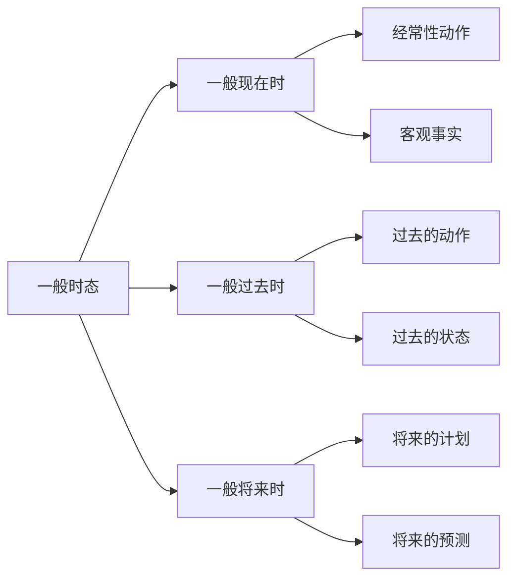
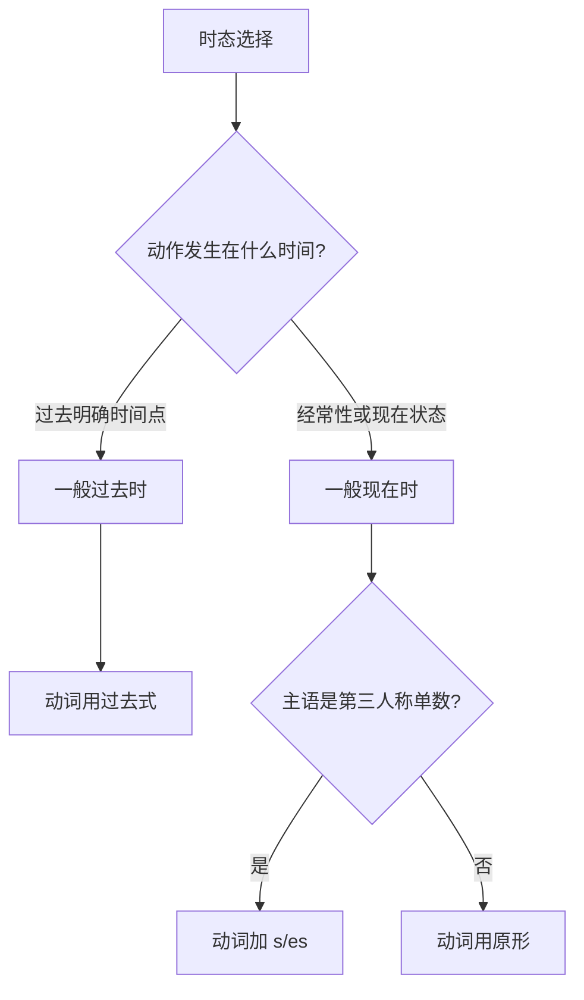
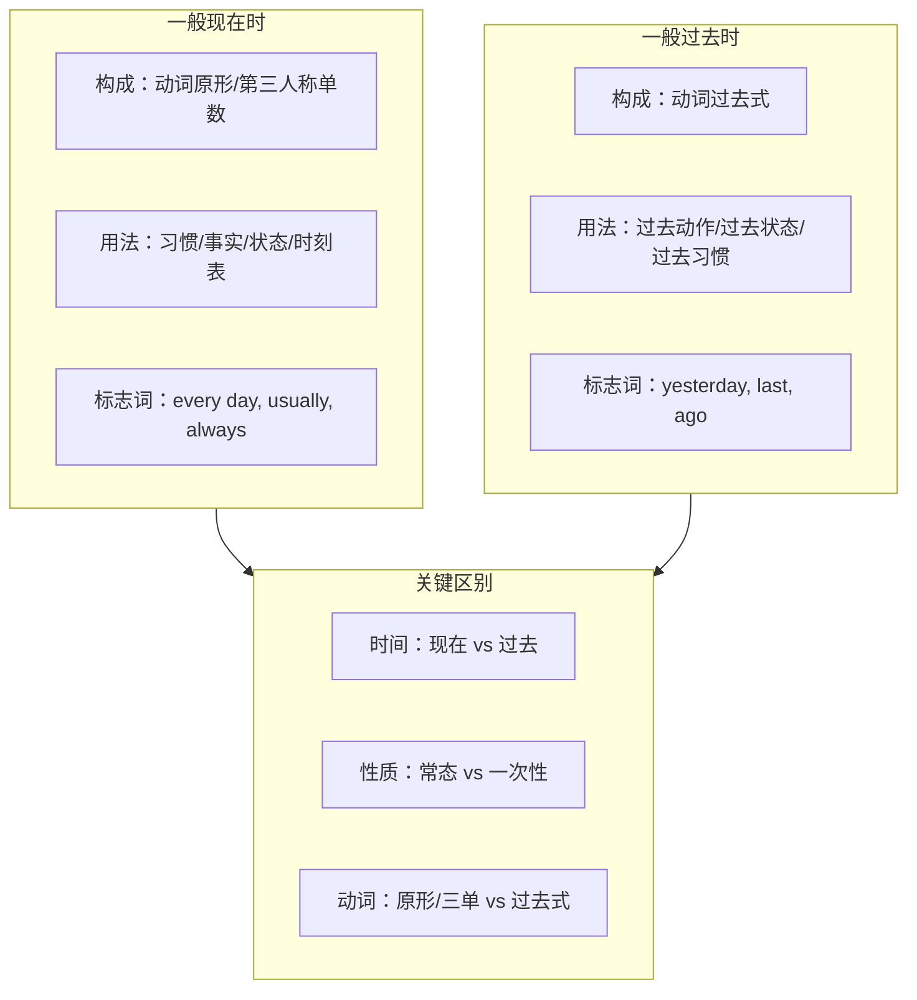

# 一般现在时与一般过去时

时态（Tense）是英语动词最重要的语法范畴之一，它通过动词形式的变化来表示动作或状态发生的时间。在英语的十二种基本时态中，**一般现在时（Simple Present Tense）** 和 **一般过去时（Simple Past Tense）** 是最基础、使用频率最高的两种时态。掌握这两种时态，是学好英语时态系统的第一步。

本文将从构成规则、使用场景、动词变化、易错点辨析等多个维度，系统讲解这两种时态的核心知识。

---

## 1. 时态概述与核心概念

### 1.1 什么是时态

时态是动词的一种形式变化，用来表示动作或状态发生的**时间**以及动作的**完成程度**。英语中，时态由两个要素构成：

1. **时（Time）**：表示动作发生的时间点
   - 现在（Present）
   - 过去（Past）
   - 将来（Future）

2. **态（Aspect）**：表示动作的状态或完成情况
   - 一般（Simple）：表示经常性、习惯性或客观事实
   - 进行（Progressive/Continuous）：表示正在进行
   - 完成（Perfect）：表示已经完成
   - 完成进行（Perfect Progressive）：表示持续进行到某个时间点

> [!info] 时态的本质
>
> 时态不仅仅是"时间"的概念，更是说话者对动作或状态的**主观认知和表达方式**。同一个事件，使用不同的时态表达，传递的信息和语气可能完全不同。

### 1.2 一般时态的特点

"一般时态"（Simple Tenses）是最基础的时态类型，包括一般现在时、一般过去时和一般将来时。它们的共同特点是：

| 特点 | 说明 |
| --- | --- |
| 形式简洁 | 动词变化规则相对简单 |
| 表示常态 | 强调动作的经常性、习惯性或事实性 |
| 不强调过程 | 关注动作本身，而非动作的进行过程 |
| 时间明确 | 通常与明确的时间状语搭配 |

上图展示了一般时态的三种类型及其主要用法。一般现在时用于表示经常性动作和客观事实；一般过去时用于描述过去发生的动作或存在的状态；一般将来时则用于表达将来的计划或预测。

---

## 2. 一般现在时详解

### 2.1 一般现在时的定义

**一般现在时（Simple Present Tense）** 用于描述：
- 经常性、习惯性的动作
- 客观事实和真理
- 当前的状态或特征
- 按时刻表或计划进行的将来动作

> [!tip] 核心理解
>
> 一般现在时的核心含义是**"不受时间限制的常态"**。它表达的内容在过去是真的，在现在是真的，在将来可能仍然是真的。

### 2.2 一般现在时的构成

一般现在时的构成取决于主语的人称和数。

#### 2.2.1 肯定句构成

| 主语 | 动词形式 | 例句 |
| --- | --- | --- |
| I / You / We / They | 动词原形 | I **work** every day. |
| He / She / It | 动词原形 + s/es | She **works** every day. |

**第三人称单数动词变化规则**：

| 动词结尾 | 变化规则 | 示例 |
| --- | --- | --- |
| 一般情况 | 直接加 -s | work → works, play → plays |
| 以 s, x, ch, sh, o 结尾 | 加 -es | watch → watches, go → goes |
| 以辅音字母 + y 结尾 | 变 y 为 i，加 -es | study → studies, fly → flies |
| 以元音字母 + y 结尾 | 直接加 -s | play → plays, stay → stays |

> [!example] 第三人称单数变化示例
>
> - He **reads** books every night.（他每晚读书。）
> - She **watches** TV after dinner.（她晚饭后看电视。）
> - The sun **rises** in the east.（太阳从东方升起。）
> - Tom **studies** hard for the exam.（汤姆为考试努力学习。）

#### 2.2.2 否定句构成

一般现在时的否定句需要借助助动词 **do/does**：

| 主语 | 否定结构 | 例句 |
| --- | --- | --- |
| I / You / We / They | do not (don't) + 动词原形 | I **don't work** on Sundays. |
| He / She / It | does not (doesn't) + 动词原形 | She **doesn't work** on Sundays. |

> [!warning] 易错点
>
> 在否定句中，**助动词 does 已经体现了第三人称单数**，因此主动词必须恢复原形：
> - ✅ She **doesn't like** coffee.
> - ❌ She doesn't likes coffee.

#### 2.2.3 疑问句构成

**一般疑问句**：将助动词 do/does 提到主语之前

| 结构 | 例句 | 肯定回答 | 否定回答 |
| --- | --- | --- | --- |
| Do + I/you/we/they + 动词原形? | Do you like music? | Yes, I do. | No, I don't. |
| Does + he/she/it + 动词原形? | Does she speak English? | Yes, she does. | No, she doesn't. |

**特殊疑问句**：疑问词 + do/does + 主语 + 动词原形?

| 疑问词 | 例句 | 中文 |
| --- | --- | --- |
| What | What do you do? | 你做什么工作？ |
| Where | Where does he live? | 他住在哪里？ |
| When | When do they arrive? | 他们什么时候到达？ |
| Why | Why does she cry? | 她为什么哭？ |
| How | How do you go to school? | 你怎么去学校？ |

### 2.3 一般现在时的用法

#### 2.3.1 表示经常性、习惯性的动作

这是一般现在时最常见的用法，通常与频率副词连用：

| 频率副词 | 频率 | 例句 |
| --- | --- | --- |
| always | 100% | I always get up at 6 a.m. |
| usually | 80% | She usually walks to school. |
| often | 60% | They often play basketball. |
| sometimes | 40% | He sometimes forgets his keys. |
| seldom/rarely | 20% | We seldom eat out. |
| never | 0% | I never drink alcohol. |

> [!example] 习惯性动作示例
>
> - I **drink** coffee every morning.
>   - 我每天早上喝咖啡。
>   - 句法分析：主语(I) + 谓语(drink) + 宾语(coffee) + 时间状语(every morning)
>
> - My father **reads** the newspaper before breakfast.
>   - 我父亲早餐前读报纸。
>   - 句法分析：主语(My father) + 谓语(reads) + 宾语(the newspaper) + 时间状语(before breakfast)
>
> - They **go** to church on Sundays.
>   - 他们周日去教堂。
>   - 句法分析：主语(They) + 谓语(go) + 地点状语(to church) + 时间状语(on Sundays)

#### 2.3.2 表示客观事实和普遍真理

用于描述科学事实、自然规律、格言谚语等不受时间限制的内容：

> [!example] 客观事实示例
>
> - The earth **revolves** around the sun.
>   - 地球绕太阳公转。
>   - 这是天文学事实，永恒不变。
>
> - Water **boils** at 100 degrees Celsius.
>   - 水在 100 摄氏度沸腾。
>   - 这是物理学规律。
>
> - Light **travels** faster than sound.
>   - 光传播比声音快。
>   - 这是自然科学真理。
>
> - Actions **speak** louder than words.
>   - 行动胜于言辞。
>   - 这是格言谚语。

#### 2.3.3 表示当前的状态、特征或能力

描述主语的性质、特征、职业、身份等：

> [!example] 状态特征示例
>
> - She **is** a doctor.
>   - 她是一名医生。
>   - 表示职业身份。
>
> - This bag **weighs** 5 kilograms.
>   - 这个包重 5 公斤。
>   - 表示客观属性。
>
> - He **speaks** three languages fluently.
>   - 他流利地说三门语言。
>   - 表示能力特征。
>
> - The museum **opens** at 9 a.m.
>   - 博物馆上午 9 点开门。
>   - 表示固定规则。

#### 2.3.4 表示按时刻表或计划发生的将来动作

当动作是按固定时刻表、日程安排进行时，可用一般现在时表示将来：

> [!example] 时刻表将来示例
>
> - The train **leaves** at 8:30 tomorrow morning.
>   - 火车明天早上 8:30 出发。
>   - 火车时刻表是固定的。
>
> - The meeting **starts** at 2 p.m.
>   - 会议下午 2 点开始。
>   - 会议日程已经确定。
>
> - The plane **arrives** at midnight.
>   - 飞机午夜到达。
>   - 航班时刻表已定。

> [!warning] 使用限制
>
> 这种用法仅限于**交通工具的时刻表**或**已确定的日程安排**，不能随意用于普通的将来动作：
> - ✅ The bus **leaves** at 6 p.m.（公交车时刻表）
> - ❌ I **leave** for Paris tomorrow.（应该用 will leave 或 am leaving）

#### 2.3.5 在时间和条件状语从句中代替将来时

在由 when, before, after, until, as soon as, if, unless 等引导的从句中，用一般现在时表示将来：

> [!example] 从句中的一般现在时
>
> - I will call you **when I arrive**.
>   - 我到达时会给你打电话。
>   - when 引导的时间状语从句用一般现在时。
>
> - **If it rains** tomorrow, we will stay at home.
>   - 如果明天下雨，我们就待在家里。
>   - if 引导的条件状语从句用一般现在时。
>
> - Please wait here **until she comes** back.
>   - 请在这里等到她回来。
>   - until 引导的时间状语从句用一般现在时。
>
> - **As soon as the meeting ends**, I will go home.
>   - 会议一结束，我就回家。
>   - as soon as 引导的时间状语从句用一般现在时。

### 2.4 一般现在时的时间标志词

识别以下时间状语，可以帮助判断是否使用一般现在时：

| 类型 | 时间标志词 |
| --- | --- |
| 频率副词 | always, usually, often, sometimes, seldom, rarely, never |
| 频率短语 | every day/week/month/year, once a week, twice a month |
| 时间短语 | in the morning, on Sundays, at night |
| 其他 | nowadays, these days（表示当前阶段的习惯） |

---

## 3. 一般过去时详解

### 3.1 一般过去时的定义

**一般过去时（Simple Past Tense）** 用于描述：
- 过去某一时间发生的动作
- 过去某一时间存在的状态
- 过去的习惯性动作

> [!tip] 核心理解
>
> 一般过去时的核心含义是**"与现在无关的过去"**。它描述的动作或状态已经结束，不再延续到现在。

### 3.2 一般过去时的构成

#### 3.2.1 肯定句构成

一般过去时的肯定句使用**动词的过去式**，所有人称形式相同：

| 主语 | 动词形式 | 例句 |
| --- | --- | --- |
| 所有人称 | 动词过去式 | I/You/He/She/We/They **worked** yesterday. |

**规则动词过去式变化规则**：

| 动词结尾 | 变化规则 | 示例 |
| --- | --- | --- |
| 一般情况 | 直接加 -ed | work → worked, play → played |
| 以 e 结尾 | 直接加 -d | live → lived, like → liked |
| 以辅音字母 + y 结尾 | 变 y 为 i，加 -ed | study → studied, cry → cried |
| 以重读闭音节结尾（辅元辅） | 双写末尾辅音字母，加 -ed | stop → stopped, plan → planned |

> [!info] -ed 的发音规则
>
> | 动词结尾 | 发音 | 示例 |
> | --- | --- | --- |
> | 清辅音（除 t） | /t/ | worked /wɜːkt/, helped /helpt/ |
> | 浊辅音或元音 | /d/ | played /pleɪd/, lived /lɪvd/ |
> | t 或 d | /ɪd/ | wanted /ˈwɒntɪd/, needed /ˈniːdɪd/ |

**不规则动词过去式**：

英语中有大量不规则动词，其过去式需要单独记忆：

| 原形 | 过去式 | 原形 | 过去式 |
| --- | --- | --- | --- |
| be | was/were | go | went |
| have | had | do | did |
| say | said | make | made |
| get | got | see | saw |
| come | came | take | took |
| know | knew | think | thought |
| give | gave | find | found |
| tell | told | become | became |
| leave | left | feel | felt |
| bring | brought | begin | began |
| write | wrote | read | read /red/ |
| run | ran | sit | sat |
| stand | stood | understand | understood |
| lose | lost | pay | paid |
| meet | met | set | set |
| put | put | cut | cut |
| let | let | hurt | hurt |

> [!warning] 常见易错不规则动词
>
> - read 的过去式拼写不变，但发音变为 /red/
> - cut, put, let, set, hurt 等动词的三种形式完全相同
> - lay（放置）的过去式是 laid，不要与 lie（躺）的过去式 lay 混淆

#### 3.2.2 否定句构成

一般过去时的否定句使用助动词 **did not (didn't)**：

| 结构 | 例句 |
| --- | --- |
| 主语 + did not (didn't) + 动词原形 | I **didn't work** yesterday. |

> [!warning] 易错点
>
> 否定句中，**助动词 did 已经体现了过去时态**，因此主动词必须恢复原形：
> - ✅ She **didn't go** to school yesterday.
> - ❌ She didn't went to school yesterday.

#### 3.2.3 疑问句构成

**一般疑问句**：Did + 主语 + 动词原形?

| 例句 | 肯定回答 | 否定回答 |
| --- | --- | --- |
| Did you see the movie? | Yes, I did. | No, I didn't. |
| Did she call you? | Yes, she did. | No, she didn't. |

**特殊疑问句**：疑问词 + did + 主语 + 动词原形?

| 例句 | 中文 |
| --- | --- |
| What did you do yesterday? | 你昨天做了什么？ |
| Where did he go last week? | 他上周去了哪里？ |
| When did they arrive? | 他们什么时候到的？ |
| Why did she leave early? | 她为什么早离开？ |
| How did you get here? | 你怎么到这里的？ |

#### 3.2.4 be 动词的过去时

be 动词的过去式有两种形式：**was** 和 **were**

| 主语 | be 动词过去式 | 例句 |
| --- | --- | --- |
| I / He / She / It | was | I **was** tired. / He **was** at home. |
| You / We / They | were | You **were** right. / They **were** happy. |

**否定形式**：was not (wasn't) / were not (weren't)

**疑问形式**：Was/Were + 主语...?

> [!example] be 动词过去时示例
>
> - I **was** a student ten years ago.
>   - 十年前我是一名学生。
>
> - The weather **was** beautiful yesterday.
>   - 昨天天气很好。
>
> - **Were** you at the party last night?
>   - 你昨晚在派对上吗？
>
> - They **weren't** interested in the movie.
>   - 他们对那部电影不感兴趣。

### 3.3 一般过去时的用法

#### 3.3.1 表示过去某一时间发生的动作

这是一般过去时最基本的用法，通常与表示过去的时间状语连用：

> [!example] 过去动作示例
>
> - I **visited** my grandmother last weekend.
>   - 我上周末拜访了我的祖母。
>   - 句法分析：主语(I) + 谓语(visited) + 宾语(my grandmother) + 时间状语(last weekend)
>
> - She **bought** a new car yesterday.
>   - 她昨天买了一辆新车。
>   - 句法分析：主语(She) + 谓语(bought) + 宾语(a new car) + 时间状语(yesterday)
>
> - They **moved** to London in 2020.
>   - 他们 2020 年搬到了伦敦。
>   - 句法分析：主语(They) + 谓语(moved) + 地点状语(to London) + 时间状语(in 2020)

#### 3.3.2 表示过去某一时间存在的状态

描述过去的状态、特征、情感等：

> [!example] 过去状态示例
>
> - He **was** very thin when he was young.
>   - 他年轻时很瘦。
>   - 描述过去的身体特征。
>
> - I **felt** nervous before the interview.
>   - 面试前我感到紧张。
>   - 描述过去的情感状态。
>
> - The room **was** dark and cold.
>   - 房间又黑又冷。
>   - 描述过去的环境状态。

#### 3.3.3 表示过去的习惯性动作

描述过去经常做但现在不再做的事情，常与 often, always, usually 等频率副词连用，或使用 "used to" 结构：

> [!example] 过去习惯示例
>
> - When I was a child, I **played** in the park every day.
>   - 我小时候每天都在公园玩耍。
>   - 过去的习惯，现在不再如此。
>
> - She **often visited** her parents when she lived nearby.
>   - 她住在附近时经常拜访父母。
>   - 过去的习惯行为。
>
> - I **used to smoke**, but I quit five years ago.
>   - 我以前抽烟，但五年前戒了。
>   - used to 强调过去的习惯与现在的对比。

> [!info] used to 的用法
>
> **used to + 动词原形** 专门用于表示过去的习惯或状态，强调与现在的对比：
> - I **used to live** in Beijing.（我过去住在北京。）
> - She **used to be** very shy.（她过去很害羞。）
>
> 否定形式：didn't use to / used not to
> 疑问形式：Did... use to...? / Used... to...?

#### 3.3.4 表示过去连续发生的动作

描述一系列按时间顺序发生的动作：

> [!example] 连续动作示例
>
> - He **got up**, **brushed** his teeth, **had** breakfast, and **left** for work.
>   - 他起床，刷牙，吃早餐，然后去上班。
>   - 按时间顺序描述一系列动作。
>
> - She **opened** the door, **walked** into the room, and **sat** down.
>   - 她打开门，走进房间，坐了下来。
>   - 连续的动作序列。

#### 3.3.5 在虚拟语气中表示与现在事实相反的假设

一般过去时在条件句中可以表示与现在事实相反的假设（虚拟语气）：

> [!example] 虚拟语气示例
>
> - If I **had** enough money, I would buy that house.
>   - 如果我有足够的钱，我就会买那栋房子。
>   - 实际上我现在没有足够的钱（与现在事实相反）。
>
> - I wish I **knew** the answer.
>   - 我希望我知道答案。
>   - 实际上我现在不知道答案。
>
> - If I **were** you, I would accept the offer.
>   - 如果我是你，我会接受那个提议。
>   - 虚拟语气中，be 动词常用 were。

### 3.4 一般过去时的时间标志词

识别以下时间状语，可以帮助判断是否使用一般过去时：

| 类型 | 时间标志词 |
| --- | --- |
| yesterday 系列 | yesterday, yesterday morning/afternoon/evening |
| last 系列 | last night/week/month/year, last Monday |
| ago 系列 | two days ago, a week ago, three years ago |
| 具体过去时间 | in 2020, in the 1990s, on July 4th |
| 过去时间点 | just now, the other day, that day |
| 特定时期 | when I was young, during the war |

---

## 4. 一般现在时与一般过去时的对比

### 4.1 核心区别

| 对比维度 | 一般现在时 | 一般过去时 |
| --- | --- | --- |
| 时间参照 | 现在（包括过去和将来） | 过去（与现在无关） |
| 动作性质 | 经常性、习惯性、永恒性 | 一次性、已完成 |
| 状态持续 | 持续到现在 | 已经结束 |
| 动词形式 | 原形 / 第三人称单数 | 过去式 |
| 助动词 | do / does | did |

上图展示了选择一般现在时还是一般过去时的决策流程。首先判断动作发生的时间，如果是过去明确的时间点，使用一般过去时；如果是经常性动作或现在的状态，使用一般现在时。

### 4.2 典型对比例句

> [!example] 对比例句分析
>
> **表示习惯**：
> - I **drink** coffee every morning.（现在的习惯）
>   - 我每天早上喝咖啡。（这是我目前的习惯）
> - I **drank** coffee every morning when I was in college.（过去的习惯）
>   - 我上大学时每天早上喝咖啡。（那时的习惯，现在可能不同）
>
> **表示状态**：
> - She **is** a teacher.（现在的身份）
>   - 她是一名教师。（她现在是教师）
> - She **was** a teacher.（过去的身份）
>   - 她曾是一名教师。（她过去是教师，现在不是了）
>
> **表示事实**：
> - Beijing **is** the capital of China.（永恒事实）
>   - 北京是中国的首都。（一直如此）
> - Beijing **was** the capital of several dynasties.（历史事实）
>   - 北京曾是几个朝代的首都。（过去的历史）

### 4.3 易混淆场景辨析

#### 4.3.1 "刚才"与"经常"

| 场景 | 时态选择 | 例句 |
| --- | --- | --- |
| 刚才发生的一次性动作 | 一般过去时 | I **saw** him just now. |
| 经常发生的动作 | 一般现在时 | I **see** him every day. |

#### 4.3.2 "曾经"与"现在"

| 场景 | 时态选择 | 例句 |
| --- | --- | --- |
| 过去的状态（已结束） | 一般过去时 | He **was** very poor. |
| 现在的状态 | 一般现在时 | He **is** very rich now. |

#### 4.3.3 叙述故事

在叙述故事时，使用一般过去时描述故事情节：

> [!example] 故事叙述
>
> Once upon a time, there **lived** a king. He **had** three sons. One day, the youngest son **decided** to explore the world. He **packed** his bag and **left** the castle.
>
> 从前，有一位国王。他有三个儿子。有一天，最小的儿子决定去探索世界。他收拾好行李，离开了城堡。

但在描述故事背景或普遍真理时，可以使用一般现在时：

> [!example] 故事中的一般现在时
>
> The story **tells** us that honesty **is** the best policy.
>
> 这个故事告诉我们诚实是最好的策略。

---

## 5. 动词变化规则详解

### 5.1 规则动词变化表

| 变化类型 | 规则 | 原形 | 第三人称单数 | 过去式 |
| --- | --- | --- | --- | --- |
| 一般规则 | 加 -s/-ed | work | works | worked |
| 以 e 结尾 | 加 -s/-d | live | lives | lived |
| 以辅音+y 结尾 | 变 y 为 i，加 -es/-ed | study | studies | studied |
| 以元音+y 结尾 | 直接加 -s/-ed | play | plays | played |
| 以 s/x/ch/sh/o 结尾 | 加 -es/-ed | watch | watches | watched |
| 重读闭音节 | 双写末尾辅音，加 -ed | stop | stops | stopped |

### 5.2 常用不规则动词分类记忆

#### 5.2.1 AAA 型（三种形式相同）

| 原形 | 过去式 | 过去分词 | 中文 |
| --- | --- | --- | --- |
| cut | cut | cut | 切割 |
| put | put | put | 放置 |
| let | let | let | 让 |
| set | set | set | 设置 |
| shut | shut | shut | 关闭 |
| hurt | hurt | hurt | 伤害 |
| cost | cost | cost | 花费 |
| hit | hit | hit | 打击 |

#### 5.2.2 ABB 型（过去式和过去分词相同）

| 原形 | 过去式 | 过去分词 | 中文 |
| --- | --- | --- | --- |
| bring | brought | brought | 带来 |
| buy | bought | bought | 买 |
| think | thought | thought | 想 |
| catch | caught | caught | 抓住 |
| teach | taught | taught | 教 |
| build | built | built | 建造 |
| send | sent | sent | 发送 |
| spend | spent | spent | 花费 |
| lend | lent | lent | 借出 |
| leave | left | left | 离开 |
| feel | felt | felt | 感觉 |
| keep | kept | kept | 保持 |
| sleep | slept | slept | 睡觉 |
| meet | met | met | 遇见 |
| say | said | said | 说 |
| pay | paid | paid | 支付 |
| make | made | made | 制作 |
| have | had | had | 有 |
| hear | heard | heard | 听到 |
| find | found | found | 发现 |
| get | got | got/gotten | 得到 |
| sit | sat | sat | 坐 |
| win | won | won | 赢 |
| lose | lost | lost | 丢失 |
| tell | told | told | 告诉 |
| sell | sold | sold | 卖 |
| stand | stood | stood | 站立 |
| understand | understood | understood | 理解 |

#### 5.2.3 ABC 型（三种形式都不同）

| 原形 | 过去式 | 过去分词 | 中文 |
| --- | --- | --- | --- |
| be | was/were | been | 是 |
| do | did | done | 做 |
| go | went | gone | 去 |
| see | saw | seen | 看见 |
| take | took | taken | 拿取 |
| give | gave | given | 给 |
| know | knew | known | 知道 |
| grow | grew | grown | 生长 |
| show | showed | shown | 展示 |
| throw | threw | thrown | 扔 |
| blow | blew | blown | 吹 |
| fly | flew | flown | 飞 |
| draw | drew | drawn | 画 |
| begin | began | begun | 开始 |
| drink | drank | drunk | 喝 |
| swim | swam | swum | 游泳 |
| ring | rang | rung | 响铃 |
| sing | sang | sung | 唱歌 |
| write | wrote | written | 写 |
| ride | rode | ridden | 骑 |
| drive | drove | driven | 驾驶 |
| rise | rose | risen | 上升 |
| speak | spoke | spoken | 说话 |
| break | broke | broken | 打破 |
| choose | chose | chosen | 选择 |
| forget | forgot | forgotten | 忘记 |
| wake | woke | woken | 醒来 |
| wear | wore | worn | 穿戴 |
| eat | ate | eaten | 吃 |
| fall | fell | fallen | 落下 |
| lie | lay | lain | 躺 |

> [!tip] 记忆技巧
>
> 1. **按发音规律分组**：如 bring-brought-brought, buy-bought-bought, think-thought-thought 都有 -ought 的发音模式。
>
> 2. **按元音变化规律**：如 sing-sang-sung, ring-rang-rung, drink-drank-drunk 都是 i-a-u 的元音变化。
>
> 3. **编故事记忆**：把相关动词编成小故事，如 "I **began** to **drink** water, then I **swam** in the pool."

### 5.3 易混淆动词辨析

#### 5.3.1 lie 与 lay

| 动词 | 意思 | 原形 | 过去式 | 过去分词 | 现在分词 |
| --- | --- | --- | --- | --- | --- |
| lie | 躺；位于 | lie | lay | lain | lying |
| lie | 说谎 | lie | lied | lied | lying |
| lay | 放置；下蛋 | lay | laid | laid | laying |

> [!example] lie 与 lay 例句
>
> - The book **lies** on the table.（书躺在桌上。）
> - She **lay** in bed all day yesterday.（她昨天整天躺在床上。）
> - Don't **lie** to me!（不要对我说谎！）
> - Please **lay** the book on the table.（请把书放在桌上。）
> - The hen **laid** an egg this morning.（母鸡今天早上下了一个蛋。）

#### 5.3.2 rise 与 raise

| 动词 | 意思 | 及物性 | 原形 | 过去式 | 过去分词 |
| --- | --- | --- | --- | --- | --- |
| rise | 上升 | 不及物 | rise | rose | risen |
| raise | 举起；饲养；提高 | 及物 | raise | raised | raised |

> [!example] rise 与 raise 例句
>
> - The sun **rises** in the east.（太阳从东方升起。）
> - Prices **rose** by 10% last year.（去年价格上涨了 10%。）
> - Please **raise** your hand.（请举手。）
> - They **raised** the price.（他们提高了价格。）

---

## 6. 常见错误与纠正

### 6.1 第三人称单数忘记加 s

> [!warning] 错误示例与纠正
>
> - ❌ She **work** hard every day.
> - ✅ She **works** hard every day.
>
> - ❌ My brother **like** playing basketball.
> - ✅ My brother **likes** playing basketball.
>
> - ❌ The train **leave** at 8 a.m.
> - ✅ The train **leaves** at 8 a.m.

### 6.2 否定句和疑问句中动词形式错误

> [!warning] 错误示例与纠正
>
> **一般现在时**：
> - ❌ She doesn't **likes** coffee.
> - ✅ She doesn't **like** coffee.
>
> - ❌ Does he **goes** to school?
> - ✅ Does he **go** to school?
>
> **一般过去时**：
> - ❌ I didn't **went** there.
> - ✅ I didn't **go** there.
>
> - ❌ Did you **saw** the movie?
> - ✅ Did you **see** the movie?

### 6.3 时态使用不一致

> [!warning] 错误示例与纠正
>
> - ❌ Yesterday, I **go** to the park and **play** with my friends.
> - ✅ Yesterday, I **went** to the park and **played** with my friends.
>
> - ❌ She **is** a teacher. She **taught** English.（时态混乱）
> - ✅ She **is** a teacher. She **teaches** English.（都用现在时）
> - ✅ She **was** a teacher. She **taught** English.（都用过去时）

### 6.4 不规则动词过去式错误

> [!warning] 错误示例与纠正
>
> - ❌ I **goed** to Beijing last week.
> - ✅ I **went** to Beijing last week.
>
> - ❌ She **buyed** a new dress.
> - ✅ She **bought** a new dress.
>
> - ❌ He **telled** me the truth.
> - ✅ He **told** me the truth.

### 6.5 时间状语与时态不匹配

> [!warning] 错误示例与纠正
>
> - ❌ I **go** to the cinema yesterday.
> - ✅ I **went** to the cinema yesterday.
>
> - ❌ She **visited** her parents every week.（every week 表示习惯）
> - ✅ She **visits** her parents every week.
>
> - ❌ He **works** here in 2010.（in 2010 是过去时间）
> - ✅ He **worked** here in 2010.

---

## 7. 综合练习

### 7.1 填空练习

用括号内动词的正确形式填空：

> [!example] 练习题
>
> 1. She ________ (go) to school by bus every day.
> 2. They ________ (not watch) TV last night.
> 3. ________ you ________ (see) the movie yesterday?
> 4. The earth ________ (move) around the sun.
> 5. He ________ (study) English for three hours yesterday.
> 6. My mother usually ________ (cook) dinner at 6 p.m.
> 7. I ________ (not know) the answer to that question.
> 8. ________ he ________ (work) in that company last year?
> 9. Water ________ (freeze) at 0 degrees Celsius.
> 10. She ________ (buy) a new computer last week.

点击查看答案

1. goes（第三人称单数，习惯性动作）
2. didn't watch（过去时否定句）
3. Did, see（过去时疑问句）
4. moves（客观事实）
5. studied（过去时间状语 yesterday）
6. cooks（第三人称单数，习惯性动作）
7. don't know（现在的状态）
8. Did, work（过去时疑问句）
9. freezes（科学事实）
10. bought（buy 的过去式，过去时间状语）

### 7.2 改错练习

找出并改正句中的错误：

> [!example] 改错题
>
> 1. She don't like vegetables.
> 2. He goed to the park yesterday.
> 3. Does your sister lives in Beijing?
> 4. I didn't saw him at the party.
> 5. The sun rise in the east every day.
> 6. We was very happy yesterday.
> 7. She always get up early in the morning.
> 8. Did you went to school yesterday?
> 9. He work in a bank now.
> 10. I buyed a new book last week.

点击查看答案

1. She **doesn't** like vegetables.（第三人称单数用 doesn't）
2. He **went** to the park yesterday.（go 的过去式是 went）
3. Does your sister **live** in Beijing?（助动词后用原形）
4. I didn't **see** him at the party.（助动词后用原形）
5. The sun **rises** in the east every day.（第三人称单数加 s）
6. We **were** very happy yesterday.（we 用 were）
7. She always **gets** up early in the morning.（第三人称单数加 s）
8. Did you **go** to school yesterday?（助动词后用原形）
9. He **works** in a bank now.（第三人称单数加 s）
10. I **bought** a new book last week.（buy 的过去式是 bought）

### 7.3 翻译练习

将下列句子翻译成英语：

> [!example] 翻译题
>
> 1. 她每天早上七点起床。
> 2. 我昨天没有去上班。
> 3. 你父亲在哪里工作？
> 4. 地球绕太阳转。
> 5. 他上周买了一辆新车。
> 6. 她经常帮助她的同学吗？
> 7. 我小时候住在农村。
> 8. 火车八点出发。
> 9. 他们去年去了日本。
> 10. 你昨天晚上做了什么？

点击查看答案

1. She gets up at seven o'clock every morning.
2. I didn't go to work yesterday.
3. Where does your father work?
4. The earth goes/moves around the sun.
5. He bought a new car last week.
6. Does she often help her classmates?
7. I lived in the countryside when I was young.
8. The train leaves at eight o'clock.
9. They went to Japan last year.
10. What did you do last night?

### 7.4 情景应用

根据情景，选择正确的时态完成对话：

> [!example] 情景对话
>
> A: What ________ (do) you usually ________ (do) on weekends?
> B: I usually ________ (play) tennis with my friends. Last weekend, we ________ (go) to a new sports center. It ________ (be) really nice.
> A: ________ you ________ (enjoy) it?
> B: Yes, we ________ (have) a great time. The center ________ (open) at 8 a.m. and ________ (close) at 10 p.m.
> A: That ________ (sound) great! I ________ (want) to go there sometime.

点击查看答案

A: What **do** you usually **do** on weekends?
B: I usually **play** tennis with my friends. Last weekend, we **went** to a new sports center. It **was** really nice.
A: **Did** you **enjoy** it?
B: Yes, we **had** a great time. The center **opens** at 8 a.m. and **closes** at 10 p.m.
A: That **sounds** great! I **want** to go there sometime.

---

## 8. 本章小结

### 8.1 核心知识点回顾

### 8.2 学习要点总结

| 时态 | 肯定句结构 | 否定句结构 | 疑问句结构 |
| --- | --- | --- | --- |
| 一般现在时 | 主语 + 动词原形/三单 | 主语 + do/does + not + 动词原形 | Do/Does + 主语 + 动词原形? |
| 一般过去时 | 主语 + 动词过去式 | 主语 + did not + 动词原形 | Did + 主语 + 动词原形? |

> [!success] 学习建议
>
> 1. **熟记不规则动词**：这是学好时态的基础，建议每天背诵 5-10 个。
>
> 2. **关注时间状语**：时间状语是判断时态的重要线索。
>
> 3. **多做练习**：通过大量练习培养语感，逐渐形成条件反射。
>
> 4. **注意语境**：在实际使用中，根据上下文选择合适的时态。
>
> 5. **对比记忆**：将一般现在时和一般过去时对比学习，加深理解。

---

## 附录：常用不规则动词速查表

| 原形 | 过去式 | 中文 | 原形 | 过去式 | 中文 |
| --- | --- | --- | --- | --- | --- |
| be | was/were | 是 | leave | left | 离开 |
| become | became | 成为 | lend | lent | 借出 |
| begin | began | 开始 | let | let | 让 |
| break | broke | 打破 | lie | lay | 躺 |
| bring | brought | 带来 | lose | lost | 丢失 |
| build | built | 建造 | make | made | 制作 |
| buy | bought | 买 | mean | meant | 意味着 |
| catch | caught | 抓住 | meet | met | 遇见 |
| choose | chose | 选择 | pay | paid | 支付 |
| come | came | 来 | put | put | 放置 |
| cost | cost | 花费 | read | read | 读 |
| cut | cut | 切割 | ride | rode | 骑 |
| do | did | 做 | ring | rang | 响铃 |
| draw | drew | 画 | rise | rose | 上升 |
| drink | drank | 喝 | run | ran | 跑 |
| drive | drove | 驾驶 | say | said | 说 |
| eat | ate | 吃 | see | saw | 看见 |
| fall | fell | 落下 | sell | sold | 卖 |
| feel | felt | 感觉 | send | sent | 发送 |
| find | found | 发现 | set | set | 设置 |
| fly | flew | 飞 | shut | shut | 关闭 |
| forget | forgot | 忘记 | sing | sang | 唱歌 |
| get | got | 得到 | sit | sat | 坐 |
| give | gave | 给 | sleep | slept | 睡觉 |
| go | went | 去 | speak | spoke | 说话 |
| grow | grew | 生长 | spend | spent | 花费 |
| have | had | 有 | stand | stood | 站立 |
| hear | heard | 听到 | swim | swam | 游泳 |
| hide | hid | 躲藏 | take | took | 拿取 |
| hit | hit | 打击 | teach | taught | 教 |
| hold | held | 握住 | tell | told | 告诉 |
| hurt | hurt | 伤害 | think | thought | 想 |
| keep | kept | 保持 | throw | threw | 扔 |
| know | knew | 知道 | understand | understood | 理解 |
| lay | laid | 放置 | wake | woke | 醒来 |
| lead | led | 领导 | wear | wore | 穿戴 |
| learn | learned/learnt | 学习 | win | won | 赢 |
| write | wrote | 写 | | | |

---

> [!quote] 学习寄语
>
> "The more you practice, the more natural it becomes."
>
> 多加练习，熟能生巧。时态学习没有捷径，唯有通过大量的阅读、写作和口语练习，才能真正掌握并灵活运用。
