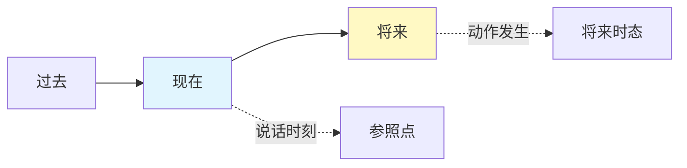
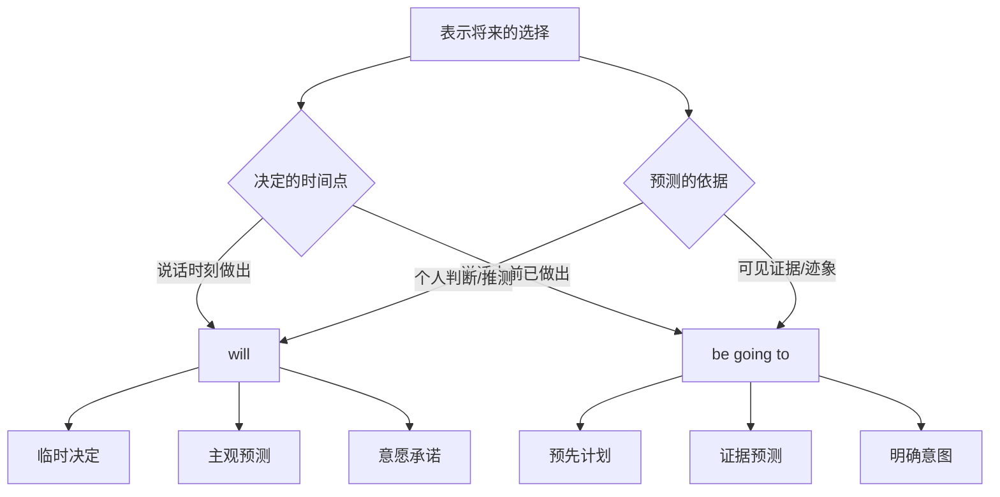
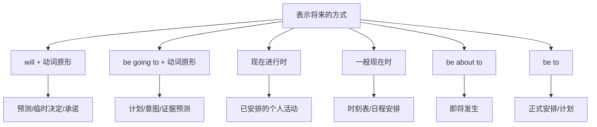
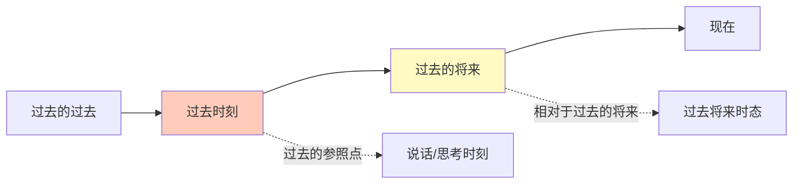
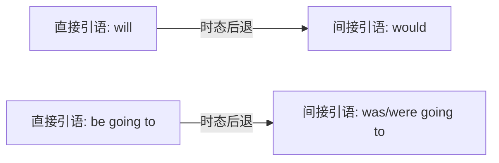
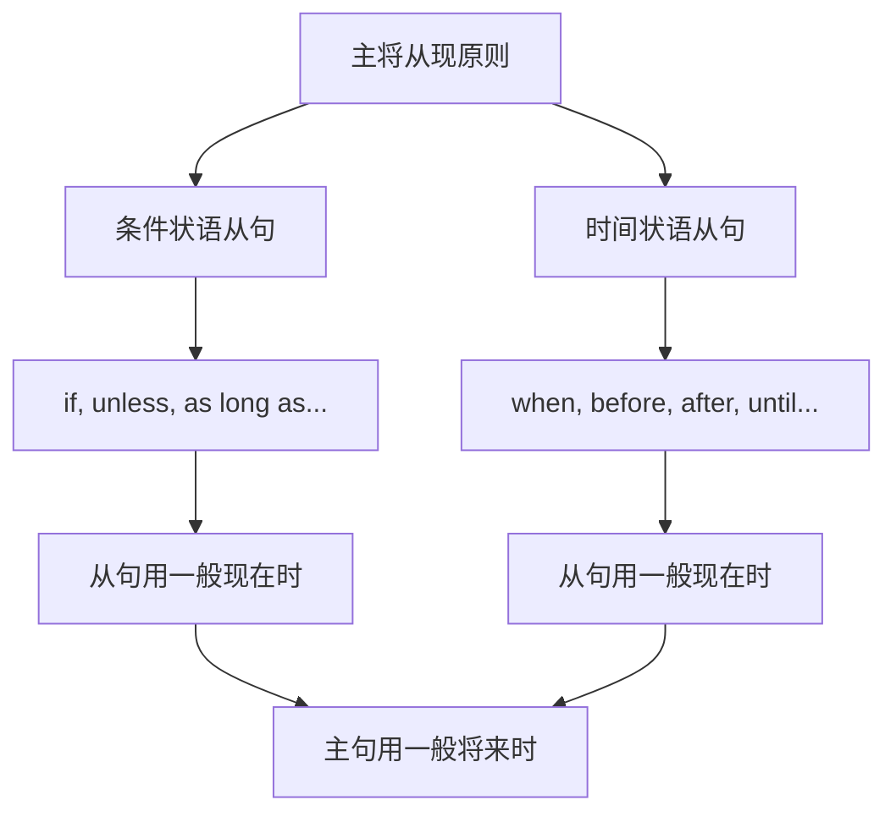
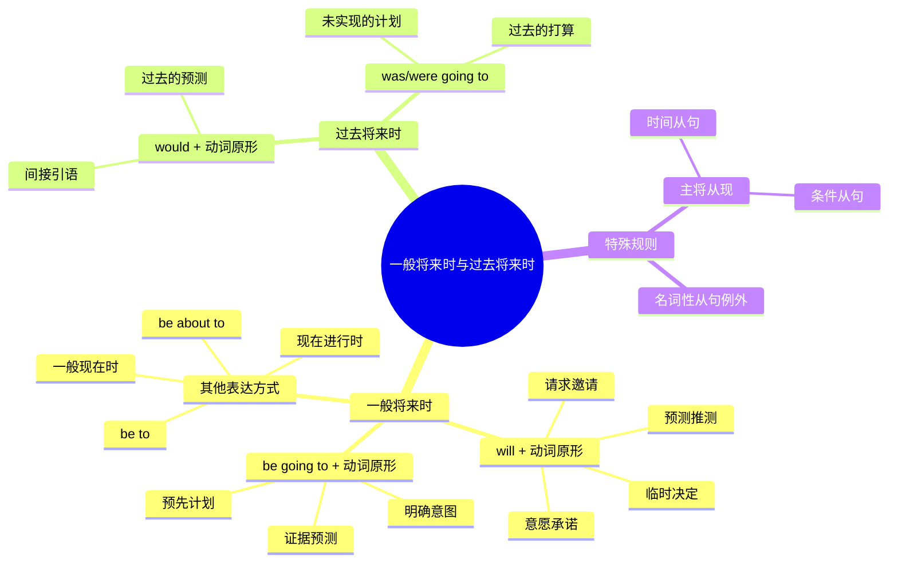

# 一般将来时与过去将来时

## 1. 一般将来时概述

一般将来时（Simple Future Tense）用于描述将来某个时间会发生的动作或存在的状态。这是英语中表达未来计划、预测、意愿和承诺的核心时态。

> [!info] 一般将来时的核心功能
>
> 一般将来时主要表达四类含义：
> - **预测**：对未来事件的推测或判断
> - **意愿**：说话人的主观意愿或决定
> - **承诺**：对他人做出的保证
> - **计划**：已安排好的未来活动

### 1.1 一般将来时的时间线定位

一般将来时以说话时刻为参照点，描述的动作或状态位于说话时刻之后的时间轴上。与一般现在时和一般过去时不同，将来时态涉及的事件尚未发生，因此常带有预测性、计划性或意愿性的特征。

### 1.2 一般将来时的基本构成

英语中表达将来时态有多种方式，其中最常用的是 **will + 动词原形** 和 **be going to + 动词原形** 两种结构。

| 构成方式 | 基本结构 | 例句 |
| --- | --- | --- |
| will 型 | 主语 + will + 动词原形 | I will help you. |
| be going to 型 | 主语 + be going to + 动词原形 | I am going to help you. |
| 现在进行时表将来 | 主语 + be + V-ing | I am leaving tomorrow. |
| 一般现在时表将来 | 主语 + 动词原形/三单形式 | The train leaves at 8. |

## 2. will 构成的一般将来时

**will** 是英语中最常用的将来时态助动词，它可以与任何人称搭配使用，后面接动词原形。

### 2.1 will 的肯定句结构

**基本结构**：主语 + will + 动词原形 + 其他成分

> [!example] will 肯定句示例
>
> **I will call you tonight.**
> - 我今晚会给你打电话。
> - 句法分析：I（主语）+ will call（谓语）+ you（宾语）+ tonight（时间状语）
>
> **She will graduate next year.**
> - 她明年将毕业。
> - 句法分析：She（主语）+ will graduate（谓语）+ next year（时间状语）
>
> **They will arrive at 3 o'clock.**
> - 他们将在三点钟到达。
> - 句法分析：They（主语）+ will arrive（谓语）+ at 3 o'clock（时间状语）
>
> **The weather will be nice tomorrow.**
> - 明天天气会很好。
> - 句法分析：The weather（主语）+ will be（系动词）+ nice（表语）+ tomorrow（时间状语）

**will 的缩写形式**：在口语和非正式写作中，will 常缩写为 **'ll**。

| 完整形式 | 缩写形式 | 例句 |
| --- | --- | --- |
| I will | I'll | I'll see you later. |
| You will | You'll | You'll understand soon. |
| He will | He'll | He'll be here in a minute. |
| She will | She'll | She'll love this gift. |
| It will | It'll | It'll rain tonight. |
| We will | We'll | We'll finish on time. |
| They will | They'll | They'll come to the party. |

### 2.2 will 的否定句结构

**基本结构**：主语 + will not / won't + 动词原形 + 其他成分

> [!example] will 否定句示例
>
> **I will not forget your kindness.**
> - 我不会忘记你的好意。
> - 句法分析：I（主语）+ will not forget（否定谓语）+ your kindness（宾语）
>
> **She won't attend the meeting.**
> - 她不会参加会议。
> - 句法分析：She（主语）+ won't attend（否定谓语）+ the meeting（宾语）
>
> **The store won't open until 10 a.m.**
> - 这家店要到上午十点才开门。
> - 句法分析：The store（主语）+ won't open（否定谓语）+ until 10 a.m.（时间状语）

**will not 的缩写**：will not 通常缩写为 **won't**（发音 /woʊnt/），这是英语中较为特殊的缩写形式。

### 2.3 will 的疑问句结构

**一般疑问句结构**：Will + 主语 + 动词原形 + 其他成分?

> [!example] will 一般疑问句示例
>
> **Will you help me with this task?**
> - 你会帮我完成这个任务吗？
> - 肯定回答：Yes, I will. / 否定回答：No, I won't.
>
> **Will it snow tomorrow?**
> - 明天会下雪吗？
> - 肯定回答：Yes, it will. / 否定回答：No, it won't.
>
> **Will they accept our proposal?**
> - 他们会接受我们的提议吗？
> - 肯定回答：Yes, they will. / 否定回答：No, they won't.

**特殊疑问句结构**：疑问词 + will + 主语 + 动词原形 + 其他成分?

> [!example] will 特殊疑问句示例
>
> **When will you arrive?**
> - 你什么时候到达？
> - 句法分析：When（疑问副词）+ will（助动词）+ you（主语）+ arrive（动词原形）
>
> **What will happen next?**
> - 接下来会发生什么？
> - 句法分析：What（疑问代词作主语）+ will happen（谓语）+ next（时间状语）
>
> **Where will you go for vacation?**
> - 你假期会去哪里？
> - 句法分析：Where（疑问副词）+ will you go（谓语）+ for vacation（目的状语）
>
> **How will you solve this problem?**
> - 你将如何解决这个问题？
> - 句法分析：How（疑问副词）+ will you solve（谓语）+ this problem（宾语）

### 2.4 will 的主要用法

#### 2.4.1 表示预测或推测

will 常用于表示说话人对未来事件的预测或推测，这种预测可能基于个人判断、经验或直觉。

> [!example] will 表示预测
>
> **I think it will rain this afternoon.**
> - 我认为今天下午会下雨。
> - 语境：基于天气状况的个人推测
>
> **The meeting will probably last two hours.**
> - 会议可能会持续两个小时。
> - 语境：基于经验的估计
>
> **You will love this movie.**
> - 你会喜欢这部电影的。
> - 语境：基于了解对方喜好的预测
>
> **The economy will recover next year.**
> - 经济明年将会复苏。
> - 语境：基于分析的预测

#### 2.4.2 表示临时决定

当说话人在说话的瞬间做出决定时，使用 will 而非 be going to。这种用法强调决定的即时性和自发性。

> [!example] will 表示临时决定
>
> **A: The phone is ringing.**
> **B: I'll answer it.**
> - A：电话响了。
> - B：我来接。
> - 语境：听到电话响后立即做出的决定
>
> **A: I'm thirsty.**
> **B: I'll get you some water.**
> - A：我渴了。
> - B：我去给你倒水。
> - 语境：听到对方的需求后即时做出的决定
>
> **A: We don't have any milk.**
> **B: Oh, I'll buy some on my way home.**
> - A：我们没有牛奶了。
> - B：噢，我回家路上买一些。
> - 语境：得知情况后立即做出的决定

> [!warning] 临时决定与预先计划的区别
>
> - **临时决定**（用 will）：决定在说话瞬间做出
>   - "I'll have the steak."（看菜单后立即决定）
> - **预先计划**（用 be going to）：决定在说话之前已经做出
>   - "I'm going to have the steak."（之前已经决定好了）

#### 2.4.3 表示意愿、承诺或保证

will 可以表示说话人的主观意愿，或对他人做出的承诺和保证。

> [!example] will 表示意愿和承诺
>
> **I will always love you.**
> - 我会永远爱你。
> - 语境：表达持久的情感意愿
>
> **I will never tell anyone your secret.**
> - 我绝不会告诉任何人你的秘密。
> - 语境：做出保密的承诺
>
> **I promise I will be there on time.**
> - 我保证会准时到达。
> - 语境：对他人做出的保证
>
> **Will you marry me?**
> - 你愿意嫁给我吗？
> - 语境：询问对方的意愿

#### 2.4.4 表示请求或邀请

will 用于疑问句时，可以表示礼貌的请求或邀请。

> [!example] will 表示请求和邀请
>
> **Will you please close the window?**
> - 请你关一下窗户好吗？
> - 语境：礼貌地请求帮助
>
> **Will you join us for dinner?**
> - 你愿意和我们一起吃晚饭吗？
> - 语境：发出邀请
>
> **Will you pass me the salt?**
> - 请把盐递给我好吗？
> - 语境：餐桌上的礼貌请求
>
> **Won't you come in?**
> - 请进来吧？
> - 语境：热情的邀请（否定疑问句表示更强的邀请意味）

### 2.5 shall 与 will 的区别

在现代英语中，**shall** 的使用已经大大减少，但在某些情况下仍然使用。

| 用法 | shall | will |
| --- | --- | --- |
| 单纯将来（第一人称） | I shall be 30 next year.（较正式/英式） | I will be 30 next year.（更常用） |
| 征求意见/建议 | Shall I help you?（我帮你好吗？） | - |
| 提出建议 | Shall we go now?（我们现在走吧？） | - |
| 法律/规章 | Members shall pay annual fees.（成员应缴纳年费） | - |

> [!tip] shall 的现代用法
>
> 在现代美式英语中，shall 几乎只用于：
> - **Shall I...?**：主动提供帮助
> - **Shall we...?**：提出建议（相当于 Let's...?）
> - 法律文件中的规定性条款
>
> 在日常交流中，will 已经完全取代 shall 表示单纯将来。

## 3. be going to 构成的一般将来时

**be going to** 是另一种常用的将来时态表达方式，它强调计划性和意图性，或基于现有证据的预测。

### 3.1 be going to 的结构

**基本结构**：主语 + be（am/is/are）+ going to + 动词原形

| 人称 | be 动词形式 | 完整结构 | 例句 |
| --- | --- | --- | --- |
| I | am | I am going to | I am going to study. |
| You | are | You are going to | You are going to like it. |
| He/She/It | is | He/She/It is going to | She is going to leave. |
| We | are | We are going to | We are going to win. |
| They | are | They are going to | They are going to arrive. |

**缩写形式**：

| 完整形式 | 缩写形式 | 例句 |
| --- | --- | --- |
| I am going to | I'm going to / I'm gonna | I'm going to call her. |
| You are going to | You're going to / You're gonna | You're going to love it. |
| He is going to | He's going to / He's gonna | He's going to help. |
| We are going to | We're going to / We're gonna | We're going to succeed. |

> [!warning] gonna 的使用场合
>
> **gonna** 是 going to 的口语缩写形式，仅用于：
> - 非正式口语交流
> - 歌词、对话录音等
>
> **禁止在以下场合使用 gonna**：
> - 正式写作
> - 学术论文
> - 商务邮件
> - 考试作文

### 3.2 be going to 的否定句和疑问句

**否定句结构**：主语 + be + not + going to + 动词原形

> [!example] be going to 否定句
>
> **I am not going to accept this offer.**
> - 我不打算接受这个提议。
>
> **She isn't going to attend the party.**
> - 她不打算参加派对。
>
> **They aren't going to change their minds.**
> - 他们不会改变主意。

**一般疑问句结构**：Be + 主语 + going to + 动词原形?

> [!example] be going to 疑问句
>
> **Are you going to buy a new car?**
> - 你打算买新车吗？
> - 肯定回答：Yes, I am. / 否定回答：No, I'm not.
>
> **Is she going to move to another city?**
> - 她打算搬到另一个城市吗？
> - 肯定回答：Yes, she is. / 否定回答：No, she isn't.
>
> **What are you going to do this weekend?**
> - 你这个周末打算做什么？
> - 句法分析：特殊疑问句，What 作宾语

### 3.3 be going to 的主要用法

#### 3.3.1 表示预先计划或打算

be going to 最典型的用法是表示说话之前就已经决定好的计划或打算。

> [!example] be going to 表示预先计划
>
> **I'm going to visit my grandparents this Sunday.**
> - 这个周日我打算去看望我的祖父母。
> - 语境：之前就已经计划好的活动
>
> **We're going to get married in June.**
> - 我们打算六月份结婚。
> - 语境：已经商定好的计划
>
> **She's going to start her own business next year.**
> - 她明年打算创业。
> - 语境：已经有了明确的打算
>
> **They're going to renovate their house.**
> - 他们打算翻修房子。
> - 语境：已经做出的决定

#### 3.3.2 表示基于证据的预测

当说话人根据当前可观察到的迹象或证据来预测即将发生的事情时，使用 be going to 比 will 更为恰当。

> [!example] be going to 表示基于证据的预测
>
> **Look at those dark clouds. It's going to rain.**
> - 看那些乌云，要下雨了。
> - 证据：可见的乌云
>
> **She's going to have a baby. (看到她怀孕了)**
> - 她要生孩子了。
> - 证据：明显的身体特征
>
> **Be careful! You're going to fall!**
> - 小心！你要摔倒了！
> - 证据：看到危险的姿势
>
> **The car is going to crash!**
> - 那辆车要撞上了！
> - 证据：看到车辆失控

> [!tip] 证据型预测的判断标准
>
> 使用 be going to 进行预测时，通常存在以下特征：
> - 有可观察的现象或迹象
> - 事件即将发生（时间很近）
> - 预测的确定性较高
>
> 如果是基于个人判断、猜测或一般性推理，则使用 will 更合适。

## 4. will 与 be going to 的对比辨析

理解 will 和 be going to 的区别是掌握一般将来时的关键。两者虽然都表示将来，但在语义和使用场景上有明显差异。

### 4.1 核心区别总结

### 4.2 详细对比表

| 对比维度 | will | be going to |
| --- | --- | --- |
| **决定时间** | 说话瞬间做出 | 说话之前已做出 |
| **计划性** | 无预先计划 | 有预先计划 |
| **预测依据** | 个人判断、推测 | 现有证据、迹象 |
| **确定程度** | 相对不确定 | 相对确定 |
| **语气** | 较为随意 | 较为肯定 |
| **典型场景** | 承诺、请求、临时反应 | 已安排的活动、即将发生的事 |

### 4.3 对比例句分析

#### 4.3.1 临时决定 vs 预先计划

> [!example] 决定时间的对比
>
> **场景**：有人问你周末的安排
>
> **A: What are your plans for the weekend?**
>
> **回答1（临时决定）**：
> - I don't know. Maybe I'll watch some movies.
> - 我不知道。也许会看几部电影。
> - 分析：说话时才开始考虑，没有预先计划
>
> **回答2（预先计划）**：
> - I'm going to visit my aunt in the countryside.
> - 我打算去乡下看望我姑姑。
> - 分析：这是之前就已经安排好的计划

#### 4.3.2 主观预测 vs 证据预测

> [!example] 预测依据的对比
>
> **场景1**：谈论明天的天气
>
> **主观预测**：
> - I think it will rain tomorrow.
> - 我认为明天会下雨。
> - 分析：基于个人判断或天气预报
>
> **证据预测**：
> - Look at those clouds! It's going to rain.
> - 看那些云！要下雨了。
> - 分析：基于眼前可见的乌云
>
> **场景2**：谈论考试结果
>
> **主观预测**：
> - She's very smart. She will pass the exam.
> - 她很聪明，她会通过考试的。
> - 分析：基于对她能力的了解
>
> **证据预测**：
> - She hasn't studied at all. She's going to fail.
> - 她一点都没复习，她会不及格的。
> - 分析：基于她没有复习这一事实

#### 4.3.3 承诺与意图

> [!example] 承诺与意图的对比
>
> **场景**：朋友需要帮助
>
> **承诺（will）**：
> - Don't worry. I will help you.
> - 别担心，我会帮你的。
> - 分析：当场做出的承诺
>
> **意图（be going to）**：
> - I've decided. I'm going to help you with the project.
> - 我已经决定了，我打算帮你完成这个项目。
> - 分析：经过考虑后做出的决定

### 4.4 两者可互换的情况

在某些情况下，will 和 be going to 可以互换使用，语义差别不大：

> [!info] 可互换使用的场景
>
> **谈论未来的一般性预测**：
> - The world population will/is going to reach 10 billion by 2050.
> - 到2050年，世界人口将达到100亿。
>
> **表达未来的确定事实**：
> - She will/is going to be 30 next month.
> - 她下个月就30岁了。
>
> **谈论长远的计划**：
> - I will/am going to retire when I'm 60.
> - 我60岁时会退休。

## 5. 其他表示将来的方式

除了 will 和 be going to，英语中还有其他表示将来的方式。

### 5.1 现在进行时表将来

现在进行时可以表示已经安排好的、近期即将发生的活动，尤其是涉及个人行程安排时。

**结构**：主语 + be + V-ing + 将来时间状语

> [!example] 现在进行时表将来
>
> **I'm meeting John at 3 o'clock.**
> - 我三点钟要见约翰。
> - 语境：已经和约翰约好的会面
>
> **We're flying to Paris tomorrow.**
> - 我们明天飞巴黎。
> - 语境：机票已经订好
>
> **She's starting a new job next Monday.**
> - 她下周一开始新工作。
> - 语境：工作已经确定
>
> **They're getting married in May.**
> - 他们五月份结婚。
> - 语境：婚礼已经安排好

> [!warning] 现在进行时表将来的适用条件
>
> 使用现在进行时表将来时，通常需要满足：
> - 有明确的将来时间状语
> - 涉及人的活动安排（不用于天气等非人为事件）
> - 计划已经相当确定

### 5.2 一般现在时表将来

一般现在时可以用于表示按时刻表、日程表或计划表确定的将来事件。

**结构**：主语 + 动词原形/三单形式 + 将来时间状语

> [!example] 一般现在时表将来
>
> **The train leaves at 9:15 tomorrow morning.**
> - 火车明天早上9:15出发。
> - 语境：按照列车时刻表
>
> **The movie starts at 7:30.**
> - 电影7:30开始。
> - 语境：按照影院排片表
>
> **The semester begins on September 1st.**
> - 学期9月1日开始。
> - 语境：按照校历安排
>
> **What time does the flight arrive?**
> - 航班几点到达？
> - 语境：询问航班时刻

> [!tip] 一般现在时表将来的典型动词
>
> 常用于时刻表的动词：
> - **交通类**：leave, arrive, depart, land, take off
> - **开始结束**：begin, start, end, finish, open, close
> - **演出类**：start, end, show
>
> 这些动词表示按照固定安排进行的事件。

### 5.3 be about to 表示即将发生

**be about to** 表示某事即将发生，通常指非常近的将来。

**结构**：主语 + be about to + 动词原形

> [!example] be about to 示例
>
> **The movie is about to start.**
> - 电影马上就要开始了。
>
> **We're about to leave. Are you ready?**
> - 我们马上就要走了。你准备好了吗？
>
> **She was about to cry when she heard the news.**
> - 她听到这个消息时差点哭了。

> [!warning] be about to 的限制
>
> be about to 不能与具体的时间状语连用：
> - ❌ The movie is about to start at 7:30.
> - ✅ The movie is about to start.
> - ✅ The movie starts at 7:30.

### 5.4 be to 表示计划或安排

**be to** 是较为正式的表达方式，常用于新闻报道、正式通知等场合。

**结构**：主语 + be to + 动词原形

> [!example] be to 示例
>
> **The President is to visit Japan next month.**
> - 总统将于下月访问日本。
> - 语境：正式的外交安排
>
> **The new policy is to take effect from January 1st.**
> - 新政策将于1月1日起生效。
> - 语境：官方公告
>
> **They are to be married in the spring.**
> - 他们将于春天结婚。
> - 语境：正式宣布的婚礼安排

### 5.5 将来时态表达方式总结

| 表达方式 | 确定程度 | 时间距离 | 典型场景 |
| --- | --- | --- | --- |
| will | 不确定~确定 | 不限 | 预测、承诺、临时决定 |
| be going to | 较确定 | 不限 | 计划、意图、证据预测 |
| 现在进行时 | 确定 | 近期 | 个人安排、约会 |
| 一般现在时 | 非常确定 | 不限 | 时刻表、固定安排 |
| be about to | 确定 | 极近 | 即将发生的事 |
| be to | 确定 | 不限 | 正式安排、官方计划 |

## 6. 过去将来时

过去将来时（Future-in-the-Past）用于从过去某个时间点看将要发生的动作或状态。它常用于间接引语、宾语从句以及叙述过去的计划和预期。

### 6.1 过去将来时的时间线定位

过去将来时以过去某个时间点为参照，描述从那个时间点来看将要发生的事情。这个动作可能在"现在"已经发生，也可能没有发生。

### 6.2 过去将来时的构成

#### 6.2.1 would + 动词原形

**基本结构**：主语 + would + 动词原形

> [!example] would 构成的过去将来时
>
> **He said he would come to the party.**
> - 他说他会来参加派对。
> - 句法分析：said（主句过去时）+ would come（从句过去将来时）
>
> **I knew she would succeed.**
> - 我知道她会成功的。
> - 句法分析：knew（主句过去时）+ would succeed（从句过去将来时）
>
> **They promised they would help us.**
> - 他们承诺会帮助我们。
> - 句法分析：promised（主句过去时）+ would help（从句过去将来时）

**否定形式**：would not / wouldn't + 动词原形

> [!example] would 否定形式
>
> **She said she wouldn't tell anyone.**
> - 她说她不会告诉任何人。
>
> **I knew it wouldn't be easy.**
> - 我知道这不会容易。
>
> **He promised he wouldn't be late again.**
> - 他保证不会再迟到。

#### 6.2.2 was/were going to + 动词原形

**基本结构**：主语 + was/were going to + 动词原形

| 人称 | 结构 | 例句 |
| --- | --- | --- |
| I | was going to | I was going to call you. |
| You | were going to | You were going to help me. |
| He/She/It | was going to | She was going to leave. |
| We | were going to | We were going to visit them. |
| They | were going to | They were going to arrive early. |

> [!example] was/were going to 示例
>
> **I was going to call you, but I forgot.**
> - 我本来打算给你打电话，但我忘了。
> - 语境：过去的计划未能实现
>
> **She was going to study medicine, but she changed her mind.**
> - 她本来打算学医，但她改变了主意。
> - 语境：过去的计划被改变
>
> **We were going to have a picnic, but it rained.**
> - 我们本来打算野餐，但下雨了。
> - 语境：过去的计划因天气而取消

### 6.3 过去将来时的主要用法

#### 6.3.1 间接引语中的时态转换

当把直接引语变为间接引语时，如果主句动词是过去时，从句中的 will 要变为 would。

> [!example] 直接引语变间接引语
>
> **直接引语**：He said, "I will help you."
> **间接引语**：He said (that) he would help me.
> - 他说他会帮助我。
>
> **直接引语**：She said, "I am going to quit my job."
> **间接引语**：She said (that) she was going to quit her job.
> - 她说她打算辞职。
>
> **直接引语**：They said, "We will arrive at 6."
> **间接引语**：They said (that) they would arrive at 6.
> - 他们说他们会在6点到达。

> [!tip] 时态后退规则
>
> 主句是过去时时，从句时态通常后退一格：
> - will → would
> - am/is/are going to → was/were going to
> - can → could
> - may → might
>
> 但表示普遍真理或仍然有效的事实时，时态可以不变。

#### 6.3.2 表示过去的计划或打算

过去将来时可以表示过去某个时间的计划或打算，这个计划可能已经实现，也可能没有实现。

> [!example] 过去的计划
>
> **Last year, I thought I would travel to Europe.**
> - 去年，我想着要去欧洲旅行。
> - 语境：过去的想法，可能实现了也可能没有
>
> **When I was young, I believed I would become a scientist.**
> - 小时候，我相信自己会成为科学家。
> - 语境：童年的期望
>
> **At that time, nobody knew what would happen next.**
> - 那时候，没人知道接下来会发生什么。
> - 语境：过去的不确定性

#### 6.3.3 表示过去对将来的预测

从过去的角度对未来进行预测时使用过去将来时。

> [!example] 过去的预测
>
> **In 1990, scientists predicted that the internet would change the world.**
> - 1990年，科学家预测互联网会改变世界。
> - 语境：过去的预测（已经证实）
>
> **The weather forecast said it would snow.**
> - 天气预报说会下雪。
> - 语境：过去的天气预报
>
> **Everyone thought the project would fail.**
> - 每个人都认为这个项目会失败。
> - 语境：过去的普遍预期

#### 6.3.4 表示未实现的计划（was/were going to）

was/were going to 特别适合表示过去计划但未能实现的事情。

> [!example] 未实现的计划
>
> **I was going to buy that dress, but it was too expensive.**
> - 我本来打算买那件裙子，但太贵了。
> - 语境：因价格放弃购买
>
> **He was going to propose, but he lost his nerve.**
> - 他本来打算求婚，但他失去了勇气。
> - 语境：因胆怯而放弃
>
> **We were going to go swimming, but the pool was closed.**
> - 我们本来打算去游泳，但泳池关门了。
> - 语境：因外部原因取消
>
> **She was going to tell him the truth, but she couldn't find the right moment.**
> - 她本来打算告诉他真相，但找不到合适的时机。
> - 语境：因时机不对而未说

### 6.4 would 与 was/were going to 的区别

| 对比维度 | would | was/were going to |
| --- | --- | --- |
| **语义重点** | 客观叙述将来的事 | 强调过去的计划或意图 |
| **实现与否** | 中性，不强调 | 常暗示计划未实现 |
| **典型用法** | 间接引语、过去的预测 | 未实现的计划、过去的打算 |
| **情感色彩** | 较为客观 | 可能带有遗憾语气 |

> [!example] would 与 was/were going to 对比
>
> **场景**：谈论过去的出行计划
>
> **would（中性叙述）**：
> - He said he would go to Paris.
> - 他说他会去巴黎。
> - 分析：客观转述，不确定是否已去
>
> **was going to（暗示未实现）**：
> - He was going to go to Paris, but his visa was rejected.
> - 他本来打算去巴黎，但签证被拒了。
> - 分析：强调计划存在，但未能实现

## 7. 条件句与时间状语从句中的时态

在条件句和时间状语从句中，将来时态的使用有特殊规则。

### 7.1 主将从现原则

**核心规则**：在条件状语从句和时间状语从句中，用一般现在时代替一般将来时表示将来的动作。

> [!warning] 主将从现
>
> **条件从句**（if, unless, as long as, provided that 等引导）和**时间从句**（when, before, after, until, as soon as 等引导）中，即使表示将来的动作，也要用一般现在时，而主句用一般将来时。

#### 7.1.1 条件状语从句

> [!example] 条件从句中的时态
>
> **If it rains tomorrow, we will cancel the picnic.**
> - 如果明天下雨，我们就取消野餐。
> - ❌ If it will rain tomorrow... (错误)
> - 分析：if 从句用一般现在时 rains，主句用将来时 will cancel
>
> **Unless you study hard, you won't pass the exam.**
> - 除非你努力学习，否则考试不会及格。
> - 分析：unless 从句用一般现在时 study，主句用将来时 won't pass
>
> **As long as you are honest, I will trust you.**
> - 只要你诚实，我就会信任你。
> - 分析：as long as 从句用一般现在时 are，主句用将来时 will trust
>
> **I will help you provided that you help me first.**
> - 只要你先帮我，我就会帮你。
> - 分析：provided that 从句用一般现在时 help，主句用将来时 will help

#### 7.1.2 时间状语从句

> [!example] 时间从句中的时态
>
> **When she arrives, I will tell her the news.**
> - 她到达时，我会告诉她这个消息。
> - ❌ When she will arrive... (错误)
> - 分析：when 从句用一般现在时 arrives，主句用将来时 will tell
>
> **I will call you before I leave.**
> - 我走之前会给你打电话。
> - 分析：before 从句用一般现在时 leave，主句用将来时 will call
>
> **After the meeting ends, we will go for dinner.**
> - 会议结束后，我们去吃晚饭。
> - 分析：after 从句用一般现在时 ends，主句用将来时 will go
>
> **I will wait until you come back.**
> - 我会等到你回来。
> - 分析：until 从句用一般现在时 come back，主句用将来时 will wait
>
> **As soon as I get home, I will take a shower.**
> - 我一到家就去洗澡。
> - 分析：as soon as 从句用一般现在时 get，主句用将来时 will take

### 7.2 引导词分类

| 类型 | 引导词 | 例句（从句部分） |
| --- | --- | --- |
| **条件** | if | if you come |
| | unless | unless it rains |
| | as long as | as long as you try |
| | provided (that) | provided that you agree |
| | on condition that | on condition that he pays |
| **时间** | when | when she arrives |
| | before | before I leave |
| | after | after the show ends |
| | until/till | until you finish |
| | as soon as | as soon as I know |
| | by the time | by the time you get here |
| | the moment | the moment I see him |

### 7.3 特殊情况

#### 7.3.1 从句中可以用将来时的情况

当 if, when 等词引导的是**名词性从句**（宾语从句、主语从句）而非状语从句时，可以用将来时。

> [!example] 名词性从句中的将来时
>
> **I don't know if/whether he will come.**
> - 我不知道他是否会来。
> - 分析：if 引导宾语从句，表示"是否"，可用 will
>
> **Can you tell me when the train will arrive?**
> - 你能告诉我火车什么时候到达吗？
> - 分析：when 引导宾语从句，询问时间，可用 will
>
> **对比**：
> - When the train **arrives**, I will pick you up.（时间状语从句，用一般现在时）
> - I wonder when the train **will arrive**.（宾语从句，可用将来时）

#### 7.3.2 从句表示意愿时可用 will

当从句中的 will 表示"愿意"而非单纯将来时，可以使用 will。

> [!example] will 表示意愿
>
> **If you will help me, I will be grateful.**
> - 如果你愿意帮我，我会很感激。
> - 分析：will help 表示"愿意帮助"，而非单纯将来
>
> **If you will wait a moment, I will find someone to help you.**
> - 如果您愿意稍等，我会找人来帮您。
> - 分析：礼貌请求，will 表示意愿

## 8. 一般将来时的常见错误

### 8.1 错误类型总结

| 错误类型 | 错误示例 | 正确表达 | 说明 |
| --- | --- | --- | --- |
| 条件从句误用 will | If it will rain... | If it rains... | 条件从句用一般现在时 |
| 时间从句误用 will | When she will come... | When she comes... | 时间从句用一般现在时 |
| will 后接非原形 | I will to go. | I will go. | will 后直接接动词原形 |
| be going to 形式错误 | I going to leave. | I am going to leave. | 不能省略 be 动词 |
| 混淆预测类型 | Look! It will rain. | Look! It's going to rain. | 有证据时用 be going to |

### 8.2 详细错误分析

> [!warning] 常见错误辨析
>
> **错误1：条件从句中使用 will**
> - ❌ If it will be sunny tomorrow, we will go hiking.
> - ✅ If it is sunny tomorrow, we will go hiking.
> - 说明：条件从句用一般现在时代替将来时
>
> **错误2：时间从句中使用 will**
> - ❌ I will call you when I will arrive.
> - ✅ I will call you when I arrive.
> - 说明：时间从句用一般现在时代替将来时
>
> **错误3：will 后使用 to 不定式**
> - ❌ She will to come tomorrow.
> - ✅ She will come tomorrow.
> - 说明：will 是情态动词，后面直接接动词原形
>
> **错误4：省略 be going to 中的 be**
> - ❌ I going to study tonight.
> - ✅ I am going to study tonight.
> - 说明：be going to 结构中的 be 不能省略
>
> **错误5：基于证据的预测误用 will**
> - ❌ Look at those clouds! It will rain.
> - ✅ Look at those clouds! It's going to rain.
> - 说明：有明显证据时，使用 be going to 更恰当

## 9. 综合练习

### 9.1 选择填空

> [!example] 练习题
>
> **1. I think it ______ (rain) tomorrow.**
> - 答案：will rain
> - 解析：基于个人判断的预测，用 will
>
> **2. Look at the sky! It ______ (rain).**
> - 答案：is going to rain
> - 解析：基于眼前证据的预测，用 be going to
>
> **3. A: Someone is at the door. B: I ______ (get) it.**
> - 答案：will get / I'll get
> - 解析：说话瞬间做出的决定，用 will
>
> **4. We ______ (visit) our grandparents next Sunday. We've already bought the tickets.**
> - 答案：are going to visit / are visiting
> - 解析：预先计划好的活动，用 be going to 或现在进行时
>
> **5. If it ______ (rain), we will cancel the match.**
> - 答案：rains
> - 解析：条件从句中用一般现在时代替将来时
>
> **6. The train ______ (leave) at 8:30 according to the timetable.**
> - 答案：leaves
> - 解析：时刻表安排用一般现在时表将来
>
> **7. He said he ______ (help) me with the project.**
> - 答案：would help
> - 解析：间接引语中，will 变为 would
>
> **8. I ______ (call) you as soon as I ______ (arrive).**
> - 答案：will call; arrive
> - 解析：主句用将来时，as soon as 从句用一般现在时
>
> **9. She ______ (go) to study abroad, but she changed her mind.**
> - 答案：was going to go
> - 解析：表示过去未实现的计划，用 was/were going to
>
> **10. ______ you ______ (marry) me?**
> - 答案：Will; marry
> - 解析：询问意愿，用 will

### 9.2 句型转换

> [!example] 句型转换练习
>
> **1. 改为否定句**
> - 原句：She will attend the conference.
> - 否定：She will not / won't attend the conference.
>
> **2. 改为疑问句**
> - 原句：They are going to move to a new house.
> - 疑问：Are they going to move to a new house?
>
> **3. 直接引语变间接引语**
> - 直接：He said, "I will finish it tomorrow."
> - 间接：He said (that) he would finish it the next day.
>
> **4. 用 be going to 改写**
> - 原句：I will start a new project next month.
> - 改写：I am going to start a new project next month.
>
> **5. 改为特殊疑问句**
> - 原句：She will arrive at 6 o'clock.
> - 疑问：When will she arrive?

### 9.3 语境判断

> [!example] 选择 will 还是 be going to
>
> **场景1**：你看到朋友提着很多袋子
> - A: You look tired.
> - B: Yes, I ______ (take) a rest.
> - 答案：am going to take（基于当前状态的打算）
>
> **场景2**：电话铃响了
> - A: The phone is ringing.
> - B: I ______ (answer) it.
> - 答案：will answer（临时做出的决定）
>
> **场景3**：谈论周末计划
> - A: What are you doing this weekend?
> - B: I ______ (visit) my parents. We arranged it last week.
> - 答案：am going to visit / am visiting（预先计划好的活动）
>
> **场景4**：天气预报
> - According to the forecast, it ______ (snow) tonight.
> - 答案：will snow / is going to snow（预测，两者皆可）
>
> **场景5**：看到某人在梯子上摇摇欲坠
> - Be careful! You ______ (fall)!
> - 答案：are going to fall（基于眼前证据的预测）

## 10. 本章小结

> [!tip] 核心要点回顾
>
> **一般将来时的两种主要形式**：
> 1. **will + 动词原形**：临时决定、预测、承诺、请求
> 2. **be going to + 动词原形**：预先计划、证据预测、明确意图
>
> **过去将来时的两种形式**：
> 1. **would + 动词原形**：间接引语、过去的预测
> 2. **was/were going to + 动词原形**：未实现的计划
>
> **主将从现原则**：
> - 条件从句和时间从句中用一般现在时代替将来时
> - 但名词性从句中可以用将来时
>
> **选择 will 还是 be going to 的关键**：
> - 决定是当场做出还是预先做好？
> - 预测是基于判断还是基于证据？

掌握一般将来时和过去将来时的关键在于理解它们的核心语义差异，并在实际语境中灵活运用。通过大量的练习和实际应用，这些时态的使用会变得越来越自然。
