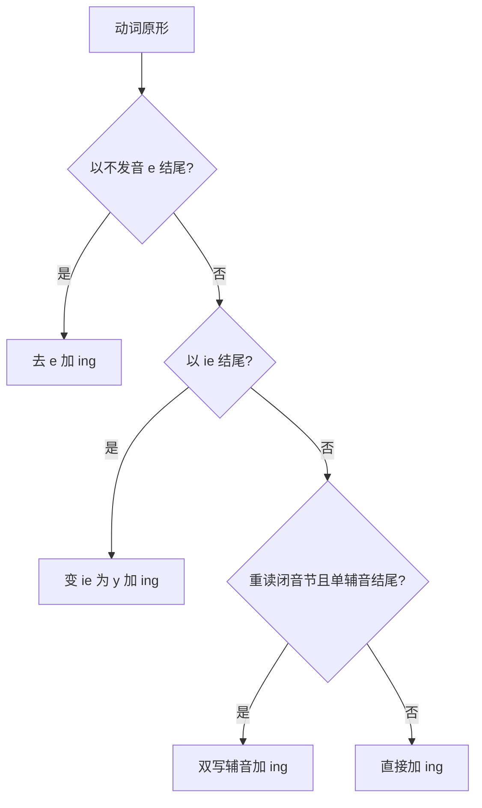
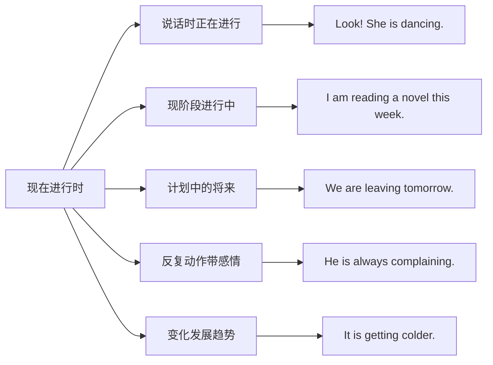
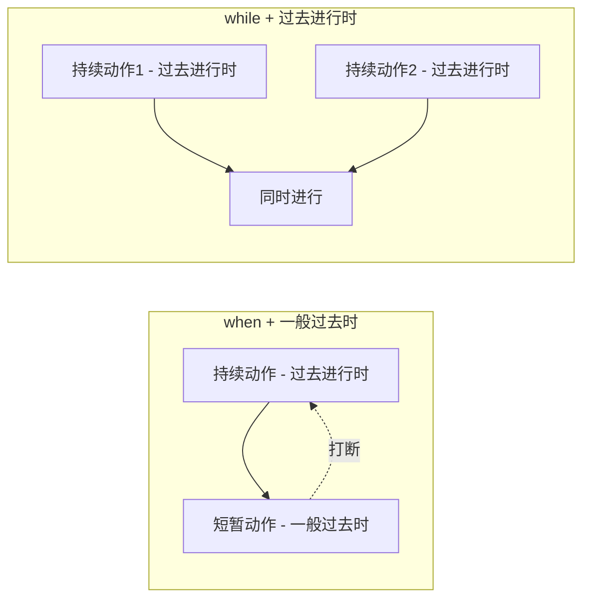
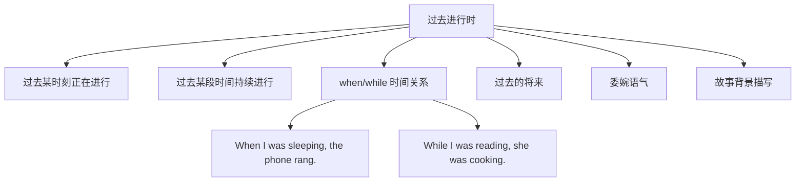
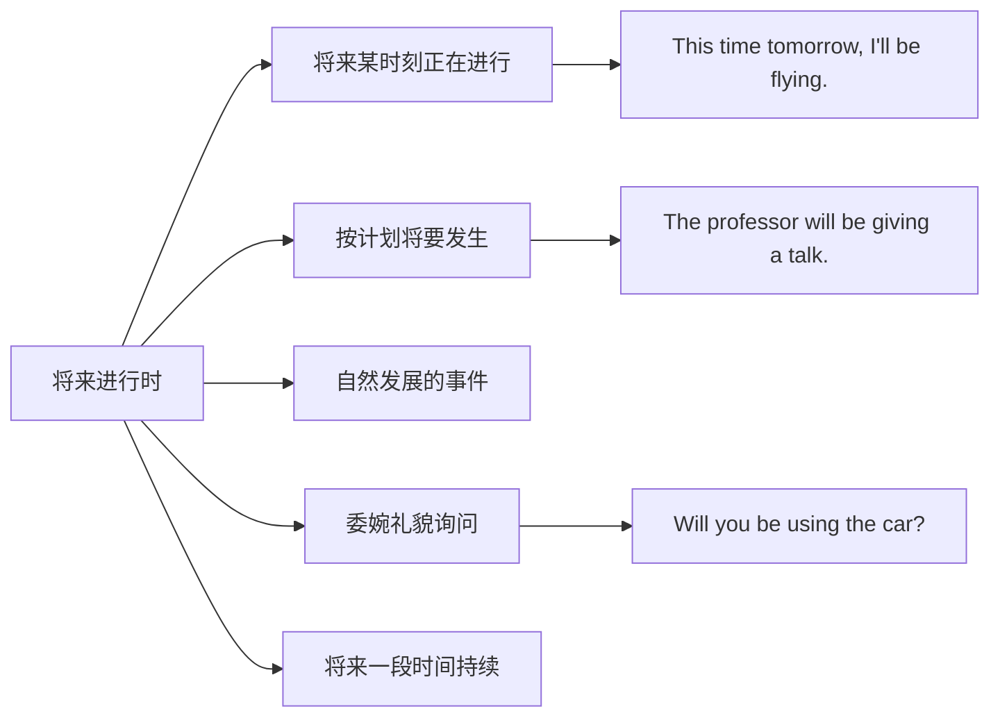
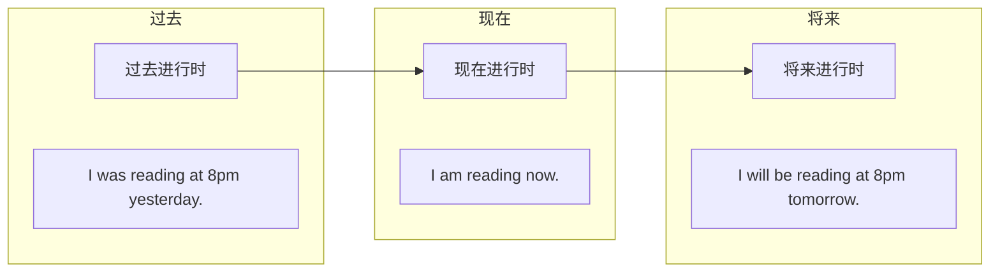

# 进行时态详解

进行时态（Progressive/Continuous Tense）是英语中用于表达**正在进行的动作或状态**的重要时态。与一般时态侧重于描述事实、习惯不同，进行时态强调动作的**持续性、临时性和动态感**。掌握进行时态是理解英语时态系统的关键一环。

本文将从现在进行时、过去进行时、将来进行时三个维度，系统讲解进行时态的构成规则、核心用法、典型场景及常见易错点。

---

## 1. 进行时态概述

### 1.1 什么是进行时态

进行时态用于描述在某个特定时间点**正在发生、持续进行**的动作或状态。它的核心特征是：

- **动态性**：强调动作正在发生，而非静态的事实
- **临时性**：暗示动作是暂时的，不是永久的状态
- **持续性**：动作在一段时间内持续进行

> [!info] 进行时态的本质
>
> 进行时态的本质是将动作"放大"到某个时间点，让听者或读者感受到动作正在进行的画面感。就像电影中的一个镜头，定格在动作发生的那一刻。

### 1.2 进行时态的构成公式

所有进行时态都遵循一个统一的构成公式：

```
be 动词（相应时态形式）+ 动词的现在分词（-ing 形式）
```

| 时态 | 构成公式 | 示例 |
| --- | --- | --- |
| 现在进行时 | am/is/are + doing | I am reading. |
| 过去进行时 | was/were + doing | I was reading. |
| 将来进行时 | will be + doing | I will be reading. |

### 1.3 现在分词的构成规则

现在分词是进行时态的核心组成部分，其构成规则如下：

**规则一：一般情况直接加 -ing**

| 原形 | 现在分词 | 中文 |
| --- | --- | --- |
| work | working | 工作 |
| read | reading | 阅读 |
| play | playing | 玩耍 |
| study | studying | 学习 |

**规则二：以不发音的 e 结尾，去 e 加 -ing**

| 原形 | 现在分词 | 中文 |
| --- | --- | --- |
| write | writing | 写 |
| make | making | 制作 |
| come | coming | 来 |
| take | taking | 拿 |
| have | having | 有 |

**规则三：以重读闭音节结尾，且末尾只有一个辅音字母，双写该辅音字母加 -ing**

| 原形 | 现在分词 | 中文 |
| --- | --- | --- |
| run | running | 跑 |
| sit | sitting | 坐 |
| swim | swimming | 游泳 |
| begin | beginning | 开始 |
| stop | stopping | 停止 |

> [!tip] 重读闭音节判断技巧
>
> 重读闭音节指的是：该音节重读 + 以辅音字母结尾 + 辅音字母前是单个元音字母。
>
> - **run**：重读 + 以 n 结尾 + n 前是 u（单元音）→ 双写 → running
> - **visit**：重读在第一音节 vi，第二音节 sit 不重读 → 不双写 → visiting
> - **open**：重读在第一音节 o，第二音节 pen 不重读 → 不双写 → opening

**规则四：以 ie 结尾，变 ie 为 y 加 -ing**

| 原形 | 现在分词 | 中文 |
| --- | --- | --- |
| die | dying | 死亡 |
| lie | lying | 躺；说谎 |
| tie | tying | 系 |

**规则五：以 c 结尾的动词，加 k 再加 -ing**

| 原形 | 现在分词 | 中文 |
| --- | --- | --- |
| picnic | picnicking | 野餐 |
| traffic | trafficking | 贩运 |



这个流程图展示了现在分词构成的判断逻辑。在实际使用中，需要依次判断动词的词尾特征，选择正确的变形规则。

---

## 2. 现在进行时

### 2.1 基本构成

现在进行时的构成公式为：

```
主语 + am/is/are + 动词-ing
```

**be 动词的选择**：

| 主语 | be 动词 | 示例 |
| --- | --- | --- |
| I | am | I am working. |
| he/she/it/单数名词 | is | She is working. |
| you/we/they/复数名词 | are | They are working. |

**三种句式**：

| 句式 | 结构 | 示例 |
| --- | --- | --- |
| 肯定句 | 主语 + am/is/are + doing | He is reading a book. |
| 否定句 | 主语 + am/is/are + not + doing | He is not reading a book. |
| 一般疑问句 | Am/Is/Are + 主语 + doing? | Is he reading a book? |
| 特殊疑问句 | 疑问词 + am/is/are + 主语 + doing? | What is he reading? |

> [!example] 现在进行时句式转换
>
> **肯定句**：The children are playing in the garden.
> （孩子们正在花园里玩耍。）
>
> **否定句**：The children are not playing in the garden.
> （孩子们没有在花园里玩耍。）
>
> **一般疑问句**：Are the children playing in the garden?
> （孩子们正在花园里玩耍吗？）
>
> **特殊疑问句**：Where are the children playing?
> （孩子们在哪里玩耍？）

### 2.2 核心用法

#### 用法一：表示说话时正在进行的动作

这是现在进行时最基本、最核心的用法，描述**此时此刻**正在发生的动作。

**例句分析**：

| 英文 | 中文 | 分析 |
| --- | --- | --- |
| Look! The baby is sleeping. | 看！宝宝正在睡觉。 | 说话时宝宝正处于睡眠状态 |
| Listen! Someone is knocking at the door. | 听！有人在敲门。 | 敲门声此刻正在发生 |
| I am writing a report now. | 我现在正在写报告。 | now 强调当前时刻 |
| What are you doing? | 你在干什么？ | 询问对方此刻的行为 |

> [!tip] 常见时间标志词
>
> 现在进行时常与以下时间状语连用：
> - **now**（现在）
> - **right now**（此刻）
> - **at the moment**（此刻）
> - **at present**（目前）
> - **Look!**（看！）
> - **Listen!**（听！）

#### 用法二：表示现阶段正在进行的动作

动作不一定在说话的瞬间进行，但在**当前这段时期内**持续进行。

**例句分析**：

| 英文 | 中文 | 分析 |
| --- | --- | --- |
| I am reading "War and Peace" this month. | 我这个月在读《战争与和平》。 | 不是此刻在读，而是这段时间在读 |
| She is learning French this semester. | 她这学期在学法语。 | 整个学期的持续行为 |
| They are building a new bridge. | 他们正在建一座新桥。 | 建桥是一个持续的工程 |
| He is working on a big project. | 他正在做一个大项目。 | 项目持续进行中 |

#### 用法三：表示即将发生的动作（近期计划）

现在进行时可以表示**按计划或安排即将发生**的动作，常用于表示个人计划。

**例句分析**：

| 英文 | 中文 | 分析 |
| --- | --- | --- |
| I am leaving tomorrow. | 我明天要走了。 | 已确定的计划 |
| We are meeting at 3 o'clock. | 我们三点钟见面。 | 已约定的安排 |
| She is getting married next month. | 她下个月结婚。 | 确定的未来事件 |
| The train is arriving in five minutes. | 火车五分钟后到达。 | 根据时刻表的安排 |

> [!warning] 适用动词范围
>
> 用现在进行时表将来时，通常限于表示**位移、行程、计划**的动词：
> - **come**（来）、**go**（去）、**leave**（离开）、**arrive**（到达）
> - **start**（开始）、**fly**（飞）、**return**（返回）
> - **meet**（会面）、**have**（举行）、**get married**（结婚）
>
> 不能说 ❌ I am knowing the answer tomorrow.

#### 用法四：表示反复发生的动作（带感情色彩）

与 **always, constantly, forever, continually** 等副词连用，表示**反复发生的动作**，通常带有说话人的**情感色彩**（赞扬、不满、抱怨等）。

**例句分析**：

| 英文 | 中文 | 情感 |
| --- | --- | --- |
| He is always helping others. | 他总是帮助别人。 | 赞扬 |
| She is always complaining about everything. | 她总是抱怨一切。 | 不满 |
| You are constantly making the same mistake. | 你老是犯同样的错误。 | 批评 |
| They are forever arguing about money. | 他们永远在为钱争吵。 | 厌烦 |

> [!info] 与一般现在时的区别
>
> - **He always helps others.**（他总是帮助别人。）→ 陈述事实，客观描述
> - **He is always helping others.**（他总是帮助别人。）→ 带有赞赏的感情色彩
>
> 两句话的意思相近，但现在进行时版本更能传达说话者的主观感受。

#### 用法五：表示变化发展的趋势

用于描述事物正在**逐渐变化**的过程，常与 **get, become, grow, turn** 等表变化的动词连用。

**例句分析**：

| 英文 | 中文 | 分析 |
| --- | --- | --- |
| It is getting darker and darker. | 天越来越黑了。 | 渐变过程 |
| The weather is becoming warmer. | 天气正在变暖。 | 气温上升趋势 |
| Her English is improving rapidly. | 她的英语正在快速进步。 | 能力提升过程 |
| The population is growing fast. | 人口正在快速增长。 | 持续增长趋势 |
| Prices are rising every day. | 物价每天都在上涨。 | 持续上涨趋势 |

### 2.3 不能用于进行时的动词

并非所有动词都能用于进行时态。以下几类动词通常**不用于进行时**：

#### 2.3.1 感官动词

| 动词 | 中文 | 错误用法 | 正确用法 |
| --- | --- | --- | --- |
| see | 看见 | ❌ I am seeing a bird. | ✅ I see a bird. |
| hear | 听见 | ❌ I am hearing music. | ✅ I hear music. |
| smell | 闻到 | ❌ It is smelling good. | ✅ It smells good. |
| taste | 尝起来 | ❌ It is tasting sweet. | ✅ It tastes sweet. |
| feel | 感觉 | ❌ I am feeling cold. | ✅ I feel cold. |

> [!tip] 例外情况
>
> 当这些动词表示**主动行为**而非被动感知时，可以用进行时：
> - **I am seeing the doctor tomorrow.**（我明天去看医生。）→ see = 拜访
> - **I am tasting the soup.**（我在品尝汤。）→ taste = 品尝动作
> - **She is smelling the flowers.**（她在闻花香。）→ smell = 闻的动作

#### 2.3.2 心理状态动词

| 动词 | 中文 | 错误用法 | 正确用法 |
| --- | --- | --- | --- |
| know | 知道 | ❌ I am knowing it. | ✅ I know it. |
| believe | 相信 | ❌ I am believing you. | ✅ I believe you. |
| understand | 理解 | ❌ I am understanding it. | ✅ I understand it. |
| remember | 记得 | ❌ I am remembering it. | ✅ I remember it. |
| forget | 忘记 | ❌ I am forgetting it. | ✅ I forget it. |
| want | 想要 | ❌ I am wanting it. | ✅ I want it. |
| like | 喜欢 | ❌ I am liking it. | ✅ I like it. |
| love | 爱 | ❌ I am loving it. | ✅ I love it. |
| hate | 恨 | ❌ I am hating it. | ✅ I hate it. |
| prefer | 更喜欢 | ❌ I am preferring it. | ✅ I prefer it. |

> [!warning] 特殊说明
>
> McDonald's 的广告语 "I'm lovin' it" 是非标准用法，属于广告创意的语言变体，在正式语法中 love 不用于进行时。

#### 2.3.3 所属关系动词

| 动词 | 中文 | 错误用法 | 正确用法 |
| --- | --- | --- | --- |
| have | 拥有 | ❌ I am having a car. | ✅ I have a car. |
| own | 拥有 | ❌ He is owning a house. | ✅ He owns a house. |
| belong | 属于 | ❌ It is belonging to me. | ✅ It belongs to me. |
| possess | 拥有 | ❌ She is possessing talent. | ✅ She possesses talent. |
| contain | 包含 | ❌ It is containing water. | ✅ It contains water. |
| consist | 由...组成 | ❌ It is consisting of... | ✅ It consists of... |

> [!tip] have 的特殊用法
>
> 当 have 不表示"拥有"，而表示其他含义时，可以用进行时：
> - **I am having breakfast.**（我正在吃早餐。）→ have = 吃
> - **We are having a meeting.**（我们正在开会。）→ have = 举行
> - **She is having a bath.**（她正在洗澡。）→ have = 进行
> - **They are having fun.**（他们玩得开心。）→ have = 经历

#### 2.3.4 其他状态动词

| 动词 | 中文 | 错误用法 | 正确用法 |
| --- | --- | --- | --- |
| be | 是 | ❌ He is being tall. | ✅ He is tall. |
| seem | 似乎 | ❌ It is seeming easy. | ✅ It seems easy. |
| appear | 看起来 | ❌ She is appearing happy. | ✅ She appears happy. |
| exist | 存在 | ❌ God is existing. | ✅ God exists. |
| matter | 要紧 | ❌ It is mattering. | ✅ It matters. |
| cost | 花费 | ❌ It is costing $10. | ✅ It costs $10. |
| weigh | 重 | ❌ It is weighing 5kg. | ✅ It weighs 5kg. |

> [!tip] be 的特殊用法
>
> 当 be 表示**临时的、故意的行为**时，可以用进行时：
> - **He is being rude.**（他现在表现得很粗鲁。）→ 临时表现
> - **She is being careful.**（她正在小心行事。）→ 故意为之
> - **You are being silly.**（你在犯傻。）→ 暂时的行为

### 2.4 现在进行时小结



现在进行时的五种核心用法构成了一个完整的使用体系。说话时正在进行是最基础的用法，现阶段进行中扩展了时间范围，计划中的将来和反复动作带感情则是现在进行时的引申用法，变化发展趋势则体现了进行时态的动态特征。

---

## 3. 过去进行时

### 3.1 基本构成

过去进行时的构成公式为：

```
主语 + was/were + 动词-ing
```

**be 动词的选择**：

| 主语 | be 动词 | 示例 |
| --- | --- | --- |
| I/he/she/it/单数名词 | was | I was working. |
| you/we/they/复数名词 | were | They were working. |

**三种句式**：

| 句式 | 结构 | 示例 |
| --- | --- | --- |
| 肯定句 | 主语 + was/were + doing | She was cooking dinner. |
| 否定句 | 主语 + was/were + not + doing | She was not cooking dinner. |
| 一般疑问句 | Was/Were + 主语 + doing? | Was she cooking dinner? |
| 特殊疑问句 | 疑问词 + was/were + 主语 + doing? | What was she cooking? |

> [!example] 过去进行时句式转换
>
> **肯定句**：The students were taking an exam at 9 o'clock yesterday.
> （学生们昨天九点正在考试。）
>
> **否定句**：The students were not taking an exam at 9 o'clock yesterday.
> （学生们昨天九点没有在考试。）
>
> **一般疑问句**：Were the students taking an exam at 9 o'clock yesterday?
> （学生们昨天九点正在考试吗？）
>
> **特殊疑问句**：What were the students doing at 9 o'clock yesterday?
> （学生们昨天九点在做什么？）

### 3.2 核心用法

#### 用法一：表示过去某一时刻正在进行的动作

描述在**过去某个特定时间点**正在发生的动作，强调动作的持续状态。

**例句分析**：

| 英文 | 中文 | 时间点 |
| --- | --- | --- |
| I was watching TV at 8 o'clock last night. | 我昨晚八点正在看电视。 | at 8 o'clock last night |
| What were you doing at this time yesterday? | 昨天这个时候你在做什么？ | at this time yesterday |
| She was sleeping when I called her. | 我打电话给她时她正在睡觉。 | when I called |
| They were having dinner when I arrived. | 我到达时他们正在吃晚饭。 | when I arrived |

> [!tip] 常见时间标志词
>
> 过去进行时常与以下时间状语连用：
> - **at + 过去时间点**（at 8 o'clock yesterday）
> - **at this/that time + 过去时间**（at this time last week）
> - **when + 一般过去时从句**
> - **while + 过去进行时从句**

#### 用法二：表示过去某段时间内持续进行的动作

动作在过去的一段时间内持续进行，类似于现在进行时表示"现阶段"的用法。

**例句分析**：

| 英文 | 中文 | 分析 |
| --- | --- | --- |
| I was working in London last year. | 我去年在伦敦工作。 | 去年整段时间 |
| She was living with her parents during the summer. | 那个夏天她和父母住在一起。 | 整个夏天 |
| They were building the bridge for two years. | 他们建那座桥建了两年。 | 两年的持续 |
| He was studying medicine in the 1990s. | 他在 90 年代学医。 | 90 年代期间 |

#### 用法三：与 when/while 连用，表示同时或中断

这是过去进行时最重要的用法之一，用于描述两个动作的时间关系。

**模式一：when + 一般过去时，主句用过去进行时**

表示一个**持续的动作**被另一个**短暂的动作**打断或同时发生。

| 英文 | 中文 | 分析 |
| --- | --- | --- |
| I was reading when he came in. | 他进来时我正在看书。 | reading 持续，came in 短暂 |
| She was cooking when the phone rang. | 电话响时她正在做饭。 | cooking 持续，rang 短暂 |
| They were sleeping when the earthquake struck. | 地震发生时他们正在睡觉。 | sleeping 持续，struck 短暂 |

**模式二：while + 过去进行时，主句也用过去进行时**

表示两个动作**同时持续进行**。

| 英文 | 中文 | 分析 |
| --- | --- | --- |
| While I was reading, she was watching TV. | 我看书时，她在看电视。 | 两个动作同时进行 |
| While he was cooking, she was setting the table. | 他做饭时，她在摆餐具。 | 两个动作同时进行 |
| While they were talking, we were listening. | 他们说话时，我们在听。 | 两个动作同时进行 |

**模式三：when 引导的从句也可用过去进行时**

| 英文 | 中文 | 分析 |
| --- | --- | --- |
| When I was walking in the park, I met an old friend. | 我在公园散步时遇到了一个老朋友。 | walking 持续，met 短暂 |
| When she was driving home, she had an accident. | 她开车回家时出了事故。 | driving 持续，had 短暂 |



这个图表清晰地展示了 when 和 while 在过去进行时中的使用区别。when 通常连接一个持续动作和一个短暂动作，而 while 连接的是两个同时持续的动作。

#### 用法四：表示过去即将发生的动作

类似于现在进行时表将来，过去进行时可以表示**从过去角度看即将发生**的动作（过去的将来）。

**例句分析**：

| 英文 | 中文 | 分析 |
| --- | --- | --- |
| He told me he was leaving the next day. | 他告诉我他第二天要走。 | 从过去看将来 |
| She said she was meeting Tom that afternoon. | 她说那天下午要见汤姆。 | 过去安排的事 |
| I didn't know they were coming to visit us. | 我不知道他们要来看我们。 | 过去将要发生 |

#### 用法五：表示委婉语气

过去进行时可以使请求、询问更加**委婉、礼貌**。

**例句分析**：

| 英文 | 中文 | 分析 |
| --- | --- | --- |
| I was wondering if you could help me. | 我想知道你能否帮我。 | 比 I wonder 更委婉 |
| I was hoping you might give me some advice. | 我希望你能给我一些建议。 | 比 I hope 更客气 |
| I was thinking we could go out for dinner. | 我在想我们可以出去吃晚饭。 | 比 I think 更试探 |
| Were you looking for something? | 您在找什么吗？ | 服务员礼貌询问 |

> [!info] 委婉语气的原理
>
> 使用过去进行时表达请求时，说话人将自己的想法"推到过去"，与当下保持一定距离，从而显得不那么直接和唐突。这是英语中常用的礼貌策略。

#### 用法六：描述故事背景

在叙述故事时，过去进行时常用于**设置场景、描绘背景**，为后续的主要事件做铺垫。

**例句分析**：

> The sun was shining and the birds were singing. A gentle breeze was blowing through the trees. I was walking along the river when suddenly I heard a loud splash.
>
> 阳光明媚，鸟儿在歌唱。微风轻轻吹过树林。我正沿着河边散步，突然听到一声巨大的水花声。

| 背景描写（过去进行时） | 主要事件（一般过去时） |
| --- | --- |
| The sun was shining. | I heard a loud splash. |
| The birds were singing. | - |
| I was walking along the river. | - |

### 3.3 过去进行时与一般过去时的对比

| 对比维度 | 过去进行时 | 一般过去时 |
| --- | --- | --- |
| **动作性质** | 持续、进行中 | 完成、结束 |
| **时间焦点** | 某时刻正在发生 | 过去某时发生过 |
| **动作状态** | 未完成，可能被打断 | 已完成 |
| **强调点** | 动作的过程 | 动作的结果 |

**对比例句**：

| 过去进行时 | 一般过去时 |
| --- | --- |
| I **was reading** a book at 8 pm.（8点时正在读，可能没读完） | I **read** a book last night.（昨晚读了书，可能读完了） |
| She **was writing** a letter when I came.（我来时她正在写） | She **wrote** a letter yesterday.（昨天写了一封信） |
| They **were building** a house for two years.（强调过程） | They **built** a house in two years.（强调结果） |

> [!warning] 易错点：动作完成与否
>
> - **I was reading the book.**（我在读那本书。）→ 不确定是否读完
> - **I read the book.**（我读了那本书。）→ 暗示已经读完
>
> 在汇报工作或描述已完成的任务时，应使用一般过去时。

### 3.4 过去进行时小结



过去进行时的用法体系以"过去某时刻正在进行"为核心，向外延伸出多种应用场景。when/while 的时间关系表达是考试的重点，委婉语气和故事背景描写则是实际交流中的常见应用。

---

## 4. 将来进行时

### 4.1 基本构成

将来进行时的构成公式为：

```
主语 + will be + 动词-ing
```

也可以使用 **shall be + doing**（主要用于 I/we，较正式）。

**三种句式**：

| 句式 | 结构 | 示例 |
| --- | --- | --- |
| 肯定句 | 主语 + will be + doing | I will be working. |
| 否定句 | 主语 + will not be + doing | I will not be working. |
| 一般疑问句 | Will + 主语 + be + doing? | Will you be working? |
| 特殊疑问句 | 疑问词 + will + 主语 + be + doing? | What will you be doing? |

> [!example] 将来进行时句式转换
>
> **肯定句**：This time tomorrow, I will be flying to Paris.
> （明天这个时候，我将正在飞往巴黎。）
>
> **否定句**：This time tomorrow, I will not be flying to Paris.
> （明天这个时候，我不会在飞往巴黎的途中。）
>
> **一般疑问句**：Will you be flying to Paris this time tomorrow?
> （明天这个时候你会在飞往巴黎的途中吗？）
>
> **特殊疑问句**：Where will you be flying to this time tomorrow?
> （明天这个时候你会飞往哪里？）

### 4.2 核心用法

#### 用法一：表示将来某一时刻正在进行的动作

这是将来进行时最基本的用法，描述在**未来某个特定时间点**正在发生的动作。

**例句分析**：

| 英文 | 中文 | 时间点 |
| --- | --- | --- |
| This time next week, I will be lying on the beach. | 下周这个时候，我将躺在海滩上。 | this time next week |
| At 8 o'clock tonight, we will be having dinner. | 今晚八点，我们将正在吃晚饭。 | at 8 o'clock tonight |
| What will you be doing at this time tomorrow? | 明天这个时候你会在做什么？ | this time tomorrow |
| They will be sleeping when we arrive. | 我们到达时他们会正在睡觉。 | when we arrive |

> [!tip] 常见时间标志词
>
> 将来进行时常与以下时间状语连用：
> - **at + 将来时间点**（at 9 o'clock tomorrow）
> - **this time + 将来时间**（this time next month）
> - **when + 一般现在时从句**（表将来）
> - **by + 将来时间**（by the end of this year）

#### 用法二：表示按计划或预期将要发生的动作

将来进行时可以表示**预定的、安排好的未来事件**，比一般将来时更确定、更具体。

**例句分析**：

| 英文 | 中文 | 分析 |
| --- | --- | --- |
| Professor Wang will be giving a lecture tomorrow. | 王教授明天将作一场讲座。 | 已安排的活动 |
| The President will be visiting China next month. | 总统下月将访问中国。 | 预定的行程 |
| The shop will be closing at 9 pm. | 商店将于晚上9点关门。 | 固定安排 |
| We will be having a meeting at 3 o'clock. | 我们三点将开会。 | 已定的日程 |

> [!info] 与一般将来时的区别
>
> - **I will give a lecture tomorrow.**（我明天要做讲座。）→ 陈述意愿或预测
> - **I will be giving a lecture tomorrow.**（我明天将正在做讲座。）→ 强调已安排的事件
>
> 将来进行时暗示这是"既定的安排"，而非临时决定或单纯预测。

#### 用法三：表示自然发展、预期中的事件

用于描述**理所当然**会发生的事情，不涉及说话人的意愿或安排。

**例句分析**：

| 英文 | 中文 | 分析 |
| --- | --- | --- |
| You will be hearing from us soon. | 你很快会收到我们的消息。 | 自然会发生 |
| I will be seeing you again. | 我们会再见面的。 | 预期中的事 |
| Spring will be coming soon. | 春天快来了。 | 自然规律 |
| The sun will be rising at 6 am tomorrow. | 太阳明天早上6点升起。 | 自然现象 |

#### 用法四：表示委婉、礼貌的询问

将来进行时用于询问时，语气比一般将来时更加**委婉、自然、不唐突**。

**对比分析**：

| 将来进行时（更委婉） | 一般将来时（较直接） |
| --- | --- |
| Will you be using the car tonight? | Will you use the car tonight? |
| （今晚你会用车吗？→ 礼貌询问） | （今晚你用车吗？→ 直接询问） |
| Will you be staying for dinner? | Will you stay for dinner? |
| （你会留下来吃晚饭吗？→ 自然询问） | （你留下来吃晚饭吗？→ 像邀请） |
| Will you be needing any help? | Will you need any help? |
| （你会需要帮助吗？→ 纯粹询问） | （你需要帮助吗？→ 暗示愿意帮忙） |

> [!info] 委婉语气的原理
>
> 使用将来进行时询问时，说话人只是在"打听信息"，而不是在"提出请求"或"做出邀请"。这种表达方式更加中性，给对方更多的回答空间，因此显得更有礼貌。
>
> - **Will you help me?**（你能帮我吗？）→ 请求帮助
> - **Will you be helping me?**（你会帮我吗？）→ 询问情况

**实用场景**：

| 场景 | 将来进行时表达 |
| --- | --- |
| 询问对方计划 | Will you be attending the meeting? |
| 确认对方时间 | Will you be free this afternoon? |
| 了解对方安排 | Will you be working this weekend? |
| 礼貌请求信息 | Will you be passing by the post office? |

#### 用法五：表示将来某段时间内持续进行的动作

类似于现在进行时和过去进行时的"阶段性持续"用法。

**例句分析**：

| 英文 | 中文 | 分析 |
| --- | --- | --- |
| I will be working on this project for the next two months. | 接下来两个月我将一直在做这个项目。 | 两个月的持续 |
| She will be studying abroad for a year. | 她将出国留学一年。 | 一年的持续 |
| They will be living in London for a while. | 他们将在伦敦住一段时间。 | 一段时间的持续 |

### 4.3 将来进行时与其他将来表达的对比

| 表达方式 | 侧重点 | 例句 |
| --- | --- | --- |
| **will do**（一般将来时） | 意愿、决定、预测 | I will help you.（我会帮你。） |
| **be going to do** | 计划、打算、迹象 | I am going to study harder.（我打算更努力学习。） |
| **will be doing**（将来进行时） | 将来正在进行、既定安排 | I will be studying at 8 pm.（晚上8点我将在学习。） |
| **现在进行时表将来** | 确定的个人安排 | I am leaving tomorrow.（我明天走。） |

**对比例句**：

| 表达 | 语境分析 |
| --- | --- |
| I **will go** to the party.（我会去派对。） | 表示意愿或临时决定 |
| I **am going to go** to the party.（我打算去派对。） | 表示已有计划 |
| I **will be going** to the party.（我将会在去派对的途中/将会参加派对。） | 表示既定安排或将来某时刻的状态 |
| I **am going** to the party.（我要去派对。） | 表示确定的个人安排 |

### 4.4 将来进行时小结



将来进行时的用法以"将来某时刻正在进行"为基础，延伸出表示既定安排、自然发展和委婉询问等多种功能。在实际交流中，将来进行时的委婉询问功能尤为实用，是提升英语交际能力的重要工具。

---

## 5. 进行时态综合对比

### 5.1 三种进行时态对比表

| 对比维度 | 现在进行时 | 过去进行时 | 将来进行时 |
| --- | --- | --- | --- |
| **构成** | am/is/are + doing | was/were + doing | will be + doing |
| **时间参照** | 现在 | 过去 | 将来 |
| **核心用法** | 说话时正在进行 | 过去某时正在进行 | 将来某时正在进行 |
| **表将来** | 可以（近期计划） | 可以（过去的将来） | 本身就是将来 |
| **委婉语气** | 一般不用 | 可以 | 可以 |
| **反复动作** | 可以（带感情） | 较少 | 不常用 |

### 5.2 时间轴上的进行时态



三种进行时态在时间轴上形成一个完整的体系。它们的核心结构相同（be + doing），只是 be 动词的时态不同，从而表达不同时间段的"正在进行"。

### 5.3 进行时态与一般时态的对比

| 对比维度 | 进行时态 | 一般时态 |
| --- | --- | --- |
| **动作状态** | 正在进行、未完成 | 经常发生、已完成 |
| **强调点** | 动作的过程 | 动作的事实或结果 |
| **时间性** | 临时的、暂时的 | 永久的、惯常的 |
| **语气** | 生动、动态 | 客观、静态 |
| **画面感** | 强（像电影镜头） | 弱（像事实陈述） |

**对比例句**：

| 进行时态 | 一般时态 |
| --- | --- |
| She **is living** in Beijing now.（她现在住在北京。→ 临时） | She **lives** in Beijing.（她住在北京。→ 长期） |
| I **was reading** when he came.（他来时我正在看书。→ 持续） | I **read** a book last night.（我昨晚读了书。→ 完成） |
| He **is being** rude.（他现在表现得很粗鲁。→ 临时） | He **is** rude.（他很粗鲁。→ 性格） |

---

## 6. 常见错误与易错点

### 6.1 状态动词误用进行时

> [!warning] 错误示例
>
> ❌ I am knowing the answer.
> ❌ She is wanting a new phone.
> ❌ He is believing in God.
> ❌ The book is belonging to me.
>
> **正确表达**：
> ✅ I know the answer.
> ✅ She wants a new phone.
> ✅ He believes in God.
> ✅ The book belongs to me.

### 6.2 when/while 使用混淆

> [!warning] 错误示例
>
> ❌ While I walked in the park, I met an old friend.
> （应该用 when 或将 walked 改为 was walking）
>
> ❌ When I was walking, when the phone rang.
> （when 重复使用）
>
> **正确表达**：
> ✅ When I was walking in the park, I met an old friend.
> ✅ While I was walking in the park, I met an old friend.
> ✅ While I was cooking, she was watching TV.

### 6.3 现在分词拼写错误

| 错误拼写 | 正确拼写 | 规则 |
| --- | --- | --- |
| ❌ writting | ✅ writing | 去 e 加 ing |
| ❌ runing | ✅ running | 双写辅音加 ing |
| ❌ stoping | ✅ stopping | 双写辅音加 ing |
| ❌ dieing | ✅ dying | 变 ie 为 y 加 ing |
| ❌ lieing | ✅ lying | 变 ie 为 y 加 ing |

### 6.4 be 动词遗漏

> [!warning] 错误示例
>
> ❌ I reading a book now.
> ❌ She working in the garden.
> ❌ They playing football.
>
> **正确表达**：
> ✅ I **am** reading a book now.
> ✅ She **is** working in the garden.
> ✅ They **are** playing football.

### 6.5 进行时表将来的动词选择错误

> [!warning] 错误示例
>
> ❌ I am knowing the result tomorrow.（know 不能用进行时）
> ❌ She is liking the movie.（like 不能用进行时）
>
> **正确表达**：
> ✅ I am leaving tomorrow.（表位移的动词可以）
> ✅ We are meeting at 3 o'clock.（表计划的动词可以）

---

## 7. 综合练习

### 7.1 选择填空

**从括号中选择正确的时态填空**：

1. Look! The baby _______ (sleep).
2. I _______ (read) a book when the phone rang.
3. This time next week, we _______ (fly) to London.
4. She always _______ (complain) about everything.
5. While I _______ (cook), my husband _______ (watch) TV.
6. The weather _______ (get) colder and colder.
7. I _______ (wonder) if you could help me.
8. He _______ (work) on this project for the past month.
9. _______ you _______ (use) the computer tonight?
10. At 8 o'clock yesterday, they _______ (have) dinner.

> [!tip] 参考答案
>
> 1. **is sleeping**（Look 提示此刻正在发生）
> 2. **was reading**（when 引导的过去时间点）
> 3. **will be flying**（将来某时刻正在进行）
> 4. **is always complaining**（always + 进行时表感情色彩）
> 5. **was cooking**, **was watching**（while 连接两个同时进行的动作）
> 6. **is getting**（表变化发展趋势）
> 7. **was wondering**（过去进行时表委婉）
> 8. **has been working**（这里需要现在完成进行时，但如果限定进行时可用 is working）
> 9. **Will**, **be using**（将来进行时表委婉询问）
> 10. **were having**（过去某时刻正在进行）

### 7.2 句型转换

**将下列句子改为指定句式**：

1. She is watching TV now.（改为否定句）
2. They were playing football at 4 pm.（改为一般疑问句）
3. I will be working at 9 o'clock tomorrow.（改为特殊疑问句，问时间）

> [!tip] 参考答案
>
> 1. She **is not** watching TV now.
> 2. **Were** they playing football at 4 pm?
> 3. **When** will you be working tomorrow? / **What time** will you be working tomorrow?

### 7.3 改错练习

**找出并改正下列句子中的错误**：

1. I am knowing the answer now.
2. She was cook when I arrived.
3. Look! The children plays in the garden.
4. While he was reading, the door was opening suddenly.
5. I am live in Beijing now.

> [!tip] 参考答案
>
> 1. I am knowing → I **know**（know 不能用进行时）
> 2. was cook → **was cooking**（缺少 -ing）
> 3. plays → **are playing**（Look 提示用现在进行时）
> 4. was opening → **opened**（短暂动作用一般过去时）
> 5. am live → **am living**（缺少 -ing）

### 7.4 翻译练习

**将下列句子翻译成英语**：

1. 他总是迟到。（表不满）
2. 明天这个时候我将正在开会。
3. 他来的时候我正在洗澡。
4. 我想知道你能否借我一本书。（委婉表达）
5. 天越来越暖和了。

> [!tip] 参考答案
>
> 1. He **is always arriving** late. / He **is always being** late.
> 2. I **will be having** a meeting this time tomorrow.
> 3. I **was taking** a bath when he came.
> 4. I **was wondering** if you could lend me a book.
> 5. It **is getting** warmer and warmer.

---

## 8. 进行时态学习要点回顾

> [!success] 核心要点总结
>
> **1. 构成公式统一**
> - 所有进行时态：be（相应形式）+ 动词-ing
> - 现在进行时：am/is/are + doing
> - 过去进行时：was/were + doing
> - 将来进行时：will be + doing
>
> **2. 现在分词规则**
> - 一般直接加 -ing
> - 不发音 e 结尾去 e 加 -ing
> - 重读闭音节双写辅音加 -ing
> - ie 结尾变 y 加 -ing
>
> **3. 状态动词限制**
> - 感官动词、心理动词、所属动词通常不用进行时
> - 特殊含义时可以例外
>
> **4. when/while 用法**
> - when + 一般过去时：短暂动作
> - while + 过去进行时：持续动作
>
> **5. 委婉语气**
> - 过去进行时：I was wondering if...
> - 将来进行时：Will you be...?

进行时态是英语时态系统中表达动作"进行中"状态的核心工具。通过本文的学习，你应该能够准确区分三种进行时态的构成和用法，避免常见的语法错误，并在实际交流中灵活运用进行时态表达各种语义。

下一篇我们将学习**完成时态**，探讨现在完成时、过去完成时和将来完成时的用法规则。
