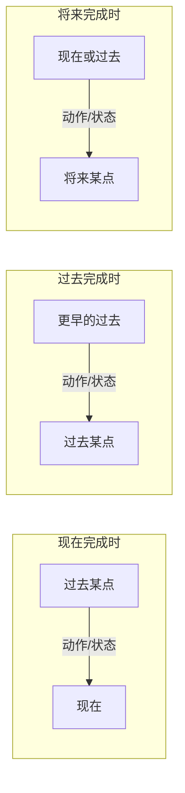
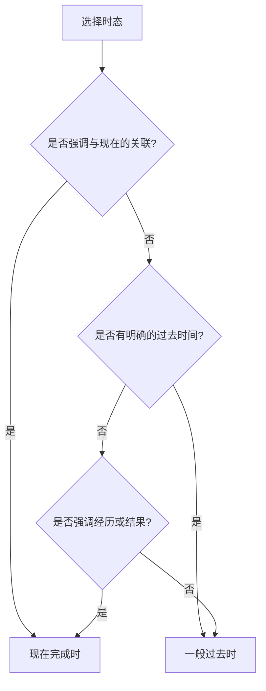
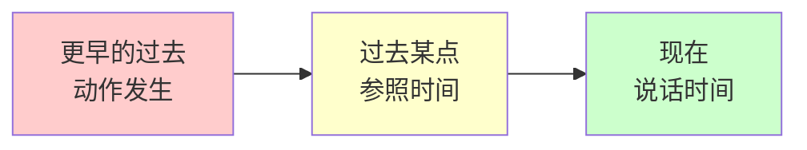
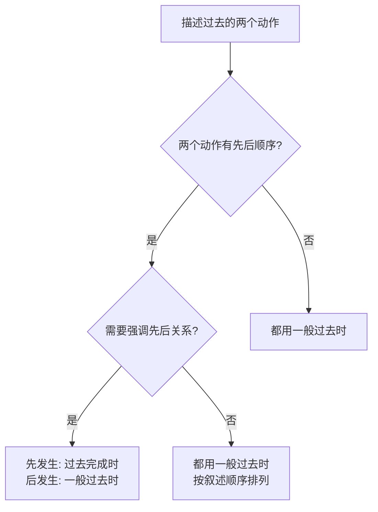
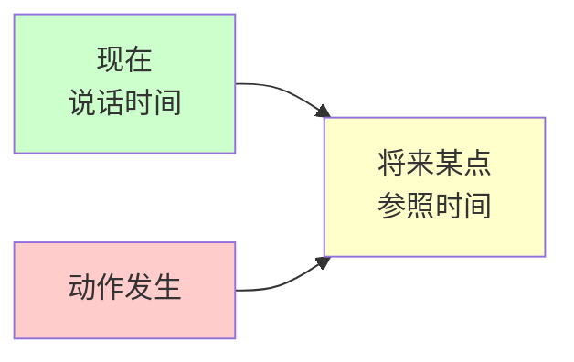
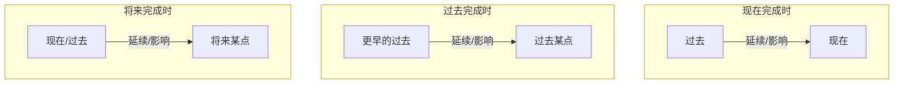

# 完成时态详解

完成时态（Perfect Tense）是英语时态系统中最具特色的一类时态，它表达的不仅仅是动作发生的时间，更强调动作的**完成性**和**与特定时间点的关联性**。掌握完成时态是理解英语时态体系的关键一环，也是区分中式英语和地道英语表达的重要标志。

## 1. 完成时态概述

### 1.1 什么是完成时态

完成时态用于表示在某个时间点之前**已经完成**的动作，或者表示从过去某个时间**延续到**另一个时间点的动作或状态。与一般时态关注"动作发生在什么时候"不同，完成时态关注的是"动作的结果"或"动作与某个时间点的关系"。

> [!info] 核心概念
>
> 完成时态的本质是建立**两个时间点之间的联系**：
> - 动作发生的时间
> - 说话或参照的时间
>
> 这种联系可以是动作的**结果**延续到参照时间，也可以是动作本身**跨越**到参照时间。

### 1.2 完成时态的基本构成

所有完成时态都由助动词 **have** 的某种形式加上动词的**过去分词**（past participle）构成：

| 时态 | 构成公式 | 示例 |
| --- | --- | --- |
| 现在完成时 | have/has + 过去分词 | I have finished. |
| 过去完成时 | had + 过去分词 | I had finished. |
| 将来完成时 | will have + 过去分词 | I will have finished. |

### 1.3 完成时态的时间轴概念



上图展示了三种完成时态的时间关系。现在完成时连接过去与现在，过去完成时连接更早的过去与过去某点，将来完成时则连接现在（或过去）与将来某个时间点。理解这种"连接"的概念是掌握完成时态的关键。

---

## 2. 现在完成时

现在完成时（Present Perfect Tense）是完成时态中使用频率最高的一种，也是中国学习者最容易混淆的时态之一。

### 2.1 基本构成

**肯定句**：主语 + have/has + 过去分词

**否定句**：主语 + have/has + not + 过去分词

**疑问句**：Have/Has + 主语 + 过去分词？

| 人称 | 肯定句 | 否定句 | 疑问句 |
| --- | --- | --- | --- |
| I/You/We/They | have done | have not (haven't) done | Have ... done? |
| He/She/It | has done | has not (hasn't) done | Has ... done? |

> [!example] 基础句型示例
>
> **肯定句**：
> - I **have finished** my homework.（我已经完成了作业。）
> - She **has lived** here for five years.（她已经在这里住了五年。）
>
> **否定句**：
> - We **haven't received** the package yet.（我们还没有收到包裹。）
> - He **hasn't called** me back.（他还没有给我回电话。）
>
> **疑问句**：
> - **Have** you **seen** this movie?（你看过这部电影吗？）
> - **Has** she **ever been** to Japan?（她去过日本吗？）

### 2.2 现在完成时的四大核心用法

#### 2.2.1 表示过去发生的动作对现在产生的结果或影响

这是现在完成时最基本的用法。动作虽然发生在过去，但其结果或影响在说话时依然存在。

> [!tip] 理解要点
>
> 使用这种用法时，说话者关注的**不是动作发生的具体时间**，而是**动作带来的现在结果**。如果强调具体的过去时间，则应使用一般过去时。

**例句分析**：

| 英文 | 中文 | 句法分析 |
| --- | --- | --- |
| I have lost my keys. | 我把钥匙弄丢了。 | 过去丢失，现在还没找到（结果：现在没有钥匙） |
| She has broken her leg. | 她摔断了腿。 | 过去摔断，现在还是断的（结果：现在腿是断的） |
| The train has left. | 火车已经开走了。 | 过去开走，现在不在站台（结果：现在赶不上了） |
| Someone has eaten my sandwich. | 有人吃了我的三明治。 | 过去被吃，现在没有了（结果：三明治不见了） |

**对比一般过去时**：

| 现在完成时 | 一般过去时 |
| --- | --- |
| I **have lost** my keys. (钥匙现在还没找到) | I **lost** my keys yesterday. (昨天丢的，可能已找到) |
| He **has gone** to Paris. (他去巴黎了，现在不在这里) | He **went** to Paris last month. (上个月去的，可能已回来) |

#### 2.2.2 表示从过去延续到现在的动作或状态

动作或状态从过去某个时间开始，一直延续到现在，而且可能还会继续下去。这种用法常与表示一段时间的状语连用。

**常见时间状语**：

| 类型 | 时间状语 | 例句 |
| --- | --- | --- |
| for + 时间段 | for three years, for a long time | I have lived here **for ten years**. |
| since + 时间点 | since 2010, since last Monday | She has worked here **since 2020**. |
| 其他表达 | all day, all my life, so far | We have been friends **all our lives**. |

> [!warning] 注意区分
>
> **for** 后接**时间段**（一段时间）：for two hours, for a week
>
> **since** 后接**时间点**（具体时刻）：since Monday, since 1990, since I was a child
>
> 不要混淆：
> - ✅ I have lived here **for** five years.
> - ✅ I have lived here **since** 2019.
> - ❌ I have lived here **for** 2019.
> - ❌ I have lived here **since** five years.

**例句分析**：

```
I have known him for twenty years.
我认识他已经二十年了。
├── have known: 现在完成时，表示延续
├── for twenty years: 时间段，从20年前到现在
└── 暗示：现在仍然认识，关系还在持续
```

```
She has been a teacher since she graduated.
她毕业后就一直当老师。
├── has been: 现在完成时，表示状态延续
├── since she graduated: 从毕业那个时间点开始
└── 暗示：现在仍然是老师
```

#### 2.2.3 表示过去的经历或经验

描述从过去到现在为止的人生经历，强调"是否有过某种经验"，而不关注具体发生的时间。

**常见搭配词汇**：

| 词汇 | 含义 | 位置 |
| --- | --- | --- |
| ever | 曾经（用于疑问句） | have 与过去分词之间 |
| never | 从不、从未 | have 与过去分词之间 |
| before | 以前 | 句末 |
| already | 已经 | have 与过去分词之间或句末 |
| yet | 还（否定句）、已经（疑问句） | 句末 |

**例句分析**：

| 英文 | 中文 | 分析 |
| --- | --- | --- |
| Have you **ever** been to London? | 你曾经去过伦敦吗？ | 询问人生经历 |
| I have **never** seen such a beautiful sunset. | 我从未见过如此美丽的日落。 | 强调从未有过的经历 |
| She has visited Paris three times. | 她去过巴黎三次。 | 强调经历的次数 |
| This is the best movie I have **ever** watched. | 这是我看过的最好的电影。 | 在所有经历中做比较 |

> [!example] have been to vs. have gone to
>
> **have been to** 表示"去过某地"（已经回来了）：
> - I **have been to** Japan twice.（我去过日本两次。——现在不在日本）
>
> **have gone to** 表示"去了某地"（现在在那里或在去的路上）：
> - He **has gone to** Japan.（他去日本了。——现在在日本或在去日本的路上）

#### 2.2.4 表示到目前为止反复发生的动作

动作从过去某个时间开始，到现在为止多次重复发生，而且将来可能还会发生。

**例句分析**：

```
I have read this book five times.
这本书我已经读了五遍了。
├── have read: 现在完成时
├── five times: 表示重复的次数
└── 暗示：可能还会再读
```

```
We have had three meetings this week.
这周我们已经开了三次会了。
├── have had: 现在完成时
├── three meetings: 重复发生
├── this week: 这周还没结束
└── 暗示：这周可能还会有会议
```

### 2.3 现在完成时的时间状语

#### 2.3.1 可以与现在完成时连用的时间状语

| 类型 | 时间状语 | 例句 |
| --- | --- | --- |
| 表示"到现在" | up to now, so far, until now | So far, we have collected 500 dollars. |
| 表示"最近" | recently, lately, in recent years | I have been very busy recently. |
| 表示"时间段" | for + 时间段, since + 时间点 | She has studied English for 10 years. |
| 表示"次数" | once, twice, three times | I have visited the museum twice. |
| 表示"已/未" | already, yet, ever, never, just | Have you finished yet? |
| 表示"当前时间段" | today, this week/month/year | I have written three emails today. |
| 表示"整个人生" | in my life, all my life | This is the best day in my life. |

#### 2.3.2 不能与现在完成时连用的时间状语

> [!warning] 重要规则
>
> 表示**明确过去时间点**的状语**不能**与现在完成时连用，必须使用一般过去时。

| 不能使用的时间状语 | 错误用法 | 正确用法 |
| --- | --- | --- |
| yesterday | ❌ I have seen him yesterday. | ✅ I saw him yesterday. |
| last week/month/year | ❌ She has arrived last week. | ✅ She arrived last week. |
| in 2020 | ❌ He has graduated in 2020. | ✅ He graduated in 2020. |
| ago | ❌ They have left two hours ago. | ✅ They left two hours ago. |
| when 引导的从句 | ❌ I have met her when I was young. | ✅ I met her when I was young. |

### 2.4 现在完成时与一般过去时的对比

这是中国学习者最常见的困惑点。理解两者的区别对于正确使用时态至关重要。



**核心区别对比表**：

| 对比维度 | 现在完成时 | 一般过去时 |
| --- | --- | --- |
| 时间关注点 | 动作与现在的关联 | 动作发生的过去时间 |
| 时间状语 | 不能用明确的过去时间点 | 常用明确的过去时间点 |
| 结果关注 | 强调现在的结果或影响 | 只陈述过去的事实 |
| 延续性 | 可表示延续到现在 | 表示过去完成的动作 |
| 常见搭配 | ever, never, already, yet, just | yesterday, ago, last... |

**详细对比例句**：

| 现在完成时 | 一般过去时 | 区别说明 |
| --- | --- | --- |
| I **have read** this book. | I **read** this book last year. | 前者强调"读过"这个经历；后者强调"去年"这个时间 |
| She **has left**. (她走了) | She **left** an hour ago. (她一小时前走了) | 前者强调"现在不在"；后者强调"一小时前" |
| I **have lost** my wallet. | I **lost** my wallet, but I found it. | 前者暗示现在还没找到；后者说明已经找到了 |
| **Have** you **had** lunch? | **Did** you **have** lunch? | 前者关心现在饿不饿；后者单纯询问过去的事 |

> [!tip] 实用判断技巧
>
> 当你不确定使用哪个时态时，问自己：
> 1. 这个信息与**现在**有关系吗？
> 2. 我是否在意动作发生的**具体时间**？
> 3. 动作的**结果**现在还存在吗？
>
> 如果答案偏向"是、否、是"，用现在完成时；
> 如果答案偏向"否、是、否"，用一般过去时。

### 2.5 现在完成时的特殊用法

#### 2.5.1 在时间/条件状语从句中代替将来完成时

在 when, after, before, as soon as, until 等引导的时间状语从句中，用现在完成时代替将来完成时。

**例句**：
- I will tell him **after** I **have finished** my work.（我完成工作后会告诉他。）
- **When** you **have read** the book, please return it to me.（你读完这本书后，请还给我。）
- Don't leave **until** you **have checked** everything.（检查完一切再走。）

#### 2.5.2 It/This/That is the first/second... time 句型

在 "It/This/That is the first/second/third... time (that)..." 句型中，从句用现在完成时。

**例句**：
- This is the first time (that) I **have been** to Beijing.（这是我第一次来北京。）
- It is the third time (that) he **has made** the same mistake.（这是他第三次犯同样的错误了。）

> [!warning] 注意时态变化
>
> 如果主句是过去时，从句也要用过去完成时：
> - That **was** the first time (that) I **had seen** the ocean.（那是我第一次见到大海。）

#### 2.5.3 It is/has been + 时间段 + since 句型

表示"自从……以来已经有多长时间了"。

**例句**：
- It **is** / **has been** five years since I last saw him.（我上次见到他已经是五年前了。）
- It **is** / **has been** a long time since we met.（我们已经很久没见面了。）

---

## 3. 过去完成时

过去完成时（Past Perfect Tense）表示在过去某个时间点之前已经完成的动作，常被称为"过去的过去"。

### 3.1 基本构成

**肯定句**：主语 + had + 过去分词

**否定句**：主语 + had not (hadn't) + 过去分词

**疑问句**：Had + 主语 + 过去分词？

| 句型 | 结构 | 示例 |
| --- | --- | --- |
| 肯定句 | had + 过去分词 | I had finished the work. |
| 否定句 | had not + 过去分词 | I had not (hadn't) finished the work. |
| 疑问句 | Had + 主语 + 过去分词 | Had you finished the work? |

> [!info] 构成特点
>
> 过去完成时的构成非常简单，不受人称和数的影响，所有主语都使用 **had + 过去分词**。

### 3.2 过去完成时的时间概念



过去完成时描述的是在"过去某个时间点"之前就已经完成的动作。必须有一个"过去的参照点"，过去完成时才有意义。

### 3.3 过去完成时的核心用法

#### 3.3.1 表示"过去的过去"

在描述过去两个动作时，先发生的动作用过去完成时，后发生的用一般过去时。

**例句分析**：

```
When I arrived at the station, the train had already left.
当我到达车站时，火车已经开走了。
├── arrived: 一般过去时（后发生的动作——到达）
├── had left: 过去完成时（先发生的动作——开走）
└── 时间顺序：火车开走 → 我到达
```

```
I realized that I had forgotten my wallet at home.
我意识到我把钱包忘在家里了。
├── realized: 一般过去时（后发生——意识到）
├── had forgotten: 过去完成时（先发生——忘记）
└── 时间顺序：忘记钱包 → 意识到
```

**更多例句**：

| 英文 | 中文 | 时间顺序分析 |
| --- | --- | --- |
| She told me that she **had seen** the movie before. | 她告诉我她以前看过那部电影。 | 看电影 → 告诉我 |
| After he **had finished** dinner, he went for a walk. | 他吃完晚饭后去散步了。 | 吃晚饭 → 散步 |
| By the time I got home, my parents **had gone** to bed. | 我到家时，父母已经睡了。 | 父母睡觉 → 我到家 |
| The movie **had started** when we arrived at the cinema. | 我们到电影院时，电影已经开始了。 | 电影开始 → 我们到达 |

#### 3.3.2 表示过去某时之前延续的动作或状态

与现在完成时类似，过去完成时也可以表示从更早的过去延续到过去某个时间点的动作或状态。

**例句分析**：

```
By 2020, I had lived in Beijing for ten years.
到2020年，我已经在北京住了十年了。
├── By 2020: 过去的参照时间点
├── had lived: 过去完成时
├── for ten years: 延续的时间段
└── 时间跨度：2010年 → 2020年
```

```
When I met her, she had worked as a nurse for 20 years.
我遇见她时，她已经当了20年护士了。
├── When I met her: 过去的参照点
├── had worked: 过去完成时
└── 从更早开始，延续到"遇见她"那个时候
```

#### 3.3.3 用于表示过去未实现的愿望或计划

过去完成时可以与 hope, want, expect, think, mean, plan, intend 等动词连用，表示过去未能实现的愿望、计划或打算。

**例句**：

| 英文 | 中文 | 分析 |
| --- | --- | --- |
| I **had hoped** to visit you, but I was too busy. | 我本来希望去看你的，但是太忙了。 | 希望落空 |
| She **had wanted** to be a doctor. | 她曾经想当医生。 | 愿望未实现 |
| We **had planned** to go to the beach. | 我们本来计划去海滩的。 | 计划取消 |
| He **had intended** to apologize. | 他本来打算道歉的。 | 打算未执行 |

> [!tip] 语气含义
>
> 这种用法带有遗憾或惋惜的语气，暗示事情最终没有按计划发生。

#### 3.3.4 在特定句型中的使用

**1. 在虚拟条件句中（与过去事实相反）**

```
If I had known the truth, I would have told you.
如果我当时知道真相，我就会告诉你了。
├── had known: 过去完成时（if 从句，与过去事实相反）
├── would have told: 条件句主句（过去将来完成时）
└── 事实：当时不知道真相，所以没告诉
```

**2. 在 wish 引导的宾语从句中（对过去的虚拟）**

```
I wish I had studied harder in college.
我希望我大学时学习更努力一些。
├── wish: 表示愿望
├── had studied: 过去完成时（表示对过去的虚拟）
└── 事实：大学时没有努力学习
```

**3. It was the first/second... time that 句型**

```
It was the first time that I had traveled abroad.
那是我第一次出国旅行。
├── was: 主句用一般过去时
├── had traveled: 从句用过去完成时
└── 符合"主过从过完"的规则
```

### 3.4 过去完成时的常用时间状语

| 时间状语 | 含义 | 例句 |
| --- | --- | --- |
| by + 过去时间 | 到……为止 | By last year, I had visited 10 countries. |
| by the time + 过去时间 | 到……的时候 | By the time he called, I had left. |
| before + 过去时间 | 在……之前 | I had finished before noon. |
| after + 过去时间 | 在……之后 | After she had eaten, she felt better. |
| when + 过去时间 | 当……的时候 | When I woke up, the sun had risen. |
| already | 已经 | I had already heard the news. |
| just | 刚刚 | He had just left when I arrived. |
| never | 从未 | I had never seen such a thing before. |

### 3.5 过去完成时与一般过去时的对比



**对比示例**：

| 场景 | 过去完成时 | 一般过去时 |
| --- | --- | --- |
| 强调先后 | When I arrived, she **had left**. (她在我到之前就走了) | When I arrived, she **left**. (我一到她就走了) |
| 因果关系 | I was tired because I **had worked** all day. (之前工作了一整天，所以累) | I was tired and I **worked** all day. (累了，而且工作了一整天) |
| 经历描述 | I **had never eaten** sushi before that day. (那天之前从没吃过) | I **never ate** sushi as a child. (小时候不吃寿司) |

> [!warning] 何时可以省略过去完成时
>
> 当动作的先后顺序已经通过连词（before, after）或上下文明确表示时，可以都用一般过去时：
> - After I **finished** work, I **went** home. ✅
> - After I **had finished** work, I **went** home. ✅
>
> 两种说法都正确，但使用过去完成时更强调时间的先后关系。

---

## 4. 将来完成时

将来完成时（Future Perfect Tense）表示在将来某个时间点之前将要完成的动作。

### 4.1 基本构成

**肯定句**：主语 + will have + 过去分词

**否定句**：主语 + will not (won't) have + 过去分词

**疑问句**：Will + 主语 + have + 过去分词？

| 句型 | 结构 | 示例 |
| --- | --- | --- |
| 肯定句 | will have + 过去分词 | I will have finished by then. |
| 否定句 | won't have + 过去分词 | I won't have finished by then. |
| 疑问句 | Will + 主语 + have + 过去分词 | Will you have finished by then? |

### 4.2 将来完成时的时间概念



将来完成时表示从现在看，到将来某个时间点时，某个动作将已经完成。

### 4.3 将来完成时的核心用法

#### 4.3.1 表示将来某时之前完成的动作

**例句分析**：

```
By next Friday, I will have finished this project.
到下周五，我将完成这个项目。
├── By next Friday: 将来的时间点
├── will have finished: 将来完成时
└── 表示：从现在到下周五之间的某个时候会完成
```

```
By the time you arrive, I will have cooked dinner.
你到的时候，我将已经做好晚饭了。
├── By the time you arrive: 将来的参照点
├── will have cooked: 将来完成时
└── 表示：在"你到达"之前完成做饭
```

**更多例句**：

| 英文 | 中文 | 时间分析 |
| --- | --- | --- |
| By 2030, I **will have worked** here for 20 years. | 到2030年，我将在这里工作满20年。 | 现在→2030年，共20年 |
| She **will have graduated** by the end of next year. | 她明年年底前将毕业。 | 现在→明年年底，毕业完成 |
| The train **will have left** by the time we get there. | 我们到那里时，火车将已经开走了。 | 预测：我们到达之前火车就走了 |
| I **will have read** 50 books by December. | 到十二月，我将读完50本书。 | 从年初/某时到十二月 |

#### 4.3.2 表示将来某时之前延续的动作或状态

与其他完成时态类似，将来完成时也可以表示延续到将来某个时间点的动作或状态。

**例句**：
- By next month, we **will have been** married for ten years.（到下个月，我们将结婚十年了。）
- By the end of this year, she **will have lived** in London for five years.（到今年年底，她将在伦敦住满五年。）

#### 4.3.3 表示对将来情况的推测

将来完成时有时用于推测到某个将来时间点，某事是否已经发生。

**例句**：
- You **will have heard** the news by now.（到现在你应该已经听说那个消息了。）
- They **will have arrived** by this time tomorrow.（到明天这个时候，他们应该已经到了。）

### 4.4 将来完成时的常用时间状语

| 时间状语 | 含义 | 例句 |
| --- | --- | --- |
| by + 将来时间 | 到……为止 | by tomorrow, by next week |
| by the time + 从句 | 到……的时候 | by the time you come back |
| by the end of | 到……结束时 | by the end of this month |
| in + 时间段 | 在……之后 | in two hours |
| before + 将来时间 | 在……之前 | before Friday |

> [!warning] 时间状语从句中的时态
>
> 在 by the time, when, before, after 等引导的时间状语从句中，即使表示将来的意思，也要用**一般现在时**代替将来时：
> - By the time you **come** back, I will have finished. ✅
> - By the time you **will come** back, I will have finished. ❌

### 4.5 将来完成时与一般将来时的对比

| 对比维度 | 将来完成时 | 一般将来时 |
| --- | --- | --- |
| 时间关注点 | 将来某时之前完成 | 将来要做某事 |
| 强调重点 | 动作的完成 | 动作本身 |
| 常见时间状语 | by..., by the time... | tomorrow, next week... |

**对比例句**：

| 将来完成时 | 一般将来时 |
| --- | --- |
| I **will have finished** by 5 o'clock. (5点之前完成) | I **will finish** at 5 o'clock. (5点完成) |
| She **will have left** when you arrive. (你到时她已走) | She **will leave** when you arrive. (你到时她才走) |

---

## 5. 完成进行时态

完成进行时态将完成时态与进行时态结合，强调动作的**延续性**和**持续性**。

### 5.1 现在完成进行时

**构成**：have/has + been + 动词-ing

**用法**：表示从过去开始一直延续到现在、可能还要继续下去的动作，强调动作的持续性。

**例句分析**：

```
I have been waiting for you for two hours.
我已经等你两个小时了。
├── have been waiting: 现在完成进行时
├── for two hours: 持续的时间
└── 强调：等待这个动作一直在进行，可能还会继续
```

**现在完成时 vs. 现在完成进行时**：

| 现在完成时 | 现在完成进行时 |
| --- | --- |
| I **have read** 3 books this month. (强调结果：读完了3本) | I **have been reading** this book. (强调过程：一直在读) |
| She **has worked** here for 5 years. (陈述事实) | She **has been working** very hard. (强调努力的状态) |
| It **has rained**. (下过雨，地是湿的) | It **has been raining** all day. (一直在下，还在下) |

### 5.2 过去完成进行时

**构成**：had + been + 动词-ing

**用法**：表示在过去某个时间点之前一直持续进行的动作。

**例句**：
- When I saw her, she **had been crying**.（我看到她时，她一直在哭。）
- They **had been working** on the project for months before they finished.（他们完成项目前已经工作了好几个月。）

### 5.3 将来完成进行时

**构成**：will have + been + 动词-ing

**用法**：表示到将来某个时间点为止，某动作将一直在进行。

**例句**：
- By next year, I **will have been teaching** for 20 years.（到明年，我将教书满20年。）
- By the time we arrive, they **will have been waiting** for hours.（我们到达时，他们将已经等了好几个小时。）

---

## 6. 完成时态综合对比

### 6.1 三种完成时态的对比



| 时态 | 时间参照点 | 核心功能 | 典型时间状语 |
| --- | --- | --- | --- |
| 现在完成时 | 现在 | 连接过去与现在 | already, yet, ever, for, since |
| 过去完成时 | 过去某点 | 表示过去的过去 | by + 过去时间, before |
| 将来完成时 | 将来某点 | 将来某时前完成 | by + 将来时间, by the time |

### 6.2 完成时态 vs. 一般时态

| 对比维度 | 完成时态 | 一般时态 |
| --- | --- | --- |
| 时间关系 | 强调两个时间点的联系 | 只关注一个时间点 |
| 动作完成性 | 强调完成或延续 | 只陈述发生 |
| 结果关注 | 关注结果和影响 | 关注动作本身 |
| 时间状语限制 | 有限制 | 较自由 |

### 6.3 完成时态 vs. 进行时态

| 对比维度 | 完成时态 | 进行时态 |
| --- | --- | --- |
| 动作特点 | 强调完成 | 强调进行中 |
| 时间跨度 | 从过去到某个时间点 | 某个时间点正在发生 |
| 常见搭配 | for, since, already, yet | now, at the moment |

---

## 7. 完成时态常见错误与纠正

### 7.1 时间状语误用

> [!warning] 错误类型一：与明确过去时间连用
>
> ❌ I **have visited** Beijing last year.
>
> ✅ I **visited** Beijing last year.
>
> ✅ I **have visited** Beijing.（不指明具体时间）
>
> **原因**：现在完成时不能与明确的过去时间点连用。

> [!warning] 错误类型二：for 与 since 混淆
>
> ❌ I have lived here **since** three years.
>
> ✅ I have lived here **for** three years.
>
> ✅ I have lived here **since** 2020.
>
> **原因**：for 后接时间段，since 后接时间点。

### 7.2 have been to 与 have gone to 混淆

> [!warning] 错误类型三：去向表达错误
>
> 情境：Tom 现在不在这里，他去北京了。
>
> ❌ Tom **has been to** Beijing.（表示去过，已回来）
>
> ✅ Tom **has gone to** Beijing.（表示去了，现在在北京）

### 7.3 过去完成时的滥用

> [!warning] 错误类型四：无参照点使用过去完成时
>
> ❌ I **had finished** my homework.（单独使用，没有过去参照点）
>
> ✅ I **had finished** my homework **when** he arrived.（有参照点）
>
> ✅ I **have finished** my homework.（如果要表示现在完成）
>
> **原因**：过去完成时必须有一个过去的参照时间点。

### 7.4 短暂动词与完成时态

部分表示短暂动作的动词（如 die, marry, arrive, leave, finish, begin）在完成时态中不能与表示延续的时间状语连用。

> [!warning] 错误类型五：短暂动词与延续时间连用
>
> ❌ His father **has died** for ten years.
>
> ✅ His father **has been dead** for ten years.
>
> ✅ His father **died** ten years ago.
>
> ✅ It **has been** ten years since his father died.

**常见短暂动词的完成时态转换**：

| 短暂动词 | 延续表达 | 例句 |
| --- | --- | --- |
| die | be dead | He has been dead for 5 years. |
| leave | be away | She has been away for a week. |
| buy | have | I have had this car for 3 years. |
| borrow | keep | I have kept this book for a month. |
| begin/start | be on | The movie has been on for 30 minutes. |
| join | be in/be a member of | He has been in the army for 2 years. |
| marry | be married | They have been married for 10 years. |
| arrive/come | be here | He has been here since Monday. |
| go | be there | She has been there for 2 hours. |
| open | be open | The shop has been open since 8 a.m. |
| close | be closed | The library has been closed for 3 days. |

---

## 8. 完成时态综合练习

### 8.1 选择填空

**请选择正确的时态填空**：

1. I ______ (live) in this city for ten years.
   - A. live
   - B. lived
   - C. have lived
   - D. had lived

2. By the time she arrived, we ______ (wait) for two hours.
   - A. waited
   - B. have waited
   - C. had waited
   - D. will have waited

3. She ______ (be) to Paris three times.
   - A. has been
   - B. has gone
   - C. went
   - D. had been

4. By next month, I ______ (work) here for five years.
   - A. will work
   - B. have worked
   - C. will have worked
   - D. had worked

5. I ______ (finish) the book yesterday.
   - A. finish
   - B. have finished
   - C. finished
   - D. had finished

> [!tip] 答案与解析
>
> 1. **C. have lived** — for ten years 表示时间段，从过去延续到现在，用现在完成时。
>
> 2. **C. had waited** — by the time 引导的时间点是过去，之前发生的动作用过去完成时。
>
> 3. **A. has been** — "去过"某地表示经历，用 have been to。
>
> 4. **C. will have worked** — by next month 是将来时间点，表示到那时将完成，用将来完成时。
>
> 5. **C. finished** — yesterday 是明确的过去时间点，不能用完成时态。

### 8.2 句子改错

**找出并改正下列句子中的错误**：

1. I have seen him yesterday.
2. She has married for ten years.
3. When I arrived, he left.
4. I have been to the supermarket. I am not at home now.
5. By the time you will come, I will have left.

> [!tip] 答案与解析
>
> 1. ❌ I have seen him yesterday.
>    ✅ I **saw** him yesterday.
>    **解析**：yesterday 是明确的过去时间，不能与现在完成时连用。
>
> 2. ❌ She has married for ten years.
>    ✅ She **has been married** for ten years.
>    **解析**：marry 是短暂动词，不能与 for + 时间段连用，需改为延续性表达。
>
> 3. ❌ When I arrived, he left.
>    ✅ When I arrived, he **had left**.
>    **解析**：他离开发生在我到达之前，是"过去的过去"，应用过去完成时。
>
> 4. ❌ I have been to the supermarket. I am not at home now.
>    ✅ I **have gone** to the supermarket. I am not at home now.
>    **解析**：have been to 表示去过并回来了；have gone to 表示去了还没回来。
>
> 5. ❌ By the time you will come, I will have left.
>    ✅ By the time you **come**, I will have left.
>    **解析**：时间状语从句中用一般现在时代替将来时。

### 8.3 翻译练习

**将下列句子翻译成英语**：

1. 我已经完成了作业。
2. 到明年，他们将结婚二十年了。
3. 火车开走之前，我们到达了车站。
4. 你曾经去过纽约吗？
5. 到他打电话来的时候，我已经等了一个小时了。

> [!tip] 参考答案
>
> 1. I have finished my homework.
>    - 现在完成时，表示完成对现在的影响（作业已完成）
>
> 2. By next year, they will have been married for twenty years.
>    - 将来完成时，表示到将来某时的延续状态
>
> 3. We arrived at the station before the train left. / We had arrived at the station before the train left.
>    - before 已明确先后，两种时态都可接受
>
> 4. Have you ever been to New York?
>    - 现在完成时，询问经历，用 have been to
>
> 5. By the time he called, I had been waiting for an hour.
>    - 过去完成进行时，强调等待的持续性

---

## 9. 本章小结

完成时态是英语时态系统中表达时间关系最精细的一类时态。通过本章的学习，你应该掌握以下要点：

### 9.1 核心概念

- 完成时态的本质是建立**两个时间点之间的联系**
- 所有完成时态都由 **have 的某种形式 + 过去分词** 构成
- 完成时态强调动作的**完成性**或**延续性**

### 9.2 三种完成时态的要点

| 时态 | 公式 | 核心用法 | 典型标志词 |
| --- | --- | --- | --- |
| 现在完成时 | have/has + done | 过去对现在的影响、经历、延续 | already, yet, ever, never, for, since |
| 过去完成时 | had + done | 过去的过去、过去某时前的延续 | by + 过去时间, before |
| 将来完成时 | will have + done | 将来某时前完成 | by + 将来时间, by the time |

### 9.3 关键区分点

1. **现在完成时 vs. 一般过去时**：现在完成时强调与现在的联系，一般过去时强调过去的时间点
2. **have been to vs. have gone to**：前者表示去过已回来，后者表示去了不在这里
3. **完成时态 vs. 完成进行时态**：前者强调完成，后者强调持续进行

### 9.4 常见陷阱

- 不要将现在完成时与明确的过去时间状语连用
- 注意 for（时间段）和 since（时间点）的区别
- 短暂动词需转换为延续性表达才能与时间段连用
- 过去完成时必须有过去的参照时间点
- 时间状语从句中用一般现在时代替将来时

> [!success] 学习建议
>
> 1. **多读原版材料**：通过大量阅读感受完成时态的自然使用语境
> 2. **对比记忆**：将完成时态与一般时态、进行时态进行对比学习
> 3. **造句练习**：用每种完成时态各造10个句子，巩固理解
> 4. **语境判断**：遇到时态选择时，先分析时间关系和强调重点
> 5. **错题积累**：记录并分析自己常犯的完成时态错误

---

## 附录：完成时态速查表

### A. 构成公式

| 时态 | 肯定句 | 否定句 | 疑问句 |
| --- | --- | --- | --- |
| 现在完成时 | have/has + done | haven't/hasn't + done | Have/Has + 主语 + done? |
| 过去完成时 | had + done | hadn't + done | Had + 主语 + done? |
| 将来完成时 | will have + done | won't have + done | Will + 主语 + have + done? |

### B. 常用时间状语对照

| 时态 | 可用时间状语 | 不可用时间状语 |
| --- | --- | --- |
| 现在完成时 | already, yet, ever, never, just, recently, so far, for + 时间段, since + 时间点, this week/month/year | yesterday, last week, ago, in 2020, when... |
| 过去完成时 | by + 过去时间, before + 过去时间, by the time + 过去 | — |
| 将来完成时 | by + 将来时间, by the time + 将来, by the end of | — |

### C. 短暂动词转换表

| 短暂动词 | 延续性表达 |
| --- | --- |
| die | be dead |
| leave | be away |
| buy | have |
| borrow | keep |
| begin/start | be on |
| join | be in / be a member of |
| marry | be married |
| arrive/come | be here |
| go | be there |
| open | be open |
| close | be closed |
| finish | be over |
