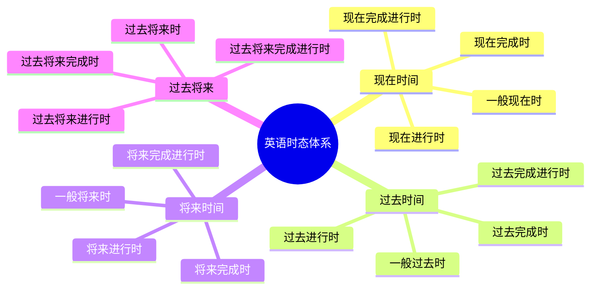
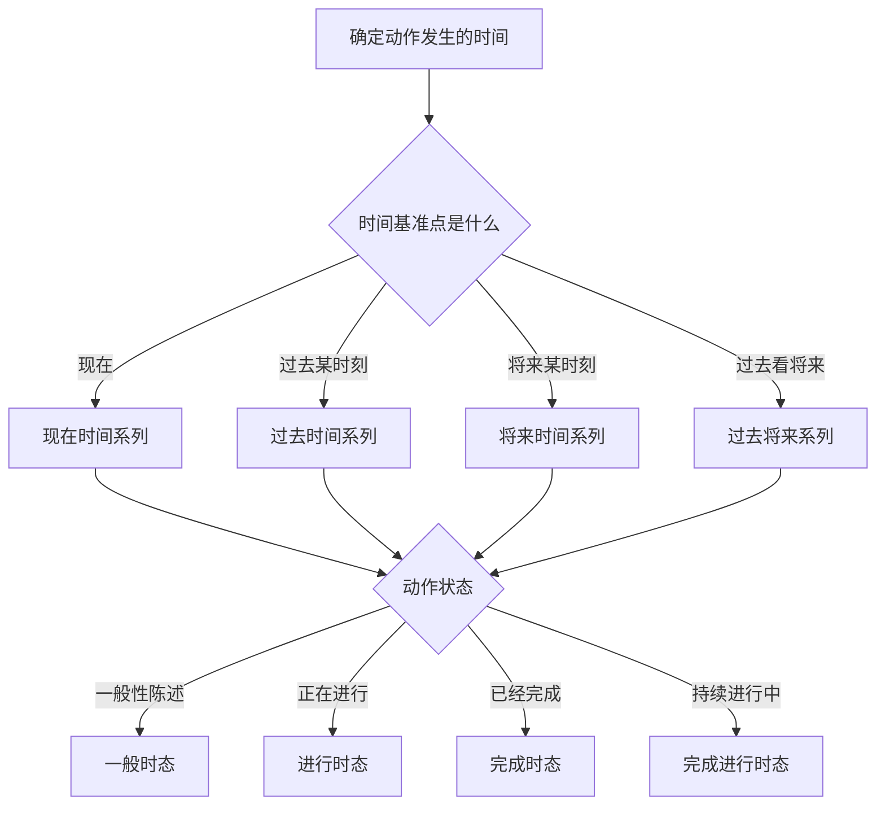
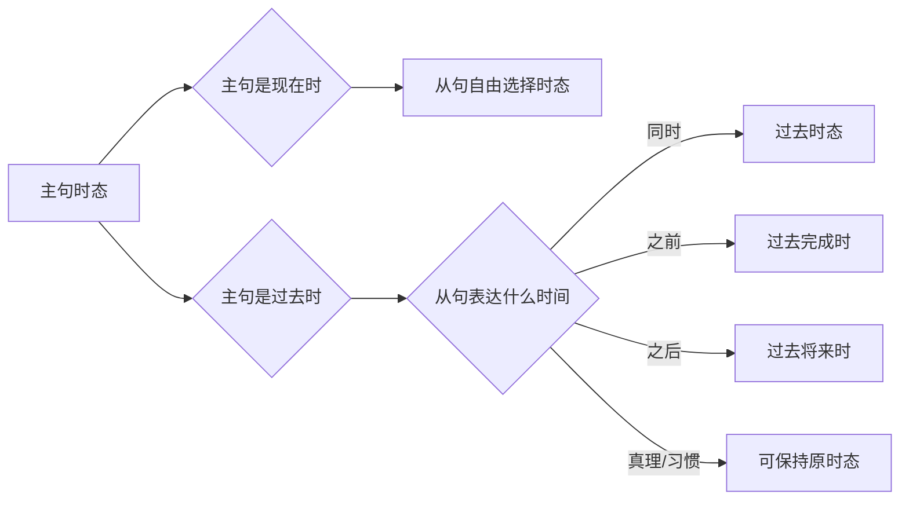
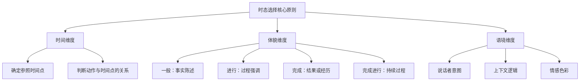

# 时态综合运用与辨析

经过前面四篇文档的学习，我们已经分别掌握了一般时态、进行时态和完成时态的基本用法。本篇作为动词时态章节的收官之作，将从宏观视角出发，对英语的十六种时态进行系统性的对比与综合分析，帮助读者建立完整的时态认知框架，并重点解决实际运用中的易混淆问题。

## 1. 英语时态体系全景图

### 1.1 时态的本质：时间与体貌的结合

英语时态（Tense and Aspect）实际上是两个概念的结合：**时（Tense）** 表示动作发生的时间点，**体（Aspect）** 表示动作的状态或完成程度。

> [!info] 时态的双重维度
>
> - **时（Tense）**：过去、现在、将来、过去将来——表示动作在时间轴上的位置
> - **体（Aspect）**：一般、进行、完成、完成进行——表示动作的内部状态
>
> 两个维度交叉组合，形成了英语的 **4 × 4 = 16 种时态**。

### 1.2 十六种时态一览表

下表完整展示了英语的十六种时态及其基本结构：

| 体 \ 时 | 现在 | 过去 | 将来 | 过去将来 |
| --- | --- | --- | --- | --- |
| **一般** | do/does | did | will do | would do |
| **进行** | am/is/are doing | was/were doing | will be doing | would be doing |
| **完成** | have/has done | had done | will have done | would have done |
| **完成进行** | have/has been doing | had been doing | will have been doing | would have been doing |

> [!tip] 记忆技巧
>
> 将时态理解为一个二维坐标系：
> - 横轴是"时间"：现在 → 过去 → 将来 → 过去将来
> - 纵轴是"体貌"：一般 → 进行 → 完成 → 完成进行
>
> 任何时态都是这两个坐标的交叉点。

### 1.3 时态体系的可视化呈现



这个思维导图展示了英语时态体系的完整结构。四个时间维度各自包含四种体貌形式，共同构成了十六种时态。在实际使用中，一般时态、进行时态和完成时态是最常用的，完成进行时态则相对较少使用，但在表达特定语义时不可或缺。

## 2. 时态选择的核心思路

### 2.1 时态选择的三个关键问题

在选择时态时，需要依次回答三个问题：

**第一步：确定时间基准点**
- 动作相对于什么时间点？（现在/过去的某个时刻/将来的某个时刻）

**第二步：确定动作与时间点的关系**
- 动作发生在该时间点之前、之后，还是同时？

**第三步：确定动作的状态**
- 动作是一般性陈述、正在进行、已经完成，还是持续进行中？

> [!example] 时态选择实例分析
>
> **句子**：By the time you arrive, I ___ (finish) the report.
>
> 分析过程：
> 1. 时间基准点：你到达的那个时刻（将来的某一时刻）
> 2. 动作与时间点的关系：完成报告发生在到达之前
> 3. 动作状态：强调动作的完成
>
> **答案**：will have finished（将来完成时）

### 2.2 时态选择决策流程



这个流程图展示了时态选择的基本逻辑。首先确定时间基准点，再根据动作的状态选择相应的体貌形式。这种分步决策方法可以帮助学习者在复杂语境中准确选择时态。

### 2.3 时间状语与时态的对应关系

时间状语是判断时态的重要依据，下表整理了常见时间状语与时态的对应关系：

| 时间状语类型 | 典型词汇/短语 | 常用时态 |
| --- | --- | --- |
| 现在时间点 | now, at present, currently | 现在进行时 |
| 习惯/规律 | always, usually, every day | 一般现在时 |
| 过去确定时间 | yesterday, last week, in 2020 | 一般过去时 |
| 过去某时刻 | at that moment, at 8 o'clock yesterday | 过去进行时 |
| 现在之前到现在 | since, for, so far, up to now | 现在完成时/现在完成进行时 |
| 过去之前 | by the time, before, by then | 过去完成时 |
| 将来确定时间 | tomorrow, next week, in 2030 | 一般将来时 |
| 将来某时刻 | at this time tomorrow | 将来进行时 |
| 将来之前 | by next month, by the time | 将来完成时 |

> [!warning] 时间状语不是唯一依据
>
> 时间状语可以帮助判断时态，但不能机械地只看时间状语。有些句子没有明确的时间状语，需要根据上下文语境判断；有些句子的时间状语可能与多种时态兼容，需要根据说话者的表达意图选择。

## 3. 易混时态深度辨析

### 3.1 一般过去时 vs 现在完成时

这是中国学习者最常混淆的一对时态，两者都可以表示过去发生的动作，但语义侧重点完全不同。

#### 3.1.1 核心区别

| 维度 | 一般过去时 | 现在完成时 |
| --- | --- | --- |
| 时间焦点 | 强调过去的时间点 | 强调与现在的关联 |
| 与现在的关系 | 与现在无直接联系 | 对现在有影响或持续到现在 |
| 时间状语 | 常与明确的过去时间连用 | 常与 since, for, already 等连用 |
| 语义重心 | "那时候发生了什么" | "现在的状态如何" |

#### 3.1.2 对比例句分析

**例句组一：强调过去 vs 强调现在**

| 一般过去时 | 现在完成时 |
| --- | --- |
| I **lost** my keys yesterday. | I **have lost** my keys. |
| 我昨天丢了钥匙。（陈述过去的事实） | 我把钥匙弄丢了。（现在没有钥匙用） |

**例句组二：已结束 vs 可能继续**

| 一般过去时 | 现在完成时 |
| --- | --- |
| She **lived** in Paris for five years. | She **has lived** in Paris for five years. |
| 她在巴黎住过五年。（现在不住了） | 她在巴黎住了五年。（现在可能还住着） |

**例句组三：纯粹叙述 vs 经历意义**

| 一般过去时 | 现在完成时 |
| --- | --- |
| I **went** to Japan in 2019. | I **have been** to Japan. |
| 我2019年去了日本。（陈述过去事件） | 我去过日本。（强调有这个经历） |

> [!tip] 实用判断技巧
>
> 问自己一个问题："说这句话的目的是描述过去，还是说明现在？"
> - 如果是描述过去发生的事情本身 → 一般过去时
> - 如果是说明现在的状态或经历 → 现在完成时

#### 3.1.3 特殊情况说明

**情况一：与过去明确时间点连用时，只能用一般过去时**

```
✓ I saw him yesterday.（昨天我见到了他）
✗ I have seen him yesterday.（错误）
```

**情况二：询问经历时，通常用现在完成时；追问细节时，转为一般过去时**

```
A: Have you ever visited the Great Wall?（你去过长城吗？）
B: Yes, I have.（是的，去过。）
A: When did you go there?（你什么时候去的？）
B: I went there in 2018.（我2018年去的。）
```

### 3.2 现在完成时 vs 现在完成进行时

这两种时态都表示从过去持续到现在的动作，但在强调点和动作状态上有明显差异。

#### 3.2.1 核心区别

| 维度 | 现在完成时 | 现在完成进行时 |
| --- | --- | --- |
| 强调重点 | 动作的结果或完成 | 动作的过程或持续 |
| 动作状态 | 可能已完成 | 强调一直在进行 |
| 情感色彩 | 相对客观 | 常带有情感（疲惫、抱怨等） |
| 动词类型 | 适用于各类动词 | 多用于延续性动词 |

#### 3.2.2 对比例句分析

**例句组一：结果 vs 过程**

| 现在完成时 | 现在完成进行时 |
| --- | --- |
| I **have read** the book. | I **have been reading** the book. |
| 我读完了这本书。（强调读完了） | 我一直在读这本书。（强调持续阅读） |

**例句组二：完成 vs 未完成**

| 现在完成时 | 现在完成进行时 |
| --- | --- |
| I **have written** three reports. | I **have been writing** reports all day. |
| 我已经写了三份报告。（完成了三份） | 我写了一整天报告。（可能还没写完） |

**例句组三：客观陈述 vs 情感表达**

| 现在完成时 | 现在完成进行时 |
| --- | --- |
| It **has rained** since morning. | It **has been raining** since morning. |
| 从早上开始下雨了。（客观陈述） | 从早上就一直在下雨。（强调持续，可能带有厌烦） |

> [!example] 语境决定选择
>
> **场景**：朋友问你为什么看起来很累
>
> - I **have worked** for 10 hours.（我已经工作了10个小时——陈述事实）
> - I **have been working** for 10 hours.（我连续工作了10个小时——强调疲惫感）
>
> 第二种表达更能传达说话者的疲惫状态。

### 3.3 一般现在时 vs 现在进行时

这两种时态虽然都涉及"现在"，但表达的含义差异很大。

#### 3.3.1 核心区别

| 维度 | 一般现在时 | 现在进行时 |
| --- | --- | --- |
| 时间范围 | 习惯性、经常性、永恒性 | 此刻或最近一段时间 |
| 动作特点 | 稳定、规律 | 暂时、变化中 |
| 典型场景 | 真理、习惯、日程 | 正在发生、临时安排 |

#### 3.3.2 对比例句分析

**例句组一：习惯 vs 此刻**

| 一般现在时 | 现在进行时 |
| --- | --- |
| I **drink** coffee every morning. | I **am drinking** coffee now. |
| 我每天早上喝咖啡。（习惯） | 我现在正在喝咖啡。（此刻） |

**例句组二：稳定状态 vs 暂时状态**

| 一般现在时 | 现在进行时 |
| --- | --- |
| He **lives** in Beijing. | He **is living** in Beijing temporarily. |
| 他住在北京。（长期/固定居所） | 他暂时住在北京。（临时状态） |

**例句组三：性格特征 vs 当前表现**

| 一般现在时 | 现在进行时 |
| --- | --- |
| She **is** very patient. | She **is being** very patient today. |
| 她是个很有耐心的人。（性格特征） | 她今天表现得很有耐心。（暂时表现） |

> [!warning] always 与两种时态的不同含义
>
> - He **always comes** late.（他总是迟到——客观陈述习惯）
> - He **is always coming** late.（他老是迟到——带有抱怨、不满的情绪）
>
> 现在进行时与 always 连用时，通常表达说话者的不满或惊讶。

### 3.4 一般过去时 vs 过去进行时

这两种时态都描述过去的事情，但侧重点不同。

#### 3.4.1 核心区别

| 维度 | 一般过去时 | 过去进行时 |
| --- | --- | --- |
| 动作呈现 | 完整的动作 | 动作的进行过程 |
| 时间感觉 | 点状、完成的 | 线状、展开的 |
| 叙事功能 | 推进情节 | 提供背景 |

#### 3.4.2 对比例句分析

**例句组一：点 vs 线**

| 一般过去时 | 过去进行时 |
| --- | --- |
| I **read** a book last night. | I **was reading** a book at 9 last night. |
| 我昨晚读了一本书。（完成的动作） | 我昨晚九点在读书。（那时正在进行） |

**例句组二：事件 vs 背景**

| 一般过去时 | 过去进行时 |
| --- | --- |
| The phone **rang**. | I **was sleeping** when the phone rang. |
| 电话响了。（发生的事件） | 电话响时我正在睡觉。（提供背景） |

**例句组三：先后顺序 vs 同时发生**

```
When I arrived, she left.
当我到达时，她离开了。（我到达后她才离开——先后顺序）

When I arrived, she was leaving.
当我到达时，她正在离开。（到达时她正好在离开——同时发生）
```

> [!tip] 叙事写作中的应用
>
> 在讲故事时，过去进行时常用于描写场景背景，一般过去时用于推动情节发展：
>
> "The sun **was setting**. Birds **were singing** in the trees. Suddenly, a stranger **appeared** at the door."
>
> （太阳正在落山。鸟儿在树上歌唱。突然，一个陌生人出现在门口。）

### 3.5 过去完成时 vs 一般过去时

这两种时态在描述过去事件时经常需要区分。

#### 3.5.1 核心区别

| 维度 | 一般过去时 | 过去完成时 |
| --- | --- | --- |
| 时间层次 | 过去的某个时间点 | 过去的过去 |
| 参照点 | 以"现在"为参照 | 以"过去某时刻"为参照 |
| 使用条件 | 单独使用 | 通常需要另一个过去时间作为参照 |

#### 3.5.2 对比例句分析

**例句组一：同一时间层次 vs 不同时间层次**

| 一般过去时 | 过去完成时 |
| --- | --- |
| I **finished** the work and **went** home. | I **went** home after I **had finished** the work. |
| 我完成了工作然后回家了。（按顺序叙述） | 我完成工作后回家了。（强调先后关系） |

**例句组二：时间先后的明确表达**

```
By the time the police arrived, the thief had escaped.
警察到达时，小偷已经逃跑了。

分析：
- arrived（到达）是过去的事件
- had escaped（逃跑）发生在到达之前，是"过去的过去"
```

**例句组三：与过去经历相关**

```
I realized I had met him before.
我意识到我以前见过他。

分析：
- realized（意识到）是过去某一刻
- had met（见过）发生在意识到之前
```

> [!info] 何时必须使用过去完成时
>
> 1. **明确表示"过去的过去"**：当两个过去动作有明显的先后关系，且需要强调时
> 2. **与 by the time, before, after, when 等连用**：表示在过去某时间点之前已完成的动作
> 3. **在间接引语中**：当直接引语中是过去时，间接引语中需要"退一步"
> 4. **虚拟语气**：表示与过去事实相反的假设

## 4. 时态在复合句中的应用

### 4.1 时态一致性原则

在复合句中，从句的时态通常需要与主句保持某种一致关系，这就是"时态一致性"（Sequence of Tenses）原则。

#### 4.1.1 主句为现在时态

当主句为现在时态时，从句可以根据实际情况使用任何时态：

```
I think he is right.（我认为他是对的——现在的状态）
I think he was right.（我认为他当时是对的——过去的状态）
I think he will be right.（我认为他会是对的——将来的状态）
```

#### 4.1.2 主句为过去时态

当主句为过去时态时，从句通常需要使用相应的过去时态：

| 从句原本时态 | 主句过去时后变为 |
| --- | --- |
| 一般现在时 | 一般过去时 |
| 现在进行时 | 过去进行时 |
| 现在完成时 | 过去完成时 |
| 一般将来时 | 过去将来时 |
| 一般过去时 | 过去完成时（或保持不变） |

**示例**：

```
直接引语：He said, "I am busy."
间接引语：He said that he was busy.

直接引语：She said, "I will come tomorrow."
间接引语：She said that she would come the next day.

直接引语：They said, "We have finished the project."
间接引语：They said that they had finished the project.
```

#### 4.1.3 时态一致性的例外情况

> [!warning] 不需要时态后移的情况
>
> 1. **表达普遍真理或客观事实**
>    - He said that the earth **goes** around the sun.（他说地球绕着太阳转。）
>
> 2. **习惯性动作或固定规律**
>    - She told me that she **gets** up at 6 every day.（她告诉我她每天6点起床。）
>
> 3. **从句中有明确的过去时间状语**
>    - He said that he **met** her in 2019.（他说他2019年遇见了她。）
>
> 4. **虚拟语气结构中**
>    - I wish I **were** rich.（我希望我很富有。）

### 4.2 时间状语从句中的时态

#### 4.2.1 主将从现规则

在时间状语从句和条件状语从句中，用一般现在时表示将来：

```
✓ When he comes, I will tell him the news.
  当他来的时候，我会告诉他这个消息。

✗ When he will come, I will tell him the news.（错误）

✓ If it rains tomorrow, we will stay at home.
  如果明天下雨，我们就待在家里。

✗ If it will rain tomorrow...（错误）
```

#### 4.2.2 常用引导词与时态搭配

| 引导词 | 从句时态 | 主句时态 | 示例 |
| --- | --- | --- | --- |
| when | 一般现在时 | 一般将来时 | When you arrive, I will pick you up. |
| before | 一般现在时 | 一般将来时 | Before she leaves, I will give her a gift. |
| after | 一般现在时 | 一般将来时 | After the meeting ends, we will have lunch. |
| until/till | 一般现在时 | 一般将来时 | I will wait until you come back. |
| as soon as | 一般现在时 | 一般将来时 | As soon as I finish, I will call you. |
| by the time | 一般现在时 | 将来完成时 | By the time you arrive, I will have finished. |

### 4.3 定语从句中的时态

定语从句的时态主要取决于从句所描述的动作本身的时间，而非机械地与主句保持一致：

```
The man who is standing there is my father.
站在那里的那个人是我父亲。（现在站在那里）

The man who was standing there was my father.
当时站在那里的那个人是我父亲。（过去站在那里）

I met the girl who had helped me before.
我遇到了之前帮助过我的那个女孩。（帮助发生在遇到之前）
```

### 4.4 宾语从句中的时态

宾语从句的时态选择需要考虑主句时态和从句内容的时间关系：



这个流程图展示了宾语从句时态选择的基本逻辑。主句为现在时态时，从句可以自由选择；主句为过去时态时，从句通常需要相应调整，但存在例外情况。

## 5. 特殊语境中的时态运用

### 5.1 新闻报道中的时态

新闻报道有其独特的时态使用习惯：

**标题**：常用一般现在时表示已发生的事件，使新闻更具即时感
```
President Visits China（总统访问中国）
Fire Destroys Historic Building（大火摧毁历史建筑）
```

**导语**：通常用现在完成时或一般过去时
```
A major earthquake has struck Japan...
日本发生了一场大地震……
```

**正文**：详细叙述时使用一般过去时
```
The earthquake struck at 2:30 a.m. local time...
地震发生在当地时间凌晨2:30……
```

### 5.2 学术写作中的时态

学术论文中的时态选择有特定规范：

| 部分 | 常用时态 | 原因 |
| --- | --- | --- |
| 摘要 | 一般过去时/现在完成时 | 总结已完成的研究 |
| 文献综述 | 现在完成时/一般过去时 | 讨论已有研究成果 |
| 方法论 | 一般过去时 | 描述已实施的研究方法 |
| 结果 | 一般过去时 | 报告观察到的结果 |
| 讨论 | 一般现在时 | 解释普遍性结论 |

### 5.3 商务邮件中的时态

商务沟通中的时态选择影响语气和专业性：

```
一般现在时——陈述事实和政策
Our company offers a 30-day return policy.

现在进行时——表示当前正在处理
We are currently reviewing your application.

现在完成时——强调已完成的动作
We have received your order.

一般将来时——表达承诺或计划
We will ship your order within 24 hours.

过去时——回顾过往
As we discussed in yesterday's meeting...
```

### 5.4 日常口语中的时态简化

在非正式口语中，时态使用往往更加灵活：

> [!info] 口语中的时态特点
>
> 1. **现在时代替将来时**：I'm leaving tomorrow.（我明天走。）
> 2. **现在完成时代替过去时**：I've just seen him.（我刚看到他。）
> 3. **进行时表达计划**：We're having a party next week.（我们下周要开派对。）
> 4. **going to 与 will 的混用**：在口语中往往可以互换

## 6. 时态综合练习

### 6.1 单项选择练习

**1.** By the time you get this letter, I ___ for London.
A. will leave  B. have left  C. will have left  D. had left

> [!tip] 解析
>
> **答案**：C
>
> 分析：by the time 表示"到……时候为止"，从句用一般现在时（get），主句表示在那个将来时间点之前完成的动作，应用将来完成时。

**2.** She ___ in the library when I saw her yesterday.
A. reads  B. read  C. was reading  D. has read

> [!tip] 解析
>
> **答案**：C
>
> 分析：when I saw her yesterday 表示过去某一时刻，强调在那一刻她正在进行的动作，应用过去进行时。

**3.** I ___ to the Great Wall twice since I came to Beijing.
A. have been  B. was  C. had been  D. go

> [!tip] 解析
>
> **答案**：A
>
> 分析：since I came to Beijing 表示从过去到现在的时间段，强调经历，应用现在完成时。

**4.** He told me that he ___ the book the day before.
A. bought  B. had bought  C. has bought  D. would buy

> [!tip] 解析
>
> **答案**：B
>
> 分析：主句 told（过去时），从句中 the day before 表示在告诉之前发生的动作，是"过去的过去"，应用过去完成时。

**5.** Look! The bus ___. Hurry up!
A. comes  B. came  C. is coming  D. has come

> [!tip] 解析
>
> **答案**：C
>
> 分析：Look! 提示此刻正在发生的动作，强调公交车正在驶来的过程，应用现在进行时。

### 6.2 时态改错练习

找出并改正下列句子中的时态错误：

**1.** I have seen him yesterday. ❌
→ I **saw** him yesterday. ✓
（有明确的过去时间状语 yesterday，不能用现在完成时）

**2.** When I will arrive, I will call you. ❌
→ When I **arrive**, I will call you. ✓
（时间状语从句中用一般现在时表将来）

**3.** She is knowing the answer. ❌
→ She **knows** the answer. ✓
（know 是状态动词，不用于进行时态）

**4.** I have been living here since five years. ❌
→ I have been living here **for** five years. ✓
（since 后接时间点，for 后接时间段）

**5.** By next month, I will finish this project. ❌
→ By next month, I **will have finished** this project. ✓
（by + 将来时间，表示在那之前完成，用将来完成时）

### 6.3 语境填空练习

用所给动词的适当形式填空：

**Last night, I (1)___ (watch) TV when the power suddenly (2)___ (go) out. I (3)___ (try) to find a flashlight, but I (4)___ (realize) that I (5)___ (forget) to buy batteries. By the time the power (6)___ (come) back, I (7)___ (sit) in the dark for almost an hour. I (8)___ (decide) that I (9)___ (buy) some candles tomorrow. Since that night, I always (10)___ (keep) a flashlight with batteries ready.**

> [!tip] 答案与解析
>
> 1. **was watching**（过去进行时——当时正在进行的动作）
> 2. **went**（一般过去时——突然发生的事件）
> 3. **tried**（一般过去时——接下来的动作）
> 4. **realized**（一般过去时——接下来的动作）
> 5. **had forgotten**（过去完成时——在意识到之前已经忘记）
> 6. **came**（一般过去时——从句中的动作）
> 7. **had been sitting**（过去完成进行时——强调持续坐在黑暗中的过程）
> 8. **decided**（一般过去时——当时的决定）
> 9. **would buy**（过去将来时——过去决定将来要做的事）
> 10. **have kept**（现在完成时——从那以后一直保持的习惯）

### 6.4 中英翻译练习

将下列句子翻译成英语，注意时态的准确使用：

**1.** 我学英语已经十年了。
```
I have been learning/studying English for ten years.
（现在完成进行时，强调一直在学习的过程）
```

**2.** 等你到达机场时，飞机已经起飞了。
```
By the time you arrive at the airport, the plane will have taken off.
（将来完成时，表示在你到达之前飞机就会起飞）
```

**3.** 他告诉我他第二天会来。
```
He told me that he would come the next day.
（过去将来时，在过去某一时刻说将来要做的事）
```

**4.** 我正在做饭时，电话响了。
```
I was cooking when the phone rang.
（过去进行时作为背景，一般过去时表示突发事件）
```

**5.** 如果明天下雨，我们就不去野餐了。
```
If it rains tomorrow, we won't go for a picnic.
（条件状语从句中用一般现在时表将来）
```

## 7. 时态学习的常见误区与纠正

### 7.1 过度使用进行时态

**误区**：认为"正在"就一定要用进行时态

```
❌ I am understanding your point.
✓ I understand your point.（状态动词不用进行时）

❌ I am knowing the answer.
✓ I know the answer.

❌ I am believing you.
✓ I believe you.
```

> [!warning] 不能用于进行时的动词
>
> 1. **感知动词**：see, hear, smell, taste, feel
> 2. **认知动词**：know, understand, believe, remember, forget
> 3. **情感动词**：love, hate, like, prefer, want, need
> 4. **拥有动词**：have, own, possess, belong
> 5. **存在动词**：be, exist, seem, appear

### 7.2 混淆时间状语与时态

**误区**：认为有 yesterday 就必须用过去时

```
I have known him since yesterday.（✓）
我从昨天开始认识他。（since 强调持续到现在，用现在完成时）
```

**误区**：认为有 for 就必须用完成时

```
I lived there for five years.（✓）
我在那里住过五年。（已经不住了，用一般过去时）

I have lived there for five years.（✓）
我在那里住了五年。（可能还住着，用现在完成时）
```

### 7.3 忽视语境的重要性

**误区**：脱离语境机械套用时态规则

```
情境：朋友问你看起来很累的原因

❌ I work for 10 hours.（语法正确但不符合语境）
✓ I have been working for 10 hours.（强调一直在工作的状态，解释为什么累）
```

### 7.4 将中文思维套用到英语时态

**误区**：用中文的时间逻辑套用英语时态

```
中文：我吃过饭了。
❌ I have eaten.（如果是刚吃完，可以用）
❌ I ate.（如果强调现在已经吃过了，不能用）
✓ 需要根据具体语境判断
```

> [!info] 中英时态思维差异
>
> 中文主要通过词汇（如"了""过""正在"）来表达时态概念，而英语通过动词形式的变化来表达。中文学习者需要建立英语时态的"形式—意义"对应关系，而不是简单地用中文翻译来判断时态。

## 8. 时态学习策略与建议

### 8.1 建立时态意识

**策略一：关注时间线**
- 阅读英文材料时，注意动词形式与时间的对应
- 思考"这个动作发生在什么时候？与其他动作是什么关系？"

**策略二：多维度对比**
- 把意思相近但时态不同的句子放在一起对比
- 体会细微的语义差异

**策略三：语境积累**
- 记忆典型语境中的时态用法
- 通过大量输入建立语感

### 8.2 时态使用核心原则总结



这个流程图总结了时态选择需要考虑的三个维度：时间维度决定选择哪个时间系列，体貌维度决定选择哪种动作状态，语境维度则帮助我们在多个可行选项中做出最恰当的选择。

### 8.3 实用学习资源推荐

| 资源类型 | 学习目的 | 建议方法 |
| --- | --- | --- |
| 英文新闻 | 观察报道类时态使用 | 关注标题与正文的时态差异 |
| 英文小说 | 学习叙事时态切换 | 分析过去时与过去完成时的配合 |
| 英文演讲 | 学习口语时态习惯 | 注意现在时与将来时的运用 |
| 英文电影 | 积累日常对话时态 | 模仿角色对话中的时态表达 |
| 语法练习册 | 系统训练时态辨析 | 做专项练习并总结错误 |

## 9. 本章小结

英语时态体系是一个有机的整体，十六种时态通过时间和体貌两个维度的交叉组合而成。掌握时态的关键不在于死记硬背规则，而在于理解每种时态的核心语义和使用语境。

### 本章核心要点回顾

> [!success] 时态综合运用与辨析要点
>
> 1. **时态本质**：时态 = 时间 × 体貌，理解这个公式是掌握时态的基础
>
> 2. **选择思路**：确定时间基准点 → 判断动作与时间点的关系 → 确定动作状态
>
> 3. **易混辨析**：
>    - 一般过去时 vs 现在完成时：过去事实 vs 现在关联
>    - 现在完成时 vs 现在完成进行时：结果 vs 过程
>    - 一般现在时 vs 现在进行时：习惯 vs 暂时
>
> 4. **复合句规则**：
>    - 时态一致性原则及其例外
>    - 主将从现规则
>    - 从句时态取决于从句内容的时间
>
> 5. **特殊语境**：新闻、学术、商务等不同场景有各自的时态使用习惯
>
> 6. **学习策略**：关注时间线、多维度对比、语境积累

通过本篇的学习，你应该已经对英语时态体系有了全面的认识，能够在大多数语境中准确选择和使用时态。时态的精准运用需要长期的实践积累，建议在日常英语学习中持续关注时态的使用，逐步培养语感。

---

**动词时态章节完结**

恭喜你完成了动词时态的全部学习内容！接下来，我们将进入「助动词与情态动词」章节，探索英语中另一类重要的动词用法。
