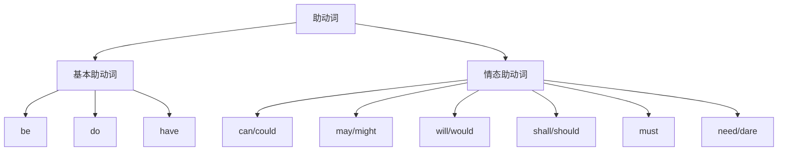
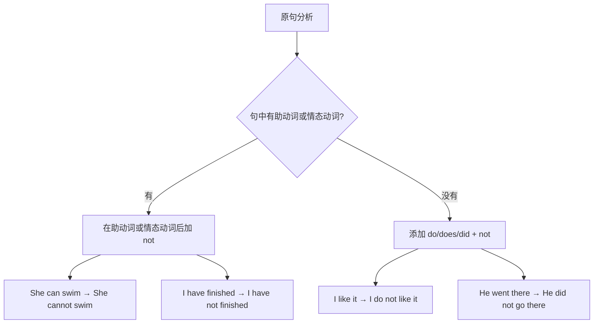

# 助动词的基本用法

在英语语法体系中，**助动词（Auxiliary Verbs）** 是一类特殊而重要的词汇。它们本身不表示具体的动作或状态，而是"辅助"主要动词（实义动词）来表达时态、语态、语气、否定和疑问等语法意义。可以说，没有助动词，英语的时态系统和句型变化就无法正常运作。

本篇将系统讲解助动词的定义、分类以及三大基本助动词（be、do、have）的核心用法，帮助你全面掌握这一语法基础。

---

## 1. 助动词概述

### 1.1 什么是助动词

**助动词**是帮助主要动词构成各种时态、语态、否定形式和疑问形式的动词。它们在句中不能独立作谓语（情态动词除外的某些情况），必须与主要动词（或其他成分）搭配使用。

> [!info] 助动词的核心特征
>
> 1. **辅助功能**：帮助构成时态、语态、否定、疑问等
> 2. **无实际词义**：作为助动词时，不表示具体动作
> 3. **语法标记**：承载时态、人称、数的变化
> 4. **位置固定**：通常位于主要动词之前

来看一个对比：

| 句子 | 分析 |
| --- | --- |
| I **have** a book. | have 是实义动词，意为"拥有" |
| I **have** finished my homework. | have 是助动词，帮助构成现在完成时 |

在第二句中，have 本身不表示"拥有"的意思，它的作用是与过去分词 finished 一起构成现在完成时。

### 1.2 助动词的分类

英语中的助动词可分为两大类：

**基本助动词**包括 be、do、have 三个，它们的主要功能是帮助构成时态和语态。**情态助动词**（Modal Auxiliaries）包括 can、may、will、shall、must 等，它们表示能力、可能性、意愿、义务等情态意义，将在下一篇详细讲解。

> [!tip] 助动词与实义动词的双重身份
>
> be、do、have 这三个词既可以作助动词，也可以作实义动词：
> - **be** 作实义动词：表示"是、存在"
> - **do** 作实义动词：表示"做、从事"
> - **have** 作实义动词：表示"拥有、吃、经历"
>
> 判断它们是助动词还是实义动词，关键看它们后面是否跟着另一个动词形式。

### 1.3 助动词的基本特点

所有助动词都具有以下共同特点：

**第一，可以直接加 not 构成否定形式：**

| 肯定形式 | 否定形式 | 缩写形式 |
| --- | --- | --- |
| is | is not | isn't |
| do | do not | don't |
| have | have not | haven't |
| can | cannot | can't |

**第二，可以与主语倒装构成疑问句：**

| 陈述句 | 疑问句 |
| --- | --- |
| She **is** working. | **Is** she working? |
| They **have** arrived. | **Have** they arrived? |
| You **can** swim. | **Can** you swim? |

**第三，可以用于简短回答和附加疑问句：**

| 完整回答 | 简短回答 |
| --- | --- |
| Yes, I am working. | Yes, I **am**. |
| No, they haven't arrived. | No, they **haven't**. |

**第四，可以用于强调：**

- I **do** love you.（我真的爱你。）
- She **did** finish the work.（她确实完成了工作。）

---

## 2. 助动词 be 的用法

助动词 be 是英语中最常用的助动词之一，它有多种形式变化，主要用于构成进行时态和被动语态。

### 2.1 be 的形式变化

be 动词根据人称、数和时态有丰富的形式变化：

| 时态 | 第一人称单数 | 第二人称/复数 | 第三人称单数 |
| --- | --- | --- | --- |
| 现在时 | am | are | is |
| 过去时 | was | were | was |
| 现在分词 | being | being | being |
| 过去分词 | been | been | been |

> [!warning] 注意 be 的人称一致性
>
> be 动词必须与主语的人称和数保持一致，这是初学者最容易出错的地方：
> - ✅ I **am** a student.
> - ❌ I **is** a student.
> - ✅ They **are** happy.
> - ❌ They **is** happy.

### 2.2 构成进行时态

be + 现在分词（V-ing）构成进行时态，表示动作正在进行或持续。

#### 2.2.1 现在进行时

**结构：am/is/are + V-ing**

表示说话时刻正在进行的动作，或现阶段持续进行的动作。

| 例句 | 中文翻译 | 句法分析 |
| --- | --- | --- |
| I **am reading** a novel. | 我正在读一本小说。 | am（助动词）+ reading（现在分词） |
| She **is cooking** dinner. | 她正在做晚饭。 | is（助动词）+ cooking（现在分词） |
| They **are playing** football. | 他们正在踢足球。 | are（助动词）+ playing（现在分词） |
| The children **are sleeping** now. | 孩子们现在正在睡觉。 | are（助动词）+ sleeping（现在分词） |

> [!example] 现在进行时的否定与疑问
>
> **否定句**：在 be 后加 not
> - I am **not** watching TV.（我没在看电视。）
> - She is **not** working today.（她今天没在工作。）
>
> **疑问句**：be 提到主语前
> - **Are** you listening to me?（你在听我说话吗？）
> - **Is** he studying in his room?（他在房间里学习吗？）

#### 2.2.2 过去进行时

**结构：was/were + V-ing**

表示过去某一时刻正在进行的动作。

| 例句 | 中文翻译 | 句法分析 |
| --- | --- | --- |
| I **was watching** TV at 8 last night. | 昨晚8点我正在看电视。 | was（助动词）+ watching（现在分词） |
| They **were having** dinner when I arrived. | 我到的时候他们正在吃晚饭。 | were（助动词）+ having（现在分词） |
| She **was sleeping** when the phone rang. | 电话响的时候她正在睡觉。 | was（助动词）+ sleeping（现在分词） |

过去进行时常与 when、while、as 等连词连用，描述两个动作的时间关系：

- **While** I **was walking** home, it started to rain.
  （当我正走在回家的路上时，开始下雨了。）

- He **was reading** a book **when** his mother came in.
  （他妈妈进来时，他正在看书。）

#### 2.2.3 将来进行时

**结构：will be + V-ing**

表示将来某一时刻正在进行的动作。

| 例句 | 中文翻译 |
| --- | --- |
| I **will be waiting** for you at the station. | 我将在车站等你。 |
| This time tomorrow, I **will be flying** to Paris. | 明天这个时候，我将在飞往巴黎的途中。 |
| They **will be having** a meeting at 3 pm. | 下午3点他们将正在开会。 |

#### 2.2.4 现在完成进行时

**结构：have/has been + V-ing**

表示从过去开始一直持续到现在的动作，强调动作的持续性。

| 例句 | 中文翻译 | 分析 |
| --- | --- | --- |
| I **have been waiting** for an hour. | 我已经等了一个小时了。 | have been（助动词）+ waiting |
| She **has been studying** English for five years. | 她学英语已经五年了。 | has been（助动词）+ studying |
| It **has been raining** all day. | 雨下了一整天了。 | has been（助动词）+ raining |

> [!info] 进行时态的构成规律
>
> 所有进行时态都遵循"be + V-ing"的结构，区别在于 be 动词的形式：
>
> | 时态 | 结构 | 示例 |
> | --- | --- | --- |
> | 现在进行时 | am/is/are + V-ing | is working |
> | 过去进行时 | was/were + V-ing | was working |
> | 将来进行时 | will be + V-ing | will be working |
> | 现在完成进行时 | have/has been + V-ing | has been working |
> | 过去完成进行时 | had been + V-ing | had been working |

### 2.3 构成被动语态

be + 过去分词（V-ed/V-en）构成被动语态，表示主语是动作的承受者。

#### 2.3.1 各时态的被动语态

| 时态 | 主动语态 | 被动语态 |
| --- | --- | --- |
| 一般现在时 | They clean the room. | The room **is cleaned**. |
| 一般过去时 | They cleaned the room. | The room **was cleaned**. |
| 一般将来时 | They will clean the room. | The room **will be cleaned**. |
| 现在进行时 | They are cleaning the room. | The room **is being cleaned**. |
| 过去进行时 | They were cleaning the room. | The room **was being cleaned**. |
| 现在完成时 | They have cleaned the room. | The room **has been cleaned**. |
| 过去完成时 | They had cleaned the room. | The room **had been cleaned**. |

> [!example] 被动语态详细例句
>
> **一般现在时被动**：
> - English **is spoken** all over the world.
>   （英语在全世界被使用。）
>
> **一般过去时被动**：
> - The bridge **was built** in 1990.
>   （这座桥建于1990年。）
>
> **现在完成时被动**：
> - The letter **has been sent**.
>   （信已经寄出去了。）
>
> **现在进行时被动**：
> - A new hospital **is being built** in our city.
>   （我们城市正在建一所新医院。）

#### 2.3.2 被动语态的否定与疑问

**否定句**：在第一个助动词后加 not

| 肯定句 | 否定句 |
| --- | --- |
| The work **is done**. | The work **is not done**. |
| The letter **has been sent**. | The letter **has not been sent**. |
| The room **is being cleaned**. | The room **is not being cleaned**. |

**疑问句**：将第一个助动词提到主语前

| 陈述句 | 疑问句 |
| --- | --- |
| The work **is done**. | **Is** the work done? |
| The letter **has been sent**. | **Has** the letter been sent? |
| A decision **will be made**. | **Will** a decision be made? |

### 2.4 be 的其他助动词用法

#### 2.4.1 be to 结构

be to + 动词原形可以表示计划、安排、命令、可能性等。

| 用法 | 例句 | 中文翻译 |
| --- | --- | --- |
| 表示计划安排 | The meeting **is to be held** tomorrow. | 会议定于明天举行。 |
| 表示命令义务 | You **are to finish** your homework before dinner. | 你必须在晚饭前完成作业。 |
| 表示可能性 | No one **was to be seen** on the street. | 街上看不到一个人。 |
| 表示注定 | They **were to become** famous. | 他们注定会成名。 |

#### 2.4.2 be + 不定式表示被动

某些情况下，be + 不定式的主动形式可以表示被动意义：

- The house **is to let**.（房子待出租。= The house is to be let.）
- There is much work **to do**.（有很多工作要做。）

---

## 3. 助动词 do 的用法

助动词 do（包括 does、did）在英语中有着独特而重要的作用。它主要用于构成否定句、疑问句和强调句。

### 3.1 do 的形式变化

| 形式 | 使用场合 |
| --- | --- |
| do | 一般现在时，主语为 I/you/we/they 或复数 |
| does | 一般现在时，主语为 he/she/it 或第三人称单数 |
| did | 一般过去时，所有人称 |

> [!warning] do/does/did 后接动词原形
>
> 无论使用 do、does 还是 did，后面的动词都必须用**原形**：
> - ✅ Does she **like** music?
> - ❌ Does she **likes** music?
> - ✅ Did you **go** there yesterday?
> - ❌ Did you **went** there yesterday?

### 3.2 构成否定句

当主要动词是实义动词时，需要借助 do/does/did + not 来构成否定句。

#### 3.2.1 一般现在时否定句

**结构：主语 + do/does + not + 动词原形**

| 肯定句 | 否定句 | 缩写形式 |
| --- | --- | --- |
| I like coffee. | I **do not** like coffee. | I **don't** like coffee. |
| He likes coffee. | He **does not** like coffee. | He **doesn't** like coffee. |
| They work hard. | They **do not** work hard. | They **don't** work hard. |
| She speaks English. | She **does not** speak English. | She **doesn't** speak English. |

> [!example] 更多否定句示例
>
> - I **don't** understand what you mean.
>   （我不明白你的意思。）
>
> - She **doesn't** live in Beijing.
>   （她不住在北京。）
>
> - My parents **don't** allow me to stay up late.
>   （我父母不允许我熬夜。）
>
> - This machine **doesn't** work properly.
>   （这台机器运转不正常。）

#### 3.2.2 一般过去时否定句

**结构：主语 + did + not + 动词原形**

| 肯定句 | 否定句 | 缩写形式 |
| --- | --- | --- |
| I liked the movie. | I **did not** like the movie. | I **didn't** like the movie. |
| She went to school. | She **did not** go to school. | She **didn't** go to school. |
| They finished the work. | They **did not** finish the work. | They **didn't** finish the work. |

注意：过去时否定句中，时态标记由 did 承担，主要动词恢复原形。

> [!example] 过去时否定句示例
>
> - I **didn't** see him yesterday.
>   （我昨天没看到他。）
>
> - She **didn't** tell me the truth.
>   （她没告诉我真相。）
>
> - They **didn't** arrive on time.
>   （他们没有准时到达。）
>
> - The train **didn't** stop at this station.
>   （火车没有在这个站停。）

### 3.3 构成疑问句

当主要动词是实义动词时，需要借助 do/does/did 来构成疑问句。

#### 3.3.1 一般疑问句

**结构：Do/Does/Did + 主语 + 动词原形 + ...?**

| 陈述句 | 疑问句 | 简短回答 |
| --- | --- | --- |
| You like music. | **Do** you like music? | Yes, I do. / No, I don't. |
| She works here. | **Does** she work here? | Yes, she does. / No, she doesn't. |
| They came late. | **Did** they come late? | Yes, they did. / No, they didn't. |

> [!example] 一般疑问句示例
>
> - **Do** you speak English?
>   （你会说英语吗？）
>
> - **Does** he know the answer?
>   （他知道答案吗？）
>
> - **Did** you finish your homework?
>   （你完成作业了吗？）
>
> - **Do** your parents live in Shanghai?
>   （你父母住在上海吗？）

#### 3.3.2 特殊疑问句

**结构：疑问词 + do/does/did + 主语 + 动词原形 + ...?**

| 例句 | 中文翻译 |
| --- | --- |
| **What do** you want? | 你想要什么？ |
| **Where does** she live? | 她住在哪里？ |
| **When did** they arrive? | 他们什么时候到的？ |
| **Why do** you think so? | 你为什么这么想？ |
| **How did** you get there? | 你怎么到那里的？ |
| **How often do** you exercise? | 你多久锻炼一次？ |

> [!warning] 特殊情况：疑问词作主语
>
> 当疑问词作主语时，不需要 do/does/did：
> - ✅ **Who** broke the window?（谁打破了窗户？）
> - ❌ Who did break the window?
> - ✅ **What** happened?（发生了什么？）
> - ❌ What did happen?

### 3.4 构成强调句

do/does/did + 动词原形可以用来强调谓语动词，表示"确实、真的"。

#### 3.4.1 基本用法

| 普通句 | 强调句 | 中文翻译 |
| --- | --- | --- |
| I like you. | I **do** like you. | 我真的喜欢你。 |
| She loves him. | She **does** love him. | 她确实爱他。 |
| They came. | They **did** come. | 他们确实来了。 |
| He finished it. | He **did** finish it. | 他的确完成了。 |

> [!tip] 强调句的语用功能
>
> 强调句常用于以下场景：
> 1. **反驳对方的否定**：
>    - A: You don't care about me.（你不关心我。）
>    - B: I **do** care about you!（我真的关心你！）
>
> 2. **表达真诚**：
>    - I **do** apologize for the mistake.（我真心为这个错误道歉。）
>
> 3. **加强语气**：
>    - She **does** work hard, I must admit.（我必须承认，她确实很努力。）

#### 3.4.2 祈使句的强调

do 可以用在祈使句前表示强调或恳求：

| 普通祈使句 | 强调祈使句 | 语气效果 |
| --- | --- | --- |
| Come in. | **Do** come in. | 请进来吧。（更客气） |
| Be careful. | **Do** be careful. | 一定要小心。（更恳切） |
| Sit down. | **Do** sit down. | 请坐下。（更热情） |
| Try again. | **Do** try again. | 一定要再试一次。（更鼓励） |

### 3.5 用于简短回答和反意疑问句

#### 3.5.1 简短回答

| 问句 | 肯定简答 | 否定简答 |
| --- | --- | --- |
| Do you like tea? | Yes, I **do**. | No, I **don't**. |
| Does she speak French? | Yes, she **does**. | No, she **doesn't**. |
| Did they go there? | Yes, they **did**. | No, they **didn't**. |

#### 3.5.2 反意疑问句

当陈述部分是含有实义动词的肯定句或否定句时，反意疑问部分用 do/does/did：

| 陈述部分 | 反意疑问部分 |
| --- | --- |
| You like coffee, | **don't** you? |
| She works here, | **doesn't** she? |
| They came yesterday, | **didn't** they? |
| You don't like it, | **do** you? |
| He didn't go, | **did** he? |

### 3.6 用于替代前面提到的动词

为了避免重复，do 可以替代前面出现过的动词：

| 例句 | 分析 |
| --- | --- |
| She sings better than I **do**. | do 替代 sing |
| He works harder than she **does**. | does 替代 works |
| I didn't finish, but he **did**. | did 替代 finished |
| "Who broke it?" "Tom **did**." | did 替代 broke it |

> [!example] 替代用法示例
>
> - A: Do you play tennis?
>   B: Yes, I **do**, but my brother **doesn't**.
>   （A：你打网球吗？B：是的，我打，但我弟弟不打。）
>
> - She speaks English as well as he **does**.
>   （她英语说得和他一样好。）
>
> - I don't like spicy food, but my wife **does**.
>   （我不喜欢辣的食物，但我妻子喜欢。）

---

## 4. 助动词 have 的用法

助动词 have（包括 has、had）主要用于构成完成时态，是英语时态系统中不可或缺的组成部分。

### 4.1 have 的形式变化

| 形式 | 使用场合 |
| --- | --- |
| have | 现在时，主语为 I/you/we/they 或复数 |
| has | 现在时，主语为 he/she/it 或第三人称单数 |
| had | 过去时，所有人称 |
| having | 现在分词形式（用于完成进行时等） |

### 4.2 构成完成时态

have/has/had + 过去分词（V-ed/V-en）构成完成时态。

#### 4.2.1 现在完成时

**结构：have/has + 过去分词**

表示过去发生的动作对现在造成的影响，或从过去持续到现在的动作/状态。

| 例句 | 中文翻译 | 分析 |
| --- | --- | --- |
| I **have finished** my work. | 我已经完成了工作。 | have（助动词）+ finished（过去分词） |
| She **has lived** here for ten years. | 她在这里住了十年了。 | has（助动词）+ lived（过去分词） |
| They **have never been** to Japan. | 他们从未去过日本。 | have（助动词）+ been（过去分词） |
| He **has just left**. | 他刚刚离开。 | has（助动词）+ left（过去分词） |

> [!info] 现在完成时的两种用法
>
> **用法一：表示完成（已经/刚刚）**
> - I **have already** eaten breakfast.（我已经吃过早餐了。）
> - She **has just** arrived.（她刚刚到达。）
>
> **用法二：表示持续（从过去到现在）**
> - We **have known** each other for 20 years.（我们认识20年了。）
> - He **has been** a teacher since 1990.（他从1990年起就是老师了。）

#### 4.2.2 过去完成时

**结构：had + 过去分词**

表示在过去某一时间点之前已经完成的动作（过去的过去）。

| 例句 | 中文翻译 | 时间关系 |
| --- | --- | --- |
| I **had finished** my work before he came. | 他来之前我已经完成了工作。 | finished 在 came 之前 |
| She **had left** when I arrived. | 我到达时她已经离开了。 | left 在 arrived 之前 |
| They **had never seen** such a thing. | 他们从未见过这样的事。 | 过去某时之前的经历 |
| By 2010, he **had lived** there for 5 years. | 到2010年，他已经在那里住了5年。 | 截至过去某时的持续 |

过去完成时必须有一个过去时间的参照点，否则使用现在完成时。

#### 4.2.3 将来完成时

**结构：will have + 过去分词**

表示在将来某一时间点之前将已完成的动作。

| 例句 | 中文翻译 |
| --- | --- |
| I **will have finished** the report by tomorrow. | 到明天我将已经完成报告了。 |
| She **will have left** by the time you arrive. | 你到的时候她将已经离开了。 |
| By 2030, we **will have been** married for 10 years. | 到2030年，我们将已结婚10年了。 |

#### 4.2.4 完成进行时

have/has/had been + V-ing 构成完成进行时。

| 时态 | 结构 | 例句 |
| --- | --- | --- |
| 现在完成进行时 | have/has been + V-ing | I **have been waiting** for two hours. |
| 过去完成进行时 | had been + V-ing | She **had been working** all day. |
| 将来完成进行时 | will have been + V-ing | They **will have been living** here for 10 years. |

> [!example] 完成进行时示例
>
> **现在完成进行时**：
> - I **have been studying** English for five years.
>   （我学英语已经五年了。——强调持续性）
>
> **过去完成进行时**：
> - She **had been crying** before he arrived.
>   （他到达之前她一直在哭。）
>
> **对比现在完成时和现在完成进行时**：
> - I **have read** three books this month.（强调结果：读了三本）
> - I **have been reading** all morning.（强调过程：一直在读）

### 4.3 have 的否定与疑问形式

#### 4.3.1 否定句

在 have/has/had 后加 not：

| 肯定句 | 否定句 | 缩写形式 |
| --- | --- | --- |
| I have finished. | I **have not** finished. | I **haven't** finished. |
| She has arrived. | She **has not** arrived. | She **hasn't** arrived. |
| They had left. | They **had not** left. | They **hadn't** left. |

#### 4.3.2 疑问句

将 have/has/had 提到主语前：

| 陈述句 | 疑问句 | 简短回答 |
| --- | --- | --- |
| You have seen him. | **Have** you seen him? | Yes, I have. / No, I haven't. |
| She has finished. | **Has** she finished? | Yes, she has. / No, she hasn't. |
| They had left. | **Had** they left? | Yes, they had. / No, they hadn't. |

> [!example] 完成时疑问句示例
>
> - **Have** you ever been to Paris?
>   （你去过巴黎吗？）
>
> - **Has** she finished her homework yet?
>   （她作业做完了吗？）
>
> - **How long have** you lived here?
>   （你在这里住多久了？）
>
> - **What have** you been doing all day?
>   （你一整天都在做什么？）

### 4.4 have 的其他助动词用法

#### 4.4.1 have to 表示"必须"

have to 表示客观上的必须，与情态动词 must 意义相近但语法不同：

| 例句 | 中文翻译 | 说明 |
| --- | --- | --- |
| I **have to** go now. | 我现在必须走了。 | 现在时 |
| She **has to** work on weekends. | 她周末必须工作。 | 第三人称单数 |
| We **had to** leave early. | 我们不得不早点离开。 | 过去时 |
| You **will have to** wait. | 你将不得不等。 | 将来时 |

> [!tip] have to 与 must 的区别
>
> | have to | must |
> | --- | --- |
> | 客观必须（外部要求） | 主观必须（个人认为） |
> | 有各种时态变化 | 只有现在时形式 |
> | 否定形式 don't have to（不必） | 否定形式 mustn't（禁止） |
>
> - I **must** study hard.（我必须努力学习。——自己的决心）
> - I **have to** wear a uniform.（我必须穿制服。——公司规定）

#### 4.4.2 have got 表示"拥有"

在英式英语中，have got 常用来表示"拥有"，相当于 have：

| 例句 | 等同于 | 中文翻译 |
| --- | --- | --- |
| I'**ve got** a new car. | I have a new car. | 我有一辆新车。 |
| She'**s got** two brothers. | She has two brothers. | 她有两个兄弟。 |
| **Have** you **got** any money? | Do you have any money? | 你有钱吗？ |

---

## 5. 助动词在句型变化中的作用

助动词在英语句型变化中起着关键的语法作用，是构成否定句、疑问句、强调句等的核心工具。

### 5.1 否定句的构成规律

英语否定句的构成遵循以下规律：

> [!info] 否定句构成规则总结
>
> | 原句类型 | 否定方法 | 示例 |
> | --- | --- | --- |
> | 含 be 动词 | be + not | is → is not |
> | 含情态动词 | 情态动词 + not | can → cannot |
> | 含助动词 have | have + not | have → have not |
> | 含实义动词 | do/does/did + not + 原形 | likes → doesn't like |

### 5.2 疑问句的构成规律

#### 5.2.1 一般疑问句

一般疑问句的构成遵循"助动词/情态动词提前"的规律：

| 陈述句 | 疑问句 | 规律 |
| --- | --- | --- |
| She **is** happy. | **Is** she happy? | be 提前 |
| They **can** swim. | **Can** they swim? | 情态动词提前 |
| He **has** finished. | **Has** he finished? | have 提前 |
| You **like** it. | **Do** you like it? | 添加 do |
| She **lives** here. | **Does** she live here? | 添加 does |

#### 5.2.2 特殊疑问句

特殊疑问句 = 疑问词 + 一般疑问句语序：

| 疑问词 | 例句 | 中文翻译 |
| --- | --- | --- |
| What | **What are** you doing? | 你在做什么？ |
| Where | **Where does** she live? | 她住在哪里？ |
| When | **When did** they arrive? | 他们什么时候到的？ |
| Why | **Why have** you been crying? | 你为什么一直在哭？ |
| How | **How can** I help you? | 我怎么帮你？ |
| Who | **Who is** that man? | 那个人是谁？ |
| Which | **Which do** you prefer? | 你更喜欢哪个？ |

### 5.3 反意疑问句中的助动词

反意疑问句由陈述部分和反意部分组成，反意部分必须使用与陈述部分相匹配的助动词：

| 陈述部分 | 反意部分 | 规律 |
| --- | --- | --- |
| She **is** a teacher, | **isn't** she? | be → be |
| You **can** drive, | **can't** you? | 情态动词 → 情态动词 |
| They **have** finished, | **haven't** they? | have → have |
| He **likes** coffee, | **doesn't** he? | 实义动词 → do |
| She **went** there, | **didn't** she? | 过去时 → did |

> [!warning] 反意疑问句的特殊情况
>
> 1. **陈述部分含 never, hardly, seldom 等否定词**：
>    - She **never** comes late, **does** she?（肯定反意部分）
>
> 2. **祈使句的反意疑问**：
>    - Open the door, **will** you?
>    - Let's go, **shall** we?
>
> 3. **I am 的反意疑问**：
>    - I'm late, **aren't** I?（不用 amn't）

### 5.4 简短回答中的助动词

简短回答使用助动词代替完整答语：

| 问句 | 完整回答 | 简短回答 |
| --- | --- | --- |
| Are you a student? | Yes, I am a student. | Yes, I **am**. |
| Can she swim? | Yes, she can swim. | Yes, she **can**. |
| Have they arrived? | No, they haven't arrived. | No, they **haven't**. |
| Do you like it? | Yes, I like it. | Yes, I **do**. |
| Did he go? | No, he didn't go. | No, he **didn't**. |

### 5.5 省略句中的助动词

在上下文明确的情况下，可以用助动词代替整个谓语部分：

| 完整句 | 省略句 | 说明 |
| --- | --- | --- |
| He can play the piano and I can play the piano too. | He can play the piano and I **can** too. | can 代替 can play the piano |
| She has finished but I haven't finished. | She has finished but I **haven't**. | haven't 代替 haven't finished |
| A: Will you help me? B: Yes, I will help you. | A: Will you help me? B: Yes, I **will**. | will 代替 will help you |

---

## 6. 助动词的缩写形式

在口语和非正式书面语中，助动词经常以缩写形式出现。

### 6.1 肯定缩写形式

助动词可以与主语缩写：

| 完整形式 | 缩写形式 | 例句 |
| --- | --- | --- |
| I am | I'm | **I'm** happy. |
| you are | you're | **You're** right. |
| he is / he has | he's | **He's** working. / **He's** finished. |
| she is / she has | she's | **She's** tired. / **She's** gone. |
| it is / it has | it's | **It's** raining. / **It's** been fun. |
| we are | we're | **We're** ready. |
| they are | they're | **They're** coming. |
| I have | I've | **I've** done it. |
| you have | you've | **You've** got mail. |
| we have | we've | **We've** arrived. |
| they have | they've | **They've** left. |
| I will / I shall | I'll | **I'll** help you. |
| you will | you'll | **You'll** see. |
| he will | he'll | **He'll** come. |
| she will | she'll | **She'll** understand. |
| we will / we shall | we'll | **We'll** try. |
| they will | they'll | **They'll** agree. |
| I would / I had | I'd | **I'd** like a coffee. / **I'd** finished. |
| you would / you had | you'd | **You'd** better go. |

> [!warning] 's 和 'd 的歧义
>
> - **'s** 可能是 is 或 has：
>   - He**'s** working.（is）
>   - He**'s** finished.（has）
>
> - **'d** 可能是 would 或 had：
>   - I**'d** like some coffee.（would）
>   - I**'d** already left.（had）
>
> 根据后面跟的动词形式判断：
> - 's + V-ing / 形容词 / 名词 → is
> - 's + 过去分词 → has
> - 'd + 动词原形 → would
> - 'd + 过去分词 → had

### 6.2 否定缩写形式

| 完整形式 | 缩写形式 | 例句 |
| --- | --- | --- |
| is not | isn't | She **isn't** here. |
| are not | aren't | They **aren't** ready. |
| was not | wasn't | It **wasn't** my fault. |
| were not | weren't | We **weren't** invited. |
| have not | haven't | I **haven't** seen him. |
| has not | hasn't | She **hasn't** arrived. |
| had not | hadn't | They **hadn't** expected it. |
| do not | don't | I **don't** know. |
| does not | doesn't | He **doesn't** care. |
| did not | didn't | We **didn't** go. |
| will not | won't | I **won't** forget. |
| would not | wouldn't | She **wouldn't** listen. |
| cannot | can't | You **can't** do that. |
| could not | couldn't | I **couldn't** help it. |
| should not | shouldn't | You **shouldn't** worry. |
| must not | mustn't | You **mustn't** tell anyone. |

> [!tip] 两种否定缩写形式
>
> 否定句有两种缩写方式：
> - **主语 + 助动词缩写 + not**：I'm not, he's not, they're not
> - **主语 + 助动词 + n't**：I isn't(✗), he isn't, they aren't
>
> 注意：I am not 只能缩写为 I'm not，不能写成 I amn't。

---

## 7. 助动词使用的常见错误

### 7.1 do/does/did 后接动词原形

这是最常见的错误之一：

| 错误 | 正确 | 说明 |
| --- | --- | --- |
| ❌ Does she **likes** music? | ✅ Does she **like** music? | does 后用原形 |
| ❌ Did you **went** there? | ✅ Did you **go** there? | did 后用原形 |
| ❌ She doesn't **knows** him. | ✅ She doesn't **know** him. | doesn't 后用原形 |
| ❌ He didn't **finished** it. | ✅ He didn't **finish** it. | didn't 后用原形 |

### 7.2 have/has/had 后接过去分词

| 错误 | 正确 | 说明 |
| --- | --- | --- |
| ❌ I have **finish** my work. | ✅ I have **finished** my work. | have 后用过去分词 |
| ❌ She has **went** to school. | ✅ She has **gone** to school. | has 后用过去分词 |
| ❌ They had **leave** before I came. | ✅ They had **left** before I came. | had 后用过去分词 |

### 7.3 be 动词与主语的一致性

| 错误 | 正确 | 说明 |
| --- | --- | --- |
| ❌ I **is** a student. | ✅ I **am** a student. | 第一人称单数用 am |
| ❌ They **is** happy. | ✅ They **are** happy. | 复数用 are |
| ❌ He **are** working. | ✅ He **is** working. | 第三人称单数用 is |
| ❌ We **was** there. | ✅ We **were** there. | 复数用 were |

### 7.4 不必要的 do

当句中已有其他助动词或 be 动词时，不需要再加 do：

| 错误 | 正确 | 说明 |
| --- | --- | --- |
| ❌ She **does can** swim. | ✅ She **can** swim. | 不能叠加助动词 |
| ❌ I **do am** happy. | ✅ I **am** happy. | be 动词自身构成否定/疑问 |
| ❌ **Do** you **are** a student? | ✅ **Are** you a student? | be 动词直接提前 |
| ❌ He **doesn't has** a car. | ✅ He **doesn't have** a car. | 只用一个助动词 |

### 7.5 混淆助动词与实义动词

| 错误 | 正确 | 说明 |
| --- | --- | --- |
| ❌ I don't have finished. | ✅ I haven't finished. | have 作助动词时直接否定 |
| ❌ Have you a pen? (现代英语) | ✅ Do you have a pen? | have 作实义动词用 do 提问 |
| ❌ I amn't ready. | ✅ I'm not ready. | am 没有 amn't 形式 |

---

## 8. 综合练习与应用

### 8.1 填空练习

用适当的助动词填空：

1. She _______ working when I arrived. (be)
2. _______ you ever been to Paris? (have)
3. He _______ not like spicy food. (do)
4. The letter _______ been sent yesterday. (be + have)
5. I _______ waiting for two hours already. (have + be)
6. _______ she live in Beijing? (do)
7. They _______ playing football at 5 pm yesterday. (be)
8. The bridge _______ built in 1990. (be)

> [!example] 答案
>
> 1. **was** working（过去进行时）
> 2. **Have** you ever been（现在完成时疑问句）
> 3. **does** not like（一般现在时否定句，第三人称单数）
> 4. **was** sent / **has been** sent（过去时被动 / 现在完成时被动）
> 5. **have been** waiting（现在完成进行时）
> 6. **Does** she live（一般现在时疑问句，第三人称单数）
> 7. **were** playing（过去进行时）
> 8. **was** built（过去时被动语态）

### 8.2 句型转换

将下列句子变为否定句和疑问句：

**1. She speaks English fluently.**
- 否定句：She _______ speak English fluently.
- 疑问句：_______ she speak English fluently?

**2. They have finished the project.**
- 否定句：They _______ finished the project.
- 疑问句：_______ they finished the project?

**3. The book was written by him.**
- 否定句：The book _______ written by him.
- 疑问句：_______ the book written by him?

**4. Tom likes playing basketball.**
- 否定句：Tom _______ like playing basketball.
- 疑问句：_______ Tom like playing basketball?

> [!example] 答案
>
> **1.**
> - 否定句：She **doesn't** speak English fluently.
> - 疑问句：**Does** she speak English fluently?
>
> **2.**
> - 否定句：They **haven't** finished the project.
> - 疑问句：**Have** they finished the project?
>
> **3.**
> - 否定句：The book **wasn't** written by him.
> - 疑问句：**Was** the book written by him?
>
> **4.**
> - 否定句：Tom **doesn't** like playing basketball.
> - 疑问句：**Does** Tom like playing basketball?

### 8.3 改错练习

找出并改正下列句子中的错误：

1. ❌ Does she likes coffee?
2. ❌ I have finish my homework.
3. ❌ They was watching TV.
4. ❌ He don't know the answer.
5. ❌ Did you went to the party?
6. ❌ She is been working all day.

> [!example] 答案
>
> 1. Does she **like** coffee?（does 后用动词原形）
> 2. I have **finished** my homework.（have 后用过去分词）
> 3. They **were** watching TV.（They 用 were）
> 4. He **doesn't** know the answer.（第三人称单数用 doesn't）
> 5. Did you **go** to the party?（did 后用动词原形）
> 6. She **has been** working all day.（现在完成进行时用 has been）

---

## 9. 本篇小结

本篇系统讲解了英语三大基本助动词 be、do、have 的核心用法：

| 助动词 | 主要功能 | 典型结构 |
| --- | --- | --- |
| **be** | 构成进行时态、被动语态 | be + V-ing；be + V-ed |
| **do** | 构成否定句、疑问句、强调句 | do/does/did + 动词原形 |
| **have** | 构成完成时态 | have/has/had + 过去分词 |

> [!success] 核心要点回顾
>
> 1. **助动词的本质**：帮助主要动词构成各种语法形式，本身无实义
>
> 2. **be 的用法**：
>    - 进行时：am/is/are/was/were + V-ing
>    - 被动语态：be + 过去分词
>
> 3. **do 的用法**：
>    - 否定句：do/does/did + not + 动词原形
>    - 疑问句：Do/Does/Did + 主语 + 动词原形?
>    - 强调句：do/does/did + 动词原形
>
> 4. **have 的用法**：
>    - 完成时：have/has/had + 过去分词
>    - have to 表必须
>
> 5. **关键规则**：
>    - do/does/did 后必须接动词原形
>    - have/has/had 后必须接过去分词
>    - be 动词必须与主语人称数保持一致

掌握助动词是理解英语时态和句型变化的基础。在后续的学习中，你会发现几乎所有复杂的语法现象都建立在对助动词的熟练运用之上。下一篇我们将学习情态动词的用法，它们与基本助动词共同构成英语完整的助动词体系。
