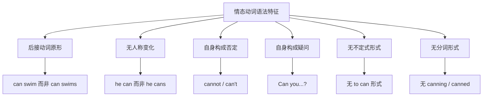
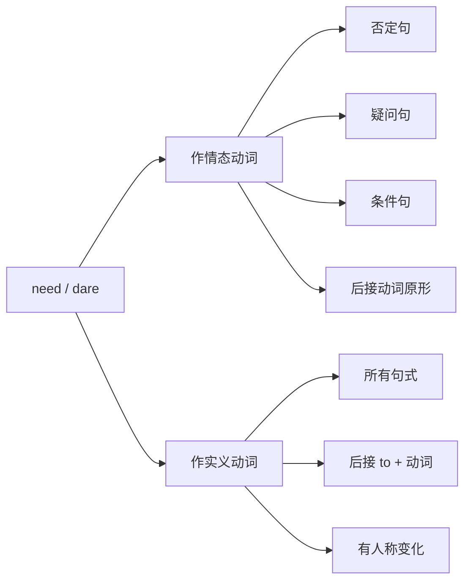
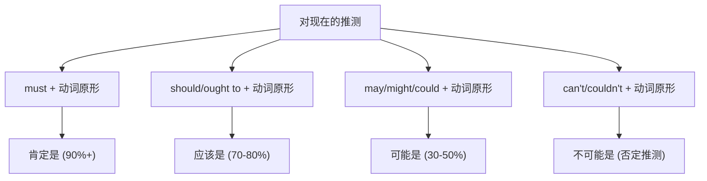
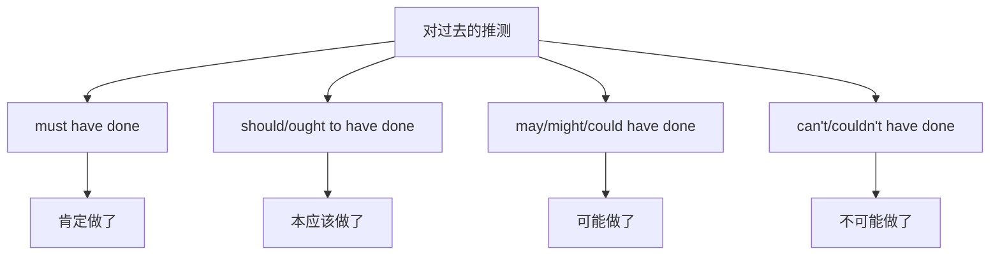
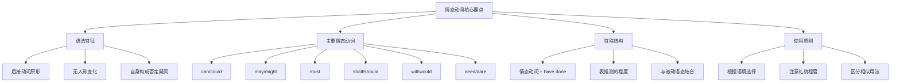

# 情态动词详解

情态动词（Modal Verbs）是英语中最具表现力的词类之一，它们赋予句子丰富的语气色彩，表达说话人的态度、判断和情感。掌握情态动词的精妙用法，是提升英语表达能力的关键一步。

## 1. 情态动词概述

### 1.1 什么是情态动词

情态动词是一类特殊的助动词，它们不表示具体的动作或状态，而是表达说话人对动作或状态的**主观态度**，包括可能性、必要性、许可、意愿、推测、建议等。

> [!info] 情态动词的核心特征
>
> 情态动词的本质是**主观性**——它们传达的不是客观事实，而是说话人的判断、态度或意图。同一个句子加上不同的情态动词，意义会发生显著变化。

**对比示例**：

| 句子 | 含义 |
| --- | --- |
| He **goes** to school. | 他去上学。（陈述事实） |
| He **can** go to school. | 他能去上学。（表能力） |
| He **may** go to school. | 他可以去上学。（表许可） |
| He **must** go to school. | 他必须去上学。（表必要） |
| He **should** go to school. | 他应该去上学。（表建议） |
| He **will** go to school. | 他会去上学。（表意愿/将来） |

### 1.2 情态动词的语法特征

情态动词具有以下共同的语法特征，这些特征使它们区别于普通动词：



**特征一：后接动词原形**

情态动词后面必须直接跟动词原形，不能加 to，也不能使用动词的其他形式。

```
✅ She can speak French.（她会说法语。）
❌ She can speaks French.
❌ She can to speak French.
```

**特征二：无人称和数的变化**

情态动词在任何人称和数下形式保持不变，第三人称单数不加 -s。

```
✅ He can swim.
✅ She can swim.
✅ They can swim.
❌ He cans swim.
```

**特征三：自身构成否定和疑问**

情态动词可以直接加 not 构成否定，也可以直接移到句首构成疑问，无需借助 do/does/did。

```
肯定句：You can leave now.（你现在可以离开。）
否定句：You cannot leave now.（你现在不能离开。）
疑问句：Can you leave now?（你现在能离开吗？）
```

**特征四：无不定式和分词形式**

大多数情态动词没有不定式（to + 情态动词）和分词形式（-ing / -ed），因此它们不能单独用于需要这些形式的结构中。

```
❌ I want to can swim.（错误）
✅ I want to be able to swim.（我想能够游泳。）

❌ Having musted leave...（错误）
✅ Having had to leave...（不得不离开之后...）
```

### 1.3 情态动词分类总览

英语中的情态动词可分为以下几类：

| 类别 | 情态动词 | 主要意义 |
| --- | --- | --- |
| 核心情态动词 | can, could, may, might, must, shall, should, will, would | 能力、许可、推测、必要、意愿等 |
| 半情态动词 | need, dare, ought to, used to | 需要、敢于、应该、过去习惯 |
| 情态短语 | have to, be able to, be going to, had better | 必须、能够、将要、最好 |

> [!tip] 学习建议
>
> 情态动词的难点在于**一词多义**——同一个情态动词在不同语境下表达不同含义。学习时应重点关注每个情态动词的**核心语义**和**延伸用法**，并通过大量例句建立语感。

---

## 2. can 与 could

### 2.1 can 的基本用法

**can** 是最常用的情态动词之一，其核心意义是表示**能力**和**可能性**。

#### 2.1.1 表示能力（ability）

can 表示主语具有做某事的能力、技能或条件。

```
I can speak three languages.
我会说三种语言。
（说明：表示语言能力）

She can run very fast.
她能跑得很快。
（说明：表示体能）

Can you drive?
你会开车吗？
（说明：询问技能）

The stadium can hold 50,000 people.
这个体育场能容纳五万人。
（说明：表示容量/条件）
```

> [!warning] can 与 be able to 的区别
>
> - **can** 侧重于**一般性能力**或**当前状态**
> - **be able to** 可用于所有时态，且常强调**特定情境下成功做到某事**
>
> 对比：
> - He **can** swim.（他会游泳——一般能力）
> - He **was able to** swim across the river.（他成功游过了那条河——具体成就）

#### 2.1.2 表示许可（permission）

can 可用于表示允许或请求允许，语气较为随意。

```
You can use my computer.
你可以用我的电脑。
（说明：给予许可）

Can I borrow your pen?
我能借用一下你的笔吗？
（说明：请求许可，非正式）

You can't park here.
你不能在这里停车。
（说明：表示禁止）
```

#### 2.1.3 表示可能性（possibility）

can 可表示理论上的可能性，通常用于一般性陈述而非具体推测。

```
Accidents can happen.
事故是可能发生的。
（说明：理论可能性）

It can be very cold in winter here.
这里冬天可能会很冷。
（说明：一般性可能）

Even experts can make mistakes.
即使专家也可能犯错。
（说明：逻辑可能性）
```

#### 2.1.4 表示请求（request）

can 用于提出请求，语气较为直接和随意。

```
Can you help me with this?
你能帮我一下吗？
（说明：请求帮助）

Can you pass me the salt?
你能把盐递给我吗？
（说明：日常请求）
```

### 2.2 could 的用法

**could** 是 can 的过去式，但其用法远不止表示过去。

#### 2.2.1 表示过去的能力

could 用于描述过去的能力或技能。

```
I could swim when I was five.
我五岁时就会游泳了。
（说明：过去的能力）

She could play the piano beautifully.
她以前钢琴弹得很好听。
（说明：过去的技能）
```

> [!warning] could 表示过去能力的限制
>
> 当表示**过去某次具体成功做到某事**时，通常不用 could，而用 **was/were able to** 或 **managed to**。
>
> - ❌ The fire spread quickly, but everybody **could** escape.
> - ✅ The fire spread quickly, but everybody **was able to** escape.
>
> 但在**否定句**和**感知动词**（see, hear, feel 等）中，could 可以表示具体情况：
> - I **couldn't** find my keys anywhere.（我到处都找不到钥匙。）
> - I **could** see the mountains from my window.（我从窗户能看到山。）

#### 2.2.2 表示委婉请求

could 比 can 更委婉、更礼貌，常用于正式场合或对不太熟悉的人。

```
Could you please open the window?
您能把窗户打开吗？
（说明：礼貌请求）

Could I use your phone?
我可以用一下您的电话吗？
（说明：委婉请求许可）

Could you tell me the way to the station?
您能告诉我去车站怎么走吗？
（说明：礼貌询问）
```

#### 2.2.3 表示可能性（较不确定）

could 表示的可能性比 can 更弱，带有更多的不确定性。

```
It could rain tomorrow.
明天可能会下雨。
（说明：不太确定的推测）

The news could be true.
这消息可能是真的。
（说明：可能性推测）

He could be at home now.
他现在可能在家。
（说明：对现在的推测）
```

#### 2.2.4 虚拟语气中的 could

could 常用于虚拟条件句中，表示与事实相反的假设。

```
If I had more time, I could learn another language.
如果我有更多时间，我就能学另一门语言了。
（说明：与现在事实相反）

I could have helped you if you had asked.
如果你当时问了，我本可以帮你的。
（说明：与过去事实相反）
```

### 2.3 can 与 could 用法对比

| 用法 | can | could |
| --- | --- | --- |
| 表现在能力 | ✅ I can swim. | ❌（除非表虚拟） |
| 表过去能力 | ❌ | ✅ I could swim when young. |
| 表请求 | 直接、随意 | 委婉、礼貌 |
| 表许可 | 非正式 | 更委婉 |
| 表可能性 | 较确定 | 较不确定 |
| 虚拟语气 | ❌ | ✅ |

---

## 3. may 与 might

### 3.1 may 的基本用法

**may** 的核心意义是表示**许可**和**可能性**。

#### 3.1.1 表示许可（permission）

may 用于表示正式的许可或请求许可，比 can 更正式。

```
You may leave now.
你现在可以离开了。
（说明：正式许可）

May I come in?
我可以进来吗？
（说明：正式请求许可）

Students may use the library until 10 pm.
学生可以使用图书馆至晚上十点。
（说明：规章许可）

May I ask you a question?
我可以问您一个问题吗？
（说明：礼貌请求）
```

> [!tip] may 与 can 表许可的区别
>
> - **may** 更正式、更礼貌，常用于书面语或正式场合
> - **can** 更口语化、更随意
>
> 在现代英语中，can 在口语中越来越多地替代 may 表示许可，但在正式场合或书面语中，may 仍是首选。

#### 3.1.2 表示可能性（possibility）

may 表示对现在或将来的推测，可能性约为 50%。

```
It may rain this afternoon.
今天下午可能会下雨。
（说明：对将来的推测）

She may be busy right now.
她现在可能很忙。
（说明：对现在的推测）

The rumor may be true.
这个谣言可能是真的。
（说明：推测真实性）

He may not come to the party.
他可能不来参加聚会。
（说明：否定推测）
```

#### 3.1.3 表示祝愿

may 用于表示祝愿，常见于正式或文学表达中。

```
May you have a happy life!
愿你生活幸福！
（说明：祝愿）

May God bless you!
愿上帝保佑你！
（说明：宗教祝愿）

May the Force be with you!
愿原力与你同在！
（说明：经典祝愿语）
```

#### 3.1.4 may 用于让步状语从句

may 可用于让步状语从句，表示"尽管可能..."。

```
Whatever difficulties you may encounter, don't give up.
无论你可能遇到什么困难，都不要放弃。
（说明：让步从句）

Try as he may, he cannot solve the problem.
尽管他可能尝试，他也解决不了这个问题。
（说明：倒装让步结构）
```

### 3.2 might 的用法

**might** 是 may 的过去式，但更常用于表示更弱的可能性或更委婉的语气。

#### 3.2.1 表示较弱的可能性

might 表示的可能性比 may 更低，更不确定。

```
It might rain, but I doubt it.
可能会下雨，但我对此表示怀疑。
（说明：很弱的可能性）

He might be at the office, or he might be at home.
他可能在办公室，也可能在家。
（说明：不确定的推测）

The story might be true, but it sounds unlikely.
这个故事可能是真的，但听起来不太可能。
（说明：带怀疑的推测）
```

#### 3.2.2 表示委婉建议或请求

might 比 may 更委婉，常用于提出建议或请求。

```
You might want to reconsider your decision.
你或许想重新考虑一下你的决定。
（说明：委婉建议）

Might I make a suggestion?
我可以提个建议吗？
（说明：非常礼貌的请求）

I thought you might like some coffee.
我想你可能想喝点咖啡。
（说明：委婉提议）
```

#### 3.2.3 虚拟语气中的 might

might 常用于虚拟条件句和虚拟语气中。

```
If you studied harder, you might pass the exam.
如果你学习更努力些，你或许能通过考试。
（说明：与现在事实相反）

He might have survived if he had worn a seatbelt.
如果他当时系了安全带，他或许能活下来。
（说明：与过去事实相反）
```

#### 3.2.4 might 表示轻微责备

might 可用于表达轻微的责备或不满。

```
You might have told me earlier!
你本可以早点告诉我的！
（说明：责备对方没有早说）

He might at least say thank you.
他至少可以说声谢谢吧。
（说明：表示不满）
```

### 3.3 may 与 might 用法对比

| 用法 | may | might |
| --- | --- | --- |
| 表许可 | 正式许可 | 非常正式（较少用） |
| 表可能性 | 约 50% | 约 30% 或更低 |
| 表建议 | 较少 | 更委婉 |
| 表祝愿 | ✅ May you... | ❌ |
| 虚拟语气 | ❌ | ✅ |
| 让步从句 | ✅ | ✅ |

---

## 4. must

### 4.1 must 的基本用法

**must** 的核心意义是表示**必要性**和**确定性推测**。

#### 4.1.1 表示必须（necessity/obligation）

must 表示说话人认为某事是必须的、有义务的或重要的。

```
You must wear a seatbelt.
你必须系安全带。
（说明：规章要求）

I must finish this report by Friday.
我必须在周五之前完成这份报告。
（说明：任务必要性）

Students must submit their assignments on time.
学生必须按时提交作业。
（说明：学校规定）

We must protect the environment.
我们必须保护环境。
（说明：道德义务）
```

> [!warning] must 与 have to 的区别
>
> - **must** 表示说话人主观认为必须，常带有个人权威或内在动力
> - **have to** 表示外部客观因素造成的必须
>
> 对比：
> - I **must** stop smoking.（我必须戒烟。——自己认为必须）
> - I **have to** work overtime today.（我今天不得不加班。——外部要求）
>
> 在否定式中区别更明显：
> - You **mustn't** smoke here.（你不准在这里抽烟。——禁止）
> - You **don't have to** come early.（你不必早来。——没有必要）

#### 4.1.2 表示肯定推测（strong probability）

must 用于表示非常有把握的推测，译为"一定、肯定"。

```
He must be tired after such a long journey.
经过这么长的旅途，他一定很累了。
（说明：根据情理推测）

She's not answering the phone. She must be busy.
她没接电话，她肯定很忙。
（说明：根据现象推测）

You must be joking!
你肯定是在开玩笑！
（说明：表示难以置信）

This must be the place.
这一定就是那个地方。
（说明：确信的推测）
```

#### 4.1.3 表示强烈建议

must 可用于给出强烈的建议或推荐。

```
You must try this restaurant—the food is amazing!
你一定要试试这家餐厅——食物太棒了！
（说明：强烈推荐）

You must read this book.
你一定要读读这本书。
（说明：热情推荐）

You must come and visit us sometime.
你一定要找时间来看看我们。
（说明：热情邀请）
```

### 4.2 must 的否定形式

must 的否定有两种形式，意义完全不同：

| 形式 | 意义 | 例句 |
| --- | --- | --- |
| **mustn't** | 禁止、不准 | You mustn't touch that.（你不准碰那个。） |
| **don't have to** | 不必、没必要 | You don't have to wait.（你不必等。） |

```
You mustn't tell anyone about this.
你不准告诉任何人这件事。
（说明：禁止）

You mustn't be late for the meeting.
你开会不准迟到。
（说明：严格要求）

Visitors mustn't feed the animals.
游客不得投喂动物。
（说明：规定禁止）
```

> [!warning] must 表推测时的否定
>
> 当 must 表示推测时，其否定不用 mustn't，而用 **can't** 或 **couldn't**：
>
> - He **must** be at home.（他一定在家。）
> - He **can't** be at home.（他不可能在家。）
> - ❌ He mustn't be at home.（语法错误——mustn't 不能用于推测的否定）

### 4.3 must 没有过去式

must 本身没有过去式形式。表示过去的"必须"时，用 **had to**：

```
I had to work late yesterday.
我昨天不得不工作到很晚。
（说明：过去的必须）

She had to leave early because of an emergency.
因为紧急情况，她不得不早走。
（说明：过去的义务）
```

表示对过去的推测时，用 **must have + 过去分词**：

```
He must have forgotten about the meeting.
他一定是忘了开会的事。
（说明：对过去的推测）

They must have left already.
他们一定已经离开了。
（说明：对过去行为的推测）
```

---

## 5. shall 与 should

### 5.1 shall 的用法

**shall** 在现代英语中使用较少，但在某些特定情境下仍很重要。

#### 5.1.1 用于第一人称表示将来

shall 与 I/we 连用表示单纯将来，但在美式英语中已很少用。

```
I shall be 30 next year.
我明年就三十岁了。
（说明：英式英语，单纯将来）

We shall overcome.
我们终将克服。
（说明：著名歌词，表决心）
```

#### 5.1.2 用于提出建议或征求意见

shall 与 I/we 连用表示提议或询问对方意愿。

```
Shall I open the window?
我把窗户打开好吗？
（说明：主动提议）

Shall we go for a walk?
我们去散步怎么样？
（说明：提出建议）

What shall we do this weekend?
这周末我们做什么？
（说明：征求意见）

Shall I help you with that?
需要我帮你吗？
（说明：主动提供帮助）
```

#### 5.1.3 用于法律文件表示规定

shall 在法律、合同、规章中表示"应当、必须"。

```
The tenant shall pay rent on the first of each month.
租户应于每月一日支付租金。
（说明：合同条款）

All employees shall comply with safety regulations.
所有员工必须遵守安全规定。
（说明：规章制度）
```

#### 5.1.4 表示强烈决心或承诺

shall 与第二、三人称连用可表示说话人的强烈决心或承诺。

```
You shall have your money back.
你一定会拿回你的钱。
（说明：强烈承诺）

He shall be punished for this.
他必将为此受到惩罚。
（说明：强烈决心）
```

### 5.2 should 的用法

**should** 是使用最广泛的情态动词之一，意义丰富。

#### 5.2.1 表示应该（obligation/advice）

should 表示道德义务、建议或期望，语气比 must 弱。

```
You should apologize to her.
你应该向她道歉。
（说明：道德建议）

Students should study hard.
学生应该努力学习。
（说明：期望）

You should see a doctor.
你应该去看医生。
（说明：建议）

We should respect the elderly.
我们应该尊敬老人。
（说明：道德义务）
```

#### 5.2.2 表示推测（probability）

should 表示合理的推测，意为"应该会、按理说"。

```
He should be here by now.
他现在应该到这儿了。
（说明：合理推测）

The package should arrive tomorrow.
包裹应该明天到。
（说明：预期）

It shouldn't take long.
这应该不会花很长时间。
（说明：否定推测）

They should have finished by now.
他们现在应该已经完成了。
（说明：对过去的推测）
```

#### 5.2.3 用于虚拟语气

should 在某些从句中用于虚拟语气，特别是在建议、命令、要求等词后的 that 从句中。

```
I suggest that he should see a doctor.
我建议他去看医生。
（说明：建议从句中的虚拟）

It is important that everyone should be on time.
每个人都准时到场是很重要的。
（说明：重要性从句中的虚拟）

I demanded that she should apologize.
我要求她道歉。
（说明：要求从句中的虚拟）
```

> [!info] 美式英语中的省略
>
> 在美式英语中，这类虚拟语气从句中的 should 常省略，直接用动词原形：
>
> - I suggest that he **see** a doctor.（美式）
> - It is important that everyone **be** on time.（美式）

#### 5.2.4 should 表示惊讶或意外

should 可用于疑问句中表示惊讶或困惑。

```
Why should he do such a thing?
他为什么要做这种事？
（说明：表示困惑）

How should I know?
我怎么会知道？
（说明：表示意外被问到）

Who should I see but my old friend!
我竟然看到了我的老朋友！
（说明：表示惊讶）
```

#### 5.2.5 should 用于条件句

should 可用于条件从句中表示不太可能发生的情况。

```
If you should see him, tell him to call me.
万一你见到他，让他给我打电话。
（说明：可能性较小的条件）

Should you need any help, please let me know.
万一你需要帮助，请告诉我。
（说明：倒装条件句）
```

### 5.3 shall 与 should 用法对比

| 用法 | shall | should |
| --- | --- | --- |
| 表将来 | 英式第一人称 | ❌ |
| 表建议/提议 | Shall I/we...? | You should... |
| 表规定 | 法律文件 | 一般建议 |
| 表推测 | ❌ | 合理推测 |
| 虚拟语气 | ❌ | ✅ |
| 表决心 | 第二三人称 | ❌ |

---

## 6. will 与 would

### 6.1 will 的用法

**will** 最常用于表示将来，但也有其他重要用法。

#### 6.1.1 表示将来（future）

will 用于表示将来的动作或状态。

```
I will call you tomorrow.
我明天会给你打电话。
（说明：将来动作）

It will rain this afternoon.
今天下午会下雨。
（说明：将来预测）

She will be 18 next month.
她下个月就18岁了。
（说明：将来状态）
```

#### 6.1.2 表示意愿（willingness）

will 表示说话人的意愿或决心。

```
I will help you with your homework.
我愿意帮你做作业。
（说明：表意愿）

I will never give up!
我永远不会放弃！
（说明：表决心）

I won't tell anyone, I promise.
我不会告诉任何人，我保证。
（说明：承诺）
```

#### 6.1.3 表示请求

will 用于提出请求，语气较直接。

```
Will you pass me the salt?
你能把盐递给我吗？
（说明：请求）

Will you marry me?
你愿意嫁给我吗？
（说明：求婚）

Will you please be quiet?
请你安静一下好吗？
（说明：带不耐烦的请求）
```

#### 6.1.4 表示习惯或倾向

will 可表示现在的习惯性行为或事物的固有特性。

```
He will sit there for hours doing nothing.
他会坐在那里几个小时什么都不做。
（说明：习惯行为）

Oil will float on water.
油会浮在水面上。
（说明：固有特性）

Boys will be boys.
男孩子就是男孩子。（淘气是难免的。）
（说明：谚语，表本性）
```

#### 6.1.5 表示推测

will 可用于对现在情况的推测。

```
That will be John at the door.
门口那个一定是约翰。
（说明：推测现在）

You will have heard the news, I suppose.
我想你已经听说那个消息了吧。
（说明：推测已发生的事）
```

### 6.2 would 的用法

**would** 是 will 的过去式，但用法更为复杂和丰富。

#### 6.2.1 表示过去将来

would 在过去时态的间接引语或叙述中表示将来。

```
He said he would come.
他说他会来。
（说明：过去时的将来）

I knew she would succeed.
我知道她会成功。
（说明：过去时的预测）
```

#### 6.2.2 表示委婉请求

would 比 will 更委婉、更礼貌。

```
Would you please open the window?
请您把窗户打开好吗？
（说明：礼貌请求）

Would you mind if I used your phone?
您介意我用一下您的电话吗？
（说明：委婉请求许可）

Would you like some coffee?
您想来杯咖啡吗？
（说明：礼貌提议）
```

#### 6.2.3 表示过去的习惯

would 可表示过去反复发生的习惯性行为，常带有怀念色彩。

```
When I was young, I would visit my grandmother every summer.
我小时候每年夏天都会去看望祖母。
（说明：过去习惯）

He would often sit by the window and watch the sunset.
他过去常常坐在窗边看日落。
（说明：怀旧的过去习惯）

We would play together in the garden for hours.
我们过去常在花园里一起玩好几个小时。
（说明：美好的回忆）
```

> [!tip] would 与 used to 表过去习惯的区别
>
> - **would** 强调重复的动作，带有怀念情感，不用于状态动词
> - **used to** 可表示过去的动作或状态，强调"过去如此，现在不再"
>
> 对比：
> - He **would** visit us every Sunday.（动作，可用 would）
> - He **used to** live in Paris.（状态，不能用 would）
> - ❌ He would live in Paris.

#### 6.2.4 用于虚拟条件句

would 是虚拟条件句中最常用的情态动词。

```
If I had more money, I would buy a new car.
如果我有更多钱，我就会买辆新车。
（说明：与现在事实相反）

If he had studied harder, he would have passed.
如果他当时学习更努力，他就会通过了。
（说明：与过去事实相反）

I would help you if I could.
如果我能的话，我会帮你的。
（说明：表愿意但不能）
```

#### 6.2.5 would rather 表示宁愿

would rather 用于表示偏好或选择。

```
I would rather stay home than go out.
我宁愿待在家里也不愿出去。
（说明：表偏好）

Would you rather have tea or coffee?
你想要茶还是咖啡？
（说明：询问偏好）

I'd rather you didn't tell anyone.
我宁愿你不要告诉任何人。
（说明：后接从句用过去时）
```

### 6.3 will 与 would 用法对比

| 用法 | will | would |
| --- | --- | --- |
| 表将来 | 一般将来 | 过去将来 |
| 表请求 | 直接 | 更委婉 |
| 表习惯 | 现在习惯 | 过去习惯 |
| 虚拟语气 | ❌ | ✅ |
| 表推测 | 对现在 | 较委婉的推测 |

---

## 7. need 与 dare

### 7.1 need 的双重身份

**need** 既可作情态动词，也可作实义动词，用法有所不同。

#### 7.1.1 need 作情态动词

作情态动词时，need 主要用于**否定句**和**疑问句**，表示"需要、必要"。

```
You needn't worry about it.
你不必为此担心。
（说明：没有必要）

Need I say more?
我还需要多说吗？
（说明：疑问句）

You needn't have bought so much food.
你本不必买这么多食物的。
（说明：过去不必要的动作已经做了）

She needn't come if she doesn't want to.
如果她不想来，她不必来。
（说明：没有义务）
```

> [!warning] needn't have done 与 didn't need to do 的区别
>
> - **needn't have done**：本不必做，但实际上做了
> - **didn't need to do**：不必做，可能做了也可能没做
>
> 对比：
> - You **needn't have waited** for me.（你本不必等我的。——实际等了）
> - You **didn't need to wait** for me.（你不必等我。——不确定是否等了）

#### 7.1.2 need 作实义动词

作实义动词时，need 遵循一般动词的规则，可用于各种句式。

```
I need some help.
我需要一些帮助。
（说明：need + 名词）

She needs to see a doctor.
她需要去看医生。
（说明：need + to do）

You don't need to apologize.
你不需要道歉。
（说明：否定用 don't）

Does he need any assistance?
他需要帮助吗？
（说明：疑问用 does）

The garden needs watering.
花园需要浇水。
（说明：need + doing 表被动含义）
```

#### 7.1.3 need 作情态动词与实义动词的对比

| 特征 | 情态动词 need | 实义动词 need |
| --- | --- | --- |
| 后接形式 | 动词原形 | to + 动词原形 |
| 否定形式 | needn't | don't/doesn't need to |
| 疑问形式 | Need I...? | Do I need to...? |
| 第三人称 | need（无变化） | needs |
| 使用场合 | 否定句、疑问句 | 所有句式 |

### 7.2 dare 的双重身份

**dare** 与 need 类似，既可作情态动词，也可作实义动词，表示"敢于"。

#### 7.2.1 dare 作情态动词

作情态动词时，dare 主要用于**否定句**、**疑问句**和**条件句**。

```
I daren't tell him the truth.
我不敢告诉他真相。
（说明：否定句）

Dare you jump from that height?
你敢从那么高的地方跳下来吗？
（说明：疑问句）

How dare you speak to me like that!
你怎么敢那样跟我说话！
（说明：表示愤怒）

I daren't think what might happen.
我不敢想可能会发生什么。
（说明：害怕设想）

If you dare do that again, I'll punish you.
如果你再敢那样做，我就惩罚你。
（说明：条件句中的威胁）
```

#### 7.2.2 dare 作实义动词

作实义动词时，dare 可用于各种句式。

```
She doesn't dare to go out alone at night.
她不敢晚上独自出门。
（说明：否定句）

Do you dare to challenge him?
你敢挑战他吗？
（说明：疑问句）

I dare to say he is wrong.
我敢说他是错的。
（说明：肯定句）

He dared me to jump.
他激我跳下去。
（说明：dare sb. to do sth. 激某人做某事）
```

#### 7.2.3 特殊表达：I dare say

**I dare say** 是固定表达，意为"我想、大概"，表示谨慎的推测。

```
I dare say you're right.
我想你是对的。
（说明：谨慎同意）

I dare say he'll come eventually.
我想他最终会来的。
（说明：谨慎推测）

It will rain tomorrow, I dare say.
我想明天会下雨。
（说明：置于句末）
```

### 7.3 need 与 dare 用法总结



---

## 8. ought to 与 used to

### 8.1 ought to 的用法

**ought to** 是半情态动词，意义和用法与 should 非常相似。

#### 8.1.1 表示应该（obligation）

ought to 表示道德义务或建议，比 should 稍强。

```
You ought to respect your parents.
你应该尊敬父母。
（说明：道德义务）

We ought to help those in need.
我们应该帮助那些需要帮助的人。
（说明：道德责任）

You ought to apologize for what you said.
你应该为你说的话道歉。
（说明：建议）

Children ought to be in bed by now.
孩子们现在应该上床睡觉了。
（说明：合理期望）
```

#### 8.1.2 表示推测（probability）

ought to 表示合理的推测，与 should 意义相同。

```
He ought to be here soon.
他应该很快就到这儿了。
（说明：合理推测）

The train ought to arrive at 6 o'clock.
火车应该六点钟到达。
（说明：预期）

That ought to be enough money.
那些钱应该够了。
（说明：合理判断）
```

#### 8.1.3 ought to 的否定和疑问

ought to 的否定形式是 **ought not to** 或 **oughtn't to**，疑问形式是 **Ought + 主语 + to...?**

```
You oughtn't to speak to her like that.
你不应该那样跟她说话。
（说明：否定）

Ought we to tell him the truth?
我们应该告诉他真相吗？
（说明：疑问）
```

> [!tip] ought to 与 should 的区别
>
> 两者意义基本相同，但：
> - **should** 更常用，特别是在口语中
> - **ought to** 略显正式，道德色彩稍强
> - **should** 在虚拟语气中更常用
> - 否定和疑问中 **should** 更自然

### 8.2 used to 的用法

**used to** 是半情态动词，专门用于表示过去的习惯或状态。

#### 8.2.1 表示过去的习惯性动作

used to 表示过去经常做但现在不再做的动作。

```
I used to smoke, but I quit last year.
我过去抽烟，但去年戒了。
（说明：过去习惯，现已改变）

She used to visit us every weekend.
她过去每个周末都来看我们。
（说明：过去的规律性动作）

We used to play together as children.
我们小时候常在一起玩。
（说明：童年习惯）

He used to work in a bank.
他过去在银行工作。
（说明：过去的职业）
```

#### 8.2.2 表示过去的状态

used to 可表示过去存在但现在不存在的状态。

```
There used to be a cinema here.
这里以前有一家电影院。
（说明：过去的存在）

She used to have long hair.
她以前留长发。
（说明：过去的外貌）

I used to be shy, but not anymore.
我以前很害羞，但现在不了。
（说明：过去的性格）

Life used to be simpler.
生活以前更简单。
（说明：过去的状态）
```

#### 8.2.3 used to 的否定和疑问

used to 的否定和疑问有两种形式：

| 类型 | 正式形式 | 口语形式 |
| --- | --- | --- |
| 否定 | used not to / usedn't to | didn't use to |
| 疑问 | Used you to...? | Did you use to...? |

```
I didn't use to like vegetables.
我过去不喜欢蔬菜。
（说明：口语否定）

Did you use to live here?
你以前住在这里吗？
（说明：口语疑问）

He used not to be so talkative.
他过去没这么健谈。
（说明：正式否定）
```

#### 8.2.4 used to 与相关结构的区别

| 结构 | 含义 | 例句 |
| --- | --- | --- |
| **used to do** | 过去常常做（现已不做） | I used to swim every day. |
| **be used to doing** | 习惯于做 | I am used to getting up early. |
| **be used to do** | 被用来做 | This knife is used to cut bread. |
| **get used to doing** | 逐渐习惯做 | I'm getting used to the new job. |

```
I used to live in the countryside.
我过去住在农村。
（说明：used to do，过去的状态）

I am used to living in the city now.
我现在习惯了住在城市。
（说明：be used to doing，现在的习惯）

This room is used to store old files.
这个房间用来存放旧文件。
（说明：be used to do，被动用途）

It took me a while to get used to the food here.
我花了一段时间才习惯这里的食物。
（说明：get used to，逐渐适应）
```

---

## 9. 情态动词表推测

情态动词表推测是其最重要的用法之一，不同的情态动词表示不同程度的可能性。

### 9.1 对现在的推测



#### 9.1.1 must + 动词原形（肯定推测）

表示非常有把握的推测，可能性 90% 以上。

```
He must be at home—his car is in the driveway.
他肯定在家——他的车在车道上。
（说明：根据证据的肯定推测）

She must be very tired after such a long flight.
这么长的飞行之后，她一定很累。
（说明：根据情理的推测）

You must be Mr. Smith.
您一定是史密斯先生。
（说明：确信的猜测）

This must be a mistake.
这一定是个错误。
（说明：对情况的判断）
```

#### 9.1.2 should/ought to + 动词原形（合理推测）

表示按理来说应该是这样，可能性 70-80%。

```
He should be here by now—he left an hour ago.
他现在应该到这儿了——他一小时前就出发了。
（说明：合理预期）

The letter should arrive tomorrow.
信应该明天到。
（说明：正常情况下的预期）

That shouldn't be too difficult.
那应该不会太难。
（说明：合理判断）
```

#### 9.1.3 may/might/could + 动词原形（可能推测）

表示可能是这样，可能性 30-50%（might/could 比 may 更弱）。

```
He may be in the library.
他可能在图书馆。
（说明：may 约 50% 可能）

She might be working late.
她可能在加班。
（说明：might 较弱的可能）

It could be true, but I'm not sure.
这可能是真的，但我不确定。
（说明：could 不确定的推测）

There may not be enough time.
可能没有足够的时间。
（说明：否定的可能推测）
```

#### 9.1.4 can't/couldn't + 动词原形（否定推测）

表示不可能是这样，是 must 推测的否定对应。

```
That can't be true!
那不可能是真的！
（说明：强烈否定推测）

She can't be only 25—she looks much older.
她不可能才25岁——她看起来老多了。
（说明：根据外表的否定推测）

He couldn't be the thief—he was with me all evening.
他不可能是小偷——他整晚都和我在一起。
（说明：根据证据的否定推测）
```

### 9.2 对过去的推测

对过去的推测使用"情态动词 + have + 过去分词"结构。



#### 9.2.1 must have done（肯定做了）

表示对过去发生的事情非常有把握的推测。

```
He must have forgotten about the meeting.
他一定是忘了开会的事。
（说明：对过去行为的肯定推测）

She must have left already—the lights are off.
她一定已经离开了——灯都关了。
（说明：根据现在证据推测过去）

They must have had a great time at the party.
他们在聚会上一定玩得很开心。
（说明：对过去经历的推测）

Someone must have taken my umbrella by mistake.
一定是有人误拿了我的伞。
（说明：对过去事件的推测）
```

#### 9.2.2 may/might/could have done（可能做了）

表示对过去发生的事情的可能性推测。

```
He may have missed the train.
他可能错过火车了。
（说明：may 较高可能性）

She might have gone to the supermarket.
她可能去超市了。
（说明：might 较低可能性）

The package could have been delivered to the wrong address.
包裹可能被送错地址了。
（说明：could 不确定的推测）

They may not have received our email.
他们可能没收到我们的邮件。
（说明：否定的可能推测）
```

#### 9.2.3 can't/couldn't have done（不可能做了）

表示对过去发生的事情的否定推测。

```
She can't have said that—she's too polite.
她不可能说过那种话——她太有礼貌了。
（说明：根据性格的否定推测）

He couldn't have stolen the money—he was in another city.
他不可能偷了那笔钱——他当时在另一个城市。
（说明：根据不在场证明的否定推测）

They can't have finished so quickly.
他们不可能这么快就完成了。
（说明：对速度的质疑）
```

### 9.3 推测可能性程度总结

| 肯定推测 | 否定推测 | 可能性程度 |
| --- | --- | --- |
| must | can't / couldn't | 90%+ / 不可能 |
| should / ought to | shouldn't / oughtn't to | 70-80% |
| will | won't | 高度确信 |
| may | may not | 约 50% |
| might / could | might not | 约 30% 或更低 |

> [!tip] 推测语气的选择
>
> 选择哪个情态动词取决于你对推测的把握程度：
> - 有充分证据或理由 → must / can't
> - 合理预期 → should
> - 有一定可能 → may
> - 较小可能或不确定 → might / could

---

## 10. 情态动词 + have done 结构

"情态动词 + have done"结构除了表示对过去的推测外，还有其他重要用法。

### 10.1 should have done / ought to have done

#### 10.1.1 表示"本应该做而没做"

表示责备或遗憾，批评过去没有做该做的事。

```
You should have told me earlier.
你本应该早点告诉我的。
（说明：责备对方没有早说）

I should have studied harder for the exam.
我当时应该更努力学习准备考试的。
（说明：对自己的遗憾）

She ought to have apologized.
她本应该道歉的。
（说明：批评没有道歉）

We should have left earlier to avoid the traffic.
我们本应该早点出发以避开交通拥堵的。
（说明：后悔没有早走）
```

#### 10.1.2 shouldn't have done 表示"本不应该做而做了"

表示责备过去做了不该做的事。

```
You shouldn't have eaten so much.
你本不应该吃那么多的。
（说明：责备吃太多）

I shouldn't have said that—I'm sorry.
我本不应该那样说的——对不起。
（说明：后悔说错话）

He shouldn't have driven so fast.
他本不应该开那么快的。
（说明：批评超速）

They shouldn't have spent so much money.
他们本不应该花那么多钱的。
（说明：责备浪费）
```

### 10.2 could have done

#### 10.2.1 表示"本可以做而没做"

表示过去有能力或机会做某事但没有做。

```
You could have helped me, but you didn't.
你本可以帮我的，但你没有。
（说明：有能力但没有行动）

I could have finished earlier if I had started sooner.
如果我早点开始，我本可以更早完成的。
（说明：错失的可能性）

We could have won the game if we had played better.
如果我们发挥得更好，我们本可以赢得比赛的。
（说明：未实现的可能）

She could have been a great singer.
她本可以成为一个伟大的歌手的。
（说明：未实现的潜力）
```

#### 10.2.2 couldn't have done 表示"不可能做到"

表示过去即使想做也做不到。

```
I couldn't have done it without your help.
没有你的帮助，我是做不到的。
（说明：强调帮助的重要性）

Things couldn't have been worse.
情况不能更糟了。
（说明：表示最坏的情况）

I couldn't have agreed more.
我完全同意。（我不能更同意了。）
（说明：强烈赞同）
```

### 10.3 needn't have done

表示"本不必做而做了"，强调做了不必要的事。

```
You needn't have bought so many vegetables—we still have plenty.
你本不必买这么多蔬菜的——我们还有很多。
（说明：做了多余的事）

She needn't have worried—everything turned out fine.
她本不必担心的——一切都很顺利。
（说明：不必要的担忧）

I needn't have rushed—the train was delayed.
我本不必那么着急的——火车晚点了。
（说明：不必要的赶时间）

You needn't have woken up so early.
你本不必起这么早的。
（说明：不必要的早起）
```

> [!warning] needn't have done 与 didn't need to do 的区别
>
> | 结构 | 含义 | 实际是否做了 |
> | --- | --- | --- |
> | needn't have done | 本不必做而做了 | 做了 |
> | didn't need to do | 不必做 | 不确定 |
>
> 对比：
> - You **needn't have waited** for me.（你本不必等我的。——你等了，但没必要等）
> - You **didn't need to wait** for me.（你不必等我。——不确定你是否等了）

### 10.4 would have done

表示过去本会做但没做（用于虚拟语气）。

```
I would have helped you if I had known.
如果我当时知道的话，我就会帮你的。
（说明：与过去事实相反）

She would have come to the party if she hadn't been ill.
如果她没生病的话，她就会来参加聚会的。
（说明：未实现的意愿）

He would have won if he had tried harder.
如果他更努力一点的话，他就会赢的。
（说明：未实现的结果）

We would have arrived on time but for the traffic jam.
要不是堵车，我们就会准时到达的。
（说明：解释未能实现的原因）
```

### 10.5 might have done

#### 10.5.1 表示对过去的推测

表示过去可能发生了某事（可能性较低）。

```
He might have forgotten about the appointment.
他可能忘了约会的事。
（说明：对过去的推测）

She might not have received the message.
她可能没收到信息。
（说明：否定的推测）
```

#### 10.5.2 表示过去本有可能但没发生

带有轻微责备或遗憾的语气。

```
You might have told me you were coming!
你本可以告诉我你要来的！
（说明：轻微责备）

We might have been killed!
我们差点就没命了！
（说明：险些发生的事）

He might have shown a little more gratitude.
他本可以表现得更感激一点的。
（说明：期望落空）
```

### 10.6 情态动词 + have done 结构总结表

| 结构 | 含义 | 例句 |
| --- | --- | --- |
| must have done | 肯定做了（推测） | He must have left. |
| can't/couldn't have done | 不可能做了（推测） | She can't have said that. |
| may/might have done | 可能做了（推测） | They may have arrived. |
| should have done | 本应该做而没做 | You should have called. |
| shouldn't have done | 本不应该做而做了 | I shouldn't have lied. |
| could have done | 本可以做而没做 | I could have helped. |
| needn't have done | 本不必做而做了 | You needn't have waited. |
| would have done | 本会做（虚拟） | I would have come. |

---

## 11. 情态动词的特殊用法

### 11.1 情态动词的省略

在口语中，情态动词后面的动词有时可以省略，特别是在简短回答中。

```
A: Can you swim?
B: Yes, I can. (= Yes, I can swim.)
甲：你会游泳吗？
乙：会的。

A: Will you help me?
B: I will. (= I will help you.)
甲：你会帮我吗？
乙：我会的。

A: You should try it.
B: I suppose I should. (= I suppose I should try it.)
甲：你应该试试。
乙：我想我应该。
```

### 11.2 两个情态动词连用的变通

由于情态动词不能直接连用，需要使用替代形式。

| 想表达的意思 | 不正确 | 正确形式 |
| --- | --- | --- |
| 将来能够 | will can | will be able to |
| 将来必须 | will must | will have to |
| 过去能够 | could can | was/were able to |
| 应该能够 | should can | should be able to |

```
❌ You will can speak English fluently soon.
✅ You will be able to speak English fluently soon.
你很快就能流利地说英语了。

❌ I will must leave early tomorrow.
✅ I will have to leave early tomorrow.
我明天将不得不早点离开。
```

### 11.3 情态动词在间接引语中的变化

在间接引语中，某些情态动词需要变化：

| 直接引语 | 间接引语 |
| --- | --- |
| can | could |
| may | might |
| will | would |
| shall | should |
| must | must / had to |

```
直接引语：He said, "I can help you."
间接引语：He said that he could help me.
他说他能帮我。

直接引语：She said, "I will come tomorrow."
间接引语：She said that she would come the next day.
她说她第二天会来。

直接引语："You must finish this today," he said.
间接引语：He said that I must/had to finish it that day.
他说我必须那天完成。
```

> [!info] must 在间接引语中的特殊性
>
> must 表示"必须"时，在间接引语中可以保持不变或变为 had to。但当 must 表示推测时，通常保持不变：
>
> - 直接引语：He said, "She must be ill."（推测）
> - 间接引语：He said that she must be ill.（保持 must）

### 11.4 情态动词与完成进行时

"情态动词 + have been doing"表示对过去一直持续到现在的动作的推测。

```
He must have been working all night—he looks exhausted.
他一定一整晚都在工作——他看起来精疲力竭。
（说明：推测持续性动作）

She may have been waiting for hours.
她可能已经等了好几个小时了。
（说明：推测等待的持续）

They can't have been listening to me.
他们不可能一直在听我说。
（说明：否定推测持续动作）

It must have been raining—the ground is wet.
一定下过雨了——地面是湿的。
（说明：根据结果推测过程）
```

### 11.5 情态动词与被动语态

情态动词可以与被动语态结合使用。

#### 11.5.1 情态动词 + be + 过去分词（现在/将来被动）

```
The work must be finished by Friday.
工作必须在周五之前完成。
（说明：被动的必须）

This letter should be sent immediately.
这封信应该立即寄出。
（说明：被动的建议）

The problem can be solved easily.
这个问题可以很容易解决。
（说明：被动的能力/可能）

Permission may be granted upon request.
可根据要求授予许可。
（说明：被动的许可）
```

#### 11.5.2 情态动词 + have been + 过去分词（过去被动推测）

```
The document must have been stolen.
文件一定是被偷了。
（说明：对过去被动动作的推测）

The package may have been delivered to the wrong address.
包裹可能被送错地址了。
（说明：可能性推测）

The email can't have been sent—I haven't written it yet.
邮件不可能已经被发送了——我还没写呢。
（说明：否定推测）
```

---

## 12. 常见错误与辨析

### 12.1 情态动词常见错误

> [!warning] 常见语法错误
>
> 以下是学习者常犯的情态动词错误，需要特别注意。

| 错误 | 正确 | 说明 |
| --- | --- | --- |
| He cans swim. | He can swim. | 情态动词无人称变化 |
| She can to sing. | She can sing. | 情态动词后接原形 |
| I must to go. | I must go. | must 后不加 to |
| He musted leave. | He had to leave. | must 无过去式 |
| I will can help. | I will be able to help. | 情态动词不能连用 |
| He mustn't be at home. | He can't be at home. | must 推测的否定用 can't |

### 12.2 易混淆情态动词辨析

#### 12.2.1 must 与 have to

| 区别点 | must | have to |
| --- | --- | --- |
| 来源 | 主观必要 | 客观必要 |
| 否定 | mustn't（禁止） | don't have to（不必） |
| 时态 | 无过去式 | 有完整时态 |

```
I must stop smoking. (我自己决定要戒烟)
I have to work overtime. (公司要求加班)

You mustn't tell anyone. (禁止告诉任何人)
You don't have to come. (不必来，但可以来)
```

#### 12.2.2 can 与 may 表许可

| 区别点 | can | may |
| --- | --- | --- |
| 正式程度 | 非正式 | 正式 |
| 使用场合 | 口语、日常 | 书面语、正式场合 |

```
Can I borrow your pen? (朋友之间)
May I ask a question? (课堂或正式场合)
```

#### 12.2.3 would 与 used to 表过去习惯

| 区别点 | would | used to |
| --- | --- | --- |
| 动作/状态 | 只用于动作 | 动作和状态都可 |
| 语气 | 怀念、感情色彩 | 客观陈述 |
| 现在对比 | 不强调现在不再 | 强调现在不再 |

```
He would visit us every Sunday. (过去的动作，带怀念)
He used to live in Paris. (过去的状态)
He used to smoke. (强调现在已不抽)
```

#### 12.2.4 should have done 与 could have done

| 结构 | 含义 | 语气 |
| --- | --- | --- |
| should have done | 本应该做而没做 | 责备、遗憾 |
| could have done | 本可以做而没做 | 错失机会、能力未发挥 |

```
You should have told me. (责备：你有责任告诉我)
You could have told me. (遗憾：你有能力告诉我但没有)
```

### 12.3 综合辨析练习

> [!example] 选择题练习
>
> 1. You _______ be more careful when crossing the road.
>    - A. should ✓
>    - B. would
>
> 2. The light is on. He _______ be at home.
>    - A. can
>    - B. must ✓
>
> 3. You _______ have told me earlier. Now it's too late.
>    - A. should ✓
>    - B. would
>
> 4. She _______ speak French when she was five.
>    - A. could ✓
>    - B. can
>
> 5. _______ I use your phone?
>    - A. May ✓ (正式)
>    - B. Can ✓ (口语)

---

## 13. 实战应用

### 13.1 情态动词在日常对话中的应用

#### 13.1.1 提出请求

```
请求帮助：
Could you please help me with this? (委婉)
Can you give me a hand? (直接)
Would you mind opening the window? (非常礼貌)

请求许可：
May I come in? (正式)
Can I borrow your book? (非正式)
Do you mind if I sit here? (礼貌)
```

#### 13.1.2 表达建议

```
强烈建议：
You must try this restaurant!
You really should see that movie.

一般建议：
You could take the bus—it's cheaper.
You might want to reconsider.

委婉建议：
Perhaps you should rest for a while.
Maybe you could ask for help.
```

#### 13.1.3 表达推测

```
高度确定：
He must be the new manager—he's wearing a suit.
That can't be right—check the figures again.

中等确定：
She should be here soon—she left an hour ago.
They ought to have arrived by now.

不太确定：
It may rain tomorrow.
He might be at the library.
She could be telling the truth.
```

### 13.2 情态动词在写作中的应用

#### 13.2.1 学术写作中的情态动词

学术写作中常用情态动词来表达谨慎和客观：

```
The results may indicate a correlation between...
这些结果可能表明...之间存在相关性

This could be explained by...
这可以用...来解释

Further research should be conducted...
应该进行进一步研究

It might be argued that...
有人可能会认为...

The data suggest that this theory cannot be supported.
数据表明这一理论无法得到支持。
```

#### 13.2.2 商务写作中的情态动词

商务信函中情态动词体现专业和礼貌：

```
We would appreciate it if you could...
如果您能...，我们将不胜感激

I would be grateful if you would...
如果您愿意...，我将非常感谢

May I suggest that...
我可以建议...

You may wish to consider...
您可能希望考虑...

The payment must be received by...
付款必须在...之前收到
```

### 13.3 情态动词使用场景速查表

| 场景 | 推荐用法 | 例句 |
| --- | --- | --- |
| 请求帮助（朋友） | Can you...? | Can you help me? |
| 请求帮助（陌生人） | Could you...? | Could you tell me...? |
| 请求帮助（正式） | Would you...? | Would you mind...? |
| 请求许可（非正式） | Can I...? | Can I use your phone? |
| 请求许可（正式） | May I...? | May I ask a question? |
| 给建议（强烈） | should/must | You should see a doctor. |
| 给建议（委婉） | might/could | You might want to try... |
| 推测（肯定） | must | He must be tired. |
| 推测（可能） | may/might | She may be busy. |
| 推测（否定） | can't | That can't be true. |
| 表能力 | can/be able to | I can swim. |
| 表必须 | must/have to | You must be on time. |
| 表禁止 | mustn't/can't | You mustn't smoke here. |
| 表不必 | needn't/don't have to | You needn't worry. |

---

## 本章小结

情态动词是英语表达中不可或缺的组成部分，它们赋予句子丰富的语气和情感色彩。



> [!tip] 学习建议
>
> 1. **理解核心语义**：每个情态动词都有一个核心意义，其他用法都是延伸
> 2. **注意语境**：同一个情态动词在不同语境下含义不同
> 3. **把握程度**：推测时注意可能性程度的区分
> 4. **多读多练**：通过大量阅读和练习培养语感
> 5. **对比记忆**：将易混淆的情态动词放在一起对比学习

掌握情态动词的精妙用法，能够使你的英语表达更加准确、地道、有感染力。在日常交流中，恰当使用情态动词不仅能传达准确的信息，还能展现你对英语细微差别的把握能力。
