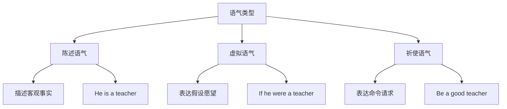
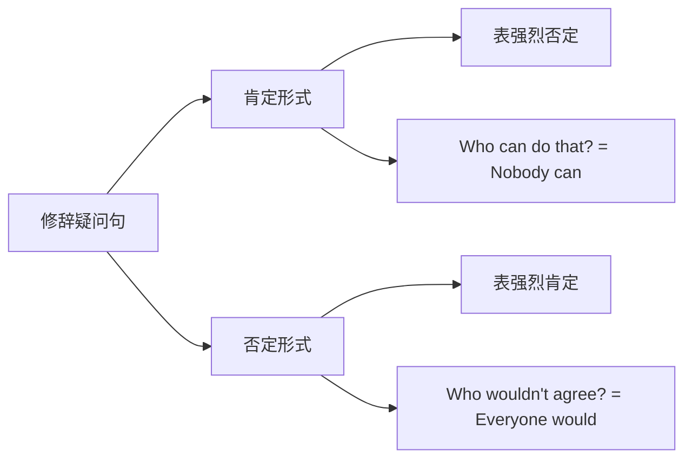
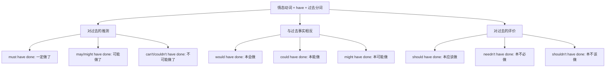
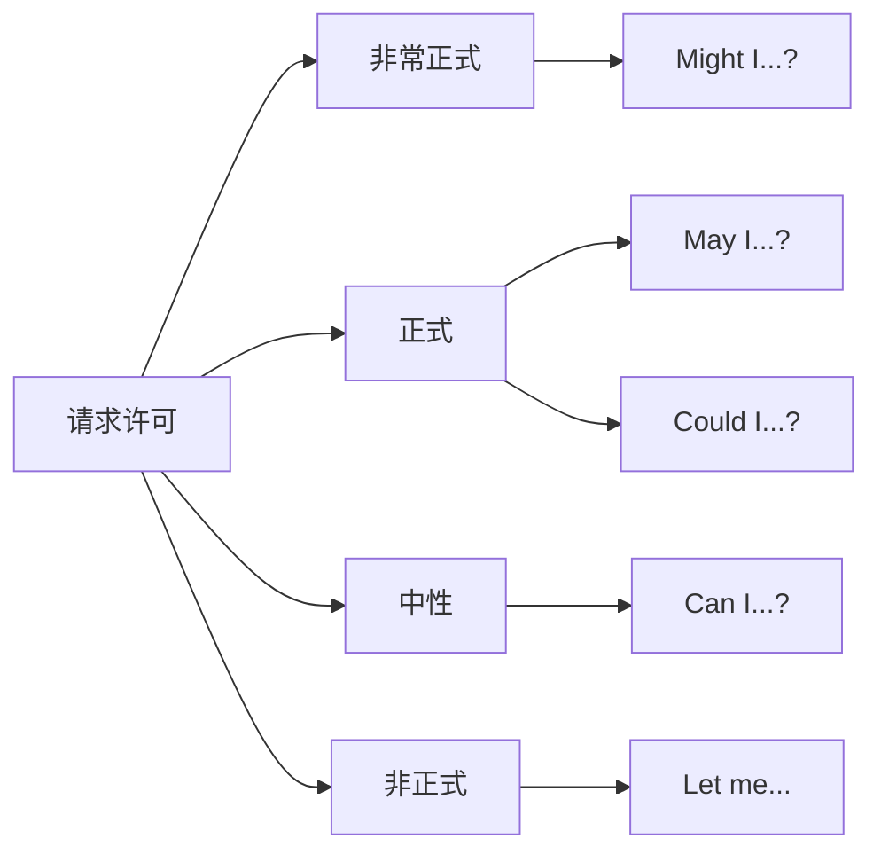
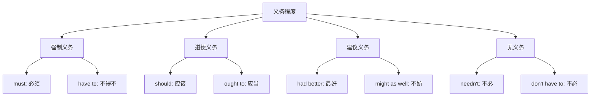
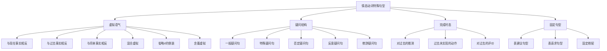

# 情态动词的特殊句型

情态动词不仅用于表达说话人的态度和判断，还在多种特殊句型中发挥关键作用。本章将深入探讨情态动词在虚拟语气、特殊疑问结构、完成时态等场景中的用法，帮助学习者全面掌握情态动词的高级应用。

---

## 1. 情态动词与虚拟语气

虚拟语气用于表达假设、愿望、建议等非真实情况。情态动词在虚拟语气中扮演核心角色，其形式和用法与陈述语气有显著区别。

### 1.1 虚拟语气的基本概念

> [!info] 什么是虚拟语气
>
> 虚拟语气（Subjunctive Mood）是一种表达**非事实、假设、愿望、建议**的语法形式。与陈述语气描述客观事实不同，虚拟语气描述的是说话人主观想象或期望的情况。



虚拟语气的核心特征是：**动词形式发生特殊变化**，常见的变化包括：
- 现在时用过去式（were 代替 was）
- 过去时用过去完成式
- 情态动词用过去式形式（would, could, might, should）

### 1.2 与现在事实相反的虚拟

当我们假设的情况与现在的事实相反时，条件从句用**一般过去时**，主句用**情态动词过去式 + 动词原形**。

> [!tip] 句型公式
>
> **If + 主语 + 动词过去式, 主语 + would/could/might/should + 动词原形**
>
> 注意：be 动词在虚拟语气中一律用 **were**，无论主语是第几人称。

**经典例句分析：**

| 虚拟条件句 | 中文翻译 | 句法分析 |
| --- | --- | --- |
| If I **were** you, I **would accept** the offer. | 如果我是你，我会接受这个提议。 | were 表示与现在事实相反；would accept 表示假设的结果 |
| If she **had** more time, she **could finish** the project. | 如果她有更多时间，她就能完成这个项目。 | had 是虚拟过去式；could finish 表示能力上的可能 |
| If it **weren't** raining, we **might go** for a walk. | 如果不下雨，我们可能会去散步。 | weren't 表示与现在事实相反；might go 表示可能性 |
| If he **studied** harder, he **should pass** the exam. | 如果他更努力学习，他应该能通过考试。 | studied 是虚拟过去式；should pass 表示合理推测 |

**情态动词的选择取决于表达的含义：**

| 情态动词 | 表达含义 | 例句 |
| --- | --- | --- |
| would | 意愿、一般假设结果 | I would help you if I could. |
| could | 能力、可能性 | She could solve the problem if she tried. |
| might | 较小的可能性 | He might succeed if he worked harder. |
| should | 应该、合理推测 | You should feel better if you rested more. |

### 1.3 与过去事实相反的虚拟

当假设的情况与过去已发生的事实相反时，条件从句用**过去完成时**，主句用**情态动词过去式 + have + 过去分词**。

> [!tip] 句型公式
>
> **If + 主语 + had + 过去分词, 主语 + would/could/might/should + have + 过去分词**

**经典例句分析：**

| 虚拟条件句 | 中文翻译 | 句法分析 |
| --- | --- | --- |
| If I **had known** the truth, I **would have told** you. | 如果我当时知道真相，我就会告诉你了。 | had known 表示与过去事实相反；would have told 表示假设的过去结果 |
| If she **had studied** medicine, she **could have become** a doctor. | 如果她当初学医，她本可以成为医生。 | had studied 是过去完成时；could have become 表示过去的能力可能 |
| If we **had left** earlier, we **might have caught** the train. | 如果我们早点出发，我们可能就赶上火车了。 | might have caught 表示过去较小的可能性 |
| If you **had followed** the instructions, this **shouldn't have happened**. | 如果你按照说明做，这件事本不该发生。 | shouldn't have happened 表示过去不应该发生的事 |

> [!warning] 易错点
>
> 与过去事实相反的虚拟语气中，**must 不能用于主句**。不能说 "If I had known, I must have told you"，因为 must 表示的是对事实的推测，不适用于假设情况。

### 1.4 与将来事实相反的虚拟

当假设的情况是对将来不太可能发生的事情进行假设时，有三种常用形式。

> [!tip] 句型公式
>
> **条件从句三种形式：**
> 1. If + 主语 + 动词过去式
> 2. If + 主语 + were to + 动词原形
> 3. If + 主语 + should + 动词原形
>
> **主句形式：** 主语 + would/could/might/should + 动词原形

**三种形式的区别：**

| 形式 | 可能性程度 | 例句 |
| --- | --- | --- |
| 一般过去式 | 可能性较小 | If it rained tomorrow, we would stay home. |
| were to + 动词原形 | 可能性极小（纯假设） | If the sun were to rise in the west, I would believe you. |
| should + 动词原形 | 可能性较小但有一定可能 | If you should see him, please give him my regards. |

**详细例句分析：**

```
例句：If I were to win the lottery, I would travel around the world.
翻译：如果我中了彩票，我会环游世界。
分析：
├── were to win：表示极不可能发生的假设
├── would travel：表示假设成立后的意愿
└── 整句表达对未来不太可能事件的假设
```

```
例句：If it should snow in July, everyone would be surprised.
翻译：如果七月下雪，每个人都会感到惊讶。
分析：
├── should snow：表示可能性较小但理论上可能
├── would be surprised：表示假设的结果
└── should 使语气更加委婉
```

### 1.5 混合时态的虚拟语气

有时条件从句和主句所指的时间不一致，需要使用混合时态的虚拟语气。

> [!example] 混合虚拟的典型情况
>
> **条件指过去，结果指现在：**
> If + 主语 + had + 过去分词, 主语 + would/could/might + 动词原形
>
> **条件指现在，结果指过去：**
> If + 主语 + 动词过去式, 主语 + would/could/might + have + 过去分词

**例句对比：**

| 类型 | 例句 | 翻译 |
| --- | --- | --- |
| 条件过去→结果现在 | If I **had taken** that job, I **would be** rich now. | 如果我当初接受了那份工作，我现在就富有了。 |
| 条件过去→结果现在 | If she **hadn't missed** the flight, she **would be** here with us. | 如果她没错过航班，她现在就和我们在一起了。 |
| 条件现在→结果过去 | If he **were** more careful, he **wouldn't have made** that mistake. | 如果他更细心的话，他就不会犯那个错误了。 |
| 条件现在→结果过去 | If I **knew** French, I **could have helped** you yesterday. | 如果我会法语，昨天我就能帮你了。 |

### 1.6 省略 if 的虚拟条件句

在正式文体中，虚拟条件句可以省略 if，将 were, had, should 提到主语前面，形成倒装结构。

> [!tip] 倒装公式
>
> - **Were** + 主语 + ... , 主句
> - **Had** + 主语 + 过去分词 ... , 主句
> - **Should** + 主语 + 动词原形 ... , 主句

**对比示例：**

| 完整形式 | 省略 if 的倒装形式 |
| --- | --- |
| If I were you, I would refuse. | **Were I** you, I would refuse. |
| If he had known, he would have come. | **Had he** known, he would have come. |
| If you should need help, call me. | **Should you** need help, call me. |
| If it were not for your help, I would fail. | **Were it not** for your help, I would fail. |

**更多倒装例句：**

```
例句：Were it possible, I would help you immediately.
翻译：如果可能的话，我会立即帮助你。
还原：If it were possible, I would help you immediately.
```

```
例句：Had I realized the danger, I would never have gone there.
翻译：如果我当时意识到危险，我绝不会去那里。
还原：If I had realized the danger, I would never have gone there.
```

```
例句：Should any problems arise, please contact us immediately.
翻译：如果出现任何问题，请立即联系我们。
还原：If any problems should arise, please contact us immediately.
```

### 1.7 含蓄虚拟条件句

有些句子没有明显的 if 条件从句，但通过其他方式暗示虚拟条件，这种情况称为含蓄虚拟条件句。

> [!info] 含蓄条件的常见表达方式
>
> - 介词短语：without, but for, otherwise, or else
> - 分词短语：given..., supposing...
> - 不定式：to hear him talk...
> - 名词短语：a true friend...
> - 连词：or, otherwise

**介词短语表示含蓄条件：**

| 表达方式 | 例句 | 翻译 |
| --- | --- | --- |
| without | Without your help, I would have failed. | 没有你的帮助，我就失败了。 |
| but for | But for the rain, we would have gone out. | 要不是下雨，我们就出去了。 |
| otherwise | He was busy; otherwise, he would have come. | 他很忙；否则，他就来了。 |
| or else | Hurry up, or else you would miss the bus. | 快点，否则你会错过公交车。 |

**其他方式表示含蓄条件：**

```
例句：Given more time, I could have done better.
翻译：如果给我更多时间，我本可以做得更好。
分析：given more time = if I had been given more time
```

```
例句：To hear him talk, you would think he was an expert.
翻译：听他说话，你会以为他是专家。
分析：to hear him talk = if you were to hear him talk
```

```
例句：A true friend would not have done that.
翻译：真正的朋友不会那样做。
分析：a true friend = if he/she were a true friend
```

---

## 2. 情态动词的特殊疑问结构

情态动词在特殊疑问句中有其独特的用法和规则。掌握这些结构对于正确表达疑问和理解语义至关重要。

### 2.1 情态动词疑问句的基本结构

情态动词疑问句的构成遵循"情态动词提前"的原则。

> [!tip] 疑问句构成公式
>
> **一般疑问句：** 情态动词 + 主语 + 动词原形 + 其他?
>
> **特殊疑问句：** 疑问词 + 情态动词 + 主语 + 动词原形 + 其他?

**一般疑问句示例：**

| 陈述句 | 一般疑问句 | 简答 |
| --- | --- | --- |
| You can swim. | Can you swim? | Yes, I can. / No, I can't. |
| She must leave now. | Must she leave now? | Yes, she must. / No, she needn't. |
| He should apologize. | Should he apologize? | Yes, he should. / No, he shouldn't. |
| They would help us. | Would they help us? | Yes, they would. / No, they wouldn't. |

**特殊疑问句示例：**

| 疑问词 | 例句 | 翻译 |
| --- | --- | --- |
| What | What can I do for you? | 我能为你做什么？ |
| Where | Where should we meet? | 我们应该在哪里见面？ |
| When | When must I return the book? | 我必须什么时候还书？ |
| Why | Why would he lie to us? | 他为什么要对我们撒谎？ |
| How | How could this happen? | 这怎么可能发生？ |
| Who | Who might know the answer? | 谁可能知道答案？ |

### 2.2 否定疑问句的用法

情态动词的否定疑问句常用于表达惊讶、责备、建议或征求同意。

> [!info] 否定疑问句的语气
>
> 否定疑问句带有说话人的主观预期或情感色彩，期待对方给出肯定回答，或表达说话人的惊讶、不满等情绪。

**否定疑问句的常见用法：**

| 用法 | 例句 | 翻译 | 语气分析 |
| --- | --- | --- | --- |
| 表惊讶 | Can't you see the problem? | 你难道看不出问题吗？ | 惊讶对方没注意到明显问题 |
| 表责备 | Shouldn't you have called me? | 你难道不该给我打电话吗？ | 责备对方没有打电话 |
| 表建议 | Wouldn't it be better to wait? | 等一等不是更好吗？ | 委婉建议等待 |
| 征求同意 | Couldn't we try another way? | 我们不能试试其他方法吗？ | 希望对方同意换方法 |

**否定疑问句的回答规则：**

> [!warning] 回答否定疑问句的注意事项
>
> 英语中回答否定疑问句时，**Yes 表示肯定事实，No 表示否定事实**，与问句的形式无关。这与中文的回答习惯不同。

| 问句 | 肯定回答 | 否定回答 |
| --- | --- | --- |
| Can't you swim? | Yes, I can. (我会游泳) | No, I can't. (我不会游泳) |
| Didn't he come? | Yes, he did. (他来了) | No, he didn't. (他没来) |
| Won't she help us? | Yes, she will. (她会帮) | No, she won't. (她不会帮) |

### 2.3 反意疑问句中的情态动词

反意疑问句由陈述句加简短问句构成，简短问句中的情态动词必须与陈述句保持一致。

> [!tip] 反意疑问句规则
>
> - 陈述句肯定 → 问句否定
> - 陈述句否定 → 问句肯定
> - 情态动词保持不变

**基本示例：**

| 陈述句 | 反意疑问句 | 翻译 |
| --- | --- | --- |
| You can drive, | can't you? | 你会开车，对吧？ |
| She must leave, | mustn't she? | 她必须离开，对吧？ |
| He shouldn't go, | should he? | 他不应该去，对吧？ |
| They would help, | wouldn't they? | 他们会帮忙，对吧？ |

**特殊情况：**

| 情态动词 | 特殊规则 | 例句 |
| --- | --- | --- |
| must（表推测） | 反意问句用实际动词 | He must be tired, isn't he? |
| must（表必须） | 反意问句用 mustn't/needn't | You must go, mustn't you? |
| need（情态动词） | 反意问句用 need | He needn't come, need he? |
| dare（情态动词） | 反意问句用 dare | She daren't ask, dare she? |

```
例句：He must have finished the work, hasn't he?
翻译：他一定完成工作了，对吧？
分析：
├── must have finished 表示对过去的推测
├── 反意问句根据实际动作用 has
└── 因为 finish 的动作确实发生在过去
```

```
例句：She can hardly understand it, can she?
翻译：她几乎无法理解，对吧？
分析：
├── hardly 是否定副词
├── 所以反意问句用肯定形式 can
└── 注意：含有 hardly, seldom, rarely 等词的句子视为否定句
```

### 2.4 修辞疑问句

修辞疑问句形式上是疑问句，但实际上表达的是强烈的肯定或否定，不需要回答。

> [!info] 修辞疑问句的特点
>
> 修辞疑问句用于加强语气，表达强烈的情感。肯定形式表示强烈否定，否定形式表示强烈肯定。

**常见修辞疑问句：**

| 例句 | 翻译 | 实际含义 |
| --- | --- | --- |
| Who can tell the future? | 谁能预知未来？ | 没有人能预知未来 |
| How could I forget you? | 我怎么能忘记你？ | 我不可能忘记你 |
| Why should I care? | 我为什么要在乎？ | 我不需要在乎 |
| What difference would it make? | 这会有什么区别？ | 这不会有什么区别 |
| Who wouldn't want to be rich? | 谁不想富有？ | 每个人都想富有 |
| Couldn't you be more careful? | 你就不能更小心点吗？ | 你应该更小心 |

**修辞疑问句的语气层次：**



### 2.5 间接疑问句中的情态动词

当疑问句作为宾语从句时，需要使用陈述句语序。

> [!tip] 间接疑问句规则
>
> 直接疑问句变为间接疑问句时：
> 1. 疑问词保留
> 2. 语序变为陈述句语序（主语 + 情态动词）
> 3. 标点符号取决于主句

**对比示例：**

| 直接疑问句 | 间接疑问句 |
| --- | --- |
| What can I do? | I wonder **what I can do**. |
| Where should we go? | Tell me **where we should go**. |
| When must he leave? | I don't know **when he must leave**. |
| Why would she say that? | I can't understand **why she would say that**. |
| How could this happen? | Please explain **how this could happen**. |

**更多例句分析：**

```
直接：Can you help me?
间接：I want to know if/whether you can help me.
翻译：我想知道你能否帮我。
分析：一般疑问句用 if/whether 引导
```

```
直接：What should I wear to the party?
间接：I'm not sure what I should wear to the party.
翻译：我不确定我应该穿什么去派对。
分析：特殊疑问句保留疑问词，但改为陈述语序
```

---

## 3. 情态动词与完成时态的结合

情态动词与完成时态（have + 过去分词）结合，用于表达对过去事件的推测、后悔、责备等复杂语义。

### 3.1 情态动词 + have + 过去分词的基本含义

> [!info] 核心概念
>
> "情态动词 + have + 过去分词" 结构用于：
> 1. 对过去事件的推测
> 2. 表达与过去事实相反的假设
> 3. 表达对过去行为的评价（后悔、责备等）



### 3.2 must have done：对过去的肯定推测

**must have done** 表示对过去事件的肯定推测，意为"一定做了某事"。

> [!tip] 用法要点
>
> - 只用于肯定句
> - 表示根据现有证据做出的逻辑推断
> - 否定形式用 can't/couldn't have done

**例句分析：**

| 例句 | 翻译 | 推测依据 |
| --- | --- | --- |
| He must have left already. | 他一定已经离开了。 | 他不在这里 |
| She must have forgotten the meeting. | 她一定是忘记了会议。 | 她没来参加 |
| They must have got lost. | 他们一定是迷路了。 | 他们迟到很久了 |
| It must have rained last night. | 昨晚一定下雨了。 | 地面是湿的 |
| Someone must have told him the news. | 一定有人告诉他这个消息了。 | 他已经知道了 |

**对话示例：**

```
A: Where is Tom? The meeting started an hour ago.
B: He must have overslept. He mentioned staying up late last night.

A: 汤姆在哪？会议一小时前就开始了。
B: 他一定是睡过头了。他提到昨晚熬夜了。
```

### 3.3 may/might have done：对过去的可能性推测

**may/might have done** 表示对过去事件的不确定推测，意为"可能做了某事"。

> [!info] may 与 might 的区别
>
> - may have done：可能性相对较大
> - might have done：可能性较小，语气更加不确定
> - 在实际使用中，两者常可互换

**例句对比：**

| 例句 | 翻译 | 确定程度 |
| --- | --- | --- |
| He may have missed the bus. | 他可能错过公交车了。 | 可能性中等 |
| He might have missed the bus. | 他也许错过公交车了。 | 可能性较小 |
| She may have already heard the news. | 她可能已经听说这个消息了。 | 可能性中等 |
| She might have already heard the news. | 她也许已经听说这个消息了。 | 可能性较小 |

**否定形式：**

| 肯定形式 | 否定形式 | 翻译 |
| --- | --- | --- |
| may have done | may not have done | 可能没做 |
| might have done | might not have done | 也许没做 |

```
例句：She may not have received my email.
翻译：她可能没收到我的邮件。
分析：对过去事件的否定推测，表示不确定她是否收到
```

### 3.4 can't/couldn't have done：对过去的否定推测

**can't/couldn't have done** 表示对过去事件的否定推测，意为"不可能做了某事"。

> [!tip] 用法要点
>
> - 是 must have done 的否定对应形式
> - 表示根据逻辑或证据认为某事不可能发生
> - couldn't have done 语气比 can't have done 稍委婉

**例句分析：**

| 例句 | 翻译 | 判断依据 |
| --- | --- | --- |
| He can't have said that. | 他不可能说过那种话。 | 了解他的为人 |
| She couldn't have stolen the money. | 她不可能偷了那笔钱。 | 她不是那种人 |
| They can't have arrived already. | 他们不可能已经到了。 | 路程太远了 |
| It couldn't have been Tom. | 那不可能是汤姆。 | 汤姆当时不在 |

**对话示例：**

```
A: Someone said John cheated on the exam.
B: That can't be true. He couldn't have done such a thing.

A: 有人说约翰考试作弊了。
B: 那不可能是真的。他不可能做那种事。
```

### 3.5 should/ought to have done：本应该做（却没做）

**should/ought to have done** 表示过去应该做而没做的事，含有责备、后悔或遗憾的语气。

> [!warning] 情感色彩
>
> 这个结构表达的是"与过去事实相反的期望"，暗示实际情况与期望不符，常带有批评或遗憾的意味。

**例句分析：**

| 例句 | 翻译 | 实际情况 |
| --- | --- | --- |
| You should have told me earlier. | 你本应该早点告诉我。 | 实际上没有早说 |
| She ought to have apologized. | 她本应该道歉的。 | 实际上没道歉 |
| We should have studied harder. | 我们本应该更努力学习。 | 实际上没有 |
| He should have been more careful. | 他本应该更小心的。 | 实际上不够小心 |
| They ought to have arrived by now. | 他们现在本应该到了。 | 实际上还没到 |

**否定形式：shouldn't/oughtn't to have done（本不应该做却做了）**

| 例句 | 翻译 | 实际情况 |
| --- | --- | --- |
| You shouldn't have said that. | 你本不应该那样说。 | 实际上说了 |
| She shouldn't have spent so much money. | 她本不应该花那么多钱。 | 实际上花了 |
| He oughtn't to have trusted them. | 他本不应该相信他们。 | 实际上相信了 |

### 3.6 could have done：本可以做（却没做）

**could have done** 表示过去有能力或机会做某事但没有做，含有遗憾或责备的语气。

> [!info] 多重含义
>
> could have done 根据语境可以表达：
> 1. 本可以做（有能力但没做）
> 2. 可能已经做了（对过去的推测）
> 3. 虚拟语气中的假设结果

**表示"本可以做"的例句：**

| 例句 | 翻译 | 语义分析 |
| --- | --- | --- |
| You could have helped me. | 你本可以帮我的。 | 有能力帮却没帮，责备 |
| She could have won the race. | 她本可以赢得比赛。 | 有实力却没赢，遗憾 |
| We could have taken a taxi. | 我们本可以打车的。 | 有这个选择却没用 |
| He could have done better. | 他本可以做得更好。 | 有能力却没发挥 |

**表示"可能已经做了"的例句：**

| 例句 | 翻译 | 语义分析 |
| --- | --- | --- |
| He could have left by now. | 他可能已经离开了。 | 对过去的推测 |
| She could have finished the work. | 她可能已经完成工作了。 | 不确定是否完成 |

### 3.7 would have done：本会做（假设情况）

**would have done** 主要用于虚拟语气，表示与过去事实相反的假设结果。

> [!tip] 核心用法
>
> would have done 表示"在某种假设条件下，过去本会发生的事"，但实际上没有发生。

**例句分析：**

| 例句 | 翻译 | 假设条件 |
| --- | --- | --- |
| I would have helped you. | 我本会帮你的。 | 如果我知道/如果你问我 |
| She would have come. | 她本会来的。 | 如果她没生病/如果她有时间 |
| We would have won. | 我们本会赢的。 | 如果我们更努力 |
| He would have succeeded. | 他本会成功的。 | 如果条件允许 |

**完整虚拟条件句：**

```
例句：If I had known about the party, I would have attended.
翻译：如果我知道有派对，我就会参加了。
分析：
├── had known：与过去事实相反的条件
├── would have attended：假设的过去结果
└── 实际情况：不知道派对，所以没参加
```

### 3.8 needn't have done：本不必做（却做了）

**needn't have done** 表示过去做了某事，但实际上没必要做。

> [!warning] 与 didn't need to do 的区别
>
> - **needn't have done**：做了，但没必要做
> - **didn't need to do**：没必要做，可能做了也可能没做

**对比示例：**

| 结构 | 例句 | 翻译 | 实际情况 |
| --- | --- | --- | --- |
| needn't have done | You needn't have bought so much food. | 你本不必买这么多食物。 | 买了，但没必要 |
| didn't need to do | You didn't need to buy any food. | 你不需要买食物。 | 可能买了可能没买 |
| needn't have done | She needn't have worried. | 她本不必担心。 | 担心了，但没必要 |
| didn't need to do | She didn't need to worry. | 她不需要担心。 | 不确定是否担心了 |

**更多例句：**

```
例句：He needn't have woken up so early. The train was delayed.
翻译：他本不必那么早起床。火车晚点了。
分析：
├── needn't have woken up：实际早起了
├── 但因为火车晚点，早起是不必要的
└── 表达"白做了"的遗憾
```

### 3.9 各结构对比总结

> [!example] 情态动词 + have done 结构对比表
>
> | 结构 | 含义 | 例句 | 实际情况 |
> | --- | --- | --- | --- |
> | must have done | 一定做了 | He must have left. | 推测他离开了 |
> | may/might have done | 可能做了 | He may have left. | 不确定 |
> | can't have done | 不可能做了 | He can't have left. | 推测他没离开 |
> | should have done | 本应该做 | He should have left. | 他没离开 |
> | shouldn't have done | 本不该做 | He shouldn't have left. | 他离开了 |
> | could have done | 本可以做 | He could have left. | 他没离开 |
> | would have done | 本会做 | He would have left. | 假设条件下会离开 |
> | needn't have done | 本不必做 | He needn't have left. | 他离开了但没必要 |

---

## 4. 常见情态动词句型整理

本节系统整理情态动词参与构成的常见句型和固定搭配。

### 4.1 表建议的句型

> [!tip] 建议句型汇总
>
> 以下句型均可用于向他人提出建议，语气从委婉到直接不等。

**使用 should 的建议句型：**

| 句型 | 例句 | 翻译 | 语气 |
| --- | --- | --- | --- |
| You should... | You should see a doctor. | 你应该去看医生。 | 较直接 |
| I think you should... | I think you should apologize. | 我认为你应该道歉。 | 较委婉 |
| Maybe you should... | Maybe you should rest for a while. | 也许你应该休息一会儿。 | 委婉 |
| Shouldn't you...? | Shouldn't you call your parents? | 你难道不该给父母打电话吗？ | 暗示批评 |

**使用 could 的建议句型：**

| 句型 | 例句 | 翻译 | 语气 |
| --- | --- | --- | --- |
| You could... | You could try asking him. | 你可以试着问他。 | 提供选项 |
| Couldn't you...? | Couldn't you be more patient? | 你就不能更耐心点吗？ | 暗示批评 |
| You could always... | You could always take a taxi. | 你总可以打车嘛。 | 提供备选 |

**使用 might 的建议句型：**

| 句型 | 例句 | 翻译 | 语气 |
| --- | --- | --- | --- |
| You might want to... | You might want to reconsider. | 你可能需要重新考虑。 | 非常委婉 |
| You might try... | You might try a different approach. | 你可以试试其他方法。 | 委婉建议 |
| It might be better to... | It might be better to wait. | 等待可能会更好。 | 间接建议 |

### 4.2 表请求和许可的句型



**请求许可的句型对比：**

| 正式程度 | 句型 | 例句 | 翻译 |
| --- | --- | --- | --- |
| 最正式 | Might I + 动词原形? | Might I ask you a question? | 我能问您一个问题吗？ |
| 正式 | May I + 动词原形? | May I use your phone? | 我可以用您的电话吗？ |
| 较正式 | Could I + 动词原形? | Could I borrow your pen? | 我能借用您的笔吗？ |
| 中性 | Can I + 动词原形? | Can I sit here? | 我能坐这儿吗？ |
| 非正式 | Let me + 动词原形 | Let me help you. | 让我帮你。 |

**请求他人做某事的句型：**

| 正式程度 | 句型 | 例句 | 翻译 |
| --- | --- | --- | --- |
| 最正式 | Would you mind + doing? | Would you mind closing the door? | 您介意关上门吗？ |
| 正式 | Would you + 动词原形? | Would you pass me the salt? | 您能递给我盐吗？ |
| 正式 | Could you + 动词原形? | Could you help me with this? | 您能帮我一下吗？ |
| 中性 | Will you + 动词原形? | Will you wait here? | 你在这等一下好吗？ |
| 中性 | Can you + 动词原形? | Can you open the window? | 你能开窗吗？ |

### 4.3 表推测的句型层次

> [!info] 推测的确定程度
>
> 不同情态动词表达的推测确定程度不同，从"几乎确定"到"可能性很小"形成一个连续谱。

**对现在/将来的推测：**

| 确定程度 | 句型 | 例句 | 翻译 |
| --- | --- | --- | --- |
| 几乎确定（肯定） | must + 动词原形 | He must be tired. | 他一定累了。 |
| 很可能 | should + 动词原形 | She should arrive soon. | 她应该很快到。 |
| 可能 | may + 动词原形 | It may rain later. | 待会可能下雨。 |
| 也许 | might + 动词原形 | He might come. | 他也许会来。 |
| 也许（更不确定） | could + 动词原形 | That could be true. | 那可能是真的。 |
| 几乎确定（否定） | can't + 动词原形 | He can't be serious. | 他不可能是认真的。 |

**对过去的推测：**

| 确定程度 | 句型 | 例句 | 翻译 |
| --- | --- | --- | --- |
| 几乎确定（肯定） | must have + 过去分词 | He must have left. | 他一定走了。 |
| 很可能 | should have + 过去分词 | She should have arrived. | 她应该已经到了。 |
| 可能 | may have + 过去分词 | They may have forgotten. | 他们可能忘了。 |
| 也许 | might have + 过去分词 | He might have seen it. | 他也许看到了。 |
| 也许（更不确定） | could have + 过去分词 | It could have worked. | 那本可能行得通。 |
| 几乎确定（否定） | can't have + 过去分词 | She can't have known. | 她不可能知道。 |

### 4.4 表能力的句型

**一般能力 vs 具体情境能力：**

| 类型 | 时态 | 句型 | 例句 | 翻译 |
| --- | --- | --- | --- | --- |
| 一般能力 | 现在 | can + 动词原形 | I can speak French. | 我会说法语。 |
| 一般能力 | 过去 | could + 动词原形 | I could swim when I was five. | 我五岁时就会游泳。 |
| 具体能力 | 过去 | was/were able to | I was able to finish it. | 我成功完成了它。 |
| 具体能力 | 过去否定 | couldn't | I couldn't find the key. | 我没能找到钥匙。 |

> [!warning] could 与 was able to 的区别
>
> - **could**：表示过去的一般能力
> - **was/were able to**：表示在具体情境中成功做到了某事
>
> 否定时两者可互换：couldn't = wasn't/weren't able to

**对比例句：**

```
例句1：I could run fast when I was young.
翻译：我年轻时跑得很快。（一般能力）

例句2：Despite the injury, I was able to finish the marathon.
翻译：尽管受伤了，我还是成功完成了马拉松。（具体成就）

例句3：I couldn't open the door. = I wasn't able to open the door.
翻译：我打不开那扇门。（两者可互换）
```

### 4.5 表义务和必要的句型

**义务程度对比：**



**详细对比：**

| 情态表达 | 含义 | 例句 | 翻译 |
| --- | --- | --- | --- |
| must | 必须（说话人要求） | You must finish it today. | 你今天必须完成。 |
| have to | 不得不（客观需要） | I have to leave now. | 我不得不走了。 |
| should | 应该（建议） | You should exercise more. | 你应该多锻炼。 |
| ought to | 应当（道义） | We ought to help them. | 我们应当帮助他们。 |
| had better | 最好（警告） | You'd better hurry. | 你最好快点。 |
| might as well | 不妨（无所谓） | We might as well stay. | 我们不妨留下来。 |
| needn't | 不必 | You needn't worry. | 你不必担心。 |
| don't have to | 不必 | You don't have to come. | 你不必来。 |

### 4.6 固定句型和惯用表达

**would rather 句型：**

> [!tip] would rather 的用法
>
> - would rather + 动词原形：宁愿做某事
> - would rather + 从句：宁愿某人做某事（从句用虚拟语气）

| 结构 | 例句 | 翻译 |
| --- | --- | --- |
| would rather + 动词原形 | I would rather stay home. | 我宁愿待在家里。 |
| would rather not + 动词原形 | I'd rather not go out tonight. | 我今晚不想出去。 |
| would rather A than B | I'd rather walk than take a bus. | 我宁愿走路也不坐公交。 |
| would rather + 从句（现在） | I'd rather you didn't smoke here. | 我宁愿你不在这儿抽烟。 |
| would rather + 从句（过去） | I'd rather you had told me earlier. | 我宁愿你早点告诉我。 |

**may/might as well 句型：**

| 句型 | 例句 | 翻译 | 用法 |
| --- | --- | --- | --- |
| may/might as well | We might as well start now. | 我们不妨现在开始。 | 表示无所谓、不反对 |
| may/might as well...as | You might as well throw money away as buy that car. | 买那辆车还不如把钱扔掉。 | 表示两者同样不值得 |

**cannot help but / cannot but 句型：**

| 句型 | 例句 | 翻译 |
| --- | --- | --- |
| cannot help doing | I can't help laughing. | 我忍不住笑了。 |
| cannot help but do | I cannot help but admire her. | 我不禁钦佩她。 |
| cannot but do | I cannot but agree. | 我不得不同意。 |
| cannot help oneself | I couldn't help myself. | 我控制不住自己。 |

**其他常见固定搭配：**

| 句型 | 例句 | 翻译 |
| --- | --- | --- |
| can't/couldn't + 比较级 | The situation couldn't be worse. | 情况不能更糟了。 |
| It couldn't be better. | It couldn't be better. | 再好不过了。 |
| I couldn't agree more. | I couldn't agree more. | 我完全同意。 |
| You can never be too careful. | You can never be too careful. | 你再小心也不为过。 |
| I would love/like to | I would love to join you. | 我很想加入你们。 |
| would you mind...? | Would you mind waiting? | 您介意等一下吗？ |

### 4.7 情态动词的省略

在口语和非正式文体中，情态动词后的动词有时可以省略，但情态动词保留。

> [!info] 省略规则
>
> 当情态动词后的动词在上下文中已经明确时，可以省略动词只保留情态动词。

**省略示例：**

| 完整形式 | 省略形式 | 语境 |
| --- | --- | --- |
| Can you swim? — Yes, I can swim. | Yes, I can. | 回答问题 |
| Will you come? — Yes, I will come. | Yes, I will. | 回答问题 |
| You may go if you want to go. | You may go if you want to. | 避免重复 |
| She can sing better than I can sing. | She can sing better than I can. | 比较结构 |
| I'll help you if I can help you. | I'll help you if I can. | 条件句 |

---

## 5. 情态动词在不同语体中的使用

情态动词的选择和使用受到语体（正式/非正式）和语境的影响。

### 5.1 正式语体中的情态动词

> [!tip] 正式语体特点
>
> 在正式文体（学术论文、商务信函、法律文件等）中：
> - 优先使用 shall, may, might
> - 避免过于口语化的表达
> - 使用完整形式而非缩写

**正式语体示例：**

| 语境 | 例句 | 翻译 |
| --- | --- | --- |
| 法律文件 | The tenant shall pay the rent monthly. | 承租人应每月支付租金。 |
| 学术论文 | This may indicate a significant trend. | 这可能表明一个重要趋势。 |
| 商务信函 | We would be grateful if you could... | 如果您能...，我们将不胜感激。 |
| 官方通知 | Passengers shall remain seated. | 乘客应保持就座。 |
| 规章制度 | Employees must wear identification. | 员工必须佩戴身份证明。 |

**正式请求的表达：**

| 非正式 | 正式 |
| --- | --- |
| Can you help me? | Would you be so kind as to help me? |
| I want to ask you... | I would like to inquire... |
| You should do this. | It would be advisable to do this. |
| Can I see the manager? | Might I have a word with the manager? |

### 5.2 非正式语体中的情态动词

> [!info] 非正式语体特点
>
> 在日常对话、私人信件等非正式场合：
> - 常用缩写形式
> - 优先使用 can, will, gonna (going to)
> - 语气更直接

**非正式语体示例：**

| 正式表达 | 非正式表达 |
| --- | --- |
| I would like to go. | I wanna go. |
| Could you please wait? | Can you wait? |
| I shall return shortly. | I'll be back soon. |
| Would you care for some tea? | Want some tea? |
| One must be careful. | You gotta be careful. |

**口语中的情态动词缩写：**

| 完整形式 | 缩写形式 | 发音 |
| --- | --- | --- |
| would have | would've / woulda | /ˈwʊdəv/ |
| could have | could've / coulda | /ˈkʊdəv/ |
| should have | should've / shoulda | /ˈʃʊdəv/ |
| might have | might've / mighta | /ˈmaɪtəv/ |
| must have | must've / musta | /ˈmʌstəv/ |

### 5.3 英式英语与美式英语的差异

| 用法 | 英式英语 | 美式英语 |
| --- | --- | --- |
| 表建议 | Shall we go? | Should we go? / Let's go? |
| 表必须 | You must do this. | You have to do this. |
| 表过去习惯 | I used to live here. | I used to live here. |
| 表需要（否定） | You needn't worry. | You don't need to worry. |
| 表敢于 | I daren't ask. | I don't dare (to) ask. |

---

## 6. 综合练习与应用

### 6.1 情景对话练习

**场景一：请求帮助**

```
A: Excuse me, could you help me with these boxes?
B: Sure, I'd be happy to. Where should I put them?
A: Would you mind putting them in the storage room?
B: Not at all. By the way, you might want to label them.
A: You're right. I should have done that earlier.

A: 打扰一下，您能帮我搬这些箱子吗？
B: 当然，我很乐意。应该放哪儿？
A: 您介意把它们放到储藏室吗？
B: 完全不介意。顺便说一下，你可能需要给它们贴标签。
A: 你说得对。我本应该早点做这件事。
```

**场景二：表达后悔**

```
A: I failed the exam. I should have studied harder.
B: Don't be too hard on yourself. You couldn't have known the test would be so difficult.
A: But I might have passed if I hadn't wasted so much time.
B: Well, you can't change the past. You'd better focus on the next one.
A: You're right. I must start preparing now.

A: 我考试没通过。我本应该更努力学习的。
B: 别太自责。你不可能知道考试会这么难。
A: 但如果我没浪费那么多时间，我可能就通过了。
B: 嗯，你无法改变过去。你最好专注于下一次。
A: 你说得对。我必须现在就开始准备。
```

### 6.2 常见错误分析

> [!warning] 易错点总结
>
> 以下是中国学习者在使用情态动词时的常见错误。

| 错误表达 | 正确表达 | 错误原因 |
| --- | --- | --- |
| I can to swim. | I can swim. | 情态动词后跟原形 |
| He must can do it. | He must be able to do it. | 情态动词不能连用 |
| She cans speak English. | She can speak English. | 情态动词无人称变化 |
| Must I to go? | Must I go? | 情态动词后不加 to |
| I must not have to go. | I don't have to go. | must 无过去式，否定用 don't have to |
| He should has done it. | He should have done it. | should 后跟 have 原形 |
| You needn't to worry. | You needn't worry. | need 作情态动词后不加 to |

### 6.3 翻译练习

**中译英练习：**

| 中文 | 参考译文 |
| --- | --- |
| 如果我是你，我不会接受那个提议。 | If I were you, I wouldn't accept that offer. |
| 他一定是忘记了我们的约会。 | He must have forgotten our appointment. |
| 你本不应该在会议上那样说。 | You shouldn't have said that at the meeting. |
| 要不是你的帮助，我就失败了。 | But for your help, I would have failed. |
| 我宁愿你不要告诉任何人。 | I'd rather you didn't tell anyone. |

---

## 7. 本章小结

本章系统介绍了情态动词在特殊句型中的用法，主要涵盖以下内容：



> [!success] 学习要点回顾
>
> 1. **虚拟语气**：掌握不同时间指向的虚拟条件句结构
> 2. **疑问结构**：理解情态动词在各类疑问句中的位置和用法
> 3. **完成时态**：区分"情态动词 + have done"的不同含义
> 4. **固定句型**：熟记常见情态动词固定搭配和惯用表达
> 5. **语体差异**：根据场合选择合适的情态动词形式

掌握情态动词的特殊句型是提高英语表达准确性和丰富性的关键。建议学习者通过大量阅读和练习，在实际语境中体会这些句型的微妙差异。

---

## 参考资料

1. 薄冰.《高级英语语法》. 高等教育出版社
2. Raymond Murphy. *English Grammar in Use*. Cambridge University Press
3. Michael Swan. *Practical English Usage*. Oxford University Press
4. 张道真.《实用英语语法》. 外语教学与研究出版社
