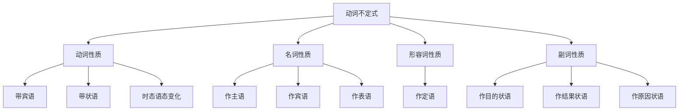
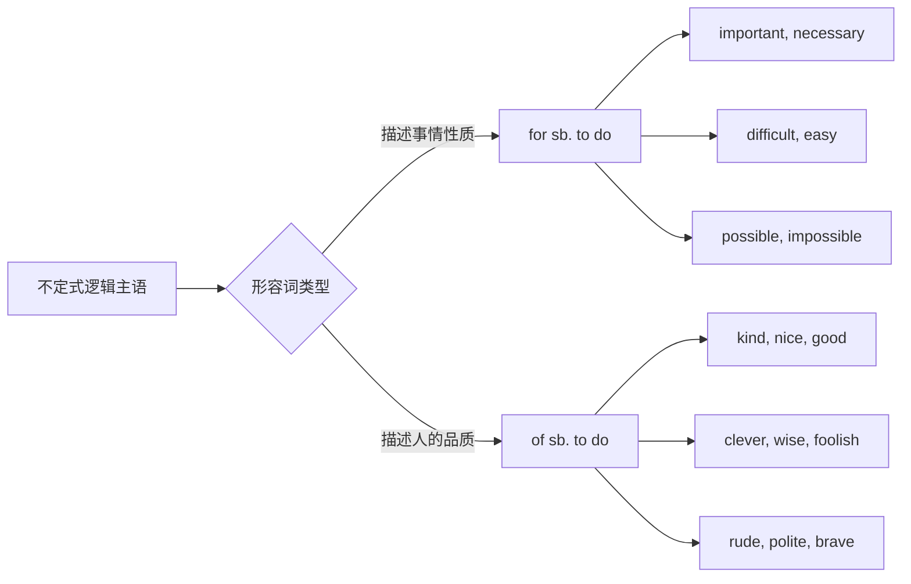
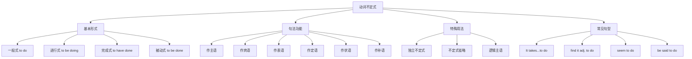

# 动词不定式详解

动词不定式（Infinitive）是英语非谓语动词中最重要、最灵活的形式之一。它既保留了动词的某些特征（可以带宾语、状语），又具有名词、形容词、副词的语法功能，能在句中充当多种成分。掌握动词不定式，是理解英语复杂句式、提升表达能力的关键一步。

本篇将从不定式的基本形式出发，逐步讲解其六大句法功能、时态语态变化、否定形式以及常见句型搭配，帮助你全面掌握这一重要语法点。

---

## 1. 动词不定式的基本概念

### 1.1 什么是动词不定式

动词不定式是一种非谓语动词形式，最常见的结构是 **"to + 动词原形"**。之所以称为"不定式"，是因为它不受主语人称和数的限制，形式固定不变。

> [!info] 术语解释
>
> **Infinitive（不定式）** 来自拉丁语，意为"不受限定的"。与限定动词（谓语动词）相比，不定式不随主语变化，没有人称和数的变化形式。

**不定式的两种形式**：

| 形式 | 结构 | 示例 |
| --- | --- | --- |
| **带 to 不定式** | to + 动词原形 | to read, to write, to go |
| **不带 to 不定式**（裸不定式） | 动词原形 | read, write, go |

大多数情况下，我们使用带 to 的不定式。不带 to 的不定式（裸不定式）主要出现在特定结构中，如感官动词、使役动词后。

### 1.2 不定式的双重性质

动词不定式具有动词和名词/形容词/副词的双重性质：

**动词性质**：
- 可以带宾语：to read **a book**（读一本书）
- 可以带状语：to speak **fluently**（流利地说）
- 可以有时态和语态变化：to have done, to be done

**名词/形容词/副词性质**：
- 作主语（名词性）：**To learn English** is important.
- 作定语（形容词性）：I have a lot of work **to do**.
- 作状语（副词性）：He came **to help us**.

上图展示了动词不定式的双重性质。作为动词，它保留了带宾语、带状语的能力；作为非谓语形式，它可以在句中扮演名词、形容词或副词的角色，充当主语、宾语、表语、定语和状语等成分。

### 1.3 不定式与谓语动词的区别

理解不定式与谓语动词的区别，有助于正确使用这一结构：

| 对比项 | 谓语动词 | 不定式 |
| --- | --- | --- |
| **人称变化** | 随主语变化（I go / He goes） | 不变化（to go） |
| **时态体现** | 直接体现时态（went, will go） | 通过完成式体现相对时间 |
| **句法地位** | 构成句子核心，决定句子时态 | 充当句子成分，不能单独作谓语 |
| **否定方式** | 借助助动词（do not go） | 直接在 to 前加 not（not to go） |

> [!example] 对比示例
>
> **谓语动词**：
> - He **goes** to school every day.（他每天上学。）
> - She **is reading** a book now.（她现在正在读书。）
>
> **不定式**：
> - He wants **to go** to school.（他想去上学。）
> - She plans **to read** a book.（她计划读一本书。）
>
> 在第一组中，goes 和 is reading 是谓语动词，决定句子时态；在第二组中，to go 和 to read 是不定式，作为 wants 和 plans 的宾语。

---

## 2. 不定式的形式与构成

### 2.1 不定式的基本形式

动词不定式有多种形式，可以表达不同的时态和语态关系：

| 形式 | 主动语态 | 被动语态 |
| --- | --- | --- |
| **一般式** | to do | to be done |
| **进行式** | to be doing | — |
| **完成式** | to have done | to have been done |
| **完成进行式** | to have been doing | — |

**各形式的时间含义**：

1. **一般式（to do / to be done）**
   - 表示动作与谓语动词同时发生或在其后发生
   - I want **to see** you.（我想见你。）
   - The work needs **to be finished**.（这项工作需要被完成。）

2. **进行式（to be doing）**
   - 表示动作正在进行，与谓语动词同时发生
   - She seems **to be sleeping**.（她似乎正在睡觉。）
   - They appeared **to be discussing** something.（他们似乎正在讨论什么。）

3. **完成式（to have done / to have been done）**
   - 表示动作发生在谓语动词之前
   - He claims **to have met** the president.（他声称见过总统。）
   - The letter is said **to have been written** by him.（据说这封信是他写的。）

4. **完成进行式（to have been doing）**
   - 表示动作从过去开始一直持续到谓语动词所表示的时间
   - She seems **to have been waiting** for hours.（她似乎已经等了好几个小时。）

> [!warning] 时态对应关系
>
> 不定式的时态是**相对时态**，需要参照谓语动词来理解：
> - **一般式**：与谓语同时或在其后
> - **完成式**：在谓语之前
>
> 例如：
> - He is happy **to meet** you.（他很高兴见到你。）— 同时
> - He is happy **to have met** you.（他很高兴见过你。）— 之前

### 2.2 不定式的否定形式

不定式的否定形式是在 **to 之前加 not**，构成 **not to do**：

| 肯定形式 | 否定形式 |
| --- | --- |
| to go | not to go |
| to be late | not to be late |
| to have done | not to have done |
| to be done | not to be done |

**例句分析**：

1. **I told him not to be late.**
   - 我告诉他不要迟到。
   - not 放在 to 之前，否定整个不定式。

2. **She decided not to go to the party.**
   - 她决定不去参加聚会。
   - 否定的是 go to the party 这个动作。

3. **He pretended not to have heard the news.**
   - 他假装没有听到这个消息。
   - 否定完成式，表示在谓语动作之前没有发生。

> [!tip] never 的用法
>
> 除了 not，也可以用 **never** 来否定不定式：
> - I promised **never to tell** anyone.（我答应永远不告诉任何人。）
> - He resolved **never to make** the same mistake again.（他下定决心再也不犯同样的错误。）

### 2.3 不定式的被动形式

当不定式的逻辑主语是动作的承受者时，使用被动形式：

**被动形式构成**：

| 时态 | 被动形式 | 示例 |
| --- | --- | --- |
| 一般被动 | to be done | to be invited |
| 完成被动 | to have been done | to have been invited |

**例句对比**：

| 主动形式 | 被动形式 |
| --- | --- |
| I want someone **to help** me. | I want **to be helped**. |
| He hopes **to finish** the work. | The work is hoped **to be finished**. |
| She is said **to have written** this book. | This book is said **to have been written** by her. |

**详细例句分析**：

1. **The problem remains to be solved.**
   - 这个问题仍有待解决。
   - problem 是 solve 的承受者，使用被动形式。

2. **She doesn't like to be laughed at.**
   - 她不喜欢被嘲笑。
   - she 是 laugh at 的对象，使用被动形式。

3. **He was the first to be awarded the prize.**
   - 他是第一个被授予该奖项的人。
   - he 是 award 的承受者。

---

## 3. 不定式的句法功能

动词不定式在句中可以充当六种成分：主语、宾语、表语、定语、状语和补语。这是不定式最核心的知识点，需要逐一掌握。

### 3.1 不定式作主语

不定式可以在句中充当主语，表示一个动作或行为。

#### 3.1.1 不定式直接作主语

**基本句型**：**To do sth. + is/was + adj./n.**

**例句**：

1. **To learn a foreign language is not easy.**
   - 学习一门外语不容易。
   - To learn a foreign language 是主语，is 是谓语。

2. **To finish the work on time requires great effort.**
   - 按时完成这项工作需要很大的努力。
   - To finish the work on time 是主语。

3. **To be kind to others is a virtue.**
   - 善待他人是一种美德。
   - To be kind to others 是主语。

> [!warning] 主语位置过长的问题
>
> 当不定式作主语较长时，句子会显得头重脚轻。为了句子平衡，通常用 **it 作形式主语**，将真正的不定式主语后置。

#### 3.1.2 it 作形式主语

**基本句型**：**It + is/was + adj./n. + to do sth.**

| 原句（不定式作主语） | 改写（it 作形式主语） |
| --- | --- |
| To learn English is important. | **It is important to learn English.** |
| To tell lies is wrong. | **It is wrong to tell lies.** |
| To help others is a pleasure. | **It is a pleasure to help others.** |

**常见的形容词搭配**：

| 类型 | 常用形容词 |
| --- | --- |
| **难易程度** | easy, difficult, hard, impossible |
| **重要性** | important, necessary, essential, vital |
| **评价类** | good, bad, right, wrong, wise, foolish |
| **情感类** | nice, kind, rude, polite, brave |

**特殊句型**：当形容词描述的是人的品质时，可以加 **of sb.**：

- **It is kind of you to help me.**
  - 你帮助我真是太好了。
  - kind 描述的是 you 的品质。

- **It is foolish of him to believe that.**
  - 他相信那个真是太愚蠢了。
  - foolish 描述的是 him 的品质。

> [!tip] of sb. 与 for sb. 的区别
>
> - **of sb.**：形容词描述人的品质（kind, nice, clever, foolish, rude, brave 等）
> - **for sb.**：形容词描述事情的性质（important, necessary, difficult, easy 等）
>
> 对比：
> - It is **kind of** you to say so.（你这样说真好。）— kind 描述你的品质
> - It is **important for** you to study hard.（努力学习对你很重要。）— important 描述 study 这件事

### 3.2 不定式作宾语

不定式可以在及物动词后充当宾语，表示动词的内容或目标。

#### 3.2.1 动词 + 不定式

许多动词后面可以直接跟不定式作宾语：

| 动词类型 | 常见动词 |
| --- | --- |
| **愿望类** | want, wish, hope, desire, expect, long |
| **决定类** | decide, determine, choose, resolve |
| **计划类** | plan, intend, mean, prepare |
| **承诺类** | promise, agree, refuse, offer |
| **尝试类** | try, attempt, manage, fail |
| **其他** | learn, afford, pretend, seem, appear |

**例句分析**：

1. **I want to buy a new car.**
   - 我想买一辆新车。
   - to buy a new car 是 want 的宾语。

2. **She decided to study abroad.**
   - 她决定出国留学。
   - to study abroad 是 decided 的宾语。

3. **He promised to come on time.**
   - 他答应准时来。
   - to come on time 是 promised 的宾语。

4. **They agreed to help us with the project.**
   - 他们同意帮助我们做这个项目。
   - to help us with the project 是 agreed 的宾语。

> [!warning] 只能接不定式作宾语的动词
>
> 以下动词后**只能用不定式**，不能用动名词：
> - hope, wish, want, decide, choose, agree, refuse, promise, expect, pretend, plan, manage, fail, offer, learn, afford
>
> **错误**：I hope ~~seeing~~ you soon. ❌
> **正确**：I hope **to see** you soon. ✔

#### 3.2.2 动词 + it + 形容词/名词 + 不定式

当宾语是不定式且后面还有宾语补足语时，用 **it** 作形式宾语：

**句型**：**V + it + adj./n. + to do sth.**

**常见动词**：find, think, consider, believe, make, feel

**例句**：

1. **I find it difficult to understand him.**
   - 我发现理解他很困难。
   - it 是形式宾语，to understand him 是真正宾语，difficult 是宾补。

2. **She thinks it necessary to learn English well.**
   - 她认为学好英语是必要的。
   - it 是形式宾语，to learn English well 是真正宾语。

3. **He made it a rule to get up early.**
   - 他养成了早起的习惯。
   - it 是形式宾语，to get up early 是真正宾语，a rule 是宾补。

4. **We consider it our duty to help the poor.**
   - 我们认为帮助穷人是我们的责任。
   - it 是形式宾语，to help the poor 是真正宾语。

#### 3.2.3 特殊动词 + 疑问词 + 不定式

某些动词后可接 **疑问词 + 不定式** 结构，相当于一个名词性从句：

**疑问词**：what, how, when, where, whether, which, who

**常见动词**：know, learn, decide, wonder, tell, show, teach, ask

**例句**：

1. **I don't know what to do.**
   - 我不知道该做什么。
   - what to do = what I should do

2. **Please tell me how to get there.**
   - 请告诉我怎样到那儿。
   - how to get there = how I can get there

3. **He couldn't decide whether to go or stay.**
   - 他无法决定是走还是留。
   - whether to go or stay = whether he should go or stay

4. **She showed me where to put the books.**
   - 她告诉我把书放哪里。
   - where to put the books = where I should put the books

> [!info] 疑问词 + 不定式 的本质
>
> 这种结构实际上是省略了情态动词的名词性从句：
> - what to do = what I should do
> - how to do it = how I can do it
> - when to leave = when I should leave

### 3.3 不定式作表语

不定式可以在系动词后充当表语，说明主语的性质、内容或目的。

#### 3.3.1 不定式表示主语的内容

**例句**：

1. **My dream is to become a doctor.**
   - 我的梦想是成为一名医生。
   - to become a doctor 说明 dream 的具体内容。

2. **Our plan is to finish the work by Friday.**
   - 我们的计划是在周五前完成工作。
   - to finish the work by Friday 说明 plan 的内容。

3. **His wish is to travel around the world.**
   - 他的愿望是环游世界。
   - to travel around the world 说明 wish 的内容。

#### 3.3.2 不定式表示目的或命运

**例句**：

1. **He seems to be very happy.**
   - 他似乎很开心。
   - to be very happy 表示主语的状态。

2. **The house is to let.**
   - 这房子要出租。
   - to let 表示房子的用途/目的。

3. **They are to meet at the airport.**
   - 他们将在机场见面。
   - to meet at the airport 表示计划/安排。

> [!tip] be + to do 的特殊含义
>
> **be + to do** 结构有多种特殊含义：
> - **计划/安排**：We are to meet tomorrow.（我们明天见面。）
> - **命令/指示**：You are to report to the manager.（你要向经理汇报。）
> - **可能性**：The book is to be found in the library.（这本书在图书馆能找到。）
> - **命中注定**：They were never to meet again.（他们注定不会再相见。）

### 3.4 不定式作定语

不定式可以放在名词或代词后面作定语，修饰限定该名词或代词。

#### 3.4.1 不定式修饰名词

**例句**：

1. **I have a lot of work to do.**
   - 我有很多工作要做。
   - to do 修饰 work，说明 work 的具体内容。

2. **She is the first person to arrive.**
   - 她是第一个到达的人。
   - to arrive 修饰 person。

3. **He has no friends to play with.**
   - 他没有朋友一起玩。
   - to play with 修饰 friends。

4. **There is nothing to worry about.**
   - 没什么可担心的。
   - to worry about 修饰 nothing。

#### 3.4.2 不定式与被修饰词的逻辑关系

不定式作定语时，与被修饰的名词之间存在不同的逻辑关系：

| 逻辑关系 | 示例 | 分析 |
| --- | --- | --- |
| **动宾关系** | work to do | do work |
| **主谓关系** | the first to arrive | someone arrives first |
| **同位关系** | ability to speak | ability = speaking |
| **介宾关系** | friends to play with | play with friends |

**详细例句**：

1. **动宾关系**：
   - I need a pen **to write with**.（我需要一支笔来写字。）
   - write with a pen，a pen 是 write with 的宾语。

2. **主谓关系**：
   - He is always the last **to leave**.（他总是最后一个离开。）
   - he leaves last，he 是 leave 的主语。

3. **同位关系**：
   - I have no intention **to hurt you**.（我无意伤害你。）
   - intention = to hurt you，不定式解释 intention 的内容。

4. **介宾关系**：
   - I have no one **to talk to**.（我没有人可以交谈。）
   - talk to someone，someone 是 to 的宾语。

> [!warning] 不定式作定语的介词问题
>
> 当不定式与被修饰词之间存在介宾关系时，**不能省略介词**：
> - I need a chair **to sit on**. ✔（sit on a chair）
> - I need a chair ~~to sit~~. ❌
>
> - She has nothing **to worry about**. ✔
> - She has nothing ~~to worry~~. ❌

#### 3.4.3 常与不定式连用的名词

| 名词类型 | 常见名词 |
| --- | --- |
| **抽象名词** | ability, chance, opportunity, time, way, plan, decision |
| **序数词/最高级修饰的名词** | the first, the last, the best, the only |
| **不定代词** | something, nothing, anything, everything |

**例句**：

1. **He has the ability to solve the problem.**
   - 他有能力解决这个问题。

2. **This is the best way to learn English.**
   - 这是学英语最好的方法。

3. **Is there anything to eat?**
   - 有什么吃的吗？

### 3.5 不定式作状语

不定式可以在句中作状语，表示目的、结果、原因等。

#### 3.5.1 目的状语

不定式作目的状语是最常见的用法，表示动作的目的：

**例句**：

1. **He came to see me.**
   - 他来看我。
   - to see me 表示来的目的。

2. **She went to the library to borrow some books.**
   - 她去图书馆借一些书。
   - to borrow some books 表示去图书馆的目的。

3. **I got up early to catch the first bus.**
   - 我早起是为了赶上第一班公交车。
   - to catch the first bus 表示早起的目的。

**强调目的的结构**：

| 结构 | 例句 |
| --- | --- |
| **in order to do** | He studied hard **in order to pass** the exam. |
| **so as to do** | She left early **so as to avoid** the traffic. |
| **in order not to do** | I spoke quietly **in order not to wake** the baby. |
| **so as not to do** | He hurried **so as not to be** late. |

> [!tip] in order to 与 so as to 的区别
>
> - **in order to** 可以放在句首或句中
> - **so as to** 只能放在句中，不能放在句首
>
> - **In order to** save money, he walked to work. ✔
> - ~~**So as to** save money, he walked to work.~~ ❌

#### 3.5.2 结果状语

不定式作结果状语，表示出乎意料的结果：

**常见结构**：

| 结构 | 含义 | 例句 |
| --- | --- | --- |
| **only to do** | 结果却（出乎意料） | He hurried to the station, **only to find** the train had left. |
| **too...to do** | 太...以至于不能 | He is **too young to** go to school. |
| **enough to do** | 足够...能够 | She is **old enough to** take care of herself. |
| **so...as to do** | 如此...以至于 | He was **so kind as to** help me. |

**例句分析**：

1. **He hurried to the airport, only to find the flight was delayed.**
   - 他急忙赶到机场，结果发现航班延误了。
   - only to find 表示意外的结果。

2. **The box is too heavy to lift.**
   - 这个箱子太重了，搬不动。
   - too heavy to lift 表示因太重而无法搬动。

3. **She is clever enough to solve the problem.**
   - 她足够聪明，能解决这个问题。
   - clever enough to solve 表示足够聪明的结果。

4. **He was so careless as to leave the door unlocked.**
   - 他太粗心了，竟然没锁门。
   - so careless as to leave 表示粗心导致的结果。

> [!warning] too...to... 的肯定含义
>
> 某些情况下，too...to... 表示肯定含义：
> - too ready/willing/eager/glad/happy + to do
> - I'm **too happy to** help you.（我非常乐意帮助你。）
> - She is **too eager to** know the result.（她急于知道结果。）

#### 3.5.3 原因状语

不定式作原因状语，表示产生某种情绪或状态的原因：

**常见结构**：**be + adj. + to do**

**常用形容词**：happy, glad, pleased, surprised, sorry, sad, angry, proud, disappointed

**例句**：

1. **I'm glad to meet you.**
   - 我很高兴见到你。
   - to meet you 是高兴的原因。

2. **She was surprised to hear the news.**
   - 她听到这个消息很惊讶。
   - to hear the news 是惊讶的原因。

3. **We are proud to have you as our teacher.**
   - 我们很自豪有你做我们的老师。
   - to have you as our teacher 是自豪的原因。

4. **He was disappointed to fail the exam.**
   - 他考试失败了，很失望。
   - to fail the exam 是失望的原因。

### 3.6 不定式作补语

不定式可以在句中作主语补足语或宾语补足语。

#### 3.6.1 不定式作宾语补足语

不定式跟在宾语后面，补充说明宾语的动作或状态：

**句型**：**V + O + to do**

**常见动词分类**：

| 动词类型 | 常见动词 | 例句 |
| --- | --- | --- |
| **请求/命令类** | ask, tell, order, require, advise, allow, permit, forbid | I **asked him to come**. |
| **期望/希望类** | want, wish, expect, would like | I **want you to help** me. |
| **使役类** | get, cause, force | He **got me to do** it. |
| **认知类** | believe, consider, think, find | I **believe him to be** honest. |

**例句分析**：

1. **The teacher asked us to hand in our homework.**
   - 老师让我们交作业。
   - to hand in our homework 是 us 的补语。

2. **My parents don't allow me to stay out late.**
   - 我父母不允许我在外面待到很晚。
   - to stay out late 是 me 的补语。

3. **What caused him to change his mind?**
   - 是什么使他改变了主意？
   - to change his mind 是 him 的补语。

4. **I found the book to be very interesting.**
   - 我发现这本书很有趣。
   - to be very interesting 是 the book 的补语。

#### 3.6.2 感官动词和使役动词后的裸不定式

感官动词和使役动词后的宾语补足语使用**不带 to 的不定式**（裸不定式）：

**感官动词**：see, watch, hear, notice, observe, feel

**使役动词**：make, let, have

**例句**：

1. **I saw him cross the street.**
   - 我看见他过马路了。
   - cross 是裸不定式，表示看到整个过程。

2. **She heard someone knock at the door.**
   - 她听见有人敲门。
   - knock 是裸不定式。

3. **The teacher made the students clean the classroom.**
   - 老师让学生们打扫教室。
   - clean 是裸不定式。

4. **Let me help you with your luggage.**
   - 让我帮你拿行李。
   - help 是裸不定式。

> [!warning] 被动语态中要恢复 to
>
> 感官动词和使役动词变为被动语态时，原来省略的 **to** 要恢复：
> - He was seen **to cross** the street.（有人看见他过马路。）
> - The students were made **to clean** the classroom.（学生们被要求打扫教室。）
>
> 注意：let 通常不用于被动语态，用 be allowed to 替代。

#### 3.6.3 不定式作主语补足语

当含有不定式作宾补的句子变为被动语态时，不定式成为主语补足语：

| 主动语态 | 被动语态 |
| --- | --- |
| They asked him **to leave**. | He was asked **to leave**. |
| We consider him **to be honest**. | He is considered **to be honest**. |
| People saw him **enter** the building. | He was seen **to enter** the building. |

**例句**：

1. **She is said to be very rich.**
   - 据说她很富有。
   - to be very rich 是主语补足语。

2. **The work is expected to be finished soon.**
   - 这项工作预计很快完成。
   - to be finished soon 是主语补足语。

3. **He is known to have written several novels.**
   - 众所周知他写过几部小说。
   - to have written several novels 是主语补足语。

---

## 4. 不定式的特殊用法

### 4.1 独立不定式

独立不定式是一些固定的不定式短语，在句中作独立成分，用来修饰整个句子：

| 独立不定式 | 含义 | 例句 |
| --- | --- | --- |
| **to be honest** | 老实说 | **To be honest**, I don't like the idea. |
| **to tell the truth** | 说实话 | **To tell the truth**, I forgot about it. |
| **to begin with** | 首先 | **To begin with**, let me introduce myself. |
| **to be frank** | 坦白说 | **To be frank**, your plan won't work. |
| **to be sure** | 诚然，固然 | **To be sure**, he is clever. |
| **to make matters worse** | 更糟糕的是 | **To make matters worse**, it began to rain. |
| **to say nothing of** | 更不用说 | He can't even run, **to say nothing of** swimming. |
| **so to speak** | 可以这么说 | He is, **so to speak**, a walking dictionary. |
| **needless to say** | 不用说 | **Needless to say**, health is important. |
| **strange to say** | 说来奇怪 | **Strange to say**, he passed the exam. |

### 4.2 不定式的省略

在某些情况下，为了避免重复，可以省略不定式中重复的部分，只保留 **to**：

**例句**：

1. **— Would you like to go with us?**
   **— Yes, I'd love to.** (= I'd love to go with you.)
   - —你想和我们一起去吗？
   - —是的，我想去。

2. **You may go if you want to.** (= if you want to go)
   - 如果你想去，你可以去。

3. **He asked me to help him, but I didn't want to.** (= I didn't want to help him)
   - 他让我帮他，但我不想帮。

4. **— Can you finish it today?**
   **— I'll try to.** (= I'll try to finish it)
   - —你今天能完成吗？
   - —我尽量。

> [!warning] 不能省略 to 的情况
>
> 当不定式是 **be** 或 **have** 时，不能只保留 to，要保留 to be 或 to have：
> - He is not as rich as he used **to be**. ✔
> - He is not as rich as he used ~~to~~. ❌
>
> - There are more people than there used **to be**. ✔

### 4.3 不定式的逻辑主语

不定式的逻辑主语是指执行不定式动作的人或物。表示方式如下：

#### 4.3.1 for sb. to do

用 **for + sb. + to do** 表示不定式的逻辑主语：

**例句**：

1. **It is important for you to learn English.**
   - 学英语对你很重要。
   - you 是 to learn 的逻辑主语。

2. **There is no need for you to worry.**
   - 你没必要担心。
   - you 是 to worry 的逻辑主语。

3. **The best thing is for us to wait here.**
   - 最好的办法是我们在这里等。
   - us 是 to wait 的逻辑主语。

4. **It took two hours for the plane to land.**
   - 飞机花了两小时才降落。
   - the plane 是 to land 的逻辑主语。

#### 4.3.2 of sb. to do

当形容词描述人的品质时，用 **of + sb. + to do**：

**常用形容词**：kind, nice, good, clever, wise, foolish, stupid, rude, polite, brave, cruel, careless

**例句**：

1. **It is kind of you to help me.**
   - 你帮助我真是太好了。
   - kind 描述 you 的品质。

2. **It was stupid of him to make such a mistake.**
   - 他犯这样的错误太愚蠢了。
   - stupid 描述 him 的品质。

3. **It is brave of her to save the child.**
   - 她救那个孩子真勇敢。
   - brave 描述 her 的品质。

上图展示了 for sb. 和 of sb. 的区别。当形容词描述的是事情本身的性质（如重要、必要、困难）时，用 for sb.；当形容词描述的是人的品质（如善良、聪明、愚蠢）时，用 of sb.。

### 4.4 with 复合结构中的不定式

**with + 名词 + to do** 结构可作状语，表示伴随、条件、原因等：

**例句**：

1. **With so much work to do, I can't go out.**
   - 有这么多工作要做，我不能出去。
   - 表示原因。

2. **With you to help us, we will finish on time.**
   - 有你帮助我们，我们会按时完成。
   - 表示条件。

3. **With the exam to take tomorrow, I have to study tonight.**
   - 明天有考试，我今晚得学习。
   - 表示原因。

---

## 5. 常见不定式句型

### 5.1 It takes/costs... to do

**句型**：**It takes (sb.) + 时间/金钱 + to do sth.**

表示做某事花费多少时间或金钱：

**例句**：

1. **It took me two hours to finish the homework.**
   - 我花了两个小时完成作业。

2. **It will take a lot of effort to succeed.**
   - 成功需要付出很多努力。

3. **It costs a lot of money to travel abroad.**
   - 出国旅行花费很多钱。

### 5.2 find/think/make it + adj. + to do

**句型**：**V + it + adj./n. + to do sth.**

用 it 作形式宾语，真正的宾语是后面的不定式：

**常见动词**：find, think, consider, believe, make, feel

**例句**：

1. **I find it difficult to understand his accent.**
   - 我发现理解他的口音很困难。

2. **She thought it necessary to explain the situation.**
   - 她认为有必要解释一下情况。

3. **The rain made it impossible to go out.**
   - 下雨使得外出成为不可能。

4. **We consider it our duty to help others.**
   - 我们认为帮助他人是我们的责任。

### 5.3 seem/appear + to do

**句型**：**主语 + seem/appear + to do**

表示"似乎、好像"：

**例句**：

1. **He seems to know everything.**
   - 他似乎什么都知道。

2. **She appeared to be very tired.**
   - 她看起来很累。

3. **They seem to have forgotten the meeting.**
   - 他们好像忘了会议。

4. **The problem seems to be getting worse.**
   - 问题似乎正在恶化。

**转换结构**：

| 原句 | 转换句 |
| --- | --- |
| He seems to be ill. | **It seems that** he is ill. |
| She appears to know him. | **It appears that** she knows him. |

### 5.4 happen/prove/turn out + to do

**句型**：**主语 + happen/prove/turn out + to do**

**例句**：

1. **I happened to meet her at the station.**
   - 我碰巧在车站遇见她。

2. **The rumor proved to be true.**
   - 这个谣言被证明是真的。

3. **He turned out to be a liar.**
   - 他原来是个骗子。

4. **The experiment proved to be a success.**
   - 实验证明是成功的。

### 5.5 be said/reported/believed + to do

**句型**：**主语 + be said/reported/believed... + to do**

表示"据说、据报道、被认为..."：

**常见动词**：say, report, believe, think, consider, know, suppose, expect

**例句**：

1. **He is said to be very rich.**
   - 据说他很富有。
   - = It is said that he is very rich.

2. **She is believed to have left the country.**
   - 据信她已离开这个国家。
   - = It is believed that she has left the country.

3. **The medicine is reported to be effective.**
   - 据报道这种药物有效。
   - = It is reported that the medicine is effective.

4. **He is known to have written several novels.**
   - 众所周知他写过几部小说。
   - = It is known that he has written several novels.

> [!tip] 时态对应关系
>
> 当不定式动作在谓语之前发生时，使用完成式：
> - He is said **to be** a good doctor.（他现在是好医生）
> - He is said **to have been** a good doctor.（他曾经是好医生）

### 5.6 be about to do / be to do

**be about to do**：即将做某事（马上就要发生）

**例句**：

1. **The train is about to leave.**
   - 火车马上就要开了。

2. **I was about to go out when the phone rang.**
   - 我正要出去，电话响了。

**be to do**：计划做某事、应该做某事、注定做某事

**例句**：

1. **We are to meet at the airport.** （计划）
   - 我们将在机场见面。

2. **You are to report to the manager.** （命令）
   - 你应该向经理汇报。

3. **They were never to meet again.** （命运）
   - 他们注定不会再相见。

---

## 6. 不定式与动名词的区别

### 6.1 只能接不定式的动词

以下动词后**只能接不定式**，不能接动名词：

| 动词 | 例句 |
| --- | --- |
| **agree** | She agreed **to help** us. |
| **decide** | He decided **to leave**. |
| **hope** | I hope **to see** you soon. |
| **wish** | I wish **to speak** to the manager. |
| **promise** | He promised **to come** back. |
| **refuse** | She refused **to answer**. |
| **plan** | They plan **to travel** next month. |
| **expect** | I expect **to receive** the letter. |
| **pretend** | He pretended **to be** asleep. |
| **offer** | She offered **to help** me. |
| **learn** | I learned **to swim** when I was five. |
| **manage** | He managed **to escape**. |
| **fail** | She failed **to pass** the exam. |
| **afford** | I can't afford **to buy** a car. |

> [!warning] 记忆口诀
>
> **"三个希望两答应，两个要求莫拒绝，设法学会做决定，不要假装在计划"**
> - 三个希望：hope, wish, expect
> - 两答应：agree, promise
> - 两个要求：ask, demand
> - 莫拒绝：refuse
> - 设法学会：manage, learn
> - 做决定：decide
> - 不要假装：pretend
> - 在计划：plan

### 6.2 只能接动名词的动词

以下动词后**只能接动名词**，不能接不定式：

| 动词 | 例句 |
| --- | --- |
| **enjoy** | I enjoy **reading** books. |
| **finish** | Have you finished **doing** your homework? |
| **mind** | Do you mind **opening** the window? |
| **suggest** | He suggested **going** to the park. |
| **avoid** | She avoided **meeting** him. |
| **practice** | You should practice **speaking** English. |
| **consider** | I'll consider **buying** a new car. |
| **admit** | He admitted **stealing** the money. |
| **deny** | She denied **knowing** him. |
| **escape** | He escaped **being punished**. |
| **miss** | I miss **seeing** you every day. |
| **risk** | Don't risk **losing** everything. |

### 6.3 接不定式或动名词含义不同的动词

某些动词后既可接不定式也可接动名词，但含义不同：

| 动词 | 接不定式 | 接动名词 |
| --- | --- | --- |
| **remember** | 记得要做（未做） | 记得做过（已做） |
| **forget** | 忘记要做（未做） | 忘记做过（已做） |
| **regret** | 遗憾地要做 | 后悔做过 |
| **try** | 努力/试图做 | 尝试做 |
| **stop** | 停下来去做另一件事 | 停止正在做的事 |
| **mean** | 打算/意图 | 意味着 |
| **go on** | 继续做另一件事 | 继续做同一件事 |

**详细对比**：

1. **remember**：
   - Remember **to lock** the door.（记得要锁门。）— 还没锁
   - I remember **locking** the door.（我记得锁过门了。）— 已经锁了

2. **forget**：
   - Don't forget **to call** me.（别忘了给我打电话。）— 还没打
   - I forgot **calling** him.（我忘了给他打过电话。）— 已经打过

3. **regret**：
   - I regret **to tell** you the bad news.（我很遗憾告诉你这个坏消息。）— 即将告诉
   - I regret **telling** him the truth.（我后悔告诉他真相了。）— 已经告诉

4. **try**：
   - He tried **to open** the door but failed.（他试图开门但失败了。）— 努力
   - Try **pressing** this button.（试试按这个按钮。）— 尝试一种方法

5. **stop**：
   - He stopped **to smoke**.（他停下来抽烟。）— 停下去做另一事
   - He stopped **smoking**.（他戒烟了。）— 停止抽烟这个动作

6. **mean**：
   - I meant **to help** you.（我本打算帮你。）— 意图
   - Missing the bus means **waiting** for another hour.（错过公交意味着要再等一个小时。）— 意味着

> [!example] 典型对比例句
>
> **remember/forget**：
> - Please remember **to turn off** the lights.（请记得关灯。）
> - I still remember **meeting** him for the first time.（我仍记得第一次见到他。）
>
> **stop**：
> - She stopped **to rest** for a while.（她停下来休息一会儿。）
> - She stopped **working** at 5 p.m.（她下午5点停止工作。）
>
> **try**：
> - I tried **to lift** the box, but it was too heavy.（我试图举起箱子，但太重了。）
> - If the door won't open, try **pushing** it.（如果门打不开，试试推一下。）

---

## 7. 常见错误与注意事项

### 7.1 不定式符号 to 的遗漏

> [!warning] 易错点
>
> 某些句型中容易遗漏 to：

**错误示例**：

| 错误 | 正确 |
| --- | --- |
| I want ~~go~~ home. | I want **to go** home. |
| She decided ~~leave~~. | She decided **to leave**. |
| He hopes ~~see~~ you. | He hopes **to see** you. |

### 7.2 感官动词和使役动词后误加 to

> [!warning] 易错点
>
> 感官动词（see, hear, watch, notice, feel）和使役动词（make, let, have）后用裸不定式：

**错误示例**：

| 错误 | 正确 |
| --- | --- |
| I saw him ~~to cross~~ the street. | I saw him **cross** the street. |
| She made me ~~to wait~~ outside. | She made me **wait** outside. |
| Let me ~~to help~~ you. | Let me **help** you. |

### 7.3 不定式作定语时遗漏介词

> [!warning] 易错点
>
> 当不定式与被修饰词之间有介宾关系时，不能省略介词：

**错误示例**：

| 错误 | 正确 | 分析 |
| --- | --- | --- |
| I need a pen ~~to write~~. | I need a pen **to write with**. | write with a pen |
| There is nothing ~~to worry~~. | There is nothing **to worry about**. | worry about something |
| She has no one ~~to talk~~. | She has no one **to talk to**. | talk to someone |

### 7.4 不定式否定位置错误

> [!warning] 易错点
>
> not 应放在 to 之前，不是动词之前：

**错误示例**：

| 错误 | 正确 |
| --- | --- |
| I told him to ~~not~~ be late. | I told him **not to** be late. |
| She decided to ~~not~~ go. | She decided **not to** go. |

### 7.5 时态选择错误

> [!warning] 易错点
>
> 根据动作发生的时间选择正确的不定式形式：

**错误示例**：

| 错误 | 正确 | 分析 |
| --- | --- | --- |
| He is said ~~to write~~ many novels. | He is said **to have written** many novels. | 写小说在"据说"之前 |
| She seems ~~to sleep~~ when I came in. | She seemed **to be sleeping** when I came in. | 强调正在睡觉 |

---

## 8. 综合练习

### 8.1 填空练习

用括号内动词的正确形式填空：

1. It is important for you ________ (learn) English well.
2. She wants me ________ (help) her with her homework.
3. I saw him ________ (cross) the street just now.
4. The teacher made the students ________ (clean) the classroom.
5. He decided not ________ (go) to the party.
6. There are many problems ________ (solve).
7. She is said ________ (live) in Paris for ten years.
8. I'm too tired ________ (walk) any further.
9. Please remember ________ (lock) the door when you leave.
10. He stopped ________ (smoke) two years ago.

> [!tip] 参考答案
>
> 1. to learn（It is important for sb. to do）
> 2. to help（want sb. to do）
> 3. cross（感官动词 + 裸不定式）
> 4. clean（make sb. do）
> 5. to go（not to do 的否定形式）
> 6. to solve（作定语修饰 problems）
> 7. to have lived（在"据说"之前已住了十年，用完成式）
> 8. to walk（too...to... 结构）
> 9. to lock（记得要做的事，未做）
> 10. smoking（停止抽烟这个动作）

### 8.2 改错练习

找出并改正下列句子中的错误：

1. I hope seeing you again soon.
2. She made me to wait for an hour.
3. He is too young to not understand this.
4. I need a chair to sit.
5. The teacher asked the students don't make noise.

> [!tip] 参考答案
>
> 1. seeing → to see（hope 后接不定式）
> 2. to wait → wait（make sb. do，不加 to）
> 3. to not → not to（否定词放在 to 之前）
> 4. to sit → to sit on（需要加介词 on）
> 5. don't make → not to make（不定式否定形式是 not to do）

### 8.3 句型转换

按要求转换句子：

1. To learn a foreign language is not easy. (用 it 作形式主语)
   → ________________________________

2. He seems to be very happy. (改为 It seems that...)
   → ________________________________

3. They said that he was a good teacher. (改为 He is said...)
   → ________________________________

4. I find that it is difficult to understand him. (用 it 作形式宾语)
   → ________________________________

5. We went to the station, but the train had left. (用 only to 改写)
   → ________________________________

> [!tip] 参考答案
>
> 1. It is not easy to learn a foreign language.
> 2. It seems that he is very happy.
> 3. He is said to be/have been a good teacher.
> 4. I find it difficult to understand him.
> 5. We went to the station, only to find (that) the train had left.

---

## 9. 本章小结

**核心要点回顾**：

| 知识点 | 要点 |
| --- | --- |
| **基本形式** | to do, to be doing, to have done, to be done |
| **否定形式** | not to do（not 在 to 之前） |
| **六大功能** | 主语、宾语、表语、定语、状语、补语 |
| **形式主语** | It is adj. to do... |
| **形式宾语** | find/think it adj. to do... |
| **裸不定式** | 感官动词、使役动词后省略 to |
| **逻辑主语** | for sb. to do / of sb. to do |
| **与动名词区别** | remember/forget/stop/try 等接两者含义不同 |

> [!success] 学习建议
>
> 1. **熟记常见搭配**：记住只能接不定式的动词和只能接动名词的动词
> 2. **理解逻辑关系**：分析不定式与句子其他成分的逻辑关系
> 3. **注意时态语态**：根据语境选择正确的不定式形式
> 4. **多做练习**：通过大量练习巩固不定式的各种用法
> 5. **对比学习**：将不定式与动名词对比学习，掌握二者的区别

动词不定式是英语中使用最灵活的非谓语动词形式，掌握了它的各种用法，你的英语表达能力将大大提升。在接下来的学习中，我们将继续探讨动名词和分词的用法，完善非谓语动词知识体系。

---

**下一篇预告**：[[02.动名词详解]] — 我们将学习动名词的形式构成、句法功能、与不定式的区别以及常见固定搭配。
