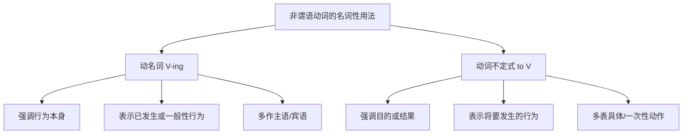
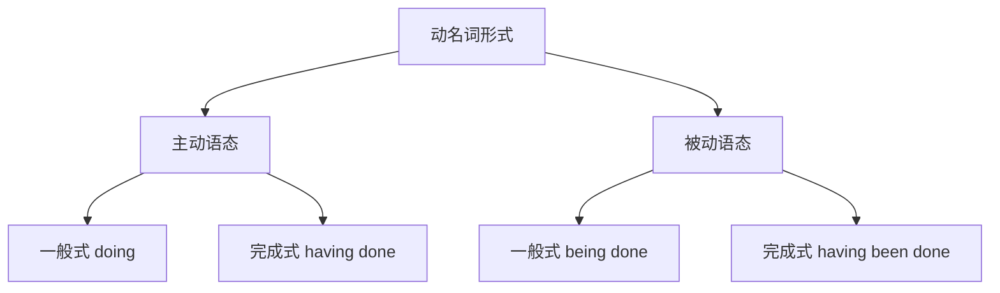
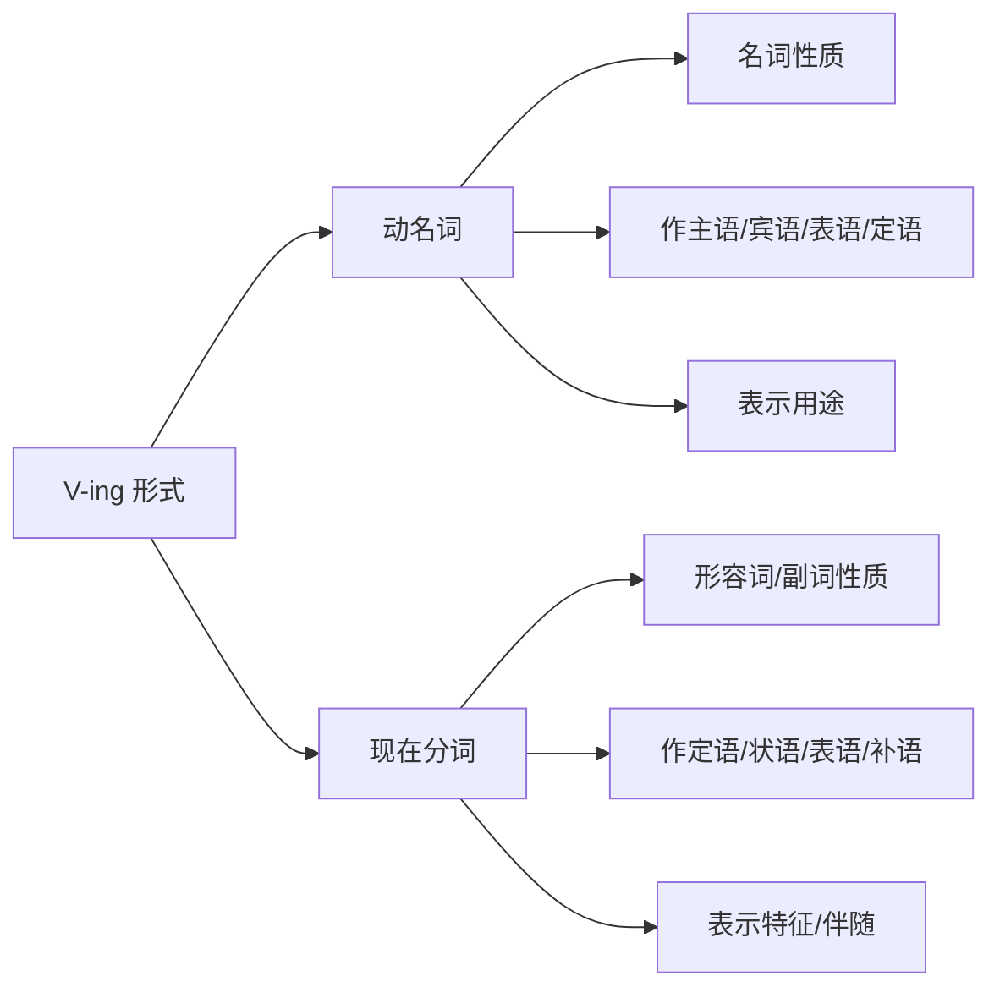
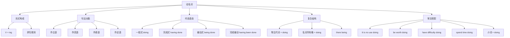

# 动名词详解

## 1. 动名词概述

### 1.1 什么是动名词

**动名词（Gerund）** 是由动词加 **-ing** 后缀构成的一种非谓语动词形式，它在句中具有名词的语法功能，同时保留了动词的某些特性。动名词可以看作是"动词的名词化"，它把一个动作或状态转化为一个可以在句中充当主语、宾语、表语或定语的名词性成分。

> [!info] 动名词的双重性质
>
> 动名词兼具**名词性**和**动词性**两种特征：
> - **名词性**：可以作主语、宾语、表语、定语，可以被形容词修饰
> - **动词性**：可以带宾语、状语，有时态和语态变化

**动名词的基本形式**：

| 动词原形 | 动名词形式 | 中文含义 |
| --- | --- | --- |
| read | reading | 阅读（这件事） |
| swim | swimming | 游泳（这项活动） |
| travel | traveling | 旅行（这种行为） |
| learn | learning | 学习（这个过程） |

### 1.2 动名词与动词不定式的区别

动名词和动词不定式都是非谓语动词，都可以在句中充当名词性成分，但它们在用法和含义上存在重要区别。

> [!example] 对比示例
>
> **动名词**（强调行为本身、习惯性）：
> - **Swimming** is good for health.
> - 游泳对健康有益。（泛指游泳这项运动）
>
> **不定式**（强调具体目的、将来性）：
> - **To swim** across the river is his goal.
> - 游过这条河是他的目标。（具体的一次性目标）

### 1.3 动名词的构成规则

动名词的构成规则与现在分词完全相同，都是在动词原形后加 **-ing**。

| 规则类型 | 变化规则 | 动词原形 | 动名词形式 |
| --- | --- | --- | --- |
| 一般规则 | 直接加 -ing | work, play, read | working, playing, reading |
| 以不发音 e 结尾 | 去 e 加 -ing | make, write, come | making, writing, coming |
| 以 ie 结尾 | 变 ie 为 y 加 -ing | lie, die, tie | lying, dying, tying |
| 以 ee 结尾 | 直接加 -ing | see, agree, flee | seeing, agreeing, fleeing |
| 重读闭音节结尾 | 双写末尾辅音字母加 -ing | run, sit, begin | running, sitting, beginning |
| 以 c 结尾 | 加 k 再加 -ing | panic, picnic | panicking, picnicking |

> [!warning] 拼写注意事项
>
> 1. **travel** 在英式英语中双写 l（travelling），美式英语中不双写（traveling）
> 2. **focus** 变为 focusing（不双写 s）
> 3. **open** 变为 opening（重音不在末尾音节，不双写）

---

## 2. 动名词的句法功能

动名词在句中可以充当多种成分，其核心功能是将动作概念化为名词性成分。

### 2.1 动名词作主语

动名词作主语时，表示一种行为、活动或状态，谓语动词用**单数形式**。

#### 2.1.1 动名词直接作主语

动名词可以直接放在句首作主语，这种用法强调行为本身的性质或特点。

> [!example] 动名词作主语示例
>
> 1. **Reading** broadens one's horizons.
>    - 阅读开阔人的视野。
>    - （reading 作主语，谓语 broadens 用单数）
>
> 2. **Swimming** in the sea is very exciting.
>    - 在海里游泳非常刺激。
>    - （swimming 带状语 in the sea，整体作主语）
>
> 3. **Learning a foreign language** requires patience.
>    - 学习一门外语需要耐心。
>    - （learning 带宾语 a foreign language，整体作主语）
>
> 4. **Getting up early** is a good habit.
>    - 早起是个好习惯。
>    - （getting up 带状语 early，整体作主语）

#### 2.1.2 形式主语 it + 动名词

当动名词短语较长时，可以用形式主语 **it** 置于句首，将真正的动名词主语后置，使句子结构更加平衡。

> [!tip] it 作形式主语的常见句型
>
> - It is **no use / no good** + doing...（做...没有用/没有好处）
> - It is **a waste of time** + doing...（做...是浪费时间）
> - It is **worth / worthwhile** + doing...（做...是值得的）
> - It is **fun / enjoyable** + doing...（做...很有趣）

**示例分析**：

| 句子 | 分析 |
| --- | --- |
| **It is no use crying** over spilt milk. | it 形式主语，crying over spilt milk 真正主语，意为"覆水难收" |
| **It is no good complaining** about the weather. | 抱怨天气没有好处 |
| **It is a waste of time arguing** with him. | 和他争论是浪费时间 |
| **It is worth reading** this book twice. | 这本书值得读两遍 |
| **It is fun playing** basketball with friends. | 和朋友打篮球很有趣 |

> [!warning] 注意区分
>
> 不是所有"It is + 形容词"结构都能接动名词。以下结构通常接不定式：
> - It is **easy/difficult/hard** + **to do**（不用 doing）
> - It is **important/necessary** + **to do**（不用 doing）
> - It is **possible/impossible** + **to do**（不用 doing）
>
> **对比**：
> - ✅ It is easy **to learn** English.（学英语很容易）
> - ❌ It is easy learning English.（不正确）
> - ✅ It is no use **learning** without practice.（没有实践的学习没有用）

#### 2.1.3 动名词的复合结构作主语

动名词可以有自己的逻辑主语，构成**动名词的复合结构**，即"名词所有格/形容词性物主代词 + 动名词"。

> [!info] 动名词复合结构的形式
>
> - **形容词性物主代词 + 动名词**：my/your/his/her/its/our/their + doing
> - **名词所有格 + 动名词**：Tom's/the boy's + doing
> - **宾格/普通格 + 动名词**（口语或非正式场合）：me/him/Tom + doing

**示例**：

> [!example] 动名词复合结构作主语
>
> 1. **His coming late** made everyone angry.
>    - 他的迟到让大家都很生气。
>    - （his 是动名词 coming 的逻辑主语）
>
> 2. **My mother's worrying** about me is understandable.
>    - 我母亲担心我是可以理解的。
>    - （my mother's 是动名词 worrying 的逻辑主语）
>
> 3. **Your being here** means a lot to me.
>    - 你在这里对我意义重大。
>    - （your 是动名词 being 的逻辑主语）

### 2.2 动名词作宾语

动名词作宾语是其最常见的用法之一，分为作动词宾语和作介词宾语两种情况。

#### 2.2.1 动名词作动词宾语

某些动词后面只能接动名词作宾语，不能接不定式。

> [!tip] 只能接动名词的常见动词（重要）
>
> 可以用以下口诀记忆：
>
> **"避免错过享受练习"**
> - avoid（避免）、miss（错过）、enjoy（享受）、practice（练习）
>
> **"完成考虑建议冒险"**
> - finish（完成）、consider（考虑）、suggest（建议）、risk（冒险）
>
> **"承认否认介意放弃"**
> - admit（承认）、deny（否认）、mind（介意）、give up（放弃）
>
> **"延迟逃避想象推迟"**
> - delay（延迟）、escape（逃避）、imagine（想象）、postpone/put off（推迟）

**详细动词列表**：

| 动词 | 含义 | 例句 |
| --- | --- | --- |
| enjoy | 享受 | I enjoy **reading** novels. |
| finish | 完成 | Have you finished **writing** the report? |
| avoid | 避免 | Try to avoid **making** the same mistake. |
| mind | 介意 | Would you mind **opening** the window? |
| suggest | 建议 | He suggested **going** to the park. |
| practice | 练习 | She practices **playing** the piano every day. |
| consider | 考虑 | We are considering **buying** a new car. |
| admit | 承认 | He admitted **stealing** the money. |
| deny | 否认 | She denied **knowing** anything about it. |
| risk | 冒险 | Don't risk **losing** your job. |
| imagine | 想象 | Can you imagine **living** on Mars? |
| keep | 保持 | Keep **trying** and you will succeed. |
| give up | 放弃 | He gave up **smoking** last year. |
| put off | 推迟 | They put off **holding** the meeting. |
| can't help | 忍不住 | I couldn't help **laughing**. |
| feel like | 想要 | I don't feel like **eating** anything. |
| be worth | 值得 | The movie is worth **watching**. |

> [!example] 动名词作动词宾语示例
>
> 1. She **enjoys listening** to classical music.
>    - 她喜欢听古典音乐。
>
> 2. Have you **finished reading** that novel?
>    - 你读完那本小说了吗？
>
> 3. I **can't help admiring** his courage.
>    - 我忍不住佩服他的勇气。
>
> 4. He **keeps asking** me the same question.
>    - 他不停地问我同一个问题。
>
> 5. Would you **mind turning** down the music?
>    - 你介意把音乐关小一点吗？

#### 2.2.2 既可接动名词也可接不定式的动词

有些动词既可以接动名词也可以接不定式作宾语，但意义可能相同，也可能不同。

**意义相同或相近的动词**：

| 动词 | 接动名词 | 接不定式 | 意义差别 |
| --- | --- | --- | --- |
| begin | begin doing | begin to do | 基本相同 |
| start | start doing | start to do | 基本相同 |
| continue | continue doing | continue to do | 基本相同 |
| like | like doing | like to do | doing 强调习惯；to do 强调具体情况 |
| love | love doing | love to do | 同上 |
| hate | hate doing | hate to do | 同上 |
| prefer | prefer doing | prefer to do | 同上 |

**意义不同的动词（重要）**：

| 动词 | 接动名词 | 接不定式 | 意义差别 |
| --- | --- | --- | --- |
| remember | remember doing | remember to do | doing = 记得做过；to do = 记得要去做 |
| forget | forget doing | forget to do | doing = 忘记做过；to do = 忘记要去做 |
| regret | regret doing | regret to do | doing = 后悔做过；to do = 遗憾地（要做） |
| try | try doing | try to do | doing = 尝试（看效果）；to do = 努力（去做） |
| stop | stop doing | stop to do | doing = 停止正在做的；to do = 停下来去做 |
| mean | mean doing | mean to do | doing = 意味着；to do = 打算 |
| go on | go on doing | go on to do | doing = 继续做同一件事；to do = 接着做另一件事 |

> [!example] 意义不同的动词对比
>
> **remember**:
> - I remember **locking** the door.（我记得锁过门了——动作已完成）
> - Remember **to lock** the door.（记得要锁门——动作未完成）
>
> **forget**:
> - I forgot **meeting** him before.（我忘了以前见过他——动作已发生）
> - I forgot **to meet** him yesterday.（我昨天忘了去见他——动作未发生）
>
> **try**:
> - Try **pressing** this button.（试着按一下这个按钮——看看效果如何）
> - Try **to press** the button harder.（努力用力按按钮——强调努力尝试）
>
> **stop**:
> - He stopped **talking**.（他停止说话——不说了）
> - He stopped **to talk** to me.（他停下来和我说话——停下手中的事）
>
> **mean**:
> - Success means **working** hard.（成功意味着努力工作）
> - I didn't mean **to hurt** you.（我不是故意要伤害你）

#### 2.2.3 动名词作介词宾语

介词后面接动词时，必须用动名词形式，这是一条非常重要的语法规则。

> [!warning] 核心规则
>
> **介词 + 动名词**（介词后不能直接接动词原形或不定式）
> - ✅ be good **at swimming**
> - ❌ be good at swim / be good at to swim

**常见介词 + 动名词搭配**：

| 介词搭配 | 含义 | 例句 |
| --- | --- | --- |
| be good at doing | 擅长做 | She is good at **cooking**. |
| be interested in doing | 对...感兴趣 | He is interested in **learning** Chinese. |
| be used to doing | 习惯于做 | I am used to **getting** up early. |
| look forward to doing | 期待做 | We look forward to **seeing** you. |
| be afraid of doing | 害怕做 | She is afraid of **speaking** in public. |
| succeed in doing | 成功做 | He succeeded in **passing** the exam. |
| give up doing | 放弃做 | Don't give up **trying**. |
| insist on doing | 坚持做 | He insisted on **paying** the bill. |
| think of/about doing | 考虑做 | I'm thinking of **moving** to Beijing. |
| dream of doing | 梦想做 | She dreams of **becoming** a doctor. |
| apologize for doing | 为...道歉 | He apologized for **being** late. |
| thank sb for doing | 感谢某人做 | Thank you for **helping** me. |
| prevent/stop sb from doing | 阻止某人做 | Nothing can prevent him from **going**. |
| instead of doing | 代替做 | Instead of **complaining**, take action. |
| without doing | 没有做 | He left without **saying** goodbye. |
| before/after doing | 在做...之前/之后 | Wash your hands before **eating**. |
| by doing | 通过做 | You can improve by **practicing**. |
| on doing | 一...就... | On **hearing** the news, she cried. |

> [!example] 介词 + 动名词示例
>
> 1. He is keen **on collecting** stamps.
>    - 他热衷于集邮。
>
> 2. I apologized **for keeping** him waiting.
>    - 我为让他久等而道歉。
>
> 3. She succeeded **in convincing** her parents.
>    - 她成功说服了她的父母。
>
> 4. We look forward **to hearing** from you soon.
>    - 我们期待尽快收到你的回复。
>    - （注意：这里的 to 是介词，不是不定式符号）
>
> 5. **By working** hard, he achieved his goal.
>    - 通过努力工作，他实现了目标。

> [!warning] 特别注意：to 作介词的情况
>
> 以下短语中的 **to** 是介词，后面接动名词：
> - look forward **to doing**（期待做）
> - be used **to doing**（习惯于做）
> - be devoted **to doing**（致力于做）
> - be opposed **to doing**（反对做）
> - object **to doing**（反对做）
> - get down **to doing**（开始认真做）
> - pay attention **to doing**（注意做）
> - be committed **to doing**（致力于做）
>
> **对比**：
> - I **used to live** here.（我过去住在这里——used to 表示过去的习惯）
> - I **am used to living** here.（我习惯住在这里——be used to 表示习惯于）

### 2.3 动名词作表语

动名词作表语时，说明主语的内容或性质，通常主语也是表示行为或活动的词。

> [!info] 动名词作表语的特点
>
> 1. 主语通常是抽象名词，如 hobby, job, task, aim, goal 等
> 2. 动名词表语说明主语"是什么"或"内容是什么"
> 3. 主语和表语可以互换位置而意义不变

**示例**：

> [!example] 动名词作表语
>
> 1. My hobby is **collecting** stamps.
>    - 我的爱好是集邮。
>    - （可以说 Collecting stamps is my hobby.）
>
> 2. Her job is **teaching** English.
>    - 她的工作是教英语。
>
> 3. Seeing is **believing**.
>    - 眼见为实。
>    - （主语和表语都是动名词）
>
> 4. His favorite pastime is **fishing**.
>    - 他最喜欢的消遣是钓鱼。
>
> 5. The first step is **understanding** the problem.
>    - 第一步是理解问题。

> [!tip] 动名词作表语 vs 现在分词作表语
>
> - **动名词作表语**：说明主语"是什么"，主表可互换
>   - My job **is teaching**.（= Teaching is my job.）
>
> - **现在分词作表语**：说明主语"怎么样"，表示特征
>   - The story **is interesting**.（故事很有趣——不能说 Interesting is the story.）

### 2.4 动名词作定语

动名词作定语时，通常放在名词前面，说明被修饰名词的用途或目的。

> [!info] 动名词作定语的特点
>
> 1. 位于被修饰名词之前
> 2. 说明名词的**用途、目的或功能**
> 3. 回答"什么样的"或"做什么用的"问题

**常见动名词 + 名词的搭配**：

| 动名词 + 名词 | 含义 | 分析 |
| --- | --- | --- |
| a **swimming** pool | 游泳池 | 用于游泳的池子 |
| a **reading** room | 阅览室 | 用于阅读的房间 |
| a **sleeping** bag | 睡袋 | 用于睡觉的袋子 |
| a **dining** room | 餐厅 | 用于就餐的房间 |
| a **washing** machine | 洗衣机 | 用于洗衣的机器 |
| a **driving** license | 驾驶执照 | 用于驾驶的执照 |
| **drinking** water | 饮用水 | 用于饮用的水 |
| a **walking** stick | 拐杖 | 用于行走的棍子 |
| a **parking** lot | 停车场 | 用于停车的场地 |
| a **writing** desk | 写字台 | 用于写字的桌子 |

> [!example] 动名词作定语示例
>
> 1. There is a **swimming pool** in our school.
>    - 我们学校有一个游泳池。
>
> 2. Please go to the **waiting room**.
>    - 请去候车室。
>
> 3. He bought a new **fishing rod**.
>    - 他买了一根新钓鱼竿。
>
> 4. The **living room** is very spacious.
>    - 客厅非常宽敞。

> [!warning] 动名词作定语 vs 现在分词作定语
>
> **动名词作定语**：说明用途，与被修饰词是"用于...的"关系
> - a **sleeping** bag（用于睡觉的袋子）
> - a **swimming** pool（用于游泳的池子）
>
> **现在分词作定语**：说明状态，与被修饰词是主动关系
> - a **sleeping** baby（正在睡觉的婴儿）
> - a **swimming** fish（正在游泳的鱼）
>
> **区分方法**：
> - 动名词可以替换为 "for + V-ing"：a bag **for sleeping**
> - 现在分词可以替换为定语从句：a baby **who is sleeping**

---

## 3. 动名词的时态与语态

动名词虽然不能表示具体的时间，但它有自己的时态和语态形式，用以表示与谓语动词的时间关系以及与逻辑主语的主被动关系。

### 3.1 动名词的形式变化

| 语态 | 一般式 | 完成式 |
| --- | --- | --- |
| 主动 | doing | having done |
| 被动 | being done | having been done |

### 3.2 动名词的一般式

动名词的一般式表示的动作与谓语动词的动作**同时发生**或**没有明确的先后关系**，或表示**一般性、习惯性的动作**。

> [!example] 动名词一般式示例
>
> 1. He enjoys **reading** novels.
>    - 他喜欢读小说。
>    - （reading 表示习惯性行为，与 enjoys 同时）
>
> 2. I remember **seeing** him somewhere.
>    - 我记得在某处见过他。
>    - （seeing 发生在 remember 之前，但用一般式）
>
> 3. She is good at **playing** the piano.
>    - 她擅长弹钢琴。
>    - （playing 表示一般性能力）
>
> 4. **Swimming** is a good exercise.
>    - 游泳是一项好运动。
>    - （swimming 表示一般性活动）

> [!tip] 一般式的使用场景
>
> 1. 表示**习惯性、经常性**的动作
> 2. 表示与谓语动词**同时发生**的动作
> 3. 在某些动词后（如 remember, forget, regret），虽然动作发生在前，也用一般式

### 3.3 动名词的完成式

动名词的完成式（having done）表示动名词的动作发生在谓语动词的动作**之前**，强调动作的完成性或先后关系。

> [!example] 动名词完成式示例
>
> 1. He admitted **having stolen** the money.
>    - 他承认偷了那笔钱。
>    - （偷钱发生在承认之前）
>
> 2. I regret **having said** those words.
>    - 我后悔说了那些话。
>    - （说话发生在后悔之前）
>
> 3. She denied **having met** him before.
>    - 她否认以前见过他。
>    - （见面发生在否认之前）
>
> 4. He was praised for **having finished** the work ahead of time.
>    - 他因为提前完成工作而受到表扬。
>    - （完成工作发生在受表扬之前）
>
> 5. I apologized for **having kept** her waiting.
>    - 我为让她久等而道歉。
>    - （让她等待发生在道歉之前）

> [!info] 完成式与一般式的选择
>
> 在很多情况下，即使动名词的动作发生在谓语之前，也可以用一般式，尤其是：
> - 动作的先后关系从句意中已经清楚
> - 使用 remember, forget, regret 等动词时
>
> **对比**：
> - He admitted **stealing** the money.（较口语化）
> - He admitted **having stolen** the money.（较正式，强调先后）

### 3.4 动名词的被动式

当动名词的逻辑主语是动作的**承受者**时，使用动名词的被动式。

#### 3.4.1 一般被动式（being done）

表示动名词的动作与谓语动词同时发生或没有明确先后关系，且动名词的逻辑主语是动作的承受者。

> [!example] 动名词一般被动式示例
>
> 1. He doesn't like **being laughed at**.
>    - 他不喜欢被嘲笑。
>    - （他是 laugh at 的承受者）
>
> 2. She enjoys **being praised** by her teacher.
>    - 她喜欢被老师表扬。
>
> 3. The problem needs **being discussed** further.
>    - 这个问题需要进一步讨论。
>    - （= The problem needs discussing. = The problem needs to be discussed.）
>
> 4. I remember **being taken** to the zoo as a child.
>    - 我记得小时候被带去动物园。
>
> 5. He insisted on **being given** a chance.
>    - 他坚持要被给予一个机会。

#### 3.4.2 完成被动式（having been done）

表示动名词的动作发生在谓语动词之前，且动名词的逻辑主语是动作的承受者。

> [!example] 动名词完成被动式示例
>
> 1. He denied **having been told** about it.
>    - 他否认被告知过此事。
>    - （被告知发生在否认之前）
>
> 2. She complained of **having been treated** unfairly.
>    - 她抱怨受到了不公平对待。
>
> 3. The building shows signs of **having been renovated**.
>    - 这座建筑有翻新过的痕迹。
>
> 4. He was proud of **having been selected** for the team.
>    - 他为被选入队伍而自豪。

### 3.5 动名词时态语态总结表

| 形式 | 结构 | 例句 | 说明 |
| --- | --- | --- | --- |
| 一般主动 | doing | enjoy reading | 动作同时或习惯性 |
| 完成主动 | having done | admit having stolen | 动作在前，强调完成 |
| 一般被动 | being done | enjoy being praised | 逻辑主语是承受者，同时发生 |
| 完成被动 | having been done | deny having been told | 逻辑主语是承受者，动作在前 |

---

## 4. 动名词与现在分词的区别

动名词和现在分词在形式上完全相同（都是 V-ing），但它们的语法功能和语义性质有本质区别。

### 4.1 本质区别

| 比较项 | 动名词 | 现在分词 |
| --- | --- | --- |
| 性质 | 名词性 | 形容词性/副词性 |
| 主要功能 | 作主语、宾语、表语、定语 | 作定语、状语、表语、补语 |
| 作定语时 | 表示用途、目的 | 表示特征、状态、正在进行 |
| 作表语时 | 说明主语是什么 | 说明主语怎么样 |
| 可否被形容词修饰 | 可以 | 一般不可以 |
| 可否被副词修饰 | 一般不可以 | 可以 |

### 4.2 作定语时的区别

> [!example] 动名词与现在分词作定语对比
>
> **动名词作定语**（表用途）：
> - a **sleeping** bag = a bag **for sleeping**（睡袋——用于睡觉的袋子）
> - a **swimming** pool = a pool **for swimming**（游泳池——用于游泳的池子）
> - a **reading** room = a room **for reading**（阅览室——用于阅读的房间）
>
> **现在分词作定语**（表状态/正在进行）：
> - a **sleeping** baby = a baby **who is sleeping**（正在睡觉的婴儿）
> - a **swimming** fish = a fish **that is swimming**（正在游泳的鱼）
> - the **reading** boy = the boy **who is reading**（正在阅读的男孩）

**区分技巧**：

| 判断方法 | 动名词 | 现在分词 |
| --- | --- | --- |
| 替换测试 | 可替换为 "for + V-ing" | 可替换为定语从句 "who/which is V-ing" |
| 与被修饰词关系 | 用途关系 | 主动关系/进行关系 |
| 例子 | a cooking pot（煮东西的锅） | a boiling pot（正在沸腾的锅） |

### 4.3 作表语时的区别

> [!example] 动名词与现在分词作表语对比
>
> **动名词作表语**（主表可互换）：
> - His hobby **is collecting** stamps. = **Collecting stamps** is his hobby.
>   （他的爱好是集邮。）
> - Her job **is teaching** English. = **Teaching English** is her job.
>   （她的工作是教英语。）
>
> **现在分词作表语**（主表不可互换）：
> - The story **is interesting**. ≠ ~~Interesting is the story.~~
>   （故事很有趣。）
> - The news **is exciting**. ≠ ~~Exciting is the news.~~
>   （消息令人兴奋。）

### 4.4 在复合宾语中的区别

> [!info] 复合宾语中的 V-ing
>
> 在"动词 + 宾语 + V-ing"结构中，V-ing 是现在分词，作宾语补足语，不是动名词。

**示例**：

| 句子 | 分析 |
| --- | --- |
| I saw him **crossing** the street. | crossing 是现在分词，作宾补，表示"正在过马路" |
| I heard her **singing** in the room. | singing 是现在分词，作宾补，表示"正在唱歌" |
| We found him **lying** on the ground. | lying 是现在分词，作宾补，表示"正躺着" |
| Keep the engine **running**. | running 是现在分词，作宾补，表示"保持运转状态" |

### 4.5 区分练习

判断下列句中的 V-ing 是动名词还是现在分词：

| 句子 | 答案 | 分析 |
| --- | --- | --- |
| Swimming is good for health. | 动名词（作主语） | 表示游泳这项活动 |
| The swimming fish is beautiful. | 现在分词（作定语） | 表示正在游泳的鱼 |
| There is a swimming pool here. | 动名词（作定语） | 表示用于游泳的池子 |
| I enjoy swimming. | 动名词（作宾语） | 作 enjoy 的宾语 |
| I saw a boy swimming in the river. | 现在分词（作宾补） | 表示看到男孩正在游泳 |
| His job is teaching. | 动名词（作表语） | 说明工作的内容是什么 |
| The movie is exciting. | 现在分词（作表语） | 说明电影的特征是令人兴奋的 |

---

## 5. 动名词的复合结构

动名词可以有自己的逻辑主语，构成动名词的复合结构。

### 5.1 复合结构的形式

动名词的复合结构由"逻辑主语 + 动名词"构成，逻辑主语可以是：

| 逻辑主语形式 | 使用场合 | 示例 |
| --- | --- | --- |
| 形容词性物主代词 | 正式场合，尤其作主语时 | **my** doing, **his** coming |
| 名词所有格 | 正式场合 | **Tom's** leaving, **the boy's** crying |
| 人称代词宾格 | 口语/非正式场合，尤其作宾语时 | **me** doing, **him** coming |
| 名词普通格 | 口语/非正式场合 | **Tom** leaving, **the boy** crying |

### 5.2 复合结构的用法

#### 5.2.1 作主语

> [!example] 动名词复合结构作主语
>
> 1. **His coming late** surprised everyone.
>    - 他来晚了让大家都很惊讶。
>    - （正式用法：his + coming）
>
> 2. **Your being here** is a great comfort to me.
>    - 你在这里对我是极大的安慰。
>
> 3. **Tom's failing the exam** was unexpected.
>    - 汤姆考试不及格是出乎意料的。
>
> 4. **The train being late** caused many problems.
>    - 火车晚点造成了很多问题。

#### 5.2.2 作宾语

> [!example] 动名词复合结构作宾语
>
> 1. I can't imagine **him/his doing** such a thing.
>    - 我无法想象他会做这样的事。
>    - （him 较口语，his 较正式）
>
> 2. Would you mind **my/me opening** the window?
>    - 你介意我开窗吗？
>
> 3. She insisted on **her son's studying** abroad.
>    - 她坚持让她儿子出国留学。
>
> 4. I don't like **people talking** loudly in the library.
>    - 我不喜欢人们在图书馆大声说话。
>
> 5. There is no hope of **their winning** the game.
>    - 他们没有赢得比赛的希望。

> [!tip] 选择物主代词还是宾格
>
> 1. **作主语时**：优先使用物主代词或名词所有格（较正式）
>    - ✅ **His being** absent was noticed.
>    - △ **Him being** absent was noticed.（不够正式）
>
> 2. **作宾语时**：物主代词和宾格都可以接受
>    - I remember **his saying** that.（正式）
>    - I remember **him saying** that.（口语）
>
> 3. **逻辑主语是无生命名词时**：通常用普通格
>    - ✅ the possibility of **the plan failing**
>    - △ the possibility of **the plan's failing**

### 5.3 there being 结构

**there being** 是动名词的一种特殊复合结构，there 是形式主语。

> [!example] there being 结构
>
> 1. **There being** no bus, we had to walk home.
>    - 由于没有公共汽车，我们不得不走路回家。
>    - （there being 作原因状语）
>
> 2. I never dreamed of **there being** such a beautiful place.
>    - 我从未想到会有这么美丽的地方。
>    - （there being 作介词宾语）
>
> 3. We were disappointed at **there being** no news from her.
>    - 没有她的消息让我们很失望。

---

## 6. 含有动名词的常见句型与搭配

### 6.1 常见动名词句型

#### 6.1.1 It is no use / no good doing

表示"做...没有用/没有好处"。

> [!example] It is no use / no good doing
>
> 1. **It is no use crying** over spilt milk.
>    - 覆水难收。（为打翻的牛奶哭泣没有用）
>
> 2. **It is no good complaining** without taking action.
>    - 光抱怨不行动没有好处。
>
> 3. **It's no use trying** to convince him.
>    - 试图说服他没有用。

#### 6.1.2 It is worth / worthwhile doing

表示"做...是值得的"。

> [!example] It is worth / worthwhile doing
>
> 1. The book **is worth reading**.
>    - 这本书值得一读。
>
> 2. **It is worthwhile visiting** the museum.
>    - 参观这个博物馆是值得的。
>
> 3. The problem **is worth discussing**.
>    - 这个问题值得讨论。

> [!info] worth 的用法特点
>
> 1. **worth** 后面接动名词，但动名词用**主动形式表示被动意义**
>    - The book is worth **reading**. = The book is worth **being read**.
>
> 2. **worth** 前可加 well 表示"很值得"
>    - The movie is **well worth watching**.

#### 6.1.3 have difficulty / trouble (in) doing

表示"做...有困难"，介词 in 通常可以省略。

> [!example] have difficulty / trouble doing
>
> 1. I **have difficulty (in) understanding** his accent.
>    - 我听懂他的口音有困难。
>
> 2. She **had trouble (in) finding** the place.
>    - 她找那个地方费了好大劲。
>
> 3. Do you **have any difficulty (in) finishing** the task?
>    - 你完成这项任务有困难吗？

**类似结构**：

| 句型 | 含义 | 例句 |
| --- | --- | --- |
| have difficulty (in) doing | 做...有困难 | have difficulty learning |
| have trouble (in) doing | 做...有麻烦 | have trouble sleeping |
| have fun (in) doing | 做...很有趣 | have fun playing |
| have a good time (in) doing | 做...玩得开心 | have a good time dancing |
| have a hard time (in) doing | 做...很艰难 | have a hard time adapting |

#### 6.1.4 spend / waste time (in) doing

表示"花费/浪费时间做..."。

> [!example] spend / waste time doing
>
> 1. He **spent two hours (in) reading** the report.
>    - 他花了两个小时读这份报告。
>
> 2. Don't **waste time (in) arguing** with him.
>    - 不要浪费时间和他争论。
>
> 3. She **spends most of her time (in) practicing** the piano.
>    - 她把大部分时间都花在练钢琴上。

#### 6.1.5 be busy (in) doing

表示"忙于做..."。

> [!example] be busy doing
>
> 1. She **is busy (in) preparing** for the exam.
>    - 她正忙于准备考试。
>
> 2. They **were busy (in) decorating** the room.
>    - 他们正忙着装饰房间。

#### 6.1.6 prevent / stop / keep sb from doing

表示"阻止某人做..."。

> [!example] prevent / stop / keep sb from doing
>
> 1. The rain **prevented us from going** out.
>    - 雨阻止了我们外出。
>
> 2. Nothing can **stop him from achieving** his goal.
>    - 没有什么能阻止他实现目标。
>
> 3. She tried to **keep herself from crying**.
>    - 她努力不让自己哭出来。

> [!tip] 区分类似结构
>
> - prevent / stop / keep sb **from** doing（阻止某人做）
> - protect sb **from** doing（保护某人免受）
> - prohibit / forbid sb **from** doing（禁止某人做）

#### 6.1.7 cannot help doing / cannot help but do

表示"忍不住做..."。

> [!example] cannot help doing
>
> 1. I **couldn't help laughing** when I heard the joke.
>    - 听到那个笑话我忍不住笑了。
>
> 2. She **couldn't help crying** when she heard the news.
>    - 听到那个消息她忍不住哭了。
>
> **cannot help but do** 也表示同样的意思：
> - I **couldn't help but laugh**.
> - 我忍不住笑了。

#### 6.1.8 feel like doing

表示"想要做..."。

> [!example] feel like doing
>
> 1. I **don't feel like eating** anything now.
>    - 我现在什么都不想吃。
>
> 2. Do you **feel like going** for a walk?
>    - 你想去散步吗？
>
> 3. I **felt like crying** after watching the movie.
>    - 看完电影后我想哭。

### 6.2 动名词与介词的固定搭配

| 搭配 | 含义 | 例句 |
| --- | --- | --- |
| be fond of doing | 喜欢做 | She is fond of reading. |
| be tired of doing | 厌倦做 | I'm tired of waiting. |
| be capable of doing | 有能力做 | He is capable of handling it. |
| be aware of doing | 意识到做 | Be aware of making mistakes. |
| be proud of doing | 为做...自豪 | I'm proud of helping them. |
| be ashamed of doing | 为做...感到羞耻 | He was ashamed of lying. |
| be accused of doing | 被指控做 | He was accused of stealing. |
| be responsible for doing | 负责做 | Who is responsible for organizing? |
| be used to doing | 习惯于做 | I'm used to getting up early. |
| be devoted to doing | 致力于做 | She is devoted to teaching. |
| be opposed to doing | 反对做 | I'm opposed to smoking here. |
| be committed to doing | 承诺做 | We are committed to improving. |
| succeed in doing | 成功做 | He succeeded in passing. |
| insist on doing | 坚持做 | She insisted on paying. |
| depend on doing | 依靠做 | Success depends on working hard. |
| result in doing | 导致做 | Laziness results in failing. |
| aim at doing | 旨在做 | The project aims at helping. |
| object to doing | 反对做 | I object to being treated this way. |

### 6.3 动名词惯用语

| 惯用语 | 含义 | 例句 |
| --- | --- | --- |
| go shopping | 去购物 | Let's go shopping. |
| go swimming | 去游泳 | They went swimming yesterday. |
| go fishing | 去钓鱼 | He often goes fishing on weekends. |
| go hiking | 去远足 | We plan to go hiking tomorrow. |
| go camping | 去露营 | They went camping in the mountains. |
| go skiing | 去滑雪 | She loves to go skiing in winter. |
| go sightseeing | 去观光 | We went sightseeing in Paris. |
| no smoking | 禁止吸烟 | No smoking in this area. |
| no parking | 禁止停车 | No parking here. |

---

## 7. 动名词与不定式的选择

### 7.1 只能用动名词的情况

某些动词、介词后或特定句型中只能用动名词，不能用不定式。

> [!warning] 只接动名词的常见动词
>
> enjoy, finish, avoid, mind, suggest, practice, consider, admit, deny, risk, imagine, keep, give up, put off, can't help, feel like, be worth 等。

### 7.2 只能用不定式的情况

某些动词后只能用不定式，不能用动名词。

> [!info] 只接不定式的常见动词
>
> want, wish, hope, decide, determine, refuse, manage, pretend, promise, agree, plan, expect, afford, fail, learn, offer, attempt, choose, tend 等。

### 7.3 意义不同时的选择

| 动词 | + doing | + to do |
| --- | --- | --- |
| remember | 记得做过（已做） | 记得要做（未做） |
| forget | 忘记做过（已做） | 忘记要做（未做） |
| regret | 后悔做过（已做） | 遗憾地要做（未做） |
| try | 尝试做（看效果） | 努力做（尽力） |
| stop | 停止做（不再做） | 停下来去做（换事做） |
| mean | 意味着 | 打算 |
| go on | 继续做同一事 | 继续做另一事 |

### 7.4 意义相同时的选择

| 动词 | 说明 | 例句 |
| --- | --- | --- |
| begin/start | 两者皆可，意义基本相同 | begin doing = begin to do |
| continue | 两者皆可，意义基本相同 | continue doing = continue to do |
| like/love/hate | doing 强调习惯；to do 强调具体 | like swimming（爱好）vs like to swim now（现在想） |
| prefer | doing 强调一般；to do 强调具体 | prefer walking（一般更喜欢）vs prefer to walk today（今天想） |

> [!tip] 选择技巧总结
>
> 1. **介词后**：必须用动名词
> 2. **enjoy, finish, avoid** 等后：只能用动名词
> 3. **want, decide, hope** 等后：只能用不定式
> 4. **remember, forget, stop** 等后：根据意义选择
> 5. **begin, start** 等后：两者皆可

---

## 8. 动名词练习与应用

### 8.1 填空练习

用所给动词的适当形式填空：

1. She enjoys _______ (listen) to classical music.
2. Would you mind _______ (turn) down the TV?
3. I look forward to _______ (see) you again.
4. He admitted _______ (steal) the money.
5. The book is worth _______ (read).
6. I can't help _______ (laugh) at his jokes.
7. She spent two hours _______ (do) her homework.
8. They succeeded in _______ (climb) the mountain.
9. I remember _______ (meet) him before. (我记得以前见过他)
10. Don't forget _______ (lock) the door. (别忘了锁门)

**答案**：
1. listening  2. turning  3. seeing  4. having stolen / stealing
5. reading  6. laughing  7. doing  8. climbing
9. meeting  10. to lock

### 8.2 改错练习

找出并改正句中的错误：

1. ❌ I enjoy to read novels.
   ✅ I enjoy **reading** novels.

2. ❌ She is used to get up early.
   ✅ She is used to **getting** up early.

3. ❌ He insisted on to pay the bill.
   ✅ He insisted on **paying** the bill.

4. ❌ It is no use to cry over spilt milk.
   ✅ It is no use **crying** over spilt milk.

5. ❌ I look forward to hear from you.
   ✅ I look forward to **hearing** from you.

### 8.3 翻译练习

将下列句子翻译成英语：

1. 学习英语需要耐心和毅力。
   → **Learning English requires patience and perseverance.**

2. 你介意我在这儿抽烟吗？
   → **Would you mind my/me smoking here?**

3. 我忍不住对这个消息感到兴奋。
   → **I couldn't help feeling excited about the news.**

4. 他承认撒了谎。
   → **He admitted having lied. / He admitted lying.**

5. 这本书值得再读一遍。
   → **This book is worth reading again.**

---

## 9. 本章小结

> [!success] 核心要点回顾
>
> 1. **动名词的本质**：动词的名词化形式，具有名词和动词的双重特性
>
> 2. **四大句法功能**：
>    - 作主语：Swimming is good for health.
>    - 作宾语：I enjoy reading.
>    - 作表语：My hobby is collecting stamps.
>    - 作定语：a swimming pool（表用途）
>
> 3. **时态语态**：一般式 doing，完成式 having done，被动式 being done
>
> 4. **与现在分词区别**：
>    - 动名词表用途（a sleeping bag = bag for sleeping）
>    - 现在分词表状态（a sleeping baby = baby who is sleeping）
>
> 5. **介词后必须用动名词**：look forward to doing, be used to doing
>
> 6. **意义不同的动词**：remember/forget/stop/try + doing vs + to do

---

## 10. 延伸阅读

- [[01.动词不定式详解]]：了解另一种重要的非谓语动词形式
- [[03.现在分词详解]]：深入学习现在分词的用法
- [[04.过去分词详解]]：掌握过去分词的特点和应用
- [[05.非谓语动词综合辨析]]：系统比较三种非谓语动词的异同
