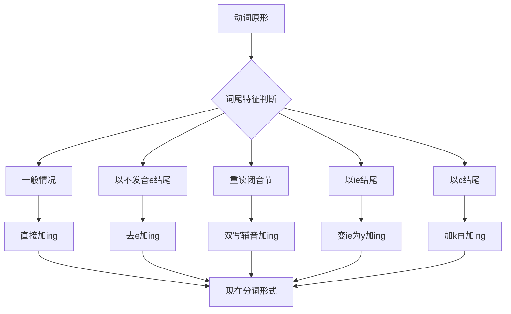
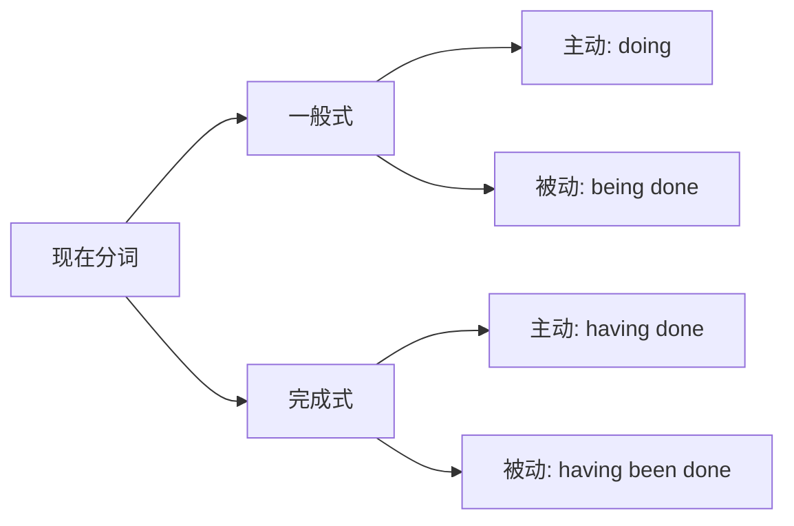
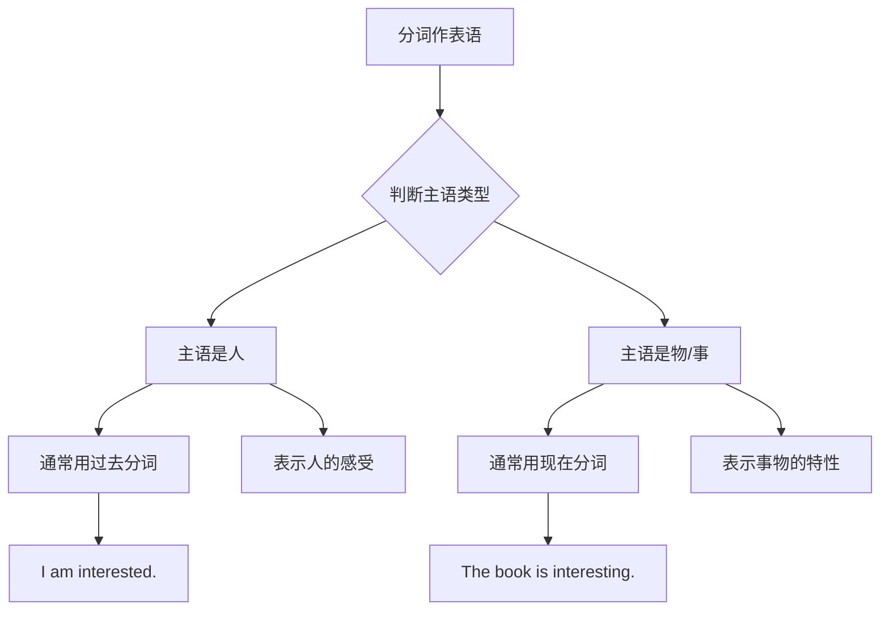
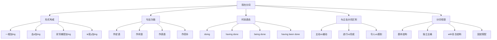

# 现在分词详解

现在分词（Present Participle）是英语非谓语动词的重要组成部分，它以 **-ing** 形式出现，兼具动词和形容词的双重特性。掌握现在分词的用法，对于丰富句式表达、提升写作水平至关重要。

---

## 1. 现在分词的形式与构成

### 1.1 基本构成规则

现在分词的构成方式是在动词原形后加 **-ing**，但根据动词词尾的不同，存在若干变化规则。

> [!info] 核心规则
>
> 现在分词 = 动词原形 + ing
>
> 这是最基本的构成方式，但实际应用中需要注意词尾的特殊变化。

**规则一：一般情况直接加 -ing**

大多数动词直接在词尾加 -ing 即可：

| 动词原形 | 现在分词 | 中文含义 |
| --- | --- | --- |
| work | working | 工作 |
| play | playing | 玩耍 |
| study | studying | 学习 |
| read | reading | 阅读 |
| eat | eating | 吃 |
| sleep | sleeping | 睡觉 |
| watch | watching | 观看 |
| listen | listening | 听 |

**规则二：以不发音的 e 结尾，去 e 加 -ing**

当动词以不发音的字母 e 结尾时，需要先去掉 e，再加 -ing：

| 动词原形 | 现在分词 | 中文含义 |
| --- | --- | --- |
| make | making | 制作 |
| write | writing | 写 |
| take | taking | 拿取 |
| come | coming | 来 |
| have | having | 有 |
| give | giving | 给予 |
| live | living | 生活 |
| move | moving | 移动 |

> [!warning] 特殊例外
>
> 以 **-ee**、**-ye**、**-oe** 结尾的动词，直接加 -ing，不去 e：
>
> - see → seeing（看见）
> - agree → agreeing（同意）
> - dye → dyeing（染色）
> - hoe → hoeing（锄地）

**规则三：以重读闭音节结尾，双写末尾辅音字母加 -ing**

当动词以「辅音字母 + 元音字母 + 辅音字母」结尾，且该音节为重读音节时，需要双写末尾辅音字母：

| 动词原形 | 现在分词 | 音节分析 |
| --- | --- | --- |
| run | running | 重读闭音节 |
| sit | sitting | 重读闭音节 |
| cut | cutting | 重读闭音节 |
| swim | swimming | 重读闭音节 |
| begin | beginning | 重读在第二音节 |
| prefer | preferring | 重读在第二音节 |
| admit | admitting | 重读在第二音节 |
| regret | regretting | 重读在第二音节 |

> [!tip] 判断技巧
>
> 判断是否需要双写，关键看两点：
>
> 1. 词尾是否符合「辅-元-辅」结构
> 2. 该音节是否为重读音节
>
> 如果重读不在末尾音节，则不需要双写：
> - visit → visiting（重读在第一音节）
> - open → opening（重读在第一音节）
> - listen → listening（重读在第一音节）

**规则四：以 -ie 结尾，变 ie 为 y 加 -ing**

| 动词原形 | 现在分词 | 中文含义 |
| --- | --- | --- |
| die | dying | 死亡 |
| lie | lying | 躺；说谎 |
| tie | tying | 系；捆绑 |

**规则五：以 -c 结尾，加 k 再加 -ing**

| 动词原形 | 现在分词 | 中文含义 |
| --- | --- | --- |
| picnic | picnicking | 野餐 |
| traffic | trafficking | 交易 |
| panic | panicking | 恐慌 |

### 1.2 构成规则速查表

上图展示了现在分词构成的完整判断流程。首先观察动词词尾的特征，根据不同情况选择相应的变化规则。一般情况下直接加 -ing；以不发音 e 结尾需去 e；重读闭音节需双写末尾辅音；以 ie 结尾需变为 y；以 c 结尾需先加 k。

### 1.3 易错词汇总结

以下是一些容易拼写错误的现在分词形式：

| 动词原形 | 正确形式 | 错误形式 | 错误原因 |
| --- | --- | --- | --- |
| occur | occurring | ~~occuring~~ | 需要双写 r |
| travel | traveling/travelling | - | 美式单写，英式双写 |
| benefit | benefiting | ~~benefitting~~ | 重读不在末尾 |
| focus | focusing | ~~focussing~~ | 一般不双写 |
| cancel | canceling/cancelling | - | 美式单写，英式双写 |

> [!example] 英美拼写差异
>
> 在以 -l 结尾的动词上，英式英语和美式英语存在差异：
>
> | 动词 | 英式英语 | 美式英语 |
> | --- | --- | --- |
> | travel | travelling | traveling |
> | cancel | cancelling | canceling |
> | model | modelling | modeling |
> | label | labelling | labeling |

---

## 2. 现在分词的句法功能

现在分词在句中可以充当多种成分，包括定语、状语、表语和宾语补足语。理解这些功能是正确使用现在分词的关键。

### 2.1 现在分词作定语

现在分词作定语时，用来修饰名词或代词，表示该名词正在进行的动作或具有的特征。

#### 2.1.1 前置定语

单个现在分词作定语时，通常放在被修饰名词之前：

**例句分析：**

1. **The sleeping baby** looks so peaceful.
   - 睡着的婴儿看起来很安详。
   - sleeping 修饰 baby，表示婴儿正在睡觉的状态

2. **A running man** suddenly appeared at the corner.
   - 一个奔跑的男人突然出现在拐角处。
   - running 修饰 man，表示男人正在跑步的动作

3. **The rising sun** painted the sky orange.
   - 升起的太阳把天空染成了橙色。
   - rising 修饰 sun，表示太阳正在升起

4. **Boiling water** can cause severe burns.
   - 沸腾的水会造成严重烫伤。
   - boiling 修饰 water，表示水处于沸腾状态

> [!tip] 前置定语的语义特点
>
> 前置定语的现在分词通常表示：
>
> 1. **正在进行的动作**：a crying child（正在哭的孩子）
> 2. **经常性的特征**：a working mother（职业母亲）
> 3. **事物的用途**：a reading lamp（阅读灯）
> 4. **事物的状态**：running water（流水）

#### 2.1.2 后置定语

当现在分词带有自己的宾语、状语等附加成分，形成分词短语时，必须放在被修饰词之后：

**例句分析：**

1. The man **standing at the door** is my father.
   - 站在门口的那个人是我父亲。
   - 分词短语 standing at the door 作后置定语修饰 the man
   - 句法分析：主语（The man）+ 后置定语（standing at the door）+ 系动词（is）+ 表语（my father）

2. Do you know the girl **talking to the teacher**?
   - 你认识那个正在和老师说话的女孩吗？
   - 分词短语 talking to the teacher 作后置定语修饰 the girl

3. The bridge **being built over the river** will be completed next year.
   - 正在河上建造的那座桥将于明年完工。
   - 分词短语 being built over the river 作后置定语，表示被动进行

4. I noticed a truck **carrying vegetables** on the highway.
   - 我注意到高速公路上有一辆运送蔬菜的卡车。
   - 分词短语 carrying vegetables 作后置定语修饰 a truck

> [!warning] 位置不可随意调换
>
> 分词短语作定语必须紧跟被修饰词，否则会产生歧义或语法错误：
>
> - ✅ The boy sitting in the corner is Tom.（坐在角落里的男孩是汤姆）
> - ❌ The boy is Tom sitting in the corner.（语义混乱）

#### 2.1.3 定语从句的简化

现在分词短语作后置定语，实际上是定语从句的简化形式：

| 定语从句 | 现在分词短语 |
| --- | --- |
| The man **who is standing** at the door | The man **standing** at the door |
| The girl **who is talking** to the teacher | The girl **talking** to the teacher |
| The students **who are studying** in the library | The students **studying** in the library |

> [!info] 简化条件
>
> 定语从句简化为现在分词短语需满足：
>
> 1. 从句中的动词为主动语态
> 2. 从句中的动词表示进行中的动作或状态
> 3. 关系代词在从句中作主语

### 2.2 现在分词作状语

现在分词作状语是其最重要的功能之一，可以表示时间、原因、结果、条件、让步、方式或伴随等多种语义关系。

#### 2.2.1 表示时间

**例句分析：**

1. **Hearing the news**, she burst into tears.
   - 听到这个消息后，她放声大哭。
   - hearing 表示时间，相当于 When she heard the news

2. **Walking along the street**, I met an old friend.
   - 沿着街道走的时候，我遇到了一位老朋友。
   - walking 表示时间，相当于 While I was walking along the street

3. **Having finished the homework**, the children went out to play.
   - 做完作业后，孩子们出去玩了。
   - having finished 表示先于主句动作完成的时间

> [!tip] 时间状语的时态选择
>
> - **一般式（doing）**：与主句动作同时发生或紧接着发生
> - **完成式（having done）**：先于主句动作发生

#### 2.2.2 表示原因

**例句分析：**

1. **Being tired**, I went to bed early.
   - 因为累了，我很早就睡了。
   - being tired 表示原因，相当于 Because I was tired

2. **Not knowing her address**, I couldn't visit her.
   - 因为不知道她的地址，我没法去看她。
   - not knowing 表示原因，相当于 Because I didn't know

3. **Living far from school**, he has to get up early every day.
   - 因为住得离学校很远，他每天必须早起。
   - living 表示原因，说明早起的理由

#### 2.2.3 表示结果

**例句分析：**

1. The fire lasted a whole night, **destroying all the buildings**.
   - 大火持续了整整一夜，烧毁了所有建筑物。
   - destroying 表示结果，是火灾造成的后果

2. He fell off the ladder, **breaking his leg**.
   - 他从梯子上摔下来，摔断了腿。
   - breaking 表示结果，是摔落的后果

3. The earthquake struck the city, **killing thousands of people**.
   - 地震袭击了这座城市，造成数千人死亡。
   - killing 表示结果，说明地震的影响

> [!warning] 结果状语的位置
>
> 表示结果的现在分词短语通常放在句末，且结果往往是自然的、顺理成章的。如果表示出乎意料的结果，应使用 only to do 结构：
>
> - He hurried to the station, **only to find** the train had left.
> - （他匆忙赶到车站，结果发现火车已经开走了——出乎意料的结果）

#### 2.2.4 表示条件

**例句分析：**

1. **Working hard**, you will succeed.
   - 如果你努力工作，就会成功。
   - working hard 表示条件，相当于 If you work hard

2. **Turning to the left**, you will find the post office.
   - 如果向左转，你就会找到邮局。
   - turning 表示条件，相当于 If you turn to the left

3. **Using this method**, you can solve the problem easily.
   - 如果使用这个方法，你可以轻松解决这个问题。
   - using 表示条件，说明解决问题的前提

#### 2.2.5 表示让步

**例句分析：**

1. **Knowing all this**, they still insisted on going.
   - 尽管知道这一切，他们仍坚持要去。
   - knowing 表示让步，相当于 Although they knew all this

2. **Living in the city for years**, he still misses his hometown.
   - 尽管在城市生活多年，他仍然思念家乡。
   - living 表示让步，与"思念家乡"形成转折

#### 2.2.6 表示方式或伴随

表示方式或伴随的现在分词短语描述主语在做主句动作时的附加动作或状态：

**例句分析：**

1. He sat there, **reading a newspaper**.
   - 他坐在那里看报纸。
   - reading 表示伴随动作，与 sat 同时进行

2. She came in, **carrying a basket of flowers**.
   - 她走进来，手里提着一篮子花。
   - carrying 表示伴随状态

3. The children ran out of the classroom, **laughing and shouting**.
   - 孩子们跑出教室，又笑又叫。
   - laughing and shouting 表示伴随动作

4. He walked down the street, **singing a song**.
   - 他沿着街道走，一边唱着歌。
   - singing 表示方式，说明走路时的状态

> [!example] 伴随状语 vs 并列谓语
>
> 伴随状语和并列谓语的区别：
>
> | 结构 | 例句 | 特点 |
> | --- | --- | --- |
> | 伴随状语 | He sat there, reading. | 分词描述次要动作 |
> | 并列谓语 | He sat there and read. | 两个动作并列重要 |
>
> 伴随状语强调主句动作为主，分词动作为辅；并列谓语则两个动作同等重要。

### 2.3 现在分词作表语

现在分词作表语时，位于系动词之后，说明主语的特征或状态。

**例句分析：**

1. The movie is **exciting**.
   - 这部电影令人兴奋。
   - exciting 作表语，说明电影具有使人兴奋的特性

2. The news was **surprising**.
   - 这个消息令人惊讶。
   - surprising 作表语，说明消息的性质

3. The situation is becoming **increasingly worrying**.
   - 形势变得越来越令人担忧。
   - worrying 作表语，说明形势的特点

4. His speech was very **moving**.
   - 他的演讲非常感人。
   - moving 作表语，说明演讲的效果

> [!info] 表语分词的语义特点
>
> 现在分词作表语时，通常表示主语具有某种「使人...」的特性：
>
> | 现在分词 | 含义 | 例句 |
> | --- | --- | --- |
> | interesting | 令人感兴趣的 | The book is interesting. |
> | boring | 令人厌烦的 | The lecture was boring. |
> | exciting | 令人兴奋的 | The game is exciting. |
> | tiring | 令人疲惫的 | The work is tiring. |
> | confusing | 令人困惑的 | The instructions are confusing. |

### 2.4 现在分词作宾语补足语

现在分词可以在某些动词后作宾语补足语，补充说明宾语的动作或状态。

#### 2.4.1 感官动词 + 宾语 + 现在分词

感官动词包括 see、hear、watch、notice、observe、feel 等：

**例句分析：**

1. I saw him **crossing** the street.
   - 我看见他正在过马路。
   - crossing 作宾语补足语，说明 him 正在进行的动作

2. We heard someone **singing** in the next room.
   - 我们听到有人在隔壁房间唱歌。
   - singing 作宾语补足语，说明 someone 正在做的事

3. I noticed a man **following** us.
   - 我注意到有个人在跟踪我们。
   - following 作宾语补足语，说明 a man 的动作

4. She felt her heart **beating** fast.
   - 她感到自己的心跳得很快。
   - beating 作宾语补足语，说明 heart 的状态

> [!warning] 现在分词 vs 不定式作宾补的区别
>
> | 结构 | 例句 | 含义 |
> | --- | --- | --- |
> | 感官动词 + 宾语 + doing | I saw him crossing the street. | 强调动作正在进行（看到过程的一部分） |
> | 感官动词 + 宾语 + do | I saw him cross the street. | 强调动作的完整过程（看到全过程） |
>
> - I saw him **crossing** the street.（我看见他正在过马路——看到了过程中的某个片段）
> - I saw him **cross** the street.（我看见他过了马路——看到了整个过程）

#### 2.4.2 使役动词 + 宾语 + 现在分词

使役动词如 have、get、keep、leave、set 等可接现在分词作宾补：

**例句分析：**

1. Don't keep me **waiting** too long.
   - 不要让我等太久。
   - waiting 作宾语补足语，说明 me 被置于的状态

2. I'm sorry to have kept you **waiting**.
   - 抱歉让你久等了。
   - waiting 作宾语补足语

3. He left the engine **running**.
   - 他让引擎一直开着。
   - running 作宾语补足语，说明 engine 的状态

4. The joke set everyone **laughing**.
   - 这个笑话让大家都笑了起来。
   - laughing 作宾语补足语

5. I can't get the car **running**.
   - 我无法让这辆车发动起来。
   - running 作宾语补足语

#### 2.4.3 其他动词 + 宾语 + 现在分词

一些表示发现、抓住等意义的动词也可接现在分词作宾补：

**例句分析：**

1. I found him **sleeping** in the classroom.
   - 我发现他在教室里睡觉。
   - sleeping 作宾语补足语

2. They caught him **stealing** apples.
   - 他们抓住他在偷苹果。
   - stealing 作宾语补足语

3. I discovered her **reading** my diary.
   - 我发现她在看我的日记。
   - reading 作宾语补足语

---

## 3. 现在分词的时态与语态

现在分词虽然名为「现在」分词，但它本身并不表示时间，其时态意义需要通过不同形式来体现。

### 3.1 现在分词的四种形式

| 形式 | 主动语态 | 被动语态 |
| --- | --- | --- |
| 一般式 | doing | being done |
| 完成式 | having done | having been done |

上图展示了现在分词的四种形式。一般式表示与主句动作同时发生或正在进行的动作；完成式表示先于主句动作发生的动作。主动和被动的选择取决于分词的逻辑主语与分词动作之间的关系。

### 3.2 一般式的用法

一般式 **doing** 表示分词动作与主句动作**同时发生**或**几乎同时发生**：

**例句分析：**

1. **Walking** in the park, I met my old teacher.
   - 在公园散步时，我遇到了我的老师。
   - walking 和 met 几乎同时发生

2. **Seeing** the police, the thief ran away.
   - 看到警察，小偷就跑了。
   - seeing 和 ran away 几乎同时发生

3. The girl sat there, **crying** bitterly.
   - 女孩坐在那里，伤心地哭泣。
   - sat 和 crying 同时进行

### 3.3 完成式的用法

完成式 **having done** 表示分词动作**先于**主句动作发生：

**例句分析：**

1. **Having finished** the work, he went home.
   - 完成工作后，他回家了。
   - 先完成工作，后回家

2. **Having lived** in Beijing for ten years, she knows the city very well.
   - 在北京住了十年，她对这座城市非常了解。
   - 先住了十年，后有了解的结果

3. **Having been** to the Great Wall twice, I don't want to go again.
   - 去过长城两次，我不想再去了。
   - 先去过两次，后产生不想再去的想法

> [!tip] 何时必须用完成式
>
> 当分词动作与主句动作有明显的先后关系，且强调「先发生」时，应使用完成式：
>
> - ✅ **Having seen** the film, I don't want to see it again.
> - ❌ ~~Seeing the film~~, I don't want to see it again.
>
> 如果分词动作与主句动作几乎同时，或时间关系不是重点，可用一般式。

### 3.4 被动形式的用法

当分词的逻辑主语是分词动作的**承受者**时，需要使用被动形式：

#### 3.4.1 一般式被动 being done

表示与主句动作同时进行的被动动作：

**例句分析：**

1. **Being repaired**, the machine couldn't be used.
   - 因为正在修理，这台机器无法使用。
   - 机器是被修理的对象

2. The question **being discussed** is very important.
   - 正在讨论的问题非常重要。
   - 问题是被讨论的对象

3. **Being encouraged** by the teacher, he worked even harder.
   - 受到老师的鼓励，他学习更加努力了。
   - 他是被鼓励的对象

#### 3.4.2 完成式被动 having been done

表示先于主句动作发生的被动动作：

**例句分析：**

1. **Having been told** many times, he still made the same mistake.
   - 尽管被告知很多次，他仍然犯同样的错误。
   - 先被告知，后仍犯错

2. **Having been built** in the 1950s, the bridge needs repairing.
   - 由于建于20世纪50年代，这座桥需要修缮。
   - 先被建造，后需要修缮

3. **Having been criticized** by the manager, she felt very upset.
   - 被经理批评后，她感到很沮丧。
   - 先被批评，后感到沮丧

> [!example] 主动 vs 被动的判断
>
> 判断使用主动还是被动形式，关键看分词的逻辑主语：
>
> | 例句 | 逻辑主语 | 判断 | 正确形式 |
> | --- | --- | --- | --- |
> | ___ the story, he laughed. | he | he 主动 hear | Hearing |
> | ___ the good news, he was excited. | he | he 主动 hear | Hearing |
> | ___ many times, the song is still popular. | the song | song 被 play | Having been played |
> | ___ by everyone, she felt happy. | she | she 被 praise | Being praised |

### 3.5 否定形式

现在分词的否定形式是在分词前加 **not** 或 **never**：

**例句分析：**

1. **Not knowing** what to do, she asked her teacher for help.
   - 不知道该怎么办，她向老师求助。

2. **Not having received** any letter from him, I was very worried.
   - 没有收到他的任何来信，我非常担心。

3. **Never having seen** such a beautiful place, they were amazed.
   - 从未见过如此美丽的地方，他们惊叹不已。

> [!warning] 否定词位置
>
> 否定词必须放在分词之前，不能放在分词之后：
>
> - ✅ **Not knowing** the answer, he kept silent.
> - ❌ ~~Knowing not~~ the answer, he kept silent.

---

## 4. 现在分词与过去分词的区别

现在分词和过去分词是英语语法中最容易混淆的两个概念，正确区分它们对于准确表达至关重要。

### 4.1 语态差异

这是两种分词最根本的区别：

| 分词类型 | 语态 | 含义 |
| --- | --- | --- |
| 现在分词 (doing) | 主动 | 表示主语「发出」动作 |
| 过去分词 (done) | 被动 | 表示主语「承受」动作 |

**对比例句：**

1. **The man asking questions** is a reporter.
   - 那个提问的人是记者。（man 主动提问）

   **The man asked to leave** felt embarrassed.
   - 那个被要求离开的人感到很尴尬。（man 被要求离开）

2. **The falling leaves** covered the ground.
   - 飘落的树叶覆盖了地面。（leaves 主动落下）

   **The fallen leaves** were swept away.
   - 落叶被扫走了。（leaves 已经落下的状态）

3. **The surprising news** spread quickly.
   - 令人惊讶的消息迅速传开。（news 使人惊讶）

   **The surprised audience** applauded loudly.
   - 惊讶的观众大声鼓掌。（audience 感到惊讶）

### 4.2 时态差异

| 分词类型 | 时态含义 |
| --- | --- |
| 现在分词 | 正在进行或经常性的 |
| 过去分词 | 已经完成或既成状态 |

**对比例句：**

1. **boiling water**（正在沸腾的水）vs **boiled water**（烧开过的水）

2. **developing countries**（发展中国家）vs **developed countries**（发达国家）

3. **a changing world**（正在变化的世界）vs **a changed world**（已改变的世界）

4. **the rising sun**（正在升起的太阳）vs **the risen sun**（已升起的太阳）

### 4.3 作表语时的区别

这是最容易出错的考点之一：

上图展示了分词作表语时的选择规则。当主语是人时，通常使用过去分词表示人的感受；当主语是物或事时，通常使用现在分词表示事物具有的特性。

**规则说明：**

- **主语是人**（感受者）→ 用过去分词（表示「感到...」）
- **主语是物/事**（引起感受的对象）→ 用现在分词（表示「令人...」）

**对比例句：**

| 现在分词（令人...） | 过去分词（感到...） |
| --- | --- |
| The movie is **exciting**. | I am **excited**. |
| The news is **surprising**. | We were **surprised**. |
| The book is **boring**. | She felt **bored**. |
| The work is **tiring**. | He looked **tired**. |
| The story is **interesting**. | They are **interested**. |
| The result is **disappointing**. | I was **disappointed**. |

> [!warning] 常见错误
>
> - ❌ I am very **interesting** in English.
> - ✅ I am very **interested** in English.
>
> - ❌ The game was very **excited**.
> - ✅ The game was very **exciting**.
>
> 判断方法：主语是「感受者」还是「引发感受的事物」

### 4.4 常见形容词化分词对比

| 现在分词 | 含义 | 过去分词 | 含义 |
| --- | --- | --- | --- |
| amazing | 令人惊奇的 | amazed | 感到惊奇的 |
| amusing | 令人愉快的 | amused | 感到愉快的 |
| annoying | 令人恼火的 | annoyed | 感到恼火的 |
| boring | 令人厌烦的 | bored | 感到厌烦的 |
| confusing | 令人困惑的 | confused | 感到困惑的 |
| disappointing | 令人失望的 | disappointed | 感到失望的 |
| embarrassing | 令人尴尬的 | embarrassed | 感到尴尬的 |
| exciting | 令人兴奋的 | excited | 感到兴奋的 |
| exhausting | 令人疲惫的 | exhausted | 感到疲惫的 |
| fascinating | 令人着迷的 | fascinated | 感到着迷的 |
| frightening | 令人害怕的 | frightened | 感到害怕的 |
| interesting | 令人感兴趣的 | interested | 感兴趣的 |
| moving | 令人感动的 | moved | 感到感动的 |
| puzzling | 令人困惑的 | puzzled | 感到困惑的 |
| relaxing | 令人放松的 | relaxed | 感到放松的 |
| satisfying | 令人满意的 | satisfied | 感到满意的 |
| shocking | 令人震惊的 | shocked | 感到震惊的 |
| surprising | 令人惊讶的 | surprised | 感到惊讶的 |
| terrifying | 令人恐惧的 | terrified | 感到恐惧的 |
| tiring | 令人疲倦的 | tired | 感到疲倦的 |
| touching | 令人感动的 | touched | 感到感动的 |
| worrying | 令人担忧的 | worried | 感到担忧的 |

### 4.5 作定语时的区别

**对比例句：**

1. **a developing country**（发展中国家）
   - 国家正在主动发展

   **a developed country**（发达国家）
   - 国家已经发展完成

2. **the changing situation**（正在变化的形势）
   - 形势正在主动变化

   **the changed situation**（已改变的形势）
   - 形势已经发生变化

3. **a running machine**（运转的机器）
   - 机器正在运转

   **a broken machine**（坏掉的机器）
   - 机器已经损坏

4. **the following question**（下面的问题）
   - 紧随其后的

   **the answered question**（已回答的问题）
   - 已被回答过的

> [!tip] 快速判断技巧
>
> 问自己一个问题：**被修饰的名词是动作的「发出者」还是「承受者」？**
>
> - 发出者 → 用现在分词
> - 承受者 → 用过去分词
>
> 例：the _____ girl（哭泣的女孩）
> - 女孩是「哭泣」这个动作的发出者 → crying girl

---

## 5. 现在分词短语的用法

现在分词短语是以现在分词为核心，带有宾语、状语等附加成分的短语结构。

### 5.1 分词短语的构成

现在分词短语可以包含以下成分：

| 构成成分 | 示例 | 完整短语 |
| --- | --- | --- |
| 分词 + 宾语 | reading + a book | reading a book |
| 分词 + 状语 | walking + slowly | walking slowly |
| 分词 + 宾语 + 状语 | teaching + students + patiently | teaching students patiently |
| 分词 + 介词短语 | living + in Beijing | living in Beijing |

**例句分析：**

1. The boy **reading a book under the tree** is my brother.
   - 在树下看书的那个男孩是我弟弟。
   - 分词短语作后置定语

2. **Walking slowly along the river**, we enjoyed the beautiful scenery.
   - 沿着河边慢慢走着，我们欣赏着美丽的风景。
   - 分词短语作状语

3. She stood there, **watching the children playing in the garden**.
   - 她站在那里，看着孩子们在花园里玩耍。
   - 分词短语作伴随状语

### 5.2 独立主格结构

当分词的逻辑主语与句子主语不一致时，需要在分词前加上自己的逻辑主语，构成**独立主格结构**：

**结构：名词/代词 + 现在分词**

**例句分析：**

1. **Weather permitting**, we'll go hiking tomorrow.
   - 如果天气允许，我们明天去远足。
   - weather 是 permitting 的逻辑主语，与句子主语 we 不同

2. **The meeting being over**, we all left the room.
   - 会议结束后，我们都离开了房间。
   - the meeting 是 being over 的逻辑主语

3. **Time permitting**, I'll visit you next week.
   - 如果时间允许，我下周去看你。
   - time 是 permitting 的逻辑主语

4. **All things considered**, the plan seems reasonable.
   - 综合各方面考虑，这个计划似乎是合理的。
   - all things 是 considered 的逻辑主语

5. **The sun having set**, we returned home.
   - 太阳落山后，我们回家了。
   - the sun 是 having set 的逻辑主语

> [!warning] 悬垂分词错误
>
> 如果分词的逻辑主语与句子主语不一致，又没有使用独立主格结构，就会产生「悬垂分词」错误：
>
> - ❌ **Walking down the street**, the trees looked beautiful.
>   - （错误：trees 不能 walk）
> - ✅ **Walking down the street**, I thought the trees looked beautiful.
>   - （正确：I 是 walking 的逻辑主语）
>
> - ❌ **Being a student**, the library is very important.
>   - （错误：library 不能是 student）
> - ✅ **Being a student**, I find the library very important.
>   - （正确：I 是 being a student 的逻辑主语）

### 5.3 固定搭配与习惯用法

某些现在分词短语已经成为固定搭配，其逻辑主语不必与句子主语一致：

| 固定搭配 | 含义 | 例句 |
| --- | --- | --- |
| generally speaking | 一般来说 | Generally speaking, men are taller than women. |
| strictly speaking | 严格来说 | Strictly speaking, he is not qualified for the job. |
| frankly speaking | 坦白地说 | Frankly speaking, I don't like him. |
| judging from/by | 从...判断 | Judging from his accent, he is from the south. |
| considering | 考虑到 | Considering his age, he did well. |
| supposing/assuming | 假设 | Supposing it rains, what shall we do? |
| talking of | 说到 | Talking of music, do you like jazz? |
| speaking of | 说到 | Speaking of travel, I've just returned from Paris. |
| taking...into account | 考虑到 | Taking everything into account, he is the best choice. |
| given | 考虑到 | Given his inexperience, he performed remarkably. |

**例句分析：**

1. **Generally speaking**, health is more important than wealth.
   - 一般来说，健康比财富更重要。

2. **Judging from** his expression, he seemed unhappy.
   - 从他的表情来看，他似乎不高兴。

3. **Considering** her age, she looks quite young.
   - 考虑到她的年龄，她看起来相当年轻。

4. **Taking everything into account**, I think we should accept the offer.
   - 综合考虑各方面因素，我认为我们应该接受这个提议。

### 5.4 with + 名词 + 现在分词结构

这是一种常见的复合结构，用来表示伴随状态或原因：

**结构：with + 名词 + 现在分词**

**例句分析：**

1. She sat there **with her eyes looking out of the window**.
   - 她坐在那里，眼睛望着窗外。
   - 表示伴随状态

2. He fell asleep **with the light burning**.
   - 他开着灯睡着了。
   - 表示伴随状态

3. **With the exam approaching**, the students became more and more nervous.
   - 随着考试的临近，学生们变得越来越紧张。
   - 表示原因

4. The old man sat on the bench, **with a dog lying beside him**.
   - 老人坐在长椅上，一条狗躺在他身边。
   - 表示伴随状态

5. He couldn't work efficiently **with the children making so much noise**.
   - 孩子们吵闹得厉害，他无法高效工作。
   - 表示原因

> [!info] with 复合结构的多种形式
>
> with 后面除了接现在分词，还可以接其他成分：
>
> | 结构 | 例句 | 含义 |
> | --- | --- | --- |
> | with + n. + doing | with tears rolling down | 眼泪流下来 |
> | with + n. + done | with the work finished | 工作完成 |
> | with + n. + to do | with a lot of work to do | 有很多工作要做 |
> | with + n. + adj. | with the door open | 门开着 |
> | with + n. + adv. | with the light on | 灯亮着 |
> | with + n. + prep. phrase | with a book in hand | 手里拿着书 |

---

## 6. 综合练习与实战应用

### 6.1 分词形式选择练习

> [!example] 练习一：填入正确的分词形式
>
> 根据语境选择 doing、done、being done 或 having done 的正确形式：
>
> 1. _______ (finish) his homework, he went out to play.
> 2. The bridge _______ (build) now will be completed next year.
> 3. _______ (see) from the hill, the city looks more beautiful.
> 4. The girl _______ (sit) by the window is my sister.
> 5. _______ (tell) the news, she couldn't help crying.
>
> **答案与解析：**
>
> 1. **Having finished** — 先完成作业，后出去玩，用完成式
> 2. **being built** — 桥正在被建造，用现在分词被动式
> 3. **Seen** — 城市被看，用过去分词（这是过去分词，不是现在分词）
> 4. **sitting** — 女孩主动坐，用现在分词主动式
> 5. **Having been told** — 先被告知，后哭泣，用完成式被动

### 6.2 现在分词 vs 过去分词选择

> [!example] 练习二：选择正确的分词
>
> 1. The news was so _______ (excite) that we all jumped with joy.
> 2. I was deeply _______ (move) by the film.
> 3. The _______ (follow) example will make this clear.
> 4. She looked _______ (worry) about her son's health.
> 5. The _______ (lose) child was found in the park.
>
> **答案与解析：**
>
> 1. **exciting** — 主语是 news，用现在分词表示「令人兴奋的」
> 2. **moved** — 主语是 I（人），用过去分词表示「感到感动的」
> 3. **following** — 表示「下面的」，固定用法
> 4. **worried** — 主语是 she（人），用过去分词表示「感到担忧的」
> 5. **lost** — 孩子是「被丢失」的，用过去分词

### 6.3 分词作状语的功能判断

> [!example] 练习三：判断分词状语的功能
>
> 判断下列句子中分词状语表示什么语义关系：
>
> 1. Living in the countryside, he knows little about city life. （____）
> 2. Turning right, you will find the bank. （____）
> 3. He sat at the desk, reading a magazine. （____）
> 4. The glass fell to the ground, breaking into pieces. （____）
> 5. Not having received her letter, I wrote to her again. （____）
>
> **答案：**
>
> 1. **原因**（因为住在乡村，所以对城市生活了解不多）
> 2. **条件**（如果向右转，就会找到银行）
> 3. **伴随**（他坐在桌边，同时在看杂志）
> 4. **结果**（玻璃掉到地上，结果摔碎了）
> 5. **原因**（因为没收到她的信，所以又写了一封）

### 6.4 句子改写练习

> [!example] 练习四：用分词短语改写句子
>
> 将下列句子改写为含有分词短语的句子：
>
> 1. Because I didn't know her address, I couldn't contact her.
>    → ______________________________________
>
> 2. The man who is standing at the gate is our teacher.
>    → ______________________________________
>
> 3. After she had finished her work, she went home.
>    → ______________________________________
>
> 4. While he was walking in the park, he met an old friend.
>    → ______________________________________
>
> 5. If you use this method, you can solve the problem easily.
>    → ______________________________________
>
> **答案：**
>
> 1. **Not knowing** her address, I couldn't contact her.
> 2. The man **standing** at the gate is our teacher.
> 3. **Having finished** her work, she went home.
> 4. **Walking** in the park, he met an old friend.
> 5. **Using** this method, you can solve the problem easily.

### 6.5 写作中的分词应用

在写作中合理使用现在分词可以使句式更加多样、表达更加简洁。以下是一些实用技巧：

**技巧一：用分词短语代替状语从句**

| 原句（状语从句） | 改写（分词短语） |
| --- | --- |
| When I arrived at the station, I found the train had left. | Arriving at the station, I found the train had left. |
| Because he was ill, he didn't come to school. | Being ill, he didn't come to school. |
| After she had read the letter, she started to cry. | Having read the letter, she started to cry. |

**技巧二：用分词短语代替定语从句**

| 原句（定语从句） | 改写（分词短语） |
| --- | --- |
| The boy who is playing football is my brother. | The boy playing football is my brother. |
| Do you know the girl who is talking to the teacher? | Do you know the girl talking to the teacher? |
| The bridge which is being built will open next year. | The bridge being built will open next year. |

**技巧三：用分词短语丰富句子细节**

| 简单句 | 添加分词短语后 |
| --- | --- |
| She sat in the corner. | She sat in the corner, reading a novel. |
| He walked into the room. | He walked into the room, carrying a large box. |
| The students listened to the lecture. | The students listened to the lecture, taking notes carefully. |

> [!tip] 写作建议
>
> 1. **适度使用**：分词结构虽好，但过度使用会使句子过于复杂
> 2. **注意逻辑主语**：确保分词的逻辑主语与句子主语一致
> 3. **位置灵活**：分词短语可放句首、句中或句末，根据强调重点选择
> 4. **标点正确**：分词短语与主句之间通常用逗号隔开

---

## 7. 本章小结

上图总结了现在分词的完整知识体系。从形式构成的规则变化，到句法功能的多样应用，从时态语态的四种形式，到与过去分词的关键区别，最后到分词短语的灵活运用，形成了一个完整的学习框架。

> [!success] 核心要点回顾
>
> **1. 形式构成**
> - 一般动词直接加 -ing
> - 以不发音 e 结尾去 e 加 -ing
> - 重读闭音节双写末尾辅音加 -ing
> - 以 ie 结尾变 y 加 -ing
>
> **2. 句法功能**
> - 作定语：前置修饰单个词，后置修饰带附加成分
> - 作状语：表时间、原因、结果、条件、让步、方式、伴随
> - 作表语：说明主语特征（通常表示「令人...」）
> - 作宾补：常用于感官动词和使役动词后
>
> **3. 时态语态**
> - 一般式 doing：与主句同时
> - 完成式 having done：先于主句
> - 被动式 being done / having been done：逻辑主语是动作承受者
>
> **4. 与过去分词区别**
> - 现在分词：主动、进行、「令人...」
> - 过去分词：被动、完成、「感到...」
>
> **5. 分词短语**
> - 注意逻辑主语与句子主语的一致性
> - 独立主格结构用于逻辑主语不一致的情况
> - with + 名词 + 分词结构表示伴随或原因

---

## 8. 拓展阅读

### 8.1 现在分词的历史演变

现在分词的 -ing 形式起源于古英语的两种不同结构：一种是动词性名词后缀 -ung/-ing，另一种是现在分词后缀 -ende。在中古英语时期，这两种形式逐渐合并为现代英语的 -ing 形式，因此现代英语的现在分词既有动词特征，也有名词特征。

### 8.2 现在分词与动名词的区分

现在分词和动名词在形式上完全相同（都是 -ing 形式），但功能不同：

| 类型 | 功能 | 例句 | 分析 |
| --- | --- | --- | --- |
| 现在分词 | 形容词性 | a sleeping baby | 修饰名词，可改为 a baby who is sleeping |
| 动名词 | 名词性 | a sleeping bag | 表示用途，意为「用于睡觉的袋子」 |

更多关于动名词的内容，请参阅本系列第二篇文章《动名词详解》。

### 8.3 推荐练习资源

建议结合以下类型的练习巩固本章内容：

1. 分词形式构成的拼写练习
2. 分词作状语的功能判断练习
3. 现在分词与过去分词的选择练习
4. 句子改写练习（从句改为分词短语）
5. 写作练习（使用分词短语丰富句式）

掌握现在分词的用法需要大量的阅读和练习，建议在日常阅读中注意观察现在分词的实际应用，逐步培养语感。
