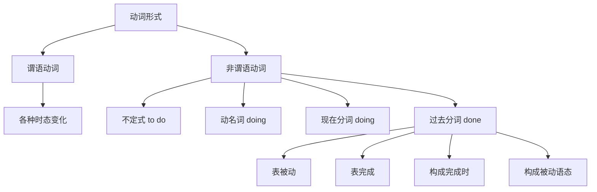
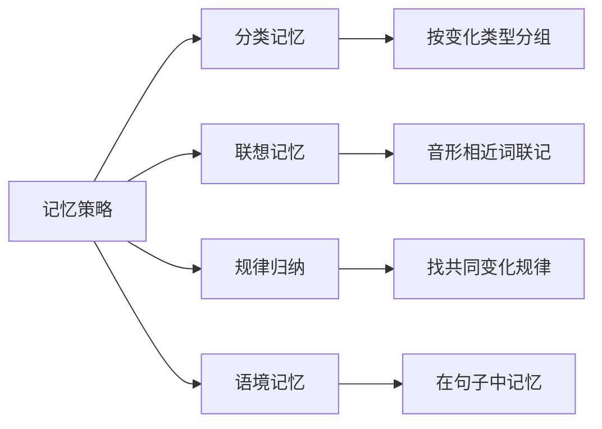
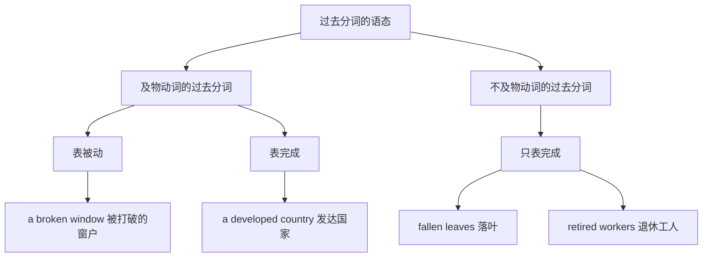
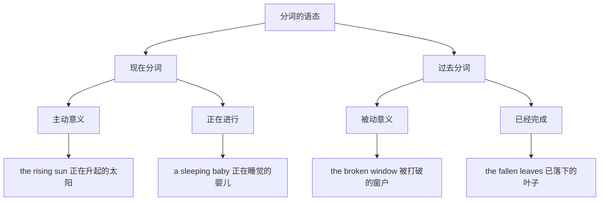
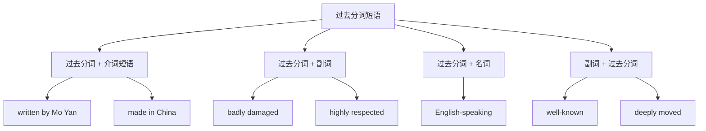
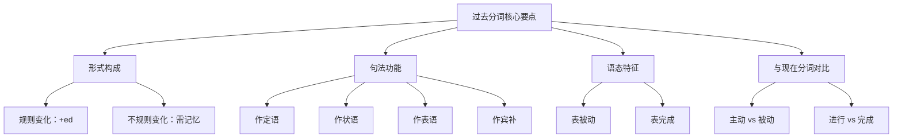

# 过去分词详解

过去分词（Past Participle）是英语非谓语动词的重要形式之一，在句子中承担着丰富的语法功能。它既可以表示被动含义，也可以表示完成含义，是构成完成时态和被动语态的核心要素。掌握过去分词的用法，对于理解复杂句式、提升阅读能力和写作水平都至关重要。

---

## 1. 过去分词的基本概念

### 1.1 什么是过去分词

过去分词是动词的一种非谓语形式，通常由动词原形加 **-ed** 构成（规则动词），或采用特殊变化形式（不规则动词）。过去分词本身不能单独作谓语，但可以与助动词结合构成谓语，或在句中充当定语、状语、表语、补语等成分。

> [!info] 过去分词的核心特征
>
> 1. **被动性**：过去分词通常表示被动的动作或状态
> 2. **完成性**：过去分词可以表示已完成的动作
> 3. **形容词性**：过去分词常具有形容词的特征，可以修饰名词或作表语

**基本示例**：

| 动词原形 | 过去分词 | 例句 | 中文翻译 |
| --- | --- | --- | --- |
| break | broken | a broken window | 一扇破碎的窗户 |
| write | written | a well-written essay | 一篇写得很好的文章 |
| interest | interested | an interested audience | 感兴趣的观众 |
| lose | lost | lost time | 失去的时间 |

### 1.2 过去分词与其他动词形式的区别



> [!tip] 形式区分要点
>
> - **过去式**（did）：谓语动词，表示过去发生的动作
> - **过去分词**（done）：非谓语动词，表示被动或完成
> - **规则动词**：过去式和过去分词形式相同（worked, worked）
> - **不规则动词**：过去式和过去分词可能不同（wrote, written）

**对比示例**：

```
1. He wrote a letter yesterday.
   他昨天写了一封信。
   → wrote 是过去式，作谓语

2. The letter written by him was very touching.
   他写的那封信非常感人。
   → written 是过去分词，作定语

3. He has written three letters this week.
   他这周已经写了三封信。
   → written 是过去分词，与 has 构成现在完成时
```

---

## 2. 过去分词的形式与构成

### 2.1 规则动词的过去分词

规则动词的过去分词通过在动词原形后加 **-ed** 构成，其变化规则与过去式相同。

#### 2.1.1 基本变化规则

| 变化类型 | 规则说明 | 动词原形 | 过去分词 |
| --- | --- | --- | --- |
| 一般情况 | 直接加 -ed | work | worked |
| 以 e 结尾 | 只加 -d | love | loved |
| 辅音 + y 结尾 | 变 y 为 i，加 -ed | study | studied |
| 元音 + y 结尾 | 直接加 -ed | play | played |
| 重读闭音节结尾 | 双写末尾辅音，加 -ed | stop | stopped |
| 以 c 结尾 | 加 -ked | picnic | picnicked |

#### 2.1.2 发音规则

过去分词 -ed 的发音取决于动词词尾的音素：

| 词尾音素 | -ed 发音 | 示例 |
| --- | --- | --- |
| 清辅音（除 /t/） | /t/ | worked /wɜːkt/, stopped /stɒpt/ |
| 浊辅音或元音（除 /d/） | /d/ | loved /lʌvd/, played /pleɪd/ |
| /t/ 或 /d/ | /ɪd/ | wanted /ˈwɒntɪd/, needed /ˈniːdɪd/ |

> [!example] 发音练习
>
> **发 /t/ 音**：
> - watched /wɒtʃt/ 观看的
> - laughed /lɑːft/ 被嘲笑的
> - helped /helpt/ 被帮助的
>
> **发 /d/ 音**：
> - called /kɔːld/ 被叫做的
> - opened /ˈəʊpənd/ 被打开的
> - changed /tʃeɪndʒd/ 被改变的
>
> **发 /ɪd/ 音**：
> - excited /ɪkˈsaɪtɪd/ 兴奋的
> - interested /ˈɪntrəstɪd/ 感兴趣的
> - expected /ɪkˈspektɪd/ 被期望的

### 2.2 不规则动词的过去分词

不规则动词的过去分词没有统一的变化规则，需要逐个记忆。根据变化特点，可以分为以下几类：

#### 2.2.1 AAA 型（原形、过去式、过去分词相同）

| 动词原形 | 过去式 | 过去分词 | 中文含义 |
| --- | --- | --- | --- |
| cut | cut | cut | 切割 |
| put | put | put | 放置 |
| let | let | let | 让 |
| set | set | set | 设置 |
| shut | shut | shut | 关闭 |
| hurt | hurt | hurt | 伤害 |
| cost | cost | cost | 花费 |
| cast | cast | cast | 投掷 |

#### 2.2.2 ABB 型（过去式与过去分词相同）

| 动词原形 | 过去式 | 过去分词 | 中文含义 |
| --- | --- | --- | --- |
| bring | brought | brought | 带来 |
| buy | bought | bought | 购买 |
| think | thought | thought | 思考 |
| catch | caught | caught | 抓住 |
| teach | taught | taught | 教授 |
| feel | felt | felt | 感觉 |
| keep | kept | kept | 保持 |
| sleep | slept | slept | 睡觉 |
| build | built | built | 建造 |
| spend | spent | spent | 花费 |
| send | sent | sent | 发送 |
| lend | lent | lent | 借出 |
| lose | lost | lost | 失去 |
| find | found | found | 发现 |
| have | had | had | 拥有 |
| make | made | made | 制作 |
| say | said | said | 说 |
| tell | told | told | 告诉 |
| sell | sold | sold | 出售 |
| hear | heard | heard | 听见 |
| hold | held | held | 握住 |
| stand | stood | stood | 站立 |
| understand | understood | understood | 理解 |
| win | won | won | 赢得 |
| sit | sat | sat | 坐 |
| get | got | got/gotten | 获得 |
| leave | left | left | 离开 |
| meet | met | met | 遇见 |
| read | read | read | 阅读 |
| lead | led | led | 领导 |

#### 2.2.3 ABA 型（原形与过去分词相同）

| 动词原形 | 过去式 | 过去分词 | 中文含义 |
| --- | --- | --- | --- |
| come | came | come | 来 |
| become | became | become | 成为 |
| run | ran | run | 跑 |

#### 2.2.4 ABC 型（三种形式各不相同）

| 动词原形 | 过去式 | 过去分词 | 中文含义 |
| --- | --- | --- | --- |
| begin | began | begun | 开始 |
| drink | drank | drunk | 喝 |
| ring | rang | rung | 响铃 |
| sing | sang | sung | 唱歌 |
| swim | swam | swum | 游泳 |
| write | wrote | written | 写 |
| drive | drove | driven | 驾驶 |
| ride | rode | ridden | 骑 |
| rise | rose | risen | 升起 |
| speak | spoke | spoken | 说话 |
| steal | stole | stolen | 偷窃 |
| wake | woke | woken | 醒来 |
| choose | chose | chosen | 选择 |
| freeze | froze | frozen | 冻结 |
| break | broke | broken | 打破 |
| take | took | taken | 拿取 |
| shake | shook | shaken | 摇动 |
| give | gave | given | 给予 |
| forgive | forgave | forgiven | 原谅 |
| fall | fell | fallen | 落下 |
| know | knew | known | 知道 |
| grow | grew | grown | 生长 |
| throw | threw | thrown | 投掷 |
| blow | blew | blown | 吹 |
| fly | flew | flown | 飞行 |
| draw | drew | drawn | 画 |
| show | showed | shown | 展示 |
| see | saw | seen | 看见 |
| eat | ate | eaten | 吃 |
| bite | bit | bitten | 咬 |
| hide | hid | hidden | 隐藏 |
| do | did | done | 做 |
| go | went | gone | 去 |
| lie | lay | lain | 躺 |
| wear | wore | worn | 穿戴 |
| tear | tore | torn | 撕裂 |
| bear | bore | borne/born | 承担/出生 |
| forget | forgot | forgotten | 忘记 |

> [!warning] 易混淆的不规则动词
>
> **lie 的两种含义**：
> - lie（躺）: lie → lay → lain（不规则）
> - lie（说谎）: lie → lied → lied（规则）
> - lay（放置）: lay → laid → laid（规则）
>
> **hang 的两种含义**：
> - hang（悬挂）: hang → hung → hung
> - hang（绞死）: hang → hanged → hanged

### 2.3 记忆不规则动词的技巧



> [!tip] 实用记忆方法
>
> **方法一：音韵规律**
> - i → a → u 类：begin-began-begun, drink-drank-drunk, sing-sang-sung, swim-swam-swum, ring-rang-rung
>
> **方法二：词尾特征**
> - -ow → -ew → -own 类：know-knew-known, grow-grew-grown, throw-threw-thrown, blow-blew-blown
> - -eak → -oke → -oken 类：break-broke-broken, speak-spoke-spoken
>
> **方法三：词根联想**
> - take-took-taken, shake-shook-shaken, mistake-mistook-mistaken
> - write-wrote-written, ride-rode-ridden, drive-drove-driven

---

## 3. 过去分词的句法功能

过去分词在句子中可以充当多种成分，主要包括定语、状语、表语和补语。

### 3.1 过去分词作定语

过去分词作定语时，修饰名词，通常表示被动或完成的含义。

#### 3.1.1 前置定语

单个过去分词通常放在被修饰名词之前，作前置定语。

**基本结构**：过去分词 + 名词

| 过去分词 | 修饰名词 | 完整短语 | 中文含义 |
| --- | --- | --- | --- |
| broken | window | a broken window | 破碎的窗户 |
| fallen | leaves | fallen leaves | 落叶 |
| retired | teacher | a retired teacher | 退休教师 |
| escaped | prisoner | an escaped prisoner | 逃跑的囚犯 |
| developed | country | a developed country | 发达国家 |
| polluted | water | polluted water | 被污染的水 |
| excited | children | excited children | 兴奋的孩子们 |
| worried | parents | worried parents | 担忧的父母 |

**详细例句分析**：

```
1. The stolen car was found in the woods.
   被盗的汽车在树林里被找到了。

   句法分析：
   - stolen：过去分词作前置定语
   - 修饰名词 car
   - 表示 car 被偷（被动含义）

2. Please hand in your finished homework.
   请交上你完成的作业。

   句法分析：
   - finished：过去分词作前置定语
   - 修饰名词 homework
   - 表示 homework 已完成（完成含义）

3. The excited fans cheered loudly for their team.
   兴奋的球迷们为他们的队伍大声欢呼。

   句法分析：
   - excited：过去分词作前置定语
   - 修饰名词 fans
   - 表示 fans 感到兴奋（表状态）
```

#### 3.1.2 后置定语

过去分词短语（过去分词带有宾语、状语或其他修饰成分）通常放在被修饰名词之后，作后置定语。

**基本结构**：名词 + 过去分词短语

**详细例句分析**：

```
1. The book written by Mo Yan is very popular.
   莫言写的那本书非常受欢迎。

   句法分析：
   - written by Mo Yan：过去分词短语作后置定语
   - 修饰名词 book
   - 相当于定语从句：which was written by Mo Yan

2. The window broken by the boy needs to be repaired.
   被那个男孩打破的窗户需要修理。

   句法分析：
   - broken by the boy：过去分词短语作后置定语
   - 修饰名词 window
   - 相当于定语从句：which was broken by the boy

3. Most of the people invited to the party were famous actors.
   被邀请参加聚会的大多数人都是著名演员。

   句法分析：
   - invited to the party：过去分词短语作后置定语
   - 修饰名词 people
   - 相当于定语从句：who were invited to the party

4. The problem discussed at the meeting was very important.
   会议上讨论的问题非常重要。

   句法分析：
   - discussed at the meeting：过去分词短语作后置定语
   - 修饰名词 problem
   - 相当于定语从句：which was discussed at the meeting
```

> [!info] 前置与后置定语的选择
>
> | 情况 | 位置 | 示例 |
> | --- | --- | --- |
> | 单个过去分词 | 通常前置 | a broken window |
> | 过去分词 + 修饰成分 | 必须后置 | the window broken by Tom |
> | 表示临时状态 | 可后置强调 | the man injured（受伤的那个人） |
> | 某些固定搭配 | 后置 | something unexpected |

#### 3.1.3 过去分词定语与定语从句的转换

过去分词（短语）作定语时，通常可以转换为定语从句，且从句中使用被动语态。

| 过去分词定语 | 定语从句 |
| --- | --- |
| the letter written in English | the letter which was written in English |
| the bridge built in 1990 | the bridge which was built in 1990 |
| the song sung by her | the song which was sung by her |
| the news reported yesterday | the news which was reported yesterday |

### 3.2 过去分词作状语

过去分词（短语）可以作状语，表示时间、原因、条件、让步、方式或伴随等。

#### 3.2.1 表示时间

过去分词作时间状语，相当于时间状语从句。

```
1. Asked about the accident, he kept silent.
   当被问及那次事故时，他保持沉默。

   句法分析：
   - Asked about the accident：过去分词短语作时间状语
   - 相当于：When he was asked about the accident
   - 逻辑主语是主句主语 he

2. Seen from the hill, the city looks beautiful.
   从山上看，这座城市很美丽。

   句法分析：
   - Seen from the hill：过去分词短语作时间状语
   - 相当于：When it is seen from the hill
   - 逻辑主语是主句主语 the city

3. Heated, water changes into steam.
   加热后，水变成蒸汽。

   句法分析：
   - Heated：过去分词作时间状语
   - 相当于：When water is heated
   - 逻辑主语是主句主语 water
```

#### 3.2.2 表示原因

过去分词作原因状语，相当于原因状语从句。

```
1. Deeply moved by the film, the girl began to cry.
   被这部电影深深感动，女孩开始哭泣。

   句法分析：
   - Deeply moved by the film：过去分词短语作原因状语
   - 相当于：Because she was deeply moved by the film
   - 逻辑主语是主句主语 the girl

2. Exhausted by the long journey, he went to bed early.
   由于长途旅行而疲惫不堪，他很早就睡了。

   句法分析：
   - Exhausted by the long journey：过去分词短语作原因状语
   - 相当于：Because he was exhausted by the long journey
   - 逻辑主语是主句主语 he

3. Surprised at the news, she couldn't say a word.
   对这个消息感到惊讶，她说不出话来。

   句法分析：
   - Surprised at the news：过去分词短语作原因状语
   - 相当于：Because she was surprised at the news
   - 逻辑主语是主句主语 she
```

#### 3.2.3 表示条件

过去分词作条件状语，相当于条件状语从句。

```
1. Given more time, we could do it better.
   如果给我们更多时间，我们能做得更好。

   句法分析：
   - Given more time：过去分词短语作条件状语
   - 相当于：If we were given more time
   - 逻辑主语是主句主语 we

2. Seen in this light, the problem doesn't seem so serious.
   如果从这个角度看，这个问题似乎没那么严重。

   句法分析：
   - Seen in this light：过去分词短语作条件状语
   - 相当于：If it is seen in this light
   - 逻辑主语是主句主语 the problem

3. United, we stand; divided, we fall.
   团结则存，分裂则亡。

   句法分析：
   - United / divided：过去分词作条件状语
   - 相当于：If we are united / If we are divided
   - 经典谚语，强调团结的重要性
```

#### 3.2.4 表示让步

过去分词作让步状语，相当于让步状语从句。

```
1. Beaten by the enemy, the soldiers didn't give in.
   虽然被敌人打败了，士兵们并没有屈服。

   句法分析：
   - Beaten by the enemy：过去分词短语作让步状语
   - 相当于：Although they were beaten by the enemy
   - 逻辑主语是主句主语 the soldiers

2. Warned of the danger, he still went there.
   尽管被警告有危险，他仍然去了那里。

   句法分析：
   - Warned of the danger：过去分词短语作让步状语
   - 相当于：Although he was warned of the danger
   - 逻辑主语是主句主语 he

3. Repeatedly asked to leave, he refused.
   虽然被反复要求离开，他拒绝了。

   句法分析：
   - Repeatedly asked to leave：过去分词短语作让步状语
   - 相当于：Although he was repeatedly asked to leave
   - 逻辑主语是主句主语 he
```

#### 3.2.5 表示方式或伴随

过去分词作方式或伴随状语，表示主语的状态。

```
1. He sat there, lost in thought.
   他坐在那里，陷入沉思。

   句法分析：
   - lost in thought：过去分词短语作伴随状语
   - 表示主语 he 的状态
   - 相当于：and he was lost in thought

2. She stood at the door, frightened.
   她站在门口，很害怕。

   句法分析：
   - frightened：过去分词作伴随状语
   - 表示主语 she 的状态
   - 相当于：and she was frightened

3. The teacher entered the classroom, followed by some students.
   老师走进教室，后面跟着一些学生。

   句法分析：
   - followed by some students：过去分词短语作伴随状语
   - 表示主语 the teacher 的状态
   - 相当于：and he/she was followed by some students
```

> [!warning] 过去分词作状语的逻辑主语
>
> 过去分词作状语时，其逻辑主语必须与主句主语一致，且构成被动关系。
>
> **正确**：
> - Seen from the top, the lake looks like a mirror.
>   （the lake 是 see 的逻辑主语，且是被动关系）
>
> **错误**：
> - ❌ Seen from the top, we found the lake beautiful.
>   （we 不是 see 的逻辑主语，应该是 we 在看，而不是被看）
>
> **修正**：
> - ✅ Seeing from the top, we found the lake beautiful.
>   （使用现在分词，表示主动）
> - ✅ Seen from the top, the lake looked like a mirror.
>   （改变主句主语）

### 3.3 过去分词作表语

过去分词作表语，说明主语的状态或特征，通常放在系动词之后。

#### 3.3.1 与 be 动词连用

```
1. The window is broken.
   窗户破了。

   句法分析：
   - is：系动词
   - broken：过去分词作表语
   - 表示窗户的状态

2. I am interested in English.
   我对英语感兴趣。

   句法分析：
   - am：系动词
   - interested：过去分词作表语
   - 表示主语的感受状态

3. The door remained locked.
   门仍然锁着。

   句法分析：
   - remained：系动词
   - locked：过去分词作表语
   - 表示门的状态
```

#### 3.3.2 与其他系动词连用

过去分词还可以与 feel, get, become, remain, seem, appear, look 等系动词连用。

| 系动词 | 例句 | 中文翻译 |
| --- | --- | --- |
| feel | I feel tired. | 我感到疲倦。 |
| get | He got married last year. | 他去年结婚了。 |
| become | She became interested in art. | 她对艺术产生了兴趣。 |
| remain | The problem remains unsolved. | 问题仍未解决。 |
| seem | He seemed surprised. | 他似乎很惊讶。 |
| appear | She appeared confused. | 她显得困惑。 |
| look | You look worried. | 你看起来很担心。 |

**详细例句分析**：

```
1. Don't get discouraged if you fail.
   如果失败了，不要灰心。

   句法分析：
   - get：系动词，表示状态变化
   - discouraged：过去分词作表语
   - 表示主语变成某种状态

2. The children seemed frightened by the loud noise.
   孩子们似乎被巨大的噪音吓到了。

   句法分析：
   - seemed：系动词
   - frightened：过去分词作表语
   - by the loud noise：原因状语

3. She remained seated until everyone had left.
   她一直坐着，直到所有人都离开了。

   句法分析：
   - remained：系动词
   - seated：过去分词作表语
   - 表示持续的状态
```

#### 3.3.3 表示情感的过去分词

许多表示情感的动词，其过去分词形式常用作表语，表示人的感受。

| 动词原形 | 过去分词（表人的感受） | 例句 |
| --- | --- | --- |
| interest | interested | I'm interested in music. |
| excite | excited | The children are excited. |
| surprise | surprised | He was surprised at the news. |
| disappoint | disappointed | She felt disappointed. |
| satisfy | satisfied | I'm satisfied with the result. |
| bore | bored | The students looked bored. |
| tire | tired | I'm tired of waiting. |
| frighten | frightened | The girl was frightened. |
| confuse | confused | I'm confused about this. |
| amaze | amazed | We were amazed at his success. |
| shock | shocked | Everyone was shocked. |
| worry | worried | Don't be worried. |
| please | pleased | I'm pleased to meet you. |
| annoy | annoyed | He seemed annoyed. |
| embarrass | embarrassed | She felt embarrassed. |

### 3.4 过去分词作宾语补足语

过去分词作宾语补足语，对宾语进行补充说明，表示宾语所处的状态或宾语所承受的动作。

#### 3.4.1 基本结构

**结构**：主语 + 谓语动词 + 宾语 + 过去分词（作宾补）


#### 3.4.2 使役动词 + 宾语 + 过去分词

常见的使役动词包括：make, have, get, leave, keep 等。

**have + 宾语 + 过去分词**：

| 用法 | 例句 | 中文翻译 |
| --- | --- | --- |
| 请人做某事 | I had my hair cut. | 我理了发。 |
| 遭受某事 | He had his wallet stolen. | 他的钱包被偷了。 |
| 完成某事 | I'll have the work done by Friday. | 我会在周五前完成这项工作。 |

**详细例句分析**：

```
1. I had my computer repaired yesterday.
   我昨天让人修了电脑。

   句法分析：
   - had：使役动词
   - my computer：宾语
   - repaired：过去分词作宾补
   - 表示让别人修电脑（请人做某事）

2. He had his leg broken in the accident.
   他在事故中腿断了。

   句法分析：
   - had：使役动词
   - his leg：宾语
   - broken：过去分词作宾补
   - 表示遭受了某种不幸（遭受某事）

3. I'll have the report finished by tomorrow.
   我会在明天之前完成报告。

   句法分析：
   - have：使役动词
   - the report：宾语
   - finished：过去分词作宾补
   - 表示确保某事完成
```

**get + 宾语 + 过去分词**：

```
1. I must get my watch repaired.
   我必须让人修理我的手表。

   句法分析：
   - get：使役动词
   - my watch：宾语
   - repaired：过去分词作宾补

2. Can you get the work done by yourself?
   你能自己完成这项工作吗？

   句法分析：
   - get：使役动词
   - the work：宾语
   - done：过去分词作宾补
```

**make + 宾语 + 过去分词**：

```
1. I couldn't make myself understood in English.
   我无法用英语让别人理解我。

   句法分析：
   - make：使役动词
   - myself：宾语
   - understood：过去分词作宾补

2. He raised his voice to make himself heard.
   他提高嗓门以让别人听到他。

   句法分析：
   - make：使役动词
   - himself：宾语
   - heard：过去分词作宾补
```

**leave/keep + 宾语 + 过去分词**：

```
1. Don't leave the door unlocked.
   不要让门没锁。

   句法分析：
   - leave：使役动词
   - the door：宾语
   - unlocked：过去分词作宾补
   - 表示保持某种状态

2. Keep your eyes closed.
   闭上眼睛。

   句法分析：
   - keep：使役动词
   - your eyes：宾语
   - closed：过去分词作宾补
   - 表示保持某种状态
```

#### 3.4.3 感官动词 + 宾语 + 过去分词

常见的感官动词包括：see, hear, watch, notice, observe, feel, find 等。

```
1. I saw the man knocked down by a car.
   我看到那个人被车撞倒了。

   句法分析：
   - saw：感官动词
   - the man：宾语
   - knocked down：过去分词短语作宾补
   - 表示看到某人被撞（被动）

2. I heard my name called.
   我听到有人叫我的名字。

   句法分析：
   - heard：感官动词
   - my name：宾语
   - called：过去分词作宾补
   - 表示名字被叫到（被动）

3. She felt herself watched by someone.
   她感觉有人在看她。

   句法分析：
   - felt：感官动词
   - herself：宾语
   - watched：过去分词作宾补
   - 表示自己被注视（被动）

4. I found my wallet stolen.
   我发现我的钱包被偷了。

   句法分析：
   - found：感官动词
   - my wallet：宾语
   - stolen：过去分词作宾补
   - 表示发现钱包处于被偷的状态
```

#### 3.4.4 表示希望、要求的动词 + 宾语 + 过去分词

常见动词包括：want, wish, expect, like, prefer, order 等。

```
1. I want the work done immediately.
   我希望这项工作立即完成。

   句法分析：
   - want：表示希望的动词
   - the work：宾语
   - done：过去分词作宾补

2. I would like this letter typed at once.
   我希望这封信立即打印出来。

   句法分析：
   - would like：表示希望
   - this letter：宾语
   - typed：过去分词作宾补

3. The manager ordered the goods shipped immediately.
   经理命令货物立即发运。

   句法分析：
   - ordered：表示命令的动词
   - the goods：宾语
   - shipped：过去分词作宾补
```

> [!tip] 宾语与过去分词的关系判断
>
> 判断是否使用过去分词作宾补，关键在于分析**宾语与动词的关系**：
>
> - 若宾语是动作的**承受者**（被动关系）→ 用过去分词
> - 若宾语是动作的**执行者**（主动关系）→ 用现在分词或不定式
>
> **对比**：
> - I heard him **singing** a song.（他在唱歌 → 主动 → 现在分词）
> - I heard the song **sung** by him.（歌被唱 → 被动 → 过去分词）

---

## 4. 过去分词的时态与语态特点

### 4.1 过去分词的语态意义

过去分词最核心的特征是表示**被动意义**，即动作的承受者。



#### 4.1.1 及物动词的过去分词

及物动词的过去分词既可以表示被动，也可以表示完成。

**表被动**：

```
1. The book written by Lu Xun is very famous.
   鲁迅写的那本书非常有名。

   分析：written 表被动，书被鲁迅写

2. The window broken by the children has been repaired.
   被孩子们打破的窗户已经修好了。

   分析：broken 表被动，窗户被打破
```

**表完成**：

```
1. We must learn our lessons learned from the past.
   我们必须学习从过去学到的教训。

   分析：learned 表完成，已经学到的

2. The meeting held yesterday was important.
   昨天举行的会议很重要。

   分析：held 既表被动（会议被举行），也暗含完成
```

#### 4.1.2 不及物动词的过去分词

不及物动词没有被动语态，因此其过去分词只表示完成意义，不表示被动。

| 过去分词 | 含义 | 例句 |
| --- | --- | --- |
| fallen | 已落下的 | fallen leaves 落叶 |
| risen | 已升起的 | the risen sun 升起的太阳 |
| retired | 已退休的 | retired workers 退休工人 |
| escaped | 已逃跑的 | an escaped prisoner 逃犯 |
| departed | 已离开的 | the departed guests 已离去的客人 |
| faded | 已褪色的 | faded flowers 凋谢的花 |
| returned | 已返回的 | the returned students 归国学生 |
| grown | 已长大的 | a grown man 成年人 |

> [!warning] 常见错误辨析
>
> **不是所有过去分词都表被动！**
>
> - fallen leaves ≠ 被落下的叶子 ✗
> - fallen leaves = 已落下的叶子 ✓
>
> **判断方法**：看原动词是及物还是不及物
> - fall（落下）是不及物动词 → fallen 只表完成
> - break（打破）是及物动词 → broken 可表被动

### 4.2 过去分词的时态意义

过去分词本身不直接表示时间，但它通常表示**动作已完成**或**状态持续**。在句中的具体时间含义由谓语动词或上下文决定。

#### 4.2.1 表示动作在谓语动作之前完成

```
1. Asked why he was late, he couldn't answer.
   当被问及为什么迟到时，他回答不上来。

   分析：asked 的动作发生在 couldn't answer 之前

2. The problem discussed yesterday was difficult.
   昨天讨论的问题很难。

   分析：discussed 的动作（讨论）在 was difficult 之前完成
```

#### 4.2.2 表示与谓语动作同时发生的状态

```
1. He sat there, surrounded by his students.
   他坐在那里，被学生们围着。

   分析：surrounded 与 sat 同时存在，表示伴随状态

2. She walked into the room, followed by her dog.
   她走进房间，后面跟着她的狗。

   分析：followed 与 walked 同时存在，表示伴随状态
```

### 4.3 过去分词在完成时态中的作用

过去分词与助动词 have/has/had 结合，构成各种完成时态。

| 时态 | 结构 | 例句 |
| --- | --- | --- |
| 现在完成时 | have/has + 过去分词 | I have finished my work. |
| 过去完成时 | had + 过去分词 | She had left before I arrived. |
| 将来完成时 | will have + 过去分词 | I will have completed it by tomorrow. |
| 现在完成进行时 | have/has been + 现在分词 | I have been waiting for an hour. |

### 4.4 过去分词在被动语态中的作用

过去分词与助动词 be 结合，构成各种被动语态。

| 时态 | 被动结构 | 例句 |
| --- | --- | --- |
| 一般现在时被动 | am/is/are + 过去分词 | English is spoken here. |
| 一般过去时被动 | was/were + 过去分词 | The window was broken. |
| 一般将来时被动 | will be + 过去分词 | The project will be finished. |
| 现在进行时被动 | am/is/are being + 过去分词 | The house is being built. |
| 现在完成时被动 | have/has been + 过去分词 | The work has been done. |
| 过去完成时被动 | had been + 过去分词 | The report had been written. |
| 情态动词被动 | 情态动词 + be + 过去分词 | It can be done easily. |

---

## 5. 过去分词与现在分词的深度对比

过去分词和现在分词是英语中最容易混淆的两种非谓语形式。正确区分它们是掌握英语语法的关键。

### 5.1 形式对比

| 类型 | 形式 | 示例 |
| --- | --- | --- |
| 现在分词 | 动词 + ing | doing, writing, running |
| 过去分词 | 动词 + ed（规则）/ 特殊形式（不规则） | done, written, run |

### 5.2 语态对比



**核心区别**：

| 对比项 | 现在分词 | 过去分词 |
| --- | --- | --- |
| 语态 | 主动 | 被动 |
| 时态 | 进行 | 完成 |
| 与修饰词的关系 | 修饰词是动作的执行者 | 修饰词是动作的承受者 |

### 5.3 作定语时的对比

#### 5.3.1 修饰事物

| 现在分词（主动/进行） | 过去分词（被动/完成） |
| --- | --- |
| boiling water 沸腾的水（正在沸腾） | boiled water 开水（已烧开的） |
| falling leaves 正在飘落的叶子 | fallen leaves 落叶（已落下的） |
| changing world 变化中的世界 | changed world 已改变的世界 |
| developing country 发展中国家 | developed country 发达国家 |
| rising prices 正在上涨的价格 | risen prices 已上涨的价格 |

**详细对比分析**：

```
1. boiling water vs. boiled water

   - boiling water：沸腾的水（水正在沸腾，主动进行）
   - boiled water：开水（水已经被烧开，被动完成）

   例句：
   - The boiling water is too hot to touch.
     沸腾的水太烫了，不能碰。
   - Please drink some boiled water.
     请喝一些开水。

2. a developing country vs. a developed country

   - developing country：发展中国家（国家正在发展，主动进行）
   - developed country：发达国家（国家已经发展完成，完成状态）

   例句：
   - China is a developing country.
     中国是一个发展中国家。
   - Japan is a developed country.
     日本是一个发达国家。

3. the rising sun vs. the risen sun

   - rising sun：正在升起的太阳（太阳正在升起，主动进行）
   - risen sun：已升起的太阳（太阳已经升起，完成状态）

   例句：
   - We watched the rising sun on the beach.
     我们在海滩上观看正在升起的太阳。
   - The risen sun was shining brightly.
     已升起的太阳正在明亮地照耀。
```

#### 5.3.2 修饰人（情感动词）

表示情感的动词（如 interest, excite, surprise 等）的两种分词形式在修饰人时意义不同：

| 现在分词（令人…的） | 过去分词（感到…的） |
| --- | --- |
| interesting 令人感兴趣的 | interested 感兴趣的 |
| exciting 令人兴奋的 | excited 兴奋的 |
| surprising 令人惊讶的 | surprised 感到惊讶的 |
| boring 令人厌烦的 | bored 感到厌烦的 |
| tiring 令人疲倦的 | tired 感到疲倦的 |
| moving 令人感动的 | moved 感动的 |
| disappointing 令人失望的 | disappointed 感到失望的 |
| satisfying 令人满意的 | satisfied 感到满意的 |
| confusing 令人困惑的 | confused 感到困惑的 |
| amazing 令人惊奇的 | amazed 感到惊奇的 |
| frightening 令人害怕的 | frightened 感到害怕的 |
| embarrassing 令人尴尬的 | embarrassed 感到尴尬的 |
| annoying 令人恼火的 | annoyed 感到恼火的 |
| shocking 令人震惊的 | shocked 感到震惊的 |

> [!tip] 记忆技巧
>
> - **-ing 形式**：描述事物的特性，"令人…的"，使人产生某种感觉
> - **-ed 形式**：描述人的感受，"感到…的"，人体验到某种感觉
>
> **简单记法**：
> - 人 + -ed（人有感受）
> - 物 + -ing（物有特性）

**详细对比分析**：

```
1. interesting vs. interested

   - The book is interesting. 这本书很有趣。（书令人感兴趣）
   - I am interested in the book. 我对这本书感兴趣。（我感到有兴趣）

   - an interesting story 一个有趣的故事
   - an interested reader 一个感兴趣的读者

2. boring vs. bored

   - The lecture was boring. 讲座很无聊。（讲座令人厌烦）
   - The students were bored. 学生们很无聊。（学生感到厌烦）

   - a boring teacher 一个无聊的老师（老师令人感到无聊）
   - a bored student 一个感到无聊的学生

3. surprising vs. surprised

   - The news is surprising. 这个消息令人惊讶。
   - We are surprised at the news. 我们对这个消息感到惊讶。

   - a surprising result 一个令人惊讶的结果
   - a surprised expression 一个惊讶的表情

4. exciting vs. excited

   - The game was exciting. 比赛很刺激。
   - The fans were excited. 球迷们很兴奋。

   - an exciting match 一场激动人心的比赛
   - excited children 兴奋的孩子们
```

> [!warning] 常见错误
>
> ❌ I am very interesting in English.
> ✅ I am very interested in English.
>
> ❌ The movie is very bored.
> ✅ The movie is very boring.
>
> ❌ He looks very worrying.
> ✅ He looks very worried.
>
> **错误原因**：混淆了"令人…"和"感到…"的区别

### 5.4 作状语时的对比

选择现在分词还是过去分词作状语，取决于分词的逻辑主语（通常是主句主语）与分词动作的关系。

| 关系 | 选择 | 例句 |
| --- | --- | --- |
| 主动关系 | 现在分词 | Hearing the news, she cried. |
| 被动关系 | 过去分词 | Seen from the hill, the city looks beautiful. |

**详细对比分析**：

```
1. 主语执行分词动作 → 用现在分词

   - Seeing the teacher, the students stood up.
     看到老师，学生们站了起来。
     （学生看老师 → 主动 → 用 seeing）

2. 主语承受分词动作 → 用过去分词

   - Seen from the space, the earth looks like a blue ball.
     从太空看，地球看起来像个蓝色的球。
     （地球被看 → 被动 → 用 seen）

3. 对比练习

   正确：Hearing the noise, the baby began to cry.
   分析：baby 听到噪音（baby 是 hear 的执行者）→ 主动

   正确：Frightened by the noise, the baby began to cry.
   分析：baby 被噪音吓到（baby 是 frighten 的承受者）→ 被动

   错误：❌ Hearing the noise, tears came to the baby's eyes.
   分析：tears 不能 hear（逻辑主语不一致）

   修正：✅ Hearing the noise, the baby burst into tears.
   或者：✅ When the baby heard the noise, tears came to his eyes.
```

### 5.5 作表语时的对比

```
1. 现在分词作表语：表示主语的特征

   - The news is encouraging. 这个消息令人鼓舞。
   - The story is touching. 这个故事很感人。
   - His speech was inspiring. 他的演讲很鼓舞人心。

2. 过去分词作表语：表示主语的状态或感受

   - We are encouraged by the news. 我们受到这个消息的鼓舞。
   - She was deeply touched. 她深受感动。
   - The audience was inspired. 观众受到了鼓舞。

3. 对比分析

   - The situation is confusing. 情况令人困惑。（情况的特点）
   - I am confused about the situation. 我对情况感到困惑。（我的感受）

   - The movie is interesting. 这部电影很有趣。（电影的特点）
   - I am interested in the movie. 我对这部电影感兴趣。（我的感受）
```

### 5.6 作宾补时的对比

```
1. 现在分词作宾补：表示宾语正在进行的动作（主动）

   - I saw him crossing the street.
     我看到他正在过马路。
     （他在过马路 → 主动进行）

   - I heard her singing a song.
     我听到她在唱歌。
     （她在唱歌 → 主动进行）

2. 过去分词作宾补：表示宾语被动的状态或承受的动作

   - I saw him knocked down by a car.
     我看到他被车撞倒了。
     （他被撞 → 被动）

   - I heard the song sung in the next room.
     我听到那首歌在隔壁房间被唱。
     （歌被唱 → 被动）

3. 对比分析

   - I found him lying on the ground.
     我发现他躺在地上。（他在躺 → 主动 → 现在分词）

   - I found him injured on the ground.
     我发现他受伤躺在地上。（他受伤了 → 被动 → 过去分词）

   - She had the children laughing.
     她让孩子们笑了。（孩子们在笑 → 主动 → 现在分词）

   - She had the work finished.
     她让工作完成了。（工作被完成 → 被动 → 过去分词）
```

### 5.7 综合对比表

| 功能 | 现在分词 | 过去分词 |
| --- | --- | --- |
| **作定语** | 主动/进行：a running man | 被动/完成：a broken glass |
| **作状语** | 主语是动作执行者：Seeing..., he... | 主语是动作承受者：Seen..., the city... |
| **作表语** | 事物的特征：interesting | 人的感受：interested |
| **作宾补** | 宾语执行动作：see him running | 宾语承受动作：see him beaten |
| **修饰人** | 令人…：a boring teacher | 感到…：a bored student |

---

## 6. 过去分词短语的用法

过去分词短语是指过去分词与其修饰语、宾语或状语组成的短语。

### 6.1 过去分词短语的构成



### 6.2 过去分词短语作定语

```
1. 过去分词 + 介词短语

   - The bridge built in the 1950s needs repairing.
     建于20世纪50年代的那座桥需要维修。

   - The letter written in English was from my pen pal.
     那封用英语写的信来自我的笔友。

   - The problems discussed at the meeting were very important.
     会议上讨论的问题非常重要。

2. 过去分词 + 副词

   - The badly damaged car was taken to the garage.
     严重损坏的汽车被送到了修理厂。

   - The recently published book has become a bestseller.
     最近出版的那本书已成为畅销书。

3. 副词 + 过去分词（复合形容词）

   - a well-known writer 一位著名的作家
   - a highly-respected professor 一位备受尊敬的教授
   - a deeply-moved audience 深受感动的观众
   - a widely-used method 一种广泛使用的方法
```

### 6.3 过去分词短语作状语

```
1. 时间状语

   - Once started, the project cannot be stopped.
     一旦开始，这个项目就不能停止。

   - When asked about the accident, he said nothing.
     当被问及事故时，他什么也没说。

2. 原因状语

   - Greatly encouraged by the teacher's words, she decided to work harder.
     受到老师话语的极大鼓励，她决定更加努力。

   - Deeply affected by the story, the children cried.
     深受故事感动，孩子们哭了。

3. 条件状语

   - Properly handled, the situation will improve.
     如果处理得当，情况会好转。

   - If given another chance, I will do better.
     如果再给我一次机会，我会做得更好。

4. 让步状语

   - Although warned many times, he still made the same mistake.
     虽然被警告了很多次，他仍然犯同样的错误。

   - Even if invited, I won't go.
     即使被邀请，我也不会去。

5. 伴随状语

   - The teacher came in, followed by a group of students.
     老师走了进来，后面跟着一群学生。

   - He left the room, disappointed and angry.
     他离开了房间，既失望又生气。
```

### 6.4 独立主格结构中的过去分词

当过去分词的逻辑主语与主句主语不一致时，需要使用独立主格结构，即在过去分词前加上它自己的逻辑主语。

**结构**：名词/代词 + 过去分词

```
1. The work done, we went home.
   工作做完后，我们回家了。

   分析：
   - The work 是 done 的逻辑主语
   - we 是主句主语
   - 两者不一致，构成独立主格

2. All things considered, the plan is practical.
   综合考虑所有因素，这个计划是可行的。

   分析：
   - All things 是 considered 的逻辑主语
   - the plan 是主句主语
   - 经典的独立主格结构

3. Weather permitting, we'll have a picnic tomorrow.
   如果天气允许，我们明天去野餐。

   分析：
   - Weather 是 permitting 的逻辑主语（注：这里用现在分词）
   - we 是主句主语

4. His homework finished, he went out to play.
   作业做完后，他出去玩了。

   分析：
   - His homework 是 finished 的逻辑主语
   - he 是主句主语

5. The meeting over, we left the room.
   会议结束后，我们离开了房间。

   分析：
   - The meeting 是 over 的逻辑主语
   - we 是主句主语
   - over 在这里是形容词/副词
```

> [!info] 常见的独立主格结构
>
> | 结构 | 含义 | 例句 |
> | --- | --- | --- |
> | All things considered | 综合考虑 | All things considered, it's a good plan. |
> | Weather permitting | 如果天气允许 | Weather permitting, we'll go hiking. |
> | Time permitting | 如果时间允许 | Time permitting, I'll visit you. |
> | Given the circumstances | 鉴于情况 | Given the circumstances, we did well. |
> | Other things being equal | 其他条件相同 | Other things being equal, I prefer this. |

### 6.5 with + 宾语 + 过去分词

这是一种常见的复合结构，表示伴随状态或原因。

**结构**：with + 名词/代词 + 过去分词

```
1. With the problem solved, we all felt happy.
   问题解决了，我们都感到高兴。

   分析：
   - with 引导的复合结构作原因状语
   - the problem 是 solved 的逻辑主语

2. He sat there with his eyes closed.
   他坐在那里，眼睛闭着。

   分析：
   - with 引导的复合结构作伴随状语
   - his eyes 是 closed 的逻辑主语

3. She left the room with tears streaming down her face.
   她离开了房间，眼泪顺着脸流下来。

   分析：
   - with 引导的复合结构作伴随状语
   - tears 是 streaming 的逻辑主语（注：这里用现在分词，因为主动）

4. With all the tickets sold out, we had to go home.
   所有票都卖光了，我们只好回家。

   分析：
   - with 引导的复合结构作原因状语
   - all the tickets 是 sold out 的逻辑主语

5. The teacher came in with a book held under his arm.
   老师进来了，胳膊下夹着一本书。

   分析：
   - with 引导的复合结构作伴随状语
   - a book 是 held 的逻辑主语
```

---

## 7. 过去分词的特殊用法

### 7.1 过去分词的形容词化

许多过去分词已经完全转化为形容词，失去了动词的特征，可以被 very, quite, rather 等副词修饰。

| 过去分词 | 形容词含义 | 例句 |
| --- | --- | --- |
| tired | 疲倦的 | I'm very tired. |
| interested | 感兴趣的 | She's quite interested. |
| worried | 担心的 | He looks rather worried. |
| excited | 兴奋的 | The kids are very excited. |
| surprised | 惊讶的 | I was quite surprised. |
| pleased | 高兴的 | She seemed very pleased. |
| disappointed | 失望的 | He was rather disappointed. |
| satisfied | 满意的 | I'm quite satisfied. |
| bored | 无聊的 | The students looked bored. |
| confused | 困惑的 | I'm very confused. |

> [!tip] 动词性过去分词 vs 形容词化过去分词
>
> **动词性过去分词**（保留动词特征）：
> - 可用 by 引出动作执行者
> - 通常用 much, greatly 等修饰
> - 例：I was much surprised by his behavior.
>
> **形容词化过去分词**（失去动词特征）：
> - 不能用 by 引出动作执行者
> - 可用 very, quite, rather 等修饰
> - 例：I was very surprised at the news.

### 7.2 过去分词用于固定短语

许多过去分词已经成为固定短语的组成部分：

| 固定短语 | 含义 | 例句 |
| --- | --- | --- |
| be interested in | 对…感兴趣 | I'm interested in music. |
| be surprised at | 对…感到惊讶 | He was surprised at the news. |
| be satisfied with | 对…感到满意 | I'm satisfied with the result. |
| be worried about | 担心… | She's worried about her son. |
| be devoted to | 致力于… | He's devoted to teaching. |
| be prepared for | 为…做好准备 | We're prepared for the exam. |
| be used to | 习惯于… | I'm used to getting up early. |
| be supposed to | 应该… | You're supposed to be here. |
| be based on | 基于… | The film is based on a true story. |
| be involved in | 参与… | He's involved in the project. |
| be dressed in | 穿着… | She was dressed in red. |
| be located in | 位于… | The school is located in the city center. |
| be made of | 由…制成 | The desk is made of wood. |
| be made from | 由…制成 | Paper is made from wood. |
| be made up of | 由…组成 | The team is made up of ten people. |
| be known for | 因…而闻名 | The city is known for its history. |
| be known as | 作为…而闻名 | He's known as a great scientist. |
| be covered with | 被…覆盖 | The ground was covered with snow. |
| be filled with | 充满… | The room was filled with smoke. |
| be crowded with | 挤满… | The bus was crowded with people. |

### 7.3 过去分词在特殊句型中的应用

#### 7.3.1 强调句中的过去分词

```
1. It was the book written by Mo Yan that I bought yesterday.
   我昨天买的就是莫言写的那本书。

   分析：强调宾语 the book written by Mo Yan

2. It was because he was badly injured that he didn't come.
   正是因为他受了重伤，他才没来。

   分析：强调原因状语
```

#### 7.3.2 倒装句中的过去分词

```
1. Seated in the front row were the VIP guests.
   坐在前排的是贵宾。

   分析：表语前置，主谓倒装

2. Hidden behind the door was a small box.
   藏在门后面的是一个小盒子。

   分析：表语前置，主谓倒装

3. Gone are the days when we worked together.
   我们一起工作的日子一去不复返了。

   分析：表语前置，主谓倒装
```

#### 7.3.3 感叹句中的过去分词

```
1. How beautifully decorated the room is!
   这个房间装饰得多漂亮啊！

2. What a well-written essay this is!
   这是一篇多么优秀的文章啊！
```

---

## 8. 过去分词易错点辨析

### 8.1 过去式与过去分词混淆

```
错误：❌ The work was did yesterday.
正确：✅ The work was done yesterday.

错误：❌ I have went to Beijing twice.
正确：✅ I have gone to Beijing twice.

错误：❌ The letter written by him arrived.（此句正确）
错误：❌ The letter wrote by him arrived.
正确：✅ The letter written by him arrived.
```

### 8.2 现在分词与过去分词选择错误

```
错误：❌ The girl looked very surprising.
正确：✅ The girl looked very surprised.
分析：女孩"感到"惊讶，用 -ed 形式

错误：❌ I found the lecture very bored.
正确：✅ I found the lecture very boring.
分析：讲座"令人"无聊，用 -ing 形式

错误：❌ Seeing from the top of the mountain, the city is beautiful.
正确：✅ Seen from the top of the mountain, the city is beautiful.
分析：城市"被"看，用过去分词

错误：❌ Waited for a long time, she became impatient.
正确：✅ Having waited for a long time, she became impatient.
分析：她主动等待，用现在分词的完成式
```

### 8.3 逻辑主语错误

```
错误：❌ Walking along the street, a car hit him.
分析：walking 的逻辑主语应该是人，不是 car

修正方案：
✅ Walking along the street, he was hit by a car.
✅ While he was walking along the street, a car hit him.

错误：❌ Written in simple English, I can understand the book easily.
分析：written 的逻辑主语应该是 book，不是 I

修正方案：
✅ Written in simple English, the book is easy to understand.
✅ As the book is written in simple English, I can understand it easily.
```

### 8.4 时态搭配错误

```
错误：❌ The house built next year will be very big.
分析：房子明年才建，现在还没建，不能用过去分词

正确：✅ The house to be built next year will be very big.
或者：✅ The house being built now will be finished next year.

错误：❌ The letter was wrote in English.
正确：✅ The letter was written in English.
```

---

## 9. 过去分词综合练习

### 9.1 填空练习

用括号内动词的正确形式填空：

```
1. The girl _______ (name) Mary is my cousin.
   答案：named
   分析：女孩被命名为玛丽，表被动，用过去分词

2. _______ (give) more time, we could do it better.
   答案：Given
   分析：如果被给予更多时间，表被动，用过去分词

3. He had his hair _______ (cut) yesterday.
   答案：cut
   分析：have sth done 结构，cut 的过去分词形式也是 cut

4. The question _______ (discuss) at the meeting is very important.
   答案：discussed
   分析：在会议上被讨论的问题，表被动，用过去分词

5. _______ (compare) with him, I am not lucky.
   答案：Compared
   分析：与他相比，I 被比较，表被动，用过去分词

6. I found my wallet _______ (steal).
   答案：stolen
   分析：钱包被偷，表被动，用过去分词

7. The children looked _______ (excite) when they heard the news.
   答案：excited
   分析：孩子们感到兴奋，用 -ed 形式

8. _______ (tell) many times, he still made the same mistake.
   答案：Told
   分析：虽然被告知多次，表被动让步，用过去分词

9. With all the problems _______ (solve), we felt very happy.
   答案：solved
   分析：with + 宾语 + 过去分词结构，问题被解决

10. The bridge _______ (build) last year was damaged in the flood.
    答案：built
    分析：去年建造的桥，表被动和完成，用过去分词
```

### 9.2 改错练习

找出并改正下列句子中的错误：

```
1. The boy seating in the corner is my brother.
   错误：seating → seated
   分析：男孩"坐着"，be seated 表示坐的状态

2. Compared this book with that one, you'll find the difference.
   错误：Compared → Comparing
   分析：你主动比较，应用现在分词

3. I'm very interesting in English.
   错误：interesting → interested
   分析：我"感到"有兴趣，用 -ed 形式

4. The building built next year will be a library.
   错误：built → to be built
   分析：明年才建，用不定式表将来

5. Seeing from the hill, the village looks beautiful.
   错误：Seeing → Seen
   分析：村庄"被"看，应用过去分词

6. The news is very surprised.
   错误：surprised → surprising
   分析：新闻"令人"惊讶，用 -ing 形式

7. I had my watch repair yesterday.
   错误：repair → repaired
   分析：have sth done 结构，需用过去分词

8. Writing in simple English, the book is easy to understand.
   错误：Writing → Written
   分析：书"被"写，应用过去分词
```

### 9.3 句子转换练习

按要求改写下列句子：

```
1. 将定语从句改为分词短语：

   原句：The boy who was injured in the accident has been sent to hospital.
   改写：The boy injured in the accident has been sent to hospital.

2. 将状语从句改为分词短语：

   原句：Because she was deeply moved by his words, she decided to help him.
   改写：Deeply moved by his words, she decided to help him.

3. 将分词短语改为定语从句：

   原句：The problems discussed at yesterday's meeting were very important.
   改写：The problems that were discussed at yesterday's meeting were very important.

4. 将分词短语改为状语从句：

   原句：Given more time, we could have done it better.
   改写：If we had been given more time, we could have done it better.

5. 将主动语态改为被动语态（含过去分词）：

   原句：Someone stole his wallet.
   改写：His wallet was stolen.
```

---

## 10. 过去分词小结

### 10.1 核心要点回顾



### 10.2 使用口诀

> [!tip] 过去分词使用口诀
>
> **分词选择三看法**：
> 1. 看语态：被动用过分，主动用现分
> 2. 看时态：完成用过分，进行用现分
> 3. 看修饰：修饰人感受用 -ed，修饰物特征用 -ing
>
> **作状语判断法**：
> 主语是动作承受者 → 过去分词
> 主语是动作执行者 → 现在分词
>
> **常见搭配记忆法**：
> - have/get + 宾语 + 过去分词（使役）
> - with + 宾语 + 过去分词（伴随）
> - 感官动词 + 宾语 + 过去分词（感知被动）

### 10.3 常见错误警示

| 错误类型 | 错误示例 | 正确形式 |
| --- | --- | --- |
| 时态混淆 | was did | was done |
| 分词选择错误 | I'm interesting | I'm interested |
| 逻辑主语错误 | Seeing..., the city... | Seen..., the city... |
| 搭配错误 | very surprising (修饰人) | very surprised |
| 形式错误 | have wrote | have written |

---

## 参考资料

1. 薄冰. 《薄冰高级英语语法》. 北京：高等教育出版社
2. 张道真. 《实用英语语法》. 北京：外语教学与研究出版社
3. Murphy, Raymond. *English Grammar in Use*. Cambridge University Press
4. Swan, Michael. *Practical English Usage*. Oxford University Press
5. Quirk, Randolph et al. *A Comprehensive Grammar of the English Language*. Longman

---

> [!success] 学习建议
>
> 1. **系统记忆不规则动词**：按变化类型分组记忆，每天复习一组
> 2. **多做对比练习**：重点区分现在分词和过去分词的用法
> 3. **注意逻辑主语**：分析分词与主句主语的关系
> 4. **积累固定搭配**：记忆含过去分词的常用短语
> 5. **阅读实践**：在阅读中识别和分析过去分词的用法
