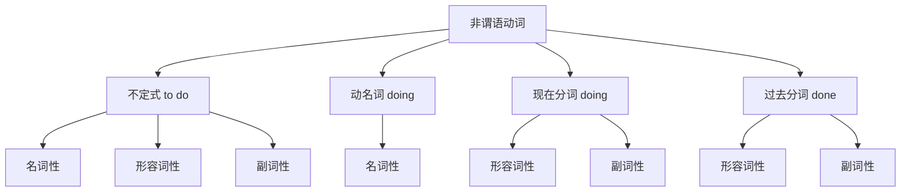
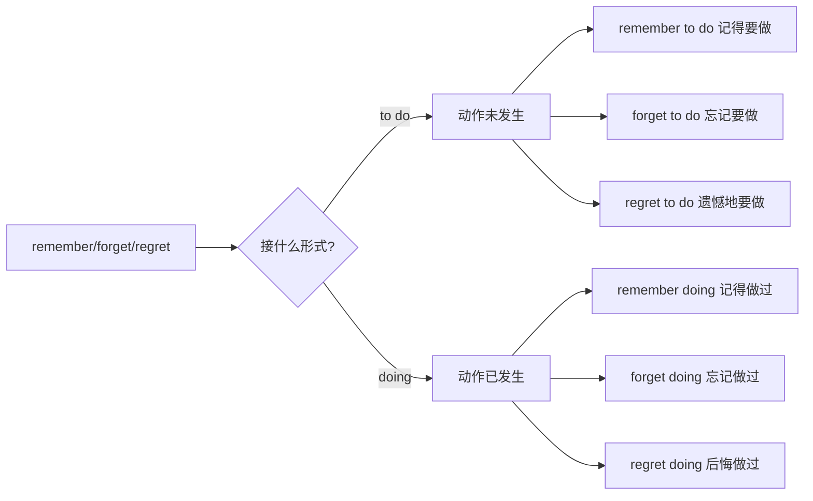
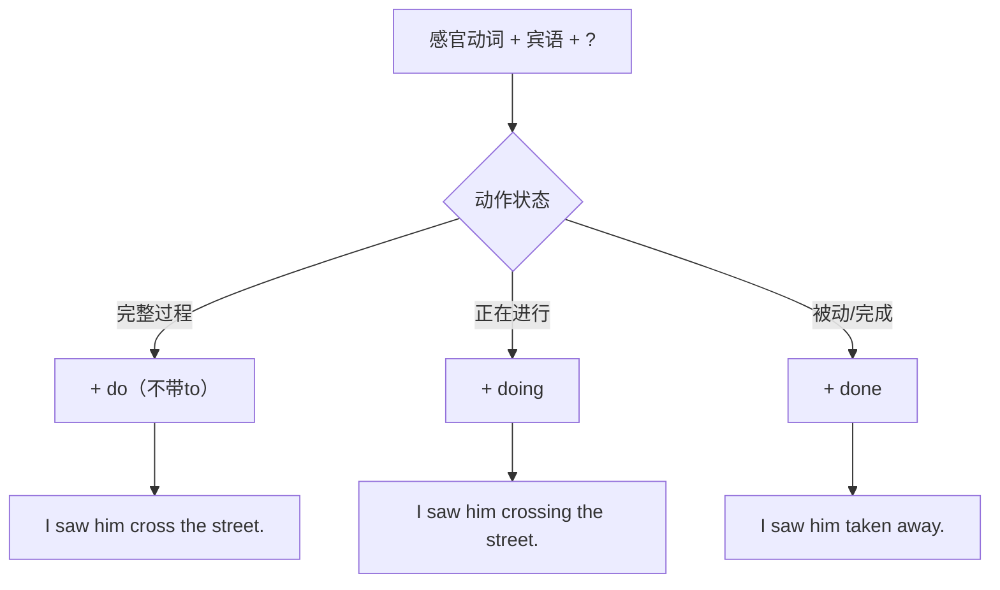
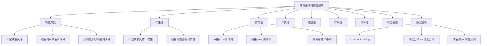

# 非谓语动词综合辨析

非谓语动词是英语语法中最复杂、最灵活的部分之一。不定式（to do）、动名词（doing）、现在分词（doing）和过去分词（done）这四种形式在句中承担着多种语法功能，它们之间既有相似之处，又有本质区别。本篇将从功能对比、选择规则、易混辨析等多个维度，帮助学习者建立完整的非谓语动词知识体系。

---

## 1. 非谓语动词功能总览

### 1.1 四种非谓语动词的基本特征

> [!info] 核心概念
>
> 非谓语动词（Non-finite Verbs）是指不能单独充当谓语的动词形式。它们保留动词的某些特征（如可带宾语、可被副词修饰），但在句中主要充当名词、形容词或副词的功能。



上图展示了四种非谓语动词的基本分类及其主要语法属性。不定式是最灵活的形式，可以充当名词、形容词和副词三种成分；动名词专注于名词功能；现在分词和过去分词则主要承担形容词和副词的角色。

### 1.2 功能对比总表

| 句法功能 | 不定式 to do | 动名词 doing | 现在分词 doing | 过去分词 done |
| --- | --- | --- | --- | --- |
| 主语 | ✅ | ✅ | ❌ | ❌ |
| 宾语 | ✅ | ✅ | ❌ | ❌ |
| 表语 | ✅ | ✅ | ✅ | ✅ |
| 定语 | ✅ | ✅ | ✅ | ✅ |
| 状语 | ✅ | ❌ | ✅ | ✅ |
| 补语 | ✅ | ❌ | ✅ | ✅ |

> [!tip] 记忆技巧
>
> - **动名词**：只做"名词能做的事"——主语、宾语、表语、定语
> - **分词**：只做"形容词/副词能做的事"——表语、定语、状语、补语
> - **不定式**：全能选手，几乎无所不能

---

## 2. 作主语的辨析

### 2.1 不定式作主语

不定式作主语时，通常表示**具体的、一次性的、将要发生的动作**，强调目的性或意愿。

**基本结构**：

```
To do sth. + is/was + adj./n.
It + is/was + adj./n. + to do sth.（形式主语结构）
```

**例句分析**：

1. **To learn a foreign language requires patience.**
   - 学习一门外语需要耐心。
   - 分析：不定式 "To learn a foreign language" 作主语，强调"学习外语"这一具体行为

2. **It is important to keep your promise.**
   - 信守承诺很重要。
   - 分析：It 为形式主语，真正主语是 "to keep your promise"

3. **To see is to believe.**
   - 眼见为实。
   - 分析：两个不定式分别作主语和表语，构成谚语

### 2.2 动名词作主语

动名词作主语时，通常表示**泛指的、经常性的、习惯性的动作**，强调行为本身。

**基本结构**：

```
Doing sth. + is/was + adj./n.
It + is/was + no use/no good/useless/worthwhile + doing sth.
```

**例句分析**：

1. **Swimming is good exercise.**
   - 游泳是很好的运动。
   - 分析：动名词 "Swimming" 作主语，泛指游泳这项运动

2. **Reading in dim light damages your eyes.**
   - 在昏暗的灯光下读书会损害视力。
   - 分析：动名词短语作主语，表示习惯性行为

3. **It is no use crying over spilt milk.**
   - 覆水难收（为洒掉的牛奶哭泣毫无用处）。
   - 分析：固定句型，it 作形式主语

### 2.3 不定式与动名词作主语的区别

> [!warning] 核心区别
>
> - **不定式**：具体、特定、一次性、将来指向
> - **动名词**：泛指、一般性、习惯性、当前指向

**对比例句**：

| 不定式作主语 | 动名词作主语 |
| --- | --- |
| **To smoke here** is forbidden.（此处吸烟被禁止——具体场合） | **Smoking** is harmful to health.（吸烟有害健康——泛指） |
| **To tell** him the truth would be wise.（告诉他真相是明智的——具体情况） | **Telling** lies is wrong.（说谎是错误的——泛指） |
| **To finish** the project on time was impossible.（按时完成那个项目是不可能的——特定项目） | **Finishing** work on time is a good habit.（按时完成工作是好习惯——泛指） |

### 2.4 形式主语 It 的使用

**只能用 It + to do 的结构**：

```
It is + adj. + (for/of sb.) + to do sth.
It takes + (sb.) + time + to do sth.
```

**只能用 It + doing 的结构**：

```
It is no use/no good/useless + doing sth.
It is a waste of time + doing sth.
It is worth/worthwhile + doing sth.
```

**例句**：

1. **It is kind of you to help me.**（用 of，因为 kind 描述人的品质）
   - 你帮助我真是太好了。

2. **It is important for us to learn English.**（用 for，因为 important 不描述人的品质）
   - 对我们来说学英语很重要。

3. **It is no good complaining about the weather.**
   - 抱怨天气没有用。

4. **It is worthwhile visiting the museum.**
   - 参观这个博物馆是值得的。

---

## 3. 作宾语的辨析

### 3.1 只接不定式作宾语的动词

> [!info] 记忆口诀
>
> **"三个希望两答应，两个要求莫拒绝，设法学会做决定，不要假装在选择"**
>
> - 三个希望：hope, wish, want
> - 两答应：agree, promise
> - 两要求：ask, demand
> - 莫拒绝：refuse
> - 设法：manage
> - 学会：learn
> - 做决定：decide, determine
> - 不要假装：pretend
> - 在选择：choose

**常见动词列表**：

| 动词 | 例句 |
| --- | --- |
| want | I **want to go** home. |
| hope | She **hopes to pass** the exam. |
| wish | He **wishes to see** you. |
| expect | We **expect to arrive** by noon. |
| decide | They **decided to leave** early. |
| determine | He **determined to succeed**. |
| agree | She **agreed to help** us. |
| promise | I **promise to return** it. |
| refuse | He **refused to answer**. |
| offer | She **offered to drive** me. |
| plan | We **plan to travel** next month. |
| afford | I can't **afford to buy** it. |
| manage | He **managed to escape**. |
| fail | She **failed to understand**. |
| pretend | Don't **pretend to know** everything. |
| learn | I'm **learning to cook**. |
| choose | He **chose to stay**. |

### 3.2 只接动名词作宾语的动词

> [!info] 记忆口诀
>
> **"考虑建议盼原谅，承认推迟没得商，避免错过继续练，否认完成就欣赏，禁止想象才冒险，介意放弃后悔忙"**
>
> - 考虑：consider
> - 建议：suggest, advise
> - 盼：look forward to
> - 原谅：excuse, forgive
> - 承认：admit
> - 推迟：delay, postpone, put off
> - 没得商：can't help
> - 避免：avoid
> - 错过：miss
> - 继续：keep, keep on
> - 练：practice
> - 否认：deny
> - 完成：finish, complete
> - 欣赏：enjoy, appreciate
> - 禁止：forbid
> - 想象：imagine, fancy
> - 冒险：risk
> - 介意：mind
> - 放弃：give up, abandon
> - 后悔：regret

**常见动词列表**：

| 动词 | 例句 |
| --- | --- |
| enjoy | I **enjoy reading** novels. |
| finish | Have you **finished writing**? |
| mind | Would you **mind opening** the window? |
| avoid | Try to **avoid making** mistakes. |
| consider | I'm **considering changing** jobs. |
| suggest | He **suggested going** by train. |
| admit | She **admitted stealing** the money. |
| deny | He **denied knowing** her. |
| practice | Keep **practicing speaking** English. |
| imagine | Can you **imagine living** there? |
| risk | Don't **risk losing** everything. |
| escape | He narrowly **escaped being killed**. |
| miss | I **miss seeing** you. |
| appreciate | I **appreciate your helping** me. |
| delay | They **delayed announcing** the result. |
| postpone | We had to **postpone leaving**. |
| give up | He **gave up smoking**. |
| keep (on) | She **kept (on) talking**. |
| can't help | I **can't help laughing**. |

### 3.3 既可接不定式也可接动名词的动词

#### 3.3.1 意义基本相同的动词

| 动词 | 接不定式 | 接动名词 | 说明 |
| --- | --- | --- | --- |
| begin | begin to do | begin doing | 意义相同 |
| start | start to do | start doing | 意义相同 |
| continue | continue to do | continue doing | 意义相同 |
| like | like to do | like doing | 略有差异，见下文 |
| love | love to do | love doing | 略有差异 |
| hate | hate to do | hate doing | 略有差异 |
| prefer | prefer to do | prefer doing | 略有差异 |

> [!tip] like/love/hate/prefer 的细微差别
>
> - **接不定式**：表示具体的、特定的喜好
> - **接动名词**：表示一般性的、习惯性的喜好
>
> 例如：
> - I **like swimming**.（我喜欢游泳——泛指）
> - I'd **like to swim** now.（我现在想去游泳——具体）

#### 3.3.2 意义不同的动词（重点）

**1. remember / forget / regret**

| 结构 | 含义 | 例句 |
| --- | --- | --- |
| remember to do | 记得要做（未做） | **Remember to lock** the door.（记得锁门） |
| remember doing | 记得做过（已做） | I **remember locking** the door.（我记得锁过门了） |
| forget to do | 忘记要做（未做） | Don't **forget to call** me.（别忘了打电话给我） |
| forget doing | 忘记做过（已做） | I'll never **forget seeing** her.（我永远不会忘记见过她） |
| regret to do | 遗憾地要做 | I **regret to tell** you the bad news.（我遗憾地告诉你这个坏消息） |
| regret doing | 后悔做过 | I **regret telling** him the truth.（我后悔告诉了他真相） |



**2. try**

| 结构 | 含义 | 例句 |
| --- | --- | --- |
| try to do | 努力/设法做 | He **tried to climb** the tree.（他努力爬那棵树） |
| try doing | 尝试做（看看效果） | **Try pressing** the button.（试着按一下按钮） |

**3. mean**

| 结构 | 含义 | 例句 |
| --- | --- | --- |
| mean to do | 打算做 | I didn't **mean to hurt** you.（我不是故意伤害你的） |
| mean doing | 意味着 | Success **means working** hard.（成功意味着努力工作） |

**4. stop**

| 结构 | 含义 | 例句 |
| --- | --- | --- |
| stop to do | 停下来去做（另一件事） | He **stopped to smoke**.（他停下来抽烟） |
| stop doing | 停止做（正在做的事） | He **stopped smoking**.（他戒烟了） |

**5. go on**

| 结构 | 含义 | 例句 |
| --- | --- | --- |
| go on to do | 接着做（另一件事） | After lunch, she **went on to read**.（午饭后，她接着去阅读） |
| go on doing | 继续做（同一件事） | She **went on reading** for hours.（她继续读了好几个小时） |

**6. need / want / require**

| 结构 | 含义 | 例句 |
| --- | --- | --- |
| need to do | 需要做（主动） | I **need to repair** the car.（我需要修车） |
| need doing | 需要被做（被动意义） | The car **needs repairing**.（车需要修理） |
| = need to be done | 同上 | The car **needs to be repaired**. |

> [!warning] 特别注意
>
> need/want/require + doing 虽然形式是主动的，但表达的是**被动意义**，相当于 need/want/require + to be done。
>
> - The floor **needs cleaning**. = The floor **needs to be cleaned**.（地板需要打扫）
> - This shirt **wants washing**. = This shirt **wants to be washed**.（这件衬衫需要洗）

---

## 4. 作表语的辨析

### 4.1 不定式作表语

不定式作表语时，通常表示**目的、意图、计划或将来的动作**。

**例句**：

1. **My dream is to become a doctor.**
   - 我的梦想是成为一名医生。
   - 分析：表示将来要实现的目标

2. **The purpose of education is to develop the mind.**
   - 教育的目的是开发智力。
   - 分析：表示目的

3. **What you should do is (to) apologize.**
   - 你应该做的是道歉。
   - 分析：主语含有 do，表语不定式可省略 to

### 4.2 动名词作表语

动名词作表语时，通常**说明主语的内容或性质**，主语和表语往往可以互换。

**例句**：

1. **My hobby is collecting stamps.**
   - 我的爱好是集邮。
   - 分析：说明爱好的具体内容，可互换为 Collecting stamps is my hobby.

2. **His job is teaching English.**
   - 他的工作是教英语。
   - 分析：说明工作内容

3. **Seeing is believing.**
   - 眼见为实。
   - 分析：主语和表语都是动名词，可以互换

### 4.3 现在分词作表语

现在分词作表语时，**描述主语的特征或状态**，通常表示"令人...的"，主语多为**事物**。

**例句**：

1. **The news is exciting.**
   - 这个消息令人兴奋。
   - 分析：exciting 描述 news 的特征

2. **The movie was boring.**
   - 这部电影很无聊。
   - 分析：boring 描述 movie 的特征

3. **The situation is confusing.**
   - 情况令人困惑。
   - 分析：confusing 描述 situation 的特征

### 4.4 过去分词作表语

过去分词作表语时，**描述主语的状态或感受**，通常表示"感到...的"，主语多为**人**。

**例句**：

1. **I am excited about the trip.**
   - 我对这次旅行感到兴奋。
   - 分析：excited 描述 I 的感受

2. **She looked worried.**
   - 她看起来很担心。
   - 分析：worried 描述 she 的状态

3. **We were surprised at the result.**
   - 我们对结果感到惊讶。
   - 分析：surprised 描述 we 的感受

### 4.5 动名词与现在分词作表语的区别

> [!warning] 辨析要点
>
> - **动名词作表语**：说明主语"是什么"，可与主语互换
> - **现在分词作表语**：描述主语"怎么样"，相当于形容词

**对比**：

| 动名词作表语 | 现在分词作表语 |
| --- | --- |
| My job is **teaching** students.（我的工作是教学生——说明内容） | The job is **tiring**.（这份工作令人疲惫——描述特征） |
| Her hobby is **painting**.（她的爱好是画画——说明内容） | The sunset is **amazing**.（日落美极了——描述特征） |

**判断方法**：

1. 能否与主语互换？能互换 → 动名词
2. 能否被 very 修饰？能修饰 → 现在分词（形容词化）

---

## 5. 作定语的辨析

### 5.1 不定式作定语

不定式作定语时，通常表示**将来或目的**，一般后置修饰名词。

**基本规则**：

1. 表示将来发生的动作
2. 被修饰词是序数词、最高级或 only, last, next 等
3. 表示需要做的事或有待完成的任务

**例句**：

1. **I have a lot of work to do.**
   - 我有很多工作要做。
   - 分析：to do 修饰 work，表示将来

2. **She is the first woman to win the prize.**
   - 她是第一个获奖的女性。
   - 分析：修饰由序数词限定的名词

3. **Give me something to eat.**
   - 给我点吃的东西。
   - 分析：to eat 修饰 something

4. **He is looking for a room to live in.**
   - 他在找一间住的房间。
   - 分析：live 是不及物动词，需要介词 in

### 5.2 动名词作定语

动名词作定语时，**说明被修饰词的用途或功能**，通常前置。

**例句**：

1. **a swimming pool**（游泳池——用来游泳的池子）
2. **a waiting room**（候车室——用来等候的房间）
3. **a sleeping bag**（睡袋——用来睡觉的袋子）
4. **a washing machine**（洗衣机——用来洗衣服的机器）
5. **drinking water**（饮用水——用来喝的水）

### 5.3 现在分词作定语

现在分词作定语时，**表示正在进行的动作或主动关系**。

**位置规则**：

- 单个分词：通常前置（a running man）
- 分词短语：必须后置（the man running in the park）

**例句**：

1. **a sleeping baby**（一个正在睡觉的婴儿）
2. **boiling water**（正在沸腾的水）
3. **The girl standing there is my sister.**（站在那儿的女孩是我姐姐）
4. **Do you know the man talking to the teacher?**（你认识那个正在和老师说话的人吗？）

### 5.4 过去分词作定语

过去分词作定语时，**表示被动或完成的意义**。

**位置规则**：

- 单个分词：通常前置（a broken window）
- 分词短语：必须后置（the window broken by the boy）

**例句**：

1. **a broken window**（一扇破碎的窗户——被打破的）
2. **boiled water**（开水——已经煮沸的）
3. **The books written by him are popular.**（他写的书很受欢迎）
4. **This is a picture painted by Picasso.**（这是毕加索画的一幅画）

### 5.5 现在分词与过去分词作定语的区别

> [!info] 核心区别
>
> - **现在分词**：表示**主动**或**正在进行**
> - **过去分词**：表示**被动**或**已经完成**

**对比表**：

| 现在分词定语 | 过去分词定语 |
| --- | --- |
| **boiling** water（正在沸腾的水） | **boiled** water（开水，已煮沸的） |
| **falling** leaves（正在飘落的树叶） | **fallen** leaves（落叶，已落下的） |
| **developing** countries（发展中国家） | **developed** countries（发达国家） |
| the **rising** sun（正在升起的太阳） | the **risen** sun（已升起的太阳） |
| **changing** world（正在变化的世界） | **changed** world（已改变的世界） |

### 5.6 动名词与现在分词作定语的区别

> [!warning] 辨析要点
>
> - **动名词作定语**：说明用途（= for doing），强调功能
> - **现在分词作定语**：表示动作或状态，强调主动/进行

**对比**：

| 动名词定语 | 现在分词定语 |
| --- | --- |
| a **sleeping** bag（睡袋=用来睡觉的袋子） | a **sleeping** baby（正在睡觉的婴儿） |
| **drinking** water（饮用水=用来喝的水） | **running** water（正在流动的水） |
| a **walking** stick（拐杖=用来走路的棍子） | a **walking** man（正在走路的人） |
| a **swimming** pool（游泳池=用来游泳的池子） | a **swimming** fish（正在游泳的鱼） |

**判断方法**：

1. 能否改为 "for + doing"？能改 → 动名词
2. 能否改为定语从句 "which/who is doing"？能改 → 现在分词

---

## 6. 作状语的辨析

### 6.1 不定式作状语

不定式作状语主要表示**目的、结果、原因**。

#### 6.1.1 表示目的

**例句**：

1. **I came here to see you.**
   - 我来这儿是为了见你。

2. **To pass the exam, she studied hard.**
   - 为了通过考试，她努力学习。

3. **He got up early in order to/so as to catch the first bus.**
   - 他早起是为了赶上第一班公共汽车。

#### 6.1.2 表示结果

常用于 too...to...、enough to...、only to... 等结构：

1. **He is too young to go to school.**
   - 他太小了，不能上学。

2. **She is old enough to take care of herself.**
   - 她足够大了，可以照顾自己。

3. **He hurried to the station, only to find the train had left.**
   - 他匆忙赶到车站，结果发现火车已经开走了。

#### 6.1.3 表示原因

常用于表示情感的形容词后：

1. **I'm glad to see you.**
   - 见到你我很高兴。

2. **She was surprised to hear the news.**
   - 听到这个消息她很惊讶。

### 6.2 现在分词作状语

现在分词作状语时，其逻辑主语必须与句子主语一致，表示**时间、原因、条件、结果、伴随、方式**等。

#### 6.2.1 表示时间

1. **Hearing the news, she burst into tears.**
   - 听到这个消息，她哭了起来。
   - = When she heard the news, she burst into tears.

2. **Walking along the street, I met an old friend.**
   - 沿街走着的时候，我遇到了一位老朋友。

#### 6.2.2 表示原因

1. **Being ill, he didn't go to school.**
   - 因为生病，他没去上学。
   - = Because he was ill, he didn't go to school.

2. **Not knowing her address, I couldn't write to her.**
   - 因为不知道她的地址，我没法给她写信。

#### 6.2.3 表示条件

1. **Working harder, you will succeed.**
   - 如果更努力工作，你会成功的。
   - = If you work harder, you will succeed.

#### 6.2.4 表示结果

1. **The fire lasted two hours, destroying the whole building.**
   - 大火持续了两个小时，烧毁了整栋大楼。

2. **He fell off the ladder, breaking his leg.**
   - 他从梯子上摔下来，摔断了腿。

#### 6.2.5 表示伴随或方式

1. **She sat at the desk, reading a book.**
   - 她坐在书桌旁看书。

2. **He walked along the street, singing a song.**
   - 他沿着街走，唱着歌。

### 6.3 过去分词作状语

过去分词作状语时，其逻辑主语必须与句子主语一致，表示**被动关系**，可表示时间、原因、条件、让步等。

#### 6.3.1 表示时间

1. **Asked why he was late, he kept silent.**
   - 当被问到为什么迟到时，他保持沉默。
   - = When he was asked...

#### 6.3.2 表示原因

1. **Deeply moved, she couldn't say a word.**
   - 因为深受感动，她说不出话来。
   - = Because she was deeply moved...

2. **Exhausted, he fell asleep immediately.**
   - 因为筋疲力尽，他马上就睡着了。

#### 6.3.3 表示条件

1. **Given more time, I could do it better.**
   - 如果给我更多时间，我能做得更好。
   - = If I were given more time...

2. **Seen from the hill, the city looks beautiful.**
   - 从山上看，这座城市很美。

#### 6.3.4 表示让步

1. **Defeated, he remained a hero.**
   - 虽然被打败了，他仍然是个英雄。
   - = Although he was defeated...

### 6.4 现在分词与过去分词作状语的区别

> [!info] 核心区别
>
> - **现在分词**：逻辑主语与分词是**主动关系**
> - **过去分词**：逻辑主语与分词是**被动关系**

**对比**：

| 现在分词作状语 | 过去分词作状语 |
| --- | --- |
| **Seeing** the police, the thief ran away.（看见警察，小偷逃跑了——主动看见） | **Seen** from the hill, the village looks small.（从山上看，村庄看起来很小——被看） |
| **Hearing** the news, he jumped with joy.（听到消息，他高兴得跳起来——主动听） | **Told** the news, he jumped with joy.（被告知消息后，他高兴得跳起来——被告知） |

### 6.5 独立主格结构

当分词的逻辑主语与句子主语不一致时，需要使用**独立主格结构**。

**基本结构**：名词/代词 + 分词/不定式/形容词/介词短语

**例句**：

1. **Weather permitting, we'll go hiking tomorrow.**
   - 如果天气允许，我们明天去远足。
   - 分析：weather 是 permitting 的逻辑主语

2. **The meeting over, we all went home.**
   - 会议结束后，我们都回家了。
   - 分析：meeting 是 over 的逻辑主语

3. **All things considered, his plan is better.**
   - 综合考虑所有因素，他的计划更好。
   - 分析：things 与 considered 是被动关系

4. **Time permitting, I'll go with you.**
   - 如果时间允许，我和你一起去。

---

## 7. 作补语的辨析

### 7.1 不定式作宾语补足语

#### 7.1.1 不带 to 的不定式

以下动词后的不定式作宾语补足语时，**不能带 to**：

**感官动词**：see, watch, observe, notice, look at, hear, listen to, feel

**使役动词**：make, let, have

**例句**：

1. **I saw him cross the street.**（我看见他过了马路——强调完整过程）
2. **I heard her sing a song.**（我听见她唱了一首歌）
3. **The boss made us work overtime.**（老板让我们加班）
4. **Let me help you.**（让我帮你）

> [!warning] 被动语态中的 to
>
> 当感官动词和 make 变为被动语态时，原来省略的 to 必须还原：
>
> - He was seen **to cross** the street.
> - We were made **to work** overtime.

#### 7.1.2 带 to 的不定式

大多数动词后的不定式作宾语补足语时需要带 to：

**常见动词**：ask, tell, want, wish, expect, advise, allow, permit, order, force, encourage, teach, remind, warn 等

**例句**：

1. **I want you to come early.**（我想让你早点来）
2. **She asked me to help her.**（她请求我帮助她）
3. **The teacher encouraged us to study hard.**（老师鼓励我们努力学习）
4. **They forced him to sign the paper.**（他们强迫他签字）

### 7.2 现在分词作宾语补足语

现在分词作宾语补足语时，表示**主动或正在进行的动作**。

**常用于感官动词后**：

1. **I saw him crossing the street.**
   - 我看见他正在过马路。（强调动作正在进行）
   - 对比：I saw him cross the street.（强调完整过程）

2. **I heard someone knocking at the door.**
   - 我听见有人正在敲门。

3. **We found the baby sleeping in the bed.**
   - 我们发现婴儿正在床上睡觉。

**常用于 keep, leave, catch, find 等动词后**：

1. **Don't keep me waiting.**（别让我一直等着）
2. **I caught him stealing my wallet.**（我当场抓到他偷我的钱包）
3. **I found him working in the garden.**（我发现他正在花园里干活）

### 7.3 过去分词作宾语补足语

过去分词作宾语补足语时，表示**被动或完成的状态**。

**常用于以下动词后**：

| 动词类型 | 动词 | 例句 |
| --- | --- | --- |
| 使役动词 | have, get, make | I **had my hair cut**.（我理了发） |
| 感官动词 | see, hear, find | I **found my wallet stolen**.（我发现钱包被偷了） |
| 意愿动词 | want, wish, like | I **want the work done** by Friday.（我想让这项工作在周五前完成） |
| 保持动词 | keep, leave | Please **keep me informed**.（请让我随时了解情况） |

**have/get + 宾语 + 过去分词的三种含义**：

1. **请别人做某事**（主语主观意愿）
   - I **had/got my car repaired**.（我请人修了车）

2. **遭受某事**（主语非主观意愿）
   - He **had his leg broken** in the accident.（他在事故中腿断了）

3. **使某事完成**（主语自己或别人做）
   - I'll **have the work finished** by tomorrow.（我会在明天之前完成这项工作）

### 7.4 不定式、现在分词与过去分词作宾补的区别

> [!info] 三者区别
>
> - **不定式**：表示动作的**完整过程**或**将来**发生
> - **现在分词**：表示动作**正在进行**或**主动**关系
> - **过去分词**：表示动作**已完成**或**被动**关系



**对比例句**：

| 结构 | 例句 | 含义 |
| --- | --- | --- |
| see + sb. + do | I **saw him enter** the room. | 我看见他进了房间（完整过程） |
| see + sb. + doing | I **saw him entering** the room. | 我看见他正在进房间（正在进行） |
| see + sb. + done | I **saw him taken** to the hospital. | 我看见他被送往医院（被动） |

---

## 8. 非谓语动词的时态与语态

### 8.1 非谓语动词的时态形式

| 形式 | 不定式 | 动名词 | 现在分词 | 过去分词 |
| --- | --- | --- | --- | --- |
| 一般式（主动） | to do | doing | doing | — |
| 一般式（被动） | to be done | being done | being done | done |
| 完成式（主动） | to have done | having done | having done | — |
| 完成式（被动） | to have been done | having been done | having been done | — |
| 进行式 | to be doing | — | — | — |

### 8.2 时态的选择规则

#### 8.2.1 一般式

当非谓语动词所表示的动作与谓语动词的动作**同时发生**或**之后发生**时，用一般式：

1. **I want to go with you.**（我想和你一起去——同时或将来）
2. **He admitted making the mistake.**（他承认犯了错——与 admitted 同时）
3. **Seeing me, he smiled.**（看见我，他笑了——与 smiled 同时）

#### 8.2.2 完成式

当非谓语动词所表示的动作**先于**谓语动词的动作发生时，用完成式：

1. **He is said to have lived abroad.**（据说他曾住在国外——先于 is said）
2. **I regret having told him the news.**（我后悔告诉了他那个消息——先于 regret）
3. **Having finished the homework, I went out to play.**（做完作业后，我出去玩了——先于 went）

#### 8.2.3 进行式

当不定式所表示的动作与谓语动词的动作**同时进行**时，用进行式：

1. **He seemed to be thinking about something.**（他似乎正在考虑什么事）
2. **She happened to be reading when I came in.**（我进来时她碰巧正在读书）

### 8.3 语态的选择规则

#### 8.3.1 主动语态

当非谓语动词的逻辑主语是动作的**执行者**时，用主动语态：

1. **I want to help you.**（我想帮助你——I 是 help 的执行者）
2. **The boy reading the book is my brother.**（那个正在看书的男孩是我弟弟——boy 是 reading 的执行者）

#### 8.3.2 被动语态

当非谓语动词的逻辑主语是动作的**承受者**时，用被动语态：

1. **The building to be built next year will be a library.**（明年将要建的那栋大楼将是一座图书馆——building 是 build 的承受者）
2. **Being criticized, he felt very sad.**（被批评后，他感到很难过——he 是 criticize 的承受者）
3. **Having been told the truth, she was very angry.**（被告知真相后，她非常生气）

> [!tip] 特殊情况
>
> 某些动词的主动形式可以表示被动意义：
>
> 1. be worth doing（值得被做）：The book **is worth reading**.
> 2. need/want/require doing（需要被做）：The car **needs repairing**.
> 3. 某些形容词后的不定式：The question **is difficult to answer**.（这个问题很难回答）

---

## 9. 易混结构辨析

### 9.1 to do 与 to doing 的辨析

> [!warning] 关键点
>
> 有些短语中的 to 是**介词**，后面必须接动名词，而不是不定式。

**to 是介词的常见短语**：

| 短语 | 含义 | 例句 |
| --- | --- | --- |
| look forward to | 期待 | I look forward to **seeing** you. |
| be used to | 习惯于 | I'm used to **getting** up early. |
| get used to | 习惯于 | He got used to **living** alone. |
| be accustomed to | 习惯于 | She's accustomed to **working** late. |
| devote...to | 致力于 | He devoted himself to **helping** the poor. |
| be devoted to | 致力于 | She is devoted to **teaching**. |
| object to | 反对 | They objected to **changing** the plan. |
| stick to | 坚持 | You should stick to **learning** English. |
| pay attention to | 注意 | Pay attention to **listening**. |
| get down to | 开始认真做 | Let's get down to **working**. |
| lead to | 导致 | This led to **finding** the answer. |
| contribute to | 有助于 | This contributes to **solving** the problem. |
| prefer...to | 比起...更喜欢 | I prefer walking to **driving**. |
| be opposed to | 反对 | I'm opposed to **making** changes. |
| adapt to | 适应 | You must adapt to **living** here. |
| the key to | ...的关键 | Practice is the key to **learning**. |

**对比**：

| to 是介词 | to 是不定式符号 |
| --- | --- |
| I'm used to **getting** up early.（我习惯早起） | I **used to get** up early.（我过去常常早起） |
| I look forward to **seeing** you.（我期待见到你） | I hope **to see** you.（我希望见到你） |

### 9.2 现在分词与动名词的辨析

虽然形式相同（都是 doing），但用法有本质区别：

| 方面 | 动名词 | 现在分词 |
| --- | --- | --- |
| 词性 | 名词性 | 形容词性/副词性 |
| 主要功能 | 主语、宾语、表语、定语 | 表语、定语、状语、补语 |
| 作定语时 | 说明用途（= for doing） | 表示动作或状态（= who/which is doing） |
| 作表语时 | 说明主语是什么（可互换） | 描述主语的特征（不可互换） |

**例句对比**：

1. **动名词**：a **sleeping** bag（睡袋——用来睡觉的袋子）
   **现在分词**：a **sleeping** baby（正在睡觉的婴儿）

2. **动名词**：My hobby is **reading**.（我的爱好是阅读——可互换为 Reading is my hobby.）
   **现在分词**：The book is **interesting**.（这本书很有趣——不可互换）

### 9.3 现在分词与过去分词的辨析（情感动词）

> [!info] 核心规则
>
> - **现在分词（-ing）**：描述事物，表示"令人...的"
> - **过去分词（-ed）**：描述人，表示"感到...的"

**常见情感动词对照**：

| 现在分词（令人...的） | 过去分词（感到...的） |
| --- | --- |
| interesting | interested |
| exciting | excited |
| boring | bored |
| tiring | tired |
| surprising | surprised |
| amazing | amazed |
| confusing | confused |
| disappointing | disappointed |
| embarrassing | embarrassed |
| frightening | frightened |
| satisfying | satisfied |
| moving | moved |
| shocking | shocked |
| puzzling | puzzled |

**例句**：

1. **The news is exciting.** / **I am excited about the news.**
   - 这个消息令人兴奋。/ 我对这个消息感到兴奋。

2. **The movie was boring.** / **I was bored with the movie.**
   - 这部电影很无聊。/ 我觉得这部电影很无聊。

3. **His speech was moving.** / **We were deeply moved by his speech.**
   - 他的演讲很感人。/ 我们被他的演讲深深感动了。

> [!warning] 特殊情况
>
> 当主语是人时，也可用现在分词，但此时描述的是**这个人给别人的感觉**：
>
> - He is **boring**.（他很无聊——给别人的感觉）
> - He is **bored**.（他感到无聊——自己的感受）

### 9.4 不定式与动名词作宾语的易混动词

#### 9.4.1 stop

- **stop to do**：停下来去做另一件事
- **stop doing**：停止正在做的事

```
He stopped to smoke.（他停下来抽烟——停下手头的事去抽烟）
He stopped smoking.（他戒烟了——停止抽烟这个行为）
```

#### 9.4.2 remember / forget

- **remember/forget to do**：记得/忘记要做（动作未发生）
- **remember/forget doing**：记得/忘记做过（动作已发生）

```
Remember to post the letter.（记得寄信——还没寄）
I remember posting the letter.（我记得寄过信了——已寄）
```

#### 9.4.3 regret

- **regret to do**：遗憾地要做（常用于正式通知）
- **regret doing**：后悔做过

```
I regret to inform you that you failed.（我遗憾地通知你，你没有通过）
I regret telling him the secret.（我后悔告诉了他那个秘密）
```

#### 9.4.4 try

- **try to do**：努力/尽力做
- **try doing**：尝试做（看效果如何）

```
I tried to open the door, but failed.（我努力想打开门，但失败了）
Try pressing this button.（试着按一下这个按钮）
```

#### 9.4.5 mean

- **mean to do**：打算做
- **mean doing**：意味着

```
I didn't mean to hurt you.（我不是故意伤害你的）
Success means working hard.（成功意味着努力工作）
```

#### 9.4.6 go on

- **go on to do**：接着做另一件事
- **go on doing**：继续做同一件事

```
After finishing his homework, he went on to watch TV.（做完作业后，他接着看电视）
He went on watching TV for hours.（他继续看了好几个小时电视）
```

---

## 10. 综合练习与应用

### 10.1 选择题练习

> [!example] 练习一：选择正确的非谓语形式
>
> 1. The problem is difficult ______.
>    A. to be solved  B. to solve  C. solving  D. solved
>
> 2. ______ the city at night, you would find it more beautiful.
>    A. See  B. Seeing  C. To see  D. Seen
>
> 3. The teacher asked us ______ so much noise.
>    A. don't make  B. not make  C. not making  D. not to make
>
> 4. I'm looking forward to ______ from you soon.
>    A. hear  B. hearing  C. heard  D. be heard
>
> 5. The window ______ by the boy needs repairing.
>    A. break  B. breaking  C. broken  D. to break

**答案与解析**：

1. **B**。"主语 + be + adj. + to do" 结构中，不定式用主动形式表被动意义，The problem 是 solve 的承受者。

2. **B**。分词作状语，you 与 see 是主动关系，用现在分词。这里表条件，= If you see the city at night。

3. **D**。ask sb. to do sth. 的否定形式是 ask sb. not to do sth.。

4. **B**。look forward to 中的 to 是介词，后接动名词。

5. **C**。window 与 break 是被动关系，用过去分词作定语。

### 10.2 填空题练习

> [!example] 练习二：用所给动词的适当形式填空
>
> 1. It's no use ______ (cry) over spilt milk.
> 2. The man ______ (stand) over there is my father.
> 3. ______ (complete) the project, we need more time.
> 4. I saw her ______ (enter) the building a moment ago.
> 5. The letter ______ (write) in English is for you.
> 6. He pretended ______ (not see) me when I passed by.
> 7. I regret ______ (tell) you that you didn't pass the exam.
> 8. The news sounds ______ (excite).
> 9. With all the work ______ (finish), we went home.
> 10. I would rather ______ (stay) at home than go out.

**答案与解析**：

1. **crying**。It's no use doing sth. 是固定句型。
2. **standing**。现在分词作定语，man 与 stand 是主动关系。
3. **To complete**。不定式作目的状语。
4. **enter**。感官动词 see 后接不带 to 的不定式，表示完整过程。
5. **written**。过去分词作定语，letter 与 write 是被动关系。
6. **not to see**。pretend to do sth. 的否定形式是 pretend not to do sth.。
7. **to tell**。regret to do 表示"遗憾地要做"，常用于正式通知。
8. **exciting**。sound 是系动词，后接形容词作表语；news 是事物，用 -ing 形式。
9. **finished**。独立主格结构，work 与 finish 是被动关系。
10. **stay**。would rather do sth. 中的不定式不带 to。

### 10.3 改错练习

> [!example] 练习三：找出并改正错误
>
> 1. The teacher made us to recite the text.
> 2. I'm used to get up early in the morning.
> 3. The window was broken by the boy needs repairing.
> 4. Having not received his letter, I decided to call him.
> 5. The problem is worth to be discussed.

**答案与解析**：

1. **to recite → recite**。make sb. do sth.，使役动词后接不带 to 的不定式。
2. **to get → to getting**。be used to doing sth.（习惯于做某事），to 是介词。
3. **was broken → broken**。应为过去分词作定语，不需要 be 动词。
4. **Having not → Not having**。分词的否定形式，not 放在分词前面。
5. **to be discussed → discussing** 或 **worth to be → worthy of being / worthy to be**。be worth doing 是固定用法，不用被动形式。

### 10.4 翻译练习

> [!example] 练习四：英汉互译
>
> **汉译英**：
> 1. 据说他曾经去过美国。
> 2. 被老师批评后，他感到很难过。
> 3. 这本书值得一读。
> 4. 我宁愿步行也不愿乘公共汽车。
> 5. 会议推迟到下周举行。

**参考答案**：

1. He is said to have been to America. / It is said that he has been to America.
2. Having been criticized by the teacher, he felt very sad. / Criticized by the teacher, he felt very sad.
3. The book is worth reading. / The book is worthy of being read. / The book is worthy to be read.
4. I would rather walk than take a bus. / I prefer walking to taking a bus.
5. The meeting has been put off/postponed to next week.

---

## 11. 本章小结

### 11.1 核心要点回顾



### 11.2 学习建议

> [!tip] 学习建议
>
> 1. **建立系统框架**：理解四种非谓语动词的本质区别，不要死记硬背
>
> 2. **重点突破易混点**：
>    - remember/forget/regret + to do/doing
>    - stop/try/mean + to do/doing
>    - 现在分词与过去分词作定语/表语
>
> 3. **关注逻辑主语**：判断非谓语动词与其逻辑主语是主动还是被动关系
>
> 4. **注意时间关系**：非谓语动词的动作与谓语动词的先后关系决定时态选择
>
> 5. **多做练习**：通过大量练习形成语感，在实际语境中理解和运用

### 11.3 下一步学习

完成非谓语动词的学习后，建议继续学习：

1. **从句体系**：定语从句、名词性从句、状语从句
2. **虚拟语气**：与非谓语动词的完成式有密切联系
3. **复杂句分析**：综合运用非谓语动词和从句

---

> [!quote] 学习寄语
>
> 非谓语动词是英语语法的精华所在，掌握好它不仅能帮助你写出更加地道的英语句子，还能让你在阅读理解中更准确地把握句子结构。记住：**理解比记忆更重要，运用比理解更关键**。多读多写多练，假以时日，你一定能够游刃有余地使用各种非谓语结构。
