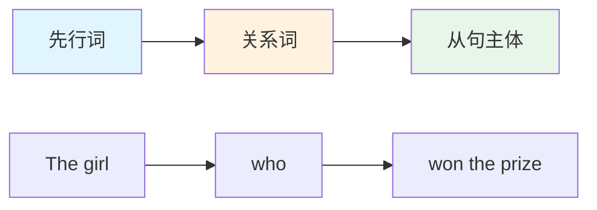
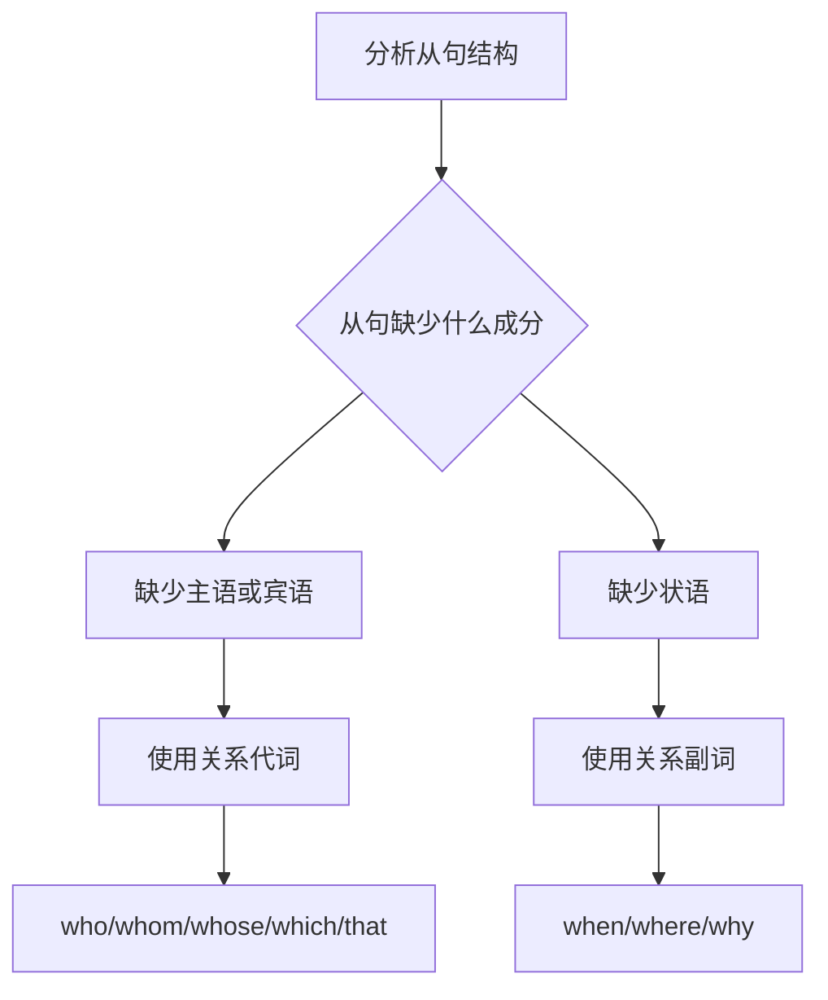
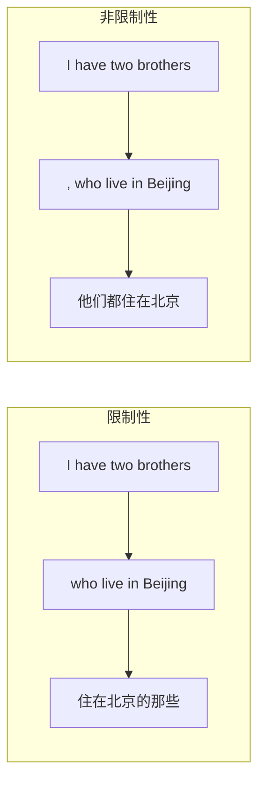
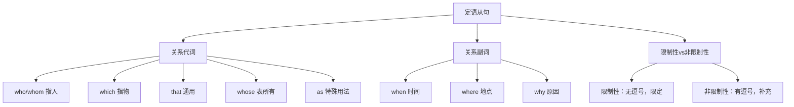

# 定语从句基础

定语从句（Attributive Clause / Relative Clause）是英语中最重要、最常用的从句类型之一。掌握定语从句不仅能让表达更加精准丰富，还能帮助理解复杂的英语长难句。本篇将从基础概念入手，系统讲解定语从句的结构、引导词选择、限制性与非限制性的区别等核心内容。

---

## 1. 定语从句的概念与本质

### 1.1 什么是定语从句

定语从句是一种用来修饰名词或代词的从句，在句中充当定语成分。它相当于一个"加长版"的形容词，用一个完整的句子来描述、限定或说明先行词。

> [!info] 核心概念
>
> **定语从句** = 一个用来修饰名词/代词的句子
>
> **先行词**（Antecedent）= 被定语从句修饰的名词或代词
>
> **关系词**（Relative Word）= 引导定语从句的连接词，包括关系代词和关系副词

**对比理解**：

| 简单定语 | 定语从句 |
| --- | --- |
| a beautiful girl（一个漂亮的女孩） | a girl **who is beautiful**（一个漂亮的女孩） |
| an interesting book（一本有趣的书） | a book **that is interesting**（一本有趣的书） |
| the man in black（穿黑衣服的人） | the man **who wears black**（穿黑衣服的人） |

从上表可以看出，定语从句的作用与形容词相同，都是用来修饰名词。但定语从句能表达更复杂、更具体的信息。

### 1.2 定语从句的结构

定语从句的基本结构由三个部分组成：

```
先行词 + 关系词 + 从句主体
```

**结构图解**：



> [!example] 结构示例
>
> **The man** **who** **lives next door** is a doctor.
>
> - **先行词**：The man（那个人）
> - **关系词**：who（引导从句，同时在从句中作主语）
> - **从句主体**：lives next door（住在隔壁）
> - **整句翻译**：住在隔壁的那个人是医生。

### 1.3 定语从句的位置

定语从句通常紧跟在先行词之后：

| 句子结构 | 示例 |
| --- | --- |
| 先行词 + 定语从句 + 谓语 | The boy **who broke the window** has run away. |
| 主语 + 谓语 + 先行词 + 定语从句 | I know the girl **who won the competition**. |
| 介词 + 先行词 + 定语从句 | He is talking to the man **who helped him**. |

> [!warning] 注意事项
>
> 定语从句应尽量紧跟先行词，避免产生歧义。如果定语从句与先行词之间插入其他成分，可能导致句意不清。
>
> ❌ I saw a man in the park who was running.（歧义：谁在跑？）
>
> ✅ I saw a man who was running in the park.（清晰：那个人在跑）

---

## 2. 关系代词详解

关系代词（Relative Pronouns）是引导定语从句最常用的关系词。它们既起连接作用，又在从句中充当一定的成分（主语、宾语、定语等）。

### 2.1 关系代词一览表

| 关系代词 | 指代对象 | 在从句中的成分 | 示例 |
| --- | --- | --- | --- |
| **who** | 人 | 主语、宾语 | The man **who** called you is my uncle. |
| **whom** | 人 | 宾语 | The girl **whom** I met yesterday is a singer. |
| **whose** | 人/物 | 定语 | The boy **whose** father is a doctor studies hard. |
| **which** | 物/事 | 主语、宾语 | The book **which** you lent me is interesting. |
| **that** | 人/物 | 主语、宾语 | The car **that** he bought is expensive. |
| **as** | 人/物 | 主语、宾语、表语 | Such problems **as** he mentioned are common. |

### 2.2 who 的用法

**who** 用于指代人，在从句中作主语或宾语（作宾语时可用 whom 替代）。

**作主语**：

> [!example] who 作主语
>
> **The teacher who teaches us English is from America.**
>
> 教我们英语的老师来自美国。
>
> - 先行词：The teacher
> - who 在从句中作主语（who teaches us English）

**作宾语**（口语中常见）：

> [!example] who 作宾语
>
> **The man who I saw yesterday is my neighbor.**
>
> 我昨天看到的那个人是我的邻居。
>
> - 先行词：The man
> - who 在从句中作宾语（I saw who）
> - 此处可用 whom 替代：The man whom I saw yesterday...

**更多例句**：

| 英文 | 中文 | 分析 |
| --- | --- | --- |
| The students who passed the exam are very happy. | 通过考试的学生们非常高兴。 | who 作主语 |
| The doctor who treated me was very kind. | 给我治疗的医生非常和蔼。 | who 作主语 |
| The person who you are looking for has left. | 你找的那个人已经离开了。 | who 作宾语 |
| Anyone who wants to join us is welcome. | 任何想加入我们的人都受欢迎。 | who 作主语 |

### 2.3 whom 的用法

**whom** 是 who 的宾格形式，在从句中只能作宾语。在现代英语中，whom 多用于正式语体，口语中常被 who 或 that 替代。

> [!example] whom 作宾语
>
> **The girl whom I love doesn't love me.**
>
> 我爱的那个女孩不爱我。
>
> - 先行词：The girl
> - whom 在从句中作宾语（I love whom）

**介词 + whom 结构**：

当关系代词前有介词时，指人必须用 whom，不能用 who 或 that。

| 英文 | 中文 | 说明 |
| --- | --- | --- |
| The man **to whom** I spoke is the manager. | 我和他说话的那个人是经理。 | 介词 to 提前 |
| The teacher **from whom** I learned English has retired. | 教我英语的那位老师已经退休了。 | 介词 from 提前 |
| The friend **with whom** I traveled is from Japan. | 和我一起旅行的朋友来自日本。 | 介词 with 提前 |

> [!tip] 介词后置时的变化
>
> 如果介词不提前，而是放在从句末尾，则可以用 who/that 替代 whom，或省略关系代词。
>
> - The man **whom** I spoke **to** is the manager.
> - The man **who** I spoke **to** is the manager.
> - The man **that** I spoke **to** is the manager.
> - The man I spoke **to** is the manager.（省略关系代词）

### 2.4 whose 的用法

**whose** 表示"谁的"或"哪个的"，在从句中作定语，修饰后面的名词。whose 既可以指人，也可以指物。

**指人**：

> [!example] whose 指人
>
> **The boy whose father is a policeman is my classmate.**
>
> 父亲是警察的那个男孩是我的同学。
>
> - 先行词：The boy
> - whose 修饰 father，表示"那个男孩的父亲"

**指物**：

> [!example] whose 指物
>
> **The house whose windows are broken will be repaired.**
>
> 窗户破了的那栋房子将被修理。
>
> - 先行词：The house
> - whose 修饰 windows，表示"那栋房子的窗户"

**whose 的替代形式**：

指物时，whose + 名词 可以替换为 the + 名词 + of which 或 of which + the + 名词：

| 表达方式 | 示例 |
| --- | --- |
| whose + 名词 | The house **whose roof** is red... |
| the + 名词 + of which | The house **the roof of which** is red... |
| of which + the + 名词 | The house **of which the roof** is red... |

**更多例句**：

| 英文 | 中文 |
| --- | --- |
| The woman whose son won the prize is my aunt. | 儿子获奖的那位女士是我姑姑。 |
| I know a girl whose mother is a famous writer. | 我认识一个女孩，她妈妈是著名作家。 |
| The car whose engine broke down has been fixed. | 发动机坏了的那辆车已经修好了。 |
| The tree whose leaves have fallen is an oak. | 叶子掉光了的那棵树是橡树。 |

### 2.5 which 的用法

**which** 用于指代物或事，在从句中作主语或宾语。

**作主语**：

> [!example] which 作主语
>
> **The movie which won the award is worth watching.**
>
> 获奖的那部电影值得一看。
>
> - 先行词：The movie
> - which 在从句中作主语

**作宾语**：

> [!example] which 作宾语
>
> **The book which I bought yesterday is very useful.**
>
> 我昨天买的那本书非常有用。
>
> - 先行词：The book
> - which 在从句中作宾语（I bought which）

**介词 + which 结构**：

| 英文 | 中文 | 说明 |
| --- | --- | --- |
| The chair **on which** you are sitting is broken. | 你坐的那把椅子坏了。 | 介词 on 提前 |
| The pen **with which** I wrote the letter is lost. | 我用来写信的那支笔丢了。 | 介词 with 提前 |
| The topic **about which** we discussed is important. | 我们讨论的那个话题很重要。 | 介词 about 提前 |

**which 指代整个句子**：

which 还可以引导非限制性定语从句，指代前面整个主句的内容：

> [!example] which 指代整句
>
> **He passed the exam, which made his parents very happy.**
>
> 他通过了考试，这让他父母非常高兴。
>
> - which 指代"他通过了考试"这整件事

### 2.6 that 的用法

**that** 是最通用的关系代词，既可以指人也可以指物，在从句中作主语或宾语。但 that 有其特殊的使用规则。

**基本用法**：

| 英文 | 中文 | 指代 |
| --- | --- | --- |
| The boy **that** is playing football is my brother. | 正在踢足球的那个男孩是我弟弟。 | 指人 |
| The book **that** you gave me is interesting. | 你给我的那本书很有趣。 | 指物 |

**只能用 that 的情况**：

> [!warning] 必须用 that 的五种情况
>
> 1. **先行词是不定代词**：all, everything, anything, nothing, something, little, much, few, none 等
>
> 2. **先行词被最高级修饰**
>
> 3. **先行词被序数词修饰**
>
> 4. **先行词被 the only, the very, the same, the last 等修饰**
>
> 5. **先行词既有人又有物**

**示例详解**：

| 情况 | 英文示例 | 中文翻译 |
| --- | --- | --- |
| 不定代词 | **All that** glitters is not gold. | 闪光的不都是金子。 |
| 不定代词 | Is there **anything that** I can do for you? | 有什么我能帮你的吗？ |
| 最高级 | This is the best movie **that** I have ever seen. | 这是我看过的最好的电影。 |
| 序数词 | He is the first person **that** arrived. | 他是第一个到达的人。 |
| the only | She is the only student **that** passed the test. | 她是唯一通过测试的学生。 |
| the very | This is the very book **that** I want. | 这正是我想要的那本书。 |
| 人和物 | He talked about the people and things **that** he saw. | 他谈论了他所见到的人和事物。 |

**不能用 that 的情况**：

> [!warning] 不能用 that 的三种情况
>
> 1. **非限制性定语从句中不能用 that**
>
> 2. **介词后面不能用 that**
>
> 3. **指代整个句子时不能用 that**

**错误示例**：

| 错误 | 正确 | 说明 |
| --- | --- | --- |
| ❌ Beijing, that is the capital of China, is beautiful. | ✅ Beijing, **which** is the capital of China, is beautiful. | 非限制性从句 |
| ❌ The pen with that I wrote is lost. | ✅ The pen **with which** I wrote is lost. | 介词后 |
| ❌ He won the game, that surprised us all. | ✅ He won the game, **which** surprised us all. | 指代整句 |

### 2.7 as 的用法

**as** 作为关系代词，主要用于以下两种结构：

**1. such...as 结构**：

> [!example] such...as
>
> **Such books as this are very useful.**
>
> 像这样的书非常有用。
>
> - such 修饰先行词 books
> - as 引导定语从句，在从句中作主语

**2. the same...as 结构**：

> [!example] the same...as
>
> **This is the same watch as I lost.**
>
> 这块表和我丢的那块一样。
>
> - the same 修饰先行词 watch
> - as 引导定语从句

**3. as 引导非限制性定语从句**：

as 可以引导非限制性定语从句，指代整个主句，可放在句首、句中或句末：

| 位置 | 英文示例 | 中文翻译 |
| --- | --- | --- |
| 句首 | **As** is known to all, the earth is round. | 众所周知，地球是圆的。 |
| 句中 | The earth, **as** is known to all, is round. | 地球，众所周知，是圆的。 |
| 句末 | The earth is round, **as** is known to all. | 地球是圆的，这是众所周知的。 |

> [!tip] as 与 which 的区别
>
> - **as** 有"正如、像...一样"的含义，常用于表达与预期一致的情况
> - **which** 没有这层含义，只是客观叙述
> - **as** 可以放在句首，**which** 不可以
>
> 例如：
> - As we expected, he passed the exam.（正如我们所料，他通过了考试。）
> - He passed the exam, which we expected.（他通过了考试，我们预料到了这一点。）

---

## 3. 关系副词详解

关系副词（Relative Adverbs）也可以引导定语从句，在从句中作状语。主要包括 when、where、why 三个。

### 3.1 关系副词一览表

| 关系副词 | 先行词类型 | 在从句中的成分 | 相当于 |
| --- | --- | --- | --- |
| **when** | 时间名词 | 时间状语 | at/in/on which |
| **where** | 地点名词 | 地点状语 | at/in/on which |
| **why** | reason | 原因状语 | for which |

### 3.2 when 的用法

**when** 用于修饰表示时间的先行词，在从句中作时间状语。

> [!example] when 的用法
>
> **I still remember the day when I first met you.**
>
> 我仍然记得第一次见到你的那天。
>
> - 先行词：the day（时间名词）
> - when = on which，在从句中作时间状语

**常见的时间先行词**：

| 先行词 | 示例 |
| --- | --- |
| day | the day **when** he arrived |
| time | the time **when** we were young |
| year | the year **when** I graduated |
| moment | the moment **when** I saw her |
| period | the period **when** he was ill |

**when 与介词 + which 的转换**：

| when 结构 | 介词 + which 结构 |
| --- | --- |
| the day **when** we met | the day **on which** we met |
| the year **when** he was born | the year **in which** he was born |
| the time **when** he called | the time **at which** he called |

**更多例句**：

| 英文 | 中文 |
| --- | --- |
| I'll never forget the moment when I heard the news. | 我永远不会忘记听到那消息的那一刻。 |
| There was a time when I hated math. | 曾经有一段时间我讨厌数学。 |
| The 1990s was a period when China developed rapidly. | 20世纪90年代是中国快速发展的时期。 |

### 3.3 where 的用法

**where** 用于修饰表示地点的先行词，在从句中作地点状语。

> [!example] where 的用法
>
> **This is the house where I was born.**
>
> 这就是我出生的房子。
>
> - 先行词：the house（地点名词）
> - where = in which，在从句中作地点状语

**常见的地点先行词**：

| 先行词 | 示例 |
| --- | --- |
| place | the place **where** we met |
| house | the house **where** he lives |
| city | the city **where** I work |
| country | the country **where** tea originated |
| school | the school **where** I studied |

**where 的抽象地点用法**：

where 不仅可以指具体地点，还可以指抽象的"场合、情况、地步"等：

| 抽象先行词 | 示例 | 翻译 |
| --- | --- | --- |
| situation | a situation **where** nobody knows what to do | 一个没人知道该怎么办的情况 |
| case | a case **where** the rule doesn't apply | 规则不适用的情况 |
| point | the point **where** we disagree | 我们意见分歧的地方 |
| stage | the stage **where** you can make a decision | 你可以做决定的阶段 |

**where 与介词 + which 的转换**：

| where 结构 | 介词 + which 结构 |
| --- | --- |
| the city **where** I live | the city **in which** I live |
| the house **where** he works | the house **at which** he works |
| the corner **where** we met | the corner **at which** we met |

### 3.4 why 的用法

**why** 用于修饰表示原因的先行词（通常是 reason），在从句中作原因状语。

> [!example] why 的用法
>
> **This is the reason why he was late.**
>
> 这就是他迟到的原因。
>
> - 先行词：the reason
> - why = for which，在从句中作原因状语

**why 的使用限制**：

why 的先行词通常只有 reason 一个词，使用范围较窄。

| 英文 | 中文 |
| --- | --- |
| Tell me the reason **why** you did that. | 告诉我你那样做的原因。 |
| I don't know the reason **why** she left. | 我不知道她离开的原因。 |
| The reason **why** he failed is clear. | 他失败的原因很清楚。 |

**why 与 for which 的转换**：

| why 结构 | for which 结构 |
| --- | --- |
| the reason **why** he came | the reason **for which** he came |
| the reason **why** she cried | the reason **for which** she cried |

> [!tip] why 的省略
>
> 在口语和非正式写作中，why 经常被省略：
>
> - The reason (why) I called you is to invite you to dinner.
> - That's the reason (why) he quit his job.

### 3.5 关系副词与关系代词的区分

判断使用关系代词还是关系副词，关键看从句中缺少什么成分：



**对比示例**：

| 句子 | 分析 | 使用 |
| --- | --- | --- |
| This is the place **where** we met. | 从句完整，where 作地点状语 | 关系副词 |
| This is the place **that/which** I visited. | 从句缺宾语，that/which 作宾语 | 关系代词 |
| I remember the day **when** he left. | 从句完整，when 作时间状语 | 关系副词 |
| I remember the day **that** we spent together. | 从句缺宾语，that 作宾语 | 关系代词 |

> [!warning] 常见错误
>
> ❌ This is the school where I studied in.
>
> ✅ This is the school **where** I studied.（where = in which，不需要再加 in）
>
> ✅ This is the school **which** I studied in.（which 作宾语，in 不能省）
>
> ✅ This is the school **in which** I studied.（介词提前）

---

## 4. 限制性与非限制性定语从句

根据定语从句与先行词的关系紧密程度，定语从句分为限制性定语从句和非限制性定语从句两类。

### 4.1 限制性定语从句

**限制性定语从句**（Restrictive/Defining Relative Clause）与先行词关系紧密，用来限定、确定先行词的范围和身份，不可省略，否则句意不完整。

**特点**：

1. 与先行词之间没有逗号
2. 去掉后句意会发生变化或不完整
3. 翻译时通常放在先行词前面

> [!example] 限制性定语从句
>
> **The students who work hard will succeed.**
>
> 努力学习的学生会成功。
>
> - 定语从句限定了"哪些学生"——努力学习的那些
> - 去掉从句后：The students will succeed.（哪些学生？不清楚）

**更多示例**：

| 英文 | 中文 | 分析 |
| --- | --- | --- |
| The man who is standing there is my father. | 站在那儿的那个人是我父亲。 | 限定是哪个人 |
| I like the book which you gave me. | 我喜欢你给我的那本书。 | 限定是哪本书 |
| The reason why he left is unknown. | 他离开的原因不得而知。 | 限定是什么原因 |

### 4.2 非限制性定语从句

**非限制性定语从句**（Non-restrictive/Non-defining Relative Clause）与先行词关系较松散，只对先行词起补充说明作用，去掉后句子主要意思不受影响。

**特点**：

1. 与先行词之间用逗号隔开
2. 去掉后句子主要意思不变
3. 翻译时通常另起一句或用"而/这"等连接

> [!example] 非限制性定语从句
>
> **My father, who is 60 years old, still works every day.**
>
> 我父亲今年60岁了，他仍然每天工作。
>
> - 定语从句补充说明父亲的年龄
> - 去掉从句后：My father still works every day.（句意完整）

**更多示例**：

| 英文 | 中文 | 分析 |
| --- | --- | --- |
| Beijing, which is the capital of China, has a long history. | 北京是中国的首都，有着悠久的历史。 | 补充说明北京 |
| He gave me a book, which I have read twice. | 他给了我一本书，我已经读了两遍了。 | 补充说明书 |
| She passed the exam, which made her parents happy. | 她通过了考试，这让她父母很高兴。 | which 指代整句 |

### 4.3 两者的核心区别

| 对比项 | 限制性定语从句 | 非限制性定语从句 |
| --- | --- | --- |
| **标点** | 无逗号 | 有逗号隔开 |
| **作用** | 限定先行词，不可省 | 补充说明，可省略 |
| **that** | 可用 that | 不能用 that |
| **关系代词省略** | 作宾语时可省略 | 不能省略 |
| **指代整句** | 不可以 | which/as 可以 |
| **翻译方式** | 放在先行词前 | 另起一句或用连接词 |

**对比示例**：

> [!example] 限制性 vs 非限制性
>
> **限制性**：I have a sister **who works in a bank**.
>
> 我有一个在银行工作的姐姐。（暗示可能还有其他姐姐）
>
> **非限制性**：I have a sister**, who works in a bank**.
>
> 我有一个姐姐，她在银行工作。（只有一个姐姐）



### 4.4 非限制性定语从句的特殊用法

**1. 指代整个主句**：

非限制性定语从句可以用 which 或 as 指代前面整个主句的内容：

| 英文 | 中文 |
| --- | --- |
| He won the first prize, **which** surprised everyone. | 他获得了一等奖，这让大家都很惊讶。 |
| **As** we all know, smoking is harmful to health. | 众所周知，吸烟有害健康。 |
| She married him, **which** I didn't expect. | 她嫁给了他，这出乎我的意料。 |

**2. 修饰专有名词**：

专有名词（人名、地名、国名等）后面通常用非限制性定语从句：

| 英文 | 中文 |
| --- | --- |
| Shakespeare, **who** wrote many plays, was a great writer. | 莎士比亚写了许多戏剧，他是一位伟大的作家。 |
| The Great Wall, **which** is in China, is world-famous. | 长城在中国，举世闻名。 |
| Tom, **whom** I met yesterday, is a doctor. | 汤姆是我昨天遇到的，他是一名医生。 |

**3. 修饰独一无二的事物**：

当先行词是独一无二的事物时，通常用非限制性定语从句：

| 英文 | 中文 |
| --- | --- |
| The sun, **which** rises in the east, gives us light. | 太阳从东方升起，给我们带来光明。 |
| The moon, **which** is our satellite, goes around the earth. | 月球是我们的卫星，绕着地球转。 |

---

## 5. 关系代词的省略

在某些情况下，引导定语从句的关系代词可以省略。

### 5.1 可以省略的情况

**关系代词在从句中作宾语时可以省略**：

> [!info] 省略条件
>
> 关系代词在限制性定语从句中作**宾语**（包括动词宾语和介词宾语，但介词不能提前）时，可以省略。

**示例**：

| 完整形式 | 省略形式 | 分析 |
| --- | --- | --- |
| The book **that** I bought is good. | The book I bought is good. | that 作宾语，可省 |
| The man **whom** I met is a doctor. | The man I met is a doctor. | whom 作宾语，可省 |
| The movie **which** we saw was exciting. | The movie we saw was exciting. | which 作宾语，可省 |
| The girl **who** I love is beautiful. | The girl I love is beautiful. | who 作宾语，可省 |

**介词后置时可省略**：

| 完整形式 | 省略形式 |
| --- | --- |
| The pen **which** I wrote with is lost. | The pen I wrote with is lost. |
| The man **whom** I spoke to is kind. | The man I spoke to is kind. |

### 5.2 不能省略的情况

> [!warning] 不能省略的四种情况
>
> 1. **关系代词作主语时**不能省略
>
> 2. **非限制性定语从句中**不能省略
>
> 3. **介词提前时**不能省略
>
> 4. **whose** 不能省略

**示例**：

| 情况 | 示例 | 说明 |
| --- | --- | --- |
| 作主语 | The man **who** lives here is a teacher. | ❌ 不能省略 who |
| 非限制性 | Tom, **whom** I know well, is coming. | ❌ 不能省略 whom |
| 介词提前 | The pen **with which** I wrote is lost. | ❌ 不能省略 which |
| whose | The boy **whose** bag was stolen cried. | ❌ 不能省略 whose |

---

## 6. 定语从句的翻译技巧

### 6.1 限制性定语从句的翻译

**前置法**：将定语从句翻译成"...的"放在先行词前面：

| 英文 | 中文 |
| --- | --- |
| The girl **who is singing** is my sister. | **唱歌的**那个女孩是我妹妹。 |
| I like the book **that you gave me**. | 我喜欢**你给我的**那本书。 |
| This is the factory **where my father works**. | 这就是**我父亲工作的**那家工厂。 |

### 6.2 非限制性定语从句的翻译

**后置法/另起一句**：将定语从句翻译成独立的句子，用"他/她/它/这"等代词衔接：

| 英文 | 中文 |
| --- | --- |
| My brother, **who lives in Beijing**, is a doctor. | 我哥哥住在北京，**他**是一名医生。 |
| He bought a car, **which cost him 100,000 yuan**. | 他买了一辆车，**这辆车**花了他10万元。 |
| She passed the exam, **which made us happy**. | 她通过了考试，**这**让我们很高兴。 |

### 6.3 长定语从句的处理

当定语从句较长时，可以采用以下方法：

**1. 拆分法**：将定语从句拆分成独立的句子

| 英文 | 中文 |
| --- | --- |
| The man who I met in the park yesterday and who is from America is a famous scientist. | 我昨天在公园遇到的那个人来自美国，他是一位著名的科学家。 |

**2. 融合法**：将定语从句的意思融入主句

| 英文 | 中文 |
| --- | --- |
| China, which has a population of 1.4 billion, is developing rapidly. | 拥有14亿人口的中国正在快速发展。 |

### 6.4 翻译实践

> [!example] 翻译练习
>
> **1.** The scientist who discovered this phenomenon won the Nobel Prize.
>
> 译：发现这一现象的那位科学家获得了诺贝尔奖。
>
> **2.** Einstein, who was born in Germany, is famous for his theory of relativity.
>
> 译：爱因斯坦出生于德国，他因相对论而闻名于世。
>
> **3.** I'll never forget the day when I graduated from college.
>
> 译：我永远不会忘记大学毕业的那一天。
>
> **4.** This is the reason why he refused to help us.
>
> 译：这就是他拒绝帮助我们的原因。

---

## 7. 定语从句常见错误分析

### 7.1 关系词选择错误

**错误1：该用 whom 却用 who**

| 错误 | 正确 | 说明 |
| --- | --- | --- |
| ❌ The man to who I spoke... | ✅ The man **to whom** I spoke... | 介词后用 whom |

**错误2：该用 whose 却用 who's**

| 错误 | 正确 | 说明 |
| --- | --- | --- |
| ❌ The boy who's father is a doctor... | ✅ The boy **whose** father is a doctor... | whose 表所有格 |

**错误3：非限制性从句用 that**

| 错误 | 正确 | 说明 |
| --- | --- | --- |
| ❌ Beijing, that is the capital... | ✅ Beijing, **which** is the capital... | 非限制性不用 that |

### 7.2 关系词与介词搭配错误

**错误4：介词使用不当**

| 错误 | 正确 | 说明 |
| --- | --- | --- |
| ❌ The house which he lives is old. | ✅ The house **where**/in which he lives is old. | 缺少介词 |
| ❌ The day which I met her was sunny. | ✅ The day **when**/on which I met her was sunny. | 需要时间状语 |

### 7.3 关系词与成分重复

**错误5：关系词与代词重复**

| 错误 | 正确 | 说明 |
| --- | --- | --- |
| ❌ The man who **he** came here is my uncle. | ✅ The man **who** came here is my uncle. | who 已作主语 |
| ❌ The book which I bought **it** is good. | ✅ The book **which** I bought is good. | which 已作宾语 |

### 7.4 关系副词与关系代词混用

**错误6：混用 where 和 which/that**

| 错误 | 正确 | 说明 |
| --- | --- | --- |
| ❌ This is the school where I visited. | ✅ This is the school **which** I visited. | visited 需要宾语 |
| ❌ This is the school which I studied. | ✅ This is the school **where** I studied. | studied 不需宾语 |

### 7.5 先行词与关系词不匹配

**错误7：指物用 who**

| 错误 | 正确 | 说明 |
| --- | --- | --- |
| ❌ The book who I bought... | ✅ The book **which/that** I bought... | 指物用 which/that |

**错误8：指人用 which**

| 错误 | 正确 | 说明 |
| --- | --- | --- |
| ❌ The teacher which teaches us... | ✅ The teacher **who/that** teaches us... | 指人用 who/that |

---

## 8. 定语从句综合练习

### 8.1 选择填空

> [!example] 练习题
>
> **1.** The girl ______ is standing there is my sister.
>
> A. who  B. whom  C. which  D. whose
>
> **答案**：A（who 在从句中作主语）
>
> **2.** Is this the factory ______ you visited last week?
>
> A. where  B. which  C. what  D. when
>
> **答案**：B（visited 需要宾语，用 which）
>
> **3.** I still remember the day ______ I first came to Beijing.
>
> A. that  B. which  C. when  D. where
>
> **答案**：C（从句完整，需要时间状语 when）
>
> **4.** This is the best film ______ I have ever seen.
>
> A. which  B. that  C. what  D. who
>
> **答案**：B（最高级后只能用 that）
>
> **5.** The reason ______ he was late is unknown.
>
> A. that  B. which  C. why  D. what
>
> **答案**：C（reason 后用 why）

### 8.2 改错练习

> [!example] 改错题
>
> **1.** ❌ The man whom is talking to my mother is my teacher.
>
> ✅ The man **who** is talking to my mother is my teacher.
>
> （作主语用 who）
>
> **2.** ❌ This is all what I can do for you.
>
> ✅ This is all **that** I can do for you.
>
> （all 后用 that 不用 what）
>
> **3.** ❌ The factory where we visited yesterday is very large.
>
> ✅ The factory **which/that** we visited yesterday is very large.
>
> （visited 需要宾语）
>
> **4.** ❌ He is one of the students who works hard.
>
> ✅ He is one of the students who **work** hard.
>
> （先行词是 students，从句谓语用复数）
>
> **5.** ❌ I have a sister, that works in a hospital.
>
> ✅ I have a sister, **who** works in a hospital.
>
> （非限制性从句不用 that）

---

## 9. 定语从句学习小结

### 9.1 核心要点回顾



### 9.2 关系词选择速查表

| 先行词 | 作主语 | 作宾语 | 作定语 | 作状语 |
| --- | --- | --- | --- | --- |
| 人 | who/that | whom/who/that/省略 | whose | — |
| 物 | which/that | which/that/省略 | whose/of which | — |
| 时间 | — | — | — | when |
| 地点 | — | — | — | where |
| 原因 | — | — | — | why |

### 9.3 学习建议

> [!tip] 学习定语从句的要点
>
> 1. **理解本质**：定语从句就是用一个句子修饰名词
>
> 2. **分析成分**：判断关系词在从句中充当什么成分
>
> 3. **区分类型**：注意限制性与非限制性的区别
>
> 4. **多读多练**：通过大量阅读和练习培养语感
>
> 5. **注意搭配**：掌握固定结构如 such...as, the same...as 等

定语从句是英语中最重要的从句类型之一，掌握好定语从句不仅能提高写作水平，还能帮助理解复杂的英语长难句。建议在学习过程中多做练习，多分析真实语料中的定语从句用法，逐步培养语感和实际运用能力。

---

**下一篇预告**：[[02.定语从句进阶]] 将深入讲解定语从句的高级用法，包括介词+关系代词结构、"one of + 复数名词 + 定语从句"的主谓一致、定语从句与同位语从句的区别等内容。
