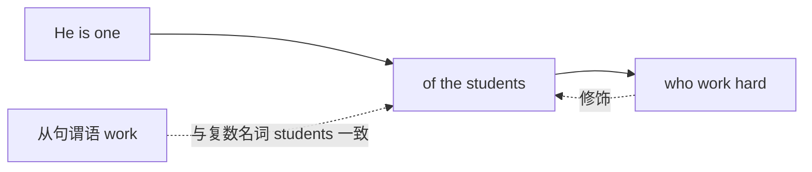
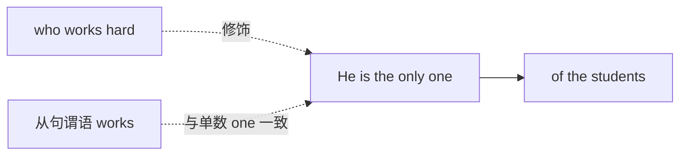
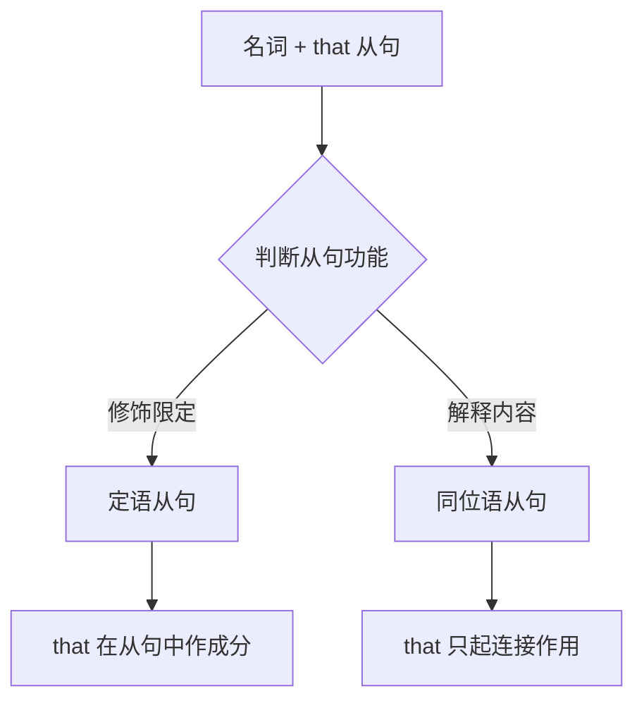
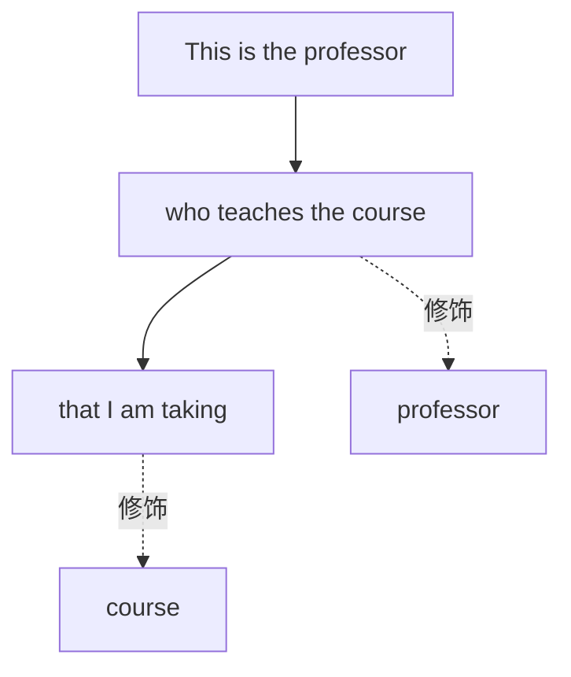
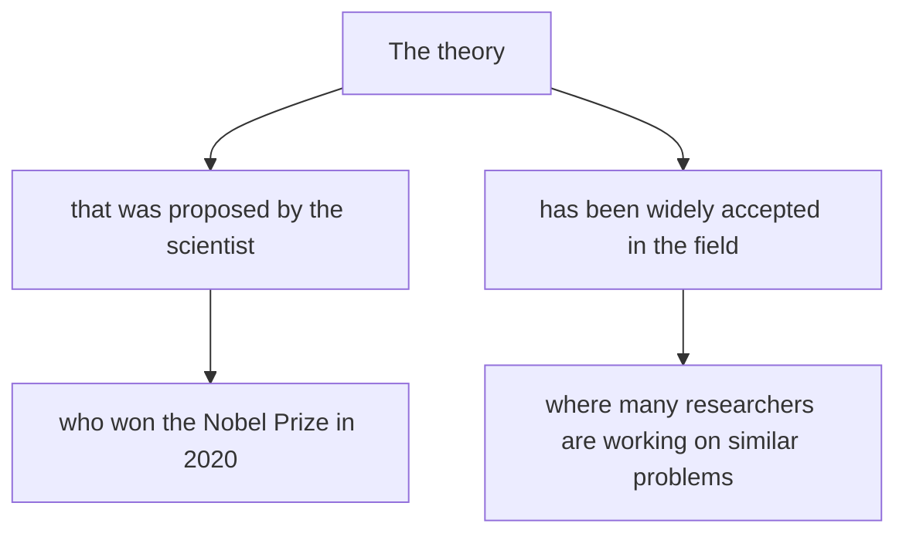

# 定语从句进阶

在掌握了定语从句的基础知识后，我们需要进一步深入学习一些更复杂、更精细的用法。这些进阶内容不仅是各类英语考试的重点难点，更是理解和运用地道英语表达的关键。本章将系统讲解介词与关系代词的搭配、特殊结构中的主谓一致、定语从句与同位语从句的区分、省略与倒装现象，以及如何分析复杂的多重定语从句。

---

## 1. 介词 + 关系代词结构

### 1.1 结构概述与形成原理

在定语从句中，当关系代词在从句中充当介词的宾语时，介词既可以放在关系代词之前，也可以放在从句末尾。当介词前置时，就形成了"介词 + 关系代词"的结构。

> [!info] 核心概念
>
> "介词 + 关系代词"结构是将原本位于从句末尾的介词移到关系代词之前，形成更为正式、书面化的表达方式。这种结构在学术写作和正式文体中尤为常见。

**结构形成过程示例**：

```
原句：This is the house. + I was born in the house.
                                          ↓ (介词宾语)
合并（介词在末尾）：This is the house which/that I was born in.
合并（介词前置）：This is the house in which I was born.
```

介词前置后，句子结构更加紧凑，语义关系更加明确。

### 1.2 介词前置的基本规则

#### 1.2.1 只能用 which 或 whom

当介词前置时，关系代词只能使用 **which**（指物）或 **whom**（指人），不能使用 **that** 或 **who**。

| 正确用法 | 错误用法 |
| --- | --- |
| the book **in which** I found... | ❌ the book in that I found... |
| the man **to whom** I spoke... | ❌ the man to who I spoke... |
| the way **by which** we solved... | ❌ the way by that we solved... |

**例句对比**：

```
✅ The person to whom you should speak is Mr. Johnson.
   你应该与之交谈的人是约翰逊先生。

❌ The person to who you should speak is Mr. Johnson.
   （错误：介词后不能用 who）

✅ The tool with which we completed the project was expensive.
   我们用来完成项目的那个工具很昂贵。

❌ The tool with that we completed the project was expensive.
   （错误：介词后不能用 that）
```

#### 1.2.2 关系代词不可省略

当介词前置时，关系代词绝对不能省略。相比之下，当介词位于从句末尾时，关系代词在口语中可以省略。

```
✅ This is the issue about which we argued.
   这就是我们争论的那个问题。

✅ This is the issue (which/that) we argued about.
   这就是我们争论的那个问题。（关系代词可省略）

❌ This is the issue about we argued.
   （错误：介词前置时关系代词不可省略）
```

### 1.3 常见介词 + 关系代词搭配

不同的介词与关系代词搭配，表达不同的语义关系。以下是最常见的搭配类型：

#### 1.3.1 表示地点：in which / at which / on which

```
The city in which I grew up has changed a lot.
我成长的那座城市已经发生了很大变化。
（in which = where，表示"在……里面"）

The hotel at which we stayed was very comfortable.
我们住的那家酒店非常舒适。
（at which 表示"在……处"）

The island on which they built the lighthouse is very small.
他们建造灯塔的那个岛非常小。
（on which 表示"在……上面"）
```

> [!tip] 转换技巧
>
> "介词 + which" 表示地点时，通常可以用关系副词 **where** 替换：
> - in which = where
> - at which = where
> - on which = where（某些情况）

#### 1.3.2 表示时间：in which / on which / during which

```
The year in which he was born was 1990.
他出生的那一年是1990年。
（in which = when）

The day on which we met was unforgettable.
我们相遇的那一天令人难忘。
（on which = when）

The period during which he worked here was very productive.
他在这里工作的那段时期非常高效。
（during which 强调"在……期间"）
```

#### 1.3.3 表示原因：for which

```
The reason for which he resigned remains unclear.
他辞职的原因仍不清楚。
（for which = why）

The cause for which they are fighting is just.
他们为之奋斗的事业是正义的。
```

#### 1.3.4 表示方式：in which / by which / through which

```
The way in which she solved the problem was creative.
她解决问题的方式很有创意。
（in which 可省略，直接说 the way she solved...）

The method by which the data was collected is reliable.
收集数据的方法是可靠的。

The channel through which information flows is important.
信息流通的渠道很重要。
```

#### 1.3.5 表示所属或关联：of which / of whom

```
The house, the roof of which was damaged, needs repair.
那座房子的屋顶损坏了，需要修缮。
（of which = whose，表示所属关系）

She has three sons, two of whom are doctors.
她有三个儿子，其中两个是医生。
（of whom 表示部分与整体的关系）

The committee consists of ten members, all of whom are experts.
委员会由十名成员组成，他们全都是专家。
```

> [!warning] of which 与 whose 的区别
>
> 虽然 "of which" 有时可以替换 whose，但用法有细微差别：
> - **whose + 名词**：The man whose car was stolen...（更自然）
> - **the + 名词 + of which**：The man the car of which was stolen...（较生硬）
> - **of which the + 名词**：The house of which the roof...（正式但不常用）
>
> 一般情况下，指人时优先用 whose，指物时两者都可以。

### 1.4 介词的选择依据

选择哪个介词，主要取决于以下几个因素：

#### 1.4.1 从句中动词或形容词的固定搭配

```
The topic about which we talked was interesting.
我们谈论的那个话题很有趣。
（talk about 固定搭配）

The goal for which we are striving is world peace.
我们正在努力的目标是世界和平。
（strive for 固定搭配）

The decision on which everything depends was made yesterday.
一切都取决于的那个决定昨天做出了。
（depend on 固定搭配）
```

#### 1.4.2 先行词与介词的习惯搭配

```
The reason for which he came...（reason for）
The way in which she works...（way of/in）
The time at which it happened...（at + 具体时间点）
The place in which we met...（in + 封闭空间）
```

#### 1.4.3 语义逻辑的需要

```
The bridge over which the train passed collapsed.
火车经过的那座桥塌了。
（over 表示"从上方经过"）

The wall against which he leaned was very cold.
他倚靠的那面墙非常冷。
（against 表示"倚靠、抵着"）

The cliff from which he jumped was 30 meters high.
他跳下的那个悬崖有30米高。
（from 表示"从……离开"）
```

### 1.5 复合介词 + 关系代词

除了简单介词，复合介词也可以与关系代词搭配使用：

| 复合介词 | 例句 |
| --- | --- |
| according to which | The rules according to which we operate... 我们据以运作的那些规则 |
| because of which | The accident because of which he was late... 导致他迟到的那场事故 |
| in front of which | The building in front of which we parked... 我们停车的那栋楼前面 |
| instead of which | He chose A instead of B, instead of which he should have... |
| in spite of which | The difficulties in spite of which we succeeded... 尽管有困难我们仍成功 |
| as a result of which | The earthquake as a result of which many died... 导致许多人死亡的那场地震 |

```
The meeting, as a result of which the policy was changed, lasted five hours.
那场导致政策改变的会议持续了五个小时。

The principle, according to which all decisions are made, is fairness.
所有决定都据以做出的那个原则就是公平。
```

### 1.6 介词位置的选择：前置 vs 后置

> [!example] 语体风格对比
>
> **正式/书面语**：介词前置
> - The committee to which the report was submitted...
>
> **非正式/口语**：介词后置
> - The committee which the report was submitted to...
>
> **最口语化**：省略关系代词，介词后置
> - The committee the report was submitted to...

**详细对比**：

| 风格 | 例句 | 适用场景 |
| --- | --- | --- |
| 正式书面 | The matter about which I wish to speak is serious. | 学术论文、法律文书、正式演讲 |
| 一般书面 | The matter which I wish to speak about is serious. | 普通文章、商务邮件 |
| 口语非正式 | The matter (that) I wish to speak about is serious. | 日常对话、非正式写作 |

---

## 2. "one of + 复数名词 + 定语从句"的主谓一致

### 2.1 基本结构与核心规则

这是定语从句中一个极易出错的语法点。当 "one of + 复数名词" 后面跟定语从句时，从句的谓语动词形式取决于定语从句修饰的是哪个词。

> [!warning] 关键区分
>
> - **one of the + 复数名词 + 定语从句**：从句修饰复数名词，谓语用**复数**
> - **the only one of the + 复数名词 + 定语从句**：从句修饰 one，谓语用**单数**

### 2.2 "one of the + 复数名词"结构

在这个结构中，定语从句的先行词是**复数名词**，因此从句谓语动词用**复数形式**。

```
He is one of the students who work hard.
他是努力学习的学生之一。
```

**句法分析**：



这个句子的逻辑是：有一群努力学习的学生（students who work hard），他是其中之一（one of them）。定语从句 "who work hard" 修饰的是 "students"，所以谓语用复数 work。

**更多例句**：

```
She is one of the few teachers who truly understand students.
她是少数真正理解学生的老师之一。
（who understand，因为修饰 teachers）

This is one of the books that have influenced me deeply.
这是深深影响过我的书籍之一。
（that have，因为修饰 books）

Tom is one of the boys who were selected for the team.
汤姆是被选入球队的男孩之一。
（who were，因为修饰 boys）
```

### 2.3 "the only one of the + 复数名词"结构

当在 one 前面加上 **the only / the very / the first / the last** 等限定词时，定语从句修饰的是 **one**（单数），从句谓语动词用**单数形式**。

```
He is the only one of the students who works hard.
他是学生中唯一一个努力学习的。
```

**句法分析**：



这个句子的逻辑是：在所有学生中，只有一个人努力学习（the only one who works hard），他就是这个人。定语从句 "who works hard" 修饰的是 "the only one"，所以谓语用单数 works。

**更多例句**：

```
She is the only one of my friends who has visited Japan.
她是我朋友中唯一一个去过日本的。
（who has，因为修饰 the only one）

This is the first one of the proposals that has been approved.
这是第一个被批准的提案。
（that has，因为修饰 the first one）

He was the last one of the competitors who was still standing.
他是最后一个还站着的参赛者。
（who was，因为修饰 the last one）
```

### 2.4 对比表格

| 结构 | 从句修饰对象 | 谓语形式 | 例句 |
| --- | --- | --- | --- |
| one of the + 复数名词 | 复数名词 | 复数 | one of the girls who **are**... |
| the only one of the + 复数名词 | the only one | 单数 | the only one of the girls who **is**... |
| the first one of the + 复数名词 | the first one | 单数 | the first one of the books that **was**... |
| the very one of the + 复数名词 | the very one | 单数 | the very one of them who **knows**... |

### 2.5 判断技巧

> [!tip] 快速判断方法
>
> 1. 找到 "one" 前面有没有 **the only / the first / the last / the very** 等限定词
> 2. **有限定词** → 从句修饰 one → 谓语**单数**
> 3. **无限定词** → 从句修饰复数名词 → 谓语**复数**

**练习辨析**：

```
① Jack is one of the boys who (is/are) good at math.
   答案：are（修饰 boys）

② Jack is the only one of the boys who (is/are) good at math.
   答案：is（修饰 the only one）

③ This is one of the most interesting movies that (has/have) been released this year.
   答案：have（修饰 movies）

④ This is the first one of the movies that (has/have) won an Oscar.
   答案：has（修饰 the first one）
```

---

## 3. 定语从句与同位语从句的区别

定语从句和同位语从句在形式上极为相似，都可以由 that 引导，都跟在名词后面。但它们的本质和功能完全不同。准确区分这两种从句是英语学习的重难点之一。

### 3.1 本质区别

> [!info] 核心概念
>
> - **定语从句**：对先行词进行**修饰和限定**，说明先行词是"什么样的"
> - **同位语从句**：对先行词进行**解释和说明**，说明先行词的"具体内容"



### 3.2 引导词 that 的功能差异

这是区分两种从句最根本的方法：

| 从句类型 | that 的功能 | that 能否省略 |
| --- | --- | --- |
| 定语从句 | 作从句成分（主语、宾语、表语） | 作宾语时可省略 |
| 同位语从句 | 只起连接作用，不作任何成分 | 一般不省略 |

**定语从句中 that 作成分**：

```
The news that he told me was surprising.
他告诉我的那个消息令人惊讶。
```
- that 在从句中作 told 的宾语（he told me the news）
- 从句意思不完整：he told me ___（缺宾语）

**同位语从句中 that 不作成分**：

```
The news that he had passed the exam was surprising.
他通过考试的消息令人惊讶。
```
- that 不作任何成分，只起连接作用
- 从句意思完整：he had passed the exam（主谓宾齐全）

### 3.3 先行词的差异

同位语从句的先行词通常是**抽象名词**，表示某种观念、想法或信息：

| 常见先行词 | 例句 |
| --- | --- |
| news（消息） | The news that war had broken out shocked everyone. |
| fact（事实） | The fact that the earth is round is known to all. |
| idea（想法） | I have no idea that he would come. |
| belief（信念） | The belief that hard work pays off motivates him. |
| hope（希望） | There is hope that the situation will improve. |
| doubt（怀疑） | I have no doubt that he will succeed. |
| thought（想法） | The thought that she might fail scared her. |
| evidence（证据） | There is evidence that he was at the scene. |
| possibility（可能性） | The possibility that he was lying occurred to me. |
| rumor（谣言） | The rumor that they were getting divorced spread quickly. |

> [!warning] 注意
>
> 并非所有抽象名词后的 that 从句都是同位语从句。关键是看 that 是否在从句中作成分，以及从句是否解释先行词的内容。

### 3.4 语义关系的差异

**定语从句**与先行词是**修饰关系**（从句描述先行词的特征）：

```
The rumor that he spread turned out to be false.
他散布的那个谣言被证明是假的。
```
- 从句说明是"哪个谣言"（他散布的那个）
- 可以理解为：He spread the rumor.

**同位语从句**与先行词是**同位关系**（从句等于先行词的内容）：

```
The rumor that he was a spy turned out to be false.
他是间谍的谣言被证明是假的。
```
- 从句说明谣言的"具体内容"（他是间谍）
- 可以理解为：The rumor = He was a spy.

### 3.5 引导词的差异

**定语从句**可由多种关系词引导：that, which, who, whom, whose, when, where, why

**同位语从句**主要由 that 引导，有时用 whether, what, when, where, how, why（疑问词）

```
定语从句（多种引导词）：
- The man who came yesterday... (who)
- The book which I bought... (which)
- The reason why he left... (why)
- The place where we met... (where)

同位语从句（主要用 that 或疑问词）：
- The question whether he should go... (whether)
- The problem how we should solve it... (how)
- The question when we should start... (when)
- The idea that we should cooperate... (that)
```

### 3.6 能否用 which 替换 that

**定语从句**：指物时，that 通常可以用 which 替换

```
The book that/which I read was interesting.
我读的那本书很有趣。
```

**同位语从句**：that 不能用 which 替换

```
The news that she had won was exciting.
她获胜的消息令人兴奋。
（不能说：The news which she had won...）
```

### 3.7 综合辨析练习

分析以下句子，判断是定语从句还是同位语从句：

```
① The fact that he mentioned surprised us.
   定语从句。that 作 mentioned 的宾语，意为"他提到的那个事实"。

② The fact that he was innocent surprised us.
   同位语从句。that 不作成分，从句解释 fact 的内容，意为"他是无辜的这个事实"。

③ The news that she brought was bad.
   定语从句。that 作 brought 的宾语，意为"她带来的那个消息"。

④ The news that she was promoted was good.
   同位语从句。that 不作成分，从句解释 news 的内容，意为"她升职了的消息"。

⑤ Do you know the reason that he gave for being late?
   定语从句。that 作 gave 的宾语，意为"他给出的那个理由"。

⑥ The reason that he was late was the traffic jam.
   同位语从句。that 不作成分，从句解释 reason 的内容，意为"他迟到的原因"。
```

### 3.8 区分方法总结

> [!tip] 五步判断法
>
> 1. **看先行词**：是否为表示观念、信息的抽象名词？
> 2. **看 that 功能**：在从句中是否作成分？
> 3. **看从句完整性**：去掉 that 后从句是否意思完整？
> 4. **看能否替换**：that 能否换成 which？
> 5. **看语义关系**：从句是修饰先行词还是解释先行词的内容？

| 判断标准 | 定语从句 | 同位语从句 |
| --- | --- | --- |
| that 的成分 | 作主/宾/表语 | 不作任何成分 |
| 从句完整性 | 不完整（缺成分） | 完整 |
| 能否用 which | 可以（指物时） | 不可以 |
| 语义关系 | 修饰限定 | 解释说明 |
| 先行词类型 | 各种名词 | 多为抽象名词 |

---

## 4. 定语从句的省略

在某些情况下，定语从句中的部分成分可以省略，使句子更加简洁。了解这些省略规则对于阅读理解和写作都非常重要。

### 4.1 关系代词的省略

#### 4.1.1 作宾语时可省略

当关系代词在定语从句中作**动词宾语或介词宾语**（介词位于从句末尾）时，可以省略。

```
The book (which/that) I bought yesterday is interesting.
我昨天买的那本书很有趣。
（which/that 作 bought 的宾语，可省略）

The man (whom/who/that) you met is my uncle.
你遇见的那个人是我叔叔。
（whom/who/that 作 met 的宾语，可省略）

The house (which/that) we live in is very old.
我们住的那栋房子很老。
（which/that 作介词 in 的宾语，可省略）
```

> [!warning] 不能省略的情况
>
> - 关系代词作**主语**时不能省略
> - **介词前置**时，关系代词不能省略
> - **非限制性定语从句**中，关系代词不能省略

```
❌ The man came yesterday is my friend.
   （who 作主语，不能省略）
✅ The man who came yesterday is my friend.

❌ The house in we live is old.
   （介词前置，which 不能省略）
✅ The house in which we live is old.

❌ Tom, I met yesterday, is very kind.
   （非限制性定语从句，whom 不能省略）
✅ Tom, whom I met yesterday, is very kind.
```

#### 4.1.2 作表语时可省略

在限制性定语从句中，当关系代词作表语时，可以省略。

```
He is not the man (that) he used to be.
他不再是以前的那个人了。
（that 作 be 的表语，可省略）

She is no longer the girl (that) she was ten years ago.
她不再是十年前的那个女孩了。
```

### 4.2 关系代词 + be 动词的省略

当定语从句为"关系代词 + be + 现在分词/过去分词/形容词/介词短语"结构时，可以省略"关系代词 + be"。

#### 4.2.1 省略后保留现在分词

```
完整形式：The man who is standing there is my father.
省略后：The man standing there is my father.
站在那里的那个人是我父亲。

完整形式：Anyone who is wanting to join should apply now.
省略后：Anyone wanting to join should apply now.
任何想加入的人现在应该申请。
```

#### 4.2.2 省略后保留过去分词

```
完整形式：The bridge which was built last year has collapsed.
省略后：The bridge built last year has collapsed.
去年建造的那座桥塌了。

完整形式：The letter that was written in French is from my pen pal.
省略后：The letter written in French is from my pen pal.
用法语写的那封信是我笔友写的。
```

#### 4.2.3 省略后保留形容词

```
完整形式：All the students who are present should sign the form.
省略后：All the students present should sign the form.
所有在场的学生都应该在表格上签名。

完整形式：The only solution that is possible is to negotiate.
省略后：The only solution possible is to negotiate.
唯一可能的解决方案是谈判。
```

#### 4.2.4 省略后保留介词短语

```
完整形式：The girl who is in red is my sister.
省略后：The girl in red is my sister.
穿红衣服的那个女孩是我妹妹。

完整形式：The book which is on the table is mine.
省略后：The book on the table is mine.
桌上的那本书是我的。
```

### 4.3 the way 引导的定语从句

当先行词是 **the way** 时，引导定语从句有三种形式，意思相同：

| 形式 | 例句 |
| --- | --- |
| the way + that | I don't like the way that he talks. |
| the way + in which | I don't like the way in which he talks. |
| the way + ∅（省略） | I don't like the way he talks. |

```
The way (that/in which) she solved the problem was brilliant.
她解决问题的方式非常出色。

I was impressed by the way (that/in which) he handled the crisis.
我对他处理危机的方式印象深刻。
```

> [!warning] 注意
>
> **the way** 后面不能同时使用 how：
> - ❌ I don't like the way how he talks.
> - ✅ I don't like the way he talks.
> - ✅ I don't like how he talks.

### 4.4 省略导致的歧义

有时省略可能导致句子歧义，需要根据上下文判断。

```
The man I saw yesterday told me the news.
```

这句话可能有两种理解：
1. 我昨天看见的那个人告诉了我这个消息。
2. 我昨天看见那个人时，他告诉了我这个消息。

为避免歧义，在正式写作中应保留关系代词：

```
The man whom I saw yesterday told me the news.
（明确表示"我昨天看见的那个人"）
```

---

## 5. 定语从句的倒装

虽然定语从句中的倒装不如主句倒装常见，但在某些特定结构中确实会出现。

### 5.1 表语前置的倒装

当定语从句的表语位于从句开头时，从句使用"表语 + 系动词 + 主语"的倒装结构。

```
He is not the hero (that) he was considered to be.
→ He is not the hero considered to be what he was.
   他并不是人们认为的那种英雄。

China is no longer the country (that) it used to be.
中国不再是以前的那个国家了。
```

### 5.2 介词短语引起的倒装

在某些定语从句中，为了强调或使句子更加流畅，可能出现部分倒装。

```
There are some books on the shelf, among which is a dictionary.
书架上有一些书，其中有一本词典。
（among which is = a dictionary is among which）

He has two sons, the elder of whom works in Beijing.
他有两个儿子，其中年长的那个在北京工作。
```

### 5.3 as 引导的非限制性定语从句

as 引导非限制性定语从句时，从句可置于主句之前、之中或之后：

```
As is known to all, the earth moves around the sun.
众所周知，地球绕着太阳转。
（as 从句在主句前，as 指代整个主句内容）

He is a teacher, as is evident from his manner.
他是一位老师，这从他的举止就能看出来。
（as 从句在主句后）

Earthquakes, as we all know, are natural disasters.
地震，众所周知，是自然灾害。
（as 从句在主句中间）
```

---

## 6. 复杂定语从句的分析技巧

在实际阅读中，我们经常会遇到结构复杂、层层嵌套的定语从句。掌握正确的分析方法，是理解这些复杂句子的关键。

### 6.1 多重定语从句（从句套从句）

有时一个定语从句内部还可以包含另一个定语从句，形成多层嵌套结构。

```
The book that you lent me that was written by Dickens is excellent.
（不自然，应避免连续使用两个 that）

改进：
The book you lent me, which was written by Dickens, is excellent.
你借给我的那本狄更斯写的书非常精彩。
```

**多重定语从句分析示例**：

```
This is the professor who teaches the course that I am taking.
这是教我正在上的那门课的教授。
```

**分析步骤**：



1. 主句：This is the professor.（这是那位教授。）
2. 第一层定语从句：who teaches the course（教那门课的）修饰 professor
3. 第二层定语从句：that I am taking（我正在上的）修饰 course

### 6.2 定语从句与其他从句的嵌套

定语从句可能与宾语从句、状语从句等其他类型的从句相互嵌套。

**定语从句 + 宾语从句**：

```
I met a man who said that he knew my father.
我遇到了一个人，他说他认识我父亲。
```

分析：
- 定语从句：who said that he knew my father（修饰 a man）
- 宾语从句：that he knew my father（作 said 的宾语）

**定语从句 + 状语从句**：

```
The teacher who came when we were having lunch left a message.
我们吃午饭时来的那位老师留下了一条信息。
```

分析：
- 定语从句：who came when we were having lunch（修饰 teacher）
- 时间状语从句：when we were having lunch（修饰 came）

### 6.3 长距离定语从句

有时定语从句与其先行词之间被其他成分隔开，这种情况称为"长距离定语从句"或"分隔式定语从句"。

```
A new law has been passed that protects the environment.
一项保护环境的新法律已经通过了。
```

分析：
- 先行词：A new law
- 定语从句：that protects the environment
- 中间插入成分：has been passed（谓语部分）

**更复杂的例子**：

```
A study was published in the journal yesterday that challenges the traditional view.
一项挑战传统观点的研究昨天发表在该期刊上。
```

分析：先行词 study 与定语从句 that challenges... 之间隔了 was published in the journal yesterday。

### 6.4 复杂句分析的步骤

> [!tip] 六步分析法
>
> 1. **找主干**：确定主句的主语、谓语、宾语/表语
> 2. **识标志**：找出所有引导词（that, which, who, whose, when, where 等）
> 3. **定边界**：确定每个从句的起止范围
> 4. **找先行词**：确定每个定语从句修饰的是哪个名词
> 5. **理层次**：画出句子的层次结构
> 6. **通句意**：整合各部分，理解完整意思

**实例分析**：

```
The theory that was proposed by the scientist who won the Nobel Prize
in 2020 has been widely accepted in the field where many researchers
are working on similar problems.
```

**分析过程**：

第一步：找主干
- The theory... has been widely accepted in the field...
- 主语：The theory
- 谓语：has been widely accepted
- 状语：in the field

第二步：识标志
- that（引导定语从句）
- who（引导定语从句）
- where（引导定语从句）

第三步：定边界
- 从句1：that was proposed by the scientist who won the Nobel Prize in 2020
- 从句2：who won the Nobel Prize in 2020（嵌套在从句1中）
- 从句3：where many researchers are working on similar problems

第四步：找先行词
- 从句1修饰：the theory
- 从句2修饰：the scientist
- 从句3修饰：the field

第五步：理层次



第六步：通句意
- 那个理论：由获得2020年诺贝尔奖的科学家提出的
- 已被广泛接受：在许多研究人员正在研究类似问题的领域中

完整翻译：
**由获得2020年诺贝尔奖的科学家提出的那个理论，在许多研究人员正在研究类似问题的领域中已被广泛接受。**

### 6.5 常见复杂结构类型

#### 6.5.1 先行词含有形容词或介词短语修饰

```
The old house on the hill that my grandfather built is now a museum.
我祖父建造的山上的那栋老房子现在是一座博物馆。
```

注意：that 从句修饰的是 house，而不是 hill。

#### 6.5.2 先行词由复合结构充当

```
Anyone who wants to succeed and who is willing to work hard will achieve their goals.
任何想要成功并愿意努力工作的人都会实现他们的目标。
```

注意：两个 who 引导的定语从句并列修饰 Anyone。

#### 6.5.3 定语从句与同位语共存

```
The news that he had won the prize, which surprised everyone, spread quickly.
他获奖的消息（这让所有人都惊讶）迅速传开了。
```

分析：
- 同位语从句：that he had won the prize（解释 news 的内容）
- 定语从句：which surprised everyone（修饰整个 news 或其内容）

---

## 7. 进阶语法点补充

### 7.1 what 与 that 的区别

**that** 在定语从句中只起引导作用，必须有先行词。

**what** 是关系代词，相当于 "the thing(s) that"，本身包含先行词，引导的是**名词性从句**而非定语从句。

```
定语从句：
The thing that surprised me was his attitude.
让我惊讶的那件事是他的态度。

名词性从句（主语从句）：
What surprised me was his attitude.
让我惊讶的是他的态度。
（what = the thing that）
```

> [!warning] 常见错误
>
> ❌ The thing what I need is help.
> ✅ The thing that I need is help.
> ✅ What I need is help.
>
> what 不能用于定语从句中，因为它自带先行词，不能修饰前面的名词。

### 7.2 but 作关系代词

在某些否定句中，**but** 可以用作关系代词，相当于 "that...not" 或 "who...not"：

```
There is no one but knows it.
= There is no one that does not know it.
没有人不知道这件事。

There was not a man but felt pity for the homeless child.
= There was not a man who did not feel pity...
没有人不同情那个无家可归的孩子。
```

这种用法较为古老，现代英语中已不常见，但在阅读经典文学作品时可能会遇到。

### 7.3 than / as 作关系代词

在比较结构中，**than** 和 **as** 有时充当关系代词的角色：

```
He spent more money than was necessary.
他花的钱比必要的多。
（than 作关系代词，引导定语从句修饰 money）

I will give you such help as I can.
我会给你我能给的帮助。
（as 作关系代词，与 such 搭配）

This is the same book as I bought yesterday.
这是和我昨天买的一样的书。
（as 作关系代词，与 the same 搭配）
```

### 7.4 关系代词的双重功能

有时关系代词需要同时满足两个从句的语法要求：

```
He is a man who I think is honest.
他是一个我认为诚实的人。
```

分析：
- who 是定语从句的主语（...is honest）
- 同时整个 who is honest 是 I think 的宾语
- 这里 I think 是插入语

类似结构：
```
The book which he said was interesting has been sold out.
他说有趣的那本书已经卖完了。
（he said 是插入语，which 作从句主语）

Who do you think is the best candidate?
你认为谁是最好的候选人？
（do you think 是插入语）
```

---

## 8. 综合练习与解析

### 8.1 介词 + 关系代词填空

用适当的介词 + which/whom 填空：

```
① The pen ________ I wrote the letter has run out of ink.
   答案：with which（write with a pen）

② The topic ________ we were discussing is very important.
   答案：about which / on which（discuss about/on a topic）

③ The man ________ I borrowed the money has moved away.
   答案：from whom（borrow from someone）

④ The reason ________ he was absent is still unknown.
   答案：for which（the reason for）

⑤ The company ________ he works is going bankrupt.
   答案：for which（work for a company）
```

### 8.2 主谓一致选择

选择正确的谓语形式：

```
① She is one of the students who (has/have) passed the exam.
   答案：have（修饰 students）

② He is the only one of the employees who (was/were) promoted.
   答案：was（修饰 the only one）

③ Tom is one of the boys who (is/are) going to the concert.
   答案：are（修饰 boys）

④ This is the first one of the books that (has/have) been translated.
   答案：has（修饰 the first one）
```

### 8.3 定语从句 vs 同位语从句判断

判断下列从句是定语从句还是同位语从句：

```
① The news that he told us was exciting.
   定语从句。that 作 told 的宾语。

② The news that he had arrived was exciting.
   同位语从句。that 不作成分，解释 news 的内容。

③ The fact that we must face is that we are running out of time.
   第一个：定语从句（that 作 face 的宾语）
   第二个：表语从句

④ The belief that honesty is the best policy guides his actions.
   同位语从句。that 不作成分，解释 belief 的内容。

⑤ I'll never forget the day that we spent together.
   定语从句。that 作 spent 的宾语。

⑥ I'll never forget the day that my son was born.
   根据语法分析，这里 that 不作成分（my son was born 意思完整），但 day 后通常用定语从句。
   实际上，这是定语从句，that = when，"我儿子出生的那天"。
```

### 8.4 复杂句分析

分析下列复杂句的结构：

```
The book that was recommended by the professor who taught me last semester
and that has been translated into many languages is now available online.
```

分析：
1. **主干**：The book... is now available online.
2. **第一个定语从句**：that was recommended by the professor（修饰 book）
   - 内含定语从句：who taught me last semester（修饰 professor）
3. **第二个定语从句**：that has been translated into many languages（修饰 book，与第一个并列）

翻译：**那本由上学期教我的教授推荐的、已被翻译成多种语言的书，现在可以在网上获取了。**

---

## 本章小结

本章深入探讨了定语从句的进阶用法，涵盖以下核心内容：

1. **介词 + 关系代词结构**
   - 只能用 which/whom，不能用 that/who
   - 介词选择取决于动词搭配、先行词习惯搭配和语义逻辑
   - 介词前置更正式，后置更口语化

2. **"one of + 复数名词"的主谓一致**
   - one of the + 复数名词：从句谓语用复数
   - the only/first/last one of the + 复数名词：从句谓语用单数

3. **定语从句与同位语从句的区别**
   - 定语从句：that 作成分，修饰限定先行词
   - 同位语从句：that 不作成分，解释先行词内容

4. **定语从句的省略**
   - 关系代词作宾语时可省略
   - "关系代词 + be"在特定结构中可省略

5. **复杂定语从句的分析技巧**
   - 六步分析法：找主干、识标志、定边界、找先行词、理层次、通句意

掌握这些进阶知识，将帮助你在阅读复杂英文文本时更加得心应手，在写作中使用更加地道、精确的表达方式。

---

> [!success] 学习建议
>
> 1. **多读多练**：阅读英文原版书籍和文章，留意定语从句的使用
> 2. **刻意练习**：针对"介词 + 关系代词"和"主谓一致"这两个难点进行专项练习
> 3. **对比分析**：遇到 that 从句时，养成判断其类型的习惯
> 4. **写作应用**：在写作中尝试使用介词前置的正式结构
> 5. **长句拆解**：遇到复杂长句时，运用六步分析法逐步拆解
