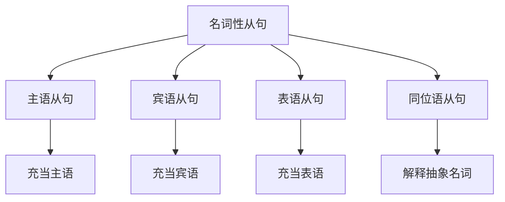
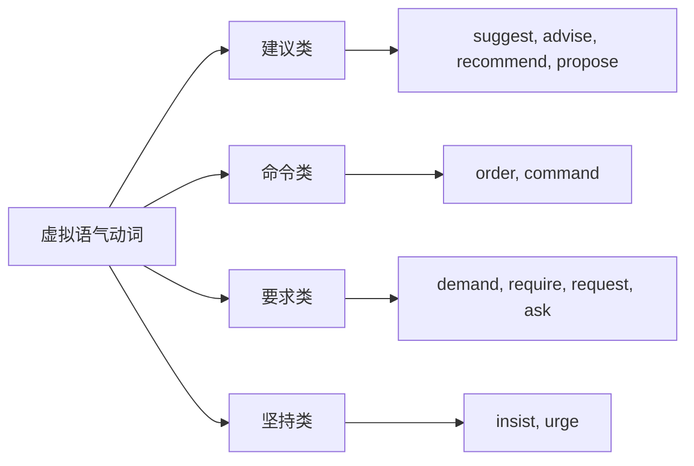
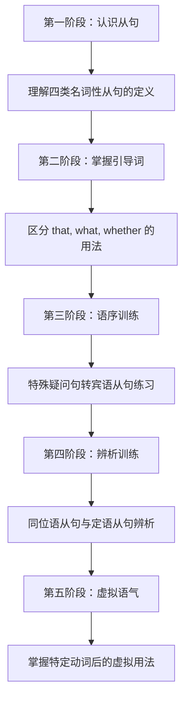

# 名词性从句详解

## 1. 名词性从句概述

### 1.1 什么是名词性从句

名词性从句（Noun Clauses）是在复合句中起名词作用的从句。正如名词可以在句子中充当主语、宾语、表语、同位语等成分，名词性从句同样可以担任这些句法功能。

> [!info] 核心概念
>
> 名词性从句 = 一个完整的句子 + 连接词，整体充当另一个句子中的名词成分。
>
> 简单来说，把一个句子"打包"成名词来用，就是名词性从句。

**名词与名词性从句的对比**：

| 句法成分 | 名词充当 | 名词性从句充当 |
| --- | --- | --- |
| 主语 | **The news** surprised everyone. | **What he said** surprised everyone. |
| 宾语 | I don't know **the answer**. | I don't know **what the answer is**. |
| 表语 | The problem is **money**. | The problem is **that we have no money**. |
| 同位语 | The fact, **his departure**, shocked us. | The fact **that he left** shocked us. |

### 1.2 名词性从句的四大类型

根据从句在主句中的语法功能，名词性从句分为四类：



上图展示了名词性从句的四大分支。主语从句在句首或句末充当主语；宾语从句跟在及物动词或介词后面充当宾语；表语从句位于系动词后说明主语的性质或状态；同位语从句紧跟在抽象名词后，解释说明该名词的具体内容。

### 1.3 名词性从句的引导词

名词性从句由连接词引导，主要有三类：

**第一类：从属连词（无词义，只起连接作用）**

| 连接词 | 功能 | 示例 |
| --- | --- | --- |
| that | 引导陈述句转化的从句，无实义 | I think **that** he is right. |
| whether/if | 引导一般疑问句转化的从句，表"是否" | I wonder **whether** he will come. |

**第二类：连接代词（有词义，在从句中作成分）**

| 连接词 | 词义 | 从句中作用 |
| --- | --- | --- |
| what | 什么；所……的东西 | 主语、宾语、表语 |
| who/whom | 谁 | 主语、宾语 |
| whose | 谁的 | 定语 |
| which | 哪一个 | 主语、宾语、定语 |
| whoever | 无论谁 | 主语、宾语 |
| whatever | 无论什么 | 主语、宾语 |
| whichever | 无论哪一个 | 主语、宾语、定语 |

**第三类：连接副词（有词义，在从句中作状语）**

| 连接词 | 词义 | 从句中作用 |
| --- | --- | --- |
| when | 什么时候 | 时间状语 |
| where | 什么地方 | 地点状语 |
| why | 为什么 | 原因状语 |
| how | 如何；多么 | 方式状语 |

> [!tip] 引导词选择口诀
>
> **陈述用 that，疑问看句意**：
> - 陈述句变从句 → that
> - 一般疑问句变从句 → whether/if（是否）
> - 特殊疑问句变从句 → 保留原疑问词（what, who, when, where, why, how 等）

---

## 2. 主语从句详解

### 2.1 主语从句的定义与结构

主语从句（Subject Clause）是在复合句中充当主语的从句。从句通常位于句首，也可以用 it 作形式主语，将真正的主语从句后置。

**基本结构**：

```
[主语从句] + 谓语 + 其他成分
```

或：

```
It + 谓语 + [真正的主语从句]
```

### 2.2 that 引导的主语从句

that 引导的主语从句由陈述句转化而来，that 本身无词义，只起连接作用。在正式文体中，that 通常不省略。

**句首位置**：

| 例句 | 句法分析 |
| --- | --- |
| **That he didn't come** surprised me. | that 引导主语从句，整个从句作主语 |
| **That the earth is round** is a fact. | 陈述客观事实的主语从句 |
| **That she passed the exam** made her parents happy. | 从句描述一个已发生的事实 |

**it 作形式主语**：

当主语从句较长时，常用 it 作形式主语，将从句后置，使句子结构更加平衡。

| 例句 | 说明 |
| --- | --- |
| **It** is true **that he has resigned**. | it 指代后面的 that 从句 |
| **It** surprised me **that he didn't come**. | 避免头重脚轻 |
| **It** is a pity **that you missed the concert**. | 常见句型结构 |

> [!warning] 注意事项
>
> 1. 主语从句中的 that 一般**不能省略**
> 2. 主语从句作主语时，谓语动词用**单数**形式
> 3. it 作形式主语的句型是书面语的常见表达

**常见的 it 形式主语句型**：

| 句型 | 含义 | 示例 |
| --- | --- | --- |
| It is + 形容词 + that... | 表评价 | It is important that you attend. |
| It is + 名词 + that... | 表判断 | It is a fact that he lied. |
| It + 动词 + that... | 表感受 | It seems that he is tired. |
| It is + 过去分词 + that... | 表被动 | It is reported that prices will rise. |

### 2.3 whether 引导的主语从句

whether 引导的主语从句表示"是否"，由一般疑问句转化而来。

> [!warning] 重要规则
>
> 主语从句中只能用 **whether**，**不能用 if**。
>
> ❌ If he will come is unknown.
> ✅ Whether he will come is unknown.

| 例句 | 分析 |
| --- | --- |
| **Whether he is at home** is not clear. | whether 从句作主语 |
| **Whether the plan will succeed** remains to be seen. | 表示不确定性 |
| **It** is uncertain **whether he will agree**. | it 形式主语结构 |

### 2.4 连接代词引导的主语从句

连接代词（what, who, which, whoever, whatever 等）引导的主语从句，连接代词在从句中充当成分。

**what 引导的主语从句**：

what 是最常用的连接代词，意为"……的东西/事情"或"什么"，在从句中作主语、宾语或表语。

| 例句 | what 在从句中的作用 |
| --- | --- |
| **What he said** is true. | 作宾语（他所说的话） |
| **What matters most** is your health. | 作主语（最重要的事） |
| **What I need** is a good rest. | 作宾语（我需要的东西） |

> [!example] what 的双重含义
>
> **疑问含义**：What he wants is unclear.（他想要什么还不清楚）
>
> **关系含义**：What he wants is a new car.（他想要的是一辆新车）
>
> 区分方法：看主句谓语和语境。若主句表示不确定（unclear, unknown），what 倾向于疑问含义；若主句是具体陈述，what 倾向于关系含义（= the thing that）。

**who/whoever 引导的主语从句**：

| 例句 | 分析 |
| --- | --- |
| **Who will be sent there** hasn't been decided. | who = 谁，作从句主语 |
| **Whoever breaks the law** should be punished. | whoever = 无论谁，表泛指 |
| **Who did this** is still a mystery. | who 引导疑问性主语从句 |

**which/whichever 引导的主语从句**：

| 例句 | 分析 |
| --- | --- |
| **Which team will win** is hard to predict. | which = 哪个，有限选择 |
| **Whichever road you take** will lead to the station. | whichever = 无论哪条 |

### 2.5 连接副词引导的主语从句

连接副词（when, where, why, how）在从句中作状语，同时引导整个从句作主句的主语。

| 连接副词 | 例句 | 分析 |
| --- | --- | --- |
| when | **When we will start** hasn't been decided. | when 作时间状语 |
| where | **Where he lives** is a secret. | where 作地点状语 |
| why | **Why he refused** is not clear. | why 作原因状语 |
| how | **How he escaped** remains unknown. | how 作方式状语 |

**how 的扩展用法**：

how 可与形容词或副词连用，构成复合连接副词：

| 结构 | 例句 |
| --- | --- |
| how many/much | **How much it costs** doesn't matter. |
| how long | **How long we'll stay** depends on the weather. |
| how often | **How often he visits** is uncertain. |
| how soon | **How soon he'll arrive** is unknown. |

---

## 3. 宾语从句详解

### 3.1 宾语从句的定义与结构

宾语从句（Object Clause）是在复合句中充当宾语的从句，通常位于及物动词或介词之后。

**基本结构**：

```
主语 + 及物动词 + [宾语从句]
主语 + 动词 + 介词 + [宾语从句]
```

### 3.2 that 引导的宾语从句

that 引导的宾语从句由陈述句转化而来。在口语和非正式文体中，that 常可省略。

**动词后的宾语从句**：

| 例句 | 说明 |
| --- | --- |
| I think **(that) he is honest**. | that 可省略 |
| She said **(that) she would come**. | 间接引语 |
| We believe **(that) he will succeed**. | 表示信念 |
| I hope **(that) you can help me**. | 表示希望 |

**常接宾语从句的动词**：

| 类别 | 动词 |
| --- | --- |
| 思维类 | think, believe, suppose, consider, imagine, guess |
| 感知类 | know, understand, realize, notice, find, discover |
| 言语类 | say, tell, explain, report, announce, declare |
| 情感类 | hope, wish, fear, doubt, regret, expect |
| 建议类 | suggest, advise, recommend, propose, demand, insist |

> [!warning] that 不可省略的情况
>
> 1. **两个宾语从句并列时**：
>    He said (that) he was tired **and that** he wanted to rest.
>
> 2. **宾语从句前有插入语时**：
>    I think, **that** if you study hard, you will pass.
>
> 3. **it 作形式宾语时**：
>    I find **it** strange **that** he didn't come.
>
> 4. **否定前移结构中**：
>    I don't think **that** he is right.

### 3.3 whether/if 引导的宾语从句

whether 和 if 都可以引导宾语从句，表示"是否"。

| 例句 | 说明 |
| --- | --- |
| I wonder **whether/if he will come**. | 两者均可 |
| I don't know **whether/if it is true**. | 表示不确定 |
| Please tell me **whether/if you agree**. | 询问意见 |

**只能用 whether 的情况**：

| 情况 | 例句 |
| --- | --- |
| 与 or not 直接连用 | I don't know **whether or not** he'll come. |
| 作介词宾语 | I'm worried about **whether** he is safe. |
| 后接不定式 | I don't know **whether to go** or stay. |
| 句首作主语 | **Whether** he comes doesn't matter. |
| 作表语 | The question is **whether** we can finish on time. |
| 与 it 形式宾语连用 | I leave it to you **whether** you accept. |

> [!tip] whether 与 if 选择技巧
>
> **优先选 whether**，以下情况才考虑 if：
> - 口语中简单的间接问句
> - 紧跟在 ask, wonder, know 等动词后
>
> 如有任何疑虑，选 whether 总是安全的。

### 3.4 连接代词和连接副词引导的宾语从句

这类宾语从句由特殊疑问句转化而来，注意从句要用**陈述语序**。

**语序转换规则**：

```
特殊疑问句：疑问词 + 助动词/be动词 + 主语 + ...
宾语从句：  引导词 + 主语 + 谓语 + ...
```

| 疑问句 | 宾语从句 |
| --- | --- |
| What **did** he **say**? | I don't know what he **said**. |
| Where **does** she **live**? | Tell me where she **lives**. |
| When **will** they **arrive**? | I wonder when they **will arrive**. |
| Who **is** that man? | I don't know who that man **is**. |

> [!warning] 常见错误
>
> ❌ I don't know **what is his name**.（错误语序）
> ✅ I don't know **what his name is**.（正确语序）
>
> ❌ Tell me **where does he work**.（错误语序）
> ✅ Tell me **where he works**.（正确语序）

**特殊情况：疑问词作主语时语序不变**：

| 例句 | 说明 |
| --- | --- |
| Who **broke** the window? → I know who **broke** the window. | who 作主语，语序不变 |
| What **happened**? → Tell me what **happened**. | what 作主语，语序不变 |
| Which book **is** yours? → I don't know which book **is** yours. | which 作定语修饰主语 |

### 3.5 介词后的宾语从句

宾语从句可以作介词的宾语，但有一些限制：

| 介词 | 例句 | 说明 |
| --- | --- | --- |
| about | I'm thinking about **what you said**. | 常用 |
| of | I'm not sure of **whether he'll agree**. | 常用 |
| on | Success depends on **how hard you work**. | 常用 |
| in | I'm interested in **what he does**. | 常用 |
| except | I know nothing except **that he left**. | that 从句需保留 that |

> [!warning] 介词 + that 从句的限制
>
> 大多数介词后不能直接跟 that 从句，需要改写：
>
> ❌ I'm happy about that he passed.
> ✅ I'm happy about **the fact that** he passed.
> ✅ I'm happy **that** he passed.（去掉介词）
>
> 但 except, but, in 等少数介词后可接 that 从句。

### 3.6 形式宾语 it

当宾语从句后有宾语补足语时，常用 it 作形式宾语，将真正的宾语从句后置。

**基本结构**：

```
主语 + 动词 + it + 宾补 + 真正的宾语从句
```

| 例句 | 分析 |
| --- | --- |
| I find **it** hard **that he refused**. | it 指代 that 从句 |
| We consider **it** necessary **that you should attend**. | 形式宾语结构 |
| I think **it** best **that you stay here**. | it 作形式宾语 |
| I owe **it** to you **that I am still alive**. | 固定搭配 |

**常用于此结构的动词**：

find, think, consider, believe, feel, make, take（认为）

### 3.7 宾语从句的时态呼应

宾语从句的时态通常要与主句保持呼应，这是英语的一大特点。

**时态呼应规则**：

| 主句时态 | 从句时态 | 示例 |
| --- | --- | --- |
| 一般现在时 | 根据从句含义选择 | I think he **is/was/will be** right. |
| 一般过去时 | 相应后退一格 | I thought he **was** right.（原：is） |
| 一般过去时 | 相应后退一格 | I thought he **had left**.（原：left） |
| 一般过去时 | 相应后退一格 | I thought he **would come**.（原：will） |

> [!example] 时态后退示例
>
> **直接引语**：He said, "I **am** busy."
> **间接引语**：He said (that) he **was** busy.
>
> **直接引语**：She said, "I **will** help you."
> **间接引语**：She said (that) she **would** help me.
>
> **直接引语**：They said, "We **have finished** the work."
> **间接引语**：They said (that) they **had finished** the work.

**时态不变的特殊情况**：

| 情况 | 例句 | 说明 |
| --- | --- | --- |
| 客观真理 | He said the earth **is** round. | 科学事实 |
| 自然规律 | She told me water **boils** at 100°C. | 物理定律 |
| 习惯性动作 | He said he **gets** up at 6 every day. | 现在仍如此 |
| 历史事实 | The teacher said World War II **ended** in 1945. | 历史日期 |

---

## 4. 表语从句详解

### 4.1 表语从句的定义与结构

表语从句（Predicative Clause）是位于系动词后面，用来说明主语的身份、性质、状态等的从句。

**基本结构**：

```
主语 + 系动词 + [表语从句]
```

**常见系动词**：

| 类别 | 系动词 |
| --- | --- |
| be 动词 | am, is, are, was, were |
| 感官动词 | look, sound, smell, taste, feel |
| 变化动词 | become, get, turn, grow, go |
| 保持动词 | remain, stay, keep |
| 表象动词 | seem, appear |

### 4.2 that 引导的表语从句

that 引导的表语从句最为常见，that 在从句中不作成分，一般不省略。

| 例句 | 分析 |
| --- | --- |
| The fact is **that we are running out of time**. | 说明事实的内容 |
| The trouble is **that he has no money**. | 说明问题所在 |
| My suggestion is **that we should start early**. | 说明建议内容 |
| The reason is **that he was ill**. | 说明原因 |

**常见主语搭配**：

The fact/truth/problem/trouble/question/answer/reason/idea/suggestion/hope is that...

### 4.3 whether 引导的表语从句

whether 引导的表语从句表示"是否"，**不能用 if 替换**。

| 例句 | 说明 |
| --- | --- |
| The question is **whether we can finish on time**. | 问题是否能完成 |
| What I wonder is **whether he'll agree**. | 我想知道的是是否 |
| The problem is **whether they have enough money**. | 问题是否有足够的钱 |

### 4.4 连接代词和连接副词引导的表语从句

这类从句的引导词在从句中充当成分。

| 引导词 | 例句 | 从句中作用 |
| --- | --- | --- |
| what | That is **what I want**. | 作宾语 |
| who | The question is **who can do it**. | 作主语 |
| which | The problem is **which road to take**. | 作定语 |
| where | That's **where the difficulty lies**. | 作地点状语 |
| when | The question is **when we should start**. | 作时间状语 |
| why | That's **why I came late**. | 作原因状语 |
| how | This is **how I learned English**. | 作方式状语 |

### 4.5 as if/as though 引导的表语从句

as if 和 as though 都表示"好像，仿佛"，引导表语从句时常用虚拟语气。

| 例句 | 语气 | 说明 |
| --- | --- | --- |
| It looks **as if it's going to rain**. | 陈述 | 可能真的要下雨 |
| He looks **as if he were ill**. | 虚拟 | 实际上没有生病 |
| It seems **as though he knew everything**. | 虚拟 | 他不可能什么都知道 |
| She felt **as if she had been cheated**. | 虚拟 | 过去虚拟 |

**虚拟语气规则**：

| 与事实相反的时间 | 从句时态 | 示例 |
| --- | --- | --- |
| 与现在相反 | 一般过去时（be 用 were） | as if he were a king |
| 与过去相反 | 过去完成时 | as if he had seen a ghost |

### 4.6 because 引导的表语从句

because 引导的表语从句说明原因，主语通常是 this, that, it 或 the reason。

| 例句 | 分析 |
| --- | --- |
| That's **because he didn't work hard**. | 那是因为他没努力 |
| It's **because I love you**. | 原因是我爱你 |

> [!warning] The reason is that... 与 That's because...
>
> **The reason is that...** = 原因是……
> **That's because...** = 那是因为……
>
> ❌ The reason is because...（错误搭配，reason 与 because 重复）
> ✅ The reason is that...
> ✅ That's/It's because...

---

## 5. 同位语从句详解

### 5.1 同位语从句的定义与特点

同位语从句（Appositive Clause）是用来解释说明某个抽象名词具体内容的从句。它与被修饰的名词在逻辑上是同等关系。

**基本结构**：

```
抽象名词 + [同位语从句]
```

**同位语从句的特点**：

1. 所修饰的名词通常是抽象名词
2. 从句完整地说明名词的内容
3. 从句与名词之间是"等于"关系
4. 主要由 that 引导，that 不能省略

### 5.2 常接同位语从句的抽象名词

| 类别 | 名词 |
| --- | --- |
| 事实类 | fact, truth, evidence, proof |
| 消息类 | news, message, information, report, rumor |
| 观点类 | idea, thought, belief, opinion, view |
| 疑问类 | question, problem, doubt |
| 建议类 | suggestion, advice, proposal, recommendation |
| 可能类 | possibility, chance, hope, fear |
| 命令类 | order, command, demand, request, requirement |
| 决定类 | decision, conclusion |
| 承诺类 | promise, word |

### 5.3 that 引导的同位语从句

that 引导同位语从句时，只起连接作用，在从句中不作任何成分，但**不能省略**。

| 例句 | 分析 |
| --- | --- |
| The news **that he had passed the exam** made us happy. | 解释 news 的内容 |
| I have no idea **that he is a thief**. | 说明 idea 的内容 |
| The fact **that she lied** disappointed me. | 说明 fact 的内容 |
| There is a possibility **that it will rain tomorrow**. | 说明 possibility 的内容 |

> [!tip] 同位语从句与定语从句的区别
>
> 这是考试中的高频考点，务必掌握区分方法。
>
> | 比较项 | 同位语从句 | 定语从句 |
> | --- | --- | --- |
> | that 的作用 | 仅起连接作用，不作成分 | 作从句的主语、宾语或表语 |
> | 与先行词关系 | 解释说明先行词内容 | 修饰限定先行词 |
> | 能否省略 that | 不能省略 | 作宾语时可省略 |
> | 先行词范围 | 只能是抽象名词 | 可以是任何名词 |
> | 逻辑关系 | 从句 = 名词 | 从句描述名词的特征 |

**区分示例**：

| 句子 | 类型 | 分析 |
| --- | --- | --- |
| The news **that** he told me was exciting. | 定语从句 | that 在从句中作 told 的宾语 |
| The news **that** he had won was exciting. | 同位语从句 | that 不作成分，从句解释 news |
| The idea **that** she had was brilliant. | 定语从句 | that 作 had 的宾语（她有的想法） |
| The idea **that** we should leave early was his. | 同位语从句 | 从句说明 idea 的内容 |

### 5.4 whether 引导的同位语从句

whether 引导同位语从句时表示"是否"，常与 question, doubt, problem 等词连用。

| 例句 | 分析 |
| --- | --- |
| The question **whether we should go** has not been decided. | 问题是否应该去 |
| I have no doubt **whether he will succeed**. | 对他是否成功没有疑问 |
| There is some doubt **whether he can finish it on time**. | 怀疑他是否能按时完成 |

> [!warning] 注意
>
> 同位语从句中**不能用 if 代替 whether**。

### 5.5 连接副词引导的同位语从句

when, where, why, how 也可以引导同位语从句，说明抽象名词的具体内容。

| 引导词 | 例句 |
| --- | --- |
| when | I have no idea **when he will come back**. |
| where | The question **where we should hold the meeting** remains unsettled. |
| why | The reason **why he was late** is unknown. |
| how | I have no idea **how he solved the problem**. |

### 5.6 同位语从句的分离现象

有时同位语从句会与它所修饰的名词被其他成分分隔开，这叫做同位语从句的分离。

| 例句 | 分析 |
| --- | --- |
| **Word came** (to us) **that he had been admitted to Beijing University**. | word 与从句被 to us 隔开 |
| **The thought came** to him **that he might fail in the exam**. | thought 与从句被 to him 隔开 |
| **A story goes** **that Napoleon once shot a general**. | 主谓倒装，从句后置 |

> [!example] 分离现象的常见结构
>
> **Word/News/A story + came/goes + 介词短语 + that 从句**
>
> 这种结构中，主语（Word/News/A story）与同位语从句被谓语和其他成分隔开，但逻辑上从句仍是对主语的解释说明。

---

## 6. 名词性从句中的虚拟语气

### 6.1 宾语从句中的虚拟语气

某些动词后的宾语从句需要使用虚拟语气，从句谓语用 **(should) + 动词原形**。

**要求使用虚拟语气的动词**：



上图列出了要求宾语从句使用虚拟语气的动词类型。这些动词表达主观愿望、建议或命令，从句中的动作尚未发生，因此使用虚拟语气。

| 例句 | 分析 |
| --- | --- |
| I suggest that he **(should) go** there at once. | should 可省略 |
| The doctor recommended that she **(should) take** more exercise. | 建议类动词 |
| He demanded that the work **(should) be finished** by Friday. | 要求类动词 |
| She insisted that we **(should) start** early. | 坚持类动词 |

> [!warning] insist 的双重含义
>
> - **insist + 虚拟语气**：坚持要求（表示愿望，动作未发生）
>   He insisted that she **(should) apologize**.（他坚持要求她道歉）
>
> - **insist + 陈述语气**：坚持认为（表示事实，动作已发生）
>   He insisted that he **was** innocent.（他坚持说自己是无辜的）

### 6.2 主语从句中的虚拟语气

当主句中含有表示建议、命令、要求等意义的词时，主语从句需使用虚拟语气。

**常见结构**：It is + 形容词/过去分词 + that... (should) + 动词原形

| 形容词/过去分词 | 例句 |
| --- | --- |
| necessary | It is necessary that he **(should) attend** the meeting. |
| important | It is important that every student **(should) learn** English. |
| essential | It is essential that the work **(should) be done** at once. |
| required | It is required that all members **(should) be** present. |
| suggested | It is suggested that the meeting **(should) be postponed**. |
| ordered | It was ordered that the army **(should) advance** immediately. |

### 6.3 表语从句中的虚拟语气

当主语是 suggestion, proposal, order, command, request, demand, requirement, advice 等名词时，表语从句使用虚拟语气。

| 例句 | 分析 |
| --- | --- |
| My suggestion is that we **(should) hold** a meeting. | 建议类主语 |
| His proposal was that the plan **(should) be carried** out at once. | 提议类主语 |
| The order is that everyone **(should) stay** inside. | 命令类主语 |

### 6.4 同位语从句中的虚拟语气

当同位语从句修饰的抽象名词表示建议、命令、要求等时，从句使用虚拟语气。

| 例句 | 分析 |
| --- | --- |
| We made the suggestion that he **(should) be** invited. | suggestion 的具体内容 |
| The order that all the soldiers **(should) stay** was given. | order 的具体内容 |
| There was a proposal that a new bridge **(should) be built**. | proposal 的具体内容 |

### 6.5 wish 后宾语从句的虚拟语气

wish 表示"希望、但愿"，其后的宾语从句常用虚拟语气表示与事实相反的愿望。

| 与事实相反的时间 | 从句时态 | 示例 |
| --- | --- | --- |
| 与现在相反 | 一般过去时（be 用 were） | I wish I **were** a bird. |
| 与过去相反 | 过去完成时 | I wish I **had studied** harder. |
| 与将来相反 | would/could + 动词原形 | I wish he **would come** tomorrow. |

> [!example] wish 虚拟语气示例
>
> **与现在相反**：
> I wish I **knew** the answer.（我希望我知道答案。）[实际上不知道]
>
> **与过去相反**：
> I wish I **had taken** your advice.（我希望我当时接受了你的建议。）[实际上没接受]
>
> **与将来相反**：
> I wish it **would stop** raining.（我希望雨能停。）[目前还在下]

### 6.6 would rather 后宾语从句的虚拟语气

would rather（宁愿）后接宾语从句时，从句使用虚拟语气。

| 与事实相反的时间 | 从句时态 | 示例 |
| --- | --- | --- |
| 与现在/将来相反 | 一般过去时 | I'd rather you **came** tomorrow. |
| 与过去相反 | 过去完成时 | I'd rather you **hadn't told** him. |

---

## 7. 名词性从句综合辨析

### 7.1 what 与 that 的区别

| 比较项 | what | that |
| --- | --- | --- |
| 词义 | 有实际意义（什么/所……的） | 无实际意义 |
| 从句成分 | 在从句中作主语、宾语或表语 | 在从句中不作成分 |
| 可否省略 | 不可省略 | 宾语从句中可省略 |
| 等价表达 | = the thing(s) that | 无等价表达 |

| 例句 | 分析 |
| --- | --- |
| **What** he said surprised me. | what 作 said 的宾语 |
| **That** he came surprised me. | that 不作成分，只起连接作用 |
| I believe **what** you told me. | what = the thing that |
| I believe **(that)** you are right. | that 可省略 |

> [!tip] 判断技巧
>
> 如果从句缺少主语、宾语或表语，用 **what**；
> 如果从句完整，不缺成分，用 **that**。

### 7.2 whether 与 if 的区别

| 用法 | whether | if |
| --- | --- | --- |
| 主语从句 | ✅ 可用 | ❌ 不可用 |
| 表语从句 | ✅ 可用 | ❌ 不可用 |
| 同位语从句 | ✅ 可用 | ❌ 不可用 |
| 宾语从句（动词后） | ✅ 可用 | ✅ 可用 |
| 介词后 | ✅ 可用 | ❌ 不可用 |
| 与 or not 直接连用 | ✅ 可用 | ❌ 不可用 |
| 后接不定式 | ✅ 可用 | ❌ 不可用 |

**记忆口诀**：**if 只能作宾语从句引导词，且不能与 or not 直接连用**。

### 7.3 同位语从句与定语从句的区别

| 比较项 | 同位语从句 | 定语从句 |
| --- | --- | --- |
| 从句功能 | 解释说明名词的内容 | 修饰限定名词 |
| 与名词关系 | 从句 = 名词（内容相等） | 从句描述名词的特征 |
| that 的作用 | 只起连接作用，不作成分 | 作主语、宾语或表语 |
| 先行词范围 | 仅限抽象名词 | 任何名词 |
| that 能否省略 | 不能省略 | 作宾语时可省略 |
| 替换可能 | 不能用 which 替换 | that 可被 which 替换 |

**快速判断法**：

1. **看从句是否完整**：同位语从句完整，定语从句缺成分
2. **看能否用 which 替换**：能替换是定语从句，不能替换是同位语从句
3. **看逻辑关系**：从句能否与名词划等号

| 句子 | 类型 | 判断依据 |
| --- | --- | --- |
| The news that our team won is true. | 同位语从句 | 从句完整，news = our team won |
| The news that you told me is true. | 定语从句 | 从句缺宾语，that = which 可替换 |

### 7.4 名词性从句的语序问题

名词性从句必须使用**陈述语序**，即"主语 + 谓语"的顺序。

**错误示例与纠正**：

| 错误 | 正确 | 说明 |
| --- | --- | --- |
| I don't know **what is his name**. | I don't know **what his name is**. | what 是表语，his name 是主语 |
| Tell me **where does he live**. | Tell me **where he lives**. | 助动词 does 需去掉 |
| I wonder **when will he come**. | I wonder **when he will come**. | will 放在主语后 |
| I asked **what had happened**. | I asked **what had happened**. | ✅ what 作主语，语序不变 |

> [!warning] 特殊情况
>
> 当疑问词在从句中作主语时，语序不需要调整：
> - Who broke the window? → I know **who broke** the window.
> - What happened? → Tell me **what happened**.

### 7.5 名词性从句与强调句的区别

当 it 出现在句首时，需要区分是形式主语结构还是强调句。

| 结构 | 特征 | 判断方法 |
| --- | --- | --- |
| 形式主语 | It is + 形容词/名词 + that... | 去掉 It is...that 后句子不完整 |
| 强调句 | It is/was + 被强调部分 + that/who... | 去掉 It is/was...that/who 后句子完整 |

**判断练习**：

| 句子 | 类型 | 分析 |
| --- | --- | --- |
| It is true **that** he won the prize. | 形式主语 | 去掉后：True he won the prize.（不完整） |
| It was he **that** won the prize. | 强调句 | 去掉后：He won the prize.（完整） |
| It is a pity **that** you missed it. | 形式主语 | 去掉后：A pity you missed it.（不完整） |
| It was yesterday **that** I met him. | 强调句 | 去掉后：I met him yesterday.（完整） |

---

## 8. 学习建议与常见错误

### 8.1 名词性从句学习路径



上图展示了名词性从句的学习路径。建议按照认识从句、掌握引导词、语序训练、辨析训练、虚拟语气五个阶段循序渐进。每个阶段都需要大量例句练习，才能真正掌握名词性从句的用法。

### 8.2 高频错误总结

| 错误类型 | 错误示例 | 正确示例 | 说明 |
| --- | --- | --- | --- |
| 语序错误 | I don't know what is it. | I don't know what it is. | 从句用陈述语序 |
| if 误用 | If he comes is unknown. | Whether he comes is unknown. | 主语从句用 whether |
| that 与 what 混用 | What he is honest is true. | That he is honest is true. | 从句完整用 that |
| that 省略错误 | The fact he lied shocked me. | The fact that he lied shocked me. | 同位语从句 that 不省 |
| 时态呼应错误 | He said he will come. | He said he would come. | 主句过去时，从句相应后退 |
| 虚拟语气错误 | I suggest he goes. | I suggest he (should) go. | 建议类动词用虚拟 |

### 8.3 实用练习方法

> [!tip] 练习建议
>
> 1. **句子转换练习**：将直接引语改为间接引语，反复练习语序和时态变化
>
> 2. **造句练习**：用每类引导词造句，强化记忆
>
> 3. **辨析练习**：收集同位语从句和定语从句的例句，反复对比分析
>
> 4. **阅读中标注**：在阅读英文材料时，标出所有名词性从句，分析其类型
>
> 5. **写作中应用**：在写作中有意识地使用名词性从句，提升表达复杂性

### 8.4 名词性从句核心要点速记表

| 从句类型 | 位置 | 主要引导词 | 注意事项 |
| --- | --- | --- | --- |
| 主语从句 | 句首或句末（it 形式主语） | that, whether, what, who, when... | that/whether 不省略 |
| 宾语从句 | 动词或介词后 | that, whether/if, what, who, when... | 注意时态呼应和语序 |
| 表语从句 | 系动词后 | that, whether, what, as if... | 不用 if 只用 whether |
| 同位语从句 | 抽象名词后 | that, whether, when, where... | that 不作成分不省略 |

---

## 名词性从句小结

名词性从句是英语复合句的重要组成部分，掌握名词性从句需要理解以下核心内容：

1. **四大类型**：主语从句、宾语从句、表语从句、同位语从句，各有其特定位置和功能

2. **引导词选择**：根据原句类型（陈述句、一般疑问句、特殊疑问句）选择对应的引导词

3. **语序规则**：名词性从句一律使用陈述语序

4. **时态呼应**：宾语从句需要注意与主句的时态配合

5. **虚拟语气**：特定动词和结构后的名词性从句需使用虚拟语气

6. **辨析能力**：能够区分同位语从句与定语从句，以及形式主语结构与强调句

名词性从句的学习需要大量的例句积累和反复练习。建议在阅读和写作中有意识地关注和运用名词性从句，逐步提高对复杂句式的理解和运用能力。
