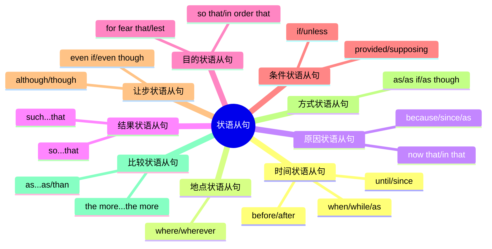
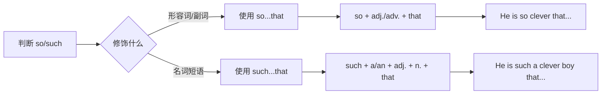
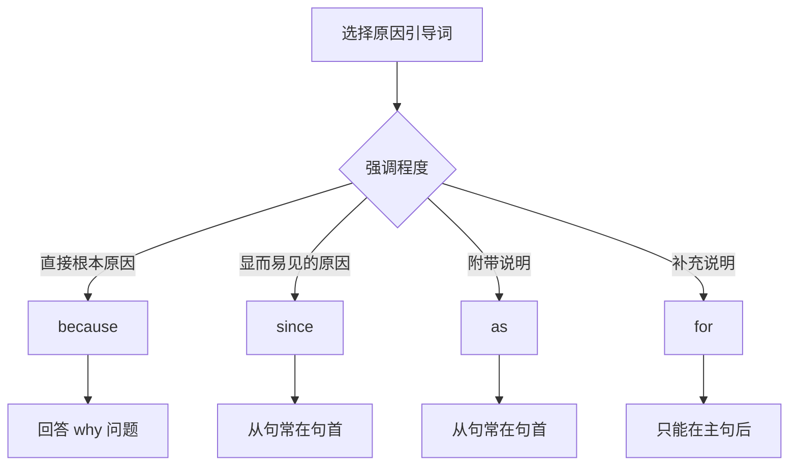
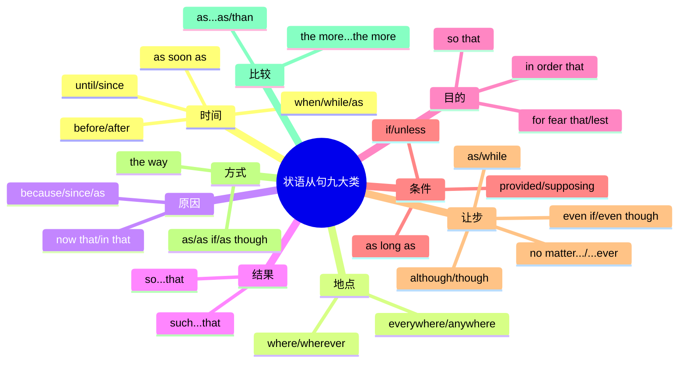

# 状语从句详解

## 1 状语从句概述

### 1.1 什么是状语从句

**状语从句（Adverbial Clause）** 是在复合句中充当状语成分的从句，用来修饰主句中的动词、形容词、副词或整个句子，说明动作发生的**时间、地点、原因、结果、目的、条件、让步、方式、比较**等情况。

> [!info] 状语从句的核心特征
>
> - **功能**：在句中作状语，修饰主句
> - **结构**：由从属连词引导，包含主语和谓语
> - **位置**：可置于主句之前、之后或中间
> - **标点**：从句在前时，通常用逗号与主句隔开

**对比简单状语与状语从句**：

| 类型 | 示例 | 说明 |
| --- | --- | --- |
| 副词作状语 | He arrived **early**. | 单个副词修饰动词 |
| 介词短语作状语 | He arrived **at 8 o'clock**. | 介词短语表时间 |
| 状语从句 | He arrived **when the meeting started**. | 完整从句表时间 |

### 1.2 状语从句的九大类型

上图展示了状语从句的九大分类及其主要引导词。每类从句都有特定的语义功能和引导词体系，学习时需掌握各类从句的核心引导词、时态配合规则以及与其他从句的区别。

### 1.3 状语从句的位置规则

状语从句在句中的位置相对灵活，但不同位置会产生不同的语义重心和语气效果：

**位置一：从句在主句之前**

此时从句通常表示背景信息，主句是信息重心，从句后需加逗号。

- **When I was young**, I lived in Shanghai.
- 当我年轻的时候，我住在上海。

**位置二：从句在主句之后**

此时主句和从句信息权重较为平衡，中间通常不加逗号。

- I lived in Shanghai **when I was young**.
- 我年轻时住在上海。

**位置三：从句插入主句中间**

从句置于主句主语和谓语之间，用逗号隔开，起插入说明作用。

- My father, **when he was alive**, always told me to be honest.
- 我父亲在世时总是告诫我要诚实。

> [!tip] 位置选择原则
>
> - 强调从句内容时，将从句置于句首
> - 强调主句内容时，将从句置于句末
> - 需要补充说明时，将从句插入句中

---

## 2 时间状语从句

时间状语从句用来说明主句动作发生的时间，是使用频率最高的状语从句类型。

### 2.1 when 引导的时间状语从句

**when** 是最常用的时间状语从句引导词，表示"当……的时候"，强调**某一时间点**或**某一时间段**。

#### 2.1.1 基本用法

**when** 可以引导表示时间点的从句，此时主句和从句的动作几乎同时发生：

- **When the phone rang**, I was taking a shower.
- 电话响的时候，我正在洗澡。
- 句法分析：从句用一般过去时表示瞬间动作，主句用过去进行时表示持续动作

- I'll call you **when I arrive**.
- 我到达时会给你打电话。
- 句法分析：主句用一般将来时，从句用一般现在时代替将来时（主将从现）

#### 2.1.2 when 从句的时态配合

| 主句时态 | 从句时态 | 示例 |
| --- | --- | --- |
| 一般过去时 | 一般过去时 | When he came, I left. |
| 过去进行时 | 一般过去时 | When he came, I was reading. |
| 一般将来时 | 一般现在时 | When he comes, I will leave. |
| 过去完成时 | 一般过去时 | When he came, I had left. |

> [!warning] 主将从现原则
>
> 在时间状语从句中，如果主句用一般将来时，从句要用一般现在时代替一般将来时，这就是"主将从现"原则。
>
> - ✅ I will go home **when the class is over**.
> - ❌ I will go home when the class will be over.

#### 2.1.3 when 的特殊用法

**用法一：表示"这时，突然"**

when 可以用作并列连词，相当于 and at that time，表示主句动作进行中突然发生另一动作：

- I was walking in the street **when** I met an old friend.
- 我正在街上走着，这时遇到了一位老朋友。
- 此处 when 引导的不是从句，而是与主句并列

**用法二：引导名词性从句**

when 还可以引导主语从句、宾语从句等名词性从句，表示"什么时候"：

- **When he will come** is unknown.
- 他什么时候来还不知道。（主语从句）

- I don't know **when he will come**.
- 我不知道他什么时候来。（宾语从句）

### 2.2 while 引导的时间状语从句

**while** 表示"当……的时候"，强调**一段时间内**的持续动作或状态，从句谓语动词通常是延续性动词。

#### 2.2.1 基本用法

- **While I was doing my homework**, my mother was cooking.
- 我做作业的时候，妈妈在做饭。
- 句法分析：两个动作同时持续进行

- Please keep quiet **while others are speaking**.
- 别人说话时请保持安静。

#### 2.2.2 while 与 when 的区别

| 特征 | when | while |
| --- | --- | --- |
| 动作特点 | 可表示瞬间或持续动作 | 只表示持续动作 |
| 从句谓语 | 可用短暂性或延续性动词 | 只用延续性动词 |
| 同时进行 | 动作可以不同时进行 | 动作必须同时进行 |
| 典型时态 | 一般过去时、过去进行时 | 过去进行时为主 |

**对比示例**：

- **When** he came in, I was reading.（正确）
- ❌ **While** he came in, I was reading.（错误，come in 是瞬间动词）

- **While** I was reading, he came in.（正确）
- **When** I was reading, he came in.（正确）

#### 2.2.3 while 的其他含义

**表示对比："而，却"**

while 还可以作为并列连词，表示两种情况的对比：

- I like coffee, **while** my wife prefers tea.
- 我喜欢咖啡，而我妻子更喜欢茶。

- Some people waste food, **while** others don't have enough to eat.
- 有些人浪费食物，而另一些人却吃不饱。

### 2.3 as 引导的时间状语从句

**as** 表示"当……的时候，一边……一边……，随着"，强调**两个动作同时进行**或**同步变化**。

#### 2.3.1 表示同时进行

- **As I was walking down the street**, I saw a beautiful sunset.
- 当我沿着街道走的时候，我看到了美丽的日落。

- He sang **as he walked**.
- 他一边走一边唱歌。

#### 2.3.2 表示同步变化

as 可以表示两个动作或状态随时间同步变化，常与比较级连用：

- **As time goes by**, he becomes wiser.
- 随着时间流逝，他变得更睿智了。

- **As you grow older**, you will understand more.
- 随着年龄增长，你会理解更多。

#### 2.3.3 when/while/as 综合辨析

> [!example] 三者辨析示例
>
> **When** I got home, my father was watching TV.
> 我到家时，爸爸正在看电视。（到家是瞬间动作）
>
> **While** my father was watching TV, I was doing homework.
> 爸爸看电视的时候，我在做作业。（两个持续动作同时进行）
>
> **As** I entered the room, everyone stood up.
> 当我走进房间时，大家都站了起来。（强调同时性）

### 2.4 before 和 after 引导的时间状语从句

#### 2.4.1 before 的用法

**before** 表示"在……之前"，主句动作发生在从句动作之前：

- I will finish my homework **before I go to bed**.
- 我会在睡觉前完成作业。

- **Before you leave**, please turn off the lights.
- 在你离开之前，请关灯。

**before 的特殊句型**：

| 句型 | 含义 | 示例 |
| --- | --- | --- |
| It was/will be + 时间 + before... | 过了/要过……才…… | It was three years before I saw her again. |
| before + sb. + could/can... | 还没来得及…… | Before I could say a word, he left. |

#### 2.4.2 after 的用法

**after** 表示"在……之后"，主句动作发生在从句动作之后：

- I went to bed **after I finished my homework**.
- 我做完作业后就睡觉了。

- **After the rain stopped**, we went out for a walk.
- 雨停后，我们出去散步了。

### 2.5 until/till 引导的时间状语从句

**until/till** 表示"直到……为止"，两者意义相同，但 until 更正式，可用于句首，而 till 一般不用于句首。

#### 2.5.1 肯定句中的用法

在肯定句中，主句谓语动词必须是**延续性动词**，表示动作持续到从句所表示的时间：

- I will wait here **until/till you come back**.
- 我会在这里等，直到你回来。

- He worked **until midnight**.
- 他工作到午夜。

#### 2.5.2 否定句中的用法

在否定句中，主句谓语动词通常是**短暂性动词**，构成 not...until 结构，表示"直到……才……"：

- I didn't go to bed **until my father came back**.
- 直到父亲回来我才睡觉。

- He didn't leave **until the rain stopped**.
- 直到雨停他才离开。

> [!tip] not...until 的强调句型
>
> **强调句**：It was not until my father came back that I went to bed.
> 直到父亲回来我才睡觉。
>
> **倒装句**：Not until my father came back did I go to bed.
> 直到父亲回来我才睡觉。

### 2.6 since 引导的时间状语从句

**since** 表示"自从……以来"，主句通常用**完成时态**，从句用**一般过去时**。

#### 2.6.1 基本用法

- I **have lived** here **since I was born**.
- 我从出生起就住在这里。

- We **have been** good friends **since we met** in 2010.
- 自从 2010 年相识以来，我们一直是好朋友。

#### 2.6.2 since 从句的时态规则

| 主句时态 | 从句时态 | 示例 |
| --- | --- | --- |
| 现在完成时 | 一般过去时 | I have known him since we were children. |
| 现在完成进行时 | 一般过去时 | He has been working since he graduated. |
| 过去完成时 | 过去完成时 | I had lived there since I was born. |

#### 2.6.3 It is/has been + 时间 + since...

这是 since 从句的常用句型，表示"自从……以来已经多久了"：

- **It is** three years **since** I came to Beijing.
- 我来北京已经三年了。

- **It has been** a long time **since** we last met.
- 我们上次见面已经很久了。

> [!warning] since 从句中动词的选择
>
> 如果从句中用**短暂性动词**，表示从该动作发生时算起：
> - It is two years since he **joined** the army. = 他参军两年了。
>
> 如果从句中用**延续性动词**，表示从该动作结束时算起：
> - It is two years since he **smoked**. = 他戒烟两年了。（不是"他抽烟两年了"）

### 2.7 其他时间状语从句引导词

#### 2.7.1 as soon as / the moment / the instant

这些词组都表示"一……就……"，强调两个动作紧密相连：

- I will call you **as soon as** I arrive.
- 我一到就给你打电话。

- **The moment** I saw her, I knew something was wrong.
- 我一看到她就知道出了问题。

- **The instant** he heard the news, he rushed out.
- 他一听到消息就冲了出去。

#### 2.7.2 no sooner...than / hardly...when / scarcely...when

这些结构表示"一……就……"，主句用**过去完成时**，从句用**一般过去时**。当 no sooner, hardly, scarcely 位于句首时，主句需**部分倒装**：

- I **had no sooner** arrived **than** it began to rain.
- = **No sooner had** I arrived **than** it began to rain.
- 我刚到就开始下雨了。

- I **had hardly** finished my homework **when** he came.
- = **Hardly had** I finished my homework **when** he came.
- 我刚做完作业他就来了。

#### 2.7.3 every time / each time / the first time

这些词组本身就可以作为连词引导时间状语从句：

- **Every time** I see her, I think of my mother.
- 每次见到她，我就想起我母亲。

- **The first time** I met him, I was impressed by his honesty.
- 第一次见到他时，他的诚实给我留下了深刻印象。

- **Each time** he comes, he brings me a gift.
- 他每次来都给我带礼物。

#### 2.7.4 by the time

**by the time** 表示"到……时候为止"，主句通常用完成时态：

| 主句时态 | 从句时态 | 示例 |
| --- | --- | --- |
| 将来完成时 | 一般现在时 | By the time you arrive, I will have finished. |
| 过去完成时 | 一般过去时 | By the time he arrived, I had left. |

- **By the time** I got to the station, the train **had left**.
- 当我到达车站时，火车已经开走了。

- **By the time** you come back, I **will have cleaned** the room.
- 等你回来时，我已经打扫完房间了。

---

## 3 地点状语从句

地点状语从句用来说明主句动作发生的**地点或场所**，由 **where, wherever, everywhere, anywhere** 等引导。

### 3.1 where 引导的地点状语从句

**where** 表示"在……的地方"，指具体或抽象的地点：

- You should put the book **where you found it**.
- 你应该把书放回你找到它的地方。
- 句法分析：where 引导地点状语从句，修饰 put

- **Where there is a will**, there is a way.
- 有志者事竟成。（字面意思：在有意志的地方，就有道路）
- 这是一句经典谚语，where 引导的从句置于句首表示强调

> [!warning] 地点状语从句 vs 定语从句
>
> 地点状语从句和 where 引导的定语从句容易混淆，关键区别在于：
>
> - **定语从句**：where 前有明确的先行词（表示地点的名词）
> - **地点状语从句**：where 前没有先行词
>
> **定语从句**：This is the place **where** I was born.
> 这就是我出生的地方。（where 前有先行词 place）
>
> **地点状语从句**：Put it **where** you can see it.
> 把它放在你能看到的地方。（where 前无先行词）

### 3.2 wherever 引导的地点状语从句

**wherever** 表示"无论在哪里，无论到哪里"，相当于 no matter where，表示任何地点：

- **Wherever you go**, I will follow you.
- 无论你去哪里，我都会跟随你。

- You can sit **wherever you like**.
- 你可以坐在你喜欢的任何地方。

- **Wherever** there is smoke, there is fire.
- 无风不起浪。（字面意思：哪里有烟，哪里就有火）

### 3.3 everywhere / anywhere 引导的地点状语从句

**everywhere** 表示"到处，每个地方"：

- **Everywhere I went**, I found the same problem.
- 我走到哪里都发现同样的问题。

- She followed him **everywhere he went**.
- 他走到哪儿她就跟到哪儿。

**anywhere** 表示"任何地方"：

- You can go **anywhere you want**.
- 你可以去任何你想去的地方。

- Sit **anywhere you like**.
- 随便坐。

---

## 4 原因状语从句

原因状语从句用来说明主句动作或状态发生的**原因**，由 **because, since, as, now that, in that** 等引导。

### 4.1 because 引导的原因状语从句

**because** 是语气最强的原因引导词，表示**直接的、根本的原因**，通常用于回答 why 引导的问句：

- I didn't go to school yesterday **because I was ill**.
- 我昨天没去上学，因为我病了。

- **Because it was raining**, we stayed at home.
- 因为下雨，我们待在家里。

- — Why didn't you come to the party?
- — **Because** I had to work late.
- — 你为什么没来参加聚会？— 因为我得加班到很晚。

> [!warning] because 与 so 不能同时使用
>
> 在英语中，because 和 so 不能同时出现在一个句子中，只能选用其一：
>
> - ✅ **Because** he was ill, he didn't come. （从句在前）
> - ✅ He didn't come **because** he was ill. （从句在后）
> - ✅ He was ill, **so** he didn't come. （并列句）
> - ❌ Because he was ill, so he didn't come. （错误）

### 4.2 since 引导的原因状语从句

**since** 表示"既然，由于"，用于说明**显而易见或已知的原因**，语气比 because 弱，从句通常置于句首：

- **Since you are busy**, I won't bother you.
- 既然你忙，我就不打扰你了。

- **Since everyone is here**, let's begin.
- 既然大家都到了，我们开始吧。

- **Since you don't like it**, I'll take it back.
- 既然你不喜欢，我就拿回去。

### 4.3 as 引导的原因状语从句

**as** 表示"因为，由于"，语气最弱，用于表示**附带说明的原因**，从句通常置于句首：

- **As it was getting late**, we decided to leave.
- 因为天色已晚，我们决定离开。

- **As you weren't there**, I left a message.
- 因为你不在，我留了个口信。

- I must stop writing now, **as I have to go to bed**.
- 我必须停止写作了，因为我得去睡觉了。

### 4.4 because / since / as 辨析

| 引导词 | 语气强弱 | 位置 | 用法特点 |
| --- | --- | --- | --- |
| because | 最强 | 通常在主句后 | 直接、根本原因；回答 why |
| since | 较弱 | 通常在主句前 | 已知的、显而易见的原因 |
| as | 最弱 | 通常在主句前 | 附带说明的原因 |

> [!example] 三者对比
>
> **Why didn't you go?** — I didn't go **because** I was tired.
> （直接回答原因，用 because）
>
> **Since** you know the answer, tell us.
> 既然你知道答案，就告诉我们吧。（对方已知的事实，用 since）
>
> **As** it was Sunday, the shops were closed.
> 因为是星期天，商店都关门了。（顺便说明原因，用 as）

### 4.5 其他原因状语从句引导词

#### 4.5.1 now that

**now that** 表示"既然，由于"，强调**现在的情况**或**新出现的原因**：

- **Now that** you are grown up, you should be independent.
- 既然你已经长大了，你应该独立了。

- **Now that** the exam is over, we can relax.
- 既然考试结束了，我们可以放松了。

#### 4.5.2 in that

**in that** 表示"因为，在于"，用于**正式语体**，说明具体原因或方面：

- I'm lucky **in that** I have good health.
- 我很幸运，因为我身体健康。

- This book is useful **in that** it gives practical examples.
- 这本书很有用，因为它提供了实用的例子。

#### 4.5.3 seeing (that) / considering (that)

这些词组也可以引导原因状语从句，表示"鉴于，考虑到"：

- **Seeing that** it is raining, we'd better stay indoors.
- 鉴于下雨了，我们最好待在室内。

- **Considering that** she is only 12, she did very well.
- 考虑到她只有 12 岁，她做得很好了。

---

## 5 结果状语从句

结果状语从句用来说明主句动作所导致的**结果**，由 **so...that, such...that, so that** 等引导。

### 5.1 so...that 结构

**so...that** 表示"如此……以至于……"，**so** 后接**形容词或副词**：

#### 5.1.1 基本结构

**so + 形容词/副词 + that 从句**

- He is **so tall that** he can touch the ceiling.
- 他如此高以至于能摸到天花板。

- She speaks **so fast that** I can't understand her.
- 她说话如此快以至于我听不懂她说的。

- The coffee was **so hot that** I couldn't drink it.
- 咖啡太烫了，我喝不了。

#### 5.1.2 so + 形容词 + a/an + 单数名词 + that

当修饰可数名词单数时，冠词位置需调整：

- He is **so clever a boy that** everyone likes him.
- = He is **such a clever boy that** everyone likes him.
- 他是个如此聪明的男孩，以至于每个人都喜欢他。

- It was **so interesting a book that** I couldn't put it down.
- = It was **such an interesting book that** I couldn't put it down.
- 这本书如此有趣，以至于我爱不释手。

#### 5.1.3 so + many/much/few/little + 名词 + that

so 后可直接接 many, much, few, little 等数量词：

- He has **so much money that** he doesn't know what to do with it.
- 他有如此多的钱，以至于不知道该怎么用。

- There were **so many people that** we couldn't get in.
- 人太多了，我们进不去。

- I had **so little time that** I couldn't finish.
- 我的时间太少了，无法完成。

### 5.2 such...that 结构

**such...that** 表示"如此……以至于……"，**such** 后接**名词或名词短语**：

#### 5.2.1 基本结构

**such + (a/an) + (形容词) + 名词 + that 从句**

- It was **such a beautiful day that** we went for a picnic.
- 天气如此好，我们去野餐了。

- He is **such a kind man that** everyone respects him.
- 他是个如此善良的人，以至于每个人都尊敬他。

- They are **such good students that** the teacher is proud of them.
- 他们是如此好的学生，老师为他们骄傲。

#### 5.2.2 such + 不可数名词/复数名词 + that

- He showed **such courage that** we were all impressed.
- 他表现出如此大的勇气，令我们印象深刻。

- They are **such good friends that** they share everything.
- 他们是如此好的朋友，什么都分享。

### 5.3 so...that 与 such...that 的区别

| 结构 | 修饰对象 | 示例 |
| --- | --- | --- |
| so...that | 形容词、副词 | so beautiful, so quickly |
| such...that | 名词或名词短语 | such a beautiful day |
| so + many/much/few/little | 数量词 + 名词 | so much money |

> [!tip] 快速判断方法
>
> 看 so/such 后面**紧跟的词**：
> - 紧跟**形容词/副词** → 用 **so**
> - 紧跟**冠词 a/an** 或**名词** → 用 **such**
>
> - He is **so** kind. （kind 是形容词）
> - He is **such** a kind man. （a kind man 是名词短语）

### 5.4 so that 引导的结果状语从句

**so that** 也可以引导结果状语从句，表示"因此，所以"，此时从句表示自然结果，从句中**不用情态动词**：

- He got up late, **so that** he missed the bus.
- 他起晚了，因此错过了公交车。

- It rained hard, **so that** the ground was wet.
- 雨下得很大，因此地面很湿。

> [!warning] 结果状语从句 vs 目的状语从句
>
> so that 既可以引导结果状语从句，也可以引导目的状语从句，区别在于：
>
> | 从句类型 | 从句特征 | 示例 |
> | --- | --- | --- |
> | 目的状语从句 | 含 can, may, will 等情态动词 | He works hard so that he can pass. |
> | 结果状语从句 | 不含情态动词，表示已发生的结果 | He worked hard, so that he passed. |

### 5.5 结果状语从句的倒装

当 so...that 或 such...that 中的 so/such 部分位于句首时，主句需要**部分倒装**：

- **So beautiful was** the scenery **that** we stopped to admire it.
- 风景如此美丽，我们停下来欣赏。
- 正常语序：The scenery was so beautiful that we stopped to admire it.

- **Such a clever boy was** he **that** everyone liked him.
- 他是个如此聪明的男孩，每个人都喜欢他。
- 正常语序：He was such a clever boy that everyone liked him.

---

## 6 目的状语从句

目的状语从句用来说明主句动作的**目的**，由 **so that, in order that, for fear that, lest, in case** 等引导。

### 6.1 so that 引导的目的状语从句

**so that** 表示"以便，为了"，从句中通常含有 **can, may, will, could, might, would** 等情态动词：

- He got up early **so that he could catch the first bus**.
- 他早起以便能赶上第一班公交车。

- Speak louder **so that everyone can hear you**.
- 大声点说，以便每个人都能听到你。

- I saved money **so that I might buy a car**.
- 我存钱是为了能买辆车。

> [!info] 目的状语从句中的情态动词选择
>
> | 情态动词 | 语气特点 | 示例 |
> | --- | --- | --- |
> | can/could | 表示能力或可能 | ...so that he can finish on time |
> | may/might | 表示许可或可能 | ...so that she may understand |
> | will/would | 表示意愿 | ...so that they will agree |
> | should | 表示应该（较正式） | ...so that nothing should go wrong |

### 6.2 in order that 引导的目的状语从句

**in order that** 表示"为了，以便"，比 so that 更正式，从句同样含有情态动词：

- He spoke slowly **in order that everyone might understand**.
- 他说得很慢，以便每个人都能理解。

- **In order that** we might arrive on time, we left early.
- 为了能准时到达，我们早早就出发了。

- I'll give you a map **in order that** you won't get lost.
- 我会给你一张地图，以便你不会迷路。

### 6.3 for fear that / lest 引导的目的状语从句

**for fear that** 和 **lest** 表示"以免，唯恐"，引导**否定目的状语从句**，从句中常用 **(should) + 动词原形**：

- He ran away **for fear that he should be caught**.
- 他逃跑了，唯恐被抓住。

- I wrote down his phone number **lest I (should) forget it**.
- 我写下了他的电话号码，以免忘记。

- She whispered **for fear that she might wake up the baby**.
- 她低声说话，唯恐吵醒婴儿。

> [!warning] lest 从句中的虚拟语气
>
> lest 引导的从句通常使用虚拟语气，谓语动词用 **(should) + 动词原形**，should 可以省略：
>
> - He studied hard **lest he (should) fail** the exam.
> - 他努力学习，以免考试不及格。

### 6.4 in case 引导的目的状语从句

**in case** 表示"以防万一"，从句可用陈述语气或虚拟语气：

- Take an umbrella **in case it rains**.
- 带把伞，以防下雨。

- I'll write down the address **in case I forget**.
- 我会写下地址，以防忘记。

- She took some medicine **in case she (should) feel sick**.
- 她带了些药，以防不舒服。

### 6.5 目的状语从句与不定式短语的转换

当主句和从句主语一致时，目的状语从句可以简化为不定式短语：

| 目的状语从句 | 不定式短语 |
| --- | --- |
| He studies hard so that he can pass. | He studies hard **to pass**. |
| She got up early in order that she might catch the bus. | She got up early **in order to catch** the bus. |
| I saved money so that I could buy a car. | I saved money **so as to buy** a car. |

> [!tip] 简化规则
>
> 1. 主句和从句主语必须一致
> 2. 删除连词和从句主语
> 3. 情态动词变为 to + 动词原形
> 4. 否定目的用 **in order not to** 或 **so as not to**
>
> - He left quietly **so that he wouldn't** wake others.
> - = He left quietly **so as not to** wake others.

---

## 7 条件状语从句

条件状语从句用来说明主句动作发生的**条件**，由 **if, unless, provided (that), supposing (that), as/so long as, in case, on condition that** 等引导。

### 7.1 if 引导的条件状语从句

**if** 是最常用的条件状语从句引导词，表示"如果"：

#### 7.1.1 真实条件句

真实条件句表示**可能实现**的条件，遵循"主将从现"原则：

- **If it rains** tomorrow, we will stay at home.
- 如果明天下雨，我们就待在家里。

- **If you work hard**, you will succeed.
- 如果你努力工作，你会成功的。

- I'll call you **if I have time**.
- 如果有时间我会给你打电话。

#### 7.1.2 if 条件句的时态规则

| 条件类型 | 主句时态 | 从句时态 | 示例 |
| --- | --- | --- | --- |
| 将来可能 | 一般将来时 | 一般现在时 | If he comes, I will tell him. |
| 现在习惯 | 一般现在时 | 一般现在时 | If you heat ice, it melts. |
| 过去习惯 | 一般过去时 | 一般过去时 | If I had time, I read books. |

> [!warning] 主将从现原则
>
> 在条件状语从句中，如果表示将来的条件，主句用一般将来时，从句要用一般现在时代替一般将来时：
>
> - ✅ **If** you **come** tomorrow, I **will help** you.
> - ❌ If you will come tomorrow, I will help you.

#### 7.1.3 虚拟条件句

虚拟条件句表示**与事实相反**或**不太可能实现**的假设：

**与现在事实相反**：

| 从句 | 主句 |
| --- | --- |
| If + 主语 + 过去式（be 用 were） | 主语 + would/could/might + 动词原形 |

- **If I were you**, I would accept the offer.
- 如果我是你，我会接受这个提议。

- **If I had more time**, I could help you.
- 如果我有更多时间，我就能帮你了。

**与过去事实相反**：

| 从句 | 主句 |
| --- | --- |
| If + 主语 + had + 过去分词 | 主语 + would/could/might + have + 过去分词 |

- **If I had known** the truth, I **would have told** you.
- 如果我当时知道真相，我就会告诉你的。

- **If she had studied** harder, she **might have passed** the exam.
- 如果她当时更努力学习，她可能就通过考试了。

**与将来事实相反（可能性极小）**：

| 从句 | 主句 |
| --- | --- |
| If + 主语 + should/were to + 动词原形 | 主语 + would/could/might + 动词原形 |

- **If the sun were to rise** in the west, I would believe you.
- 如果太阳从西边升起，我才会相信你。

- **If he should come**, tell him to wait.
- 万一他来了，让他等着。

### 7.2 unless 引导的条件状语从句

**unless** 表示"除非，如果不"，相当于 **if...not**：

- I won't go **unless you go with me**.
- = I won't go **if you don't go with me**.
- 除非你和我一起去，否则我不去。

- **Unless** it rains, we will go for a picnic.
- = **If** it doesn't rain, we will go for a picnic.
- 除非下雨，否则我们会去野餐。

- You will fail the exam **unless you study hard**.
- 除非你努力学习，否则你会考试不及格。

> [!warning] unless 不能用于虚拟语气
>
> unless 通常只用于真实条件句，不用于虚拟条件句：
>
> - ✅ **If it were not** for your help, I would fail.
> - ❌ Unless it were for your help, I would fail.

### 7.3 其他条件状语从句引导词

#### 7.3.1 provided (that) / providing (that)

**provided (that)** 表示"假如，只要"，语气比 if 更正式，强调前提条件：

- I will come **provided (that) I am not busy**.
- 只要我不忙，我就来。

- **Provided (that)** you pay in advance, you can get a discount.
- 只要你预付款，就可以打折。

#### 7.3.2 supposing (that) / suppose (that)

**supposing (that)** 表示"假设，假如"，用于提出假设情况：

- **Supposing (that)** it rains, what will you do?
- 假设下雨了，你怎么办？

- **Suppose** you had a million dollars, what would you do?
- 假设你有一百万美元，你会怎么做？

#### 7.3.3 as long as / so long as

**as long as** 表示"只要"，强调条件持续满足：

- **As long as** you work hard, you will succeed.
- 只要你努力工作，你就会成功。

- I don't mind **as long as** you are happy.
- 只要你开心，我不介意。

- You can borrow my car **so long as** you return it by Friday.
- 只要你周五前还车，你可以借我的车。

#### 7.3.4 on condition that

**on condition that** 表示"条件是"，用于正式语体：

- I'll lend you the money **on condition that** you pay it back next month.
- 我借你钱，条件是你下个月还。

- He agreed to help **on condition that** we keep it secret.
- 他同意帮忙，条件是我们保密。

#### 7.3.5 in case 引导的条件从句

**in case** 也可以引导条件状语从句，表示"如果，万一"：

- **In case** there is a fire, break the glass and push the button.
- 万一发生火灾，打破玻璃按下按钮。

- Call me **in case** you need help.
- 万一你需要帮助就给我打电话。

### 7.4 条件状语从句的省略

在条件状语从句中，如果主语和主句主语一致，且从句谓语含有 be 动词，可以省略主语和 be 动词：

- **If (you are) interested**, you can join us.
- 如果你感兴趣，可以加入我们。

- **If (it is) necessary**, I will help you.
- 如果有必要，我会帮你。

- **Unless (you are) invited**, don't go to the party.
- 除非被邀请，否则不要去参加聚会。

---

## 8 让步状语从句

让步状语从句用来表示**虽然存在某种情况，但主句所述仍然成立**，由 **although, though, even if, even though, while, as, whether...or, no matter..., whatever, however** 等引导。

### 8.1 although / though 引导的让步状语从句

**although** 和 **though** 都表示"虽然，尽管"，引导真实的让步条件：

- **Although** he is young, he is very capable.
- 虽然他年轻，但他很有能力。

- **Though** it was raining, we went for a walk.
- 虽然下着雨，我们还是去散步了。

- I like him, **though** I don't agree with him.
- 我喜欢他，尽管我不同意他的观点。

> [!warning] although/though 与 but 不能同时使用
>
> 在英语中，although/though 和 but 不能同时出现在一个句子中：
>
> - ✅ **Although** he is rich, he is not happy.
> - ✅ He is rich, **but** he is not happy.
> - ❌ Although he is rich, but he is not happy.
>
> 但可以用 yet 或 still 与 although/though 连用：
> - ✅ **Although** he is rich, **yet** he is not happy.

#### 8.1.1 although 与 though 的区别

| 特征 | although | though |
| --- | --- | --- |
| 正式程度 | 更正式 | 较口语化 |
| 句末使用 | 不可用于句末 | 可用于句末（副词用法） |
| as though | 无此搭配 | 有 as though 固定搭配 |

**though 用于句末**：

- It's hard work. I enjoy it, **though**.
- 这是份辛苦的工作。不过我很喜欢。

- He promised to come. He didn't, **though**.
- 他答应来的。不过他没来。

### 8.2 even if / even though 引导的让步状语从句

**even if** 和 **even though** 都表示"即使，尽管"，语气比 although/though 更强烈：

#### 8.2.1 even if 的用法

**even if** 表示假设的让步条件，即使假设的情况不一定真实：

- I will go **even if it rains**.
- 即使下雨我也会去。（可能下雨，也可能不下）

- **Even if** you don't like it, you have to do it.
- 即使你不喜欢，你也得做。

- **Even if** he were here, he couldn't help us.
- 即使他在这里，他也帮不了我们。（虚拟语气）

#### 8.2.2 even though 的用法

**even though** 表示真实的让步条件，强调事实确实如此：

- **Even though** he is very busy, he always helps others.
- 尽管他很忙，他总是帮助别人。（他确实很忙）

- I still love him **even though** he hurt me.
- 尽管他伤害了我，我仍然爱他。

> [!tip] even if vs even though
>
> - **even if**：假设的让步（不确定是否真实）
> - **even though**：事实的让步（确定为真）
>
> - **Even if** he apologizes, I won't forgive him.
> （即使他道歉，我也不会原谅他。——他可能不会道歉）
>
> - **Even though** he apologized, I didn't forgive him.
> （尽管他道歉了，我还是没有原谅他。——他确实道歉了）

### 8.3 while 引导的让步状语从句

**while** 除了表示时间外，还可以表示"虽然，尽管"，通常置于句首：

- **While** I admit that he is clever, I don't think he is wise.
- 虽然我承认他聪明，但我不认为他有智慧。

- **While** I understand your concerns, I cannot agree with your conclusion.
- 虽然我理解你的担忧，但我不能同意你的结论。

- **While** the job was difficult, it was rewarding.
- 虽然这份工作很难，但很有价值。

### 8.4 as 引导的让步状语从句（倒装结构）

**as** 引导让步状语从句时，从句需要使用**倒装结构**，将表语、状语或谓语动词提前：

#### 8.4.1 形容词/副词提前

- **Young as he is**, he knows a lot.
- = Although he is young, he knows a lot.
- 尽管他年轻，但他懂得很多。

- **Hard as he worked**, he failed the exam.
- = Although he worked hard, he failed the exam.
- 尽管他努力学习，但还是考试失败了。

- **Much as I admire** him, I don't like his behavior.
- = Although I admire him very much, I don't like his behavior.
- 尽管我很钦佩他，但我不喜欢他的行为。

#### 8.4.2 名词提前（不加冠词）

- **Child as he is**, he can speak three languages.
- = Although he is a child, he can speak three languages.
- 尽管他还是个孩子，但他能说三种语言。

- **Teacher as he is**, he makes many mistakes.
- 虽然他是老师，但他也犯很多错误。

> [!warning] as 倒装结构中名词不加冠词
>
> 当名词提前时，名词前的冠词必须省略：
>
> - ✅ **Child** as he is, he is very brave.
> - ❌ A child as he is, he is very brave.

#### 8.4.3 动词原形提前

- **Try as he might**, he couldn't solve the problem.
- = Although he tried hard, he couldn't solve the problem.
- 尽管他尽力了，他还是解决不了这个问题。

- **Fail as I may**, I will keep trying.
- 即使我可能失败，我也会继续尝试。

### 8.5 whether...or (not) 引导的让步状语从句

**whether...or** 表示"不管……还是……"，引导二选一的让步条件：

- **Whether** you like it **or not**, you have to do it.
- 不管你喜不喜欢，你都得做。

- **Whether** he is rich **or** poor, I will marry him.
- 不管他是富有还是贫穷，我都会嫁给他。

- I'm going **whether** it rains **or** not.
- 不管下不下雨，我都会去。

### 8.6 no matter + 疑问词 / 疑问词 + ever

这两种结构都表示"无论……"，引导让步状语从句：

| no matter + 疑问词 | 疑问词 + ever | 含义 |
| --- | --- | --- |
| no matter what | whatever | 无论什么 |
| no matter who | whoever | 无论谁 |
| no matter which | whichever | 无论哪个 |
| no matter when | whenever | 无论何时 |
| no matter where | wherever | 无论哪里 |
| no matter how | however | 无论如何 |

- **No matter what** happens, I will support you.
- = **Whatever** happens, I will support you.
- 无论发生什么，我都会支持你。

- **No matter how** hard he tries, he can't succeed.
- = **However** hard he tries, he can't succeed.
- 无论他多么努力，他都无法成功。

- **No matter who** you are, you must obey the law.
- = **Whoever** you are, you must obey the law.
- 无论你是谁，你都必须遵守法律。

> [!info] no matter... 只能引导让步状语从句
>
> **no matter + 疑问词**结构只能引导让步状语从句，而**疑问词 + ever**还可以引导名词性从句：
>
> **让步状语从句**（两者都可用）：
> - **Whatever** you say, I won't believe you.
> - = **No matter what** you say, I won't believe you.
>
> **名词性从句**（只能用 whatever）：
> - I'll give you **whatever** you want. （宾语从句）
> - ❌ I'll give you no matter what you want.

---

## 9 方式状语从句

方式状语从句用来说明主句动作的**方式**，由 **as, as if, as though, the way** 等引导。

### 9.1 as 引导的方式状语从句

**as** 表示"按照，如同"，引导表示方式的从句：

- Do **as I tell you**.
- 按照我告诉你的去做。

- Leave everything **as it is**.
- 让一切保持原样。

- **As** the Romans do, so should you do in Rome.
- 入乡随俗。（在罗马就按罗马人的方式做）

- He always does **as he pleases**.
- 他总是随心所欲。

### 9.2 as if / as though 引导的方式状语从句

**as if** 和 **as though** 表示"好像，仿佛"，两者意义相同，可互换使用：

#### 9.2.1 表示真实情况

当从句内容可能为真时，用陈述语气：

- It looks **as if** it is going to rain.
- 看起来好像要下雨了。（可能真的会下雨）

- She speaks English **as if** she is a native speaker.
- 她说英语好像是母语者一样。（可能她确实很流利）

#### 9.2.2 表示虚假情况

当从句内容与事实相反时，用虚拟语气：

**与现在事实相反**（从句用过去式，be 动词用 were）：

- He talks **as if he knew** everything.
- 他说话的样子好像什么都知道。（实际上他不知道）

- She looks **as if she were** a queen.
- 她看起来好像是个女王。（实际上她不是）

**与过去事实相反**（从句用过去完成时）：

- He talks about the movie **as if he had seen** it.
- 他谈论那部电影，好像他看过一样。（实际上他没看过）

- She looked at me **as if she had never seen** me before.
- 她看着我，好像从未见过我一样。（实际上她见过我）

> [!example] as if/as though 虚拟语气总结
>
> | 与何时事实相反 | 从句时态 | 示例 |
> | --- | --- | --- |
> | 与现在相反 | 一般过去时（be 用 were） | as if he knew / as if she were |
> | 与过去相反 | 过去完成时 | as if he had known |
> | 与将来相反 | would/could + 动词原形 | as if he would come |

### 9.3 the way 引导的方式状语从句

**the way** 可以直接作为连词引导方式状语从句，相当于 as 或 in the way (that)：

- Do it **the way** I showed you.
- = Do it **as** I showed you.
- 按照我给你示范的方式去做。

- I don't like **the way** he talks.
- 我不喜欢他说话的方式。

- That's not **the way** to solve the problem.
- 那不是解决问题的方式。

---

## 10 比较状语从句

比较状语从句用来对两个事物或情况进行**比较**，由 **as...as, not as/so...as, than, the more...the more** 等引导。

### 10.1 as...as 引导的比较状语从句

**as...as** 表示"和……一样"，用于同级比较，中间用形容词或副词原级：

- He is **as tall as** his father.
- 他和他父亲一样高。

- She runs **as fast as** I (do).
- 她跑得和我一样快。

- This book is **as interesting as** that one.
- 这本书和那本书一样有趣。

#### 10.1.1 as...as 的常用句型

| 句型 | 含义 | 示例 |
| --- | --- | --- |
| as...as possible | 尽可能…… | as soon as possible |
| as...as one can | 尽可能…… | as fast as you can |
| as...as ever | 和以往一样…… | as friendly as ever |
| as...as any | 和任何人一样…… | as smart as any student |
| as many/much as | 多达…… | as many as 100 people |

- Come back **as soon as possible**.
- = Come back **as soon as you can**.
- 尽快回来。

- There were **as many as** 500 people at the concert.
- 音乐会上有多达 500 人。

### 10.2 not as/so...as 引导的比较状语从句

**not as/so...as** 表示"不如……那样"，用于否定的同级比较：

- He is **not as/so tall as** his brother.
- 他不如他哥哥高。

- This book is **not as/so interesting as** that one.
- 这本书不如那本书有趣。

- She doesn't sing **as/so well as** her sister.
- 她唱歌不如她姐姐好。

> [!tip] not so...as vs not as...as
>
> 两者意义相同，但 not as...as 更常用。not so...as 较正式：
>
> - He is **not as tall as** his brother. （更常用）
> - He is **not so tall as** his brother. （较正式）

### 10.3 than 引导的比较状语从句

**than** 用于比较级结构，表示"比……更"：

- He is **taller than** I (am).
- 他比我高。

- She studies **harder than** her classmates (do).
- 她学习比同学们更努力。

- This room is **more comfortable than** that one.
- 这个房间比那个更舒适。

#### 10.3.1 than 从句的省略

在 than 引导的比较状语从句中，如果从句与主句结构相似，可以省略重复部分：

- He is taller than I **(am tall)**.
- 他比我高。

- She works harder than he **(works hard)**.
- 她工作比他努力。

- I have more books than you **(have books)**.
- 我的书比你多。

#### 10.3.2 比较对象的一致性

比较的两个对象必须是同类事物：

- ✅ The climate of Beijing is colder than **that of** Shanghai.
- 北京的气候比上海的寒冷。（that 代替 climate）

- ❌ The climate of Beijing is colder than Shanghai.
- （错误：比较了气候和城市）

- ✅ My car is faster than **yours**.
- 我的车比你的快。（yours = your car）

### 10.4 the more...the more 结构

**the + 比较级...the + 比较级...** 表示"越……就越……"：

- **The more** you practice, **the better** you will become.
- 你练习得越多，你就会变得越好。

- **The harder** you work, **the more** you will earn.
- 你工作越努力，赚得就越多。

- **The sooner**, **the better**.
- 越快越好。

- **The more** I know him, **the more** I like him.
- 我越了解他，就越喜欢他。

> [!info] the more...the more 结构要点
>
> 1. 两个分句都要用 the + 比较级
> 2. 第一个分句是从句，第二个分句是主句
> 3. 结构相对固定，不可随意调换词序
> 4. 可以用于各种形容词、副词和名词

#### 10.4.1 特殊变体

- **The more**, **the merrier**.
- 人越多越热闹。

- **The less** said, **the better**.
- 说得越少越好。

- **The more** haste, **the less** speed.
- 欲速则不达。

### 10.5 其他比较结构

#### 10.5.1 倍数表达

| 结构 | 含义 | 示例 |
| --- | --- | --- |
| A is + 倍数 + as...as B | A 是 B 的几倍 | This room is twice as large as that one. |
| A is + 倍数 + 比较级 + than B | A 比 B 大几倍 | This room is twice larger than that one. |
| A is + 倍数 + the size/length/height of B | A 是 B 的几倍大/长/高 | This room is twice the size of that one. |

- This building is **three times as tall as** that one.
- = This building is **three times taller than** that one.
- = This building is **three times the height of** that one.
- 这栋楼是那栋楼的三倍高。

#### 10.5.2 no more...than / no less...than

**no more...than** 表示"和……一样不"（两者都不）：

- He is **no more** a teacher **than** I am.
- 他不是老师，我也不是。

- A whale is **no more** a fish **than** a horse is.
- 鲸鱼不是鱼，正如马不是鱼一样。

**no less...than** 表示"和……一样"（两者都是）：

- He is **no less** clever **than** his brother.
- 他和他哥哥一样聪明。

- She is **no less** beautiful **than** a movie star.
- 她和电影明星一样漂亮。

#### 10.5.3 more...than / less...than 的特殊用法

**more...than** 有时表示"与其说……不如说……"：

- He is **more** lucky **than** clever.
- 与其说他聪明，不如说他幸运。

- She is **more** a friend **than** a teacher.
- 与其说她是老师，不如说她是朋友。

**less...than** 表示"不如……那样"：

- The problem is **less** difficult **than** I thought.
- 这个问题不如我想象的那么难。

---

## 11 状语从句综合辨析

### 11.1 引导词一词多义辨析

许多引导词可以引导不同类型的状语从句，需要根据语境判断：

#### 11.1.1 as 的多重含义

| 用法 | 含义 | 示例 |
| --- | --- | --- |
| 时间从句 | 当……时 | As I was leaving, the phone rang. |
| 原因从句 | 因为 | As it was late, we went home. |
| 方式从句 | 按照 | Do as I tell you. |
| 让步从句 | 虽然（倒装） | Young as he is, he knows a lot. |
| 比较从句 | 和……一样 | She is as tall as her mother. |

**辨析技巧**：
- 看从句位置和主句内容
- 注意是否有倒装
- 分析句子的逻辑关系

#### 11.1.2 while 的多重含义

| 用法 | 含义 | 示例 |
| --- | --- | --- |
| 时间从句 | 当……时 | While I was reading, he came in. |
| 让步从句 | 虽然 | While I admit it's difficult, I'll try. |
| 对比（并列） | 而，却 | I like tea, while she prefers coffee. |

#### 11.1.3 since 的多重含义

| 用法 | 含义 | 示例 |
| --- | --- | --- |
| 时间从句 | 自从 | I have lived here since 2010. |
| 原因从句 | 既然 | Since you are here, let's begin. |

**辨析技巧**：
- 时间 since：主句用完成时态
- 原因 since：主句用一般时态

#### 11.1.4 when 的多重含义

| 用法 | 含义 | 示例 |
| --- | --- | --- |
| 时间从句 | 当……时 | When I was young, I lived here. |
| 条件从句 | 如果 | How can I help when I don't know? |
| 并列连词 | 这时突然 | I was walking when I met him. |

### 11.2 易混淆引导词对比

#### 11.2.1 because / since / as / for

| 引导词 | 语气 | 位置 | 特点 |
| --- | --- | --- | --- |
| because | 最强 | 前后均可 | 直接原因，回答 why |
| since | 较弱 | 常在句首 | 对方已知的原因 |
| as | 最弱 | 常在句首 | 附带说明 |
| for | 补充 | 只在主句后 | 是并列连词，非从属连词 |

#### 11.2.2 if / unless / in case

| 引导词 | 含义 | 句型 | 用法 |
| --- | --- | --- | --- |
| if | 如果 | 肯定条件 | 最常用的条件引导词 |
| unless | 除非 | = if...not | 否定条件 |
| in case | 以防万一 | 防备性条件 | 表示预防措施 |

- **If** you come, I'll be happy. （如果你来）
- **Unless** you come, I won't go. （除非你来，否则我不去）
- Take a coat **in case** it gets cold. （以防变冷）

#### 11.2.3 although / though / as / while（让步）

| 引导词 | 正式程度 | 是否倒装 | 特殊用法 |
| --- | --- | --- | --- |
| although | 最正式 | 不倒装 | 不可用于句末 |
| though | 较口语 | 可倒装可不倒装 | 可用于句末作副词 |
| as | 正式 | 必须倒装 | 表语/状语提前 |
| while | 较正式 | 不倒装 | 常置于句首 |

#### 11.2.4 so that / in order that / so...that

| 结构 | 从句类型 | 从句特征 |
| --- | --- | --- |
| so that | 目的从句 | 含 can/may/will 等情态动词 |
| so that | 结果从句 | 不含情态动词，表已发生结果 |
| in order that | 目的从句 | 含情态动词，更正式 |
| so...that | 结果从句 | so 后接形容词/副词 |

### 11.3 状语从句的省略规则

当状语从句的主语与主句主语一致，且从句谓语含有 be 动词时，可以省略从句的主语和 be 动词：

| 完整形式 | 省略形式 |
| --- | --- |
| When (he was) a child, he lived in the country. | When a child, he lived in the country. |
| If (it is) possible, I'd like to leave early. | If possible, I'd like to leave early. |
| While (I was) walking, I met an old friend. | While walking, I met an old friend. |
| Though (he was) tired, he continued working. | Though tired, he continued working. |
| Unless (you are) invited, don't come. | Unless invited, don't come. |

> [!warning] 省略的条件
>
> 1. 从句主语与主句主语一致
> 2. 从句谓语必须含有 be 动词
> 3. 省略后句意仍然清晰
>
> **不可省略的情况**：
> - ❌ When ~~he~~ arrived, I left.（arrived 不是 be 动词）
> - ✅ When he arrived, I left.（完整形式）

### 11.4 状语从句与其他从句的区别

#### 11.4.1 状语从句 vs 定语从句

**where 引导的从句**：

| 从句类型 | 特征 | 示例 |
| --- | --- | --- |
| 定语从句 | where 前有先行词 | This is the place **where** I was born. |
| 状语从句 | where 前无先行词 | Stay **where** you are. |

**when 引导的从句**：

| 从句类型 | 特征 | 示例 |
| --- | --- | --- |
| 定语从句 | when 前有先行词 | I'll never forget the day **when** we met. |
| 状语从句 | when 前无先行词 | **When** I was young, I played here. |

#### 11.4.2 状语从句 vs 名词性从句

| 从句类型 | 功能 | 示例 |
| --- | --- | --- |
| 时间状语从句 | 作状语 | I'll tell him **when he comes**. |
| 宾语从句 | 作宾语 | I don't know **when he will come**. |

**辨析技巧**：
- 状语从句可以去掉，主句仍完整
- 名词性从句去掉后，主句不完整

---

## 12 状语从句学习小结

### 12.1 九类状语从句总览

### 12.2 核心引导词速查表

| 从句类型 | 常用引导词 | 注意事项 |
| --- | --- | --- |
| 时间 | when, while, as, before, after, until, since, as soon as | 主将从现 |
| 地点 | where, wherever | 注意与定语从句区分 |
| 原因 | because, since, as, now that | because 语气最强 |
| 结果 | so...that, such...that | 注意 so/such 区别 |
| 目的 | so that, in order that, lest | 从句含情态动词 |
| 条件 | if, unless, provided, as long as | 主将从现，注意虚拟 |
| 让步 | although, though, even if, as | 不与 but 连用 |
| 方式 | as, as if, as though | 注意虚拟语气 |
| 比较 | as...as, than, the more...the more | 比较对象需一致 |

### 12.3 重点语法规则

> [!success] 必须掌握的规则
>
> 1. **主将从现**：时间、条件状语从句中，主句用将来时，从句用一般现在时
>
> 2. **连词不能同时使用**：
>    - because 与 so 不能同时使用
>    - although/though 与 but 不能同时使用
>
> 3. **as 倒装**：as 引导让步状语从句时必须倒装
>
> 4. **no matter 限制**：no matter + 疑问词只能引导让步状语从句
>
> 5. **虚拟语气**：条件从句、as if/as though 从句可能用虚拟语气

---

## 13 综合练习

### 13.1 选择填空

**1.** ______ you work hard, you will succeed.

A. If　　B. Unless　　C. Although　　D. Because

**答案**：A。if 引导条件状语从句，表示"如果努力工作就会成功"。

**2.** He didn't go to school ______ he was ill.

A. so　　B. because　　C. but　　D. and

**答案**：B。because 引导原因状语从句，说明没去上学的原因。

**3.** ______ he is young, he knows a lot.

A. Although　　B. Because　　C. If　　D. So

**答案**：A。although 引导让步状语从句，表示"虽然年轻，但知道很多"。

**4.** I'll wait here ______ you come back.

A. since　　B. when　　C. until　　D. after

**答案**：C。until 引导时间状语从句，表示"等到你回来为止"。

**5.** The book is ______ interesting ______ I can't put it down.

A. so...that　　B. such...that　　C. too...to　　D. so...as

**答案**：A。so + 形容词 + that 引导结果状语从句。

### 13.2 句型转换

**1.** Because he was tired, he went to bed early.
→ He went to bed early ______ he was tired.

**答案**：because

**2.** If you don't hurry, you will be late.
→ ______ you hurry, you will be late.

**答案**：Unless

**3.** Although he is rich, he is not happy.
→ ______ ______ he is, he is not happy.

**答案**：Rich as（as 引导让步从句需倒装）

**4.** He runs faster than I run.
→ I don't run ______ ______ ______ he does.

**答案**：as fast as

**5.** Study hard, or you will fail.
→ ______ you ______ study hard, you will fail.

**答案**：If...don't 或 Unless...（省略 don't）

### 13.3 改错练习

**1.** ❌ Although he is old, but he is still active.
**✅** Although he is old, he is still active.
**或** He is old, but he is still active.
**解析**：although 和 but 不能同时使用。

**2.** ❌ Because the weather was bad, so we stayed at home.
**✅** Because the weather was bad, we stayed at home.
**或** The weather was bad, so we stayed at home.
**解析**：because 和 so 不能同时使用。

**3.** ❌ If it will rain tomorrow, we won't go.
**✅** If it rains tomorrow, we won't go.
**解析**：条件状语从句遵循"主将从现"原则。

**4.** ❌ A child as he is, he knows a lot.
**✅** Child as he is, he knows a lot.
**解析**：as 引导让步状语从句，名词提前时不加冠词。

**5.** ❌ The climate of Beijing is colder than Shanghai.
**✅** The climate of Beijing is colder than that of Shanghai.
**解析**：比较对象必须一致，应比较"气候"与"气候"。

### 13.4 翻译练习

**1.** 如果明天不下雨，我们就去野餐。

**答案**：If it doesn't rain tomorrow, we will go for a picnic.

**2.** 虽然他很忙，但他总是帮助别人。

**答案**：Although he is very busy, he always helps others.

**3.** 她跑得如此快以至于没人能追上她。

**答案**：She runs so fast that no one can catch up with her.

**4.** 无论发生什么，我都会支持你。

**答案**：Whatever happens / No matter what happens, I will support you.

**5.** 我会等到你回来。

**答案**：I will wait until you come back.

