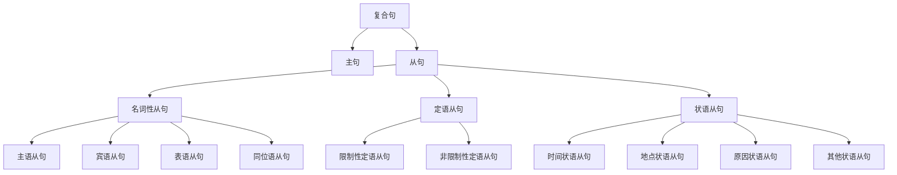
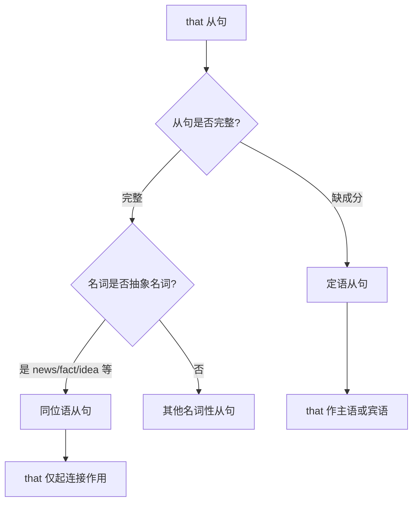
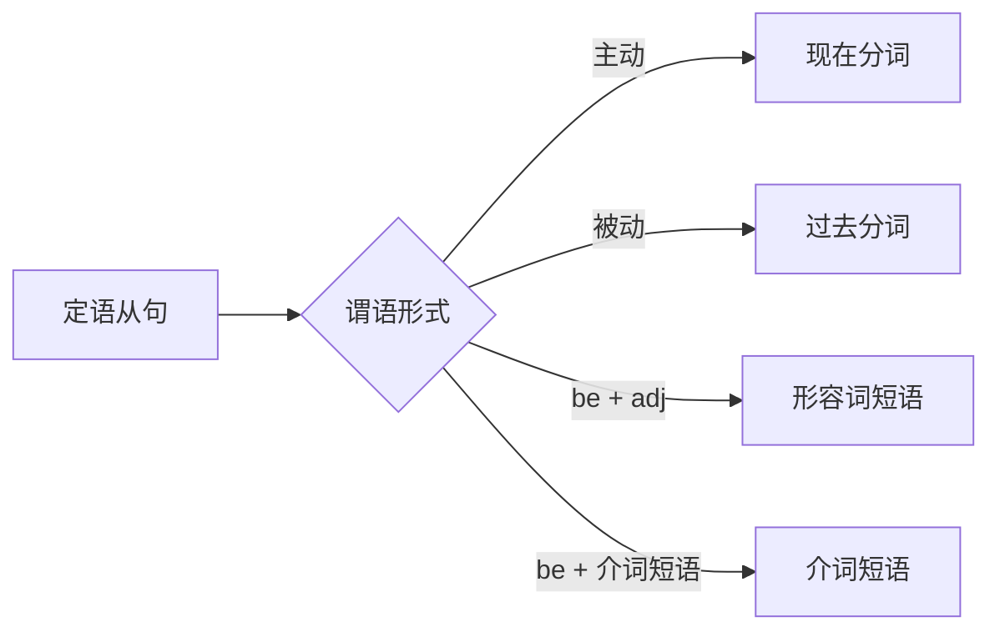
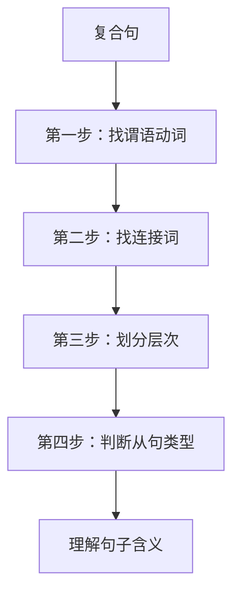
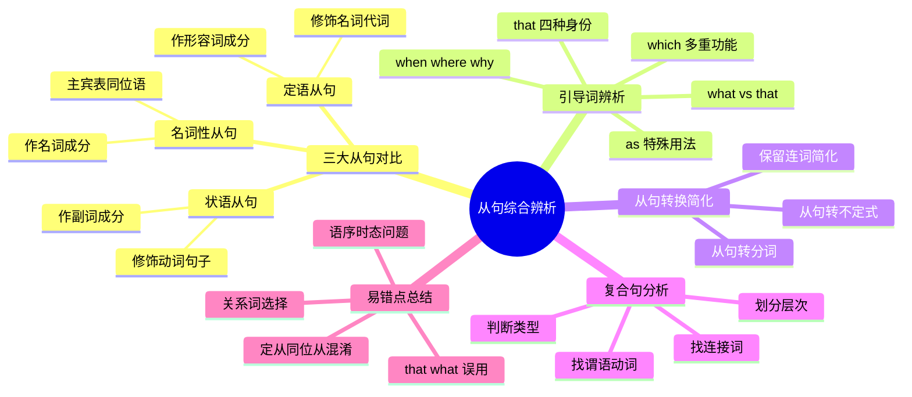

# 从句综合辨析

从句是英语复合句的核心构成单元。前面四篇文档分别详解了定语从句、名词性从句和状语从句的各自特点与用法。本篇作为从句体系的收官之作，将从**宏观对比**的角度，帮助学习者建立三大从句的整体认知框架，重点解决以下问题：

- 三大从句如何区分？它们的本质差异是什么？
- 同一个引导词（如 that、what、when）在不同从句中有何不同？
- 如何将复杂的复合句拆解分析？
- 从句之间可以互相转换吗？如何简化从句？
- 考试和写作中有哪些高频易错点？

---

## 1. 三大从句体系总览

### 1.1 从句的本质：充当句子成分的句子

> [!info] 核心概念
>
> 从句（Clause）是一个包含主语和谓语的语法单位，但它不能独立成句，必须依附于主句存在。从句在复合句中充当某个句子成分，这决定了从句的类型。

英语中的三大从句体系按照**从句在主句中充当的成分**来划分：

| 从句类型 | 充当成分 | 核心功能 | 典型位置 |
| --- | --- | --- | --- |
| **名词性从句** | 名词成分 | 作主语、宾语、表语、同位语 | 句首、动词后、be动词后、名词后 |
| **定语从句** | 形容词成分 | 修饰限定名词或代词 | 紧跟先行词之后 |
| **状语从句** | 副词成分 | 修饰动词、形容词或整个句子 | 句首、句中、句末 |



上图展示了从句体系的层级结构。复合句由主句和从句组成，从句根据其语法功能分为三大类，每类又有更细的子分类。理解这个框架是正确判断从句类型的基础。

### 1.2 从句类型判断的黄金法则

判断一个从句属于哪种类型，关键在于回答一个问题：**这个从句在主句中充当什么成分？**

> [!tip] 判断三步法
>
> 1. **找出从句**：识别由引导词引导的部分
> 2. **删除从句**：看主句缺少什么成分
> 3. **确定类型**：缺名词成分→名词性从句；修饰名词→定语从句；修饰动词或整句→状语从句

**实例分析**：

**例句 1**：*What he said surprised everyone.*
- 从句：What he said
- 删除后：~~What he said~~ surprised everyone. → 主句缺主语
- 结论：主语从句（名词性从句）

**例句 2**：*The book that I bought yesterday is interesting.*
- 从句：that I bought yesterday
- 删除后：The book ~~that I bought yesterday~~ is interesting. → 主句完整，从句修饰 "book"
- 结论：定语从句

**例句 3**：*I will help you when you need me.*
- 从句：when you need me
- 删除后：I will help you ~~when you need me~~. → 主句完整，从句说明时间
- 结论：时间状语从句

### 1.3 三大从句对比表

| 对比维度 | 名词性从句 | 定语从句 | 状语从句 |
| --- | --- | --- | --- |
| **充当成分** | 名词（主/宾/表/同位语） | 形容词（修饰名词） | 副词（修饰动词/句子） |
| **位置特点** | 取决于充当的成分 | 紧跟先行词 | 位置灵活（句首/句中/句末） |
| **引导词功能** | 引导词在从句中可有成分 | 关系词在从句中必有成分 | 引导词仅起连接作用 |
| **that 可否省略** | 宾语从句中可省（非句首） | 限制性定从中作宾语可省 | 不可省略 |
| **与先行词关系** | 无先行词 | 必有先行词 | 无先行词 |
| **从句完整性** | 从句本身可能缺成分 | 从句缺先行词对应的成分 | 从句结构完整 |

---

## 2. 引导词多功能辨析

英语中许多引导词具有"一词多用"的特点，同一个词在不同语境下可以引导不同类型的从句。正确辨析引导词的功能是掌握从句的关键。

### 2.1 that 的四种身份

**that** 是英语中最常见、也是最容易混淆的引导词。它可以充当四种完全不同的角色：

| 身份 | 从句类型 | 功能特点 | 是否可省略 |
| --- | --- | --- | --- |
| 连接词 that | 名词性从句（宾语从句） | 无词义，不作成分 | 可省略 |
| 连接词 that | 名词性从句（主/表/同位语） | 无词义，不作成分 | 不可省略 |
| 关系代词 that | 定语从句 | 指代先行词，作从句成分 | 作宾语时可省略 |
| 指示代词 that | 非从句 | 指示作用 | — |

> [!warning] 辨析要点
>
> - **定语从句的 that**：在从句中作成分（主语或宾语），可以替换为 which/who
> - **名词性从句的 that**：仅起连接作用，在从句中不作任何成分，不能替换为 which/who

**对比实例**：

| 句子 | that 类型 | 分析 |
| --- | --- | --- |
| *I believe **that** he is honest.* | 连接词（宾语从句） | that 不作成分，从句完整 |
| *The news **that** he won excited us.* | 连接词（同位语从句） | that 不作成分，解释 news 内容 |
| *The news **that** he told us was false.* | 关系代词（定语从句） | that 作 told 的宾语，修饰 news |
| ***That** he is honest is clear.* | 连接词（主语从句） | that 不作成分，引导主语从句 |

**深度辨析：同位语从句 vs 定语从句中的 that**

这是考试中最高频的考点之一。判断方法：

1. **看从句是否完整**：
   - 同位语从句：从句结构完整（that 不作成分）
   - 定语从句：从句缺少成分（that 作主语或宾语）

2. **看语义关系**：
   - 同位语从句：解释名词的具体内容（名词 = 从句内容）
   - 定语从句：限定修饰名词（名词 ≠ 从句内容）

3. **尝试替换**：
   - 同位语从句的 that 不能换成 which
   - 定语从句的 that 可以换成 which（指物时）



上图是判断 that 引导从句类型的决策流程。先看从句是否完整，再结合名词类型综合判断。

### 2.2 what 与 that 的核心区别

**what** 和 **that** 都能引导名词性从句，但它们有本质区别：

| 对比项 | what | that |
| --- | --- | --- |
| **词性** | 连接代词（关系代词性质） | 连接词 |
| **含义** | "……的东西/事情"（= the thing(s) that） | 无实际含义 |
| **从句成分** | 在从句中作主语/宾语/表语 | 不作任何成分 |
| **从句完整性** | 从句缺少成分 | 从句结构完整 |

> [!example] 对比实例
>
> - ***What** he said* is true. （what 作 said 的宾语，从句缺宾语）
>   - 他所说的话是真的。
> - ***That** he said so* is true. （that 不作成分，从句完整）
>   - 他那样说了是真的。

**常见错误**：

❌ *I don't know what is he doing.*（what 从句不用疑问语序）
✅ *I don't know what he is doing.*

❌ *That he wants is money.*（that 不能作成分）
✅ *What he wants is money.*（what 作 wants 的宾语）

### 2.3 when/where/why 的双重身份

这三个词既可以引导**定语从句**，也可以引导**状语从句**，还可以引导**名词性从句**。

#### 2.3.1 when 的三种用法

| 用法 | 从句类型 | 特点 | 例句 |
| --- | --- | --- | --- |
| 关系副词 | 定语从句 | 修饰表时间的先行词 | *I remember the day **when** we met.* |
| 连接副词 | 名词性从句 | 引导宾语从句等 | *I don't know **when** he will come.* |
| 从属连词 | 状语从句 | 引导时间状语从句 | ***When** he arrived, I was sleeping.* |

**辨析方法**：

1. **看有无先行词**：
   - 有时间名词先行词（day, time, moment 等）→ 定语从句
   - 无先行词 → 名词性从句或状语从句

2. **看从句功能**：
   - 从句作名词成分 → 名词性从句
   - 从句作时间状语 → 状语从句

**对比实例**：

| 句子 | when 类型 | 分析 |
| --- | --- | --- |
| *This is the time **when** we should act.* | 定语从句 | 修饰 time |
| *I wonder **when** he will arrive.* | 宾语从句 | 作 wonder 的宾语 |
| ***When** spring comes, flowers bloom.* | 状语从句 | 表时间，修饰主句 |

#### 2.3.2 where 的三种用法

| 用法 | 从句类型 | 特点 | 例句 |
| --- | --- | --- | --- |
| 关系副词 | 定语从句 | 修饰表地点的先行词 | *This is the house **where** I was born.* |
| 连接副词 | 名词性从句 | 引导宾语从句等 | *I don't know **where** he lives.* |
| 从属连词 | 状语从句 | 引导地点状语从句 | ***Where** there is a will, there is a way.* |

> [!tip] where 定语从句的扩展用法
>
> where 不仅可以修饰具体地点名词（house, city），还可以修饰抽象"地点"名词：
> - *situation*（处境）、*case*（情况）、*point*（地步）、*stage*（阶段）
> - 例：*We have reached a point **where** a decision must be made.*

#### 2.3.3 why 的用法

**why** 只能引导定语从句（修饰 reason）或名词性从句，不能引导状语从句。

| 用法 | 从句类型 | 例句 |
| --- | --- | --- |
| 关系副词 | 定语从句 | *This is the reason **why** he left.* |
| 连接副词 | 名词性从句 | *I don't know **why** he left.* |

### 2.4 which 的多重功能

**which** 可以引导定语从句和名词性从句，但用法有明显差异：

| 用法 | 从句类型 | 特点 | 例句 |
| --- | --- | --- | --- |
| 关系代词 | 定语从句 | 指代物，作从句主语或宾语 | *The book **which** I bought is good.* |
| 关系代词 | 非限制性定从 | 可指代整个主句 | *He passed the exam, **which** made us happy.* |
| 连接代词 | 名词性从句 | 表"哪一个"，有选择含义 | *I don't know **which** book is better.* |

> [!warning] which 与 that 在定语从句中的区别
>
> | 情况 | 只用 that | 只用 which |
> | --- | --- | --- |
> | 先行词有最高级修饰 | ✓ | ✗ |
> | 先行词有 only/very/same 修饰 | ✓ | ✗ |
> | 先行词是 everything/nothing 等 | ✓ | ✗ |
> | 非限制性定语从句 | ✗ | ✓ |
> | 介词 + 关系代词 | ✗ | ✓ |

### 2.5 as 的特殊用法

**as** 可以引导定语从句、状语从句，用法独特：

#### 2.5.1 as 引导定语从句

| 用法 | 结构 | 例句 |
| --- | --- | --- |
| 固定结构 | the same... as | *This is the same book **as** I lost.* |
| 固定结构 | such... as | *Such problems **as** he raised are important.* |
| 固定结构 | as... as | *I have as much money **as** is needed.* |
| 非限制性定从 | as 指代整句 | ***As** is known to all, the earth is round.* |

#### 2.5.2 as 引导状语从句

| 类型 | 含义 | 例句 |
| --- | --- | --- |
| 时间 | 当……时候 | ***As** he walked, he sang.* |
| 原因 | 因为 | ***As** it was raining, we stayed home.* |
| 方式 | 按照；像 | *Do **as** I tell you.* |
| 比较 | 和……一样 | *She is as tall **as** her mother.* |
| 让步 | 虽然（倒装） | *Young **as** he is, he knows a lot.* |

### 2.6 引导词辨析总表

| 引导词 | 名词性从句 | 定语从句 | 状语从句 |
| --- | --- | --- | --- |
| **that** | ✓（不作成分） | ✓（作成分） | ✗ |
| **what** | ✓（作成分） | ✗ | ✗ |
| **which** | ✓（有选择义） | ✓（指物） | ✗ |
| **who/whom** | ✓（较少见） | ✓（指人） | ✗ |
| **when** | ✓ | ✓（修饰时间名词） | ✓（时间） |
| **where** | ✓ | ✓（修饰地点名词） | ✓（地点） |
| **why** | ✓ | ✓（仅修饰 reason） | ✗ |
| **how** | ✓ | ✗ | ✓（方式） |
| **whether/if** | ✓（是否） | ✗ | ✓（if 条件） |
| **as** | ✗ | ✓（特定结构） | ✓（多种） |
| **because** | ✗ | ✗ | ✓（原因） |
| **although/though** | ✗ | ✗ | ✓（让步） |

---

## 3. 从句的转换与简化

从句与非从句结构之间可以相互转换，掌握这些转换技巧不仅能提升写作的多样性，还能帮助理解复杂句子的内在逻辑。

### 3.1 名词性从句的转换

#### 3.1.1 名词性从句 → 不定式

当从句主语与主句主语一致时，宾语从句常可转换为不定式结构：

| 原句（从句） | 转换后（不定式） |
| --- | --- |
| *I don't know **what I should do**.* | *I don't know **what to do**.* |
| *He decided **that he would go**.* | *He decided **to go**.* |
| *She wondered **where she could find it**.* | *She wondered **where to find it**.* |

**转换条件**：
- 从句主语与主句主语一致
- 从句含有情态动词（should, could, would 等）

#### 3.1.2 名词性从句 → 动名词

某些动词后的宾语从句可以转换为动名词：

| 原句（从句） | 转换后（动名词） |
| --- | --- |
| *I regret **that I told him**.* | *I regret **telling him**.* |
| *He admitted **that he had stolen it**.* | *He admitted **having stolen it**.* |
| *She suggested **that we should leave**.* | *She suggested **leaving**.* |

### 3.2 定语从句的简化

定语从句可以简化为多种结构，取决于从句的具体形式：

#### 3.2.1 简化为分词短语

| 条件 | 简化方式 | 例句 |
| --- | --- | --- |
| 从句谓语为主动态 | → 现在分词短语 | *The man **who is standing** there* → *The man **standing** there* |
| 从句谓语为被动态 | → 过去分词短语 | *The book **which was written** by him* → *The book **written** by him* |
| 从句谓语为进行时 | → 现在分词短语 | *The girl **who is singing**...* → *The girl **singing**...* |



#### 3.2.2 简化为形容词或介词短语

| 原句 | 简化后 |
| --- | --- |
| *The man **who is responsible** for this project* | *The man **responsible** for this project* |
| *Students **who are in the classroom*** | *Students **in the classroom*** |
| *Anyone **who is interested*** | *Anyone **interested*** |

#### 3.2.3 简化为不定式

当定语从句含有情态动词或表将来时，可简化为不定式：

| 原句 | 简化后 |
| --- | --- |
| *I have a lot of work **that I must do**.* | *I have a lot of work **to do**.* |
| *He is the best person **who can help you**.* | *He is the best person **to help you**.* |
| *There is nothing **that we can do**.* | *There is nothing **to do**.* |

> [!warning] 定语从句简化的限制
>
> 以下情况不宜简化：
> 1. 非限制性定语从句（保留关系词更清晰）
> 2. 从句谓语为一般现在时表习惯（简化后语义改变）
> 3. 先行词是 one, someone 等不定代词时需谨慎

### 3.3 状语从句的简化

状语从句的简化是英语写作的重要技巧，可以使句子更简洁有力。

#### 3.3.1 简化条件

状语从句简化的基本条件：
1. **从句主语与主句主语一致**
2. 或从句主语为 it（表天气、时间等无人称主语）

#### 3.3.2 各类状语从句的简化

| 从句类型 | 原句 | 简化后 |
| --- | --- | --- |
| **时间** | *When he arrived, he called me.* | ***Arriving**, he called me.* |
| **时间** | *After he had finished the work,...* | ***Having finished** the work,...* |
| **原因** | *Because he was tired, he went to bed.* | ***Being tired**, he went to bed.* |
| **原因** | *As she didn't know what to do,...* | ***Not knowing** what to do,...* |
| **条件** | *If it is heated, ice will melt.* | ***If heated**, ice will melt.* |
| **让步** | *Although he was young, he was wise.* | ***Though young**, he was wise.* |
| **让步** | *Although defeated, they didn't give up.* | ***Though defeated**,...* |

> [!tip] 简化后的结构类型
>
> | 简化结构 | 说明 | 例句 |
> | --- | --- | --- |
> | 现在分词短语 | 主动、进行 | *Walking along the road, he met an old friend.* |
> | 过去分词短语 | 被动、完成 | *Seen from the hill, the village looks beautiful.* |
> | 完成分词短语 | 强调先于主句动作 | *Having finished his homework, he went out.* |
> | 形容词短语 | 从句含 be + adj | *Happy about the result, she smiled.* |
> | 介词短语 | 从句含 be + 介词短语 | *In trouble, he asked for help.* |

#### 3.3.3 保留连词的简化

有时为了保持语义清晰，可以保留从属连词：

| 原句 | 保留连词的简化 |
| --- | --- |
| *When I was walking in the park,...* | ***When walking** in the park,...* |
| *Although he was defeated,...* | ***Although defeated**,...* |
| *If it is necessary,...* | ***If necessary**,...* |
| *While he was in London,...* | ***While in London**,...* |

### 3.4 从句之间的转换

三大从句之间在某些情况下可以相互转换：

#### 3.4.1 定语从句 ↔ 同位语从句

| 定语从句 | 同位语从句 |
| --- | --- |
| *The news **that** he told us was exciting.* | *The news **that** he had won was exciting.* |
| （that 作宾语，修饰 news） | （that 解释 news 的内容） |

**转换可能性**：当定语从句描述的是名词的具体内容时，有时可改写为同位语从句。

#### 3.4.2 状语从句 ↔ 定语从句

某些情况下，状语从句可以改写为定语从句：

| 状语从句 | 定语从句（改写） |
| --- | --- |
| *He came back **because he missed his family**.* | *He came back **for the reason that he missed his family**.* |
| *I will help you **if you need me**.* | *I will help you **in any case when you need me**.* |

---

## 4. 复合句分析方法

复合句（Complex Sentence）是包含一个或多个从句的句子。分析复合句的能力对于阅读理解和写作都至关重要。

### 4.1 复合句分析四步法

> [!info] 分析步骤
>
> 1. **找谓语动词**：确定句子有几个谓语动词
> 2. **找连接词**：识别引导从句的连接词
> 3. **划分层次**：明确主句和从句的边界
> 4. **判断类型**：确定每个从句的类型和功能



### 4.2 实例分析

#### 4.2.1 单层从句

**例句**：*I believe that he will succeed.*

分析过程：
1. 谓语动词：believe（主句）、will succeed（从句）
2. 连接词：that
3. 层次划分：
   - 主句：I believe
   - 从句：that he will succeed
4. 从句类型：that 引导的宾语从句（作 believe 的宾语）

**结构图示**：
```
I believe [that he will succeed].
  主句         宾语从句
```

#### 4.2.2 多层嵌套从句

**例句**：*The teacher who taught us said that the student who worked hard would succeed.*

分析过程：
1. 谓语动词：taught（从句1）、said（主句）、worked（从句2）、would succeed（从句3）
2. 连接词：who（2个）、that
3. 层次划分：
   - 主句：The teacher said
   - 定语从句1：who taught us（修饰 teacher）
   - 宾语从句：that the student would succeed
   - 定语从句2：who worked hard（修饰 student，嵌套在宾语从句中）
4. 结构：主句 + 定语从句 + 宾语从句（内含定语从句）

**结构图示**：
```
The teacher [who taught us] said [that the student [who worked hard] would succeed].
    主语        定语从句(1)  谓语          宾语从句
                                   主语    定语从句(2)    谓语
```

#### 4.2.3 并列从句

**例句**：*I know where he lives and when he will come.*

分析过程：
1. 谓语动词：know（主句）、lives（从句1）、will come（从句2）
2. 连接词：where、and、when
3. 层次划分：
   - 主句：I know
   - 宾语从句1：where he lives
   - 宾语从句2：when he will come
   - 两个宾语从句由 and 并列
4. 结构：主句 + 并列宾语从句

### 4.3 从句的识别标志

| 从句类型 | 识别标志 |
| --- | --- |
| **名词性从句** | 位于动词前（主语）、动词后（宾语）、be 动词后（表语）、名词后（同位语） |
| **定语从句** | 紧跟名词/代词后，可加逗号 |
| **状语从句** | 位置灵活，常加逗号与主句分开 |

### 4.4 长难句拆解技巧

面对长难句，可以采用以下策略：

> [!tip] 长难句拆解策略
>
> 1. **括号法**：用不同括号标记不同从句
>    - [ ] 定语从句
>    - ( ) 名词性从句
>    - { } 状语从句
>
> 2. **提取主干**：先删除所有从句，找出主句主干
>
> 3. **逐层还原**：从最内层从句开始，逐层理解

**实例**：

*The report \{which was released yesterday\} says (that the number of students \[who failed the exam\] has decreased) \{because the school adopted a new teaching method\}.*

拆解：
- 主干：The report says that the number has decreased.
- 定语从句1：which was released yesterday（修饰 report）
- 宾语从句：that the number of students has decreased
- 定语从句2：who failed the exam（修饰 students）
- 原因状语从句：because the school adopted a new teaching method

翻译：昨天发布的报告称，由于学校采用了新的教学方法，考试不及格的学生人数已经减少。

---

## 5. 高频易错点辨析

### 5.1 that 与 what 的误用

> [!warning] 高频错误
>
> **错误**：*That he wants is money.*
> **正确**：*What he wants is money.*
>
> **分析**：从句缺少 wants 的宾语，需要用 what（作宾语），不能用 that（不作成分）

**判断口诀**：
- 从句完整用 that
- 从句缺成分用 what

| 正确 | 错误 | 原因 |
| --- | --- | --- |
| *What surprised me was his attitude.* | *That surprised me...* | 从句缺主语 |
| *That he came late surprised me.* | *What he came late...* | 从句已完整 |
| *I don't know what to do.* | *...that to do* | what 作 do 的宾语 |
| *I know that he is honest.* | *...what he is honest* | 从句已完整 |

### 5.2 定语从句与同位语从句的混淆

| 特征 | 定语从句 | 同位语从句 |
| --- | --- | --- |
| **从句完整性** | 缺成分（that/which 作成分） | 完整（that 不作成分） |
| **语义关系** | 修饰限定先行词 | 解释说明名词内容 |
| **先行词类型** | 任何名词 | 抽象名词（news, fact, idea 等） |
| **that 可否替换** | 可换成 which（指物） | 不能换成 which |

**对比例句**：

| 句子 | 类型 | 分析 |
| --- | --- | --- |
| *The news **that** she told me was exciting.* | 定语从句 | that 作 told 的宾语，从句缺宾语 |
| *The news **that** she had won was exciting.* | 同位语从句 | that 不作成分，解释 news 内容 |

### 5.3 关系代词与关系副词的误用

**易错点**：用 where/when 代替 which/that

> [!warning] 常见错误
>
> **错误**：*This is the factory **where** we visited yesterday.*
> **正确**：*This is the factory **which/that** we visited yesterday.*
>
> **分析**：visit 是及物动词，需要宾语，应用关系代词 which/that 作宾语

**判断方法**：
- 从句缺主语或宾语 → 用关系代词（who/which/that）
- 从句缺状语（完整但缺地点/时间/原因） → 用关系副词（where/when/why）

| 正确 | 错误 | 原因 |
| --- | --- | --- |
| *the house **where** I live* | *...which I live* | live 不及物，缺状语 |
| *the house **which** I bought* | *...where I bought* | buy 及物，缺宾语 |
| *the day **when** he arrived* | *...which he arrived* | arrive 不及物，缺状语 |
| *the day **which** we spent together* | *...when we spent together* | spend 及物，缺宾语 |

### 5.4 宾语从句的语序问题

> [!warning] 宾语从句必须用陈述语序
>
> **错误**：*I don't know **where is he**.*
> **正确**：*I don't know **where he is**.*

无论引导词是什么，宾语从句都要用陈述语序（主语 + 谓语）：

| 错误（疑问语序） | 正确（陈述语序） |
| --- | --- |
| *I wonder what is his name.* | *I wonder what his name is.* |
| *Tell me where did you go.* | *Tell me where you went.* |
| *I asked why was he late.* | *I asked why he was late.* |

### 5.5 状语从句时态问题

**主将从现**：在时间、条件状语从句中，用一般现在时代替将来时。

| 错误 | 正确 | 从句类型 |
| --- | --- | --- |
| *I will call you when I **will arrive**.* | *...when I **arrive**.* | 时间 |
| *If it **will rain**, we will stay home.* | *If it **rains**,...* | 条件 |
| *Unless you **will help** me,...* | *Unless you **help** me,...* | 条件 |

> [!tip] 例外情况
>
> 当 when/if 引导的是**名词性从句**（不是状语从句）时，可以用将来时：
> - *I don't know **when he will come**.* （宾语从句，可用 will）
> - *I wonder **if it will rain**.* （宾语从句，可用 will）

### 5.6 定语从句中介词的位置

当关系代词作介词宾语时，介词可以前置或后置：

| 介词后置 | 介词前置 | 注意事项 |
| --- | --- | --- |
| *the pen **that/which** I wrote **with*** | *the pen **with which** I wrote* | 介词前置时不能用 that |
| *the man **who/whom** I talked **to*** | *the man **to whom** I talked* | 介词前置时用 whom |

**常见错误**：

| 错误 | 正确 | 原因 |
| --- | --- | --- |
| *the pen with that I wrote* | *the pen with which I wrote* | 介词后不能用 that |
| *the man to who I talked* | *the man to whom I talked* | 介词后用 whom |

### 5.7 非限制性定语从句的特殊用法

非限制性定语从句的关系词指代整个主句时，只能用 which 或 as：

| 正确 | 错误 | 说明 |
| --- | --- | --- |
| *He passed, **which** made us happy.* | *...that made us...* | which 指代整句 |
| ***As** is known, the earth is round.* | *Which is known,...* | as 可置于句首 |

**which 与 as 指代整句的区别**：

| which | as |
| --- | --- |
| 只能位于主句之后 | 可位于句首、句中、句末 |
| 含有评论、结果意味 | 表示"正如"，较为客观 |

---

## 6. 从句写作提升技巧

### 6.1 从句使用的层次感

在写作中，从句的运用体现了语言表达的复杂度和精确度。以下是从句使用的层次建议：

| 水平 | 特点 | 示例 |
| --- | --- | --- |
| **基础** | 简单从句，结构清晰 | *I think that he is right.* |
| **中级** | 多种从句混合使用 | *The book that I bought when I was in London is interesting.* |
| **高级** | 从句嵌套，表达精准 | *What surprised me was that the man who helped me turned out to be my teacher.* |

### 6.2 从句与简单句的平衡

> [!tip] 写作建议
>
> - 不要每句都用从句（显得累赘）
> - 不要全是简单句（显得幼稚）
> - 关键信息用从句强调，次要信息用简单句或短语
> - 长句与短句交替使用，形成节奏感

**改写示例**：

| 原文（过于简单） | 改写后（适当使用从句） |
| --- | --- |
| *He is a teacher. He teaches English. He is from Canada.* | *He is a teacher **who teaches English** and **who comes from Canada**.* |
| 或更简洁 | *He is an English teacher **from Canada**.* |

### 6.3 从句的准确性检查清单

写完含从句的句子后，检查以下几点：

- [ ] **引导词选择正确**：that/what/which/who 是否用对？
- [ ] **从句语序正确**：是否为陈述语序？
- [ ] **从句成分完整**：该有的成分是否都有？
- [ ] **时态呼应正确**：主句与从句时态是否协调？
- [ ] **标点符号正确**：非限制性定语从句是否有逗号？

---

## 7. 综合练习

### 7.1 从句类型判断

判断下列句子中划线从句的类型：

1. *<u>That she will come</u> is certain.*
2. *I don't know <u>what his name is</u>.*
3. *The question is <u>whether we should go</u>.*
4. *The news <u>that he had won</u> spread quickly.*
5. *The man <u>who helped me</u> was my neighbor.*
6. *This is the place <u>where we first met</u>.*
7. *<u>When I was young</u>, I lived in Beijing.*
8. *I will help you <u>if you need me</u>.*

**参考答案**：
1. 主语从句（名词性从句）
2. 宾语从句（名词性从句）
3. 表语从句（名词性从句）
4. 同位语从句（名词性从句）
5. 定语从句
6. 定语从句
7. 时间状语从句
8. 条件状语从句

### 7.2 填空练习

用适当的引导词填空：

1. _______ he said at the meeting surprised everyone. (what)
2. I believe _______ you are telling the truth. (that)
3. This is the house _______ Lu Xun once lived. (where)
4. This is the house _______ Lu Xun once visited. (that/which)
5. The reason _______ he was late is unknown. (why)
6. I wonder _______ he will come tomorrow. (whether/if)
7. _______ is known to all, light travels faster than sound. (As)
8. The news _______ our team won made us excited. (that)

### 7.3 改错练习

找出并改正下列句子中的错误：

1. *I don't know what is he doing.* → what he is doing
2. *That he wants is a new car.* → What he wants
3. *This is the factory where we visited last week.* → which/that we visited
4. *If it will rain tomorrow, we will stay at home.* → If it rains
5. *The book which I told you is very interesting.* → which I told you about
6. *I asked him that he could help me.* → whether/if he could

### 7.4 句子合并练习

将下列简单句合并为含从句的复合句：

1. *He told me something. I couldn't believe it.*
   → *I couldn't believe what he told me.*
   或 *What he told me was something I couldn't believe.*

2. *The boy broke the window. He has been punished.*
   → *The boy who broke the window has been punished.*

3. *I don't know the reason. He didn't come to the party.*
   → *I don't know the reason why he didn't come to the party.*
   或 *I don't know why he didn't come to the party.*

4. *Spring comes. Flowers bloom.*
   → *When spring comes, flowers bloom.*
   或 *Flowers bloom when spring comes.*

### 7.5 从句简化练习

将下列从句简化为非从句结构：

1. *The girl who is standing there is my sister.*
   → *The girl standing there is my sister.*

2. *When he was asked why he was late, he kept silent.*
   → *When asked why he was late, he kept silent.*
   或 *Asked why he was late, he kept silent.*

3. *Because he didn't know what to say, he remained silent.*
   → *Not knowing what to say, he remained silent.*

4. *The book which was written by him sold well.*
   → *The book written by him sold well.*

---

## 8. 本篇小结

本篇作为从句体系的综合辨析，系统梳理了三大从句的核心知识：



**核心要点回顾**：

1. **判断从句类型的关键**：看从句在主句中充当什么成分
2. **引导词辨析的核心**：看引导词在从句中是否作成分、从句是否完整
3. **that 与 what 的区别**：that 不作成分，what 作成分
4. **定语从句与同位语从句**：看从句完整性和语义关系
5. **从句简化的条件**：主从句主语一致是关键
6. **复合句分析方法**：找动词→找连接词→划层次→定类型

> [!success] 学习建议
>
> 1. **多读多练**：阅读中注意识别各类从句
> 2. **对比记忆**：将相似的引导词放在一起对比
> 3. **仿写练习**：模仿例句写出自己的句子
> 4. **错题整理**：收集易错点，反复复习
> 5. **循序渐进**：先掌握简单从句，再学习复杂嵌套

至此，从句体系的五篇文档全部完成。建议学习者按照顺序学习：定语从句基础 → 定语从句进阶 → 名词性从句详解 → 状语从句详解 → 从句综合辨析，逐步建立完整的从句知识体系。
