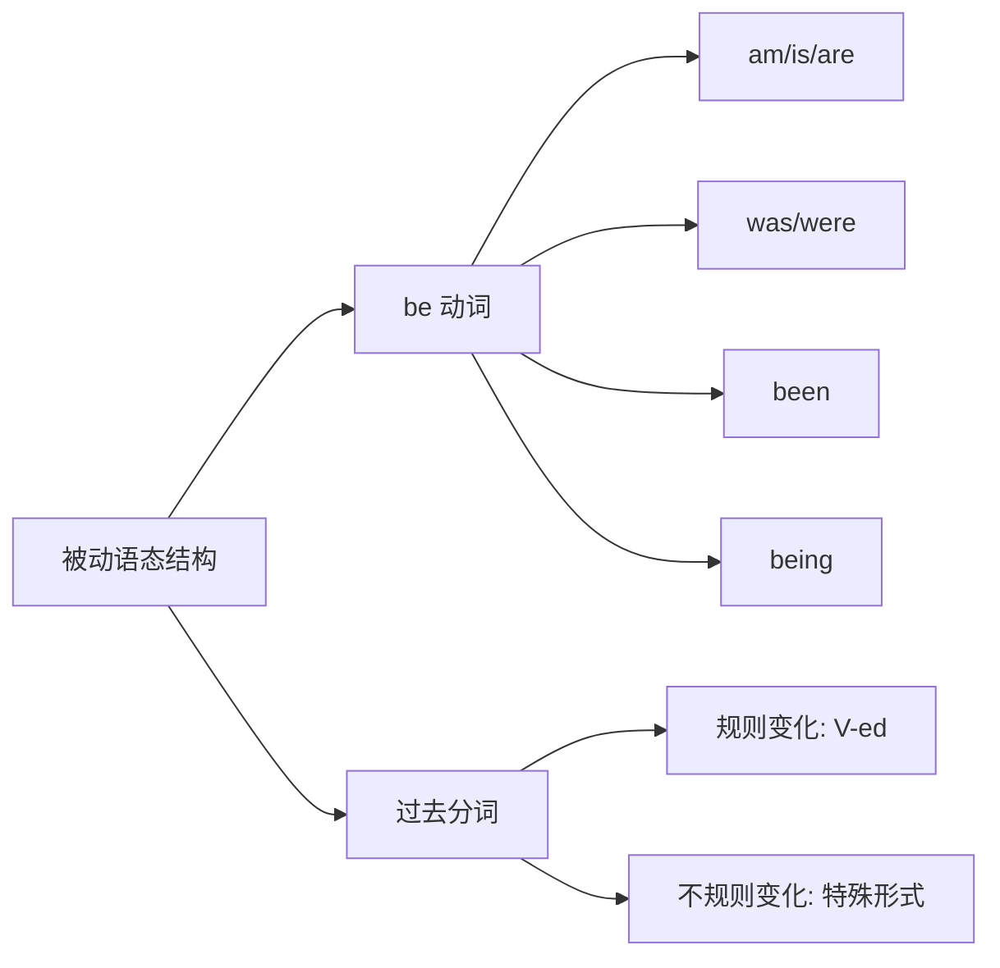
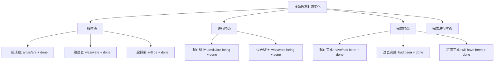
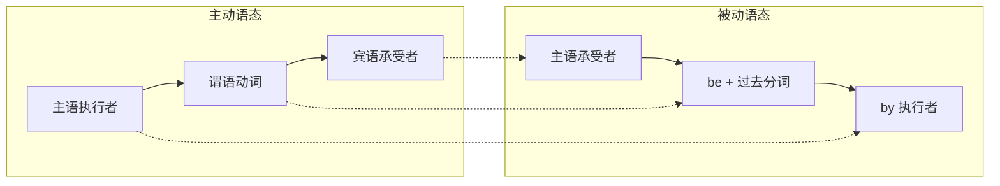
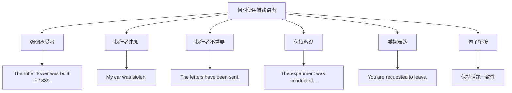
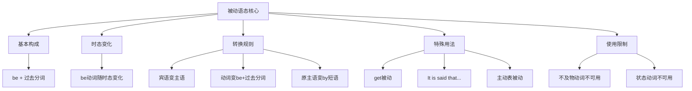

# 被动语态全解

## 1. 被动语态概述

### 1.1 什么是语态

在英语语法中，**语态（Voice）** 是动词的一种形式，用来表示主语与动作之间的关系。英语有两种语态：

| 语态类型 | 英文名称 | 主语角色 | 核心特征 |
| --- | --- | --- | --- |
| **主动语态** | Active Voice | 动作的执行者 | 主语"做"动作 |
| **被动语态** | Passive Voice | 动作的承受者 | 主语"被做"动作 |

> [!info] 语态的本质
>
> 语态反映的是「谁对谁做了什么」的视角问题。主动语态从动作执行者的角度描述，被动语态从动作承受者的角度描述。选择哪种语态，取决于说话者想要强调什么。

**对比示例**：

```
主动语态：Tom broke the window.（汤姆打破了窗户。）
          ↓
          主语 Tom 是动作的执行者，他"做"了打破的动作

被动语态：The window was broken by Tom.（窗户被汤姆打破了。）
          ↓
          主语 The window 是动作的承受者，它"被"打破
```

### 1.2 为什么需要被动语态

被动语态并非简单的语法变换，它有着明确的交际功能和使用场景：

**功能一：强调动作的承受者**

当我们更关心「谁或什么受到了影响」而非「谁做的」时，使用被动语态：

```
The Mona Lisa was painted in the early 16th century.
《蒙娜丽莎》绘制于16世纪初。

分析：我们关注的是这幅画（承受者），而非达芬奇（执行者）
```

**功能二：动作执行者未知或不重要**

当执行者不明确、不需要说明或显而易见时：

```
My bike was stolen last night.
我的自行车昨晚被偷了。

分析：小偷是谁不知道，也不重要，重点是自行车被偷这件事
```

**功能三：客观、正式的表达**

学术写作、新闻报道、科技文献常用被动语态，使表达更客观：

```
The experiment was conducted under controlled conditions.
实验在受控条件下进行。

分析：学术文章避免使用"我们做了实验"这种主观表达
```

**功能四：礼貌或委婉的表达**

避免直接指责某人：

```
Mistakes were made.（有错误发生。）
比 "You made mistakes." 更委婉
```

### 1.3 被动语态的基本构成

> [!tip] 核心公式
>
> **被动语态 = be + 过去分词（done/V-ed）**
>
> 其中 be 动词根据时态、人称、数进行变化，过去分词形式不变。



**结构分解**：

| 成分 | 作用 | 变化规则 |
| --- | --- | --- |
| **be 动词** | 体现时态、人称、数 | 随时态变化：am/is/are/was/were/been/being |
| **过去分词** | 表示被动含义 | 规则动词加-ed，不规则动词需记忆 |
| **by + 执行者** | 说明动作由谁执行（可省略） | 当执行者重要或需要强调时使用 |

**基本例句**：

```
English is spoken in many countries.
英语在很多国家被使用。
        ↓
        be动词(is) + 过去分词(spoken)

The letter was written by my father.
这封信是我父亲写的。
            ↓
            be动词(was) + 过去分词(written) + by执行者
```

---

## 2. 各时态的被动语态形式

### 2.1 时态与被动语态总览

> [!info] 学习要点
>
> 被动语态的核心结构是「be + 过去分词」，不同时态只是 be 动词的形式不同。掌握各时态中 be 动词的变化规律，就能正确构建任何时态的被动语态。



### 2.2 一般时态的被动语态

#### 2.2.1 一般现在时被动语态

**构成公式**：`am/is/are + 过去分词`

| 人称 | 单数 | 复数 |
| --- | --- | --- |
| 第一人称 | I am done | We are done |
| 第二人称 | You are done | You are done |
| 第三人称 | He/She/It is done | They are done |

**例句详解**：

```
1. Rice is grown in many Asian countries.
   稻米在很多亚洲国家种植。

   结构分析：Rice(主语) + is(be动词) + grown(grow的过去分词)
   语法说明：描述客观事实和习惯性动作

2. The museum is visited by thousands of tourists every year.
   这座博物馆每年有数千名游客参观。

   结构分析：主语(The museum) + is visited + by执行者 + 时间状语
   语法说明：强调博物馆被参观这一事实

3. These products are made in China.
   这些产品在中国制造。

   结构分析：复数主语 + are + 过去分词
   语法说明：常见于产品标识
```

#### 2.2.2 一般过去时被动语态

**构成公式**：`was/were + 过去分词`

| 人称 | 单数 | 复数 |
| --- | --- | --- |
| 第一人称 | I was done | We were done |
| 第二人称 | You were done | You were done |
| 第三人称 | He/She/It was done | They were done |

**例句详解**：

```
1. America was discovered by Columbus in 1492.
   美洲于1492年被哥伦布发现。

   结构分析：America(主语) + was(be动词) + discovered(过去分词) + by Columbus
   语法说明：历史事件，明确的过去时间

2. The house was built 100 years ago.
   这栋房子建于100年前。

   结构分析：主语 + was built + 时间状语
   语法说明：执行者未提及，因为不重要或未知

3. All the cookies were eaten by the children.
   所有的饼干都被孩子们吃掉了。

   结构分析：复数主语 + were + 过去分词 + by执行者
   语法说明：强调饼干（承受者）的结果
```

#### 2.2.3 一般将来时被动语态

**构成公式**：`will be + 过去分词` 或 `am/is/are going to be + 过去分词`

**例句详解**：

```
1. The meeting will be held next Monday.
   会议将于下周一举行。

   结构分析：主语 + will be + 过去分词 + 时间状语
   语法说明：将来发生的被动动作

2. A new hospital is going to be built in this area.
   这个地区将要建一座新医院。

   结构分析：主语 + is going to be + 过去分词
   语法说明：be going to 表示计划中的将来

3. The results will be announced tomorrow.
   结果将于明天公布。

   结构分析：主语 + will be + 过去分词 + 时间状语
   语法说明：正式场合常用被动语态
```

### 2.3 进行时态的被动语态

#### 2.3.1 现在进行时被动语态

**构成公式**：`am/is/are + being + 过去分词`

> [!warning] 注意 being 的位置
>
> 进行时的被动语态需要加 being，表示「正在被...」的进行状态。不要漏掉 being！

**例句详解**：

```
1. A new bridge is being built across the river.
   一座新桥正在河上建造。

   结构分析：主语 + is being + 过去分词
   语法说明：强调动作正在进行中

2. The patient is being examined by the doctor now.
   病人现在正在被医生检查。

   结构分析：主语 + is being + 过去分词 + by执行者 + 时间状语
   语法说明：此刻正在发生的被动动作

3. The rooms are being cleaned at the moment.
   房间此刻正在被打扫。

   结构分析：复数主语 + are being + 过去分词
   语法说明：at the moment 表示此刻
```

#### 2.3.2 过去进行时被动语态

**构成公式**：`was/were + being + 过去分词`

**例句详解**：

```
1. When I arrived, dinner was being prepared.
   当我到达时，晚餐正在准备中。

   结构分析：时间状语从句 + 主语 + was being + 过去分词
   语法说明：过去某时刻正在进行的被动动作

2. The car was being repaired when I called.
   我打电话时，车正在被修理。

   结构分析：主语 + was being + 过去分词 + 时间状语从句
   语法说明：过去进行时表示过去某段时间正在进行

3. The documents were being copied while we waited.
   我们等待时，文件正在被复印。

   结构分析：复数主语 + were being + 过去分词
   语法说明：同时发生的两个过去动作
```

### 2.4 完成时态的被动语态

#### 2.4.1 现在完成时被动语态

**构成公式**：`have/has + been + 过去分词`

**例句详解**：

```
1. The work has been finished.
   工作已经完成了。

   结构分析：主语 + has been + 过去分词
   语法说明：强调动作已完成，对现在有影响

2. Three new schools have been built in our city.
   我们城市已经建了三所新学校。

   结构分析：主语 + have been + 过去分词
   语法说明：复数主语用 have been

3. The criminal has been caught by the police.
   罪犯已经被警察抓住了。

   结构分析：主语 + has been + 过去分词 + by执行者
   语法说明：强调结果——已被抓住
```

#### 2.4.2 过去完成时被动语态

**构成公式**：`had + been + 过去分词`

**例句详解**：

```
1. The report had been submitted before the deadline.
   报告在截止日期前已经提交了。

   结构分析：主语 + had been + 过去分词 + 时间状语
   语法说明：过去某时间之前已完成的被动动作

2. By the time we arrived, the movie had been started.
   我们到达时，电影已经开始了。

   结构分析：时间状语 + 主语 + had been + 过去分词
   语法说明：「过去的过去」已完成

3. The building had been destroyed before the firefighters arrived.
   消防员到达之前，建筑已经被毁了。

   结构分析：主语 + had been + 过去分词 + 时间状语从句
   语法说明：两个过去动作，被毁在先
```

#### 2.4.3 将来完成时被动语态

**构成公式**：`will have been + 过去分词`

**例句详解**：

```
1. The project will have been completed by next month.
   这个项目到下个月将已经完成。

   结构分析：主语 + will have been + 过去分词 + 时间状语
   语法说明：将来某时间之前将已完成

2. By 2030, thousands of electric cars will have been sold.
   到2030年，将已售出数千辆电动汽车。

   结构分析：时间状语 + 主语 + will have been + 过去分词
   语法说明：对将来的预测

3. The new system will have been installed by the end of the week.
   新系统将在本周末前安装完毕。

   结构分析：主语 + will have been + 过去分词 + 时间状语
   语法说明：将来完成时表示将来某点前的完成
```

### 2.5 时态被动语态速查表

| 时态 | 主动语态 | 被动语态 | 例句 |
| --- | --- | --- | --- |
| 一般现在时 | do/does | am/is/are done | English is spoken here. |
| 一般过去时 | did | was/were done | The window was broken. |
| 一般将来时 | will do | will be done | The work will be finished. |
| 现在进行时 | am/is/are doing | am/is/are being done | The car is being repaired. |
| 过去进行时 | was/were doing | was/were being done | Dinner was being cooked. |
| 现在完成时 | have/has done | have/has been done | The letter has been sent. |
| 过去完成时 | had done | had been done | The task had been completed. |
| 将来完成时 | will have done | will have been done | It will have been done by then. |

> [!warning] 注意事项
>
> 1. **将来进行时**和**完成进行时**的被动语态在实际使用中非常少见，一般不作为考点
> 2. 被动语态的否定形式：在 be 动词或助动词后加 not
> 3. 被动语态的疑问形式：将 be 动词或助动词提前

---

## 3. 主动语态变被动语态

### 3.1 基本转换规则

> [!tip] 转换三步法
>
> 1. **找宾语** → 将主动句的宾语变为被动句的主语
> 2. **变动词** → 将动词变为「be + 过去分词」形式，be 动词与新主语保持一致
> 3. **加 by** → 将原主动句的主语放到 by 后面（可省略）



**转换示例**：

```
主动：Tom broke the window.
      主语   谓语   宾语

步骤1：宾语 the window 变主语
步骤2：broke 变为 was broken（主语单数，过去时）
步骤3：原主语 Tom 放到 by 后

被动：The window was broken by Tom.
      主语        谓语       by+执行者
```

### 3.2 含双宾语句子的被动语态

有些动词可以带两个宾语：**间接宾语（人）** 和 **直接宾语（物）**。这类句子可以有两种被动形式。

**常见双宾语动词**：give, send, show, teach, tell, offer, bring, lend, pass, write, buy, make 等

**转换规则**：

```
主动：My father gave me a book.
      主语     谓语  间宾  直宾

被动形式一（间接宾语作主语）：
I was given a book by my father.
我被我父亲给了一本书。

被动形式二（直接宾语作主语）：
A book was given to me by my father.
一本书被我父亲给了我。
```

> [!warning] 注意介词的使用
>
> 当直接宾语（物）作被动句主语时，间接宾语（人）前需要加介词：
> - 大多数动词用 **to**：give, send, show, teach, tell, offer, bring, lend, pass, write
> - 少数动词用 **for**：buy, make, cook, get, find

**更多示例**：

```
主动：She showed us her photos.
被动1：We were shown her photos.（人作主语）
被动2：Her photos were shown to us.（物作主语）

主动：Mom made me a cake.
被动1：I was made a cake by mom.（人作主语）
被动2：A cake was made for me by mom.（物作主语，用 for）
```

### 3.3 含复合宾语句子的被动语态

复合宾语结构：**宾语 + 宾语补足语**

当主动句含有复合宾语时，变被动语态后，宾语补足语保留在原位。

#### 3.3.1 宾补是名词或形容词

```
主动：They elected him chairman.
      他们选他当主席。

被动：He was elected chairman.
      他被选为主席。
      （名词补足语 chairman 保留）

主动：We painted the wall white.
      我们把墙刷成白色。

被动：The wall was painted white.
      墙被刷成白色。
      （形容词补足语 white 保留）
```

#### 3.3.2 宾补是不带 to 的不定式

某些动词（感官动词、使役动词）后接不带 to 的不定式作宾补，变被动语态时**必须加上 to**。

**相关动词**：
- 感官动词：see, hear, watch, notice, observe, feel
- 使役动词：make, let, have

```
主动：I saw him cross the street.
      我看见他过马路。
      （cross 不带 to）

被动：He was seen to cross the street.
      他被看见过马路。
      （必须加 to）

主动：The boss made the workers work overtime.
      老板让工人们加班。

被动：The workers were made to work overtime.
      工人们被迫加班。
      （make 变被动必须加 to）
```

> [!info] let 的特殊情况
>
> let 通常不用于被动语态，一般用 be allowed to 替代：
> - 主动：They let me go.
> - 被动：I was allowed to go.（而非 I was let to go.）

#### 3.3.3 宾补是带 to 的不定式

如果原句中宾补已经带 to，变被动时保持不变：

```
主动：The teacher asked us to finish the homework.
      老师要求我们完成作业。

被动：We were asked to finish the homework.
      我们被要求完成作业。
      （to finish 保持不变）
```

#### 3.3.4 宾补是现在分词

变被动时，现在分词保留：

```
主动：I found him sleeping in class.
      我发现他在课上睡觉。

被动：He was found sleeping in class.
      他被发现在课上睡觉。
      （sleeping 保留）
```

### 3.4 含情态动词句子的被动语态

**构成公式**：`情态动词 + be + 过去分词`

```
主动：You must finish the work today.
      你必须今天完成这项工作。

被动：The work must be finished today.
      这项工作必须今天完成。

主动：We can solve this problem.
      我们能解决这个问题。

被动：This problem can be solved.
      这个问题能被解决。
```

**各情态动词的被动形式**：

| 情态动词 | 被动形式 | 例句 |
| --- | --- | --- |
| can | can be done | It can be done easily. |
| may | may be done | The meeting may be cancelled. |
| must | must be done | This must be finished today. |
| should | should be done | Rules should be followed. |
| could | could be done | More could be done. |
| would | would be done | It would be appreciated. |
| might | might be done | The plan might be changed. |
| have to | have to be done | It has to be done now. |
| ought to | ought to be done | It ought to be improved. |

### 3.5 含短语动词的被动语态

短语动词（动词 + 介词/副词）变被动时，要将短语动词作为一个整体，介词或副词不能丢掉。

**常见短语动词**：

```
look after（照顾）    → be looked after
take care of（照顾）  → be taken care of
laugh at（嘲笑）      → be laughed at
look down upon（看不起） → be looked down upon
pay attention to（注意） → be paid attention to
put off（推迟）       → be put off
turn on（打开）       → be turned on
cut down（砍倒）      → be cut down
```

**例句**：

```
主动：The nurse looked after the patient carefully.
      护士细心地照顾病人。

被动：The patient was looked after carefully by the nurse.
      病人被护士细心地照顾。
      （after 不能丢）

主动：They put off the meeting.
      他们推迟了会议。

被动：The meeting was put off.
      会议被推迟了。
      （off 不能丢）
```

---

## 4. 被动语态的特殊用法

### 4.1 get + 过去分词

除了 be + 过去分词，英语中还可以用 **get + 过去分词** 表示被动，常用于口语和非正式场合。

**特点**：
- 更口语化
- 强调状态的变化或意外情况
- 常用于消极或不愉快的事件

**例句对比**：

```
be 被动：He was hurt in the accident.（陈述事实）
get 被动：He got hurt in the accident.（强调意外）

be 被动：They were married in 2020.（正式）
get 被动：They got married in 2020.（口语化）

常见 get 被动表达：
get lost（迷路）
get hurt（受伤）
get killed（被杀）
get caught（被抓）
get fired（被解雇）
get married（结婚）
get dressed（穿衣）
get paid（获得报酬）
```

### 4.2 主动形式表被动意义

某些情况下，虽然形式上是主动语态，但表达的是被动意义：

#### 4.2.1 系动词 + 形容词/名词

```
The book sells well.（这本书卖得好。）
= The book is sold well.

This kind of cloth washes easily.（这种布料容易洗。）
= This kind of cloth is easily washed.

The door won't lock.（这扇门锁不上。）
= The door can't be locked.
```

**常见动词**：sell, wash, write, read, open, close, lock, cut, wear, cook

#### 4.2.2 be worth doing

```
The book is worth reading.（这本书值得一读。）
= The book is worth being read. ❌（错误写法）

This movie is worth watching.（这部电影值得看。）
```

> [!warning] 注意
>
> be worth 后面只能接动名词的主动形式，不能用被动形式。

#### 4.2.3 need/want/require + doing

表示「需要被...」时，这三个动词后可以用动名词的主动形式表示被动意义：

```
The car needs washing. = The car needs to be washed.
这辆车需要洗了。

The room wants cleaning. = The room wants to be cleaned.
这个房间需要打扫了。

This matter requires handling carefully. = This matter requires to be handled carefully.
这件事需要谨慎处理。
```

### 4.3 It is said that... 结构

这是一种非常重要的被动句型，用于引用他人观点、报道或传闻。

**基本结构**：`It is + 过去分词 + that 从句`

**常用动词**：say, believe, think, know, report, suppose, expect, consider, hope

**两种转换形式**：

```
主动：People say that he is a genius.
      人们说他是个天才。

被动形式一（It 作形式主语）：
It is said that he is a genius.
据说他是个天才。

被动形式二（人作主语）：
He is said to be a genius.
他据说是个天才。
```

**更多例句**：

```
It is believed that the earth is round.
= The earth is believed to be round.
人们相信地球是圆的。

It is reported that the prices will rise.
= The prices are reported to rise.
据报道价格将会上涨。

It is known that smoking is harmful.
= Smoking is known to be harmful.
众所周知吸烟有害。

It is supposed that he has left.
= He is supposed to have left.
据推测他已经离开了。
```

### 4.4 被动语态中的 by 短语

#### 4.4.1 何时保留 by 短语

- 执行者是重要信息，需要强调：
  ```
  The novel was written by Charles Dickens.
  这部小说是查尔斯·狄更斯写的。
  ```

- 执行者是出乎意料的：
  ```
  The window was broken by a bird.
  窗户是被一只鸟打破的。
  ```

- 需要说明责任归属：
  ```
  The mistake was made by the new employee.
  这个错误是新员工犯的。
  ```

#### 4.4.2 何时省略 by 短语

- 执行者不明确或未知：
  ```
  My wallet was stolen.（不知道是谁偷的）
  钱包被偷了。
  ```

- 执行者是泛指的人们：
  ```
  English is spoken in many countries.
  （省略 by people）
  ```

- 执行者很明显：
  ```
  The criminal was arrested.
  罪犯被逮捕了。（显然是警察）
  ```

- 为了保持客观或避免指责：
  ```
  Mistakes were made.
  犯了一些错误。（不指明是谁）
  ```

#### 4.4.3 by 以外的介词

有些被动句不用 by 引导执行者，而用其他介词：

| 介词 | 用法 | 例句 |
| --- | --- | --- |
| with | 表示工具或手段 | The letter was written with a pen. |
| in | 表示使用的语言、材料等 | The book is written in English. |
| at | 表示对某事的情感反应 | I was surprised at the news. |
| to | 表示为...所熟知 | He is known to everyone. |
| about | 表示关于某事的情感 | I'm worried about the exam. |

---

## 5. 不能使用被动语态的情况

### 5.1 不及物动词

不及物动词没有宾语，因此不能变为被动语态。

**常见不及物动词**：
happen, take place, occur, appear, disappear, exist, rise, die, fall, arrive, come, go, happen, occur, remain, stay, belong to, consist of, depend on

```
❌ The accident was happened yesterday.
✅ The accident happened yesterday.
   事故昨天发生了。

❌ The sun was risen in the east.
✅ The sun rises in the east.
   太阳从东方升起。

❌ The book is belonged to me.
✅ The book belongs to me.
   这本书属于我。
```

> [!warning] 特别注意
>
> **happen** 和 **take place** 都不能用被动语态：
> - Great changes have taken place in China.（✅）
> - Great changes have been taken place in China.（❌）

### 5.2 表示状态的动词

表示状态而非动作的动词通常不用被动语态：

**常见状态动词**：have, lack, fit, suit, hold（容纳）, cost, last, weigh, mean

```
❌ A car is had by him.
✅ He has a car.
   他有一辆车。

❌ Five kilos are weighed by this bag.
✅ This bag weighs five kilos.
   这个包重五公斤。

❌ Ten dollars was cost by the book.
✅ The book cost ten dollars.
   这本书花了十美元。

❌ Courage is lacked by him.
✅ He lacks courage.
   他缺乏勇气。
```

### 5.3 某些固定结构

某些习惯表达只用主动形式：

```
❌ My patience was lost by me.
✅ I lost my patience.
   我失去了耐心。

❌ His temper was lost by him.
✅ He lost his temper.
   他发了脾气。

❌ A bath is being taken by me.
✅ I am taking a bath.
   我正在洗澡。
```

### 5.4 反身代词作宾语

当宾语是反身代词时，不能变为被动语态：

```
❌ Himself was taught English by him.
✅ He taught himself English.
   他自学英语。

❌ Herself was dressed by she.
✅ She dressed herself.
   她给自己穿衣服。
```

### 5.5 相互代词作宾语

当宾语是相互代词时，不能变为被动语态：

```
❌ Each other were helped by they.
✅ They helped each other.
   他们互相帮助。

❌ One another were loved by them.
✅ They loved one another.
   他们彼此相爱。
```

---

## 6. 被动语态与主动语态的选择

### 6.1 选择被动语态的情况



**情况一：强调动作的承受者**

```
主动：Hemingway wrote "The Old Man and the Sea."
被动：The Old Man and the Sea was written by Hemingway.

分析：如果讨论的话题是这本书，用被动语态更合适
```

**情况二：动作执行者未知**

```
被动：My bicycle was stolen last night.
      我的自行车昨晚被偷了。

分析：不知道是谁偷的，只能用被动
```

**情况三：动作执行者不重要**

```
被动：The package will be delivered tomorrow.
      包裹明天会送到。

分析：是谁送的不重要，重要的是包裹会到
```

**情况四：保持客观性（学术写作）**

```
主动：We conducted the experiment...（较主观）
被动：The experiment was conducted...（更客观）

分析：学术论文中常用被动语态避免「我们」
```

**情况五：委婉或礼貌表达**

```
主动：You should send the report immediately.（直接命令）
被动：The report should be sent immediately.（委婉建议）
```

**情况六：句子衔接需要**

```
The book is very popular. It was published last year and has been
translated into 20 languages.

分析：保持 "the book" 作为话题，使用被动语态保持连贯
```

### 6.2 优先使用主动语态的情况

**情况一：表达更直接、有力**

```
被动：The game was won by our team.（较弱）
主动：Our team won the game.（更有力）
```

**情况二：句子更简洁**

```
被动：The door was opened by me.（啰嗦）
主动：I opened the door.（简洁）
```

**情况三：日常对话**

```
日常对话中主动语态更自然：
"I bought a new phone."（自然）
而非 "A new phone was bought by me."（不自然）
```

### 6.3 对比练习

| 场景 | 推荐语态 | 例句 |
| --- | --- | --- |
| 新闻报道 | 被动 | Three people were injured in the accident. |
| 科技论文 | 被动 | The data were analyzed using SPSS. |
| 日记/博客 | 主动 | I visited the museum today. |
| 产品说明 | 被动 | This product is made in Japan. |
| 讲故事 | 主动 | The wolf ate Little Red Riding Hood. |
| 法律文书 | 被动 | The contract shall be signed by both parties. |
| 口语交流 | 主动 | My mom made this cake. |

---

## 7. 被动语态常见错误分析

### 7.1 不及物动词误用被动

```
❌ The accident was happened at 5 pm.
✅ The accident happened at 5 pm.
   事故发生在下午5点。

❌ Great changes have been taken place in the city.
✅ Great changes have taken place in the city.
   这座城市发生了巨大变化。
```

### 7.2 时态与被动混淆

```
❌ The building built in 1990.（缺少 be 动词）
✅ The building was built in 1990.
   这座建筑建于1990年。

❌ The work has done.（缺少 been）
✅ The work has been done.
   工作已经完成了。
```

### 7.3 过去分词形式错误

```
❌ The letter was wrote by my father.
✅ The letter was written by my father.
   这封信是我父亲写的。

❌ The window was breaked.
✅ The window was broken.
   窗户被打破了。
```

### 7.4 短语动词介词丢失

```
❌ The children were looked by their grandmother.
✅ The children were looked after by their grandmother.
   孩子们由他们的祖母照顾。

❌ Don't worry. The matter will be dealt.
✅ Don't worry. The matter will be dealt with.
   别担心，这件事会处理的。
```

### 7.5 感官动词/使役动词变被动时漏加 to

```
❌ He was seen cross the street.
✅ He was seen to cross the street.
   他被看见过马路。

❌ We were made work overtime.
✅ We were made to work overtime.
   我们被迫加班。
```

### 7.6 by 与其他介词混淆

```
❌ The letter was written by a pen.
✅ The letter was written with a pen.
   这封信是用钢笔写的。
   （with 表示工具）

❌ I was surprised by the news.
✅ I was surprised at the news.
   我对这个消息感到惊讶。
   （at 表示对某事的反应）
```

---

## 8. 被动语态在实际应用中的使用

### 8.1 新闻报道中的被动语态

新闻报道经常使用被动语态来保持客观性：

```
Several people were injured in the earthquake.
几人在地震中受伤。

The suspect has been arrested by local police.
嫌疑人已被当地警方逮捕。

A new policy will be announced next week.
新政策将于下周公布。
```

### 8.2 学术写作中的被动语态

学术论文和科技文献常用被动语态来保持客观、正式的语气：

```
The samples were collected from three different locations.
样本从三个不同地点采集。

The data were analyzed using statistical methods.
数据使用统计方法进行分析。

It was found that the hypothesis was correct.
研究发现该假设是正确的。
```

### 8.3 商务场合中的被动语态

正式商务场合常用被动语态表示礼貌和专业：

```
Your application has been received.
您的申请已收到。

The meeting has been scheduled for Monday.
会议已安排在周一。

You will be contacted within 24 hours.
我们会在24小时内与您联系。
```

### 8.4 日常标识中的被动语态

日常生活中的告示牌、说明书等常用被动语态：

```
Made in China.（中国制造）
Batteries not included.（电池不包含在内）
Smoking is prohibited.（禁止吸烟）
English is spoken here.（本店提供英语服务）
Credit cards are accepted.（可使用信用卡）
```

---

## 9. 本章小结

### 9.1 核心知识点回顾



### 9.2 学习检查清单

> [!tip] 自我检测
>
> 学完本章后，你应该能够：
>
> - [ ] 正确识别主动语态和被动语态
> - [ ] 熟练构建各时态的被动语态形式
> - [ ] 准确进行主动语态与被动语态的转换
> - [ ] 理解双宾语、复合宾语句子的被动转换
> - [ ] 掌握情态动词和短语动词的被动形式
> - [ ] 了解 get 被动、It is said that... 等特殊结构
> - [ ] 判断何时使用被动语态更合适
> - [ ] 避免被动语态的常见错误

### 9.3 重点公式速记

| 结构类型 | 公式 |
| --- | --- |
| 基本被动 | be + 过去分词 |
| 进行时被动 | be + being + 过去分词 |
| 完成时被动 | have/has/had + been + 过去分词 |
| 情态动词被动 | 情态动词 + be + 过去分词 |
| 将来完成时被动 | will have been + 过去分词 |

---

## 10. 巩固练习

### 10.1 时态填空

用括号内动词的正确被动形式填空：

```
1. The new bridge ________ (build) next year.
2. When I arrived, the door ________ (already/lock).
3. Look! The car ________ (wash) right now.
4. English ________ (speak) in many countries.
5. By the time you come back, the work ________ (finish).
```

> [!info] 参考答案
>
> 1. will be built（将来时被动）
> 2. had already been locked（过去完成时被动）
> 3. is being washed（现在进行时被动）
> 4. is spoken（一般现在时被动）
> 5. will have been finished（将来完成时被动）

### 10.2 主动变被动

将下列句子变为被动语态：

```
1. They speak English in Australia.
2. Someone has stolen my bicycle.
3. The company will hold a meeting tomorrow.
4. She is writing a letter now.
5. They gave me a book.
```

> [!info] 参考答案
>
> 1. English is spoken in Australia.
> 2. My bicycle has been stolen.
> 3. A meeting will be held tomorrow.
> 4. A letter is being written now.
> 5. I was given a book. / A book was given to me.

### 10.3 错误改正

找出并改正下列句子中的错误：

```
1. The accident was happened last night.
2. The book is belonged to me.
3. He was seen enter the room.
4. The children were looked by their parents.
5. The letter was written by a pencil.
```

> [!info] 参考答案
>
> 1. The accident happened last night.（happen 不及物动词）
> 2. The book belongs to me.（belong to 不用被动）
> 3. He was seen to enter the room.（加 to）
> 4. The children were looked after by their parents.（加 after）
> 5. The letter was written with a pencil.（用 with 表工具）
