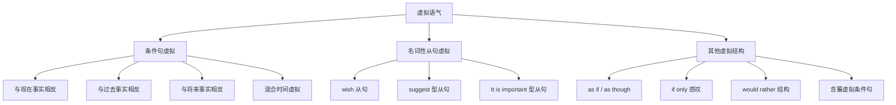
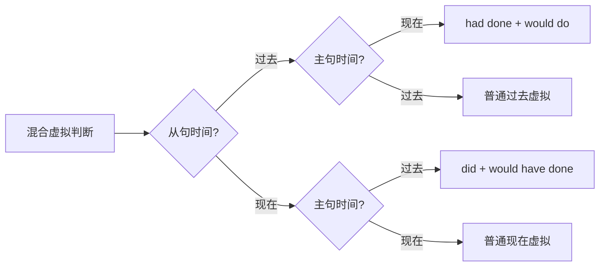
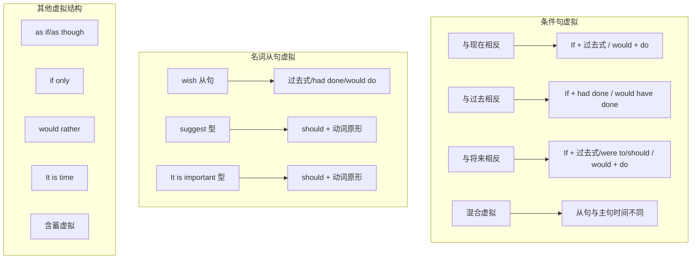

# 虚拟语气详解

## 1. 虚拟语气概述

### 1.1 什么是虚拟语气

虚拟语气（Subjunctive Mood）是英语中表达**非真实情况**的一种语法形式。与陈述语气（表达客观事实）和祈使语气（表达命令请求）不同，虚拟语气专门用于表达：

- **假设**：与事实相反的情况
- **愿望**：希望发生但未必能实现的事情
- **建议**：对他人行为的主观建议
- **想象**：纯粹的假想情境

> [!info] 语气的本质
>
> 英语的「语气」（Mood）是动词的一种屈折变化形式，用于表达说话者对所述内容的态度。虚拟语气通过特殊的动词形式，向听者传达「这不是真的」或「这只是假设」的信号。

**对比理解**：

| 语气类型 | 功能 | 例句 |
| --- | --- | --- |
| 陈述语气 | 陈述事实 | He **is** a doctor.（他是医生） |
| 祈使语气 | 发出命令 | **Be** quiet!（安静！） |
| 虚拟语气 | 表达假设 | If he **were** a doctor, he could help.（如果他是医生，他就能帮忙） |

注意上表中虚拟语气使用了 **were** 而非 **was**，这种特殊的动词形式正是虚拟语气的标志。

### 1.2 虚拟语气的历史演变

虚拟语气在古英语中有丰富的形态变化，但随着英语的简化，大部分虚拟形式已经消失。现代英语中保留下来的虚拟语气主要体现在：

1. **be 动词的特殊形式**：在所有人称后使用 were（而非 was）
2. **动词原形**：在某些从句中使用动词原形（不加 -s，不变时态）
3. **过去时态表示非真实**：用过去时表示与现在相反的假设

> [!tip] 学习要点
>
> 虚拟语气的核心技巧在于「时态后移」——用过去时表示与现在相反，用过去完成时表示与过去相反。这种「时态错位」是识别和使用虚拟语气的关键。

### 1.3 虚拟语气的分类体系

上图展示了虚拟语气的完整分类体系。条件句虚拟是最基础也是最重要的部分，掌握它之后，其他类型的虚拟语气就容易理解了。

---

## 2. 条件句虚拟语气

条件句虚拟语气用于表达与事实相反或不太可能实现的假设。根据假设与哪个时间的事实相反，分为三种基本类型。

### 2.1 与现在事实相反的虚拟

当我们假设的情况与当前的实际情况相反时，使用这种虚拟语气。

#### 2.1.1 基本结构

| 从句（if 条件句） | 主句（主要结果） |
| --- | --- |
| If + 主语 + **动词过去式**（be 动词用 were） | 主语 + **would/could/might/should** + 动词原形 |

> [!warning] were 的特殊用法
>
> 在正式的虚拟语气中，无论主语是什么人称，be 动词一律使用 **were**，而非 was。虽然口语中有时会用 was，但书面语和正式场合应坚持使用 were。

#### 2.1.2 详细例句分析

**例句 1**：
- **英文**：If I **were** you, I **would accept** the offer.
- **中文**：如果我是你，我会接受这个提议。
- **句法分析**：
  - 条件从句：If I were you（使用 were，表示与现在事实相反——我不是你）
  - 主句：I would accept the offer（would + 动词原形，表示假设的结果）
- **事实**：我不是你（I am not you），所以这是一个与现在事实相反的假设。

**例句 2**：
- **英文**：If she **had** more time, she **could finish** the project.
- **中文**：如果她有更多时间，她就能完成这个项目。
- **句法分析**：
  - 条件从句：If she had more time（had 是 have 的过去式，表示假设）
  - 主句：she could finish the project（could + 动词原形）
- **事实**：她没有足够的时间（She doesn't have enough time）。

**例句 3**：
- **英文**：If I **knew** the answer, I **would tell** you.
- **中文**：如果我知道答案，我会告诉你。
- **句法分析**：
  - 条件从句：If I knew the answer（knew 是 know 的过去式）
  - 主句：I would tell you
- **事实**：我不知道答案（I don't know the answer）。

**例句 4**：
- **英文**：If he **weren't** so busy, he **might join** us for dinner.
- **中文**：如果他不是那么忙，他可能会和我们一起吃晚饭。
- **句法分析**：
  - 条件从句：If he weren't so busy（weren't = were not，否定形式）
  - 主句：he might join us（might 表示可能性较小的假设结果）
- **事实**：他很忙（He is very busy）。

#### 2.1.3 主句情态动词的选择

主句中可以使用不同的情态动词，表达不同的语气：

| 情态动词 | 语气强度 | 例句 |
| --- | --- | --- |
| **would** | 最常用，表示「会」 | If I had money, I **would** buy a car. |
| **could** | 表示「能够」的假设能力 | If I were taller, I **could** reach the shelf. |
| **might** | 表示「可能」，不确定性更强 | If it were sunny, we **might** go hiking. |
| **should** | 较少用，表示「应该会」 | If I were in your position, I **should** do the same. |

### 2.2 与过去事实相反的虚拟

当我们假设的情况与已经发生的过去事实相反时，使用这种虚拟语气。这种虚拟常带有遗憾、后悔的情感色彩。

#### 2.2.1 基本结构

| 从句（if 条件句） | 主句（主要结果） |
| --- | --- |
| If + 主语 + **had + 过去分词** | 主语 + **would/could/might/should + have + 过去分词** |

> [!info] 时态后移原理
>
> 与现在相反用过去时，与过去相反则需要「再往后推一步」，使用过去完成时（had + 过去分词）。主句同样后移，使用「would have + 过去分词」。

#### 2.2.2 详细例句分析

**例句 1**：
- **英文**：If I **had studied** harder, I **would have passed** the exam.
- **中文**：如果我当时学习更努力，我就能通过考试了。
- **句法分析**：
  - 条件从句：If I had studied harder（过去完成时，表示与过去事实相反）
  - 主句：I would have passed the exam（would have + 过去分词）
- **事实**：我当时没有努力学习，所以没有通过考试。
- **情感**：表达对过去的遗憾。

**例句 2**：
- **英文**：If she **had taken** the earlier train, she **wouldn't have missed** the meeting.
- **中文**：如果她坐了早一点的火车，她就不会错过会议了。
- **句法分析**：
  - 条件从句：If she had taken the earlier train
  - 主句：she wouldn't have missed the meeting（否定形式）
- **事实**：她没有坐早班火车，结果错过了会议。

**例句 3**：
- **英文**：If they **had listened** to my advice, they **could have avoided** the problem.
- **中文**：如果他们当时听了我的建议，他们本可以避免这个问题。
- **句法分析**：
  - 条件从句：If they had listened to my advice
  - 主句：they could have avoided the problem（could have 表示本来有能力做到）
- **事实**：他们没有听我的建议，结果遇到了问题。

**例句 4**：
- **英文**：If Columbus **hadn't discovered** America, world history **might have been** different.
- **中文**：如果哥伦布没有发现美洲，世界历史可能会不同。
- **句法分析**：
  - 条件从句：If Columbus hadn't discovered America（否定形式）
  - 主句：world history might have been different
- **事实**：哥伦布确实发现了美洲。

#### 2.2.3 would have vs could have vs might have

| 结构 | 含义 | 例句 |
| --- | --- | --- |
| **would have + pp** | 「本来会」，最常用 | I would have helped you.（我本来会帮你的） |
| **could have + pp** | 「本来能够」，强调能力 | I could have finished it.（我本来能完成的） |
| **might have + pp** | 「本来可能」，不确定性 | It might have worked.（那本来可能有效的） |
| **should have + pp** | 「本来应该」，含责备语气 | You should have told me.（你本来应该告诉我的） |

### 2.3 与将来事实相反的虚拟

当我们假设的情况是将来不太可能发生或几乎不可能发生的事情时，使用这种虚拟语气。

#### 2.3.1 基本结构

与将来相反的虚拟有三种表达方式：

| 从句形式 | 主句形式 | 可能性程度 |
| --- | --- | --- |
| If + 主语 + **动词过去式** | would/could/might + 动词原形 | 可能性较小 |
| If + 主语 + **were to + 动词原形** | would/could/might + 动词原形 | 可能性很小 |
| If + 主语 + **should + 动词原形** | would/could/might + 动词原形 | 可能性极小（万一） |

> [!tip] 三种形式的区别
>
> - **过去式形式**：最常用，表示不太可能但并非绝对不可能
> - **were to 形式**：正式，表示纯粹假设，可能性很小
> - **should 形式**：表示「万一」，暗示说话者认为不太可能发生

#### 2.3.2 详细例句分析

**使用过去式形式**：

**例句 1**：
- **英文**：If it **rained** tomorrow, we **would cancel** the picnic.
- **中文**：如果明天下雨，我们就取消野餐。
- **句法分析**：
  - 条件从句：If it rained tomorrow（用过去式 rained，但指将来的时间 tomorrow）
  - 主句：we would cancel the picnic
- **语气**：说话者认为明天下雨的可能性不大。

**使用 were to 形式**：

**例句 2**：
- **英文**：If the sun **were to rise** in the west, I **would** still love you.
- **中文**：即使太阳从西边升起，我也依然爱你。
- **句法分析**：
  - 条件从句：If the sun were to rise in the west（were to + 动词原形）
  - 主句：I would still love you
- **语气**：太阳从西边升起是不可能的，这是一种极端的假设，用来强调爱的坚定。

**例句 3**：
- **英文**：If I **were to win** the lottery, I **would travel** around the world.
- **中文**：如果我中了彩票，我会环游世界。
- **句法分析**：
  - 条件从句：If I were to win the lottery
  - 主句：I would travel around the world
- **语气**：中彩票的概率很低，这是一个美好但不太现实的愿望。

**使用 should 形式**：

**例句 4**：
- **英文**：If you **should see** him, please give him my regards.
- **中文**：万一你见到他，请代我问候他。
- **句法分析**：
  - 条件从句：If you should see him（should + 动词原形）
  - 主句：please give him my regards（祈使句形式的主句也是允许的）
- **语气**：说话者认为对方见到那个人的可能性不大，但以防万一还是交代一下。

**例句 5**：
- **英文**：If anything **should happen** to me, please take care of my family.
- **中文**：万一我出了什么事，请照顾我的家人。
- **句法分析**：
  - 条件从句：If anything should happen to me
  - 主句：please take care of my family
- **语气**：说话者不希望也不认为会出事，但为了以防万一而做的嘱托。

### 2.4 三种基本虚拟条件句对比

| 类型 | 条件从句 | 主句 | 例句 |
| --- | --- | --- | --- |
| 与现在相反 | If + 过去式（be 用 were） | would/could/might + 动词原形 | If I **were** rich, I **would** help the poor. |
| 与过去相反 | If + had + 过去分词 | would/could/might + have + 过去分词 | If I **had been** rich, I **would have helped** the poor. |
| 与将来相反 | If + 过去式 / were to / should | would/could/might + 动词原形 | If I **were to become** rich, I **would** help the poor. |

> [!example] 同一情境的三种虚拟
>
> **情境**：关于「会说法语」的假设
>
> - **与现在相反**：If I **spoke** French, I **could** communicate with them.
>   （如果我会说法语，我就能和他们交流了。）——事实：我现在不会说法语。
>
> - **与过去相反**：If I **had spoken** French, I **could have communicated** with them.
>   （如果我当时会说法语，我就能和他们交流了。）——事实：我当时不会说法语，错过了交流机会。
>
> - **与将来相反**：If I **were to learn** French, I **could** communicate with them.
>   （如果我去学法语，我就能和他们交流了。）——说话者认为自己不太可能去学法语。

---

## 3. 混合虚拟条件句

在实际使用中，条件从句和主句所假设的时间可能不同，这就形成了混合虚拟条件句。

### 3.1 从句与过去相反，主句与现在相反

这是最常见的混合虚拟类型：过去的某个行为或事件影响了现在的状态。

#### 3.1.1 结构

| 从句 | 主句 |
| --- | --- |
| If + had + 过去分词（与过去相反） | would/could/might + 动词原形（与现在相反） |

#### 3.1.2 例句分析

**例句 1**：
- **英文**：If I **had taken** your advice, I **would be** successful now.
- **中文**：如果我当时听了你的建议，我现在就成功了。
- **句法分析**：
  - 条件从句：If I had taken your advice（过去完成时，与过去事实相反）
  - 主句：I would be successful now（would + 动词原形，描述现在的假设状态）
  - 时间标志词：now 明确指出主句说的是现在的情况
- **逻辑**：过去没有听建议（过去的事实），导致现在不成功（现在的结果）。

**例句 2**：
- **英文**：If she **hadn't missed** the flight, she **would be** in Paris now.
- **中文**：如果她没有错过航班，她现在就在巴黎了。
- **句法分析**：
  - 条件从句：If she hadn't missed the flight（与过去相反——她确实错过了航班）
  - 主句：she would be in Paris now（与现在相反——她现在不在巴黎）
- **逻辑**：过去错过航班导致现在不在巴黎。

**例句 3**：
- **英文**：If he **had studied** medicine, he **would be** a doctor today.
- **中文**：如果他当年学了医，他今天就是医生了。
- **句法分析**：
  - 条件从句：If he had studied medicine（与过去相反）
  - 主句：he would be a doctor today（与现在相反）
  - 时间标志词：today
- **逻辑**：过去没有学医导致现在不是医生。

### 3.2 从句与现在相反，主句与过去相反

这种类型相对少见：现在的某种状态或特质，如果不同的话，过去就会有不同的结果。

#### 3.2.1 结构

| 从句 | 主句 |
| --- | --- |
| If + 过去式（与现在相反） | would/could/might + have + 过去分词（与过去相反） |

#### 3.2.2 例句分析

**例句 1**：
- **英文**：If I **were** more careful, I **wouldn't have made** that mistake.
- **中文**：如果我（性格上）更细心一些，我就不会犯那个错误了。
- **句法分析**：
  - 条件从句：If I were more careful（与现在相反——我现在/一直不够细心）
  - 主句：I wouldn't have made that mistake（与过去相反——我确实犯了那个错误）
- **逻辑**：因为我性格上（现在依然如此）不够细心，所以过去犯了错误。

**例句 2**：
- **英文**：If he **weren't** so stubborn, he **would have listened** to us.
- **中文**：如果他不是那么固执，他当时就会听我们的了。
- **句法分析**：
  - 条件从句：If he weren't so stubborn（与现在相反——他现在/一直很固执）
  - 主句：he would have listened to us（与过去相反——他当时没有听）
- **逻辑**：他的固执是一种持续的性格特点，导致了过去不听劝告。

### 3.3 混合虚拟的识别技巧

> [!tip] 识别关键
>
> 1. 注意时间状语词：now, today, at that time, yesterday, last year 等
> 2. 分析因果逻辑：原因发生在什么时间？结果体现在什么时间？
> 3. 从句和主句的时态不一致时，很可能是混合虚拟

---

## 4. 含蓄虚拟条件句

有时候，虚拟条件不是通过 if 从句明确表达出来的，而是通过其他方式暗含在句子中。这种情况称为含蓄虚拟条件句。

### 4.1 通过介词短语表达条件

常见的引导含蓄条件的介词短语：

| 介词短语 | 含义 | 例句 |
| --- | --- | --- |
| **without** | 如果没有 | Without water, there would be no life. |
| **but for** | 要不是 | But for your help, I would have failed. |
| **with** | 如果有 | With more time, I could finish it. |
| **in one's position/place** | 处于某人的位置 | In your position, I would resign. |
| **under different circumstances** | 在不同情况下 | Under different circumstances, I might agree. |

#### 4.1.1 详细例句分析

**例句 1**（without）：
- **英文**：**Without** your support, I **wouldn't have succeeded**.
- **中文**：如果没有你的支持，我不会成功的。
- **还原为 if 句**：If it had not been for your support, I wouldn't have succeeded.
- **分析**：without 引导的短语相当于一个与过去事实相反的条件从句。

**例句 2**（but for）：
- **英文**：**But for** the rain, we **would have** gone hiking.
- **中文**：要不是下雨，我们就去远足了。
- **还原为 if 句**：If it had not been for the rain, we would have gone hiking.
- **分析**：but for 表示「要不是」，后接名词，暗含否定的假设条件。

**例句 3**（with）：
- **英文**：**With** a little more effort, you **could pass** the exam.
- **中文**：再努力一点，你就能通过考试了。
- **还原为 if 句**：If you made a little more effort, you could pass the exam.
- **分析**：with 表示「如果有」的假设条件。

**例句 4**（in one's position）：
- **英文**：**In your position**, I **would do** the same thing.
- **中文**：如果我处于你的位置，我也会做同样的事。
- **还原为 if 句**：If I were in your position, I would do the same thing.

### 4.2 通过副词或连词表达条件

| 词语 | 含义 | 例句 |
| --- | --- | --- |
| **otherwise** | 否则 | I was busy; otherwise, I would have come. |
| **or** | 否则 | Hurry up, or you would miss the bus. |
| **supposing (that)** | 假设 | Supposing you won the lottery, what would you do? |

**例句分析**：

**例句 1**（otherwise）：
- **英文**：I was ill yesterday; **otherwise**, I **would have attended** the meeting.
- **中文**：我昨天病了；否则，我会参加会议的。
- **分析**：otherwise = if I had not been ill，暗含与过去相反的假设条件。

**例句 2**（or）：
- **英文**：He reminded me of the deadline, **or** I **would have forgotten** it.
- **中文**：他提醒了我截止日期，否则我会忘记的。
- **分析**：or 在这里等同于 otherwise，表示「如果不是这样的话」。

### 4.3 通过主语或上下文暗示条件

有时虚拟条件完全隐藏在上下文中，需要读者自己理解。

**例句 1**：
- **英文**：**A true friend** **would not have** betrayed you.
- **中文**：真正的朋友不会背叛你的。
- **暗含条件**：If he/she were a true friend...（如果他/她是真正的朋友的话……）
- **分析**：主语「a true friend」本身就暗含了假设条件。

**例句 2**：
- **英文**：**Anyone with common sense** **would have** refused the offer.
- **中文**：任何有常识的人都会拒绝那个提议。
- **暗含条件**：If one had common sense...（如果一个人有常识的话……）

**例句 3**：
- **英文**：I **would have** called you, but I lost your number.
- **中文**：我本来会给你打电话的，但是我把你的号码弄丢了。
- **暗含条件**：If I had not lost your number...（如果我没有弄丢你的号码……）
- **分析**：but 后面的内容解释了为什么假设没有实现。

### 4.4 含蓄虚拟条件句汇总表

| 表达方式 | 对应的 if 条件 | 时间指向 |
| --- | --- | --- |
| without / but for + 名词 | if it were not for / if it had not been for | 根据主句判断 |
| otherwise / or | if + 相反情况 | 根据主句判断 |
| in one's position | if I were in one's position | 与现在相反 |
| with + 名词 | if there were / if one had | 根据主句判断 |

---

## 5. wish 引导的虚拟语气

wish 后面的宾语从句使用虚拟语气，表达与事实相反的愿望或遗憾。

### 5.1 wish 虚拟的三种时态

| 愿望类型 | 从句结构 | 例句 |
| --- | --- | --- |
| 对现在的愿望（与现在相反） | wish + 过去式（be 用 were） | I wish I **were** taller. |
| 对过去的愿望（与过去相反） | wish + had + 过去分词 | I wish I **had studied** harder. |
| 对将来的愿望（希望改变） | wish + would/could + 动词原形 | I wish it **would stop** raining. |

> [!info] wish vs hope
>
> - **wish** 表示与事实相反或不太可能实现的愿望，后接虚拟语气
> - **hope** 表示有可能实现的希望，后接陈述语气
>
> 对比：
> - I **wish** I **were** rich.（但事实上我不富有）
> - I **hope** I **will be** rich.（我希望将来能富有——有可能）

### 5.2 对现在的愿望

表达对当前状态不满意，希望情况不同。

**例句 1**：
- **英文**：I wish I **knew** the answer.
- **中文**：我希望我知道答案。（但事实上我不知道）
- **分析**：用过去式 knew 表示与现在事实相反。

**例句 2**：
- **英文**：She wishes she **weren't** so shy.
- **中文**：她希望自己不那么害羞。（但事实上她很害羞）
- **分析**：用 weren't（were not）表示与现在相反。

**例句 3**：
- **英文**：I wish I **had** more free time.
- **中文**：我希望我有更多空闲时间。（但实际上没有）
- **分析**：had 是 have 的过去式，表示现在没有足够的时间。

**例句 4**：
- **英文**：They wish they **lived** closer to their parents.
- **中文**：他们希望住得离父母近一些。（但实际上住得远）

### 5.3 对过去的愿望

表达对已经发生的事情的遗憾，希望当时情况不同。

**例句 1**：
- **英文**：I wish I **had listened** to my parents' advice.
- **中文**：我希望当时听了父母的建议。（但实际上没听）
- **分析**：had listened（过去完成时）表示与过去事实相反。

**例句 2**：
- **英文**：She wishes she **hadn't said** those words.
- **中文**：她希望自己当时没有说那些话。（但实际上说了）
- **分析**：表达对过去言行的后悔。

**例句 3**：
- **英文**：I wish I **had met** you earlier.
- **中文**：我希望能更早遇见你。（但实际上遇见得晚了）

**例句 4**：
- **英文**：He wishes he **had been** more careful.
- **中文**：他希望自己当时更小心一些。（但实际上不够小心）

### 5.4 对将来的愿望

表达希望将来某种情况发生改变，通常带有不耐烦或强烈期盼的语气。

> [!warning] would 的特殊用法
>
> 在 wish + would 结构中，通常主句主语和从句主语不同，表示希望别人或某事发生改变。若主语相同，一般用 could 而非 would。

**例句 1**：
- **英文**：I wish it **would stop** raining.
- **中文**：我希望雨能停。（表达对持续下雨的不耐烦）
- **分析**：主句主语 I，从句主语 it（雨），使用 would。

**例句 2**：
- **英文**：I wish you **would be** more careful.
- **中文**：我希望你能更小心一些。（对对方不小心的不满）
- **分析**：希望对方改变行为。

**例句 3**：
- **英文**：She wishes her boss **would give** her a raise.
- **中文**：她希望老板能给她加薪。

**例句 4**（使用 could）：
- **英文**：I wish I **could go** with you tomorrow.
- **中文**：我希望明天能和你一起去。（但可能去不了）
- **分析**：主句和从句主语相同（都是 I），用 could 而非 would。

### 5.5 wish 虚拟语气总结表

| 时间 | 从句动词形式 | 例句 |
| --- | --- | --- |
| 现在 | 过去式（be 用 were） | I wish I **were** a bird. |
| 过去 | had + 过去分词 | I wish I **had known** earlier. |
| 将来 | would/could + 动词原形 | I wish you **would** come. |

---

## 6. as if / as though 引导的虚拟语气

as if 和 as though 意思相同，都表示「好像，仿佛」，用于描述与实际情况不符的表象或感觉。

### 6.1 基本结构

| 情况 | 从句结构 | 说明 |
| --- | --- | --- |
| 与现在事实相反 | as if + 过去式（be 用 were） | 现在看起来像……但实际不是 |
| 与过去事实相反 | as if + had + 过去分词 | 过去看起来像……但实际不是 |

> [!tip] 真实 vs 虚拟
>
> as if/as though 后面不一定都用虚拟语气。如果从句内容可能是真的或说话者认为是真的，可以用陈述语气：
> - He looks **as if** he **is** tired.（他看起来很累——可能确实累了）
> - He acts **as if** he **were** the boss.（他表现得好像他是老板似的——但他不是老板）

### 6.2 与现在事实相反

**例句 1**：
- **英文**：He talks **as if** he **knew** everything.
- **中文**：他说话的样子好像什么都知道似的。（但实际上他并不知道一切）
- **分析**：用过去式 knew 表示与现在事实相反。

**例句 2**：
- **英文**：She treats me **as though** I **were** a stranger.
- **中文**：她对待我就好像我是个陌生人。（但我不是陌生人）
- **分析**：用 were 表示虚拟。

**例句 3**：
- **英文**：He spends money **as if** he **were** a millionaire.
- **中文**：他花钱的样子好像他是个百万富翁。（但他不是）

**例句 4**：
- **英文**：The child looked at me **as if** I **had** two heads.
- **中文**：那个孩子看着我，好像我长了两个脑袋似的。

### 6.3 与过去事实相反

**例句 1**：
- **英文**：He looked **as if** he **had seen** a ghost.
- **中文**：他看起来好像见了鬼一样。（但实际上没有见鬼）
- **分析**：had seen（过去完成时）表示与过去事实相反。

**例句 2**：
- **英文**：She felt **as though** she **had been** there before.
- **中文**：她感觉好像以前去过那里。（但实际上没去过）

**例句 3**：
- **英文**：They talked about the project **as if** they **had finished** it.
- **中文**：他们谈论那个项目的样子好像已经完成了似的。（但实际上还没完成）

### 6.4 It is (high/about) time 结构

「It is time...」结构表示「该是……的时候了」，暗示现在应该做某事但还没做，从句用虚拟语气。

**基本结构**：
- It is time + (that) + 主语 + **动词过去式**
- It is high time + (that) + 主语 + **动词过去式**（更强调紧迫性）
- It is about time + (that) + 主语 + **动词过去式**（语气稍弱）

**例句 1**：
- **英文**：It's time you **went** to bed.
- **中文**：你该睡觉了。
- **分析**：用过去式 went，虽然指的是现在或将来应该做的事。

**例句 2**：
- **英文**：It's high time we **took** action.
- **中文**：我们早就该采取行动了。
- **分析**：high time 强调拖延太久，现在必须行动。

**例句 3**：
- **英文**：It's about time the government **did** something about pollution.
- **中文**：政府差不多该对污染采取措施了。

---

## 7. if only 引导的虚拟语气

if only 表示「要是……就好了」，比 wish 的语气更强烈，常带有感叹和强烈遗憾的情感。

### 7.1 基本结构

| 时间 | 结构 | 例句 |
| --- | --- | --- |
| 与现在相反 | If only + 过去式 | If only I **were** younger! |
| 与过去相反 | If only + had + 过去分词 | If only I **had known**! |
| 与将来相反 | If only + would/could | If only it **would** rain! |

### 7.2 例句分析

**例句 1**（与现在相反）：
- **英文**：**If only** I **had** enough money to buy that house!
- **中文**：要是我有足够的钱买那栋房子就好了！
- **分析**：表达对现在没有足够钱的遗憾。

**例句 2**（与过去相反）：
- **英文**：**If only** I **had studied** harder when I was young!
- **中文**：要是我年轻时学习更努力就好了！
- **分析**：表达对过去没有努力学习的深深遗憾。

**例句 3**（与过去相反）：
- **英文**：**If only** you **had told** me the truth!
- **中文**：要是你当时告诉我真相就好了！

**例句 4**（与将来相反）：
- **英文**：**If only** the weather **would** improve!
- **中文**：要是天气能好转就好了！
- **分析**：表达对天气的期盼和不耐烦。

> [!info] if only vs I wish
>
> 两者结构相同，但语气不同：
> - **I wish** I knew the answer.（我希望我知道答案——平和的愿望）
> - **If only** I knew the answer!（要是我知道答案就好了！——强烈的感叹）
>
> if only 常用感叹号结尾，表达更强烈的情感。

---

## 8. would rather 引导的虚拟语气

would rather（宁愿）后接从句时，从句使用虚拟语气，表示说话者希望别人做某事（与实际情况不同）。

### 8.1 基本结构

| 时间 | 结构 | 例句 |
| --- | --- | --- |
| 与现在/将来相反 | would rather + (that) + 主语 + **过去式** | I'd rather you **stayed** at home. |
| 与过去相反 | would rather + (that) + 主语 + **had + 过去分词** | I'd rather you **hadn't told** him. |

> [!warning] 注意区分
>
> - would rather + **动词原形**（主语相同）：I would rather **stay** at home.（我宁愿待在家里）——不是虚拟语气
> - would rather + **从句**（主语不同）：I would rather you **stayed** at home.（我宁愿你待在家里）——虚拟语气

### 8.2 例句分析

**例句 1**（与现在/将来相反）：
- **英文**：I **would rather** you **didn't smoke** here.
- **中文**：我宁愿你不要在这里抽烟。
- **分析**：表示对对方正在或将要抽烟的行为的不满，希望情况不同。

**例句 2**（与现在/将来相反）：
- **英文**：She **would rather** he **came** tomorrow instead of today.
- **中文**：她宁愿他明天来而不是今天来。
- **分析**：用过去式 came 表示对将来的假设愿望。

**例句 3**（与过去相反）：
- **英文**：I **would rather** you **had told** me the truth yesterday.
- **中文**：我宁愿你昨天告诉了我真相。
- **分析**：had told 表示与过去事实相反——你昨天没有告诉我真相。

**例句 4**（与过去相反）：
- **英文**：He **would rather** she **hadn't mentioned** the incident.
- **中文**：他宁愿她没有提起那件事。
- **分析**：表达对已经发生的事（她提起了那件事）的遗憾。

---

## 9. suggest 型动词引导的虚拟语气

某些表示建议、要求、命令、坚持等含义的动词，其后的宾语从句使用特殊的虚拟语气形式：**(should) + 动词原形**。

### 9.1 常见的 suggest 型动词

| 类别 | 动词 |
| --- | --- |
| 建议类 | suggest, recommend, propose, advise |
| 要求类 | demand, require, request, ask |
| 命令类 | order, command, direct |
| 坚持类 | insist |
| 敦促类 | urge |
| 其他 | move（提议）, prefer（更希望）|

### 9.2 基本结构

**主语 + suggest 型动词 + (that) + 主语 + (should) + 动词原形**

> [!info] should 的省略
>
> 在美式英语中，should 通常省略，直接用动词原形。英式英语中 should 保留的情况更多。无论是否省略 should，动词都是原形，不随人称或时态变化。

### 9.3 例句分析

**例句 1**（suggest）：
- **英文**：I **suggest** (that) he **(should) see** a doctor.
- **中文**：我建议他去看医生。
- **分析**：无论主语是 he/she/it，动词都用原形 see（而非 sees）。

**例句 2**（recommend）：
- **英文**：The teacher **recommended** that every student **(should) read** this book.
- **中文**：老师建议每个学生都读这本书。
- **分析**：主句是过去时 recommended，但从句依然用动词原形 read。

**例句 3**（demand）：
- **英文**：The workers **demanded** that the company **(should) raise** their wages.
- **中文**：工人们要求公司提高他们的工资。
- **分析**：demand 后接虚拟语气从句。

**例句 4**（insist）：
- **英文**：She **insisted** that he **(should) apologize** to her.
- **中文**：她坚持要求他向她道歉。
- **分析**：insist 表示「坚持要求」时，从句用虚拟语气。

**例句 5**（order）：
- **英文**：The general **ordered** that the troops **(should) advance** immediately.
- **中文**：将军命令部队立即前进。

**例句 6**（urge）：
- **英文**：We **urge** that the government **(should) take** immediate action.
- **中文**：我们敦促政府立即采取行动。

> [!warning] insist 和 suggest 的双重含义
>
> **insist** 和 **suggest** 有两种含义，只有表示「建议/坚持要求」时才用虚拟语气：
>
> - **insist**（坚持要求）+ 虚拟语气：He insisted that I **(should) go**.（他坚持要我去）
> - **insist**（坚持认为）+ 陈述语气：He insisted that he **was** innocent.（他坚持说他是无辜的）
>
> - **suggest**（建议）+ 虚拟语气：I suggest that he **leave** now.（我建议他现在离开）
> - **suggest**（暗示、表明）+ 陈述语气：Her expression suggested that she **was** angry.（她的表情表明她生气了）

### 9.4 否定形式

在虚拟从句中，否定用 not + 动词原形：

- **英文**：The doctor suggested that she **(should) not smoke**.
- **中文**：医生建议她不要抽烟。

- **英文**：I recommend that he **not be** late again.
- **中文**：我建议他不要再迟到了。

---

## 10. It is + 形容词/名词 + that 从句的虚拟语气

在某些表示必要性、重要性等含义的形容词或名词后，that 从句使用 **(should) + 动词原形** 的虚拟语气。

### 10.1 常见形容词

| 形容词 | 含义 |
| --- | --- |
| important | 重要的 |
| necessary | 必要的 |
| essential | 必不可少的 |
| vital | 至关重要的 |
| crucial | 关键的 |
| urgent | 紧急的 |
| imperative | 迫切的 |
| desirable | 可取的 |
| advisable | 明智的 |
| appropriate | 适当的 |
| natural | 自然的 |
| strange | 奇怪的 |

### 10.2 常见名词

| 名词 | 含义 |
| --- | --- |
| suggestion | 建议 |
| recommendation | 推荐 |
| demand | 要求 |
| proposal | 提议 |
| requirement | 要求 |
| order | 命令 |
| wish | 愿望 |

### 10.3 例句分析

**形容词结构**：

**例句 1**：
- **英文**：It is **important** that everyone **(should) be** on time.
- **中文**：每个人都准时是很重要的。
- **分析**：important 表示重要性，从句用虚拟语气。

**例句 2**：
- **英文**：It is **necessary** that he **(should) attend** the meeting.
- **中文**：他有必要参加这个会议。

**例句 3**：
- **英文**：It is **essential** that the work **(should) be finished** by Friday.
- **中文**：工作必须在周五之前完成。
- **分析**：被动语态的虚拟形式：be finished。

**例句 4**：
- **英文**：It is **strange** that he **(should) say** such a thing.
- **中文**：他会说出这样的话真是奇怪。
- **分析**：strange 后也可用虚拟语气，表示说话者的惊讶。

**名词结构**：

**例句 5**：
- **英文**：My **suggestion** is that we **(should) start** earlier.
- **中文**：我的建议是我们早点开始。

**例句 6**：
- **英文**：The **requirement** is that all students **(should) wear** uniforms.
- **中文**：要求是所有学生都穿校服。

**例句 7**：
- **英文**：His **proposal** that the meeting **(should) be postponed** was accepted.
- **中文**：他关于推迟会议的提议被接受了。
- **分析**：proposal 的同位语从句也用虚拟语气。

---

## 11. 虚拟语气的倒装

在正式的书面语中，虚拟条件句可以省略 if，将助动词（were, had, should）提前，形成倒装结构。

### 11.1 基本倒装形式

| 原结构 | 倒装结构 |
| --- | --- |
| If I **were** ... | **Were** I ... |
| If he **had** done ... | **Had** he done ... |
| If it **should** happen ... | **Should** it happen ... |

### 11.2 例句分析

**Were 倒装**（与现在相反）：

**例句 1**：
- **原句**：If I **were** you, I would accept the job.
- **倒装**：**Were** I you, I would accept the job.
- **中文**：如果我是你，我会接受这份工作。

**例句 2**：
- **原句**：If it **were** not for your help, I couldn't finish it.
- **倒装**：**Were** it not for your help, I couldn't finish it.
- **中文**：如果不是你的帮助，我无法完成它。

**Had 倒装**（与过去相反）：

**例句 3**：
- **原句**：If I **had known** the truth, I wouldn't have believed him.
- **倒装**：**Had** I known the truth, I wouldn't have believed him.
- **中文**：如果我当时知道真相，我就不会相信他了。

**例句 4**：
- **原句**：If he **had been** more careful, the accident wouldn't have happened.
- **倒装**：**Had** he been more careful, the accident wouldn't have happened.
- **中文**：如果他当时更小心，事故就不会发生了。

**Should 倒装**（与将来相反）：

**例句 5**：
- **原句**：If you **should** have any questions, please contact me.
- **倒装**：**Should** you have any questions, please contact me.
- **中文**：如果您有任何问题，请联系我。

**例句 6**：
- **原句**：If anything **should** go wrong, let me know immediately.
- **倒装**：**Should** anything go wrong, let me know immediately.
- **中文**：万一有什么问题，立刻告诉我。

> [!tip] 倒装的使用场景
>
> 虚拟语气的倒装主要用于：
> 1. 正式书面语（学术论文、法律文件、正式信函）
> 2. 文学作品（增加语言的正式感和优雅度）
> 3. 固定表达（如 Were it not for...）
>
> 日常口语中较少使用倒装形式。

### 11.3 倒装结构汇总表

| 条件类型 | if 结构 | 倒装结构 |
| --- | --- | --- |
| 与现在相反 | If + 主语 + were | Were + 主语 |
| 与过去相反 | If + 主语 + had done | Had + 主语 + done |
| 与将来相反 | If + 主语 + should do | Should + 主语 + do |

---

## 12. 虚拟语气综合辨析

### 12.1 易混淆结构对比

#### 12.1.1 真实条件句 vs 虚拟条件句

| 类型 | 特点 | 例句 |
| --- | --- | --- |
| 真实条件句 | 条件可能成立，用正常时态 | If it **rains** tomorrow, we **will** stay home. |
| 虚拟条件句 | 条件不可能或不太可能，时态后移 | If it **rained** tomorrow, we **would** stay home. |

**对比分析**：
- **真实条件句**：If it rains tomorrow, we will stay home.
  - 说话者认为明天下雨是有可能的，所以用一般现在时 rains + will。
- **虚拟条件句**：If it rained tomorrow, we would stay home.
  - 说话者认为明天下雨可能性不大，或者这只是一个假设讨论。

#### 12.1.2 wish vs hope

| 词语 | 语气 | 可能性 | 例句 |
| --- | --- | --- | --- |
| wish | 虚拟语气 | 与事实相反或不太可能 | I **wish** I **were** taller. |
| hope | 陈述语气 | 有可能实现 | I **hope** I **will** succeed. |

#### 12.1.3 suggest 的两种用法

| 含义 | 语气 | 例句 |
| --- | --- | --- |
| 建议 | 虚拟语气 | I suggest that he **go** at once.（我建议他立刻去） |
| 暗示、表明 | 陈述语气 | His silence suggested that he **agreed**.（他的沉默表明他同意了） |

### 12.2 虚拟语气综合练习

> [!example] 辨析练习
>
> 判断以下句子使用的是哪种虚拟语气，并分析原因：
>
> 1. If I had wings, I would fly to you.
>    - **答案**：与现在事实相反（我没有翅膀）
>    - **结构**：过去式 had + would + 动词原形
>
> 2. Had I known earlier, I could have helped you.
>    - **答案**：与过去事实相反（我当时不知道）
>    - **结构**：Had 倒装 + could have + 过去分词
>
> 3. I wish you hadn't told her the secret.
>    - **答案**：对过去的遗憾（你当时告诉了她）
>    - **结构**：wish + had + 过去分词
>
> 4. It is essential that every student be present.
>    - **答案**：should 型虚拟
>    - **结构**：It is essential + that + (should) + 动词原形
>
> 5. But for your timely warning, I would have been cheated.
>    - **答案**：含蓄虚拟，与过去相反
>    - **结构**：But for + 名词 = If it had not been for

### 12.3 虚拟语气完整体系图

---

## 13. 虚拟语气高频考点

### 13.1 考试常见陷阱

#### 陷阱 1：时态选择错误

- **错误**：If I was you, I would go.
- **正确**：If I **were** you, I would go.
- **原因**：虚拟语气中 be 动词用 were，不用 was。

#### 陷阱 2：主句情态动词误用

- **错误**：If he had come earlier, he will catch the bus.
- **正确**：If he had come earlier, he **would have caught** the bus.
- **原因**：与过去相反的虚拟，主句用 would have + 过去分词。

#### 陷阱 3：suggest 型动词后误加 -s

- **错误**：I suggest that he **goes** at once.
- **正确**：I suggest that he **(should) go** at once.
- **原因**：suggest 后从句用动词原形，不随人称变化。

#### 陷阱 4：混淆 wish 和 hope

- **错误**：I wish I will succeed.
- **正确**：I wish I **would/could** succeed. 或 I **hope** I will succeed.
- **原因**：wish 后用虚拟语气，hope 后用陈述语气。

#### 陷阱 5：倒装结构还原错误

- **倒装句**：Had I known, I would have told you.
- **错误还原**：If I would have known...
- **正确还原**：If I **had** known, I would have told you.
- **原因**：条件从句用 had + 过去分词，主句才用 would have。

### 13.2 高频句型汇总

| 句型 | 结构 | 例句 |
| --- | --- | --- |
| If I were you | If I were you, I would... | If I were you, I would apologize. |
| I wish | I wish + 虚拟从句 | I wish I could fly. |
| If only | If only + 虚拟从句 | If only I had more time! |
| It is time | It is time + 过去式 | It is time we left. |
| would rather | would rather + 过去式从句 | I would rather you stayed. |
| as if | as if + 虚拟从句 | He talks as if he knew everything. |
| but for | but for + 名词, would... | But for you, I would fail. |
| otherwise | ...; otherwise, would... | I was busy; otherwise, I would come. |

---

## 14. 虚拟语气小结

### 14.1 核心要点回顾

1. **时态后移原则**：虚拟语气通过将时态「后移」来表示非真实情况
   - 与现在相反 → 用过去时
   - 与过去相反 → 用过去完成时

2. **三大基本结构**：
   - 条件句虚拟（if 从句）
   - 名词从句虚拟（wish, suggest 型）
   - 其他虚拟结构（as if, if only, would rather 等）

3. **特殊形式**：
   - be 动词在虚拟语气中统一用 were
   - suggest 型动词后用 (should) + 动词原形
   - 倒装形式省略 if，助动词提前

### 14.2 学习建议

> [!tip] 掌握虚拟语气的学习路径
>
> 1. **先掌握基础**：熟练三种基本条件句虚拟（与现在、过去、将来相反）
> 2. **理解时态后移**：牢记「与什么时间相反，就比那个时间的时态再往后推一步」
> 3. **记忆特殊结构**：wish、suggest 型、as if 等结构需要单独记忆
> 4. **多做对比练习**：区分真实条件句和虚拟条件句
> 5. **注意语境理解**：虚拟语气往往带有遗憾、假设、建议等情感色彩

### 14.3 延伸阅读

- [[01.被动语态全解]]：了解另一种重要的特殊句型
- [[03.倒装句结构]]：深入学习虚拟语气倒装的相关知识
- [[../07.助动词与情态动词/01.情态动词概述与分类]]：复习情态动词的基本用法
