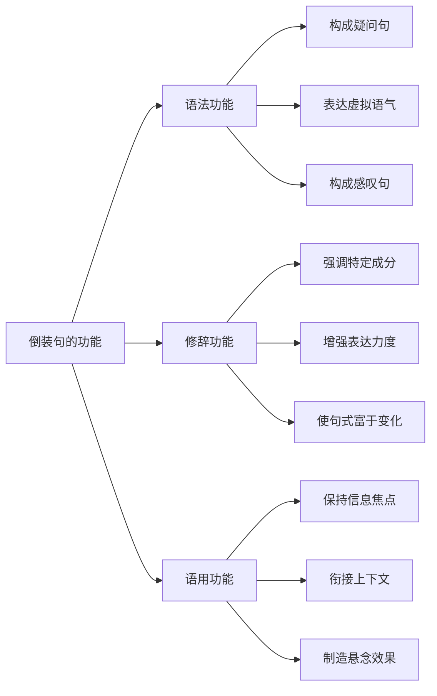
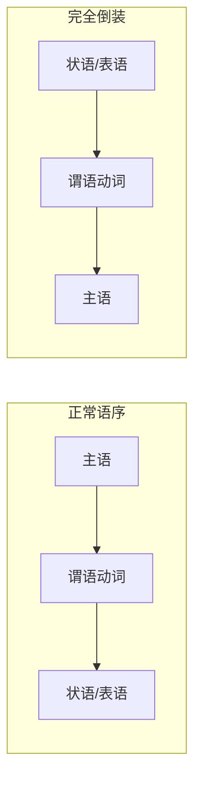
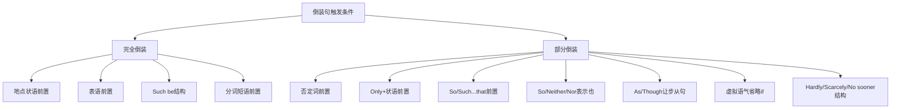
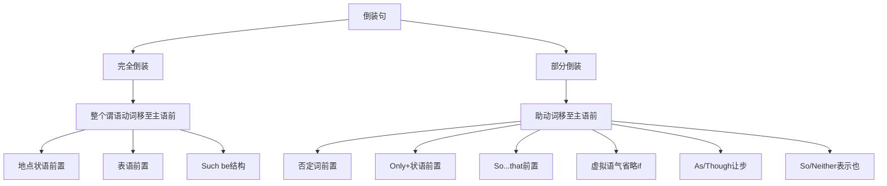

# 倒装句结构

> [!info] 学习目标
>
> 通过本章学习，你将掌握：
> - 理解倒装句的本质与语法功能
> - 区分完全倒装与部分倒装的结构差异
> - 掌握各类触发倒装的语法条件
> - 熟练运用倒装句增强表达效果
> - 理解倒装与虚拟语气的结合规则

---

## 1. 倒装句概述

### 1.1 什么是倒装句

英语的基本语序是「主语 + 谓语」（Subject + Verb），这是陈述句的标准结构。**倒装句**（Inversion）是指将这种正常语序进行调整，把谓语动词或谓语的一部分放到主语之前的特殊句式。

> [!note] 核心概念
>
> 倒装的本质是语序的改变：将谓语（或谓语的一部分）移至主语之前。
>
> - **正常语序**：主语 + 谓语
> - **倒装语序**：谓语（或助动词）+ 主语

**对比示例**：

| 正常语序 | 倒装语序 |
| --- | --- |
| The sun **rises** in the east. | In the east **rises** the sun. |
| I **have** never seen such a view. | Never **have** I seen such a view. |
| She **is** beautiful. | Beautiful **is** she! |

### 1.2 倒装句的语法功能

倒装句在英语中承担着多重语法功能，理解这些功能有助于正确使用倒装结构。



**功能详解**：

**1. 语法功能**

倒装句是某些语法结构的必要组成部分：

- **疑问句**：Do you like coffee?（助动词前置）
- **虚拟条件句**：Were I you, I would accept.（省略 if 时必须倒装）
- **感叹句**：How beautiful is this place!

**2. 修辞功能**

倒装句能增强表达的感染力和文学性：

- **强调**：Never have I seen such beauty.（强调"从未"）
- **对比**：Rich is she, but happy she is not.（对比强调）
- **变化**：使句式多样，避免单调

**3. 语用功能**

倒装句有助于信息的合理分布和语篇衔接：

- **焦点后置**：重要信息放在句末
- **主题衔接**：与上文形成自然连接
- **悬念制造**：通过延迟主语出现制造期待

### 1.3 倒装句的两大类型

根据谓语动词的倒装程度，倒装句分为两大类：

> [!tip] 分类要点
>
> - **完全倒装**：整个谓语动词移至主语之前
> - **部分倒装**：只有助动词/情态动词/be动词移至主语之前，主要动词留在主语之后

**结构对比**：

| 类型 | 结构 | 示例 |
| --- | --- | --- |
| 完全倒装 | 谓语动词 + 主语 | Here **comes** the bus. |
| 部分倒装 | 助动词 + 主语 + 动词原形 | Never **have** I **seen** such a thing. |

---

## 2. 完全倒装

### 2.1 完全倒装的定义与结构

**完全倒装**（Full Inversion）是指将整个谓语动词移至主语之前的倒装形式。这种倒装通常出现在不含助动词的简单句中。

> [!note] 结构公式
>
> **完全倒装结构**：状语/表语 + 谓语动词 + 主语
>
> 特点：谓语动词整体前移，主语后置

**基本结构图解**：



### 2.2 地点状语前置引起的完全倒装

当表示地点的状语或介词短语置于句首时，常引起完全倒装。这种倒装使句子的描写更加生动，常用于文学作品和演讲中。

**常见地点状语**：

| 类型 | 例词 |
| --- | --- |
| 副词 | here, there, up, down, in, out, away, off |
| 介词短语 | on the wall, under the tree, in the room |
| 方位表达 | in front of, behind, beside, between |

**例句分析**：

**1. 副词前置**

| 正常语序 | 完全倒装 |
| --- | --- |
| The bus comes here. | **Here comes** the bus. |
| 公交车来了。 | 公交车来了。（更生动） |
| The children ran away. | **Away ran** the children. |
| 孩子们跑开了。 | 孩子们跑开了。（更形象） |
| The ball went up. | **Up went** the ball. |
| 球飞上去了。 | 球飞上去了。（动态感更强） |

**2. 介词短语前置**

| 正常语序 | 完全倒装 |
| --- | --- |
| A picture hangs on the wall. | **On the wall hangs** a picture. |
| 墙上挂着一幅画。 | 墙上挂着一幅画。（描写性更强） |
| A small village lies at the foot of the mountain. | **At the foot of the mountain lies** a small village. |
| 山脚下有一个小村庄。 | 山脚下坐落着一个小村庄。 |
| Many tourists stood in front of the museum. | **In front of the museum stood** many tourists. |
| 博物馆前站着许多游客。 | 博物馆前站着许多游客。 |

> [!warning] 人称代词作主语时不倒装
>
> 当主语是人称代词（I, you, he, she, it, we, they）时，即使状语前置也不倒装。
>
> - ✅ Here **he comes**. （不倒装）
> - ❌ Here **comes he**. （错误）
> - ✅ Away **they went**. （不倒装）
> - ❌ Away **went they**. （错误）

**更多例句**：

```
Down came the rain, and up went the umbrellas.
雨倾盆而下，雨伞纷纷撑起。

Out rushed the children when the bell rang.
铃声一响，孩子们冲了出去。

There goes the last bus. We'll have to walk home.
末班车开走了。我们只能走回家了。

Behind the house flows a clear stream.
房子后面流淌着一条清澈的小溪。

Between the two mountains lies a beautiful valley.
两山之间有一个美丽的山谷。
```

### 2.3 表语前置引起的完全倒装

当表语（形容词、分词、介词短语等）置于句首以示强调时，可引起完全倒装。这种结构常用于文学性较强的表达。

**结构**：表语 + 系动词 + 主语

**例句分析**：

**1. 形容词作表语**

```
Present at the meeting were the headmaster and some teachers.
出席会议的有校长和一些老师。

Seated in the front row were the guests of honor.
坐在前排的是贵宾们。

Gone are the days when we used oil lamps.
我们用油灯的日子一去不复返了。
```

**2. 分词作表语**

```
Lying on the grass was a young man reading a book.
草地上躺着一个正在看书的年轻人。

Standing beside the window was a tall woman in red.
窗边站着一位身穿红衣的高个女子。

Hidden among the trees was an old cottage.
树丛中隐藏着一间老房子。
```

**3. 介词短语作表语**

```
Among the guests was the famous writer.
客人中有那位著名的作家。

On the top of the mountain is an ancient temple.
山顶上有一座古寺。

In the box were some old photographs.
盒子里装着一些老照片。
```

### 2.4 分词/形容词短语前置的完全倒装

这种结构常用于书面语，表达更加正式和文学化。

```
Enclosed is a check for $100.
随信附上100美元支票。

Attached to the letter was a photograph.
信上附有一张照片。

Such was the force of the explosion that all the windows broke.
爆炸的力量如此之大，所有的窗户都碎了。
```

### 2.5 "Such be + 主语"结构

"Such"作表语置于句首时，引起完全倒装，表示"......就是这样"或"这就是......"。

```
Such is life.
生活就是如此。

Such was Albert Einstein, a man of great achievement.
阿尔伯特·爱因斯坦就是这样一个成就卓著的人。

Such are the facts; no one can deny them.
事实就是这样，没有人可以否认。

Such was the situation that we were faced with.
这就是我们所面临的情况。
```

### 2.6 完全倒装的时态与主谓一致

完全倒装句中，谓语动词的时态和数应与后面的主语保持一致。

**时态一致**：

```
Here comes the bus.  （一般现在时，主语 the bus 是单数）
Here came the bus.   （一般过去时）

There go the last guests.  （一般现在时，主语 guests 是复数）
There went the last guests.  （一般过去时）
```

**主谓一致**：

```
On the desk is a book.       （单数主语用 is）
On the desk are some books.  （复数主语用 are）

Here comes Mary.             （单数主语用 comes）
Here come Mary and Tom.      （复数主语用 come）
```

> [!example] 综合练习
>
> 将下列句子改为完全倒装结构：
>
> 1. A tall building stands in the center of the city.
> 2. The days when we were young are gone.
> 3. A small cottage lies at the end of the road.
>
> **参考答案**：
> 1. In the center of the city stands a tall building.
> 2. Gone are the days when we were young.
> 3. At the end of the road lies a small cottage.

---

## 3. 部分倒装

### 3.1 部分倒装的定义与结构

**部分倒装**（Partial Inversion）是指只将助动词、情态动词或 be 动词移至主语之前，而主要动词仍保留在主语之后的倒装形式。

> [!note] 结构公式
>
> **部分倒装结构**：助动词/情态动词/be动词 + 主语 + 动词原形/过去分词/现在分词
>
> 特点：只有辅助性动词前移，实义动词留在原位

**结构对比**：

| 正常语序 | 部分倒装 |
| --- | --- |
| I **have** never **seen** such a thing. | Never **have** I **seen** such a thing. |
| He **can** hardly **speak** English. | Hardly **can** he **speak** English. |
| She **is** seldom **late**. | Seldom **is** she **late**. |

**助动词的添加规则**：

当原句没有助动词时，需要添加 do/does/did 来构成部分倒装：

| 原句 | 部分倒装 |
| --- | --- |
| I **knew** little about it. | Little **did** I **know** about it. |
| She **works** hard. | Hard **does** she **work**. |
| He **left** at once. | At once **did** he **leave**. |

### 3.2 否定词/半否定词前置引起的部分倒装

这是部分倒装最常见的触发条件。当否定词或具有否定意义的词语置于句首时，句子必须采用部分倒装。

**常见否定词/半否定词**：

| 类别 | 词汇 |
| --- | --- |
| 完全否定 | never, nowhere, neither, nor, not, no |
| 半否定 | seldom, rarely, hardly, scarcely, barely, little, few |
| 否定短语 | by no means, in no way, under no circumstances, on no account, in no case, at no time, not until, not only...but also |

**例句分析**：

**1. never（从不）**

```
正常：I have never seen such a beautiful sunset.
倒装：Never have I seen such a beautiful sunset.
译文：我从未见过如此美丽的日落。

正常：We will never forget this moment.
倒装：Never will we forget this moment.
译文：我们永远不会忘记这一刻。
```

**2. seldom/rarely（很少）**

```
正常：She seldom goes out at night.
倒装：Seldom does she go out at night.
译文：她很少晚上出门。

正常：He rarely makes mistakes.
倒装：Rarely does he make mistakes.
译文：他很少犯错误。
```

**3. hardly/scarcely/barely（几乎不）**

```
正常：I can hardly believe my eyes.
倒装：Hardly can I believe my eyes.
译文：我几乎不敢相信自己的眼睛。

正常：He had scarcely finished speaking when the bell rang.
倒装：Scarcely had he finished speaking when the bell rang.
译文：他刚说完，铃声就响了。

正常：They could barely make ends meet.
倒装：Barely could they make ends meet.
译文：他们几乎入不敷出。
```

**4. little（几乎没有）**

```
正常：I little knew what was waiting for me.
倒装：Little did I know what was waiting for me.
译文：我根本不知道等待我的是什么。

正常：They little realized the danger they were in.
倒装：Little did they realize the danger they were in.
译文：他们几乎没有意识到自己所处的危险。
```

**5. nowhere（任何地方都不）**

```
正常：You can find such beauty nowhere else.
倒装：Nowhere else can you find such beauty.
译文：你在其他任何地方都找不到这样的美景。

正常：The key was nowhere to be found.
倒装：Nowhere was the key to be found.
译文：钥匙怎么也找不到。
```

### 3.3 否定短语前置引起的部分倒装

**1. by no means / in no way / under no circumstances（决不，绝不）**

```
By no means should you give up.
你绝对不应该放弃。

In no way can this be justified.
这无论如何都是不合理的。

Under no circumstances should you tell him the truth.
无论如何你都不应该告诉他真相。
```

**2. on no account / in no case / at no time（决不）**

```
On no account must this door be left unlocked.
这扇门绝对不能不锁。

In no case should you cheat in the exam.
你绝对不能在考试中作弊。

At no time did he lose his temper.
他始终没有发脾气。
```

**3. not until（直到......才）**

```
正常：He didn't realize his mistake until he was told.
倒装：Not until he was told did he realize his mistake.
译文：直到有人告诉他，他才意识到自己的错误。

正常：I didn't know the truth until yesterday.
倒装：Not until yesterday did I know the truth.
译文：直到昨天我才知道真相。

正常：She didn't go to bed until her son came back.
倒装：Not until her son came back did she go to bed.
译文：直到儿子回来她才去睡觉。
```

> [!warning] Not until 的倒装要点
>
> - 倒装的是主句，not until 引导的从句不倒装
> - 结构：Not until + 从句/时间状语 + 助动词 + 主语 + 动词

**4. not only...but also（不仅......而且）**

当 not only 位于句首时，not only 后面的分句倒装，but also 后面的分句不倒装：

```
正常：He is not only a teacher but also a writer.
倒装：Not only is he a teacher, but (also) he is a writer.
译文：他不仅是一位老师，而且是一位作家。

正常：She not only sings well but also dances beautifully.
倒装：Not only does she sing well, but (also) she dances beautifully.
译文：她不仅唱得好，而且舞跳得也很优美。

正常：They not only broke the window but also stole the money.
倒装：Not only did they break the window, but (also) they stole the money.
译文：他们不仅打破了窗户，还偷了钱。
```

### 3.4 "only + 状语"前置引起的部分倒装

当 only 修饰状语（副词、介词短语或状语从句）并置于句首时，主句采用部分倒装。

**结构**：Only + 状语 + 助动词 + 主语 + 动词

**1. only + 副词**

```
Only then did I realize my mistake.
只有在那时我才意识到自己的错误。

Only recently have I started to learn French.
我最近才开始学法语。

Only yesterday did I hear the news.
我昨天才听到这个消息。
```

**2. only + 介词短语**

```
Only in this way can we solve the problem.
只有用这种方法我们才能解决问题。

Only by working hard can you succeed.
只有通过努力工作你才能成功。

Only through practice can you improve your skills.
只有通过实践你才能提高技能。

Only after the war did he return home.
战后他才回到家乡。
```

**3. only + 状语从句**

```
Only when the war was over did he return to his hometown.
只有战争结束后他才回到故乡。

Only after she had left did I realize how much I loved her.
只有在她离开之后，我才意识到我有多爱她。

Only if you work hard will you pass the exam.
只有努力学习你才能通过考试。

Only when he apologizes will I forgive him.
只有当他道歉时我才会原谅他。
```

> [!warning] Only 的特殊情况
>
> **only 修饰主语时不倒装**：
> - Only Tom can solve this problem.（only 修饰主语 Tom，不倒装）
> - Only a few students passed the exam.（only 修饰主语，不倒装）
>
> **only 在句中不倒装**：
> - I only realized my mistake then.（only 不在句首，不倒装）

### 3.5 "so/such...that"前置引起的部分倒装

当 so 或 such 放在句首表示强调时，主句采用部分倒装，that 从句不倒装。

**1. so + 形容词/副词 + that**

```
正常：He was so tired that he fell asleep immediately.
倒装：So tired was he that he fell asleep immediately.
译文：他太累了，以至于立刻就睡着了。

正常：She spoke so fast that I couldn't follow her.
倒装：So fast did she speak that I couldn't follow her.
译文：她说得太快了，我跟不上。

正常：The book is so interesting that I can't put it down.
倒装：So interesting is the book that I can't put it down.
译文：这本书太有趣了，我放不下。
```

**2. such + 名词 + that**

```
正常：It was such a heavy box that I couldn't lift it.
倒装：Such a heavy box was it that I couldn't lift it.
译文：箱子太重了，我搬不动。

正常：His speech was such a success that everyone applauded.
倒装：Such a success was his speech that everyone applauded.
译文：他的演讲非常成功，大家都鼓掌了。
```

### 3.6 "so/neither/nor"表示"也"的倒装

当用 so, neither, nor 表示前面所说的情况也适用于另一个人或物时，采用部分倒装。

**结构**：
- 肯定：So + 助动词 + 主语（......也是如此）
- 否定：Neither/Nor + 助动词 + 主语（......也不）

**肯定句的"也"**：

```
A: I am a teacher.
B: So am I. （我也是。）

A: Tom likes music.
B: So does Mary. （Mary 也喜欢。）

A: They have finished their homework.
B: So have we. （我们也完成了。）

A: She can swim.
B: So can her brother. （她弟弟也会。）
```

**否定句的"也不"**：

```
A: I don't like coffee.
B: Neither/Nor do I. （我也不喜欢。）

A: He hasn't been to Paris.
B: Neither/Nor have I. （我也没去过。）

A: She won't come to the party.
B: Neither/Nor will he. （他也不会来。）

A: They can't speak French.
B: Neither/Nor can we. （我们也不会。）
```

> [!tip] So + 主语 + 助动词（的确如此）
>
> 当 so 表示"的确如此"，对前面的话进行肯定时，用正常语序，不倒装：
>
> - A: It is very hot today. （今天很热。）
> - B: So it is. （的确如此。）
>
> - A: You promised to help me. （你答应帮我的。）
> - B: So I did. （我确实答应了。）
>
> **区分要点**：
> - So + 助动词 + 主语 = 另一个主语也是（倒装）
> - So + 主语 + 助动词 = 同一主语的确如此（不倒装）

### 3.7 "as/though"引导的让步状语从句倒装

在 as 或 though 引导的让步状语从句中，常将表语、状语或动词原形提到句首，形成倒装。

**结构**：表语/状语/动词原形 + as/though + 主语 + 谓语

**1. 形容词提前**

```
Young as/though he is, he knows a lot.
虽然他年轻，但他知道很多。

Rich as/though she is, she is not happy.
虽然她很富有，但她并不快乐。

Tired as/though I was, I continued working.
虽然我很累，但我继续工作。

Hard as/though the task is, we must complete it.
虽然任务艰难，我们必须完成它。
```

**2. 名词提前（名词前不加冠词）**

```
Child as/though he is, he can solve complex problems.
虽然他是个孩子，但他能解决复杂问题。
（注意：child 前没有冠词 a）

Teacher as/though he is, he still makes mistakes.
虽然他是老师，但他仍然会犯错。

Hero as/though he was, he felt afraid.
虽然他是英雄，但他也感到害怕。
```

**3. 副词提前**

```
Hard as/though he tried, he failed.
虽然他努力尝试，但还是失败了。

Much as/though I want to help, I can't.
虽然我很想帮忙，但我无能为力。

Fast as/though he ran, he couldn't catch the bus.
虽然他跑得很快，但还是没赶上公交车。
```

**4. 动词原形提前**

```
Try as/though he might, he couldn't open the door.
虽然他尽力尝试，但还是打不开门。

Search as/though they did, they found nothing.
虽然他们搜索了，但什么也没找到。

Fail as/though I may, I will keep trying.
即使我可能失败，我也会继续尝试。
```

> [!note] as 与 though 的区别
>
> - **as** 更正式，更常用于书面语
> - **though** 更口语化
> - 两者在倒装结构中可以互换使用
> - **although** 不能用于这种倒装结构

### 3.8 部分倒装的时态变化

部分倒装需要根据原句的时态选择正确的助动词：

| 时态 | 助动词 | 例句 |
| --- | --- | --- |
| 一般现在时 | do/does | Seldom **does** he come late. |
| 一般过去时 | did | Never **did** I see such a thing. |
| 现在完成时 | have/has | Never **have** I been there. |
| 过去完成时 | had | Hardly **had** he arrived when it rained. |
| 一般将来时 | will/shall | Only then **will** you understand. |
| 现在进行时 | am/is/are | Rarely **is** he working so hard. |
| 过去进行时 | was/were | Never **was** she laughing so happily. |
| 情态动词 | can/could/may/might/must等 | Never **can** you do that. |

---

## 4. 倒装句与虚拟语气

### 4.1 虚拟条件句中的倒装

在虚拟条件句中，当省略连词 if 时，需要将 were, had, should 提到主语之前，形成倒装。

**结构**：Were/Had/Should + 主语 + ... , 主句

**1. 与现在事实相反（省略 if，were 提前）**

```
完整形式：If I were you, I would accept the offer.
倒装形式：Were I you, I would accept the offer.
译文：如果我是你，我会接受这个提议。

完整形式：If it were not for your help, I would fail.
倒装形式：Were it not for your help, I would fail.
译文：要不是你的帮助，我会失败。

完整形式：If he were here, he would know what to do.
倒装形式：Were he here, he would know what to do.
译文：如果他在这里，他会知道该怎么做。
```

**2. 与过去事实相反（省略 if，had 提前）**

```
完整形式：If I had known the truth, I would have told you.
倒装形式：Had I known the truth, I would have told you.
译文：如果我早知道真相，我会告诉你的。

完整形式：If she had worked harder, she would have passed.
倒装形式：Had she worked harder, she would have passed.
译文：如果她当时更努力，她就能通过了。

完整形式：If they had arrived earlier, they would have caught the train.
倒装形式：Had they arrived earlier, they would have caught the train.
译文：如果他们早点到，就能赶上火车了。
```

**3. 与将来事实相反（省略 if，should/were 提前）**

```
完整形式：If it should rain tomorrow, we would cancel the picnic.
倒装形式：Should it rain tomorrow, we would cancel the picnic.
译文：万一明天下雨，我们就取消野餐。

完整形式：If he should call, please let me know.
倒装形式：Should he call, please let me know.
译文：万一他打电话来，请告诉我。

完整形式：If anything were to happen, please contact me.
倒装形式：Were anything to happen, please contact me.
译文：万一发生什么事，请联系我。
```

> [!warning] 注意事项
>
> 1. 只有 were, had, should 可以用于倒装
> 2. 倒装后不能再使用 if
> 3. 这种倒装结构更正式，常用于书面语

### 4.2 虚拟语气中的其他倒装

**1. 表示愿望的虚拟倒装**

在一些固定表达中，可以用倒装结构表示强烈愿望：

```
Long live the Queen!
女王万岁！

May you succeed!
祝你成功！

May all your dreams come true!
愿你所有的梦想成真！
```

**2. "Had it not been for" 结构**

```
Had it not been for your timely help, I would have been in trouble.
要不是你及时帮助，我就麻烦了。

Had it not been for the heavy rain, we would have gone out.
要不是那场大雨，我们就出去了。
```

---

## 5. 其他倒装结构

### 5.1 疑问句中的倒装

疑问句是英语中最基本的倒装形式，通过将助动词提到主语之前来构成：

**一般疑问句**：

```
Are you a student?
Do you like music?
Can she swim?
Have they finished?
```

**特殊疑问句**：

```
What do you want?
Where does he live?
When will they come?
Why did she leave?
How can I help you?
```

> [!note] 特殊情况
>
> 当疑问词作主语时，不倒装：
> - Who broke the window? （Who 作主语）
> - What happened? （What 作主语）
> - Which book is yours? （Which book 作主语）

### 5.2 感叹句中的倒装

某些感叹句可以使用倒装结构来增强感叹效果：

```
How beautiful is this garden!
这个花园多么美丽啊！

What a wonderful day is today!
今天多么美好的一天啊！

How quickly time flies!
时间过得多快啊！

Isn't it a lovely day!
多么可爱的一天啊！
```

### 5.3 直接引语后的倒装

在直接引语后，如果主语是名词，常用倒装结构：

```
"I'm tired," said John.
"我累了，"约翰说。

"Please help me," begged the little boy.
"请帮帮我，"小男孩恳求道。

"Stop!" shouted the policeman.
"停下！"警察喊道。
```

> [!tip] 主语是代词时不倒装
>
> - "I'm tired," **he said**. （代词作主语，不倒装）
> - "Stop!" **she shouted**. （代词作主语，不倒装）

### 5.4 比较结构中的倒装

在比较结构中，有时使用倒装来避免句子头重脚轻：

```
He runs faster than does his brother.
他跑得比他兄弟快。
（正常语序：He runs faster than his brother does.）

She works harder than do her colleagues.
她工作比她的同事努力。

The cities of today are bigger than were those of ancient times.
今天的城市比古代的城市大。
```

### 5.5 "Hardly...when/Scarcely...when/No sooner...than"结构

这三个结构表示"一......就......"，主句用过去完成时并倒装，从句用一般过去时不倒装：

**结构**：Hardly/Scarcely + had + 主语 + done + when/before + 从句（一般过去时）
**结构**：No sooner + had + 主语 + done + than + 从句（一般过去时）

```
正常：He had hardly finished his speech when the audience applauded.
倒装：Hardly had he finished his speech when the audience applauded.
译文：他刚说完，听众就鼓起掌来。

正常：She had scarcely arrived when it began to rain.
倒装：Scarcely had she arrived when it began to rain.
译文：她刚到就开始下雨了。

正常：They had no sooner left than the phone rang.
倒装：No sooner had they left than the phone rang.
译文：他们刚离开电话就响了。
```

> [!example] 时间搭配对照表
>
> | 结构 | 连接词 | 主句时态 | 从句时态 |
> | --- | --- | --- | --- |
> | Hardly...when | when/before | 过去完成时 | 一般过去时 |
> | Scarcely...when | when/before | 过去完成时 | 一般过去时 |
> | No sooner...than | than | 过去完成时 | 一般过去时 |

---

## 6. 倒装句的语法功能总结

### 6.1 倒装触发条件汇总表



### 6.2 倒装句速查表

| 触发条件 | 倒装类型 | 结构示例 |
| --- | --- | --- |
| Here/There/Up/Down等 + 名词主语 | 完全倒装 | Here comes the bus. |
| 地点介词短语 + 名词主语 | 完全倒装 | On the wall hangs a picture. |
| 表语（形容词/分词）前置 | 完全倒装 | Present were all the teachers. |
| Such + be + 主语 | 完全倒装 | Such is life. |
| Never/Seldom/Rarely等 | 部分倒装 | Never have I seen such beauty. |
| Hardly/Scarcely...when | 部分倒装 | Hardly had he left when... |
| No sooner...than | 部分倒装 | No sooner had he arrived than... |
| Not only...but also | 部分倒装 | Not only is he kind but... |
| Not until | 部分倒装 | Not until then did I know... |
| Only + 状语 | 部分倒装 | Only then did I realize... |
| So/Such...that | 部分倒装 | So tired was he that... |
| So/Neither/Nor 表示"也" | 部分倒装 | So do I. / Neither can he. |
| As/Though 让步 | 部分倒装 | Young as he is, he is wise. |
| 虚拟语气省略 if | 部分倒装 | Were I you, I would... |

### 6.3 不倒装的特殊情况

> [!warning] 以下情况不倒装
>
> 1. **人称代词作主语**：Here he comes.（不是 Here comes he.）
> 2. **Only 修饰主语**：Only Tom knows the truth.
> 3. **Not only...but also 的 but also 分句**：Not only is he kind, but he is also helpful.
> 4. **疑问词作主语**：Who broke the window?
> 5. **直接引语后主语是代词**："Hello," she said.

---

## 7. 倒装句的实际应用

### 7.1 在写作中的应用

倒装句是提升英语写作水平的重要工具，合理使用可以使文章更加生动、正式、有力。

**1. 强调效果**

```
普通表达：I have never experienced such hospitality.
倒装强调：Never have I experienced such hospitality.
译文：我从未体验过如此盛情的款待。

普通表达：We little realized how serious the situation was.
倒装强调：Little did we realize how serious the situation was.
译文：我们根本没有意识到形势有多严峻。
```

**2. 增加文采**

```
普通表达：A tall oak tree stood in the middle of the garden.
倒装文采：In the middle of the garden stood a tall oak tree.
译文：花园中央矗立着一棵高大的橡树。

普通表达：The days when we were happy and carefree are gone.
倒装文采：Gone are the days when we were happy and carefree.
译文：我们无忧无虑的快乐时光已经一去不复返了。
```

**3. 增强语气**

```
普通表达：You should not give up under any circumstances.
倒装语气：Under no circumstances should you give up.
译文：无论如何你都不应该放弃。

普通表达：He works so hard that he often forgets to eat.
倒装语气：So hard does he work that he often forgets to eat.
译文：他工作如此努力，以至于经常忘记吃饭。
```

### 7.2 在阅读中识别倒装

阅读英文材料时，识别倒装句有助于正确理解句意：

**识别步骤**：
1. 发现句首出现否定词、only、so、here、there等倒装触发词
2. 检查动词与主语的位置关系
3. 还原为正常语序理解句意

**练习材料**：

```
原句：Not until he spoke to me did I realize who he was.
分析：Not until 前置，主句倒装
还原：I didn't realize who he was until he spoke to me.
译文：直到他和我说话，我才认出他是谁。

原句：So absorbed was she in her reading that she forgot the time.
分析：So...that 结构，表语 absorbed 前置，主句倒装
还原：She was so absorbed in her reading that she forgot the time.
译文：她太专注于阅读了，以至于忘记了时间。
```

### 7.3 常见错误分析

> [!error] 典型错误
>
> **错误 1**：人称代词主语使用完全倒装
> - ❌ Here comes he.
> - ✅ Here he comes.
>
> **错误 2**：Only 修饰主语时倒装
> - ❌ Only can Tom solve this problem.
> - ✅ Only Tom can solve this problem.
>
> **错误 3**：否定词在句中（非句首）倒装
> - ❌ I never have seen such a thing.（never 不在句首，不倒装）
> - ✅ I have never seen such a thing.
> - ✅ Never have I seen such a thing.（never 在句首，倒装）
>
> **错误 4**：Not only...but also 两个分句都倒装
> - ❌ Not only is he kind, but also is he helpful.
> - ✅ Not only is he kind, but (also) he is helpful.
>
> **错误 5**：虚拟语气倒装后仍保留 if
> - ❌ If were I you, I would go.
> - ✅ Were I you, I would go.

---

## 8. 综合练习

### 8.1 选择题

> [!example] 练习一：选择正确答案
>
> 1. Never _______ such a beautiful sunset.
>    - A. I have seen
>    - B. have I seen
>    - C. I saw
>    - D. did I saw
>
> 2. Not until midnight _______ to do his homework.
>    - A. did he begin
>    - B. he began
>    - C. he did begin
>    - D. began he
>
> 3. Only when you grow up _______ understand this.
>    - A. you will
>    - B. will you
>    - C. you can
>    - D. do you
>
> 4. _______ that she couldn't say a word.
>    - A. So excited she was
>    - B. So excited was she
>    - C. She was so excited
>    - D. Was she so excited
>
> 5. _______ I you, I would accept the offer.
>    - A. Were
>    - B. If were
>    - C. Was
>    - D. If was
>
> **参考答案**：1-B, 2-A, 3-B, 4-B, 5-A

### 8.2 改写句子

> [!example] 练习二：将下列句子改为倒装句
>
> 1. I have seldom seen such a moving film.
> 2. A little girl sat under the tree.
> 3. He didn't go to bed until his wife came back.
> 4. She was so kind that everyone liked her.
> 5. If I had known the truth, I would have told you.
>
> **参考答案**：
> 1. Seldom have I seen such a moving film.
> 2. Under the tree sat a little girl.
> 3. Not until his wife came back did he go to bed.
> 4. So kind was she that everyone liked her.
> 5. Had I known the truth, I would have told you.

### 8.3 填空题

> [!example] 练习三：用适当的词填空
>
> 1. Rarely _______ he arrive on time.
> 2. Here _______ the train! Hurry up!
> 3. Only by working hard _______ you achieve success.
> 4. _______ had I sat down when the phone rang.
> 5. Child _______ he was, he knew a lot about history.
>
> **参考答案**：1. does, 2. comes, 3. can, 4. Hardly/Scarcely, 5. as/though

### 8.4 翻译练习

> [!example] 练习四：将下列句子翻译成英语（使用倒装结构）
>
> 1. 我从未去过那个地方。
> 2. 只有那时我才明白他的意思。
> 3. 要不是你的帮助，我不可能成功。
> 4. 他一到家就开始下雨了。
> 5. 墙上挂着一幅美丽的画。
>
> **参考答案**：
> 1. Never have I been to that place.
> 2. Only then did I understand what he meant.
> 3. Had it not been for your help, I couldn't have succeeded.
> 4. No sooner had he arrived home than it began to rain.
> 5. On the wall hangs a beautiful painting.

---

## 9. 本章小结

### 9.1 核心知识点回顾



### 9.2 学习要点总结

> [!success] 重点掌握
>
> 1. **完全倒装**：整个谓语动词移至主语之前
>    - 地点状语/表语前置时使用
>    - 人称代词作主语时不倒装
>
> 2. **部分倒装**：只有助动词移至主语之前
>    - 否定词/半否定词句首触发
>    - Only + 状语句首触发
>    - So...that/Such...that 句首触发
>    - 虚拟语气省略 if 时触发
>
> 3. **特殊结构**：
>    - Hardly...when / No sooner...than
>    - As/Though 引导的让步状语从句
>    - So/Neither/Nor 表示"也"

### 9.3 学习建议

1. **先理解再记忆**：理解每种倒装的触发条件和语法功能
2. **多读多练**：通过大量阅读熟悉倒装句的使用场景
3. **写作实践**：在写作中尝试使用倒装句增强表达效果
4. **避免死记硬背**：理解语法规则背后的逻辑
5. **注意特殊情况**：牢记不倒装的例外情况

---

> [!quote] 本章结语
>
> 倒装句是英语中一种重要的修辞手段，正确掌握倒装结构不仅有助于理解复杂的书面语，更能使你的英语表达更加地道、生动、有力。记住，语法规则是工具，灵活运用才是目标。在学习过程中，建议多阅读英文原著和新闻，观察母语者如何使用倒装句，逐步内化这些语法知识。
