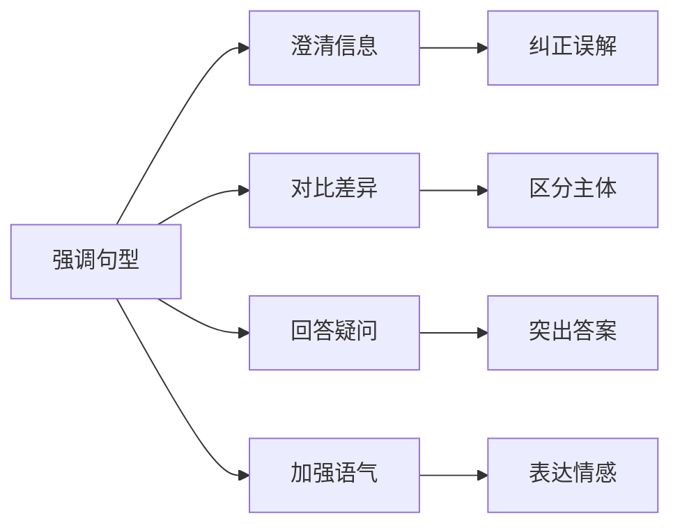
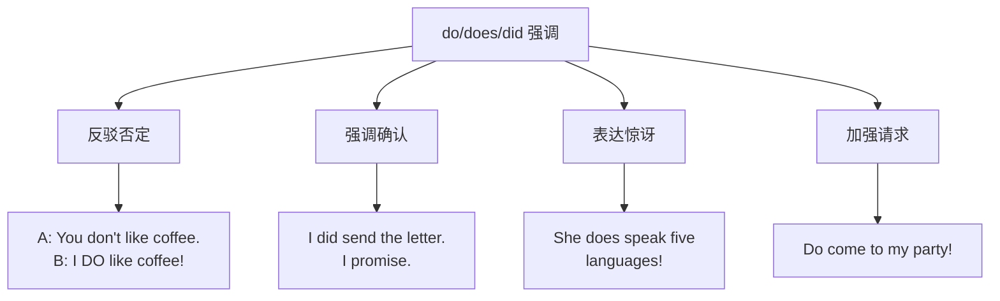
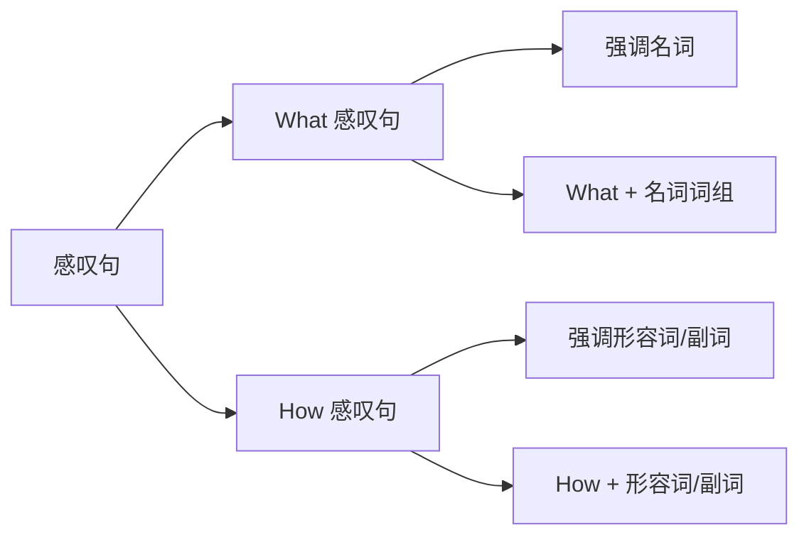
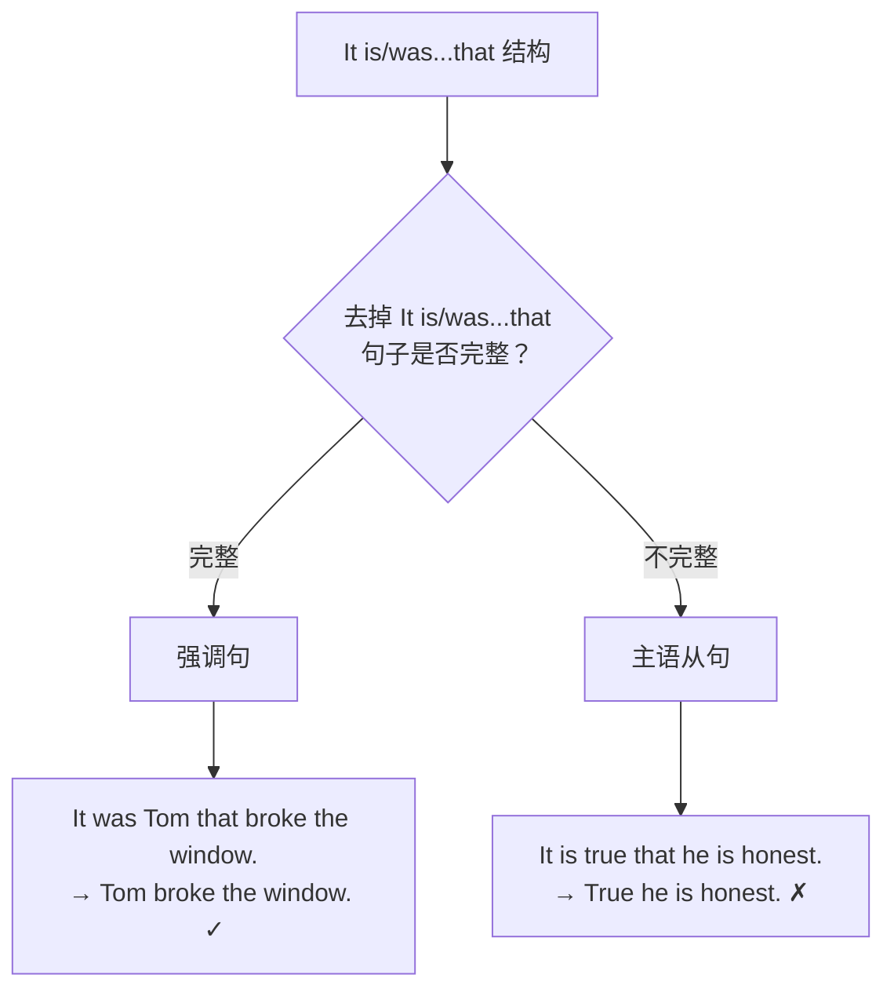
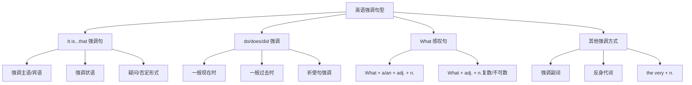

# 强调句型详解

## 1. 强调句型概述

### 1.1 什么是强调句

在日常交流中，我们经常需要突出句子中的某个成分，让听者或读者特别注意某个信息。英语中有多种方式可以实现这种强调效果，其中最重要的就是**强调句型（Emphatic Sentence / Cleft Sentence）**。

强调句型是一种特殊的句式结构，通过改变句子的常规语序或添加特定的词汇，将句子中某个成分置于突出位置，从而达到强调的目的。

> [!info] 强调的本质
>
> 强调的核心目的是**信息聚焦**——让听者或读者明确知道说话者想要突出的是哪个信息。这在澄清误解、对比差异、回答问题时尤为重要。

### 1.2 英语中的强调方式

英语中实现强调的方式主要有以下几种：

| 强调方式 | 示例 | 强调效果 |
| --- | --- | --- |
| **It is...that 强调句** | It was Tom who broke the window. | 结构性强调，最正式 |
| **do/does/did 强调** | I do love you. | 强调动词，语气强烈 |
| **What 感叹句** | What a beautiful day it is! | 感叹性强调 |
| **语调重读** | I saw HIM yesterday.（口语） | 通过重音强调 |
| **倒装句** | Never have I seen such a thing. | 通过语序变化强调 |
| **词汇强调** | It is really/indeed important. | 通过副词强调 |

本章重点讲解前三种语法层面的强调句型。

### 1.3 强调句型的语用功能



强调句型在实际交流中承担着多种语用功能。当需要纠正对方的错误理解时，强调句型可以清晰地指出正确的信息；当需要在多个对象之间进行对比时，强调句型可以突出差异；当回答别人的提问时，强调句型可以直接聚焦于答案核心；当需要表达强烈情感时，强调句型可以增强表达的力度。

---

## 2. It is...that/who 强调句型

### 2.1 基本结构

**It is...that/who** 强调句型是英语中最重要、最常用的强调结构，也被称为**分裂句（Cleft Sentence）**，因为它将一个简单句"分裂"成两个部分。

> [!tip] 核心公式
>
> **It is/was + 被强调部分 + that/who + 句子其余部分**
>
> - 强调人时，that 可以换成 who（口语中更常见）
> - 强调物、时间、地点、原因时，只能用 that
> - It 是形式主语，无实际意义，不能替换为 this/that

**基本转换示例**：

| 原句 | 强调句 | 强调对象 |
| --- | --- | --- |
| Tom broke the window yesterday. | It was **Tom** who/that broke the window yesterday. | 主语 |
| Tom broke the window yesterday. | It was **the window** that Tom broke yesterday. | 宾语 |
| Tom broke the window yesterday. | It was **yesterday** that Tom broke the window. | 时间状语 |

### 2.2 强调不同成分

#### 2.2.1 强调主语

当需要突出动作的执行者时，将主语置于 It is/was 之后：

**例句分析**：

```
原句：My brother helped me with my homework.
      我哥哥帮我做作业。

强调句：It was my brother who/that helped me with my homework.
        是我哥哥帮我做作业的。（不是别人）
```

> [!example] 更多例句
>
> **原句**：The teacher explained the problem clearly.
> **强调句**：It was **the teacher** who explained the problem clearly.
> **译文**：是那位老师把问题解释清楚的。
>
> **原句**：Love conquers all.
> **强调句**：It is **love** that conquers all.
> **译文**：正是爱能战胜一切。

#### 2.2.2 强调宾语

当需要突出动作的承受者或对象时，将宾语置于 It is/was 之后：

**例句分析**：

```
原句：I met your sister at the party.
      我在派对上遇见了你妹妹。

强调句：It was your sister that I met at the party.
        我在派对上遇见的是你妹妹。（不是别人）
```

> [!example] 更多例句
>
> **原句**：She bought a new car last week.
> **强调句**：It was **a new car** that she bought last week.
> **译文**：她上周买的是一辆新车。
>
> **原句**：They chose him as the team leader.
> **强调句**：It was **him** that they chose as the team leader.
> **译文**：他们选的正是他当队长。

> [!warning] 代词形式
>
> 强调宾语时，人称代词使用宾格形式：
> - ✅ It was **him** that I saw.
> - ❌ It was he that I saw.（过于正式，现代英语少用）

#### 2.2.3 强调时间状语

当需要突出动作发生的时间时，将时间状语置于 It is/was 之后：

**例句分析**：

```
原句：We finished the project on Friday.
      我们周五完成了这个项目。

强调句：It was on Friday that we finished the project.
        我们是在周五完成这个项目的。
```

> [!example] 更多例句
>
> **原句**：The accident happened at midnight.
> **强调句**：It was **at midnight** that the accident happened.
> **译文**：事故是在午夜发生的。
>
> **原句**：I first met her in 2010.
> **强调句**：It was **in 2010** that I first met her.
> **译文**：我是在2010年第一次遇见她的。

#### 2.2.4 强调地点状语

当需要突出动作发生的地点时，将地点状语置于 It is/was 之后：

**例句分析**：

```
原句：They held the meeting in the conference room.
      他们在会议室开的会。

强调句：It was in the conference room that they held the meeting.
        他们是在会议室开的会。（不是在别的地方）
```

> [!example] 更多例句
>
> **原句**：She lost her wallet on the bus.
> **强调句**：It was **on the bus** that she lost her wallet.
> **译文**：她是在公交车上丢的钱包。
>
> **原句**：The story took place in London.
> **强调句**：It was **in London** that the story took place.
> **译文**：这个故事是发生在伦敦的。

#### 2.2.5 强调原因状语

当需要突出动作的原因时，将原因状语置于 It is/was 之后：

**例句分析**：

```
原句：He succeeded because of his hard work.
      他因为努力工作而成功。

强调句：It was because of his hard work that he succeeded.
        正是因为他的努力工作，他才成功的。
```

> [!example] 更多例句
>
> **原句**：She was late because of the traffic jam.
> **强调句**：It was **because of the traffic jam** that she was late.
> **译文**：她是因为交通堵塞才迟到的。
>
> **原句**：They cancelled the game due to the rain.
> **强调句**：It was **due to the rain** that they cancelled the game.
> **译文**：正是由于下雨，他们才取消了比赛。

### 2.3 强调句的时态变化

强调句中 It is/was 的时态应与原句的时态保持逻辑一致：

| 原句时态 | 强调句中的 be 动词 | 示例 |
| --- | --- | --- |
| 一般现在时 | It **is**...that | It is Tom who likes music. |
| 一般过去时 | It **was**...that | It was Tom who liked music. |
| 现在完成时 | It **is**...that（保持 is） | It is Tom who has finished the work. |
| 过去完成时 | It **was**...that | It was Tom who had finished the work. |
| 一般将来时 | It **will be**...that | It will be Tom who will help us. |

> [!warning] 重要提示
>
> 强调句中 that 从句内的谓语动词时态保持原句时态不变，只有 It is/was 部分根据说话时间调整：
>
> **原句**：Tom **has finished** the project.（现在完成时）
> **强调句**：It is Tom who **has finished** the project.（that 从句保持现在完成时）

### 2.4 强调句的否定形式

强调句的否定有两种方式，表达的意义不同：

#### 2.4.1 否定 It is/was（否定整个强调）

```
It is not Tom that broke the window.
不是 Tom 打破了窗户。（强调"不是 Tom"）
```

这种否定方式表示"被强调的对象不是..."，通常用于纠正错误信息。

#### 2.4.2 否定 that 从句中的动词

```
It was the report that he didn't finish on time.
他没有按时完成的是那份报告。
```

这种否定方式强调的是"没有做某事"的对象。

> [!example] 对比示例
>
> **否定强调对象**：
> It **wasn't** Mary who called you.
> 给你打电话的不是 Mary。
>
> **否定从句动作**：
> It was Mary who **didn't** call you.
> 没给你打电话的人是 Mary。

### 2.5 强调句的疑问形式

#### 2.5.1 一般疑问句

将 It is/was 变为疑问语序（Is it/Was it）：

```
陈述句：It was Tom who broke the window.
疑问句：Was it Tom who broke the window?
        是 Tom 打破窗户的吗？
```

**回答方式**：
- Yes, it was. / No, it wasn't.
- Yes, it was Tom. / No, it was Jack.

#### 2.5.2 特殊疑问句

特殊疑问词 + is/was it + that + 其余部分：

```
Who was it that broke the window?
是谁打破了窗户？

What was it that you bought yesterday?
你昨天买的是什么？

When was it that you arrived?
你是什么时候到的？

Where was it that you met her?
你是在哪里遇见她的？

Why was it that he left early?
他为什么提前离开？

How was it that you solved the problem?
你是怎么解决这个问题的？
```

> [!tip] 特殊疑问句的语序
>
> 特殊疑问句的结构是：**疑问词 + is/was it that + 陈述语序**
>
> 注意 that 后面用陈述语序，不是疑问语序：
> - ✅ Who was it that **you saw**?
> - ❌ Who was it that **did you see**?

### 2.6 not...until 的强调句

**not...until** 结构在强调句中有特殊形式：

**原句**：
```
He didn't go to bed until his mother came back.
直到他妈妈回来他才去睡觉。
```

**强调句**：
```
It was not until his mother came back that he went to bed.
直到他妈妈回来他才去睡觉。（强调时间）
```

> [!warning] 注意事项
>
> 强调 not until 结构时：
> 1. not 必须提前到 It was 之后
> 2. that 从句中的谓语用肯定形式
>
> - ✅ It was not until midnight that he **finished** his homework.
> - ❌ It was not until midnight that he **didn't finish** his homework.

**更多例句**：

| 原句 | 强调句 |
| --- | --- |
| I didn't realize the truth until then. | It was not until then that I realized the truth. |
| She didn't leave until the rain stopped. | It was not until the rain stopped that she left. |
| We didn't know the news until yesterday. | It was not until yesterday that we knew the news. |

---

## 3. do/does/did 强调句型

### 3.1 基本用法

除了 It is...that 结构外，英语还可以用 **do/does/did + 动词原形** 来强调谓语动词，表示"确实、的确"的意思。

> [!tip] 核心公式
>
> **主语 + do/does/did + 动词原形 + 其他**
>
> - do 用于一般现在时（主语为 I/you/we/they 或复数名词）
> - does 用于一般现在时（主语为 he/she/it 或单数名词）
> - did 用于一般过去时（所有主语）

### 3.2 一般现在时的强调

**例句分析**：

```
普通句：I like English.
        我喜欢英语。

强调句：I do like English.
        我确实喜欢英语。
```

```
普通句：She works hard.
        她努力工作。

强调句：She does work hard.
        她确实很努力工作。
```

> [!example] 更多例句
>
> I **do** believe you.
> 我确实相信你。
>
> He **does** know the answer.
> 他确实知道答案。
>
> They **do** need our help.
> 他们确实需要我们的帮助。
>
> The machine **does** work properly.
> 这台机器确实运转正常。

### 3.3 一般过去时的强调

**例句分析**：

```
普通句：I saw him yesterday.
        我昨天看见他了。

强调句：I did see him yesterday.
        我昨天确实看见他了。
```

```
普通句：She finished the task on time.
        她按时完成了任务。

强调句：She did finish the task on time.
        她确实按时完成了任务。
```

> [!example] 更多例句
>
> We **did** try our best.
> 我们确实尽了最大努力。
>
> The train **did** arrive on time.
> 火车确实准时到达了。
>
> I **did** send you the email.
> 我确实给你发了邮件。

### 3.4 祈使句的强调

do 还可以用于强调祈使句，使语气更加诚恳或强烈：

```
普通祈使句：Come in.
            请进。

强调祈使句：Do come in.
            请一定进来。（更诚恳）
```

```
普通祈使句：Be careful.
            小心。

强调祈使句：Do be careful.
            一定要小心。（更强调）
```

> [!example] 常见强调祈使句
>
> **Do** sit down.
> 请坐，请坐。（非常热情）
>
> **Do** help yourself.
> 请随意，请一定随意。
>
> **Do** let me know if you need anything.
> 如果需要什么一定要告诉我。
>
> **Do** be quiet!
> 一定要安静！（强烈要求）

### 3.5 do 强调的使用场景



#### 3.5.1 反驳否定

当别人说你没做某事，而你实际做了时，用 do/does/did 强调进行反驳：

```
A: You don't care about this project.
   你不关心这个项目。

B: I do care about it! I've been working on it every day.
   我确实关心！我每天都在做这个项目。
```

#### 3.5.2 强调确认

当需要确认某事确实发生或存在时：

```
A: Did you lock the door?
   你锁门了吗？

B: Yes, I did lock the door. Don't worry.
   是的，我确实锁了门。别担心。
```

#### 3.5.3 表达惊讶

对某个令人惊讶的事实进行强调：

```
She does look young for her age!
她看起来确实比实际年龄年轻！

He did pass the exam! I can't believe it!
他确实通过考试了！我不敢相信！
```

### 3.6 do 强调的限制

> [!warning] 重要限制
>
> do/does/did 强调**只能用于一般现在时和一般过去时**，不能用于：
>
> - ❌ 进行时态：~~I am doing do reading.~~
> - ❌ 完成时态：~~I have did done the work.~~
> - ❌ 将来时态：~~I will do finish it.~~
> - ❌ 情态动词后：~~I can do swim.~~
>
> 其他时态的强调需要通过其他方式实现（如使用 really, indeed 等副词）。

---

## 4. What 引导的感叹性强调

### 4.1 What 感叹句的基本结构

What 引导的感叹句用于表达强烈的情感（惊讶、赞叹、愤怒等），同时也起到强调的作用。

> [!tip] 核心公式
>
> **What + (a/an) + 形容词 + 名词 + (主语 + 谓语)!**
>
> - 可数名词单数前要加 a/an
> - 可数名词复数或不可数名词前不加冠词
> - 主语和谓语可以省略

### 4.2 What 感叹句的类型

#### 4.2.1 What + a/an + 形容词 + 可数名词单数

```
What a beautiful day (it is)!
多么美好的一天啊！

What an interesting book (this is)!
这是一本多么有趣的书啊！

What a clever boy he is!
他是个多么聪明的男孩啊！
```

#### 4.2.2 What + 形容词 + 可数名词复数

```
What beautiful flowers (they are)!
多么美丽的花啊！

What lovely children (they are)!
多么可爱的孩子们啊！

What talented students they are!
他们是多么有才华的学生啊！
```

#### 4.2.3 What + 形容词 + 不可数名词

```
What beautiful weather (it is)!
多么好的天气啊！

What delicious food (this is)!
多么美味的食物啊！

What useful information (it is)!
多么有用的信息啊！
```

### 4.3 What 与 How 感叹句的区别



| 类型 | 结构 | 强调重点 | 示例 |
| --- | --- | --- | --- |
| What 感叹句 | What + (a/an) + adj. + n.! | 名词 | What a nice day! |
| How 感叹句 | How + adj./adv.! | 形容词/副词 | How nice the day is! |

**同一意思的两种表达**：

| What 感叹句 | How 感叹句 |
| --- | --- |
| What a clever girl she is! | How clever the girl is! |
| What beautiful music it is! | How beautiful the music is! |
| What an exciting game it was! | How exciting the game was! |

> [!tip] 转换技巧
>
> What 强调的是"名词词组"，How 强调的是"形容词/副词"：
>
> What a **beautiful day** it is! （强调 "a beautiful day" 这个整体）
> How **beautiful** the day is! （强调 "beautiful" 这个形容词）

### 4.4 What 感叹句的省略形式

在口语和非正式场合，What 感叹句常省略主语和谓语：

```
完整形式：What a beautiful sunset it is!
省略形式：What a beautiful sunset!

完整形式：What delicious cake this is!
省略形式：What delicious cake!

完整形式：What a mess the room is!
省略形式：What a mess!
```

> [!example] 日常口语中的省略感叹句
>
> What a day!
> 这是什么样的一天啊！（可以是好的也可以是糟糕的，根据语境）
>
> What a surprise!
> 真是个惊喜啊！
>
> What a shame!
> 真遗憾！
>
> What nonsense!
> 胡说八道！

---

## 5. 其他强调方式

### 5.1 强调副词

通过添加强调性副词来加强语气：

| 副词 | 用法 | 示例 |
| --- | --- | --- |
| **really** | 强调真实性 | I really appreciate your help. |
| **indeed** | 强调确实如此 | This is indeed a difficult problem. |
| **certainly** | 强调确定性 | She will certainly come. |
| **definitely** | 强调绝对肯定 | I definitely saw him there. |
| **absolutely** | 强调完全、绝对 | You are absolutely right. |
| **truly** | 强调真诚、真正 | I truly love you. |
| **just** | 强调正是、恰恰 | That's just what I mean. |
| **simply** | 强调简直、完全 | It's simply amazing. |

**例句**：

```
This is really important.
这真的很重要。

He did indeed finish the work.
他确实完成了工作。

I absolutely agree with you.
我完全同意你的看法。

She is simply the best.
她简直是最棒的。
```

### 5.2 强调性代词与反身代词

#### 5.2.1 反身代词表强调

反身代词（myself, yourself, himself 等）放在名词或代词后面表示强调：

```
I myself saw it happen.
我本人亲眼看到它发生的。

The president himself came to visit.
总统本人亲自来访。

She did it herself.
她亲自做的。
```

#### 5.2.2 very 作强调词

**the very + 名词** 表示"正是、恰恰是"：

```
This is the very book I've been looking for.
这正是我一直在找的那本书。

You are the very person I wanted to see.
你正是我想见的那个人。

At that very moment, the phone rang.
就在那个时刻，电话响了。
```

### 5.3 强调性词组

一些固定词组可以起到强调作用：

| 词组 | 含义 | 示例 |
| --- | --- | --- |
| **on earth / in the world** | 究竟、到底 | What on earth are you doing? |
| **ever** | 究竟（与疑问词连用） | Who ever told you that? |
| **at all** | 根本、完全 | I don't understand it at all. |
| **by no means** | 绝不 | This is by no means the end. |
| **nothing but** | 只不过、仅仅 | It's nothing but a joke. |
| **anything but** | 绝不是 | He is anything but a fool. |

**例句**：

```
Where on earth have you been?
你到底去哪儿了？

Why ever didn't you tell me?
你究竟为什么不告诉我？

I don't agree with him at all.
我根本不同意他的看法。

This is by no means an easy task.
这绝不是一项简单的任务。
```

---

## 6. 强调句与其他句型的区分

### 6.1 强调句与主语从句的区分

It is...that 结构既可以是强调句，也可以是主语从句，需要仔细区分：



**判断方法**：去掉 It is/was 和 that，看剩余部分能否构成完整句子。

#### 6.1.1 强调句的判断

```
It was yesterday that we met.
去掉 It was...that → We met yesterday. ✓（完整句子）
结论：这是强调句

It was Tom who/that called you.
去掉 It was...that → Tom called you. ✓（完整句子）
结论：这是强调句
```

#### 6.1.2 主语从句的判断

```
It is important that you should come early.
去掉 It is...that → Important you should come early. ✗（不完整）
结论：这是主语从句（It 是形式主语，that 从句是真正主语）

It is a pity that he failed.
去掉 It is...that → A pity he failed. ✗（不完整）
结论：这是主语从句
```

> [!tip] 快速判断技巧
>
> 如果 It is 后面是**形容词**（如 important, necessary, strange, true）或**名词短语**（如 a pity, a fact, a surprise），通常是主语从句，而不是强调句。
>
> - It is **important** that... → 主语从句
> - It is **a fact** that... → 主语从句
> - It is **Tom** that... → 强调句
> - It is **yesterday** that... → 强调句

### 6.2 强调句与定语从句的区分

当强调人时，who/that 可能与定语从句混淆：

```
强调句：It was the boy that broke the window.
        打破窗户的是那个男孩。（强调"是那个男孩"）

定语从句：It was the boy that broke the window who was punished.
          打破窗户的那个男孩受到了惩罚。
          （that broke the window 是定语从句，修饰 the boy）
```

**区分方法**：

| 类型 | 结构特点 | 去掉后是否完整 |
| --- | --- | --- |
| 强调句 | It is/was + 被强调部分 + that/who + 其余部分 | 完整 |
| 定语从句 | 先行词 + that/who + 从句（从句修饰先行词） | 先行词与从句不可分离 |

### 6.3 强调句与状语从句的区分

It is...that 有时与表示时间的状语从句混淆：

```
强调句：It was at 8 o'clock that he arrived.
        他是8点钟到达的。
        （去掉 It was...that → He arrived at 8 o'clock. ✓）

时间状语：It is two years since he left.
          自从他离开已经两年了。
          （since 引导时间状语从句，It is...since 是固定句型）
```

### 6.4 综合辨析练习

> [!example] 辨析下列句子
>
> **1. It was in the library that I first met her.**
> - 去掉 It was...that → I first met her in the library. ✓
> - 结论：强调句（强调地点）
>
> **2. It is necessary that you should attend the meeting.**
> - 去掉 It is...that → Necessary you should attend the meeting. ✗
> - 结论：主语从句（It 是形式主语）
>
> **3. It was the book that I bought yesterday that was lost.**
> - 第一个 that I bought yesterday 是定语从句，修饰 the book
> - 第二个 that 引导的是强调句的剩余部分
> - 结论：包含定语从句的强调句
>
> **4. It is three years since he graduated.**
> - It is...since 是固定句型，表示"自从...以来已有..."
> - 结论：时间状语从句

---

## 7. 强调句型的综合运用

### 7.1 写作中的强调句

强调句在写作中可以增强表达效果，突出重点信息：

**示例一：议论文中的强调**

```
普通表达：
Hard work leads to success.
努力工作导致成功。

强调表达：
It is hard work that leads to success.
正是努力工作才能带来成功。
```

**示例二：叙述文中的强调**

```
普通表达：
I realized my mistake then.
我那时意识到了我的错误。

强调表达：
It was then that I realized my mistake.
正是在那时我才意识到了我的错误。
```

### 7.2 口语中的强调句

在口语中，do/does/did 强调更为常用：

**场景一：表达真诚**

```
A: You don't seem interested in this project.
   你似乎对这个项目不感兴趣。

B: I do care about it. I'm just tired today.
   我确实很在意它。我只是今天累了。
```

**场景二：反驳误解**

```
A: You never listen to me!
   你从来不听我说话！

B: I do listen! I just don't always agree.
   我确实听了！只是不总是同意而已。
```

**场景三：确认事实**

```
A: Did you really see a UFO?
   你真的看到 UFO 了吗？

B: I did see it! I'm not making this up.
   我确实看到了！我没有编造。
```

### 7.3 强调句型的常见错误

> [!warning] 避免以下错误
>
> **错误 1：强调谓语动词时用 It is...that**
> - ❌ It is broke that Tom the window.
> - ✅ Tom did break the window.
> - 说明：It is...that 不能强调谓语动词，只能用 do/does/did
>
> **错误 2：that 从句中使用疑问语序**
> - ❌ Who was it that did you see?
> - ✅ Who was it that you saw?
> - 说明：that 后面用陈述语序
>
> **错误 3：强调整个句子**
> - ❌ It is Tom broke the window that.
> - ✅ It is true that Tom broke the window.（这是主语从句，不是强调句）
> - 说明：强调句只能强调句子的某个成分，不能强调整个句子
>
> **错误 4：not until 强调句中保留否定**
> - ❌ It was not until 10 o'clock that he didn't finish.
> - ✅ It was not until 10 o'clock that he finished.
> - 说明：that 从句用肯定形式

### 7.4 强调句型练习

#### 练习一：将下列句子改为强调句

1. Tom solved the difficult problem.
   - 强调主语：________________________
   - 强调宾语：________________________

2. She found her lost ring in the garden yesterday.
   - 强调地点：________________________
   - 强调时间：________________________

3. He succeeded because of his perseverance.
   - 强调原因：________________________

> [!example] 参考答案
>
> 1. 强调主语：It was Tom who/that solved the difficult problem.
>    强调宾语：It was the difficult problem that Tom solved.
>
> 2. 强调地点：It was in the garden that she found her lost ring yesterday.
>    强调时间：It was yesterday that she found her lost ring in the garden.
>
> 3. 强调原因：It was because of his perseverance that he succeeded.

#### 练习二：判断下列句子是强调句还是其他句型

1. It is obvious that he is lying.
2. It was on Monday that the accident happened.
3. It is the teacher who helps us most.
4. It is a fact that the earth is round.
5. It was not until midnight that he came back.

> [!example] 参考答案
>
> 1. 主语从句（It 是形式主语，obvious 是形容词）
> 2. 强调句（去掉 It was...that → The accident happened on Monday. ✓）
> 3. 强调句（去掉 It is...that → The teacher helps us most. ✓）
> 4. 主语从句（It 是形式主语，a fact 是名词短语）
> 5. 强调句（强调 not until midnight 这个时间状语）

---

## 8. 本章小结

### 8.1 核心要点回顾



### 8.2 三大强调结构对比

| 结构 | 用途 | 适用时态 | 示例 |
| --- | --- | --- | --- |
| It is...that | 强调主语、宾语、状语 | 所有时态 | It was Tom that called you. |
| do/does/did + V. | 强调谓语动词 | 一般现在时/过去时 | I did see him. |
| What + n.! | 感叹性强调 | 不限 | What a beautiful day! |

### 8.3 强调句判断口诀

> [!tip] 判断口诀
>
> **"去掉框架看完整"**
>
> 1. 去掉 It is/was 和 that/who
> 2. 看剩余部分能否成句
> 3. 能成句 → 强调句
> 4. 不能成句 → 其他句型（主语从句等）

### 8.4 学习建议

1. **理解强调的目的**：强调句的本质是信息聚焦，使用时要明确想要突出的信息
2. **熟练掌握转换**：多练习普通句与强调句之间的转换
3. **注意时态一致**：It is/was 的时态与语境保持一致
4. **区分相似结构**：掌握强调句与主语从句、定语从句的区分方法
5. **实际运用**：在写作和口语中有意识地使用强调句，增强表达效果

---

## 9. 专项练习

### 9.1 选择题

1. It was not until she took off her dark glasses ______ I realized she was a famous singer.
   - A. that
   - B. when
   - C. then
   - D. who

2. Was it in 1969 ______ the American astronaut succeeded in landing on the moon?
   - A. when
   - B. which
   - C. that
   - D. in which

3. It is the ability to do the job ______ matters, not where you come from.
   - A. one
   - B. that
   - C. what
   - D. it

4. ______ was it ______ put so many things in your bag?
   - A. How; that
   - B. What; that
   - C. How; who
   - D. What; who

5. I ______ like music, although I'm not good at singing.
   - A. do
   - B. did
   - C. does
   - D. am

> [!example] 参考答案
>
> 1. **A**。not until 强调句中用 that 连接。
> 2. **C**。强调句的疑问形式，用 that。
> 3. **B**。强调句，强调主语 the ability to do the job。
> 4. **B**。What 作 put 的宾语，that 引导强调句的剩余部分。
> 5. **A**。do 用于强调一般现在时的谓语动词。

### 9.2 句型转换

将下列句子改为强调句（按要求强调不同成分）：

**原句**：Mary bought a new dress at the shopping mall last Sunday.

1. 强调主语：_______________________________________
2. 强调宾语：_______________________________________
3. 强调地点：_______________________________________
4. 强调时间：_______________________________________

> [!example] 参考答案
>
> 1. It was **Mary** who/that bought a new dress at the shopping mall last Sunday.
> 2. It was **a new dress** that Mary bought at the shopping mall last Sunday.
> 3. It was **at the shopping mall** that Mary bought a new dress last Sunday.
> 4. It was **last Sunday** that Mary bought a new dress at the shopping mall.

### 9.3 改错题

找出下列句子中的错误并改正：

1. It was because he was ill that he didn't came to school.
2. Who was it that did break the window?
3. It was not until he told me that I didn't know the truth.
4. What beautiful a flower it is!
5. I do finished my homework before dinner.

> [!example] 参考答案
>
> 1. **didn't came → didn't come**（didn't 后用动词原形）
> 2. **did break → broke**（强调句 that 从句中用陈述语序，不用 do 强调）
> 3. **didn't know → knew**（not until 强调句的 that 从句用肯定形式）
> 4. **What beautiful a → What a beautiful**（What + a/an + adj. + n.）
> 5. **do finished → did finish**（do 强调后用动词原形）

### 9.4 翻译练习

将下列句子翻译成英语（使用强调句型）：

1. 正是在北京我第一次见到了她。
2. 他确实努力学习了，但还是没通过考试。
3. 直到我读完这本书，我才理解了作者的意图。
4. 究竟是谁告诉你这个消息的？
5. 多么精彩的表演啊！

> [!example] 参考答案
>
> 1. It was in Beijing that I first met her.
> 2. He did study hard, but he still didn't pass the exam.
> 3. It was not until I finished reading the book that I understood the author's intention.
> 4. Who was it that told you the news?
> 5. What a wonderful performance (it is)!

### 9.5 综合填空

用适当的词填空，完成强调句：

1. It ______ my father who taught me how to swim.
2. ______ was it that you met at the party last night?
3. I ______ want to help you, but I don't know how.
4. It was not ______ he explained it again that I understood.
5. ______ a clever idea this is!

> [!example] 参考答案
>
> 1. **was**（一般过去时的强调句）
> 2. **Who**（对人提问的强调句疑问形式）
> 3. **do**（一般现在时的 do 强调）
> 4. **until**（not until 强调句）
> 5. **What**（What 感叹句）

---

## 10. 拓展阅读

### 10.1 强调句在文学作品中的应用

强调句型在文学作品中经常用于突出主题、强化情感或制造戏剧效果：

**《傲慢与偏见》中的例句**：
> "It is a truth universally acknowledged, that a single man in possession of a good fortune, must be in want of a wife."

这个开场白使用了 It is...that 结构（虽然这里更接近主语从句），强调了"一个普遍认可的真理"，为整部小说奠定了讽刺幽默的基调。

**《哈姆雷特》中的强调**：
> "It was the nightingale, and not the lark, that pierced the fearful hollow of thine ear."

莎士比亚使用强调句来突出"是夜莺而不是云雀"，强调事物的本质区别。

### 10.2 强调句在新闻标题中的应用

新闻标题常用强调句型来吸引读者注意：

- "It Is Technology That Is Reshaping Our World"
  （正是科技在重塑我们的世界）

- "What a Victory It Was for the Underdog Team!"
  （对于这支弱旅来说，这是多么伟大的胜利！）

### 10.3 强调句在演讲中的应用

演讲者经常使用强调句来强化论点：

**马丁·路德·金《我有一个梦想》**：
> "It is obvious today that America has defaulted on this promissory note..."

使用 It is obvious that... 结构强调美国未能兑现承诺这一事实。

**温斯顿·丘吉尔演讲**：
> "It was, indeed, a miracle that the British troops were evacuated from Dunkirk."

使用强调句突出敦刻尔克撤退的奇迹性质。

---

## 11. 总结与展望

强调句型是英语中表达重点、突出信息的重要工具。通过本章的学习，你应该掌握：

1. **It is...that/who** 强调句的构成和用法，能够强调句子中的不同成分
2. **do/does/did** 强调谓语动词的方法及其使用场景
3. **What** 感叹句的结构和表达效果
4. 如何区分强调句与主语从句、定语从句等相似结构
5. 在写作和口语中灵活运用各种强调方式

掌握强调句型不仅能让你的英语表达更加准确有力，还能帮助你更好地理解英文阅读材料中作者想要传达的重点信息。在接下来的学习中，建议多阅读英文原版材料，观察强调句型的实际运用，并在自己的写作和口语练习中有意识地使用这些句型。

> [!success] 学习成果检验
>
> 完成本章学习后，你应该能够：
>
> - ✅ 将任意普通陈述句改写为强调句
> - ✅ 写出强调句的疑问形式和否定形式
> - ✅ 正确使用 do/does/did 强调谓语动词
> - ✅ 区分强调句与其他 It is...that 结构
> - ✅ 在实际写作中运用强调句增强表达效果
