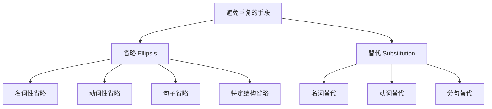
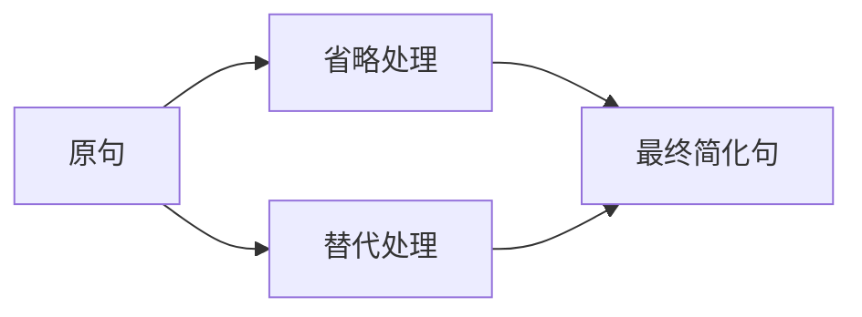
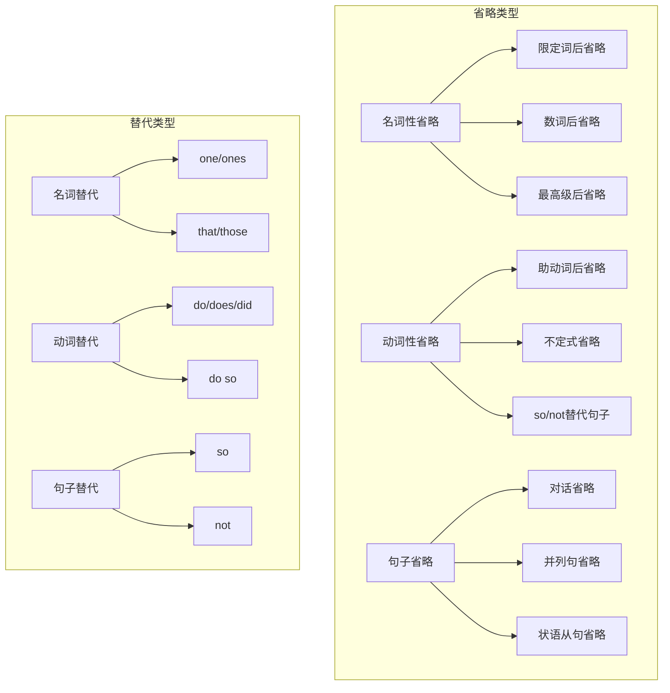

# 省略与替代

## 1. 概述

### 1.1 什么是省略与替代

在英语表达中，为了避免不必要的重复、使句子更加简洁流畅，说话者和写作者经常使用两种重要的语言手段：**省略（Ellipsis）** 和 **替代（Substitution）**。

**省略** 是指在不影响理解的前提下，将句子中某些可以从上下文推断出来的成分直接删除。被省略的部分虽然在形式上消失了，但其意义仍然存在于语境中。

**替代** 是指用一个简短的词（如 one、so、do 等）来代替前文已经出现的词、短语或句子，从而避免重复。替代词本身没有独立的词汇意义，其含义完全依赖于它所替代的内容。

> [!info] 省略与替代的本质区别
>
> - **省略**：直接删除重复成分，留下「空位」
> - **替代**：用「替代词」填充重复成分的位置
>
> 两者的共同目的都是避免重复、提高表达效率。

### 1.2 为什么要使用省略与替代

英语作为一种追求简洁高效的语言，非常注重避免不必要的重复。使用省略与替代有以下几个重要原因：

| 原因 | 说明 | 示例 |
| --- | --- | --- |
| **避免冗余** | 重复相同内容会使句子臃肿 | ~~I can swim and she can swim too.~~ → I can swim and she can too. |
| **增强连贯** | 省略和替代有助于建立句子间的衔接 | A: Do you like coffee? B: Yes, I do. (do 替代 like coffee) |
| **符合习惯** | 母语者在口语和书面语中大量使用 | 不使用省略会显得生硬、不自然 |
| **提高效率** | 用更少的词传达相同的信息 | 节省说话和写作的时间与精力 |

### 1.3 省略与替代的分类体系



上图展示了英语中避免重复的两大手段及其下属分类。省略主要涉及名词、动词、句子和特定结构的省略；替代则包括名词替代（one/ones）、动词替代（do）和分句替代（so/not）三大类型。在实际使用中，省略和替代往往相互配合，共同实现语言的简洁表达。

---

## 2. 省略的类型与规则

### 2.1 名词性省略

名词性省略是指省略句子中作为名词成分的词或短语。这类省略通常发生在名词的中心词可以从上下文清楚推断时。

#### 2.1.1 限定词后的名词省略

当名词前有限定词（如 some、any、both、each、either、neither、many、few、much、little 等）时，如果名词可以从上下文推断，则可以省略。

**基本模式**：限定词 + (省略的名词)

| 完整形式 | 省略形式 | 中文翻译 |
| --- | --- | --- |
| Some students passed and some students failed. | Some passed and some failed. | 一些学生通过了，一些学生没通过。 |
| I have two books. You can have both books. | I have two books. You can have both. | 我有两本书。你可以两本都拿。 |
| Do you have any questions? — I have many questions. | Do you have any? — I have many. | 你有问题吗？——我有很多问题。 |

> [!example] 详细例句分析
>
> **例句**：There are twenty students in our class. **Some** are from Beijing, **some** are from Shanghai, and **the rest** are from other cities.
>
> **分析**：
> - some = some students（一些学生）
> - the rest = the rest of the students（其余的学生）
> - 名词 students 因为上文已经提到，所以在后文省略
>
> **译文**：我们班有二十名学生。一些来自北京，一些来自上海，其余的来自其他城市。

#### 2.1.2 数词后的名词省略

基数词和序数词后面的名词在上下文明确时可以省略。

**基数词后省略**：

```
I ordered three pizzas, but they only delivered two (pizzas).
我点了三个披萨，但他们只送来了两个。

She has five children. Two (children) are boys and three (children) are girls.
她有五个孩子。两个是男孩，三个是女孩。
```

**序数词后省略**：

```
This is my second attempt. The first (attempt) was unsuccessful.
这是我第二次尝试。第一次没有成功。

There are three options. The first (option) is the cheapest.
有三个选项。第一个是最便宜的。
```

#### 2.1.3 形容词最高级后的名词省略

形容词最高级后面的名词在语境明确时常常省略。

```
Among all the students, Mary is the tallest (student).
在所有学生中，玛丽是最高的。

Of all the plans, this is the best (plan).
在所有计划中，这个是最好的。

This restaurant is the most expensive (restaurant) in town.
这家餐厅是镇上最贵的。
```

> [!tip] 省略后的词性变化
>
> 当名词省略后，原本修饰名词的限定词、数词或形容词在功能上变成了名词性成分，可以作主语、宾语等。
>
> - **The rich** should help **the poor**.（形容词名词化）
> - **Both** are correct.（限定词名词化）
> - **The first** is better than **the second**.（序数词名词化）

### 2.2 动词性省略

动词性省略是英语中最常见的省略类型之一，主要涉及助动词后的动词省略和不定式中的动词省略。

#### 2.2.1 助动词后的动词省略

当句子中出现助动词（be, have, do, will, would, can, could, may, might, shall, should, must 等）时，助动词后的主动词及其宾语、补语等成分可以省略。

**基本规则**：保留助动词，省略助动词后的所有内容。

| 对话/句子 | 省略内容 | 说明 |
| --- | --- | --- |
| A: Can you swim? B: Yes, I **can**. | swim | 省略 can 后的动词 |
| A: Have you finished? B: No, I **haven't**. | finished | 省略 have 后的过去分词 |
| She doesn't like coffee, but I **do**. | like coffee | 省略 do 后的动词短语 |
| A: Will you come? B: I **will** if I **can**. | come / come | 两个助动词后都省略 |

> [!warning] 助动词省略的注意事项
>
> 1. **保留的助动词必须与原句一致**
>    - He can swim, and I can ✓ (不能说 I do)
>    - She has finished, and I have ✓ (不能说 I did)
>
> 2. **be 动词作为助动词时同样适用**
>    - A: Are you coming? B: Yes, I am.
>    - She was invited, but I wasn't.
>
> 3. **多个助动词时，至少保留第一个**
>    - A: Have you been working? B: Yes, I have. (或 Yes, I have been.)

**复杂句中的助动词省略**：

```
I haven't read this book, but my sister has (read this book).
我没读过这本书，但我姐姐读过。

They said they would help, and they did (help).
他们说会帮忙，他们确实帮了。

She can speak French better than I can (speak French).
她法语说得比我好。

He has been to Paris, but I never have (been to Paris).
他去过巴黎，但我从没去过。
```

#### 2.2.2 不定式的省略

不定式 to do 结构在某些情况下可以省略 to 后面的动词，只保留 to。这种省略常出现在表示意愿、计划、建议等动词之后。

**常见允许省略的动词**：want, wish, hope, like, love, hate, prefer, try, mean, plan, expect, choose, decide, refuse, agree, promise, offer, ask, tell, advise, allow, permit, forbid, force, order, persuade, remind, warn, invite, encourage, teach, help 等。

```
A: Would you like to come?
B: I'd love to (come).
你想来吗？——我很想来。

You can leave if you want to (leave).
如果你想走就可以走。

A: Why didn't you tell me?
B: I meant to (tell you), but I forgot.
你为什么没告诉我？——我本打算告诉你的，但我忘了。

I asked him to help, but he refused to (help).
我请他帮忙，但他拒绝了。
```

> [!example] 不定式省略的详细例句
>
> **例句**：You may go swimming if you want **to**, but I don't want **to**.
>
> **分析**：
> - 第一个 to = to go swimming
> - 第二个 to = to go swimming
> - 两处都省略了不定式的动词部分
>
> **译文**：如果你想去游泳可以去，但我不想去。

**不定式省略的特殊情况**：

当不定式中包含 be 或 have been 时，通常保留 be 或 have been，不能只留 to。

```
A: Is he a doctor?
B: He used to be (a doctor). ✓
B: He used to. ✗

A: Have you ever been to Japan?
B: No, but I'd like to have been (to Japan). ✓

She isn't happy now, but she used to be (happy).
她现在不开心，但她以前是开心的。
```

#### 2.2.3 so 与 not 代替句子

当需要表示肯定或否定前文提到的内容时，可以用 so（表示肯定）或 not（表示否定）来替代整个句子或从句。

**常与 so/not 搭配的动词**：think, believe, suppose, expect, hope, imagine, guess, be afraid, seem, appear 等。

| 表达方式 | 含义 | 示例 |
| --- | --- | --- |
| I think/believe/hope **so**. | 我想/相信/希望是这样。 | A: Will it rain? B: I think so. |
| I think/believe/hope **not**. | 我想/相信/希望不是这样。 | A: Will we be late? B: I hope not. |
| I don't think **so**. | 我不这样认为。 | A: Is he coming? B: I don't think so. |
| I'm afraid **so/not**. | 恐怕是这样/不是这样。 | A: Is it broken? B: I'm afraid so. |

> [!warning] so 和 not 的否定形式区别
>
> 不同动词的否定形式有所不同：
>
> | 动词 | 肯定 | 否定（两种形式） |
> | --- | --- | --- |
> | think | I think so. | I don't think so. / I think not. (较正式) |
> | believe | I believe so. | I don't believe so. / I believe not. (较正式) |
> | suppose | I suppose so. | I don't suppose so. / I suppose not. |
> | hope | I hope so. | I hope not. ✓ / I don't hope so. ✗ |
> | be afraid | I'm afraid so. | I'm afraid not. ✓ |
>
> **注意**：hope 和 be afraid 的否定只能用 not，不能用 don't hope so 或 I'm not afraid so。

### 2.3 句子省略

句子省略是指在对话、并列句或复合句中，省略一个完整的句子成分或大部分句子内容。

#### 2.3.1 对话中的省略

在日常对话中，回答问题时经常省略与问句重复的部分，只保留新信息或关键词。

**疑问句的简短回答**：

```
A: Where are you going?
B: (I'm going) To school.

A: When did you arrive?
B: (I arrived) Yesterday.

A: Who broke the window?
B: (It was) Tom (who broke the window).

A: What's your name?
B: (My name is) David.

A: How old are you?
B: (I am) Twenty.
```

**祈使句的省略回答**：

```
A: Open the door, please.
B: OK. / All right. / Sure. (= I will open the door.)

A: Don't be late.
B: I won't (be late).
```

#### 2.3.2 并列句中的省略

在由 and, but, or, nor 等连词连接的并列句中，如果后一分句与前一分句有相同的成分，通常省略后一分句中的重复部分。

**主语相同时省略主语**：

```
He came in and (he) sat down.
他进来并坐下了。

She can sing but (she) can't dance.
她会唱歌但不会跳舞。

I will go shopping or (I will) stay at home.
我会去购物或待在家里。
```

**主语和助动词相同时省略两者**：

```
She was cooking and (she was) singing.
她边做饭边唱歌。

They have been working hard and (they have been) making progress.
他们一直在努力工作并取得进步。
```

**动词相同时省略动词**：

```
Tom likes football and Mary (likes) basketball.
汤姆喜欢足球，玛丽喜欢篮球。

Some students went to the library and others (went) to the playground.
一些学生去了图书馆，其他人去了操场。
```

> [!example] 并列句省略的综合分析
>
> **例句**：John can play the piano, Mary the violin, and Peter the guitar.
>
> **完整形式**：John can play the piano, Mary can play the violin, and Peter can play the guitar.
>
> **省略分析**：
> - 第二、三分句省略了 can play
> - 这种省略在正式书面语中较常见
> - 省略使句子更紧凑，节奏更明快
>
> **译文**：约翰会弹钢琴，玛丽会拉小提琴，彼得会弹吉他。

#### 2.3.3 状语从句中的省略

在 when, while, if, unless, though, although, as if, as though, whether, until, once 等引导的状语从句中，如果从句的主语与主句的主语一致，且从句谓语含有 be 动词，则可以省略从句的主语和 be 动词。

**时间状语从句的省略**：

```
When (he was) young, he lived in the countryside.
他年轻时住在乡下。

While (I was) waiting for the bus, I met an old friend.
等公交车时，我遇到了一个老朋友。

Once (it is) heated, the metal expands.
一旦加热，金属就会膨胀。
```

**条件状语从句的省略**：

```
If (it is) necessary, I will come again.
如有必要，我会再来。

Unless (I am) invited, I won't go.
除非受到邀请，否则我不会去。

If (you are) interested, please contact us.
如有兴趣，请联系我们。
```

**让步状语从句的省略**：

```
Though (he was) tired, he continued working.
虽然累了，他继续工作。

Although (she was) poor, she was happy.
虽然穷，她很快乐。

While (it is) small, the device is powerful.
虽然小，这个设备很强大。
```

**方式状语从句的省略**：

```
He looked as if (he was) puzzled.
他看起来好像很困惑。

She acted as though (she were) angry.
她表现得好像很生气。
```

> [!warning] 状语从句省略的条件
>
> 只有满足以下条件才能省略：
>
> 1. **从句主语与主句主语相同**
>    - ✓ When young, he was poor. (he = he)
>    - ✗ When young, his father died. (he ≠ his father)
>
> 2. **从句谓语含有 be 动词**
>    - ✓ While waiting, I read a book. (was waiting)
>    - ✓ If necessary, call me. (is necessary)
>
> 3. **省略后意思仍然清楚**
>    - 不能造成歧义或误解

### 2.4 特定结构中的省略

#### 2.4.1 比较结构中的省略

在 than 或 as...as 引导的比较结构中，常常省略与主句重复的成分。

**than 从句中的省略**：

```
He runs faster than I (run) / than me.
他跑得比我快。

She knows more than I (know) / than me.
她知道的比我多。

I have more books than he (has) / than him.
我的书比他多。

You work harder than she (works) / than her.
你工作比她努力。
```

> [!tip] than 后用主格还是宾格
>
> - **主格** (I, he, she, we, they)：正式用法，把 than 看作连词
>   - He is taller than I (am).
> - **宾格** (me, him, her, us, them)：口语常用，把 than 看作介词
>   - He is taller than me.
>
> 两种用法都被接受，但在正式写作中建议使用主格形式。

**as...as 结构中的省略**：

```
He is as tall as I (am) / as me.
他和我一样高。

She works as hard as he (works) / as him.
她和他工作一样努力。

I don't earn as much as she (earns) / as her.
我挣的没有她多。
```

**the more...the more 结构中的省略**：

```
The more, the better.
越多越好。(= The more there is, the better it is.)

The sooner, the better.
越快越好。(= The sooner it is, the better it is.)

The higher (you climb), the colder (it becomes).
爬得越高，（天气）越冷。
```

#### 2.4.2 定语从句中的省略

定语从句在某些情况下可以省略关系代词或进行其他省略。

**关系代词作宾语时可省略**：

```
The book (that/which) I bought yesterday is very interesting.
我昨天买的书很有趣。

The man (whom/who/that) you met is my uncle.
你遇到的那个人是我叔叔。

Is this the place (that) you mentioned?
这是你提到的地方吗？
```

**关系代词 + be 动词可省略**：

```
The girl (who is) sitting there is my sister.
坐在那儿的女孩是我姐姐。

The letter (that was) written in pencil is hard to read.
用铅笔写的信很难读。

Anyone (who is) interested can apply.
任何感兴趣的人都可以申请。
```

#### 2.4.3 宾语从句中 that 的省略

在宾语从句中，连接词 that 通常可以省略，尤其是在口语中。

```
I think (that) he is right.
我认为他是对的。

She said (that) she would come.
她说她会来。

I hope (that) you will succeed.
我希望你会成功。

Do you believe (that) it's true?
你相信这是真的吗？
```

> [!warning] 不能省略 that 的情况
>
> 1. **两个并列的宾语从句，第二个 that 不能省略**
>    - He said (that) he was tired and **that** he needed rest.
>
> 2. **宾语从句放在句首时不能省略**
>    - **That** he will come is certain.（不能省略）
>
> 3. **在 it 作形式宾语的句型中不能省略**
>    - I find it strange **that** he didn't come.

---

## 3. 替代词的使用

### 3.1 one 和 ones 的用法

one 用于替代前文提到的单数可数名词，ones 用于替代复数可数名词。这是英语中最常用的名词替代词。

#### 3.1.1 one 的基本用法

**替代单数可数名词**：

```
I don't have a pen. Could you lend me one?
我没有钢笔。你能借我一支吗？(one = a pen)

This book is boring. I want to read a more interesting one.
这本书很无聊。我想读一本更有趣的。(one = book)

A: Which cake do you want?
B: The big one, please.
你想要哪块蛋糕？——大的那块。(one = cake)
```

**one 前可以加形容词**：

```
I need a new computer. The old one doesn't work.
我需要一台新电脑。旧的不好用了。

If you don't like this shirt, try that blue one.
如果你不喜欢这件衬衫，试试那件蓝色的。

A: Which pen is yours?
B: The red one.
哪支笔是你的？——红色那支。
```

> [!example] one 用法详解
>
> **例句**：I bought two shirts yesterday. One is white and the other one is black.
>
> **分析**：
> - 第一个 one 前没有修饰语，直接替代 shirt
> - 第二个 one 前有 the other 修饰，同样替代 shirt
> - one 既可以单独使用，也可以带修饰语
>
> **译文**：我昨天买了两件衬衫。一件是白色的，另一件是黑色的。

#### 3.1.2 ones 的基本用法

**替代复数可数名词**：

```
These apples are too small. I want bigger ones.
这些苹果太小了。我想要大一点的。(ones = apples)

A: Which shoes do you prefer?
B: The black ones.
你更喜欢哪双鞋？——黑色那双。(ones = shoes)

The new phones are better than the old ones.
新手机比旧手机好。(ones = phones)
```

**ones 的修饰**：

```
Do you have any cheaper ones?
你们有便宜一点的吗？

I like the ones with flowers on them.
我喜欢上面有花的那些。

These are not the ones I ordered.
这些不是我订的那些。
```

#### 3.1.3 one/ones 的使用限制

| 情况 | 能否使用 one/ones | 替代方式 |
| --- | --- | --- |
| 替代不可数名词 | ❌ | 用 some/any 或直接省略 |
| 替代专有名词 | ❌ | 必须重复原词 |
| 替代物质名词 | ❌ | 用 some/any 或直接省略 |
| 所有格后 | ❌ | 直接省略 |

**不能用 one 替代不可数名词**：

```
I don't have any money. Could you lend me some?
我没钱。你能借我一些吗？(不能说 lend me one)

This coffee is cold. I'd like some hot coffee.
这咖啡是凉的。我想要热的。(不能说 a hot one)

A: Would you like some water?
B: Yes, please. / No, thanks. (不能用 one/ones)
```

**所有格后不用 one**：

```
My car is red, and his (car) is blue.
我的车是红色的，他的是蓝色的。(不说 his one)

Your answer is right, but hers (answer) is wrong.
你的答案对了，但她的错了。(不说 hers one)
```

> [!warning] a/an 与 one 的区别
>
> - **a/an**：泛指"一个"，强调数量为一
> - **one**：特指"一个（作为替代）"或强调对比
>
> 正确用法：
> - I need **a** pen.（泛指一支笔）
> - I don't have a pen. Can I borrow **one**?（替代 a pen）
> - I only need **one** pen, not two.（强调数量对比）

### 3.2 that 和 those 的用法

that 用于替代前文提到的单数名词（可数或不可数），those 用于替代复数可数名词。与 one/ones 不同，that/those 通常用于同类事物的比较。

#### 3.2.1 that 的替代用法

**替代单数可数名词（用于比较）**：

```
The weather here is warmer than that in Beijing.
这里的天气比北京的暖和。(that = the weather)

The population of China is larger than that of Japan.
中国的人口比日本的多。(that = the population)

My computer is newer than that of my brother.
我的电脑比我哥哥的新。(that = computer)
```

**替代不可数名词（用于比较）**：

```
The water in this river is cleaner than that in the other river.
这条河的水比那条河的干净。(that = the water)

The quality of this product is better than that of the competitor.
这个产品的质量比竞争对手的好。(that = the quality)

The music of Mozart is different from that of Beethoven.
莫扎特的音乐与贝多芬的不同。(that = the music)
```

> [!tip] that 与 one 的区别
>
> | 特征 | that | one |
> | --- | --- | --- |
> | 用于比较 | ✓ 常用于比较结构 | ✓ 也可用于比较 |
> | 替代不可数名词 | ✓ 可以 | ✗ 不可以 |
> | 前面加形容词 | ✗ 不可以 | ✓ 可以 (a big one) |
> | 强调「同一类别」 | ✓ 强调 | 一般不强调 |
>
> **例句对比**：
> - The cars made in Japan are cheaper than **those** made in Germany.（强调同类比较）
> - I don't like this car. I want a red **one**.（泛指任意一辆红色的车）

#### 3.2.2 those 的替代用法

**替代复数可数名词（用于比较）**：

```
The streets in Paris are narrower than those in New York.
巴黎的街道比纽约的窄。(those = the streets)

Students who work hard will do better than those who don't.
努力学习的学生会比不努力的学生表现更好。(those = students)

My scores are higher than those of my classmates.
我的分数比同学们的高。(those = scores)
```

**those 后接定语从句或介词短语**：

```
Those who want to join should sign up now.
想参加的人现在应该报名。

I prefer the paintings by Monet to those by Picasso.
比起毕加索的画，我更喜欢莫奈的。

These products are better than those from other companies.
这些产品比其他公司的好。
```

### 3.3 so 的替代用法

so 作为替代词可以替代前文出现的形容词、名词或整个句子。这种用法在口语和书面语中都非常常见。

#### 3.3.1 so 替代形容词或副词

**在 think, believe, suppose, expect, imagine, hope, be afraid 等动词后**：

```
A: Is he honest?
B: I think so. (so = that he is honest)
他诚实吗？——我认为是的。

A: Will the weather be fine tomorrow?
B: I hope so. (so = that the weather will be fine tomorrow)
明天天气会好吗？——我希望是。

A: Is she coming to the party?
B: I suppose so. / I suppose not.
她会来参加聚会吗？——我想是吧。/ 我想不会。
```

#### 3.3.2 so 在特定句型中的用法

**if so / if not**：

```
You may be right. If so, we should change our plan.
你可能是对的。如果是这样，我们应该改变计划。

She might be late. If not, we can start on time.
她可能会迟到。如果不会，我们可以准时开始。

A: Do you want to go?
B: If so, let me know. (= If you want to go)
你想去吗？——如果想去，告诉我。
```

**say so / do so / make it so**：

```
If you don't agree, just say so.
如果你不同意，就说出来。

I asked him to help, and he did so immediately.
我请他帮忙，他立刻就帮了。

You want a promotion? Then make it so.
你想升职？那就去实现它。
```

**so + 助动词 + 主语（表示"也是如此"）**：

```
I like music, and so does my sister.
我喜欢音乐，我姐姐也是。

He can swim, and so can I.
他会游泳，我也会。

She has been to Paris, and so have I.
她去过巴黎，我也去过。
```

> [!warning] so + 主语 + 助动词 vs so + 助动词 + 主语
>
> 两种语序表达的意思完全不同：
>
> | 结构 | 含义 | 例句 |
> | --- | --- | --- |
> | so + 助动词 + 主语 | 「另一方也是如此」 | He is tired. — So am I.（我也累了） |
> | so + 主语 + 助动词 | 「确实如此」（表强调） | He is tired. — So he is.（他确实累了） |
>
> **详细例句**：
> - A: He works hard. B: So does she.（她也努力工作。——另一方相同）
> - A: He works hard. B: So he does.（他确实努力工作。——强调认同）

### 3.4 do 的替代用法

do（及其各种形式 does, did, done）可以用来替代前文出现的动词或动词短语，避免重复。这种用法称为「替代性 do」或「代动词 do」。

#### 3.4.1 基本替代用法

**do 替代实义动词**：

```
A: Do you like coffee?
B: Yes, I do. (do = like coffee)
你喜欢咖啡吗？——是的，我喜欢。

He runs faster than I do.
他跑得比我快。(do = run)

She speaks English better than he does.
她英语说得比他好。(does = speaks English)

I don't smoke, but my father does.
我不抽烟，但我爸爸抽。(does = smokes)
```

**did 替代过去式动词**：

```
A: Did you finish the homework?
B: Yes, I did. (did = finished the homework)

She didn't come, but he did.
她没来，但他来了。(did = came)

I worked harder than he did.
我工作比他努力。(did = worked)
```

#### 3.4.2 do so 的用法

do so 比单独的 do 更正式，常用于书面语。do so 通常替代「动词 + 宾语/状语」整个动作结构。

```
He promised to help me, and he did so.
他答应帮我，他确实帮了。

I asked her to wait, and she did so patiently.
我请她等一下，她耐心地等了。

You can apply online or do so by mail.
你可以在线申请或通过邮件申请。

If you wish to leave early, you may do so.
如果你想早点离开，可以这样做。
```

> [!tip] do 与 do so 的区别
>
> | 特征 | do | do so |
> | --- | --- | --- |
> | 语体 | 口语和书面语均可 | 较正式，多用于书面语 |
> | 替代范围 | 动词短语 | 整个动作（含动词、宾语、状语） |
> | 可加状语 | 通常不加 | 可以加状语（如 do so carefully） |
>
> **例句对比**：
> - I told him to leave, and he **did**. (口语常用)
> - I told him to leave, and he **did so** immediately. (正式，可加状语)

#### 3.4.3 do it / do that / do this

当需要指代具体的动作时，可以用 do it、do that 或 do this。这些表达比 do so 更具体、更口语化。

```
A: Can you fix this computer?
B: I'll try to do it.
你能修这台电脑吗？——我试试看。

Don't touch that! Only experts can do that safely.
别碰那个！只有专家才能安全地做那个。

If you can do this, you're a genius.
如果你能做到这个，你就是天才。
```

**do so, do it, do this, do that 的比较**：

| 表达 | 用法 | 示例 |
| --- | --- | --- |
| do so | 正式，替代前文动作 | He was asked to resign and did so. |
| do it | 口语常用，指代具体事情 | Can you do it by tomorrow? |
| do this | 指代眼前或即将做的事 | Watch me do this. |
| do that | 指代刚提到的或对方的动作 | Don't do that again. |

---

## 4. 避免重复的其他表达方式

### 4.1 neither/nor 结构

当表示「某人/某物也不」时，使用 neither 或 nor 引导的倒装结构。

#### 4.1.1 neither/nor + 助动词 + 主语

```
I don't like horror movies. Neither/Nor does my wife.
我不喜欢恐怖片。我妻子也不喜欢。

He hasn't finished yet. Neither/Nor have I.
他还没完成。我也没有。

She can't swim. Neither/Nor can her brother.
她不会游泳。她弟弟也不会。

They won't come. Neither/Nor will we.
他们不会来。我们也不会。
```

> [!warning] neither/nor 与 so 的区别
>
> | 结构 | 含义 | 用于 |
> | --- | --- | --- |
> | So + 助动词 + 主语 | 「某人也是/也做」 | 肯定句后 |
> | Neither/Nor + 助动词 + 主语 | 「某人也不是/也不做」 | 否定句后 |
>
> **例句**：
> - I am tired. — **So am** I.（我也累了）
> - I am not tired. — **Neither am** I.（我也不累）

#### 4.1.2 me neither / me too

在口语中，回应别人的陈述时可以用简短的 me neither（回应否定）或 me too（回应肯定）。

```
A: I don't like spicy food.
B: Me neither. / Neither do I.
我不喜欢辣的食物。——我也不喜欢。

A: I love chocolate.
B: Me too. / So do I.
我喜欢巧克力。——我也喜欢。

A: I've never been to Australia.
B: Me neither. / Neither have I.
我从没去过澳大利亚。——我也没有。
```

### 4.2 the same 结构

使用 the same 来表示「相同的情况」，避免重复描述。

```
A: I'll have coffee.
B: The same for me, please. / I'll have the same.
我要咖啡。——我也要一样的。

She feels nervous before exams. The same is true for most students.
她考试前会紧张。大多数学生也是如此。

He made the same mistake as I did.
他犯了和我一样的错误。

The situation is the same as it was last year.
情况和去年一样。
```

### 4.3 such 的指代用法

such 可以指代前文提到的人、事物或情况，意为「这样的人/事物/情况」。

```
He is a genius. I wish I were such.
他是天才。我希望我也是。(such = a genius)

Such was the situation we faced.
我们面对的就是这样的情况。

Doctors, lawyers, teachers — such are the professionals in high demand.
医生、律师、教师——这些就是需求量大的专业人士。

If such is the case, we need to reconsider.
如果情况是这样，我们需要重新考虑。
```

### 4.4 likewise 和 similarly

likewise 和 similarly 用于表示「同样地、类似地」，连接两个相似的陈述。

```
She is interested in music. Likewise, her daughter loves singing.
她对音乐感兴趣。同样地，她女儿也喜欢唱歌。

The first experiment failed. Similarly, the second one was unsuccessful.
第一次实验失败了。同样，第二次也不成功。

I work hard, and I expect you to do likewise.
我努力工作，我也期望你同样如此。
```

### 4.5 省略与替代的综合运用

在实际语言使用中，省略和替代往往同时出现，相互配合。



上图展示了省略和替代在句子简化过程中的协同作用。原句经过省略处理（删除可推断的成分）和替代处理（用代词替代重复成分），最终形成简洁的表达。两种手段可以单独使用，也可以组合使用。

> [!example] 综合运用示例
>
> **原句**：
> Some students like mathematics, but other students don't like mathematics. The students who like mathematics often do well in physics, and the students who don't like mathematics often prefer literature.
>
> **简化后**：
> Some students like mathematics, but others don't. Those who do often do well in physics, and those who don't often prefer literature.
>
> **分析**：
> - other students → others（省略 + 替代）
> - don't like mathematics → don't（助动词后省略）
> - The students who like mathematics → Those who do（替代 + 省略）
> - The students who don't like mathematics → those who don't（替代 + 省略）

---

## 5. 常见错误与辨析

### 5.1 one/ones 使用错误

| 错误用法 | 正确用法 | 错误原因 |
| --- | --- | --- |
| I like this water. Give me more one. | Give me more. / Give me some more. | one 不能替代不可数名词 |
| Your car is nice. I want to buy one too. | I want to buy one like that too. | 容易造成歧义，最好加修饰语 |
| His one is better than mine. | His is better than mine. | 所有格后不用 one |
| I need two ones. | I need two. | 数词后直接省略名词，不用 ones |
| This ones are good. | These ones are good. / These are good. | 指示代词与 one 的单复数要一致 |

### 5.2 that/those 与 one/ones 混淆

```
❌ The climate of Beijing is colder than one of Shanghai.
✓ The climate of Beijing is colder than that of Shanghai.
（比较同类事物时用 that/those）

❌ I want to buy a computer like that you have.
✓ I want to buy a computer like the one you have.
（指代泛指的名词时用 one）

❌ The books in this library are more than ones in that library.
✓ The books in this library are more than those in that library.
（比较两处的书籍数量，用 those）
```

### 5.3 so 的位置错误

```
❌ I so think.
✓ I think so.
（so 放在动词后面）

❌ So I do like music.
✓ I do like music. / So do I.
（so 用于强调或倒装，位置不同意义不同）

❌ I don't hope so.
✓ I hope not.
（hope 的否定用 hope not，不用 don't hope so）
```

### 5.4 省略过度或不当

```
❌ A: When are you leaving? B: Tomorrow.
   (如果上下文不明确，这种省略可能造成误解)

✓ A: When are you leaving? B: I'm leaving tomorrow.
   或 B: Tomorrow morning.

❌ Although tired, the work had to be finished.
   (悬垂修饰语：省略后主语不一致)

✓ Although tired, he had to finish the work.
   或 Although he was tired, the work had to be finished.

❌ If any, please let me know.
   (省略过度，意思不清)

✓ If there are any problems, please let me know.
   或 If any problems arise, please let me know.
```

### 5.5 助动词省略时态错误

```
❌ She has worked here for years, and I have for months.
✓ She has worked here for years, and I have for months.
   或 She has worked here for years, and I have too.
   (这个例句本身是正确的，但要确保助动词时态一致)

❌ He can swim, but I couldn't.
✓ He can swim, but I can't.
   或 He could swim, but I couldn't.
   (助动词的时态要与原句保持一致)

❌ She will come, and so I do.
✓ She will come, and so will I.
   (将来时用 will，不能换成 do)
```

---

## 6. 实战练习与应用

### 6.1 省略练习

**将下列句子中可以省略的部分标出，并写出省略后的句子。**

1. Some students passed the exam and some students failed the exam.
2. I have read this book, but my brother has not read this book.
3. When she was young, she lived in the countryside.
4. The man who is standing there is my father.
5. I will help you if it is necessary.

> [!tip] 参考答案
>
> 1. Some passed and some failed.（省略 students, the exam）
> 2. I have read this book, but my brother hasn't.（省略 read this book）
> 3. When young, she lived in the countryside.（省略 she was）
> 4. The man standing there is my father.（省略 who is）
> 5. I will help you if necessary.（省略 it is）

### 6.2 替代练习

**用适当的替代词填空。**

1. I don't have a pen. Can I borrow ______?
2. The weather in Shanghai is milder than ______ in Harbin.
3. These books are more interesting than ______ we read last month.
4. A: Will it rain tomorrow? B: I hope ______.
5. He asked me to help, and I ______ so gladly.
6. She can play the piano, and ______ can I.
7. I don't like horror movies. ______ does my wife.

> [!tip] 参考答案
>
> 1. one
> 2. that
> 3. those / the ones
> 4. not（根据语境，希望不下雨）或 so（希望下雨）
> 5. did
> 6. so
> 7. Neither / Nor

### 6.3 综合改写练习

**将下列句子改写得更简洁。**

1. I like classical music, and my sister likes classical music too.
2. Some people prefer tea, and other people prefer coffee.
3. He said that he would come, and he came.
4. The students who study hard usually get good grades. The students who don't study hard usually don't get good grades.
5. She can speak French, and I can speak French too. She can speak German, but I can't speak German.

> [!tip] 参考答案
>
> 1. I like classical music, and so does my sister.
> 2. Some people prefer tea, and others coffee.
> 3. He said he would come, and he did.
> 4. Students who study hard usually get good grades; those who don't usually don't.
> 5. She can speak French, and so can I. She can speak German, but I can't.

### 6.4 真题演练

**以下是一些典型的语法选择题，测试对省略和替代的掌握程度。**

1. The population of Shanghai is larger than ______ of Beijing.
   A. one   B. it   C. that   D. those

2. — I don't think I'll be able to finish the work on time.
   — ______.
   A. So do I   B. So I do   C. Neither do I   D. Neither I do

3. — Would you like to go to the cinema tonight?
   — I'd love ______, but I have too much homework.
   A. to go   B. to   C. going   D. go

4. Some of the wheat is from Canada. What about ______?
   A. another   B. the other   C. others   D. the rest

5. My room is bigger than ______.
   A. my brother   B. my brother's one   C. that of my brother   D. my brother's

> [!tip] 参考答案与解析
>
> 1. **C. that** - 比较同类事物（the population），用 that 替代。不用 one（one 不替代不可数名词），不用 those（单数）。
>
> 2. **C. Neither do I** - 回应否定句「我也不认为」，用 Neither + 助动词 + 主语结构。
>
> 3. **B. to** - would love to 后省略动词，只保留 to。
>
> 4. **D. the rest** - wheat 是不可数名词，用 the rest（其余的）替代 the rest of the wheat。
>
> 5. **D. my brother's** - 所有格后直接省略名词（room），不能加 one。

---

## 7. 省略与替代小结

### 7.1 核心知识点回顾



上图系统总结了省略与替代的完整分类体系。省略分为名词性省略、动词性省略和句子省略三大类；替代分为名词替代、动词替代和句子替代三大类。掌握这些分类有助于在实际使用中快速识别和应用相应的语法规则。

### 7.2 使用原则总结

| 原则 | 说明 | 示例 |
| --- | --- | --- |
| **可恢复性** | 省略的内容必须能从上下文恢复 | I can swim but she can't. (= can't swim) |
| **明确性** | 省略后不能造成歧义 | ✗ She loves him more than me. (歧义) |
| **一致性** | 替代词与被替代词在数、时态上一致 | one/ones, do/does/did |
| **自然性** | 符合英语表达习惯 | 口语常用省略，书面语更完整 |

### 7.3 常用结构速查表

| 结构 | 用法 | 示例 |
| --- | --- | --- |
| one/ones | 替代可数名词 | I want a big one. |
| that/those | 替代名词（用于比较） | The climate here is warmer than that there. |
| do/does/did | 替代动词短语 | He runs faster than I do. |
| do so | 替代整个动作（正式） | I asked him to leave, and he did so. |
| so (+ 助动词 + 主语) | 表示「也是如此」 | So do I. / So can she. |
| neither/nor (+ 助动词 + 主语) | 表示「也不」 | Neither do I. / Nor can she. |
| I think/hope so. | 替代肯定从句 | A: Will it work? B: I hope so. |
| I hope/am afraid not. | 替代否定从句 | A: Will it rain? B: I hope not. |

### 7.4 学习建议

> [!success] 掌握省略与替代的关键
>
> 1. **大量阅读**：在阅读英文材料时，注意识别省略和替代结构
> 2. **模仿练习**：在写作和口语中有意识地使用这些结构
> 3. **对比分析**：比较省略前后、替代前后的句子，理解其作用
> 4. **错误纠正**：收集整理常见错误，避免重复犯错
> 5. **语境理解**：省略和替代依赖语境，要在具体语境中理解和使用

省略与替代是英语表达简洁性的重要体现。熟练掌握这些技巧，不仅能提高阅读理解能力，还能使你的英语表达更加地道自然。在学习过程中，要注意积累各种省略和替代的固定搭配，并在实际使用中不断巩固。

---

## 8. 延伸阅读

### 8.1 相关语法点

- [[04.强调句型]] - 了解 It is...that 强调结构
- [[03.倒装句结构]] - 深入学习 so/neither 引导的倒装
- [[02.虚拟语气详解]] - 理解条件句中的省略

### 8.2 推荐练习方向

1. **对话练习**：与学习伙伴进行问答练习，有意识地使用省略和替代
2. **改写练习**：将冗长的句子改写为简洁的表达
3. **完形填空**：做专门针对省略和替代的完形填空题
4. **写作应用**：在英语写作中恰当使用省略和替代，提高文章的连贯性

---

**本文档创建于**：2025-12-22
**最后更新**：2025-12-22
**字数统计**：约 12,000 字
