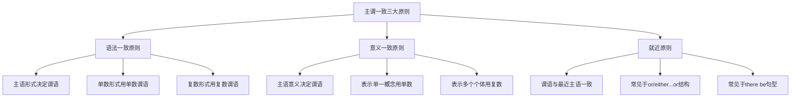
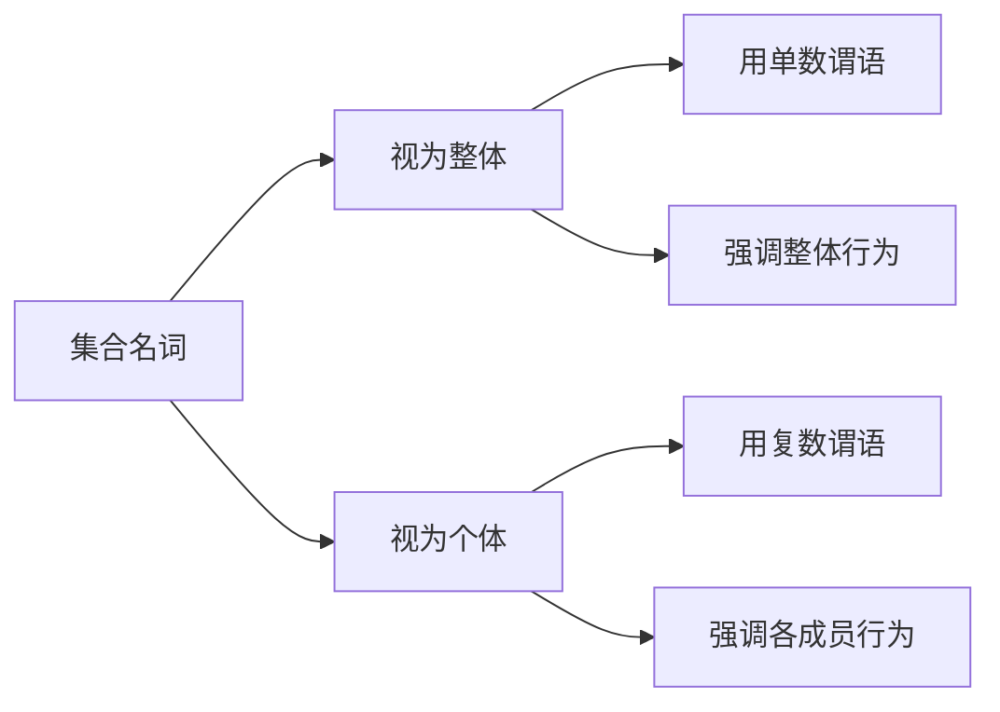
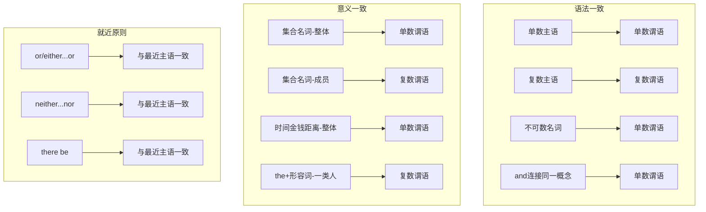

# 主谓一致详解

主谓一致（Subject-Verb Agreement）是英语语法中最基础却最容易出错的知识点之一。它要求句子中的谓语动词在人称和数上必须与主语保持一致。看似简单的规则，在实际运用中却存在大量特殊情况和易混淆点。

## 1. 主谓一致概述

### 1.1 什么是主谓一致

主谓一致是指谓语动词的形式必须与主语的人称和数保持一致。在英语中，这主要体现在第三人称单数形式上。

> [!info] 核心概念
>
> 主谓一致的本质是：**主语决定谓语的形式**。单数主语用单数谓语，复数主语用复数谓语。

**基本示例**：

| 主语类型 | 例句 | 谓语形式 |
| --- | --- | --- |
| 单数主语 | The boy **runs** fast. | 第三人称单数 |
| 复数主语 | The boys **run** fast. | 复数形式 |
| 第一人称 | I **am** a student. | 第一人称形式 |
| 第二人称 | You **are** a teacher. | 第二人称形式 |

### 1.2 主谓一致的三大原则

英语主谓一致遵循三大原则，它们在不同情况下发挥作用：



**三大原则说明**：

| 原则 | 英文名称 | 核心要点 | 适用场景 |
| --- | --- | --- | --- |
| 语法一致 | Grammatical Concord | 根据主语的语法形式决定谓语 | 大多数情况 |
| 意义一致 | Notional Concord | 根据主语的实际意义决定谓语 | 集合名词、表示整体概念 |
| 就近原则 | Proximity Principle | 谓语与最近的主语保持一致 | or、either...or、there be |

### 1.3 为什么主谓一致容易出错

主谓一致之所以成为语法难点，主要原因有以下几点：

> [!warning] 常见困惑来源
>
> 1. **主语与谓语之间插入修饰成分**，导致难以判断真正主语
> 2. **集合名词可单可复**，需要根据语境判断
> 3. **特殊主语形式**（如不定式、从句作主语）
> 4. **就近原则与语法一致原则的冲突**

**典型易错句**：

```
❌ The quality of the products are excellent.
✅ The quality of the products is excellent.
（主语是 quality，不是 products）

❌ Neither he nor I are responsible.
✅ Neither he nor I am responsible.
（就近原则：谓语与 I 一致）
```

---

## 2. 语法一致原则

语法一致原则是主谓一致的基本原则，即谓语动词的形式由主语的语法形式决定。

### 2.1 单数主语与复数主语

**单数主语**使用单数谓语，**复数主语**使用复数谓语：

| 主语类型 | 例句 | 分析 |
| --- | --- | --- |
| 单数名词 | The student **studies** hard. | student 为单数 |
| 复数名词 | The students **study** hard. | students 为复数 |
| 单数代词 | He **is** my friend. | he 为单数 |
| 复数代词 | They **are** my friends. | they 为复数 |

### 2.2 不可数名词作主语

不可数名词在语法上被视为单数，谓语使用单数形式：

> [!example] 不可数名词示例
>
> - Water **is** essential for life.
>   （水对生命至关重要。）
>
> - The information **was** very useful.
>   （这些信息非常有用。）
>
> - His advice **has** helped me a lot.
>   （他的建议对我帮助很大。）

**常见不可数名词**：

| 类别 | 不可数名词 |
| --- | --- |
| 物质名词 | water, air, bread, rice, meat, milk |
| 抽象名词 | information, advice, news, knowledge, progress |
| 学科名词 | physics, mathematics, economics, politics |
| 疾病名词 | measles, mumps, diabetes |

### 2.3 主语中有修饰成分

当主语后面跟有介词短语、同位语或其他修饰成分时，谓语仍与主语本身保持一致，而非与修饰成分一致：

**介词短语修饰主语**：

```
The teacher of the students is very strict.
主语：The teacher（单数）
修饰语：of the students
谓语：is（单数）

The students in the classroom are taking an exam.
主语：The students（复数）
修饰语：in the classroom
谓语：are（复数）
```

> [!warning] 易错点
>
> 不要被介词短语中的名词迷惑。判断主语时，应忽略介词短语。
>
> - ❌ The price of these books **are** too high.
> - ✅ The price of these books **is** too high.

**常见介词短语**：

| 介词短语 | 例句 | 谓语形式 |
| --- | --- | --- |
| of + 名词 | The color of the flowers **is** beautiful. | 单数 |
| with + 名词 | The man with two dogs **walks** every day. | 单数 |
| together with | Tom, together with his friends, **is** coming. | 单数 |
| as well as | She as well as her sisters **is** a nurse. | 单数 |
| along with | The teacher along with students **was** present. | 单数 |
| including | Everyone, including children, **was** excited. | 单数 |

### 2.4 由 and 连接的主语

两个或多个主语由 and 连接时，通常使用复数谓语：

```
Tom and Jerry are good friends.
（汤姆和杰瑞是好朋友。）

Reading and writing are important skills.
（阅读和写作是重要的技能。）
```

**例外情况**——当 and 连接的成分表示同一人、同一物或同一概念时，使用单数谓语：

> [!tip] 同一概念用单数
>
> **表示同一人**（只用一个冠词）：
> - The writer and teacher **is** giving a speech.
>   （这位作家兼教师正在演讲。）
>
> **表示同一事物**：
> - Bread and butter **is** my favorite breakfast.
>   （黄油面包是我最喜欢的早餐。）
>
> **表示同一概念**：
> - Law and order **is** necessary for society.
>   （法律与秩序对社会是必要的。）

**常见表示同一概念的搭配**：

| 搭配 | 含义 | 谓语 |
| --- | --- | --- |
| bread and butter | 黄油面包/生计 | 单数 |
| fish and chips | 炸鱼薯条 | 单数 |
| a knife and fork | 一副刀叉 | 单数 |
| the singer and dancer | 歌手兼舞者（同一人） | 单数 |
| war and peace | 战争与和平 | 单数 |

### 2.5 each, every, no 修饰的主语

由 each, every, no 修饰的名词作主语，即使有 and 连接多个名词，谓语仍用单数：

```
Each boy and each girl has a book.
（每个男孩和每个女孩都有一本书。）

Every man and every woman is invited.
（每位男士和每位女士都受到邀请。）

No teacher and no student was absent.
（没有老师和学生缺席。）
```

> [!info] 记忆要点
>
> each、every、no 强调个体，因此整体被视为单数概念。

---

## 3. 意义一致原则

意义一致原则是指谓语的单复数形式由主语所表达的实际意义决定，而非语法形式。

### 3.1 集合名词的主谓一致

集合名词（Collective Nouns）是意义一致原则的典型应用场景。

**集合名词的双重性**：



**常见集合名词**：

| 集合名词 | 整体用法（单数） | 个体用法（复数） |
| --- | --- | --- |
| family | My family **is** large. | My family **are** all teachers. |
| class | The class **is** quiet. | The class **are** taking notes. |
| team | The team **is** winning. | The team **are** wearing new uniforms. |
| committee | The committee **has** decided. | The committee **have** different opinions. |
| audience | The audience **is** large. | The audience **were** clapping. |
| government | The government **is** responsible. | The government **are** divided on this issue. |

> [!example] 集合名词用法对比
>
> **强调整体**：
> - The family **is** moving to a new city.
>   （这个家庭正在搬到一个新城市。）
>
> **强调成员**：
> - The family **are** arguing about where to go.
>   （家庭成员们正在争论去哪里。）

### 3.2 只作单数或复数的集合名词

**只作单数的集合名词**：

| 名词 | 例句 | 含义 |
| --- | --- | --- |
| furniture | The furniture **is** expensive. | 家具 |
| equipment | The equipment **is** ready. | 设备 |
| machinery | The machinery **needs** repair. | 机器 |
| luggage/baggage | My luggage **is** heavy. | 行李 |
| clothing | This clothing **is** fashionable. | 服装 |

**只作复数的集合名词**：

| 名词 | 例句 | 含义 |
| --- | --- | --- |
| police | The police **are** investigating. | 警察 |
| people | People **are** waiting outside. | 人们 |
| cattle | The cattle **are** grazing. | 牛群 |
| poultry | The poultry **are** fed twice a day. | 家禽 |
| clergy | The clergy **were** present. | 神职人员 |

> [!warning] 注意 people 的特殊用法
>
> - **people 表示"人们"时**：复数概念，用复数谓语
>   - People **are** friendly here.
>
> - **people 表示"民族"时**：可数名词，可有单复数
>   - The Chinese **are** a hardworking people.
>   - There are 56 peoples in China.

### 3.3 表示时间、金钱、距离、重量的主语

当表示时间、金钱、距离、重量等的复数名词表示一个整体概念时，谓语用单数：

| 类型 | 例句 | 分析 |
| --- | --- | --- |
| 时间 | Three years **is** a long time. | 三年被视为一个整体时间段 |
| 金钱 | Ten dollars **is** enough. | 十美元被视为一笔钱 |
| 距离 | Five miles **is** too far to walk. | 五英里被视为一段距离 |
| 重量 | Two kilos **is** what I need. | 两公斤被视为一个重量 |

> [!tip] 判断技巧
>
> 如果能用 "it" 替代这些复数形式，则用单数谓语：
> - Ten dollars is enough. (It is enough.)
> - Three hours is too long. (It is too long.)

**对比用法**：

```
表示整体：
Twenty years is a long time to wait.
（等待二十年是很长的时间。——强调时间段）

表示个体：
Twenty years have passed since we met.
（自从我们相遇已经过去了二十年。——强调年份）
```

### 3.4 数学运算表达式

数学运算表达式作主语时，谓语通常用单数：

```
Two plus two is/equals four.
（二加二等于四。）

Five times three is fifteen.
（五乘三等于十五。）

Ten divided by two is five.
（十除以二等于五。）

Ten minus three is seven.
（十减三等于七。）
```

> [!info] 备注
>
> 虽然单数谓语更常见，但在口语中复数谓语也可接受：
> - Two and two **are** four. (口语)

### 3.5 分数、百分数作主语

分数和百分数作主语时，谓语的单复数由 of 后面的名词决定：

**基本规则**：

| 结构 | of 后名词 | 谓语 | 例句 |
| --- | --- | --- | --- |
| 分数/百分数 + of + 不可数名词 | 不可数 | 单数 | Half of the water **is** gone. |
| 分数/百分数 + of + 可数名词复数 | 复数 | 复数 | Half of the students **are** absent. |
| 分数/百分数 + of + 可数名词单数 | 单数 | 单数 | Half of the apple **is** eaten. |

**详细示例**：

```
Three-fourths of the work is finished.
（四分之三的工作已经完成。——work 为不可数名词）

Three-fourths of the students are present.
（四分之三的学生出席了。——students 为复数）

Fifty percent of the population is under 30.
（百分之五十的人口在30岁以下。——population 作整体）

Fifty percent of the people are against the plan.
（百分之五十的人反对这个计划。——people 为复数）
```

### 3.6 the + 形容词 作主语

"the + 形容词" 表示一类人时，谓语用复数；表示抽象概念时，谓语用单数：

**表示一类人（复数）**：

| 结构 | 含义 | 例句 |
| --- | --- | --- |
| the poor | 穷人们 | The poor **are** in need of help. |
| the rich | 富人们 | The rich **have** many opportunities. |
| the young | 年轻人们 | The young **are** full of energy. |
| the old | 老年人们 | The old **need** more care. |
| the blind | 盲人们 | The blind **are** assisted by guide dogs. |
| the unemployed | 失业者们 | The unemployed **are** seeking jobs. |

**表示抽象概念（单数）**：

| 结构 | 含义 | 例句 |
| --- | --- | --- |
| the unknown | 未知事物 | The unknown **is** always frightening. |
| the beautiful | 美丽（抽象） | The beautiful **is** not always good. |
| the impossible | 不可能的事 | The impossible **was** made possible. |

---

## 4. 就近原则

就近原则是指谓语动词的单复数形式由靠近它的主语决定。

### 4.1 or, either...or, neither...nor

由 or, either...or, neither...nor 连接的并列主语，谓语与最近的主语保持一致：


**示例**：

| 结构 | 例句 | 分析 |
| --- | --- | --- |
| or | Tom or his brothers **are** going. | 谓语与 brothers 一致 |
| or | His brothers or Tom **is** going. | 谓语与 Tom 一致 |
| either...or | Either you or he **is** wrong. | 谓语与 he 一致 |
| either...or | Either he or you **are** wrong. | 谓语与 you 一致 |
| neither...nor | Neither she nor I **am** to blame. | 谓语与 I 一致 |
| neither...nor | Neither I nor she **is** to blame. | 谓语与 she 一致 |

> [!tip] 写作建议
>
> 当 I 作为并列主语之一时，习惯上将 I 放在最后，使句子更自然：
> - Neither he nor I am responsible.（更自然）
> - Neither I nor he is responsible.（语法正确但较少用）

### 4.2 not only...but also

not only...but also 连接的主语遵循就近原则：

```
Not only the students but also the teacher was surprised.
（不仅学生们，老师也很惊讶。——谓语与 teacher 一致）

Not only the teacher but also the students were surprised.
（不仅老师，学生们也很惊讶。——谓语与 students 一致）
```

### 4.3 there be 句型

there be 句型中的谓语动词与后面最近的主语保持一致：

**基本规则**：

```
There is a book on the desk.
（桌上有一本书。——book 为单数）

There are three books on the desk.
（桌上有三本书。——books 为复数）

There is a book and two pens on the desk.
（桌上有一本书和两支笔。——谓语与最近的 a book 一致）

There are two pens and a book on the desk.
（桌上有两支笔和一本书。——谓语与最近的 two pens 一致）
```

> [!warning] 注意口语与书面语的差异
>
> 在非正式口语中，there's 有时用于复数名词前：
> - There's lots of people here. (口语，非标准)
> - There are lots of people here. (标准书面语)

### 4.4 here, there 引导的倒装句

当 here, there 置于句首引起倒装时，谓语与后面的真正主语一致：

```
Here comes the bus.
（公共汽车来了。——bus 为单数）

Here come the students.
（学生们来了。——students 为复数）

There goes the last train.
（最后一班火车开走了。——train 为单数）

There go our chances.
（我们的机会没了。——chances 为复数）
```

---

## 5. 特殊主语的主谓一致

### 5.1 不定式、动名词作主语

不定式和动名词作主语时，谓语用单数：

**不定式作主语**：

```
To learn English well is not easy.
（学好英语不容易。）

To see is to believe.
（眼见为实。）

To finish the work in time requires great effort.
（按时完成工作需要付出巨大努力。）
```

**动名词作主语**：

```
Swimming is good exercise.
（游泳是很好的运动。）

Reading books broadens your horizons.
（读书开阔视野。）

Smoking is harmful to health.
（吸烟有害健康。）
```

> [!info] 多个不定式或动名词并列
>
> 如果表示同一概念，用单数；表示不同概念，用复数：
>
> - **同一概念**：
>   - Getting up early and taking a walk **is** his daily routine.
>
> - **不同概念**：
>   - Reading and writing **are** different skills.

### 5.2 主语从句作主语

主语从句作主语时，谓语通常用单数：

```
What he said is true.
（他所说的是真的。）

That she will come is certain.
（她会来是确定的。）

Whether he will join us remains unknown.
（他是否会加入我们仍然未知。）

How the accident happened is still a mystery.
（事故是如何发生的仍然是个谜。）
```

**特殊情况——what 从句**：

当 what 从句表示复数概念时，谓语可用复数：

```
What I need is a computer.
（我需要的是一台电脑。——单数概念）

What I need are some new books.
（我需要的是一些新书。——复数概念）
```

### 5.3 由 who, which, that 引导的定语从句

定语从句中的谓语与先行词保持一致：

**基本规则**：

```
The man who is standing there is my father.
（站在那里的那个人是我父亲。——先行词 man 为单数）

The men who are standing there are my colleagues.
（站在那里的那些人是我的同事。——先行词 men 为复数）

The book which was lost has been found.
（丢失的那本书已经找到了。——先行词 book 为单数）

The books which were lost have been found.
（丢失的那些书已经找到了。——先行词 books 为复数）
```

**one of + 复数名词 + 定语从句**：

```
He is one of the students who are from China.
（他是来自中国的学生之一。——先行词是 students）

He is the only one of the students who is from China.
（他是唯一一个来自中国的学生。——先行词是 the only one）
```

> [!warning] 易错点辨析
>
> - **one of + 复数名词 + who/that**：谓语用**复数**
>   - This is one of the books that **are** worth reading.
>
> - **the only one of + 复数名词 + who/that**：谓语用**单数**
>   - This is the only one of the books that **is** worth reading.

### 5.4 many a, more than one

many a 和 more than one 后接单数名词，谓语用单数（尽管意义上表示复数）：

```
Many a student has passed the exam.
（许多学生通过了考试。）
= Many students have passed the exam.

More than one person was injured.
（不止一人受伤了。）

More than one answer is correct.
（不止一个答案是正确的。）
```

> [!tip] 对比记忆
>
> | 结构 | 谓语形式 | 例句 |
> | --- | --- | --- |
> | many a + 单数名词 | 单数 | Many a man **has** tried. |
> | more than one + 单数名词 | 单数 | More than one student **is** absent. |
> | more + 复数名词 + than one | 复数 | More students than one **are** absent. |

### 5.5 a number of 与 the number of

这两个短语的主谓一致规则完全不同：

| 短语 | 含义 | 谓语 | 例句 |
| --- | --- | --- | --- |
| a number of | 许多、大量 | 复数 | A number of students **are** absent. |
| the number of | ...的数量 | 单数 | The number of students **is** 50. |

**详细对比**：

```
A number of problems have arisen.
（出现了许多问题。——强调"许多问题"）

The number of problems is increasing.
（问题的数量在增加。——强调"数量"）

A large number of people were present.
（许多人出席了。）

The number of people present was about 100.
（出席的人数约为100人。）
```

### 5.6 复合不定代词作主语

由 -body, -one, -thing 构成的复合不定代词作主语时，谓语用单数：

| 类型 | 代词 | 例句 |
| --- | --- | --- |
| -body | everybody, somebody, nobody, anybody | Everybody **is** here. |
| -one | everyone, someone, no one, anyone | Someone **has** taken my book. |
| -thing | everything, something, nothing, anything | Nothing **is** impossible. |

```
Everyone is responsible for their own actions.
（每个人都要为自己的行为负责。）

Something is wrong with the machine.
（机器出了问题。）

Nothing was said about the incident.
（关于这个事件什么也没说。）

Is anybody home?
（有人在家吗？）
```

### 5.7 each, either, neither 作主语

each, either, neither 作主语或修饰主语时，谓语用单数：

```
Each of the students has a dictionary.
（每个学生都有一本字典。）

Either of the answers is correct.
（两个答案中的任何一个都是正确的。）

Neither of them was invited.
（他们两个都没有被邀请。）
```

**作为限定词修饰名词**：

```
Each student has a book.
（每个学生都有一本书。）

Either road leads to the station.
（两条路都通向车站。）

Neither answer is correct.
（两个答案都不正确。）
```

### 5.8 both, few, many, several 作主语

both, few, many, several 作主语时，谓语用复数：

```
Both of them are my friends.
（他们两个都是我的朋友。）

Few students have finished the homework.
（很少有学生完成了作业。）

Many people are waiting outside.
（很多人在外面等着。）

Several books are missing.
（有几本书不见了。）
```

---

## 6. 倒装句中的主谓一致

### 6.1 完全倒装中的主谓一致

完全倒装句中，谓语仍与主语保持一致，只是语序改变：

**地点状语置于句首**：

```
In the room sits an old man.
（房间里坐着一位老人。——主语 an old man 为单数）

In the room sit several students.
（房间里坐着几个学生。——主语 several students 为复数）

On the wall hangs a picture.
（墙上挂着一幅画。）

On the wall hang several pictures.
（墙上挂着几幅画。）
```

**表语置于句首**：

```
Present at the meeting was the chairman.
（主席出席了会议。——主语 the chairman 为单数）

Present at the meeting were all the members.
（所有成员都出席了会议。——主语 all the members 为复数）

Gone are the days when we were young.
（我们年轻的日子一去不复返了。——主语 the days 为复数）
```

### 6.2 部分倒装中的主谓一致

部分倒装句中，助动词或情态动词提前，但主谓一致规则不变：

```
Seldom does he come late.
（他很少迟到。——主语 he 为单数）

Never have I seen such a thing.
（我从未见过这样的事。——主语 I 为第一人称）

Only then did they realize the truth.
（直到那时他们才意识到真相。——主语 they 为复数）

Not only does she sing well, but she also dances beautifully.
（她不仅唱得好，而且跳舞也很美。——主语 she 为单数）
```

### 6.3 there be 结构的倒装

there be 结构本身就是一种存在句倒装，谓语与后面的真正主语一致：

```
There is a book on the table.
（桌上有一本书。）

There are many books on the shelf.
（书架上有很多书。）

There seems to be a problem.
（似乎有一个问题。）

There seem to be many problems.
（似乎有很多问题。）

There exists a possibility of success.
（存在成功的可能性。）

There exist many possibilities.
（存在很多可能性。）
```

---

## 7. 易错点与辨析

### 7.1 复数形式单数意义的名词

某些名词虽然形式上是复数，但表示单数概念，谓语用单数：

| 名词 | 类型 | 例句 |
| --- | --- | --- |
| news | 消息 | The news **is** exciting. |
| physics | 学科 | Physics **is** my favorite subject. |
| mathematics | 学科 | Mathematics **is** difficult. |
| economics | 学科 | Economics **is** important. |
| politics | 学科/活动 | Politics **is** a complex subject. |
| the United States | 国名 | The United States **is** a developed country. |
| the United Nations | 组织 | The United Nations **was** founded in 1945. |

> [!warning] 注意 politics 的双重用法
>
> - 作为学科：Politics **is** interesting.（政治学很有趣。）
> - 表示政治活动：His politics **are** rather conservative.（他的政治观点相当保守。）

### 7.2 单数形式复数意义的名词

某些名词形式上是单数，但表示复数概念，谓语用复数：

| 名词 | 含义 | 例句 |
| --- | --- | --- |
| people | 人们 | People **are** friendly. |
| police | 警察（集体） | The police **are** investigating. |
| cattle | 牛群 | The cattle **are** grazing. |
| clergy | 神职人员 | The clergy **were** present. |
| militia | 民兵 | The militia **are** ready. |

### 7.3 成对名词作主语

某些由两部分组成的物品名词，本身是复数形式，谓语用复数；但加上 "a pair of" 后，谓语用单数：

| 名词 | 单独使用 | 加 a pair of |
| --- | --- | --- |
| glasses（眼镜） | My glasses **are** broken. | A pair of glasses **is** on the table. |
| trousers（裤子） | These trousers **are** too long. | A pair of trousers **is** needed. |
| scissors（剪刀） | The scissors **are** sharp. | A pair of scissors **is** on the desk. |
| shoes（鞋子） | The shoes **are** new. | A pair of shoes **was** bought. |
| chopsticks（筷子） | Chopsticks **are** used. | A pair of chopsticks **is** provided. |

### 7.4 all, some, none, most 作主语

这些词作主语时，谓语的单复数取决于它们所指代的内容：

**指代不可数名词时用单数**：

```
All of the water is gone.
（所有的水都没了。）

Some of the information is incorrect.
（有些信息是不正确的。）

None of the advice was helpful.
（没有一条建议是有帮助的。）

Most of the work is finished.
（大部分工作已经完成。）
```

**指代可数名词复数时用复数**：

```
All of the students are present.
（所有学生都出席了。）

Some of the books are missing.
（有些书不见了。）

None of the students were absent.
（没有学生缺席。）

Most of the employees have agreed.
（大多数员工已经同意了。）
```

> [!tip] none 的特殊用法
>
> none 指代可数名词时，单复数谓语都可接受：
> - None of them **is** here.（较正式）
> - None of them **are** here.（较常用）

### 7.5 主语后有插入语

当主语后有 I think, I believe, I suppose, in my opinion 等插入语时，谓语仍与主语保持一致：

```
The plan, I think, is practical.
（我认为这个计划是可行的。——谓语与 plan 一致）

His suggestions, I believe, are valuable.
（我相信他的建议是有价值的。——谓语与 suggestions 一致）

The students, in my opinion, are hardworking.
（在我看来，这些学生很努力。——谓语与 students 一致）
```

---

## 8. 主谓一致综合练习

### 8.1 选择正确的谓语形式

> [!example] 练习题
>
> 选择正确答案填空：
>
> 1. The news about the accident _____ shocking.
>    A. is  B. are
>
> 2. Neither the teacher nor the students _____ happy with the result.
>    A. is  B. are
>
> 3. Every man and every woman _____ the right to vote.
>    A. has  B. have
>
> 4. The number of students in our class _____ 45.
>    A. is  B. are
>
> 5. What he said _____ true.
>    A. is  B. are
>
> 6. Physics _____ my favorite subject.
>    A. is  B. are
>
> 7. The police _____ looking for the criminal.
>    A. is  B. are
>
> 8. Three years _____ a long time to wait.
>    A. is  B. are
>
> 9. The rich _____ not always happy.
>    A. is  B. are
>
> 10. Many a student _____ made this mistake.
>     A. has  B. have

**参考答案**：

| 题号 | 答案 | 解析 |
| --- | --- | --- |
| 1 | A | news 是不可数名词，用单数 |
| 2 | B | neither...nor 就近原则，与 students 一致 |
| 3 | A | every 修饰的并列主语用单数 |
| 4 | A | the number of 表示"数量"，用单数 |
| 5 | A | 主语从句作主语，用单数 |
| 6 | A | physics 学科名称，形式复数意义单数 |
| 7 | B | police 集合名词，表示复数概念 |
| 8 | A | 时间作为整体概念，用单数 |
| 9 | B | the + 形容词表示一类人，用复数 |
| 10 | A | many a + 单数名词，用单数谓语 |

### 8.2 改错练习

> [!example] 找出并改正错误
>
> 1. The quality of the products are excellent.
> 2. Each of the boys have a bike.
> 3. Two-thirds of the work have been done.
> 4. The committee have reached a decision.
> 5. There is a pen and two books on the desk.
> 6. Not only his parents but also he are coming.
> 7. The United States are a powerful country.
> 8. One of the books that was lost has been found.
> 9. Mathematics are not easy to learn.
> 10. A number of students was absent yesterday.

**参考答案**：

| 题号 | 错误 | 正确形式 | 解析 |
| --- | --- | --- | --- |
| 1 | are → is | The quality... is excellent. | 主语是 quality |
| 2 | have → has | Each... has a bike. | each 用单数 |
| 3 | have → has | ...work has been done. | work 不可数 |
| 4 | 正确或 have → has | has reached（强调整体） | 集合名词可单可复 |
| 5 | 正确 | There is a pen... | 就近原则，与 a pen 一致 |
| 6 | are → is | ...he is coming. | 就近原则，与 he 一致 |
| 7 | are → is | ...is a powerful country. | 国名用单数 |
| 8 | was → were | books that were lost | 先行词是 books |
| 9 | are → is | Mathematics is not easy. | 学科名用单数 |
| 10 | was → were | A number of students were... | a number of 用复数 |

---

## 9. 主谓一致规则速查表



### 9.1 常见结构速查表

| 主语结构 | 谓语形式 | 示例 |
| --- | --- | --- |
| 单数名词 | 单数 | The boy is here. |
| 复数名词 | 复数 | The boys are here. |
| 不可数名词 | 单数 | Water is essential. |
| and 连接（不同概念） | 复数 | Tom and Jerry are friends. |
| and 连接（同一概念） | 单数 | Bread and butter is tasty. |
| or / either...or / neither...nor | 就近 | Neither he nor I am wrong. |
| not only...but also | 就近 | Not only he but also they are coming. |
| there be | 就近 | There is a book and two pens. |
| each / every / no + and | 单数 | Each boy and girl has a book. |
| 集合名词（整体） | 单数 | The family is large. |
| 集合名词（成员） | 复数 | The family are arguing. |
| 时间/金钱/距离（整体） | 单数 | Three years is a long time. |
| 分数/百分数 + of | 与of后名词一致 | Half of the water is gone. |
| the + 形容词（一类人） | 复数 | The poor are in need. |
| a number of | 复数 | A number of students are absent. |
| the number of | 单数 | The number of students is 50. |
| 不定式/动名词作主语 | 单数 | Swimming is good exercise. |
| 主语从句 | 单数 | What he said is true. |
| one of + 复数名词 + 从句 | 复数 | one of the books that are... |
| the only one of + 复数名词 + 从句 | 单数 | the only one of the books that is... |
| many a / more than one | 单数 | Many a student has passed. |
| 学科名称 | 单数 | Physics is interesting. |
| 国家/组织名称 | 单数 | The United States is... |
| police / people / cattle | 复数 | The police are coming. |
| 成对物品（无 pair of） | 复数 | The scissors are sharp. |
| a pair of + 成对物品 | 单数 | A pair of scissors is here. |

---

## 10. 本章小结

主谓一致是英语语法中的基础但重要的知识点。本章系统讲解了主谓一致的三大原则及其应用：

> [!success] 核心要点回顾
>
> **1. 三大原则**
> - 语法一致：根据主语的语法形式决定谓语
> - 意义一致：根据主语的实际意义决定谓语
> - 就近原则：谓语与最近的主语保持一致
>
> **2. 语法一致的重点**
> - 介词短语等修饰成分不影响主语
> - and 连接的同一概念用单数
> - each, every, no 修饰的并列主语用单数
>
> **3. 意义一致的重点**
> - 集合名词根据语境判断单复数
> - 时间、金钱、距离表示整体用单数
> - the + 形容词表示一类人用复数
>
> **4. 就近原则的重点**
> - or, either...or, neither...nor
> - not only...but also
> - there be 句型
>
> **5. 特殊主语的处理**
> - 不定式、动名词作主语用单数
> - 主语从句作主语通常用单数
> - 定语从句谓语与先行词一致

掌握主谓一致规则需要理解规则背后的逻辑，并通过大量练习加以巩固。在实际运用中，要特别注意识别真正的主语，避免被修饰成分干扰判断。
