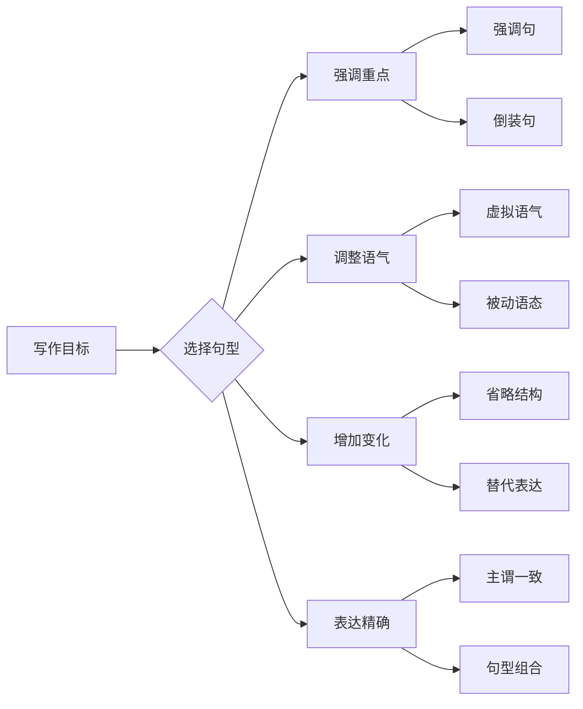
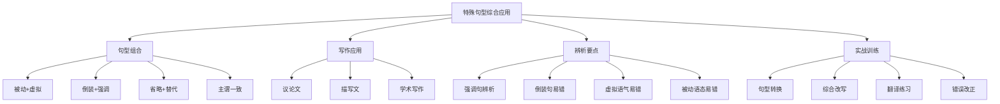

# 特殊句型综合应用

特殊句型是英语表达的精华所在。在实际语言运用中，这些句型很少孤立出现，往往相互交织、组合使用，形成丰富多变的表达效果。本章将系统梳理各类特殊句型的综合运用规律，帮助学习者在写作和翻译中灵活运用这些句型，提升语言表达的准确性和地道性。

## 1. 特殊句型组合运用

### 1.1 被动语态与虚拟语气的结合

被动语态和虚拟语气的组合是英语中较为复杂但十分常见的表达方式，常用于表达"本应被做但未做"或"假设被做"的情况。

#### 1.1.1 基本组合形式

| 时态 | 主动虚拟 | 被动虚拟 | 含义 |
| --- | --- | --- | --- |
| 现在 | should do | should be done | 建议/要求被做 |
| 过去 | had done | had been done | 本应已被做 |
| 将来 | would do | would be done | 假设会被做 |

> [!info] 核心理解
>
> 被动虚拟语气的核心在于：动作的承受者作主语，同时表达与事实相反或假设的情况。理解这一点，就能准确构建各种被动虚拟句式。

**与现在事实相反的被动虚拟**：

```
If the project were funded properly, better results would be achieved.
如果项目获得适当资助，就会取得更好的成果。
（事实是：项目没有获得适当资助）

句法分析：
- 条件句：If the project were funded properly（被动虚拟过去式）
- 主句：better results would be achieved（would + 被动不定式）
- were funded：be动词用were（虚拟）+ 过去分词（被动）
```

**与过去事实相反的被动虚拟**：

```
If the warning had been heeded, the accident could have been prevented.
如果当初听从了警告，事故本可以避免。
（事实是：警告没有被听从，事故发生了）

句法分析：
- 条件句：If the warning had been heeded（had been + 过去分词）
- 主句：the accident could have been prevented（could have been + 过去分词）
- 双重被动标记：had been / could have been
```

#### 1.1.2 suggest/recommend 等动词的被动虚拟

这类动词后的宾语从句使用虚拟语气，当从句主语是动作承受者时，需用被动虚拟。

```
The committee suggested that the proposal (should) be reconsidered.
委员会建议重新考虑该提案。

It was recommended that all employees (should) be given training.
建议给所有员工提供培训。

The doctor insisted that the patient (should) be hospitalized immediately.
医生坚持要求病人立即住院。
```

> [!warning] 易错点
>
> 在美式英语中，should 常省略，直接用动词原形；被动形式为 "be + 过去分词"，不能写成 "is done" 或 "was done"。
>
> - ✅ It is required that the report be submitted.
> - ❌ It is required that the report is submitted.

#### 1.1.3 wish/if only 的被动虚拟

```
I wish the problem had been solved earlier.
我希望这个问题早点被解决。（对过去的遗憾）

If only more attention were paid to environmental protection!
要是能更多关注环境保护就好了！（对现在的愿望）

She wished she had been told the truth.
她希望当时有人告诉她真相。
```

### 1.2 倒装句与强调句的综合运用

倒装句和强调句都是用于突出信息的手段，有时可以组合使用，产生更强的强调效果。

#### 1.2.1 倒装结构中的强调

```
Not only was he promoted, but he was also given a substantial raise.
他不仅被提升了，而且还获得了大幅加薪。

句法分析：
- Not only 位于句首引发倒装：was he promoted
- 后半句保持正常语序：he was also given
- 整句强调"提升"和"加薪"两个好消息
```

```
Never before has such importance been attached to this issue.
这个问题从未被如此重视过。

句法分析：
- Never before 引发完全倒装
- has been attached：现在完成时被动语态
- 三重强调：否定副词 + 倒装 + 被动
```

#### 1.2.2 强调句中的倒装成分

```
It was not until he was criticized that did he realize his mistake.  ❌
It was not until he was criticized that he realized his mistake.    ✅
直到他受到批评，他才意识到自己的错误。

注意：强调句的 that 从句不需要倒装，这是常见错误。
```

**正确的组合方式**：

```
It is only by working hard that can we succeed.  ❌
It is only by working hard that we can succeed.  ✅
只有通过努力工作我们才能成功。

Only by working hard can we succeed.  ✅（倒装句，非强调句）
```

> [!tip] 区分要点
>
> 强调句 "It is/was ... that ..." 的 that 从句始终用正常语序，不能倒装。如果想用倒装来强调，应使用独立的倒装结构，而非强调句型。

#### 1.2.3 双重强调的高级表达

```
原句：We rarely see such dedication.
我们很少见到这样的奉献精神。

倒装强调：Rarely do we see such dedication.
强调句型：It is such dedication that we rarely see.
双重处理：It is rarely that we see such dedication.（较少用）

最佳选择：根据语境选择最自然的表达方式
```

### 1.3 省略与替代的实际应用

省略和替代是避免重复、使语言简洁的重要手段，在口语和书面语中都极为常见。

#### 1.3.1 并列结构中的省略

```
完整句：Some students like English and some students like math.
省略后：Some students like English and some math.
         Some like English and some math.
         Some like English, some math.

分析：通过省略重复的 students、students like，句子更加简洁
```

**复杂并列结构的省略**：

```
He can speak French and German, and she can speak Spanish and Italian.
→ He can speak French and German, and she Spanish and Italian.

The manager approved the plan, but the director rejected the plan.
→ The manager approved the plan, but the director rejected it.
→ The manager approved the plan, but the director didn't.
```

#### 1.3.2 从句中的省略

```
状语从句省略（主语相同时）：
While (he was) working on the project, he discovered a major flaw.
在做项目时，他发现了一个重大缺陷。

Though (she was) exhausted, she continued working.
虽然筋疲力尽，她仍继续工作。

定语从句省略（省略关系代词和be动词）：
The book (which was) published last year became a bestseller.
去年出版的那本书成了畅销书。
```

#### 1.3.3 替代词的使用

| 替代词 | 替代对象 | 例句 |
| --- | --- | --- |
| one/ones | 可数名词单/复数 | I need a pen. Do you have one? |
| that/those | 特指名词 | The climate here is milder than that of the north. |
| do/does/did | 动词短语 | She works harder than he does. |
| so | 肯定句内容 | —Will it rain? —I think so. |
| not | 否定句内容 | —Is he coming? —I hope not. |

```
A: Did you finish the report?
B: Yes, I did. (did = finished the report)

A: Can you help me?
B: I'd like to, but I can't. (to = to help you)

The population of China is larger than that of Japan.
中国的人口比日本的（人口）多。
（that 替代 the population，避免重复）
```

### 1.4 主谓一致的复杂情况

在综合运用特殊句型时，主谓一致往往变得更加复杂，需要特别注意。

#### 1.4.1 倒装句中的主谓一致

```
Here comes the bus. （单数主语 the bus）
Here come the students. （复数主语 the students）

There is a book on the desk. （单数）
There are many books on the desk. （复数）

Not only the teacher but also the students were present.
不仅老师而且学生们都出席了。
（就近原则：were 与 students 一致）
```

#### 1.4.2 强调句中的主谓一致

```
It is I who am responsible for this project.
是我负责这个项目。
（who 从句的动词与被强调的 I 一致）

It is the students who are to blame.
是学生们应该受责备。
（who 从句的动词与被强调的 students 一致）

但在口语中，常简化为：
It's me who is responsible. （非正式）
```

#### 1.4.3 there be 结构的复杂一致

```
There is a pen and two books on the desk.
（就近原则：is 与最近的 a pen 一致）

There are two books and a pen on the desk.
（就近原则：are 与最近的 two books 一致）

There seems to be some misunderstanding.
似乎有一些误解。
（seems 与单数概念一致）
```

## 2. 特殊句型在写作中的应用



### 2.1 议论文写作中的特殊句型

议论文需要逻辑清晰、论证有力，特殊句型能有效增强说服力。

#### 2.1.1 开篇立论

```
普通表达：
Education is very important in modern society.
教育在现代社会非常重要。

强调句型：
It is education that plays a crucial role in modern society.
正是教育在现代社会中起着至关重要的作用。

倒装强调：
Nowhere is the importance of education more evident than in modern society.
教育的重要性在现代社会表现得最为明显。
```

#### 2.1.2 论证过程

```
让步转折（虚拟语气）：
Even if more resources were allocated to this project, the outcome might not
improve significantly.
即使为这个项目分配更多资源，结果也可能不会有显著改善。

假设论证：
Had the government taken action earlier, the crisis could have been averted.
如果政府早点采取行动，危机本可以避免。

强调对比：
It is not the quantity but the quality that matters.
重要的不是数量而是质量。
```

#### 2.1.3 总结收尾

```
Only through collective efforts can we address this challenge.
只有通过共同努力，我们才能应对这一挑战。

Not until we change our mindset will real progress be made.
直到我们改变思维方式，才会取得真正的进步。

It is high time that immediate action were taken.
是采取紧急行动的时候了。
```

### 2.2 描写文写作中的特殊句型

描写文追求生动形象，特殊句型能营造特定氛围和节奏。

#### 2.2.1 场景描写

```
普通描写：
The old castle stood on the hill. The wind was howling around it.

倒装增效：
On the hill stood the old castle. Around it howled the wind.
古堡矗立于山丘之上，四周狂风呼啸。

There 句型：
There stood an ancient oak tree in the center of the village.
村子中央矗立着一棵古老的橡树。
```

#### 2.2.2 人物描写

```
强调特征：
It was her kindness that impressed me most.
给我印象最深的是她的善良。

状态描写（省略结构）：
Though tired, she kept smiling.
虽然疲惫，她仍保持微笑。

倒装突出：
Seldom had I seen such determination in a young person.
我很少在年轻人身上见到这样的决心。
```

### 2.3 学术写作中的特殊句型

学术写作要求客观、严谨，被动语态和特定句型使用频繁。

#### 2.3.1 研究方法描述

```
被动语态（客观）：
The experiment was conducted under controlled conditions.
实验在受控条件下进行。

Data were collected from 500 participants.
数据收集自500名参与者。

It 形式主语：
It was found that the hypothesis was supported by the evidence.
研究发现假设得到了证据的支持。

It should be noted that these results are preliminary.
需要指出的是，这些结果是初步的。
```

#### 2.3.2 文献引用

```
According to Smith (2020), it is suggested that...
根据 Smith (2020) 的观点，建议...

As has been pointed out by previous researchers, ...
正如先前研究者所指出的，...

It has been widely acknowledged that...
人们普遍认为...
```

#### 2.3.3 结论表述

```
谨慎表达（虚拟）：
It would appear that the results support our hypothesis.
结果似乎支持我们的假设。

Further research would be needed to confirm these findings.
需要进一步研究来证实这些发现。

客观总结：
Based on the evidence presented, it can be concluded that...
基于所呈现的证据，可以得出结论...
```

### 2.4 句型变换提升文采

> [!example] 写作升级示例
>
> **原句**（简单表达）：
> Many people think that technology is important.
>
> **升级版本**：
>
> 1. **被动语态**：Technology is widely considered important by many people.
>
> 2. **强调句型**：It is technology that many people consider important.
>
> 3. **倒装句**：Important as technology is, it cannot solve all problems.
>
> 4. **虚拟语气**：Were it not for technology, modern life would be unimaginable.
>
> 5. **综合运用**：Not only is technology considered important, but it has also become indispensable in modern life.

## 3. 特殊句型辨析与易错点

### 3.1 强调句与其他句型的辨析

#### 3.1.1 强调句 vs. 主语从句

```
It is obvious that he is lying.
很明显他在撒谎。
→ 这是主语从句，it 是形式主语，that 从句是真正主语
→ 判断方法：去掉 It is ... that，句子不完整

It is he that is lying.
正是他在撒谎。
→ 这是强调句，强调主语 he
→ 判断方法：去掉 It is ... that，句子完整（He is lying.）
```

**辨析技巧**：

| 句型 | 去掉 It is/was ... that 后 | 例句 |
| --- | --- | --- |
| 强调句 | 句子完整 | It was Tom that broke the vase. → Tom broke the vase. ✓ |
| 主语从句 | 句子不完整 | It is true that he left. → True he left. ✗ |
| 定语从句 | 需要先行词 | It was the book that I bought. → 可能是强调句或定语从句 |

#### 3.1.2 强调句 vs. 定语从句

```
It was in the park that I met her.
正是在公园里我遇见了她。（强调句，强调地点状语）
→ 去掉 It was ... that：I met her in the park. ✓

It was the park that I visited yesterday.
那是我昨天参观的公园。（定语从句，that 引导定语从句修饰 park）
→ 去掉 It was ... that：The park I visited yesterday. ✗（不是完整句子）
```

### 3.2 倒装句易错点

#### 3.2.1 部分倒装 vs. 完全倒装

```
部分倒装（助动词/情态动词提前）：
Never have I seen such a beautiful sunset.
我从未见过如此美丽的日落。
→ have（助动词）提前，主语 I 和主要动词 seen 顺序不变

完全倒装（整个谓语提前）：
Here comes the train.
火车来了。
→ comes（谓语动词）提前，主语 the train 在后
```

> [!warning] 常见错误
>
> **错误**：Here comes he.
> **正确**：Here he comes.
>
> **规则**：完全倒装时，如果主语是代词，不能倒装。
>
> - Here comes the bus. ✓（名词主语，倒装）
> - Here it comes. ✓（代词主语，不倒装）
> - Here comes it. ✗

#### 3.2.2 only 引导的倒装

```
Only then did I realize my mistake.
只有那时我才意识到自己的错误。
→ only + 状语在句首，主句倒装

Only he can solve this problem.
只有他能解决这个问题。
→ only + 主语在句首，不倒装！

Only after the meeting did I understand the situation.
只有在会议之后我才了解情况。
→ only + 状语从句在句首，主句倒装
```

### 3.3 虚拟语气易错点

#### 3.3.1 时态搭配错误

```
错误：If I was you, I would accept the offer.
正确：If I were you, I would accept the offer.
如果我是你，我会接受这个提议。
（虚拟条件句中，be 动词一律用 were）

错误：If he would have studied harder, he would have passed.
正确：If he had studied harder, he would have passed.
如果他学习更努力，他就会通过了。
（条件句不能用 would have）
```

#### 3.3.2 wish 后的时态

| 表达内容 | wish 后的时态 | 例句 |
| --- | --- | --- |
| 对现在的愿望 | 过去时 | I wish I knew the answer. |
| 对过去的遗憾 | 过去完成时 | I wish I had studied harder. |
| 对将来的愿望 | would/could + 动词原形 | I wish he would come tomorrow. |

```
错误：I wish I can fly.
正确：I wish I could fly.
我希望我能飞。

错误：I wish I didn't say that yesterday.
正确：I wish I hadn't said that yesterday.
我希望我昨天没说那些话。
```

#### 3.3.3 It's time 后的虚拟

```
It's time (that) we left. / It's time (that) we should leave.
是我们离开的时候了。
（that 从句用过去时或 should + 动词原形）

It's high time (that) action were taken.
是采取行动的时候了。
（high time 强调紧迫性，常用过去时虚拟）

错误：It's time that we leave.
正确：It's time that we left. / It's time for us to leave.
```

### 3.4 被动语态易错点

#### 3.4.1 不能用被动的情况

```
不及物动词没有被动语态：
错误：The accident was happened yesterday.
正确：The accident happened yesterday.
事故昨天发生了。

系动词没有被动语态：
错误：The flower is smelled good.
正确：The flower smells good.
这花闻起来很香。

某些固定搭配不用被动：
错误：The car was belonged to him.
正确：The car belonged to him.
这车属于他。
```

#### 3.4.2 双宾语动词的被动

```
主动：She gave me a book.
被动1：I was given a book (by her). （间接宾语作主语，更常见）
被动2：A book was given to me (by her). （直接宾语作主语）

主动：They taught us English.
被动1：We were taught English.
被动2：English was taught to us.
```

### 3.5 省略结构易错点

#### 3.5.1 省略后造成歧义

```
有歧义的省略：
While walking in the park, the rain started.  ❌
→ 逻辑主语不一致（walking 的主语应该是人，不是 rain）

正确：While I was walking in the park, the rain started.
或：While walking in the park, I got caught in the rain.
```

#### 3.5.2 不能省略的情况

```
从句主语与主句不同时，不能省略：
错误：Though young, his ideas are mature.
正确：Though he is young, his ideas are mature.
      Young as he is, his ideas are mature.
虽然他年轻，但他的想法很成熟。
```

## 4. 综合实战训练

### 4.1 句型转换练习

> [!example] 练习一：改写为强调句
>
> **原句**：I met my old friend in the library yesterday.
>
> **答案**：
> 1. 强调主语：It was I who/that met my old friend in the library yesterday.
> 2. 强调宾语：It was my old friend that/whom I met in the library yesterday.
> 3. 强调地点：It was in the library that I met my old friend yesterday.
> 4. 强调时间：It was yesterday that I met my old friend in the library.

> [!example] 练习二：改写为倒装句
>
> **原句**：I have never seen such a magnificent building.
>
> **答案**：
> - Never have I seen such a magnificent building.
>
> **原句**：He didn't realize his mistake until he was criticized.
>
> **答案**：
> - Not until he was criticized did he realize his mistake.

> [!example] 练习三：改写为虚拟语气
>
> **原句**：He didn't study hard, so he failed the exam.
>
> **答案**：
> - If he had studied hard, he wouldn't have failed the exam.
> - Had he studied hard, he wouldn't have failed the exam.
>
> **原句**：I don't have enough money, so I can't buy the car.
>
> **答案**：
> - If I had enough money, I could buy the car.
> - Were I to have enough money, I could buy the car.

### 4.2 综合改写练习

将下列普通句子用特殊句型改写，使其更加地道、有表现力：

**原文段落**：
```
Global warming is a serious problem. Scientists have warned about it for decades.
Governments should take action immediately. We can solve this problem if everyone
contributes.
```

**改写示例**：

```
So serious is the problem of global warming that scientists have been warning
about it for decades. It is high time that governments took immediate action.
Not only should policies be implemented, but individual efforts should also be
encouraged. Only through collective contribution can this problem be solved.

全球变暖问题如此严重，以至于科学家们几十年来一直在发出警告。政府是时候采取
紧急行动了。不仅应该实施相关政策，还应该鼓励个人努力。只有通过集体贡献，
这个问题才能得到解决。
```

**改写技巧分析**：

| 原句特点 | 改写手法 | 效果 |
| --- | --- | --- |
| 简单陈述 | so...that 倒装 | 强调问题严重性 |
| 直接建议 | It is high time + 虚拟 | 表达紧迫性 |
| 单一观点 | Not only...but also 倒装 | 增加层次感 |
| 条件句 | Only + 倒装 | 强调唯一解决方案 |

### 4.3 翻译练习

> [!example] 中译英练习
>
> **1. 只有通过不断练习，你才能掌握这门语言。**
>
> 答案：Only through constant practice can you master this language.
>
> **2. 正是在大学期间，他培养了对科学的兴趣。**
>
> 答案：It was during his college years that he developed an interest in science.
>
> **3. 如果我当时听了你的建议，就不会犯这个错误了。**
>
> 答案：Had I taken your advice, I wouldn't have made this mistake.
>         If I had taken your advice, I wouldn't have made this mistake.
>
> **4. 虽然工作很辛苦，但他从不抱怨。**
>
> 答案：Hard as the work is, he never complains.
>         Though the work is hard, he never complains.
>
> **5. 建议立即采取措施解决这个问题。**
>
> 答案：It is suggested that measures (should) be taken immediately to solve this problem.

### 4.4 错误改正练习

> [!warning] 找出并改正下列句子中的错误
>
> **1.** It was because he was ill that he didn't came to school.
>
> **错误**：didn't came → didn't come
>
> **2.** Not only he is a teacher, but also a writer.
>
> **错误**：Not only he is → Not only is he（否定词在句首，主句要倒装）
>
> **3.** If I was you, I will accept the offer.
>
> **错误**：was → were；will → would（虚拟语气）
>
> **4.** Here comes she with her friends.
>
> **错误**：Here comes she → Here she comes（代词主语不完全倒装）
>
> **5.** The news were told to everyone.
>
> **错误**：were → was（news 是不可数名词）

## 5. 特殊句型速查表

### 5.1 强调句型速查

| 强调对象 | 句型 | 例句 |
| --- | --- | --- |
| 主语 | It is/was + 主语 + who/that | It was Tom who broke the window. |
| 宾语 | It is/was + 宾语 + that/whom | It was the book that I bought. |
| 时间 | It is/was + 时间 + that | It was yesterday that I met her. |
| 地点 | It is/was + 地点 + that | It was in the park that we met. |
| 原因 | It is/was + 原因 + that | It was because of the rain that we stayed home. |
| 方式 | It is/was + 方式 + that | It was by working hard that he succeeded. |

### 5.2 倒装句速查

| 倒装类型 | 触发条件 | 例句 |
| --- | --- | --- |
| 部分倒装 | 否定词在句首 | Never have I seen... |
| 部分倒装 | Only + 状语在句首 | Only then did he realize... |
| 部分倒装 | So/Such...that | So fast did he run that... |
| 部分倒装 | 虚拟条件句省略 if | Had I known... |
| 完全倒装 | 地点状语在句首 | On the hill stands a castle. |
| 完全倒装 | Here/There + 名词主语 | Here comes the bus. |
| 完全倒装 | 表语提前 | Present at the meeting were... |

### 5.3 虚拟语气速查

| 虚拟类型 | 条件句时态 | 主句时态 |
| --- | --- | --- |
| 与现在相反 | did / were | would/could/might + do |
| 与过去相反 | had done | would/could/might + have done |
| 与将来相反 | did / were to do / should do | would/could/might + do |
| wish 现在 | 过去时 | — |
| wish 过去 | 过去完成时 | — |
| suggest 等 | (should) + 动词原形 | — |

### 5.4 被动语态速查

| 时态 | 主动语态 | 被动语态 |
| --- | --- | --- |
| 一般现在 | do/does | am/is/are done |
| 一般过去 | did | was/were done |
| 一般将来 | will do | will be done |
| 现在进行 | am/is/are doing | am/is/are being done |
| 过去进行 | was/were doing | was/were being done |
| 现在完成 | have/has done | have/has been done |
| 过去完成 | had done | had been done |
| 情态动词 | can/should do | can/should be done |

## 6. 本章小结



> [!tip] 学习建议
>
> 1. **理解优先**：先彻底理解每种句型的核心功能，再学习组合运用
>
> 2. **对比记忆**：将容易混淆的句型放在一起对比，找出区别点
>
> 3. **语境练习**：在实际写作中有意识地运用特殊句型，而非孤立练习
>
> 4. **积累范例**：收集优秀文章中的特殊句型用法，建立语感
>
> 5. **循序渐进**：从简单的句型开始，逐步过渡到复杂的组合运用

特殊句型的综合运用是英语学习的高级阶段。掌握这些句型的灵活运用，不仅能使表达更加地道、有力，还能在各类英语考试的写作和翻译中获得高分。关键在于理解每种句型的功能和适用语境，在实践中不断积累和提升。

---

**本章要点回顾**：

1. 被动语态与虚拟语气可组合使用，表达"本应被做但未做"的含义
2. 倒装句和强调句不能简单叠加，需根据语境选择合适的强调方式
3. 省略和替代是使语言简洁的重要手段，但要避免歧义
4. 特殊句型在不同文体中有不同的应用策略
5. 掌握常见易错点，避免语法错误
6. 通过大量练习，培养综合运用能力
