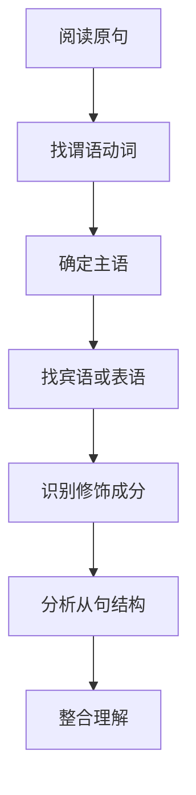
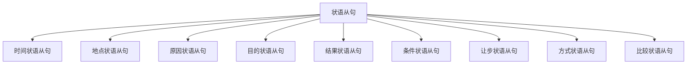
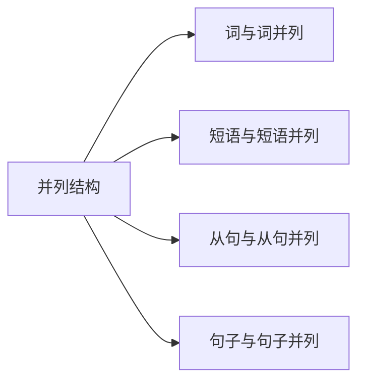
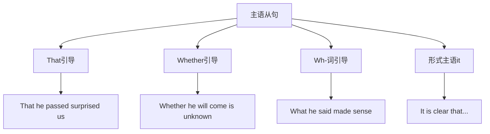
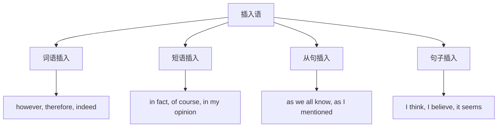
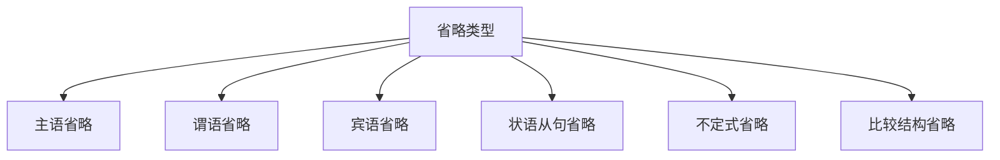

# 阅读理解中的语法

阅读理解是英语学习中最能检验语法综合运用能力的环节。无论是学术论文、新闻报道还是文学作品，都充斥着结构复杂的长难句。掌握语法分析技巧，能够帮助我们快速理清句子结构，准确把握作者意图，提高阅读效率和理解深度。

本章将从实战角度出发，系统讲解阅读理解中常见的语法难点及其破解策略。

---

## 1. 长难句分析的核心方法

长难句之所以"难"，主要是因为句子中包含多个从句、修饰成分叠加、或者使用了特殊的句式结构。要攻克长难句，首先需要掌握一套系统的分析方法。

### 1.1 长难句的构成要素

一个典型的长难句通常由以下要素构成：

> [!info] 长难句的四大构成要素
>
> 1. **主干结构**：主语 + 谓语 + 宾语/表语/补语
> 2. **修饰成分**：定语、状语、同位语
> 3. **从句嵌套**：名词性从句、定语从句、状语从句
> 4. **并列结构**：词与词、短语与短语、句子与句子的并列

理解这四大要素的相互关系，是分析长难句的基础。

**示例分析**：

```
The researchers, who had been studying the effects of climate change on
marine ecosystems for over a decade, finally published their findings in
a prestigious journal that is widely read by scientists around the world.
```

这个句子包含：
- **主干**：The researchers finally published their findings
- **修饰成分**：in a prestigious journal（地点状语）
- **从句1**：who had been studying...（定语从句，修饰 researchers）
- **从句2**：that is widely read...（定语从句，修饰 journal）

### 1.2 "抓主干，剥修饰"分析法

这是最基本也是最实用的长难句分析方法。核心思想是：先找出句子的主干结构，再逐层剥离修饰成分。



上图展示了长难句分析的标准流程。从找谓语动词开始，是因为谓语动词是句子的核心，确定了谓语就能顺藤摸瓜找到主语和宾语。修饰成分和从句虽然提供了丰富的信息，但本质上都是对主干的补充说明。

**具体步骤**：

| 步骤 | 操作 | 目的 |
| --- | --- | --- |
| 第一步 | 找出所有谓语动词 | 确定句子有几个层次 |
| 第二步 | 区分主句谓语和从句谓语 | 找出句子主干 |
| 第三步 | 向前找主语 | 确定动作发出者 |
| 第四步 | 向后找宾语/表语 | 确定动作承受者或主语状态 |
| 第五步 | 分析剩余成分 | 理解修饰关系 |

**实战演练**：

```
What scientists have long suspected but could not prove until recently
is that regular exercise not only improves physical health but also
enhances cognitive function in ways that were previously unknown.
```

**分析过程**：

1. **找谓语动词**：have suspected, could prove, is, improves, enhances, were
2. **区分主从句**：主句谓语是 "is"（系动词）
3. **找主语**：What scientists have long suspected but could not prove until recently（主语从句）
4. **找表语**：that regular exercise not only improves...（表语从句）
5. **整合理解**：科学家长期怀疑但直到最近才能证明的是：规律运动不仅改善身体健康，还以以前未知的方式增强认知功能。

### 1.3 标点符号的导航作用

在长难句中，标点符号是重要的结构指示器。善于利用标点符号，可以快速把握句子的层次结构。

> [!tip] 标点符号的语法功能
>
> - **逗号 (,)**：分隔并列成分、引导插入语、分隔从句
> - **分号 (;)**：连接两个独立但相关的分句
> - **冒号 (:)**：引出解释、说明或列举
> - **破折号 (—)**：强调、解释或突然转折
> - **括号 ( )**：补充说明，可暂时跳过

**示例分析**：

```
The CEO announced—much to everyone's surprise—that the company would
be restructuring its operations; this decision, which had been under
consideration for months, would affect thousands of employees.
```

标点符号分析：
- **破折号**：`much to everyone's surprise` 是插入语，表示出乎意料
- **分号**：分隔两个独立分句，表示这两件事相关
- **逗号**：`which had been...` 是非限制性定语从句

### 1.4 信号词的识别与运用

信号词是帮助我们理解句子逻辑关系的重要线索。不同类型的信号词指示着不同的语义关系。

| 逻辑关系 | 常见信号词 | 功能说明 |
| --- | --- | --- |
| 因果关系 | because, since, as, therefore, thus, hence, consequently | 表示原因或结果 |
| 转折关系 | but, however, yet, nevertheless, nonetheless, although, though | 表示语义反转 |
| 并列关系 | and, or, as well as, both...and, not only...but also | 表示并列或选择 |
| 递进关系 | moreover, furthermore, in addition, besides, what's more | 表示信息叠加 |
| 对比关系 | while, whereas, on the other hand, in contrast, unlike | 表示差异比较 |
| 让步关系 | although, though, even though, despite, in spite of | 表示让步承认 |
| 条件关系 | if, unless, provided that, as long as, in case | 表示假设条件 |
| 举例关系 | for example, for instance, such as, like, including | 表示具体举例 |

**实战应用**：

```
Although the initial results were promising, the researchers remained
cautious because they knew that larger-scale studies would be necessary
to confirm their findings; moreover, they were aware that their methodology
might be criticized by some in the scientific community.
```

信号词解读：
- **Although**：让步，说明尽管结果有希望...
- **because**：原因，解释为什么保持谨慎
- **moreover**：递进，补充另一个担忧因素

---

## 2. 定语从句的识别与理解

定语从句是阅读理解中最常见的从句类型。准确识别定语从句并理解其修饰关系，是读懂长难句的关键技能。

### 2.1 定语从句的基本识别

定语从句通过关系代词（who, whom, whose, which, that）或关系副词（when, where, why）引导，修饰先行词。

> [!info] 定语从句识别三要素
>
> 1. **先行词**：被修饰的名词或代词
> 2. **关系词**：连接先行词和从句的词
> 3. **从句内容**：对先行词进行描述或限定

**基本结构图示**：


先行词是从句修饰的对象，关系词既起连接作用，又在从句中充当一定的语法成分。理解这一点对于正确分析定语从句至关重要。

### 2.2 限制性与非限制性定语从句

这两种定语从句在形式和意义上都有重要区别：

| 特征 | 限制性定语从句 | 非限制性定语从句 |
| --- | --- | --- |
| 标点 | 无逗号分隔 | 有逗号分隔 |
| 功能 | 限定先行词范围 | 补充说明先行词 |
| 删除后 | 句意不完整或改变 | 句意基本不变 |
| that 使用 | 可以用 that | 不能用 that |
| 翻译方式 | 前置定语或"的"字结构 | 另起一句或加"而" |

**对比示例**：

```
限制性：The students who passed the exam will receive certificates.
（只有通过考试的学生才能获得证书——限定范围）

非限制性：The students, who had studied very hard, all passed the exam.
（这些学生都通过了考试，他们学习非常努力——补充说明）
```

### 2.3 复杂定语从句的分析

在阅读中，经常会遇到定语从句嵌套、定语从句与其他成分交织的复杂情况。

**类型一：定语从句嵌套**

```
The book that the professor recommended, which was written by a scholar
who had spent twenty years researching the topic, became a bestseller.
```

分析：
- 第一层：that the professor recommended 修饰 book
- 第二层：which was written by a scholar 修饰整个前面的内容
- 第三层：who had spent twenty years... 修饰 scholar

**类型二：定语从句与状语交织**

```
The policy that was implemented last year to reduce carbon emissions,
despite initial opposition from industry groups, has proven effective.
```

分析：
- 定语从句：that was implemented last year 修饰 policy
- 目的状语：to reduce carbon emissions
- 让步状语：despite initial opposition...
- 主句谓语：has proven effective

> [!warning] 常见分析错误
>
> 1. **错误**：把非限制性定语从句的内容当作主要信息
> 2. **错误**：忽略定语从句中的时态信息
> 3. **错误**：把定语从句的主语误认为是主句的主语

### 2.4 关系词的省略与还原

在限制性定语从句中，当关系代词在从句中作宾语时，可以省略。这种省略在阅读中很常见，需要能够识别和还原。

**省略规则**：

| 情况 | 能否省略 | 示例 |
| --- | --- | --- |
| 关系代词作从句宾语 | 可以省略 | The book (that) I bought... |
| 关系代词作从句主语 | 不能省略 | The man who came... |
| 介词 + 关系代词 | 不能省略 | The house in which we live... |
| 非限制性定语从句 | 不能省略 | My father, who is a doctor, ... |

**实战还原练习**：

```
原句：The information we received yesterday turned out to be false.
还原：The information (that/which) we received yesterday turned out to be false.

分析：we received yesterday 是定语从句，修饰 information
      关系代词 that/which 在从句中作 received 的宾语，被省略
```

### 2.5 定语从句的翻译技巧

定语从句的翻译是阅读理解的重要技能。根据从句的长短和复杂程度，可以采用不同的翻译策略。

**策略一：前置法**（适用于短小的定语从句）

```
The girl who is wearing a red dress is my sister.
翻译：穿红裙子的那个女孩是我姐姐。
```

**策略二：后置法**（适用于较长的定语从句）

```
He is the professor who has published more than 100 papers on artificial
intelligence and has been invited to give lectures at universities worldwide.
翻译：他就是那位教授，发表了100多篇关于人工智能的论文，并被邀请到世界各地的大学演讲。
```

**策略三：融合法**（适用于非限制性定语从句）

```
The experiment, which lasted for three years, finally yielded positive results.
翻译：这个持续了三年的实验终于取得了积极的成果。
或：这个实验持续了三年，终于取得了积极的成果。
```

---

## 3. 状语从句的逻辑关系

状语从句在阅读中的重要性在于它们揭示了句子之间的逻辑关系。准确理解状语从句，是把握文章论证脉络的关键。

### 3.1 状语从句的类型与识别

状语从句根据其表达的逻辑关系可分为九大类：



状语从句通过引导词与主句连接，每种类型都有特定的引导词。掌握这些引导词是快速识别状语从句类型的关键。

**各类状语从句的引导词**：

| 从句类型 | 常用引导词 | 语义功能 |
| --- | --- | --- |
| 时间 | when, while, as, before, after, since, until, as soon as | 表示动作发生的时间 |
| 地点 | where, wherever | 表示动作发生的地点 |
| 原因 | because, since, as, now that, in that | 表示动作的原因 |
| 目的 | so that, in order that, for fear that, lest | 表示动作的目的 |
| 结果 | so...that, such...that, so that | 表示动作的结果 |
| 条件 | if, unless, as/so long as, provided (that), in case | 表示动作的条件 |
| 让步 | although, though, even though/if, while, whereas | 表示让步关系 |
| 方式 | as, as if, as though | 表示动作的方式 |
| 比较 | than, as...as, not so...as | 表示程度比较 |

### 3.2 时间状语从句的细微差别

时间状语从句的引导词虽多，但各有侧重，理解其细微差别对阅读理解很有帮助。

> [!tip] when, while, as 的区别
>
> - **when**：强调"在某时"，可用于瞬间动作或持续动作
> - **while**：强调"在...期间"，主从句动作同时进行
> - **as**：强调"随着"或"一边...一边"，动作同步发展

**对比示例**：

```
When I arrived, she was cooking dinner.
（我到达时，她正在做饭——when 引出时间点）

While I was reading, she was watching TV.
（我读书期间，她在看电视——while 强调两个动作同时持续）

As the sun rose, the temperature increased.
（随着太阳升起，温度上升——as 强调同步变化）
```

### 3.3 条件状语从句的虚实之分

条件状语从句分为真实条件句和虚拟条件句，在阅读中需要区分。

**真实条件句**：表示可能发生的情况

```
If the experiment succeeds, we will publish the results immediately.
（如果实验成功，我们将立即发表结果。）
```

**虚拟条件句**：表示假设或不可能的情况

```
If I were the president, I would implement different policies.
（如果我是总统，我会实施不同的政策。——与现在事实相反）

If they had taken the earlier train, they would have arrived on time.
（如果他们乘了早班火车，就会准时到达。——与过去事实相反）
```

> [!warning] 隐含条件的识别
>
> 有些句子中条件关系是隐含的，没有明确的 if：
> - **Without** your help, I couldn't have finished. (= If it hadn't been for your help)
> - **But for** the rain, we would have gone hiking. (= If it hadn't been for the rain)
> - **Given** more time, I could do better. (= If I were given more time)

### 3.4 让步状语从句的理解要点

让步状语从句表示"虽然...但是..."的逻辑关系，是阅读中常见的论证手法。

**常见引导词及其语气强度**：

| 引导词 | 语气强度 | 示例 |
| --- | --- | --- |
| though | 较弱 | Though tired, he continued working. |
| although | 中等 | Although it rained, the game continued. |
| even though | 较强 | Even though she apologized, I'm still upset. |
| even if | 最强 | Even if you fail, you should try again. |

**特殊让步结构**：

```
1. 形容词/副词 + as/though + 主语 + 谓语
   Young as he is, he has achieved a lot.
   （虽然他年轻，但已取得很多成就。）

2. No matter + 疑问词 / 疑问词 + ever
   No matter what happens, don't give up.
   Whatever happens, don't give up.
   （无论发生什么，都不要放弃。）
```

### 3.5 原因与结果状语从句的区分

because, since, as 都可表原因，但语义侧重和位置有所不同：

| 引导词 | 侧重点 | 常见位置 | 语气强度 |
| --- | --- | --- | --- |
| because | 直接原因，回答 why | 通常在主句后 | 最强 |
| since | 已知原因，顺便一提 | 通常在句首 | 中等 |
| as | 显而易见的原因 | 通常在句首 | 较弱 |
| now that | 既然（已发生的事实） | 句首 | 中等 |
| in that | 在于（正式用语） | 主句后 | 较强 |

**示例对比**：

```
I stayed home because I was sick.
（我待在家里是因为我病了。——直接回答"为什么"）

Since you're here, let's start the meeting.
（既然你来了，咱们开始开会吧。——已知你来了这个事实）

As it was getting dark, we decided to head home.
（由于天黑了，我们决定回家。——显而易见的情况）
```

---

## 4. 并列结构的分析

并列结构是英语中扩展句子的重要手段。准确识别并列成分，是理解复杂句子的必备技能。

### 4.1 并列结构的识别标志

并列结构通常由并列连词连接，这些连词是识别并列结构的关键标志。

> [!info] 常见并列连词
>
> **单一连词**：and, or, but, yet, so, for, nor
>
> **关联连词**：
> - both...and（两者都）
> - either...or（要么...要么）
> - neither...nor（既不...也不）
> - not only...but also（不仅...而且）
> - not...but（不是...而是）
> - rather than（而不是）

### 4.2 并列成分的对等原则

并列结构的核心原则是：并列成分在语法形式上应该对等。



并列连词两侧的成分必须在语法功能和形式上保持一致。这一原则是分析并列结构的基础。

**对等原则示例**：

```
词与词并列：
She is intelligent and diligent. (形容词 + 形容词)

短语与短语并列：
He likes reading books and playing chess. (动名词短语 + 动名词短语)

从句与从句并列：
I know that he is honest and that he works hard. (宾语从句 + 宾语从句)

句子与句子并列：
She studied medicine, and he studied law. (独立分句 + 独立分句)
```

### 4.3 复杂并列结构的分析技巧

在长难句中，并列结构往往与从句、修饰成分交织在一起，需要仔细辨别。

**技巧一：找对应成分**

当看到并列连词时，向前和向后寻找结构对等的成分。

```
The study suggests that regular exercise improves memory retention
and that a healthy diet contributes to overall brain function.
```

分析：and 连接两个 that 引导的宾语从句
- 从句1：that regular exercise improves memory retention
- 从句2：that a healthy diet contributes to overall brain function

**技巧二：注意省略现象**

并列结构中常省略重复成分：

```
完整形式：
Some students prefer online learning, and some students prefer
traditional classroom instruction.

省略形式：
Some students prefer online learning, and some (students prefer)
traditional classroom instruction.

更简洁：
Some prefer online learning, and others traditional classroom instruction.
```

**技巧三：警惕"假并列"**

有时 and 并不连接对等成分，而是有其他用法：

```
1. 表示顺承：
   He finished his work and went home.
   （完成工作后回家了——时间顺序，非真正并列）

2. 表示结果：
   Work hard and you will succeed.
   （努力工作你就会成功——条件关系）

3. 固定搭配：
   nice and warm（又舒服又暖和）
   good and ready（完全准备好）
```

### 4.4 三项及以上的并列结构

当并列成分超过两项时，通常使用逗号分隔，最后一项前加连词。

**标准格式**：A, B, and C 或 A, B, or C

```
The research focuses on three areas: climate change, biodiversity loss,
and sustainable development.

Students must submit their assignments by email, through the online
portal, or in person at the department office.
```

> [!tip] Oxford Comma（牛津逗号）
>
> 在最后一个连词前是否使用逗号，存在两种风格：
> - **美式英语**：通常使用（A, B, and C）
> - **英式英语**：通常不使用（A, B and C）
>
> 在阅读时两种格式都会遇到，不影响理解。

### 4.5 并列结构与句意理解

正确分析并列结构对于理解句意至关重要。误判并列范围会导致理解偏差。

**示例分析**：

```
The committee decided to review the policy and implement changes
that would benefit all employees.
```

**解读一**（并列动词）：
- decided to review the policy
- (decided to) implement changes that would benefit all employees
委员会决定审查政策并实施有利于所有员工的变革。

```
The committee decided to review the policy that had been in place
for decades and that had caused numerous complaints.
```

**解读二**（并列从句）：
- the policy that had been in place for decades
- (the policy) that had caused numerous complaints
委员会决定审查那项已实施数十年并引发大量投诉的政策。

---

## 5. 主语从句与同位语从句

主语从句和同位语从句在阅读中较为常见，尤其是在学术文章和新闻报道中。准确识别这两类从句，是深入理解文章内容的重要技能。

### 5.1 主语从句的识别与分析

主语从句在句中充当主语，通常由 that, whether, what, who, which, when, where, why, how 等引导。

**常见结构**：



主语从句位于句首时，需要注意识别从句的边界。当使用形式主语 it 时，真正的主语从句被后置，需要找到对应的从句内容。

**类型一：That 引导的主语从句**

```
That the earth is round is a well-known fact.
= It is a well-known fact that the earth is round.
（地球是圆的这一事实众所周知。）
```

**类型二：What 引导的主语从句**

```
What surprised everyone was his sudden resignation.
（让所有人惊讶的是他突然辞职。）

注意：what = the thing that，自带先行词
```

**类型三：Whether 引导的主语从句**

```
Whether the plan will succeed remains to be seen.
= It remains to be seen whether the plan will succeed.
（这个计划是否会成功还有待观察。）
```

### 5.2 形式主语 It 的识别

在英语中，为了句子平衡，常用 it 作形式主语，将真正的主语从句后置。

> [!info] 常见的 It 形式主语句型
>
> - It is + 形容词 + that 从句
> - It is + 名词 + that 从句
> - It + 动词 + that 从句
> - It is + 过去分词 + that 从句

**常见搭配**：

| 类型 | 常见表达 | 示例 |
| --- | --- | --- |
| It is + adj. | clear, obvious, important, necessary, possible, likely | It is clear that we need to act now. |
| It is + n. | a fact, a pity, no wonder, common knowledge | It is a pity that he missed the opportunity. |
| It + v. | seems, appears, happens, turns out | It seems that they have left already. |
| It is + p.p. | reported, believed, said, estimated, suggested | It is reported that the negotiations have failed. |

### 5.3 同位语从句的识别与分析

同位语从句对前面的抽象名词进行解释说明，通常由 that 引导。

**常接同位语从句的抽象名词**：

| 类别 | 常见名词 |
| --- | --- |
| 消息类 | news, message, information, report, rumor |
| 观点类 | idea, opinion, view, belief, thought |
| 事实类 | fact, truth, reality, evidence, proof |
| 问题类 | question, problem, issue, doubt |
| 可能类 | possibility, probability, chance, hope |
| 命令类 | order, command, demand, suggestion, proposal |

**结构分析**：

```
The news that the company would be sold shocked all employees.
        └──────────── 同位语从句 ───────────┘
（公司将被出售的消息震惊了所有员工。）

同位语从句解释说明 news 的具体内容
```

### 5.4 同位语从句与定语从句的区分

这两种从句都跟在名词后面，都可以用 that 引导，容易混淆。

> [!warning] 关键区分点
>
> 1. **that 的功能**：
>    - 定语从句：that 在从句中作成分（主语、宾语等）
>    - 同位语从句：that 只起连接作用，不作成分
>
> 2. **与先行词的关系**：
>    - 定语从句：修饰限定先行词
>    - 同位语从句：解释说明先行词的内容
>
> 3. **先行词类型**：
>    - 定语从句：可修饰任何名词
>    - 同位语从句：只跟在抽象名词后

**对比分析**：

```
定语从句：
The news that he told me was exciting.
分析：that 在从句中作 told 的宾语
翻译：他告诉我的那个消息很令人兴奋。

同位语从句：
The news that he had won the prize was exciting.
分析：that 只起连接作用，从句是完整的
翻译：他获奖的消息很令人兴奋。
```

### 5.5 复杂情况的处理

在实际阅读中，可能遇到主语从句、同位语从句与其他结构交织的情况。

**示例一：主语从句含定语从句**

```
What the scientists discovered during the expedition that lasted for
six months has changed our understanding of marine biology.
```

分析：
- 主句主语：What the scientists discovered...
- 定语从句：that lasted for six months（修饰 expedition）
- 主句谓语：has changed
- 主句宾语：our understanding of marine biology

**示例二：同位语从句中含其他从句**

```
The belief that people who work hard will eventually succeed is
deeply rooted in American culture.
```

分析：
- 主句主语：The belief
- 同位语从句：that people who work hard will eventually succeed
- 定语从句（嵌套）：who work hard（修饰 people）
- 主句谓语：is deeply rooted
- 主句状语：in American culture

---

## 6. 插入语的识别

插入语是阅读中常见的干扰因素。它们插入句子中间，提供补充信息，但不影响句子主干结构。正确识别插入语，可以帮助我们快速抓住句子核心。

### 6.1 插入语的常见形式

插入语通常用逗号、破折号或括号与句子主体分隔。



插入语可以是单词、短语、从句或完整句子。无论形式如何，它们都是对主句的补充说明，可以暂时跳过以抓住主干。

### 6.2 常见插入语类型

| 类型 | 常见表达 | 功能 |
| --- | --- | --- |
| 评论性插入语 | obviously, clearly, unfortunately, surprisingly | 表达说话者态度 |
| 衔接性插入语 | however, therefore, moreover, nevertheless | 表示逻辑关系 |
| 解释性插入语 | that is, namely, in other words, for example | 补充解释 |
| 观点性插入语 | I think, I believe, in my opinion, to my mind | 表达个人观点 |
| 来源性插入语 | according to..., as...says, in...view | 说明信息来源 |
| 让步性插入语 | admittedly, to be sure, of course | 表示让步 |

### 6.3 插入语与句子主干的分离

处理含有插入语的句子，关键是将插入语与主干分离。

**分离技巧**：

```
原句：
The proposal, despite strong opposition from several board members,
was eventually approved by the committee.

分离过程：
1. 识别插入成分：despite strong opposition from several board members
2. 暂时跳过，读主干：The proposal was eventually approved by the committee.
3. 回读插入成分，补充理解：尽管遭到多位董事的强烈反对

完整理解：
尽管遭到多位董事的强烈反对，该提案最终还是获得了委员会的批准。
```

### 6.4 多重插入语的处理

在复杂句子中，可能出现多个插入成分叠加的情况。

**示例分析**：

```
The author, a renowned professor at Harvard University who has written
extensively on the subject, argues, in his latest book, that the
traditional approach to the problem is fundamentally flawed.
```

**插入语识别**：

| 插入成分 | 功能 | 分隔符号 |
| --- | --- | --- |
| a renowned professor at Harvard University | 同位语 | 逗号 |
| who has written extensively on the subject | 非限制性定语从句 | 无（紧跟同位语） |
| in his latest book | 地点/来源状语 | 逗号 |

**主干提取**：
The author argues that the traditional approach to the problem is fundamentally flawed.
（作者认为传统的问题处理方法存在根本性缺陷。）

### 6.5 as 引导的插入语从句

as 可以引导非限制性定语从句作为插入语，修饰整个主句内容。

**常见结构**：

| 表达 | 含义 | 位置 |
| --- | --- | --- |
| as we all know | 众所周知 | 句首/句中/句末 |
| as is often the case | 情况常常如此 | 句首/句中/句末 |
| as I mentioned earlier | 如我之前所说 | 句首/句中/句末 |
| as is shown in the chart | 如图表所示 | 句首/句中/句末 |
| as might be expected | 正如预期的那样 | 句首/句中/句末 |

**示例**：

```
The economy, as many analysts predicted, has entered a recession.
= As many analysts predicted, the economy has entered a recession.
（正如许多分析师预测的那样，经济已进入衰退。）
```

---

## 7. 省略结构的还原

省略是英语中常见的语法现象，目的是避免重复、使句子简洁。在阅读中，能够识别并还原省略结构，对于准确理解句意至关重要。

### 7.1 省略的基本类型

> [!info] 省略的三大类型
>
> 1. **句内省略**：在同一句子内省略重复成分
> 2. **承前省略**：省略前文已出现的成分
> 3. **蒙后省略**：省略后文将要出现的成分（较少见）



省略虽然使句子简洁，但增加了理解难度。掌握各类省略的规律，是准确阅读的基础。

### 7.2 并列结构中的省略

在并列结构中，为避免重复，常省略相同成分。

**规则**：保留不同部分，省略相同部分

```
完整形式：
I like coffee and she likes tea.

省略形式：
I like coffee and she tea.
（省略了重复的 likes）
```

**复杂示例**：

```
原句：
The first group was asked to exercise daily, and the second group
(was asked) to maintain their normal routine.

还原分析：
并列成分1：The first group was asked to exercise daily
并列成分2：the second group (was asked) to maintain their normal routine
省略内容：was asked（因与前面相同）
```

### 7.3 状语从句中的省略

当状语从句的主语与主句主语一致，且从句谓语含有 be 动词时，可以省略从句的主语和 be 动词。

**省略条件**：
1. 从句主语 = 主句主语
2. 从句谓语含有 be 动词

**常见形式**：

| 从句类型 | 完整形式 | 省略形式 |
| --- | --- | --- |
| 时间状语从句 | When he was young, he... | When young, he... |
| 条件状语从句 | If it is necessary, we... | If necessary, we... |
| 让步状语从句 | Although he was tired, he... | Although tired, he... |
| 方式状语从句 | As if he was shocked, he... | As if shocked, he... |

**实战还原**：

```
原句：
While working on the project, the team discovered several unexpected issues.

还原：
While (the team was) working on the project, the team discovered
several unexpected issues.

翻译：在进行该项目时，团队发现了几个意想不到的问题。
```

### 7.4 比较结构中的省略

比较结构（than, as...as）中常有大量省略。

> [!tip] 比较结构省略的还原技巧
>
> 1. 找出比较的两个对象
> 2. 根据比较对象推断省略内容
> 3. 补全后检查逻辑是否合理

**示例分析**：

```
原句：
He works harder than I (do).
还原：He works harder than I work.

原句：
The new policy has been more effective than expected.
还原：The new policy has been more effective than (it was) expected (to be).

原句：
She speaks English as fluently as a native speaker.
还原：She speaks English as fluently as a native speaker (speaks English).
```

**复杂比较结构**：

```
原句：
The results of the experiment were far more significant than those
of any previous study.

分析：
- 比较对象1：The results of the experiment
- 比较对象2：those (= the results) of any previous study
- those 代替前面的 the results，避免重复
```

### 7.5 不定式的省略

在某些情况下，不定式可以省略，只保留 to。

**常见省略场景**：

| 场景 | 示例 |
| --- | --- |
| 回答问题 | Would you like to come? — I'd love to (come). |
| 避免重复 | You may leave if you want to (leave). |
| 固定搭配 | I don't want to, but I have to (do it). |
| 并列结构 | She planned to buy a house and (to) start a family. |

**阅读中的应用**：

```
原句：
The company hoped to expand into new markets but was unable to
because of the economic downturn.

还原：
The company hoped to expand into new markets but was unable to
(expand into new markets) because of the economic downturn.
```

### 7.6 省略结构的综合练习

以下是一些综合性的省略结构分析：

**练习一**：

```
原句：
Scientists have achieved what was once thought impossible.

分析：
- what = the thing that
- 完整：Scientists have achieved the thing that was once thought
  (to be) impossible.
- 翻译：科学家们实现了曾被认为不可能的事情。
```

**练习二**：

```
原句：
The more carefully you analyze the data, the more accurate your
conclusions will be.

分析：
- the more...the more 结构
- 完整：The more carefully you analyze the data, the more accurate
  your conclusions will be (accurate).
- 翻译：你分析数据越仔细，你的结论就会越准确。
```

**练习三**：

```
原句：
Though once considered a minor issue, climate change is now recognized
as the greatest threat to humanity.

还原：
Though (climate change was) once considered a minor issue, climate
change is now recognized as the greatest threat to humanity.

翻译：虽然气候变化曾被视为一个小问题，但现在被认为是人类面临的最大威胁。
```

---

## 8. 综合实战：长难句精析

本节将综合运用前面所学的各种分析技巧，对真实的长难句进行深入分析。

### 8.1 学术文章典型句式

**例句一**：

```
The study, which was conducted over a period of five years and involved
more than 10,000 participants from diverse socioeconomic backgrounds,
conclusively demonstrates that early childhood education, when properly
implemented, can significantly reduce educational inequality and improve
long-term outcomes for disadvantaged students.
```

**分析步骤**：

1. **找主干**：
   - 主语：The study
   - 谓语：demonstrates
   - 宾语：that 引导的宾语从句

2. **识别修饰成分**：
   - 非限制性定语从句：which was conducted...from diverse socioeconomic backgrounds
   - 条件状语从句：when properly implemented
   - 副词修饰：conclusively, significantly

3. **分析宾语从句结构**：
   - 主语：early childhood education
   - 谓语：can reduce and improve（并列）
   - 宾语：educational inequality / long-term outcomes

**完整翻译**：
这项研究历时五年，涉及来自不同社会经济背景的10000多名参与者，它确凿地证明：如果实施得当，早期儿童教育可以显著减少教育不平等，并改善弱势学生的长期发展状况。

**例句二**：

```
What makes this discovery particularly significant is not merely the
technical achievement it represents, but rather the fact that it opens
up possibilities for research that were previously thought to be beyond
the reach of current scientific methods.
```

**分析步骤**：

1. **找主干**：
   - 主语：What makes this discovery particularly significant（主语从句）
   - 谓语：is
   - 表语：not merely A but rather B 结构

2. **分析并列表语**：
   - A：the technical achievement it represents
   - B：the fact that it opens up possibilities...

3. **分析嵌套结构**：
   - that it opens up possibilities...（同位语从句，解释 fact）
   - that were previously thought to be...（定语从句，修饰 possibilities）

**完整翻译**：
使这一发现特别重要的，不仅仅是它所代表的技术成就，更重要的是它为那些此前被认为超出当前科学方法能力范围的研究开辟了可能性。

### 8.2 新闻报道典型句式

**例句三**：

```
According to officials familiar with the negotiations, who spoke on
condition of anonymity because they were not authorized to discuss the
matter publicly, the two sides have made significant progress toward
reaching an agreement, although several key issues remain unresolved.
```

**分析步骤**：

1. **识别插入成分**：
   - 来源状语：According to officials familiar with the negotiations
   - 非限制性定语从句：who spoke on condition of anonymity because...

2. **找主干**：
   - 主语：the two sides
   - 谓语：have made
   - 宾语：significant progress

3. **分析其他成分**：
   - 目的状语：toward reaching an agreement
   - 让步状语从句：although several key issues remain unresolved

**完整翻译**：
据熟悉谈判情况的官员透露（他们因未获授权公开讨论此事而要求匿名），双方在达成协议方面已取得重大进展，尽管几个关键问题仍未解决。

### 8.3 阅读理解实战技巧总结

> [!tip] 长难句分析口诀
>
> 1. **先找谓语定层次**——确定句子有几个动词，判断主从句
> 2. **回找主语明主体**——从谓语向前找主语
> 3. **后找宾语知对象**——从谓语向后找宾语或表语
> 4. **逗号破折是提示**——利用标点定位插入语
> 5. **信号词语解关系**——通过连接词判断逻辑关系
> 6. **省略成分要还原**——补全省略内容确保理解完整

**实战检验表**：

| 检查项目 | 确认要点 |
| --- | --- |
| 主干提取 | 是否正确识别主谓宾/主系表？ |
| 从句分析 | 各从句的类型和修饰对象是否明确？ |
| 并列识别 | 并列成分的范围是否准确？ |
| 插入处理 | 插入语是否正确分离？ |
| 省略还原 | 省略成分是否合理补全？ |
| 逻辑关系 | 句子间的逻辑关系是否把握？ |

---

## 9. 阅读理解中的语法小结

本章系统介绍了阅读理解中的语法应用技巧，从长难句分析方法到各类从句的识别，从并列结构到省略还原，构建了一套完整的阅读分析工具箱。

### 核心要点回顾

1. **长难句分析**：抓主干、剥修饰、用标点、识信号
2. **定语从句**：区分限制性与非限制性，注意关系词省略
3. **状语从句**：识别引导词，把握逻辑关系
4. **并列结构**：找对应成分，注意省略现象
5. **主语从句**：注意形式主语 it，区分 what 和 that
6. **同位语从句**：跟在抽象名词后，that 不作成分
7. **插入语**：用标点分离，先读主干再补充
8. **省略还原**：根据语境和平行结构补全内容

### 阅读建议

> [!success] 提升阅读能力的方法
>
> 1. **刻意练习**：选择有挑战性的文章，逐句分析结构
> 2. **积累语感**：大量阅读培养对句型的直觉
> 3. **总结归纳**：建立自己的长难句分析笔记
> 4. **循序渐进**：从简单句型开始，逐步挑战复杂结构
> 5. **学以致用**：将分析技巧应用到日常阅读中

掌握了这些语法分析技巧，面对任何复杂的英语文本，都能够从容应对，准确把握作者的思想和文章的逻辑。语法不是目的，而是通向深度理解的桥梁。
