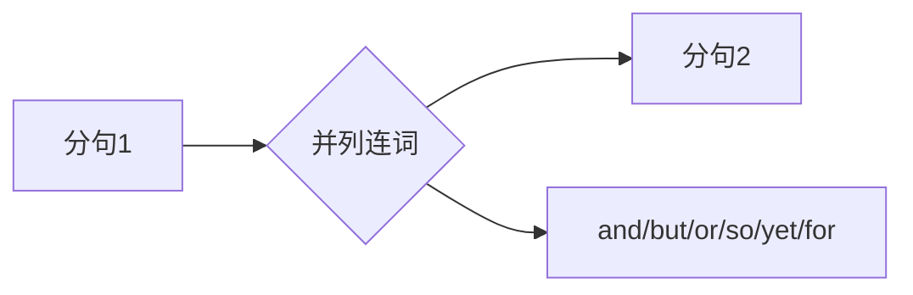
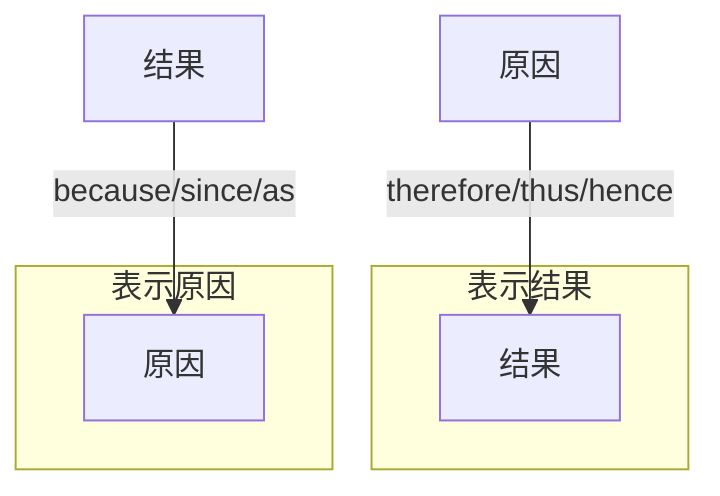
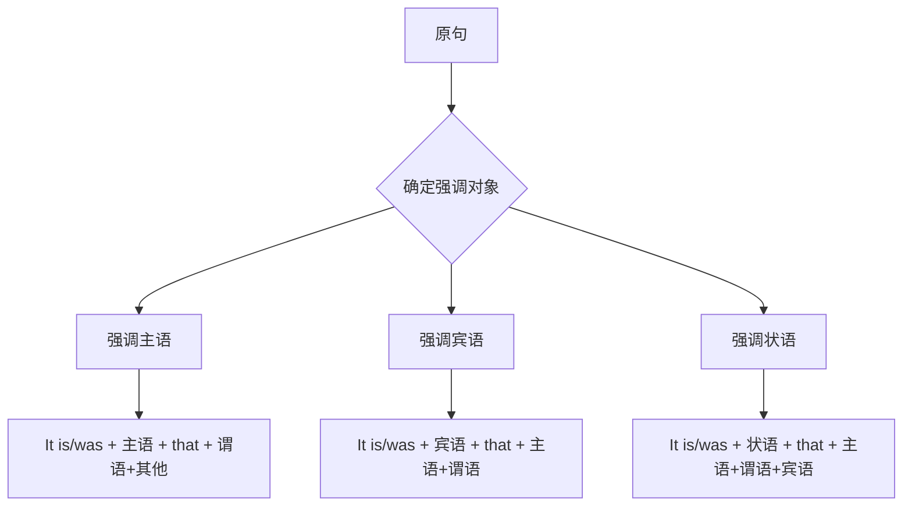
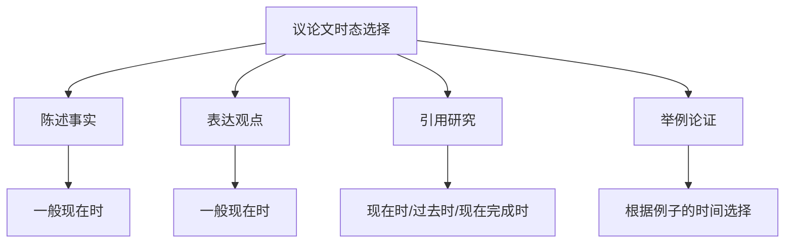

# 写作中的语法应用

英语写作是语法知识的综合运用场景。掌握语法规则只是第一步，如何在写作中灵活运用这些规则，写出既正确又地道、既清晰又有表现力的文章，才是语法学习的最终目标。本章将从实战角度出发，系统讲解写作中的语法应用技巧。

## 1. 句式变化与多样性

### 1.1 为什么需要句式变化

> [!info] 句式单一的问题
>
> 如果一篇文章通篇都是 "I think... I believe... I want..." 这样的简单句，读者会感到单调乏味。句式变化不仅能提升文章的可读性，还能展示作者的语言功底。

句式变化的核心价值在于三个方面：

**避免单调重复**：连续使用相同句型会让文章显得机械呆板，缺乏节奏感。

**增强表达层次**：不同句式承载不同的信息权重，合理搭配能突出重点。

**展示语言能力**：在考试写作中，句式多样性是评分的重要标准。

### 1.2 简单句的变化技巧

简单句虽然结构简单，但通过不同的变化手法，同样可以写出丰富的表达。

#### 1.2.1 改变句子开头

**以主语开头（最常见）**：
- Students should study hard.（学生应该努力学习。）

**以状语开头**：
- Every day, students go to school early.（每天，学生们早早去上学。）
- In modern society, technology plays a vital role.（在现代社会，科技扮演着重要角色。）

**以副词开头**：
- Fortunately, the problem was solved quickly.（幸运的是，问题很快得到解决。）
- Gradually, people realized the importance of exercise.（渐渐地，人们意识到锻炼的重要性。）

**以分词短语开头**：
- Facing great pressure, many students feel anxious.（面对巨大压力，许多学生感到焦虑。）
- Compared with the past, life is much more convenient now.（与过去相比，现在的生活方便多了。）

**以不定式开头**：
- To succeed in life, one must work hard.（要想在生活中成功，人必须努力工作。）
- To protect the environment, we should reduce waste.（为了保护环境，我们应该减少浪费。）

#### 1.2.2 使用不同的动词形式

**主动语态与被动语态的转换**：

| 主动语态 | 被动语态 |
| --- | --- |
| People speak English worldwide. | English is spoken worldwide. |
| The company will launch a new product. | A new product will be launched by the company. |
| Scientists have discovered a new species. | A new species has been discovered by scientists. |

> [!tip] 语态选择原则
>
> - 当动作执行者重要时，用主动语态
> - 当动作承受者重要或执行者不明时，用被动语态
> - 学术写作中常用被动语态以保持客观性

**使用 there be 句型**：
- Many problems exist in this system. → There are many problems in this system.
- A solution exists for every problem. → There is a solution for every problem.

**使用 It 作形式主语**：
- Learning a new language is difficult. → It is difficult to learn a new language.
- That he passed the exam surprised everyone. → It surprised everyone that he passed the exam.

### 1.3 复合句的构建策略

复合句能够表达更复杂的逻辑关系，是提升写作层次的关键。

#### 1.3.1 并列句的运用

并列句通过并列连词连接两个或多个独立分句，表达并列、转折、因果等关系。

**表示并列（and）**：
- He studied hard, **and** he passed the exam.（他努力学习，并且通过了考试。）

**表示转折（but/yet）**：
- The task was difficult, **but** they completed it on time.（任务很难，但他们按时完成了。）
- She is young, **yet** she is very mature.（她很年轻，然而她很成熟。）

**表示选择（or）**：
- You can take the bus, **or** you can walk there.（你可以坐公交车，或者步行去那里。）

**表示因果（so/for）**：
- It was raining, **so** we stayed at home.（下雨了，所以我们待在家里。）
- He must be tired, **for** he has worked all day.（他一定累了，因为他工作了一整天。）

#### 1.3.2 主从复合句的层次

主从复合句由主句和从句组成，从句对主句起补充、修饰或说明作用。

**名词性从句作主语**：
- **What he said** is true.（他所说的是真的。）
- **Whether we can succeed** depends on our efforts.（我们能否成功取决于我们的努力。）

**名词性从句作宾语**：
- I believe **that hard work leads to success**.（我相信努力工作会带来成功。）
- She asked **where the meeting would be held**.（她问会议将在哪里举行。）

**定语从句修饰名词**：
- The book **which I bought yesterday** is very interesting.（我昨天买的那本书很有趣。）
- Students **who work hard** usually get good grades.（努力学习的学生通常成绩好。）

**状语从句表示逻辑关系**：
- **Although it was raining**, they went out for a walk.（尽管在下雨，他们还是出去散步了。）
- **If you study hard**, you will pass the exam.（如果你努力学习，你会通过考试的。）

### 1.4 句式变换对照表

> [!example] 同一意思的不同表达
>
> 以"科技改变了我们的生活"为例，展示多种句式变换：

| 句式类型 | 英文表达 | 特点 |
| --- | --- | --- |
| 简单句（主动） | Technology has changed our life. | 直接明了 |
| 简单句（被动） | Our life has been changed by technology. | 强调受影响者 |
| There be 句型 | There have been great changes in our life due to technology. | 强调变化的存在 |
| It 形式主语 | It is obvious that technology has changed our life. | 表达观点 |
| 主语从句 | What technology has brought us is a completely different life. | 强调结果 |
| 强调句 | It is technology that has changed our life. | 突出科技的作用 |
| 倒装句 | Greatly has technology changed our life. | 加强语气 |
| 分词开头 | Having developed rapidly, technology has changed our life. | 增加背景信息 |

## 2. 连接词的恰当使用

### 2.1 连接词的重要性

连接词（Connectives/Transitions）是文章的"粘合剂"，它们将句子和段落有机地连接在一起，使文章逻辑清晰、层次分明。

> [!warning] 连接词使用不当的后果
>
> - 缺乏连接词：文章显得支离破碎，读者难以把握逻辑关系
> - 滥用连接词：文章显得繁冗累赘，反而影响阅读流畅性
> - 误用连接词：表达的逻辑关系错误，造成理解偏差

### 2.2 连接词分类详解

#### 2.2.1 表示递进关系

递进连接词用于添加信息或强调程度的加深。

| 连接词 | 含义 | 例句 |
| --- | --- | --- |
| moreover | 而且，此外 | The plan is practical. **Moreover**, it is cost-effective. |
| furthermore | 此外，再者 | The product is popular. **Furthermore**, it is affordable. |
| in addition | 另外 | He is talented. **In addition**, he works very hard. |
| besides | 除此之外 | **Besides** being smart, she is also very kind. |
| what's more | 更重要的是 | The hotel is convenient. **What's more**, it is cheap. |
| not only...but also | 不仅...而且 | She is **not only** beautiful **but also** intelligent. |

**使用示例**：
> Online learning offers flexibility. **Moreover**, it allows students to access resources from anywhere in the world. **Furthermore**, it can significantly reduce educational costs.
>
> （在线学习提供灵活性。而且，它允许学生从世界任何地方获取资源。此外，它可以显著降低教育成本。）

#### 2.2.2 表示转折关系

转折连接词用于表达与前文相反或不同的观点。

| 连接词 | 含义 | 语气强度 |
| --- | --- | --- |
| however | 然而 | 较强 |
| nevertheless | 尽管如此 | 较强 |
| nonetheless | 尽管如此 | 较强 |
| on the other hand | 另一方面 | 中等 |
| in contrast | 相比之下 | 中等 |
| whereas | 然而，鉴于 | 中等 |
| while | 虽然，尽管 | 较弱 |
| yet | 然而 | 较弱 |

**使用示例**：
> Technology brings convenience to our life. **However**, it also creates new problems such as privacy concerns. **On the other hand**, we cannot deny its positive impact on communication.
>
> （科技给我们的生活带来便利。然而，它也产生了诸如隐私问题等新问题。另一方面，我们不能否认它对通信的积极影响。）

#### 2.2.3 表示因果关系

因果连接词用于说明原因或结果。

**表示结果的连接词**：

| 连接词 | 含义 | 例句 |
| --- | --- | --- |
| therefore | 因此 | He worked hard. **Therefore**, he succeeded. |
| thus | 因此 | The data was incomplete. **Thus**, the conclusion was unreliable. |
| hence | 因此 | She was ill. **Hence**, she was absent. |
| consequently | 结果 | The bridge collapsed. **Consequently**, traffic was disrupted. |
| as a result | 结果 | It rained heavily. **As a result**, the match was cancelled. |
| accordingly | 因此，相应地 | The rules changed. **Accordingly**, we adjusted our plan. |

**表示原因的连接词**：

| 连接词 | 含义 | 例句 |
| --- | --- | --- |
| because | 因为 | He stayed home **because** he was sick. |
| since | 既然，由于 | **Since** you are here, let's start the meeting. |
| as | 由于 | **As** it was late, we decided to leave. |
| due to | 由于 | The delay was **due to** bad weather. |
| owing to | 由于 | **Owing to** his efforts, the project succeeded. |
| thanks to | 多亏 | **Thanks to** your help, I finished on time. |

#### 2.2.4 表示举例说明

举例连接词用于提供具体例子来支持论点。

| 连接词 | 含义 | 使用场景 |
| --- | --- | --- |
| for example | 例如 | 通用，最常见 |
| for instance | 例如 | 与 for example 同义 |
| such as | 例如 | 后接名词或名词短语 |
| like | 比如 | 口语化 |
| namely | 即 | 列举具体事物 |
| specifically | 具体地说 | 强调具体细节 |
| to illustrate | 举例说明 | 较正式 |
| as an illustration | 作为例证 | 较正式 |

**使用示例**：
> Many renewable energy sources are being developed. **For example**, solar power and wind energy have become increasingly popular. **Specifically**, China has invested heavily in solar panel production.
>
> （许多可再生能源正在开发中。例如，太阳能和风能越来越受欢迎。具体来说，中国在太阳能电池板生产方面投入巨大。）

#### 2.2.5 表示总结归纳

总结连接词用于文章或段落的结尾，概括主要观点。

| 连接词 | 含义 | 例句 |
| --- | --- | --- |
| in conclusion | 总之 | **In conclusion**, education is the key to success. |
| to sum up | 总结起来 | **To sum up**, we need to take action immediately. |
| in summary | 总的来说 | **In summary**, the project was a great success. |
| in brief | 简言之 | **In brief**, practice makes perfect. |
| all in all | 总的来说 | **All in all**, it was a productive meeting. |
| on the whole | 总体上 | **On the whole**, the results were positive. |
| to conclude | 最后 | **To conclude**, I would like to thank everyone. |

### 2.3 连接词使用原则

> [!tip] 连接词使用的黄金法则
>
> 1. **不要堆砌**：每个连接词都应有明确的逻辑功能
> 2. **注意位置**：连接词可置于句首、句中或句末
> 3. **变换使用**：避免重复使用同一个连接词
> 4. **符合语境**：选择与正式程度相匹配的连接词

**错误示范**：
> ❌ Moreover, in addition, furthermore, the plan is good.
> （堆砌了三个意思相近的连接词）

**正确示范**：
> ✅ The plan is cost-effective. Moreover, it can be implemented quickly.

**连接词位置变化**：

| 位置 | 例句 |
| --- | --- |
| 句首 | **However**, this view is not universally accepted. |
| 句中 | This view, **however**, is not universally accepted. |
| 句末 | This view is not universally accepted, **however**. |

## 3. 从句在写作中的应用

### 3.1 定语从句的写作运用

定语从句能够使表达更加精确和丰富，是提升写作质量的重要工具。

#### 3.1.1 限制性定语从句

限制性定语从句对先行词起限定作用，去掉从句后句意不完整。

**基本句型升级**：
- 原句：The students passed the exam. They studied hard.
- 升级：The students **who studied hard** passed the exam.
- （努力学习的学生通过了考试。）

**更多示例**：
| 简单句组合 | 定语从句整合 |
| --- | --- |
| I read a book. It was written by Hemingway. | I read a book **that was written by Hemingway**. |
| She visited the city. She was born there. | She visited the city **where she was born**. |
| I remember the day. We first met on that day. | I remember the day **when we first met**. |
| This is the reason. He left for this reason. | This is the reason **why he left**. |

#### 3.1.2 非限制性定语从句

非限制性定语从句提供补充信息，用逗号与主句隔开，去掉后句意完整。

**增添细节信息**：
- Beijing, **which is the capital of China**, has a long history.
- （北京是中国的首都，有着悠久的历史。）

- My brother, **who works in a bank**, is getting married next month.
- （我哥哥在银行工作，下个月要结婚了。）

**引出评论或解释**：
- She refused the offer, **which surprised everyone**.
- （她拒绝了这个提议，这让所有人都很惊讶。）

- He arrived late, **which made the boss angry**.
- （他迟到了，这让老板很生气。）

> [!warning] 非限制性定语从句的注意事项
>
> - 非限制性定语从句**不能用 that 引导**
> - 必须用逗号与主句分开
> - which 可以指代整个主句的内容

#### 3.1.3 定语从句的简化

为使句子更简洁，定语从句常可简化为分词短语或介词短语。

| 完整定语从句 | 简化形式 | 简化类型 |
| --- | --- | --- |
| The man **who is standing** there is my father. | The man **standing** there is my father. | 现在分词 |
| The letter **which was written** in French... | The letter **written** in French... | 过去分词 |
| Students **who are interested** in music... | Students **interested** in music... | 过去分词 |
| The house **which is on the hill**... | The house **on the hill**... | 介词短语 |

### 3.2 名词性从句的写作运用

名词性从句使表达更正式、更有学术味道。

#### 3.2.1 主语从句开篇

用主语从句作为文章或段落的开头，能够突出主题。

**常用句型**：
- **What matters most is** (that)...（最重要的是...）
- **What we should realize is** (that)...（我们应该意识到的是...）
- **What I want to emphasize is** (that)...（我想强调的是...）
- **Whether...or not remains** a question.（...是否...仍是一个问题。）

**写作示例**：
> **What we should realize is that** environmental protection requires everyone's participation. **What matters most is** not just government policies, but individual actions in daily life.
>
> （我们应该意识到的是，环境保护需要每个人的参与。最重要的不仅仅是政府政策，还有日常生活中的个人行动。）

#### 3.2.2 It 形式主语句型

用 it 作形式主语，真正的主语从句后置，使句子结构更平衡。

**常用句型**：

| 句型 | 含义 | 例句 |
| --- | --- | --- |
| It is clear that... | 很明显... | **It is clear that** education is important. |
| It is obvious that... | 显而易见... | **It is obvious that** he is lying. |
| It is believed that... | 人们认为... | **It is believed that** exercise is good for health. |
| It is reported that... | 据报道... | **It is reported that** the economy is recovering. |
| It goes without saying that... | 不言而喻... | **It goes without saying that** hard work pays off. |
| It is no wonder that... | 难怪... | **It is no wonder that** she succeeded. |

#### 3.2.3 宾语从句的运用

宾语从句用于表达观点、引用他人意见或报告研究结果。

**表达个人观点**：
- I believe **(that) hard work is the key to success**.
- I think **(that) we should take action immediately**.
- I am convinced **(that) education can change lives**.

**引用他人观点**：
- Experts argue **(that) climate change is a serious threat**.
- Research shows **(that) reading improves brain function**.
- Studies indicate **(that) sleep deprivation affects memory**.

### 3.3 状语从句的写作运用

状语从句能够表达丰富的逻辑关系，使论述更加严密。

#### 3.3.1 条件状语从句

**表示真实条件**：
- **If** we protect the environment, future generations will benefit.
- （如果我们保护环境，子孙后代将受益。）

**表示假设条件**：
- **If** I were you, I would accept the offer.
- （如果我是你，我会接受这个提议。）

**表示让步条件**：
- **Even if** we fail, we should not give up.
- （即使我们失败了，也不应该放弃。）

#### 3.3.2 让步状语从句

让步从句在议论文中非常有用，可以先承认对方观点，再提出自己的看法。

**常用句型**：

| 引导词 | 含义 | 例句 |
| --- | --- | --- |
| although/though | 虽然 | **Although** he is young, he is very capable. |
| even though | 即使 | **Even though** it was raining, they went out. |
| while | 尽管 | **While** I understand your concern, I disagree. |
| despite the fact that | 尽管 | **Despite the fact that** he tried hard, he failed. |
| no matter what/how | 无论什么/怎样 | **No matter how** hard it is, we must try. |

**议论文写作示例**：
> **Although** some people argue that technology has negative effects on social interaction, I believe that the benefits outweigh the drawbacks. **Even though** face-to-face communication may decrease, technology enables us to connect with people around the world.
>
> （虽然一些人认为科技对社交互动有负面影响，但我相信利大于弊。即使面对面的交流可能减少，科技使我们能够与世界各地的人联系。）

#### 3.3.3 目的状语从句

**常用引导词**：
- so that（以便）
- in order that（为了）
- for fear that（唯恐）
- lest（以免）

**写作示例**：
> We should study hard **so that** we can have a bright future. The government has implemented strict measures **in order that** the environment can be better protected.
>
> （我们应该努力学习，以便能有一个光明的未来。政府已实施严格措施，以便更好地保护环境。）

## 4. 强调句与倒装句的使用

### 4.1 强调句型

强调句是写作中突出重点信息的有力工具。

#### 4.1.1 It is...that 强调句

**基本结构**：It is/was + 被强调部分 + that/who + 其余部分

**原句**：John met Mary in the park yesterday.

| 强调部分 | 强调句 |
| --- | --- |
| 主语 John | **It was John** that/who met Mary in the park yesterday. |
| 宾语 Mary | **It was Mary** that/whom John met in the park yesterday. |
| 地点状语 | **It was in the park** that John met Mary yesterday. |
| 时间状语 | **It was yesterday** that John met Mary in the park. |

**写作中的应用**：
> ❌ 普通表达：Hard work leads to success.
> ✅ 强调表达：**It is hard work that** leads to success.
> （正是努力工作带来成功。）

> ❌ 普通表达：The internet has changed our way of communication.
> ✅ 强调表达：**It is the internet that** has changed our way of communication.
> （正是互联网改变了我们的交流方式。）

#### 4.1.2 其他强调方式

**使用 do/does/did 强调谓语动词**：
- I **do** believe that education is important.（我确实相信教育很重要。）
- She **did** finish the work on time.（她确实按时完成了工作。）

**使用副词强调**：
- This is **indeed** a serious problem.（这确实是一个严重的问题。）
- You are **absolutely** right.（你完全正确。）

**使用双重否定强调**：
- I **cannot but** admire his courage.（我不得不佩服他的勇气。）
- We **can never** overemphasize the importance of health.（我们再怎么强调健康的重要性也不为过。）

### 4.2 倒装句型

倒装句能够增强语势，使表达更加生动有力。

#### 4.2.1 完全倒装

完全倒装是将整个谓语动词提到主语之前。

**表示方位或地点的状语置于句首**：
- On the wall **hangs** a beautiful painting.（墙上挂着一幅美丽的画。）
- In front of the house **stands** a tall tree.（房前矗立着一棵大树。）
- Here **comes** the bus.（公交车来了。）

**表示存在的 there 引导**：
- There **exists** a solution to every problem.（每个问题都有解决方案。）
- There **remains** much work to be done.（还有很多工作要做。）

#### 4.2.2 部分倒装

部分倒装是将助动词或情态动词提到主语之前。

**否定词或否定短语置于句首**：

| 否定词/短语 | 例句 |
| --- | --- |
| Never | **Never have I** seen such a beautiful sunset. |
| Seldom | **Seldom does he** come to class late. |
| Hardly | **Hardly had I** arrived when it began to rain. |
| Not only | **Not only does he** speak English, but he also speaks French. |
| By no means | **By no means should we** give up hope. |
| Under no circumstances | **Under no circumstances should you** reveal the secret. |

> [!example] 否定倒装在写作中的应用
>
> **普通句**：We should not ignore this problem under any circumstances.
>
> **倒装句**：**Under no circumstances should we** ignore this problem.
>
> 倒装句更加强调"绝不能忽视"的语气。

**only + 状语置于句首**：
- **Only in this way can we** solve the problem.（只有这样我们才能解决问题。）
- **Only when we work together will we** succeed.（只有当我们共同努力时，我们才会成功。）
- **Only by studying hard can students** achieve good results.（只有努力学习，学生才能取得好成绩。）

**so/such...that 句型**：
- **So important is education that** we should invest more in it.（教育如此重要，以至于我们应该加大投入。）
- **Such was his anger that** he could not speak.（他气得说不出话来。）

#### 4.2.3 倒装句使用注意事项

> [!warning] 倒装句使用禁忌
>
> 1. **不要过度使用**：一篇文章中使用 1-2 个倒装句即可
> 2. **注意语境**：倒装句较正式，口语化写作中少用
> 3. **确保正确**：主谓一致和时态不能出错
> 4. **位置得当**：倒装句适合放在文章开头或强调处

## 5. 写作中的时态一致性

### 5.1 时态一致性原则

时态一致性是保证文章逻辑连贯的重要因素。

> [!info] 什么是时态一致性
>
> 时态一致性指在同一语境下，动词时态应保持协调统一。时态的混乱使用会让读者困惑，影响文章的可读性和专业性。

### 5.2 不同文体的时态选择

#### 5.2.1 议论文时态

**陈述普遍真理或事实**：用一般现在时
- Water **boils** at 100 degrees Celsius.（水在100摄氏度沸腾。）
- Education **plays** a vital role in personal development.（教育在个人发展中起着重要作用。）

**表达个人观点**：用一般现在时
- I **believe** that hard work leads to success.（我相信努力工作会带来成功。）
- In my opinion, technology **brings** both benefits and challenges.（在我看来，科技带来了机遇和挑战。）

**引用研究或数据**：
- 现在时：Research **shows** that...（研究表明...）
- 过去时：A study **found** that...（一项研究发现...）
- 现在完成时：Studies **have shown** that...（研究已表明...）

#### 5.2.2 记叙文时态

**叙述过去事件**：用一般过去时为主
- Last summer, I **visited** Beijing for the first time. The city **amazed** me with its rich history and modern development.
- （去年夏天，我第一次去北京。这座城市以其丰富的历史和现代发展让我惊叹。）

**描写背景或状态**：用过去进行时
- It **was raining** when I arrived at the station.（我到达车站时正在下雨。）

**表示过去的过去**：用过去完成时
- When I arrived, the train **had already left**.（当我到达时，火车已经开走了。）

#### 5.2.3 说明文时态

说明文通常使用一般现在时描述事物的特征、功能或过程。

- The human heart **pumps** blood throughout the body.（心脏将血液泵送到全身。）
- Photosynthesis **occurs** in the leaves of plants.（光合作用发生在植物的叶子中。）
- This machine **operates** by converting solar energy into electricity.（这台机器通过将太阳能转化为电能来运行。）

### 5.3 时态转换的合理使用

在某些情况下，时态转换是合理且必要的。

#### 5.3.1 引用与评论

**引用用过去时，评论用现在时**：
> In his speech, the president **said** that education **is** the foundation of a nation's development. This statement **reflects** a widely accepted belief.
>
> （在演讲中，总统说教育是国家发展的基础。这一声明反映了一个被广泛接受的信念。）

#### 5.3.2 历史与现状对比

**描述历史用过去时，联系现在用现在时**：
> In the past, people **communicated** mainly through letters, which **took** days or even weeks to arrive. Today, we **can** send messages instantly through the internet.
>
> （过去，人们主要通过书信交流，需要几天甚至几周才能送达。如今，我们可以通过互联网即时发送消息。）

#### 5.3.3 条件与假设

**真实条件用一般现在时，假设条件用过去时**：
- **If** it **rains** tomorrow, we **will** cancel the picnic.（如果明天下雨，我们将取消野餐。）
- **If** I **were** you, I **would** accept the offer.（如果我是你，我会接受这个提议。）

### 5.4 时态一致性检查清单

> [!tip] 写作后的时态检查
>
> 1. 全文主体时态是否统一？
> 2. 时态转换是否有明确的逻辑理由？
> 3. 引用他人观点时时态是否正确？
> 4. 条件句的时态搭配是否准确？
> 5. 同一段落内是否存在不合理的时态跳跃？

## 6. 常用写作句型模板

### 6.1 引言段句型

#### 6.1.1 话题引入

| 句型 | 适用场景 |
| --- | --- |
| With the development of..., ... | 科技、社会类话题 |
| In recent years, ... has become a hot topic. | 任何当下热点话题 |
| Nowadays, there is a growing concern about... | 问题类话题 |
| It is commonly believed that... | 引出普遍观点 |
| When it comes to..., opinions vary from person to person. | 争议性话题 |

**示例**：
> **With the rapid development of technology**, our way of life has undergone tremendous changes. **In recent years**, the issue of artificial intelligence replacing human jobs **has become a hot topic** of discussion.
>
> （随着科技的快速发展，我们的生活方式发生了巨大变化。近年来，人工智能取代人类工作的问题已成为讨论的热点话题。）

#### 6.1.2 表明立场

| 句型 | 含义 |
| --- | --- |
| In my opinion / From my perspective | 在我看来 |
| I am firmly convinced that... | 我坚信... |
| I hold the view that... | 我持有...观点 |
| As far as I am concerned | 就我而言 |
| I tend to believe that... | 我倾向于认为... |

### 6.2 主体段句型

#### 6.2.1 论点展开

**第一点**：
- First and foremost, ...（首先，最重要的是...）
- To begin with, ...（首先...）
- In the first place, ...（首先...）

**第二点**：
- In addition, ... / Moreover, ...（此外...）
- What's more, ...（更重要的是...）
- Another factor we should consider is...（我们应考虑的另一个因素是...）

**第三点**：
- Last but not least, ...（最后但同样重要的是...）
- Finally, ...（最后...）
- Equally important is the fact that...（同样重要的是...）

#### 6.2.2 举例论证

| 句型 | 使用场景 |
| --- | --- |
| Take ... for example | 举具体例子 |
| A case in point is... | 一个恰当的例子是... |
| This can be illustrated by... | 这可以通过...来说明 |
| As evidence, ... | 作为证据... |
| A good example of this is... | 一个很好的例子是... |

**示例**：
> Online learning offers flexibility for students. **Take working adults for example**: they can study after work without having to attend classes at fixed times. **A case in point is** my colleague, who completed his MBA degree through online courses while working full-time.
>
> （在线学习为学生提供灵活性。以在职成人为例：他们可以在下班后学习，而不必在固定时间上课。一个恰当的例子是我的同事，他在全职工作的同时通过在线课程完成了 MBA 学位。）

#### 6.2.3 对比论证

**表示相似**：
- Similarly, ...（类似地...）
- In the same way, ...（同样地...）
- Likewise, ...（同样...）

**表示不同**：
- In contrast, ...（相比之下...）
- On the contrary, ...（相反...）
- Conversely, ...（相反地...）
- Unlike..., ...（与...不同...）

**综合对比**：
> **While** traditional education emphasizes face-to-face interaction, online learning focuses on flexibility and accessibility. **On one hand**, classroom learning provides immediate feedback; **on the other hand**, online courses allow students to learn at their own pace.
>
> （虽然传统教育强调面对面互动，但在线学习注重灵活性和可及性。一方面，课堂学习提供即时反馈；另一方面，在线课程允许学生按自己的节奏学习。）

### 6.3 结尾段句型

#### 6.3.1 总结观点

| 句型 | 含义 |
| --- | --- |
| In conclusion / To conclude | 总之 |
| To sum up / In summary | 总结起来 |
| All in all | 总的来说 |
| Taking all factors into consideration | 综合考虑所有因素 |
| Based on the above analysis | 基于以上分析 |

#### 6.3.2 提出建议或展望

| 句型 | 使用场景 |
| --- | --- |
| It is high time that we + 过去时 | 强烈建议 |
| Only by doing so can we... | 强调方法 |
| It is hoped that... | 表达期望 |
| We should spare no effort to... | 呼吁行动 |
| There is still a long way to go before... | 展望未来 |

**示例**：
> **In conclusion**, technology has profoundly transformed our lives, bringing both opportunities and challenges. **It is high time that we** found a balance between technological advancement and human well-being. **Only by doing so can we** ensure that technology serves humanity rather than the other way around.
>
> （总之，科技深刻改变了我们的生活，带来了机遇和挑战。现在是我们在技术进步和人类福祉之间找到平衡的时候了。只有这样，我们才能确保科技为人类服务，而不是相反。）

### 6.4 高级句型模板

#### 6.4.1 强调重要性

- The importance of ... cannot be overemphasized.
  （...的重要性怎么强调都不为过。）

- Nothing is more important than...
  （没有什么比...更重要的了。）

- ... is of vital/great/crucial importance to...
  （...对...至关重要。）

#### 6.4.2 表达因果

- The reason why ... is that...
  （...的原因是...）

- ... is responsible for...
  （...是...的原因。）

- ... can be attributed to...
  （...可归因于...）

#### 6.4.3 表达利弊

**表示优点**：
- The advantage of ... lies in the fact that...（...的优点在于...）
- One of the benefits of ... is that...（...的好处之一是...）

**表示缺点**：
- The disadvantage of ... is that...（...的缺点是...）
- The problem with ... is that...（...的问题是...）

**综合表达**：
> **The advantage of** online learning **lies in the fact that** it offers flexibility and convenience. **However**, **the problem with** it **is that** it lacks face-to-face interaction, which may affect learning outcomes for some students.
>
> （在线学习的优点在于它提供灵活性和便利性。然而，它的问题是缺乏面对面的互动，这可能会影响一些学生的学习效果。）

## 7. 写作语法综合应用实例

### 7.1 议论文范例分析

> [!example] 议论文题目
>
> Some people think that technology has made our life more convenient, while others believe it has created more problems. Discuss both views and give your opinion.

**范文**：

> **With the rapid advancement of technology**, our daily lives have been transformed in unprecedented ways. **While** some people celebrate the convenience that technology brings, others express concerns about its negative impacts. **In my opinion**, the benefits of technology outweigh its drawbacks, provided that we use it wisely.

> **First and foremost**, technology has significantly improved our efficiency and quality of life. **Take communication for example**: in the past, sending a message across the globe took days or even weeks; today, we can instantly connect with anyone through smartphones and the internet. **Similarly**, tasks that once required hours of manual work can now be completed in minutes with the help of computers and automation. **It is undeniable that** these advancements have freed us from tedious labor and given us more time for meaningful activities.

> **However**, **it must be acknowledged that** technology also brings certain challenges. **One concern is that** excessive reliance on technology may lead to a sedentary lifestyle and health problems. **Another issue is that** the digital divide may widen the gap between different social groups. **Moreover**, privacy and security concerns have become increasingly prominent in the digital age. **These problems**, **however**, **are not insurmountable**.

> **In conclusion**, **while** technology presents both opportunities and challenges, **I firmly believe that** its advantages far outweigh its disadvantages. **The key lies in** how we harness technology responsibly. **Only by striking a balance between** technological advancement and human well-being **can we** truly benefit from the digital revolution.

**语法应用分析**：

| 语法点 | 例句 | 作用 |
| --- | --- | --- |
| 介词短语开头 | With the rapid advancement of technology | 引入话题背景 |
| 让步状语从句 | While some people celebrate... | 引出对立观点 |
| 强调句 | It is undeniable that... | 强调论点 |
| 非限制性定语从句 | These problems, however, are not... | 添加评论 |
| only 引导的倒装 | Only by striking a balance... can we | 强调结论 |

### 7.2 常见语法错误及修正

> [!warning] 写作中常见的语法错误

**1. 主谓不一致**
- ❌ The development of technology have changed our life.
- ✅ The development of technology **has** changed our life.

**2. 时态混乱**
- ❌ Yesterday I go to school and see my friend.
- ✅ Yesterday I **went** to school and **saw** my friend.

**3. 从句引导词误用**
- ❌ The reason is because he is lazy.
- ✅ The reason is **that** he is lazy.

**4. 悬垂修饰语**
- ❌ Walking down the street, the trees looked beautiful.
- ✅ Walking down the street, **I found** the trees looked beautiful.

**5. 并列结构不平行**
- ❌ She likes reading, to swim, and playing tennis.
- ✅ She likes reading, swimming, and playing tennis.

**6. 冠词使用错误**
- ❌ He is best student in the class.
- ✅ He is **the** best student in the class.

**7. 连接词使用不当**
- ❌ Although he is rich, but he is not happy.
- ✅ Although he is rich, he is not happy. / He is rich, but he is not happy.

### 7.3 语法提升练习

> [!tip] 句式升级练习
>
> 将以下简单句升级为更高级的表达：

| 原句 | 升级句 |
| --- | --- |
| Technology is important. | The importance of technology cannot be overemphasized. / It is technology that shapes our modern life. |
| We should protect the environment. | Never should we ignore the importance of environmental protection. / It is high time that we took action to protect the environment. |
| Many people use smartphones. | Smartphones, which have become an indispensable part of modern life, are used by millions of people worldwide. |
| I think reading is useful. | I am firmly convinced that reading plays an irreplaceable role in personal development. |
| The pollution problem is serious. | So serious is the pollution problem that immediate action must be taken. |

## 8. 写作语法应用小结

本章从实战角度系统讲解了写作中的语法应用技巧：

**句式变化**是提升写作表现力的基础，通过改变句子开头、使用不同语态、构建复合句等方式，可以避免单调，增强文章的节奏感和层次感。

**连接词**是文章的逻辑纽带，合理使用表示递进、转折、因果、举例、总结等关系的连接词，能使文章结构清晰、论证有力。

**从句运用**能够丰富句子结构，定语从句使表达更精确，名词性从句使论述更正式，状语从句使逻辑更严密。

**强调与倒装**是提升文章表现力的高级技巧，恰当使用能够突出重点、增强语势，但需注意适度。

**时态一致性**是保证文章逻辑连贯的关键，不同文体有不同的时态偏好，时态转换必须有明确的逻辑理由。

**句型模板**是写作的实用工具，掌握引言、主体、结尾各段的常用句型，能够提高写作效率和质量。

> [!success] 核心要点回顾
>
> 1. 句式多样化：简单句变化 + 复合句构建
> 2. 连接词使用：选对类型 + 避免堆砌 + 注意位置
> 3. 从句应用：定语从句精确化 + 名词性从句正式化 + 状语从句逻辑化
> 4. 强调倒装：适度使用 + 确保正确
> 5. 时态统一：确定主体时态 + 合理转换
> 6. 模板运用：熟记常用句型 + 灵活变通

语法是写作的基石，但写作不仅仅是语法的堆砌。真正好的文章需要将语法知识与内容构思、逻辑组织、语言风格有机结合。建议读者在日常练习中，既要注重语法的准确性，也要培养语言的表达力和感染力。
