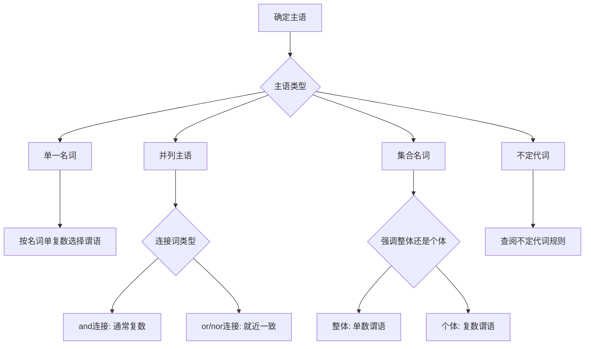
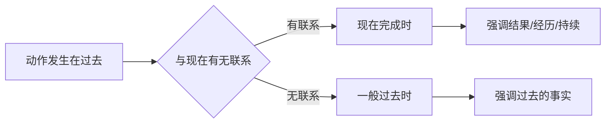
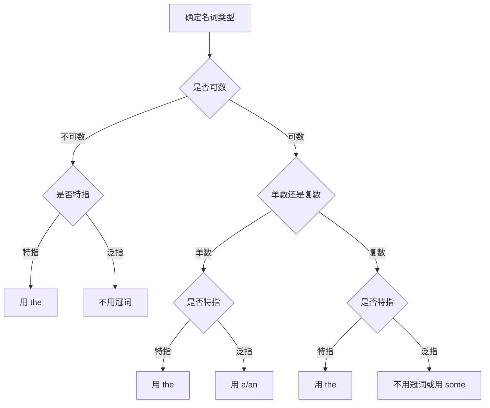
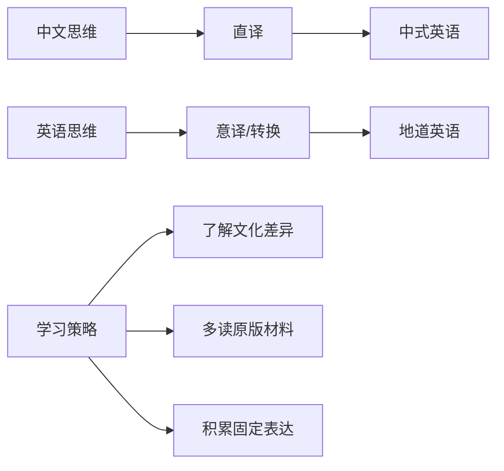
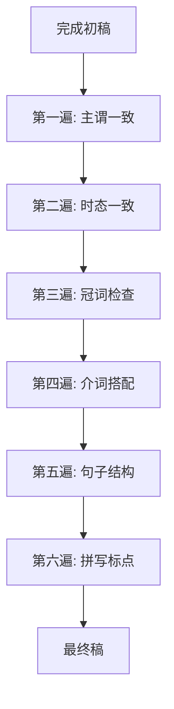

# 常见语法错误纠正

学习英语语法的最终目的是能够正确、流畅地使用英语进行交流。然而，由于中英两种语言在思维方式、表达习惯和语法结构上存在巨大差异，中国学生在英语学习过程中往往会产生一些典型的、反复出现的语法错误。这些错误有的源于母语负迁移，有的源于对英语规则的误解，还有的源于学习过程中的过度泛化。

本章将系统分析中国学生最常见的语法错误类型，揭示错误产生的深层原因，提供大量正误对比例句，并介绍有效的自我纠错方法。通过学习本章内容，读者将能够识别自己写作和口语中的语法问题，建立起自我检查和纠正的能力。

---

## 1. 主谓一致问题

主谓一致是英语语法中最基本也是最容易出错的规则之一。英语要求谓语动词在人称和数上与主语保持一致，而中文动词没有这种形态变化，这导致中国学生经常在这个问题上犯错。

### 1.1 基本规则回顾

主谓一致遵循三个基本原则：语法一致、意义一致和就近一致。

> [!info] 主谓一致三原则
>
> **语法一致**：主语是单数，谓语用单数形式；主语是复数，谓语用复数形式
>
> **意义一致**：根据主语表达的实际意义决定谓语的单复数
>
> **就近一致**：谓语与最靠近它的主语在数上保持一致

主谓一致的判断需要首先确定真正的主语是什么，然后根据主语的类型选择相应的规则。很多错误产生于无法正确识别句子的主语，或者不了解某些特殊主语的单复数规则。

### 1.2 常见错误类型

#### 1.2.1 忽略第三人称单数

这是最基础也是最常见的错误。中文动词没有人称变化，学生往往忘记在一般现在时中给第三人称单数主语的谓语动词加 -s/-es。

| 错误句子 | 正确句子 | 错误分析 |
| --- | --- | --- |
| ❌ She work in a bank. | ✅ She **works** in a bank. | work 需变为 works |
| ❌ The sun rise in the east. | ✅ The sun **rises** in the east. | rise 需变为 rises |
| ❌ He always go to school by bus. | ✅ He always **goes** to school by bus. | go 需变为 goes |
| ❌ My mother cook dinner every day. | ✅ My mother **cooks** dinner every day. | cook 需变为 cooks |
| ❌ This machine make strange noises. | ✅ This machine **makes** strange noises. | make 需变为 makes |

> [!warning] 特别注意
>
> 助动词 does 后面的动词要用原形：
> - ❌ She doesn't works here.
> - ✅ She doesn't **work** here.
>
> 疑问句中 does 已经体现了第三人称单数，动词不再变化：
> - ❌ Does he likes coffee?
> - ✅ Does he **like** coffee?

#### 1.2.2 介词短语干扰

当主语后面跟有介词短语时，学生容易被介词宾语的单复数所干扰，错误地让谓语与介词宾语保持一致。

| 错误句子 | 正确句子 | 错误分析 |
| --- | --- | --- |
| ❌ The quality of these products **are** poor. | ✅ The quality of these products **is** poor. | 主语是 quality（单数） |
| ❌ One of my friends **are** a doctor. | ✅ One of my friends **is** a doctor. | 主语是 one（单数） |
| ❌ The price of vegetables **have** increased. | ✅ The price of vegetables **has** increased. | 主语是 price（单数） |
| ❌ A group of students **are** waiting outside. | ✅ A group of students **is** waiting outside. | 主语是 group（单数） |
| ❌ The list of participants **include** 50 names. | ✅ The list of participants **includes** 50 names. | 主语是 list（单数） |

> [!tip] 识别技巧
>
> 找出句子的真正主语，可以用"划线法"：将介词短语用括号括起来或划掉，剩下的名词就是主语。
>
> The quality (of these products) **is** poor.
> One (of my friends) **is** a doctor.

#### 1.2.3 不定代词的主谓一致

不定代词的单复数规则较为复杂，学生需要记住每类不定代词的特点。

**永远作单数的不定代词**：

| 不定代词 | 例句 |
| --- | --- |
| everyone/everybody | Everyone **is** here. |
| someone/somebody | Somebody **has** taken my book. |
| anyone/anybody | Is anybody **willing** to help? |
| no one/nobody | Nobody **knows** the answer. |
| everything | Everything **is** ready. |
| something | Something **is** wrong. |
| anything | Is anything **missing**? |
| nothing | Nothing **happens** by chance. |
| each | Each student **has** a textbook. |
| either | Either answer **is** acceptable. |
| neither | Neither solution **works**. |

**永远作复数的不定代词**：

| 不定代词 | 例句 |
| --- | --- |
| both | Both students **are** absent. |
| few | Few people **understand** this. |
| many | Many students **have** passed the exam. |
| several | Several options **are** available. |
| others | Others **disagree** with this view. |

**根据语境变化的不定代词**（all, some, any, none, most, half）：

| 语境 | 例句 |
| --- | --- |
| 指代不可数名词 | Most of the water **is** polluted. |
| 指代复数名词 | Most of the students **are** present. |
| 指代单数概念 | All of the cake **has** been eaten. |
| 指代复数概念 | All of the cakes **have** been eaten. |

#### 1.2.4 集合名词的主谓一致

集合名词可以作单数也可以作复数，取决于是强调整体还是个体成员。

| 集合名词 | 作整体（单数） | 作个体（复数） |
| --- | --- | --- |
| family | My family **is** large. | My family **are** all teachers. |
| team | The team **is** playing well. | The team **are** wearing their new uniforms. |
| class | The class **is** in Room 201. | The class **are** doing different projects. |
| committee | The committee **has** made a decision. | The committee **are** divided on this issue. |
| audience | The audience **was** very large. | The audience **were** clapping their hands. |

> [!example] 对比分析
>
> **强调整体**：
> The family **is** moving to a new city next month.
> （整个家庭作为一个单位搬家）
>
> **强调个体**：
> The family **are** having different opinions on where to move.
> （家庭成员各有不同意见）

### 1.3 特殊结构的主谓一致

#### 1.3.1 There be 句型

There be 句型中，be 动词的单复数取决于后面最近的名词。

| 句型结构 | 例句 |
| --- | --- |
| There is + 单数名词 | There **is** a book on the desk. |
| There are + 复数名词 | There **are** many books on the desk. |
| There is + 不可数名词 | There **is** some water in the bottle. |
| 就近一致 | There **is** a pen and two books on the table. |
| 就近一致 | There **are** two books and a pen on the table. |

#### 1.3.2 定语从句中的主谓一致

定语从句的谓语动词要与先行词保持一致。

| 先行词 | 例句 |
| --- | --- |
| 单数先行词 | He is one of the students who **work** hard.（先行词是 students） |
| 单数先行词 | He is the only one of the students who **works** hard.（先行词是 the only one） |
| 复数先行词 | The books that **are** on the shelf belong to me. |
| 单数先行词 | The book that **is** on the shelf belongs to me. |

> [!warning] 易错点
>
> "one of the + 复数名词 + 定语从句" 结构中，从句谓语用复数，因为先行词是复数名词：
> - He is one of the students who **are** hardworking.（students 是先行词）
>
> 但 "the only one of the + 复数名词 + 定语从句" 结构中，从句谓语用单数，因为先行词是 the only one：
> - He is the only one of the students who **is** hardworking.（the only one 是先行词）

---

## 2. 时态使用错误

时态是英语动词系统的核心，而中文动词没有形态变化，时间概念主要通过时间状语来表达。这种差异导致中国学生在时态选择和使用上经常出错。

### 2.1 时态混用问题

#### 2.1.1 一般现在时与一般过去时混用

学生经常在叙述过去事件时忘记使用过去时态，或者在描述现在状况时错误使用过去时态。

| 错误句子 | 正确句子 | 错误分析 |
| --- | --- | --- |
| ❌ Yesterday I **go** to the supermarket. | ✅ Yesterday I **went** to the supermarket. | 有 yesterday，应用过去时 |
| ❌ Last week she **visits** her grandmother. | ✅ Last week she **visited** her grandmother. | 有 last week，应用过去时 |
| ❌ I **bought** this computer two years ago and I still **use** it now. | ✅ I **bought** this computer two years ago and I still **use** it now. | 两个时态都对，但很多学生会全用过去时 |
| ❌ He **lived** in Beijing now. | ✅ He **lives** in Beijing now. | 有 now，应用现在时 |

> [!tip] 时态选择口诀
>
> **看时间状语定时态**：
> - yesterday, last week, ago, in 2020 → 过去时
> - now, today, usually, always → 现在时
> - tomorrow, next week, in the future → 将来时
>
> **没有时间状语看语境**：
> - 讲述过去的故事 → 过去时
> - 描述现在的状态 → 现在时
> - 表达客观真理 → 现在时

#### 2.1.2 现在完成时与一般过去时混用

这是中国学生最容易混淆的两个时态。很多学生不清楚什么时候用现在完成时，什么时候用一般过去时。

| 错误句子 | 正确句子 | 错误分析 |
| --- | --- | --- |
| ❌ I **have been** to Beijing last year. | ✅ I **went** to Beijing last year. | 有具体过去时间 last year，不能用完成时 |
| ❌ I **saw** this movie before. | ✅ I **have seen** this movie before. | before 暗示与现在有联系，用完成时 |
| ❌ He **has graduated** from college in 2018. | ✅ He **graduated** from college in 2018. | 有具体年份，用过去时 |
| ❌ I **lost** my key. Can you help me find it? | ✅ I **have lost** my key. Can you help me find it? | 强调现在的结果（钥匙现在还没找到） |
| ❌ She **lived** here for ten years. | ✅ She **has lived** here for ten years. | for ten years 表示持续到现在，用完成时 |

> [!info] 关键区别
>
> **一般过去时**：动作在过去某个时间发生并结束，与现在无关
> - I **read** the book yesterday.（昨天读了，强调过去的动作）
>
> **现在完成时**：动作虽然发生在过去，但对现在有影响
> - I **have read** the book.（读过了，强调现在知道内容）

#### 2.1.3 进行时态的误用

学生有时会在不应该使用进行时态的地方使用进行时，或者在应该使用进行时的地方使用一般时态。

| 错误句子 | 正确句子 | 错误分析 |
| --- | --- | --- |
| ❌ I **am knowing** the answer. | ✅ I **know** the answer. | know 是状态动词，不用进行时 |
| ❌ She **is loving** chocolate. | ✅ She **loves** chocolate. | love 是状态动词，不用进行时 |
| ❌ I **am having** a car. | ✅ I **have** a car. | have 表示"拥有"时不用进行时 |
| ❌ When I arrived, he **left**. | ✅ When I arrived, he **was leaving**. | 强调到达时他正在离开 |
| ❌ What **do you do** now? | ✅ What **are you doing** now? | now 强调此刻正在做的事 |

> [!warning] 不能用于进行时态的动词
>
> **感官动词**：see, hear, smell, taste, feel
> **情感动词**：love, like, hate, prefer, want, wish
> **认知动词**：know, understand, believe, remember, forget, think（表示"认为"时）
> **所属动词**：have（表示"拥有"）, own, belong, possess
> **存在动词**：be, exist, seem, appear
>
> 但这些动词在特定含义下可以用进行时：
> - I'**m thinking** about your proposal.（think 表示"考虑"）
> - She'**s having** dinner.（have 表示"吃"）
> - I'**m seeing** the doctor tomorrow.（see 表示"看望"）

### 2.2 时态一致性问题

在复合句或段落中，时态需要保持一致或合理过渡。学生经常在同一段落中随意切换时态，造成表达混乱。

| 错误段落 | 正确段落 |
| --- | --- |
| ❌ Yesterday I **go** to the park. I **see** many people there. They **are playing** basketball. | ✅ Yesterday I **went** to the park. I **saw** many people there. They **were playing** basketball. |
| ❌ He **said** that he **is** busy and **can't** come. | ✅ He **said** that he **was** busy and **couldn't** come. |
| ❌ I **didn't know** what **is** happening. | ✅ I **didn't know** what **was** happening. |

> [!tip] 时态一致原则
>
> **主句是过去时，从句通常也用过去时态**（时态后移）：
> - 一般现在时 → 一般过去时
> - 现在进行时 → 过去进行时
> - 现在完成时 → 过去完成时
> - 一般将来时 → 过去将来时
>
> **例外情况**（从句可以不后移）：
> - 表达客观真理：He said that the earth **goes** around the sun.
> - 表达习惯性动作：She told me that she **gets** up at 6 every day.

---

## 3. 冠词使用问题

冠词是中国学生学习英语时最头疼的语法项目之一。中文没有冠词系统，学生往往不知道什么时候用 a/an，什么时候用 the，什么时候不用冠词。

### 3.1 冠词遗漏

最常见的错误是该用冠词的地方没有用冠词。

| 错误句子 | 正确句子 | 错误分析 |
| --- | --- | --- |
| ❌ I bought **book** yesterday. | ✅ I bought **a book** yesterday. | 可数名词单数首次提及用 a |
| ❌ **Sun** rises in the east. | ✅ **The sun** rises in the east. | 世界上独一无二的事物用 the |
| ❌ She is **doctor**. | ✅ She is **a doctor**. | 表示职业的可数名词需要冠词 |
| ❌ I want to go to **United States**. | ✅ I want to go to **the United States**. | 某些国家名前需要 the |
| ❌ He is playing **piano**. | ✅ He is playing **the piano**. | 演奏乐器用 the |
| ❌ **Elephant** is a large animal. | ✅ **The elephant** is a large animal. | 泛指某类事物用 the + 单数名词 |

### 3.2 冠词多余

有时学生会在不需要冠词的地方添加冠词。

| 错误句子 | 正确句子 | 错误分析 |
| --- | --- | --- |
| ❌ I like **the** music. | ✅ I like music. | 泛指抽象概念不用冠词 |
| ❌ **The** life is beautiful. | ✅ Life is beautiful. | 泛指生活/生命不用冠词 |
| ❌ I have **the** breakfast at 7. | ✅ I have breakfast at 7. | 三餐前通常不用冠词 |
| ❌ She goes to **the** school every day. | ✅ She goes to school every day. | 表示去学校上学不用 the |
| ❌ I speak **the** English. | ✅ I speak English. | 语言名称前不用冠词 |
| ❌ **The** most students passed the exam. | ✅ Most students passed the exam. | most 作"大多数"时不用 the |

### 3.3 冠词误用

学生有时会用错冠词，把 a 用成 the 或把 the 用成 a。

| 错误句子 | 正确句子 | 错误分析 |
| --- | --- | --- |
| ❌ I saw **a** movie yesterday. **A** movie was great. | ✅ I saw **a** movie yesterday. **The** movie was great. | 第二次提及用 the |
| ❌ He is **a** tallest boy in class. | ✅ He is **the** tallest boy in class. | 最高级前用 the |
| ❌ I need **an** umbrella. | ✅ I need **an** umbrella. | 正确（以元音音素开头） |
| ❌ He is **a** honest man. | ✅ He is **an** honest man. | honest 的 h 不发音，用 an |
| ❌ I bought **an** uniform. | ✅ I bought **a** uniform. | uniform 以辅音音素 /juː/ 开头，用 a |
| ❌ It's **an** university. | ✅ It's **a** university. | university 以辅音音素 /juː/ 开头，用 a |

> [!info] a 与 an 的选择
>
> **看发音，不看拼写！**
>
> **用 an 的情况**（元音音素开头）：
> - an apple, an egg, an idea, an orange, an umbrella
> - an hour（h 不发音）, an honest man, an heir
>
> **用 a 的情况**（辅音音素开头）：
> - a book, a cat, a dog, a university, a European country
> - a uniform, a useful tool（u 发 /juː/）
> - a one-way street（o 发 /wʌ/）

### 3.4 冠词使用规则总结

| 情况 | 用法 | 例句 |
| --- | --- | --- |
| 可数名词单数首次提及 | a/an | I bought **a** book. |
| 可数名词单数再次提及 | the | **The** book is interesting. |
| 可数名词复数泛指 | 零冠词 | **Books** are useful. |
| 可数名词复数特指 | the | **The books** on the shelf are mine. |
| 不可数名词泛指 | 零冠词 | **Water** is essential for life. |
| 不可数名词特指 | the | **The water** in this bottle is clean. |
| 独一无二的事物 | the | **the** sun, **the** moon, **the** earth |
| 最高级形容词 | the | **the** best, **the** most important |
| 序数词 | the | **the** first, **the** second |
| 演奏乐器 | the | play **the** piano/guitar/violin |
| 三餐名称 | 零冠词 | have breakfast/lunch/dinner |
| 球类运动 | 零冠词 | play basketball/football/tennis |
| 语言名称 | 零冠词 | speak English/Chinese/French |
| 学科名称 | 零冠词 | study mathematics/physics/history |

---

## 4. 介词搭配错误

介词是英语中最灵活也是最难掌握的词类之一。中文的介词用法与英语差异很大，学生经常因为母语干扰而选错介词。

### 4.1 时间介词错误

| 错误句子 | 正确句子 | 正确用法 |
| --- | --- | --- |
| ❌ I was born **in** March 15. | ✅ I was born **on** March 15. | 具体日期用 on |
| ❌ She arrived **at** Monday. | ✅ She arrived **on** Monday. | 星期几用 on |
| ❌ I get up **in** 6 o'clock. | ✅ I get up **at** 6 o'clock. | 具体时刻用 at |
| ❌ He will come back **on** two weeks. | ✅ He will come back **in** two weeks. | "在...之后"用 in |
| ❌ I've been waiting **from** 3 hours. | ✅ I've been waiting **for** 3 hours. | 持续时间用 for |
| ❌ The meeting starts **on** the morning. | ✅ The meeting starts **in** the morning. | 上午/下午/晚上用 in |
| ❌ I work **in** night. | ✅ I work **at** night. | night 前用 at |

> [!info] 时间介词速记
>
> **at**：时刻（at 8 o'clock）、特定时间点（at noon, at midnight, at night）
>
> **on**：日期（on May 1st）、星期（on Monday）、特定日子（on Christmas Day）
>
> **in**：年/月/季节（in 2024, in May, in summer）、一天中的时段（in the morning/afternoon/evening）、"在...之后"（in two weeks）
>
> **for**：持续时间（for three hours, for a week）
>
> **since**：从某时间点开始（since 2020, since Monday）

### 4.2 地点介词错误

| 错误句子 | 正确句子 | 正确用法 |
| --- | --- | --- |
| ❌ I live **on** Beijing. | ✅ I live **in** Beijing. | 大城市用 in |
| ❌ She is **in** home. | ✅ She is **at** home. | home 前用 at |
| ❌ I arrived **in** the station. | ✅ I arrived **at** the station. | 小地点用 at |
| ❌ The picture is **in** the wall. | ✅ The picture is **on** the wall. | 墙上的东西用 on |
| ❌ There is a hole **on** the wall. | ✅ There is a hole **in** the wall. | 嵌入墙内用 in |
| ❌ I sat **in** the corner of the room. | ✅ I sat **in** the corner of the room. | 室内的角落用 in |
| ❌ I waited **in** the corner of the street. | ✅ I waited **on/at** the corner of the street. | 街角用 on/at |

> [!tip] in, on, at 地点用法区别
>
> **in**：在某个空间/范围内部
> - in the room, in the city, in the country, in the world
> - in the corner（室内角落）
>
> **on**：在表面上
> - on the table, on the wall（贴在墙上）, on the floor
> - on the street（英式用 in）
>
> **at**：在某个点/小地点
> - at the door, at the bus stop, at home, at school
> - at the corner（外部角落）

### 4.3 动词介词搭配错误

很多动词有固定的介词搭配，学生经常因为不熟悉这些搭配而出错。

| 错误句子 | 正确句子 | 正确搭配 |
| --- | --- | --- |
| ❌ I'm interested **for** music. | ✅ I'm interested **in** music. | be interested in |
| ❌ She's good **in** English. | ✅ She's good **at** English. | be good at |
| ❌ I depend **to** my parents. | ✅ I depend **on** my parents. | depend on |
| ❌ He arrived **to** the airport. | ✅ He arrived **at** the airport. | arrive at（小地点） |
| ❌ I agree **to** your opinion. | ✅ I agree **with** your opinion. | agree with sb./sth. |
| ❌ Please listen **the** teacher. | ✅ Please listen **to** the teacher. | listen to |
| ❌ I'm looking **at** my keys. | ✅ I'm looking **for** my keys. | look for（寻找） |
| ❌ He laughed **on** me. | ✅ He laughed **at** me. | laugh at |
| ❌ I'm afraid **from** dogs. | ✅ I'm afraid **of** dogs. | be afraid of |
| ❌ The book consists **from** 10 chapters. | ✅ The book consists **of** 10 chapters. | consist of |

### 4.4 常见介词搭配总结

| 介词 | 常见动词/形容词搭配 |
| --- | --- |
| **in** | be interested in, be involved in, succeed in, result in, believe in |
| **on** | depend on, rely on, insist on, concentrate on, focus on, based on |
| **at** | be good at, be surprised at, look at, laugh at, arrive at（小地点） |
| **of** | be afraid of, be proud of, be aware of, consist of, think of, dream of |
| **to** | listen to, belong to, look forward to, be used to, contribute to |
| **with** | agree with, be satisfied with, be familiar with, deal with, be compared with |
| **for** | wait for, look for, prepare for, be famous for, apply for, thank for |
| **from** | be different from, suffer from, prevent from, benefit from, escape from |
| **about** | think about, talk about, worry about, be excited about, be curious about |

---

## 5. 句子结构问题

句子结构错误往往源于中英文表达习惯的差异。中国学生习惯用中文思维组织英文句子，导致句子结构不符合英语语法规则。

### 5.1 主语缺失或多余

英语句子（除祈使句外）必须有主语，但中文经常省略主语。

| 错误句子 | 正确句子 | 错误分析 |
| --- | --- | --- |
| ❌ **Is** raining outside. | ✅ **It** is raining outside. | 天气句型需要 it 作形式主语 |
| ❌ **Is** important to study hard. | ✅ **It** is important to study hard. | it 作形式主语 |
| ❌ In China, **is** common to eat rice. | ✅ In China, **it** is common to eat rice. | it 作形式主语 |
| ❌ **Has** many students in the classroom. | ✅ **There are** many students in the classroom. | 存在句需要 there be |
| ❌ **I** myself don't understand. | ✅ I don't understand. 或 I myself don't understand. | 后者强调"我自己"时正确 |

### 5.2 动词缺失或多余

#### 5.2.1 系动词缺失

中文的判断句不需要"是"字，但英语必须有 be 动词。

| 错误句子 | 正确句子 | 错误分析 |
| --- | --- | --- |
| ❌ She **beautiful**. | ✅ She **is** beautiful. | 需要系动词 is |
| ❌ The weather **very cold** today. | ✅ The weather **is** very cold today. | 需要系动词 is |
| ❌ He **a teacher**. | ✅ He **is** a teacher. | 需要系动词 is |
| ❌ This book **interesting**. | ✅ This book **is** interesting. | 需要系动词 is |

#### 5.2.2 动词重复

英语句子中一般只能有一个谓语动词（除非用连词连接）。

| 错误句子 | 正确句子 | 错误分析 |
| --- | --- | --- |
| ❌ I **am agree** with you. | ✅ I **agree** with you. | agree 本身是动词，不需要 am |
| ❌ She **is like** music. | ✅ She **likes** music. | like 是动词，不需要 is |
| ❌ I **am want** to go home. | ✅ I **want** to go home. | want 是动词，不需要 am |
| ❌ He **can to swim**. | ✅ He **can swim**. | 情态动词后用原形，不加 to |
| ❌ I **suggest to go** there. | ✅ I **suggest going** there. | suggest 后接动名词 |

### 5.3 语序错误

#### 5.3.1 形容词语序

多个形容词修饰名词时，英语有固定的语序，中文则较为灵活。

| 错误句子 | 正确句子 | 正确语序 |
| --- | --- | --- |
| ❌ a Chinese old man | ✅ an old Chinese man | 年龄在国籍前 |
| ❌ a leather brown bag | ✅ a brown leather bag | 颜色在材质前 |
| ❌ a wooden big table | ✅ a big wooden table | 大小在材质前 |
| ❌ a beautiful young Chinese girl | ✅ a beautiful young Chinese girl | 正确（观点-年龄-国籍） |

> [!info] 形容词顺序规则
>
> **限定词 → 观点 → 大小 → 形状 → 年龄 → 颜色 → 国籍 → 材质 → 用途**
>
> 可以用 "**OSASCOMP**" 记忆：
> - **O**pinion（观点）: beautiful, nice, terrible
> - **S**ize（大小）: big, small, tall
> - **A**ge（年龄）: old, young, new
> - **S**hape（形状）: round, square, long
> - **C**olor（颜色）: red, blue, green
> - **O**rigin（来源）: Chinese, American, French
> - **M**aterial（材质）: wooden, leather, metal
> - **P**urpose（用途）: sleeping (bag), writing (desk)

#### 5.3.2 副词语序

副词在句中的位置较为灵活，但有些位置是错误的。

| 错误句子 | 正确句子 | 说明 |
| --- | --- | --- |
| ❌ I **very** like it. | ✅ I like it **very much**. | very 不能单独修饰动词 |
| ❌ She speaks **fluently** English. | ✅ She speaks English **fluently**. | 方式副词通常放在宾语后 |
| ❌ I **always** am late. | ✅ I **am always** late. | 频率副词放在 be 动词后 |
| ❌ He **carefully** read the document. | ✅ He read the document **carefully**. 或 He **carefully** read the document. | 方式副词可放动词前或宾语后 |

#### 5.3.3 疑问句语序

疑问句需要倒装语序，这是中国学生经常忽视的。

| 错误句子 | 正确句子 | 错误分析 |
| --- | --- | --- |
| ❌ **You are** where going? | ✅ **Where are you** going? | 特殊疑问句需要倒装 |
| ❌ **He is** a teacher? | ✅ **Is he** a teacher? | 一般疑问句需要倒装 |
| ❌ I wonder **where is he**. | ✅ I wonder **where he is**. | 间接疑问句用陈述语序 |
| ❌ **What you want** to eat? | ✅ **What do you want** to eat? | 需要助动词 do |
| ❌ **Why you didn't** come yesterday? | ✅ **Why didn't you** come yesterday? | 否定疑问句需要倒装 |

### 5.4 从句结构错误

#### 5.4.1 缺少连接词

中文从句常常不需要明确的连接词，但英语从句必须有连接词引导。

| 错误句子 | 正确句子 | 错误分析 |
| --- | --- | --- |
| ❌ I think **he is right** is obvious. | ✅ **That** I think he is right is obvious. 或 I think it is obvious **that** he is right. | 主语从句需要 that |
| ❌ The book I bought yesterday is great. | ✅ The book **(that/which)** I bought yesterday is great. | 定语从句可省略 that/which（作宾语时） |
| ❌ I don't know **he will come**. | ✅ I don't know **if/whether** he will come. | 需要连接词 if/whether |
| ❌ The reason I was late **because** I missed the bus. | ✅ The reason I was late **is that** I missed the bus. 或 I was late **because** I missed the bus. | reason 后用 is that，不用 because |

#### 5.4.2 从句结构重复

有些学生会同时使用两个表达相同意义的连接成分。

| 错误句子 | 正确句子 | 错误分析 |
| --- | --- | --- |
| ❌ **Although** he is young, **but** he is very capable. | ✅ **Although** he is young, he is very capable. 或 He is young, **but** he is very capable. | although 和 but 不能同时使用 |
| ❌ **Because** it was raining, **so** we stayed home. | ✅ **Because** it was raining, we stayed home. 或 It was raining, **so** we stayed home. | because 和 so 不能同时使用 |
| ❌ The reason why I came late **is because** the traffic. | ✅ The reason why I came late **is that** there was traffic. | reason 后用 is that |

---

## 6. 中式英语典型错误

中式英语（Chinglish）是中国学生在英语表达中受母语干扰而产生的不地道表达。这些表达虽然可能在语法上正确，但不符合英语的表达习惯。

### 6.1 词汇直译错误

| 中文表达 | 中式英语 | 地道英语 | 说明 |
| --- | --- | --- | --- |
| 开夜车 | ❌ drive a night car | ✅ burn the midnight oil | 意译更准确 |
| 给你添麻烦了 | ❌ give you trouble | ✅ sorry to trouble you | 表达歉意 |
| 我很方便 | ❌ I am very convenient | ✅ It's convenient for me | convenient 不能形容人 |
| 人山人海 | ❌ people mountain people sea | ✅ a sea of people / crowded | 意译 |
| 加油 | ❌ add oil | ✅ come on / go for it | 鼓励用语 |
| 身体很好 | ❌ body is very good | ✅ in good health | 固定表达 |
| 好好学习，天天向上 | ❌ good good study, day day up | ✅ study hard and make progress every day | 需要意译 |
| 马马虎虎 | ❌ horse horse tiger tiger | ✅ so-so / just OK | 意译 |
| 没门儿 | ❌ no door | ✅ no way | 习语翻译 |
| 拍马屁 | ❌ pat horse butt | ✅ kiss up to / flatter | 意译 |

### 6.2 语法结构直译

| 中文表达 | 中式英语 | 地道英语 | 错误原因 |
| --- | --- | --- | --- |
| 虽然...但是... | ❌ Although..., but... | ✅ Although..., ... | 连词不能连用 |
| 价格很便宜 | ❌ The price is cheap | ✅ The price is low / It's cheap | cheap 修饰商品，不修饰价格 |
| 我的英语很差 | ❌ My English is very poor | ✅ My English is not good / I'm not good at English | poor 用于形容人的状态时有其他含义 |
| 我没有车 | ❌ I have not car | ✅ I don't have a car | have 的否定形式 |
| 这本书很值得读 | ❌ This book is worth to read | ✅ This book is worth reading | worth 后接动名词 |
| 我喜欢读书 | ❌ I like read books | ✅ I like reading books / I like to read books | like 后接动名词或不定式 |
| 让我们一起来... | ❌ Let us together... | ✅ Let's... together | together 放在句末 |
| 这里人很多 | ❌ Here people very many | ✅ There are many people here | 需要 there be 句型 |

### 6.3 思维方式差异

| 思维差异 | 中式表达 | 地道表达 | 思维转换 |
| --- | --- | --- | --- |
| 主语选择 | ❌ China's economy develops fast | ✅ China's economy is developing rapidly | 名词→动词 |
| 被动表达 | ❌ My phone was stolen | ✅ I got my phone stolen | 换用 get 结构 |
| 数量表达 | ❌ 3 thousands people | ✅ 3 thousand people | thousand 前有数词不加 s |
| 比较表达 | ❌ compare A and B | ✅ compare A with/to B | 固定搭配 |
| 原因表达 | ❌ The reason is because... | ✅ The reason is that... | 避免语义重复 |
| 建议表达 | ❌ I suggest you to do... | ✅ I suggest (that) you do... | suggest 的用法 |

### 6.4 常见中式英语对照表

> [!warning] 这些表达要避免
>
> | 中式英语 | 地道英语 |
> | --- | --- |
> | open/close the light | turn on/off the light |
> | open/close the TV | turn on/off the TV |
> | do you have time? | are you free? / do you have a minute? |
> | I very like it | I like it very much |
> | long time no see | it's been a while（虽然 long time no see 现在也被接受） |
> | give me a hand | help me out |
> | I think maybe... | I think... / Maybe... |
> | no problem（回应感谢） | you're welcome / my pleasure |
> | I am a student of Beijing University | I am a student at Beijing University |
> | my home | my house（指建筑物）/ my home（指家庭） |

---

## 7. 自我纠错方法

掌握自我纠错的方法，是提高英语写作和口语水平的关键。本节介绍几种有效的自我检查和纠错策略。

### 7.1 系统性检查清单

在完成一篇英语作文后，可以按照以下清单逐项检查：

#### 7.1.1 主谓一致检查

- [ ] 找出每个句子的主语和谓语
- [ ] 检查第三人称单数是否加了 -s/-es
- [ ] 检查介词短语后面的主语，确保谓语与真正的主语一致
- [ ] 检查不定代词的谓语形式是否正确
- [ ] 检查 there be 句型的动词形式

#### 7.1.2 时态检查

- [ ] 确定文章的主要时态（现在/过去/将来）
- [ ] 检查时间状语与时态是否匹配
- [ ] 检查从句的时态是否与主句保持一致
- [ ] 检查是否有不必要的时态混用

#### 7.1.3 冠词检查

- [ ] 可数名词单数前是否有冠词
- [ ] 首次提及是否用 a/an，再次提及是否用 the
- [ ] 不可数名词和复数名词泛指时是否正确省略冠词
- [ ] a 和 an 的选择是否基于发音

#### 7.1.4 介词检查

- [ ] 时间介词是否正确（at/on/in）
- [ ] 地点介词是否正确
- [ ] 动词-介词搭配是否正确
- [ ] 形容词-介词搭配是否正确

#### 7.1.5 句子结构检查

- [ ] 每个句子是否有主语（祈使句除外）
- [ ] 每个句子是否有且只有一个谓语动词
- [ ] 从句是否有正确的引导词
- [ ] 连词是否使用正确（避免 although...but 等）

### 7.2 朗读法

朗读是发现语法错误的有效方法。很多错误在默读时不易察觉，但朗读时会显得不自然。

> [!tip] 朗读检查步骤
>
> 1. **大声朗读全文**：注意语感上的不顺畅之处
> 2. **标记可疑句子**：将读起来别扭的句子标出
> 3. **逐句分析**：检查标记句子的语法结构
> 4. **再次朗读**：修改后再读一遍确认

朗读时要特别注意：
- 主谓是否搭配（She works... 听起来比 She work... 自然）
- 冠词是否完整（a book 听起来比 book 完整）
- 动词形式是否正确（I went there 比 I go there yesterday 自然）

### 7.3 逆向翻译法

将写好的英文翻译回中文，再将中文翻译成英文，对比两个英文版本，可以发现表达上的问题。

| 步骤 | 内容 |
| --- | --- |
| 1. 原文 | I have been to Beijing in last year. |
| 2. 译成中文 | 我去年去过北京。 |
| 3. 再译成英文 | I went to Beijing last year. 或 I have been to Beijing before. |
| 4. 对比分析 | 原文混淆了现在完成时和一般过去时的用法 |

### 7.4 高频错误记录法

建立个人的"错误档案"，记录自己反复犯的错误，定期复习。

| 日期 | 错误句子 | 正确句子 | 错误类型 | 反复次数 |
| --- | --- | --- | --- | --- |
| 2024-01-15 | She work hard. | She works hard. | 主谓一致 | 5 |
| 2024-01-18 | I interesting in music. | I am interested in music. | 缺少系动词 | 3 |
| 2024-01-20 | He suggested to go. | He suggested going. | 动词搭配 | 2 |

> [!example] 错误档案的使用方法
>
> 1. **记录**：每次写作或口语练习后，记录发现的错误
> 2. **分类**：按错误类型分类（主谓一致、时态、冠词等）
> 3. **复习**：每周复习一次，特别关注高频错误
> 4. **检测**：做专项练习测试是否真正掌握
> 5. **更新**：已经克服的错误可以标记或删除

### 7.5 对照检查表

以下是一份可以打印使用的作文检查表：

| 检查项 | 检查要点 | 是否通过 |
| --- | --- | --- |
| **主谓一致** | 单三加 s，主语与谓语数一致 | ☐ |
| **时态正确** | 时态与时间状语匹配，时态一致性 | ☐ |
| **冠词使用** | 可数名词单数有冠词，a/an 正确选择 | ☐ |
| **介词搭配** | 时间/地点介词正确，动词介词固定搭配 | ☐ |
| **句子完整** | 有主语，有谓语，有连接词 | ☐ |
| **词序正确** | 形容词顺序，副词位置，疑问句语序 | ☐ |
| **标点正确** | 句末标点，逗号使用，引号使用 | ☐ |
| **拼写正确** | 无拼写错误，易混词辨别 | ☐ |

---

## 8. 语法错误纠正练习

### 8.1 综合练习

请找出以下句子中的语法错误并改正：

| 序号 | 错误句子 | 正确句子 | 错误类型 |
| --- | --- | --- | --- |
| 1 | Everyone have their own opinion. | Everyone **has** his/her own opinion. | 主谓一致 |
| 2 | I have bought this car since two years. | I **bought** this car two years ago. 或 I have **had** this car **for** two years. | 时态错误 |
| 3 | She is a university student. | She is **a** university student. | 正确（a 不是 an） |
| 4 | I very like playing basketball. | I like playing basketball **very much**. | 副词位置 |
| 5 | Although he is tired, but he keeps working. | Although he is tired, he keeps working. | 连词重复 |
| 6 | The news are very exciting. | The news **is** very exciting. | news 是不可数名词 |
| 7 | He suggested me to try again. | He suggested **that I (should) try** again. | suggest 用法 |
| 8 | I'm looking forward to see you. | I'm looking forward to **seeing** you. | to 是介词，后接动名词 |
| 9 | She married with a doctor. | She **married** a doctor. | marry 是及物动词 |
| 10 | I have been to Paris last summer. | I **went** to Paris last summer. | 有具体时间用过去时 |

### 8.2 段落纠错练习

请找出以下段落中的所有语法错误：

**错误段落**：
> Yesterday I go to the shopping mall with my friends. There has many people. We spend two hour looking for a gift for my mother. Finally, we find a beautiful leather red bag. The price is very expensive, but I decide to buy it because my mother's birthday is coming. Although it cost me lot of money, but I am very happy.

**正确段落**：
> Yesterday I **went** to the shopping mall with my friends. There **were** many people. We **spent** two **hours** looking for a gift for my mother. Finally, we **found** a beautiful **red leather** bag. The price **was** very **high** (或 It was very expensive), but I **decided** to buy it because my mother's birthday **was** coming. Although it **cost** me **a lot of** money, I **was** very happy.

**错误统计**：
| 错误 | 类型 |
| --- | --- |
| go → went | 时态 |
| has → were | there be 结构 |
| spend → spent | 时态 |
| hour → hours | 名词复数 |
| find → found | 时态 |
| leather red → red leather | 形容词顺序 |
| expensive → high | 词语搭配 |
| decide → decided | 时态 |
| is coming → was coming | 时态一致 |
| lot of → a lot of | 固定短语 |
| Although...but | 连词重复 |
| am → was | 时态 |

---

## 9. 本章小结

本章系统分析了中国学生在英语学习中最常见的语法错误类型，包括：

1. **主谓一致问题**：第三人称单数遗漏、介词短语干扰、不定代词和集合名词的特殊规则

2. **时态使用错误**：现在完成时与一般过去时混淆、进行时态误用、时态一致性问题

3. **冠词使用问题**：冠词遗漏、冠词多余、a/an 误用、the 的正确使用场景

4. **介词搭配错误**：时间介词、地点介词、动词-介词固定搭配

5. **句子结构问题**：主语缺失、动词重复、语序错误、从句结构错误

6. **中式英语**：词汇直译、语法结构直译、思维方式差异

7. **自我纠错方法**：系统检查清单、朗读法、逆向翻译法、错误记录法

> [!success] 学习建议
>
> 1. **建立错误意识**：了解自己最容易犯的错误类型，有针对性地练习
>
> 2. **养成检查习惯**：每次写作后按清单逐项检查
>
> 3. **持续积累**：建立个人错误档案，定期复习
>
> 4. **多读多听**：通过大量输入培养语感，减少母语干扰
>
> 5. **刻意练习**：针对薄弱环节做专项练习

语法错误的纠正是一个长期的过程，需要持续的练习和反思。通过系统学习和刻意练习，大多数常见语法错误都可以被克服。重要的是保持学习的耐心和毅力，把每一次错误都当作进步的机会。
