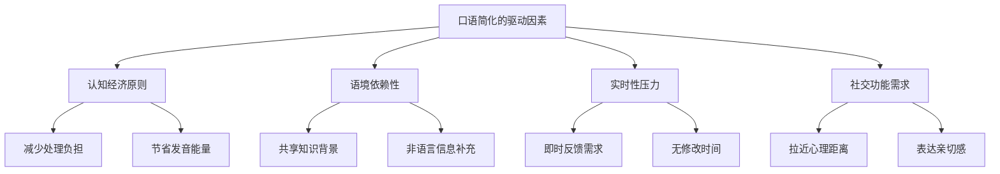
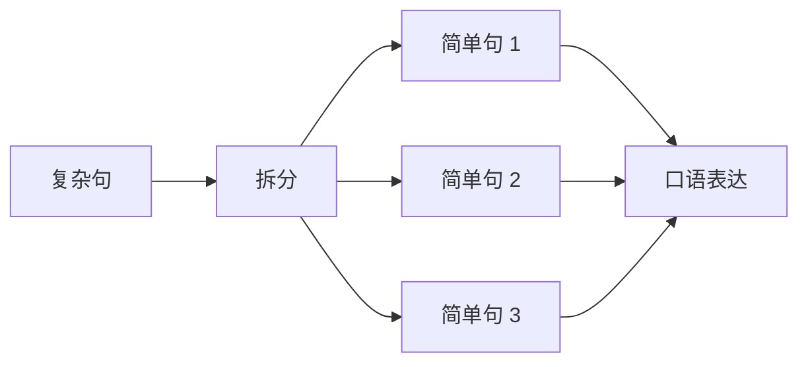
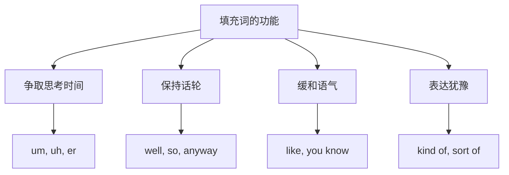
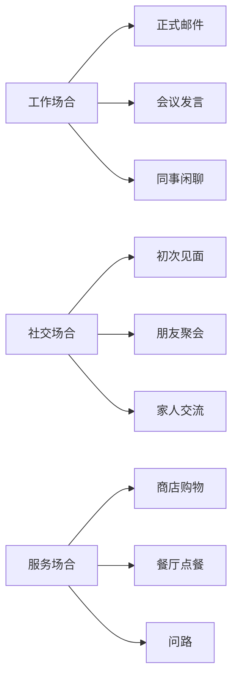

# 口语中的语法简化

## 1. 口语语法的本质特征

### 1.1 口语与书面语的根本差异

英语口语和书面语虽然使用同一套语法体系，但在实际运用中呈现出显著的差异。书面语追求严谨、完整、规范，而口语则追求效率、自然、流畅。理解这种差异是掌握地道口语的第一步。

> [!info] 核心认知
>
> 口语语法简化不是"语法错误"，而是语言在实时交流场景下的自然适应。就像中文口语中我们说"吃了吗？"而不是"你吃过饭了吗？"一样，英语口语也有其独特的简化规律。

**书面语与口语的对比表**：

| 特征维度 | 书面语 | 口语 |
| --- | --- | --- |
| 句子完整性 | 结构完整，主谓宾齐全 | 常省略已知信息 |
| 句子长度 | 可以很长，使用复杂从句 | 倾向短句，信息分段传递 |
| 词汇选择 | 正式、精确、书面化 | 简单、常用、口语化 |
| 语法严谨度 | 严格遵守语法规则 | 允许适度偏离 |
| 冗余度 | 较低，信息密集 | 较高，重复确认 |
| 修正机会 | 可反复修改 | 即时修正，自我纠错 |

**对比示例**：

```
书面语：I would appreciate it if you could inform me of the time
        at which the meeting will commence.
        （如果您能告知我会议开始的时间，我将不胜感激。）

口语：  When does the meeting start?
        （会议什么时候开始？）
```

这两个句子表达的是同一个意思，但口语版本仅用了 6 个词，而书面语版本用了 18 个词。口语追求的是信息传递的效率，而非形式的完整。

### 1.2 口语简化的语言学原理

口语简化并非随意为之，而是遵循特定的语言学原理。



**认知经济原则**（Cognitive Economy）解释了为什么口语倾向于简化：人类大脑在处理语言时会自动寻找最省力的方式。当某些信息可以从语境中推断出来时，说话者就会省略这些信息，而听者也能毫无障碍地理解。

> [!example] 语境补全示例
>
> **场景**：两人在咖啡厅
>
> A: Coffee?（咖啡？）
> B: Black.（黑咖啡。）
> A: Sugar?（加糖吗？）
> B: Two.（两块。）
>
> 这段对话省略了大量语法成分，但双方完全理解对方的意思。完整版本应该是：
>
> A: Would you like some coffee?
> B: I'd like black coffee, please.
> A: Would you like sugar in it?
> B: I'd like two lumps of sugar, please.

### 1.3 口语简化的边界

虽然口语允许简化，但并非无限制的。简化必须在不影响理解的前提下进行。

**可以简化的情况**：
- 听者能从语境中推断出省略的信息
- 省略后不会产生歧义
- 符合英语母语者的语言习惯

**不宜简化的情况**：
- 首次提及某个话题或对象
- 可能产生误解的关键信息
- 正式场合或对陌生人说话时

---

## 2. 主语省略现象

### 2.1 第一人称主语省略

在口语中，第一人称主语 "I" 是最常被省略的成分。这种省略在非正式对话中极为普遍。

**省略规则**：当句子以 "I" 开头，且语境清楚表明说话者在谈论自己时，"I" 可以省略。

| 完整形式 | 省略形式 | 使用场景 |
| --- | --- | --- |
| I don't know. | Don't know. | 表示不确定 |
| I think so. | Think so. | 表示同意 |
| I hope not. | Hope not. | 表示希望否定 |
| I can't believe it. | Can't believe it. | 表示惊讶 |
| I love it. | Love it. | 表示喜爱 |
| I told you. | Told you. | 强调之前说过 |
| I bet. | Bet. | 表示打赌/肯定 |
| I guess so. | Guess so. | 表示猜测 |

**详细例句分析**：

```
完整：I don't know what he's talking about.
省略：Don't know what he's talking about.
      （不知道他在说什么。）

分析：省略主语 "I" 后，句子依然以否定助动词 "don't" 开头，
      语法上仍然完整，且听者能明确理解是说话者自己不知道。
```

```
完整：I'll see you tomorrow.
省略：See you tomorrow.
      （明天见。）

分析：这是最常见的告别用语之一。不仅省略了主语 "I"，
      还省略了助动词 "will"。这种表达已经固化为习语。
```

```
完整：I have got to go now.
省略：Gotta go now.
      （我得走了。）

分析：这里不仅省略了主语 "I"，还将 "have got to"
      缩略为口语形式 "gotta"。
```

> [!warning] 省略限制
>
> 第一人称主语省略主要发生在句首位置。在复合句或从句中，主语通常不能省略：
>
> - ✅ Think he's wrong.（觉得他错了。）— 主句省略 "I"
> - ❌ He said think he's wrong. — 从句中不能省略
> - ✅ He said I think he's wrong.（他说我觉得他错了。）

### 2.2 第二人称主语省略

第二人称主语 "You" 的省略主要出现在祈使句和某些疑问句中。

**祈使句中的省略**（这是标准语法，不算口语简化）：

```
(You) Come here.（过来。）
(You) Be careful.（小心点。）
(You) Don't worry.（别担心。）
```

**口语疑问句中的省略**：

| 完整形式 | 省略形式 | 语境 |
| --- | --- | --- |
| Are you coming? | Coming? | 询问是否一起 |
| Do you want some? | Want some? | 提供东西 |
| Are you ready? | Ready? | 确认准备状态 |
| Do you understand? | Understand? | 确认理解 |
| Have you got it? | Got it? | 确认明白 |
| Are you serious? | Serious? | 表示惊讶 |
| Are you sure? | Sure? | 确认把握 |

**对话示例**：

```
A: Ready?（准备好了吗？）
B: Almost.（差不多了。）
A: Need help?（需要帮忙吗？）
B: Nope, got it.（不用，我搞定了。）

完整版本：
A: Are you ready?
B: I'm almost ready.
A: Do you need help?
B: Nope, I've got it.
```

### 2.3 "It" 和 "There" 的省略

形式主语 "It" 和 "There" 在口语中也经常被省略。

**"It" 的省略**：

```
完整：It doesn't matter.
省略：Doesn't matter.
      （没关系。）

完整：It looks like rain.
省略：Looks like rain.
      （看起来要下雨。）

完整：It sounds good.
省略：Sounds good.
      （听起来不错。）

完整：It serves you right.
省略：Serves you right.
      （活该。）
```

**"There" 的省略**：

```
完整：There you go.
省略：You go. / There you go.（给你。— 这个表达较少省略）

完整：There's no way.
省略：No way.
      （不可能。/没门。）

完整：There's nothing I can do.
省略：Nothing I can do.
      （我无能为力。）
```

> [!tip] 语感培养建议
>
> 判断何时可以省略主语，关键在于：
> 1. 句子开头的动词形式能否暗示主语
> 2. 语境是否足够清晰
> 3. 这种省略是否是英语母语者的习惯用法
>
> 建议多听英语播客、看美剧，记录母语者的省略习惯。

---

## 3. 助动词与系动词的省略

### 3.1 Be 动词的省略

系动词 "be" 在口语中的省略是最常见的简化现象之一，尤其在疑问句和感叹句中。

**疑问句中 "be" 的省略**：

| 完整形式 | 省略形式 | 中文释义 |
| --- | --- | --- |
| Are you okay? | You okay? | 你没事吧？ |
| Is that right? | That right? | 是这样吗？ |
| Is he coming? | He coming? | 他来吗？ |
| Are they here? | They here? | 他们在这吗？ |
| Is it working? | It working? | 能用吗？ |
| Is that all? | That all? | 就这些吗？ |
| Are we done? | We done? | 我们完事了吗？ |

**详细语境分析**：

```
场景：朋友看起来不太舒服

完整：Are you feeling okay? You look a bit pale.
省略：You okay? You look a bit pale.
      （你没事吧？你看起来有点苍白。）

分析：省略 "Are" 后，句子以主语 "You" 开头，通过升调来表示疑问。
      这种省略在关心对方时非常自然。
```

```
场景：确认信息

完整：Is this the right address?
省略：This the right address?
      （这是正确的地址吗？）

分析：省略系动词后，句子结构变为 "主语 + 表语"，
      疑问语气通过语调上扬来传达。
```

**陈述句中 "be" 的省略**（较少见，但存在）：

```
完整：I'm just saying.
省略：Just saying.
      （我只是说说而已。）

完整：I'm not sure.
省略：Not sure.
      （不确定。）

完整：That's too bad.
省略：Too bad.
      （太糟糕了。/太可惜了。）
```

### 3.2 助动词 "Have" 的省略

在完成时态中，助动词 "have/has" 在口语中常被省略，尤其当与主语一起省略时。

```
完整：I have never seen anything like this.
省略：Never seen anything like this.
      （从没见过这种东西。）

完整：Have you ever been to Japan?
省略：Ever been to Japan?
      （去过日本吗？）

完整：I have got to tell you something.
省略：Gotta tell you something.
      （我得告诉你一件事。）
```

**疑问句中的省略**：

| 完整形式 | 省略形式 | 使用语境 |
| --- | --- | --- |
| Have you seen my keys? | Seen my keys? | 找东西 |
| Have you heard the news? | Heard the news? | 分享消息 |
| Have you finished yet? | Finished yet? | 确认完成 |
| Have you eaten? | Eaten? | 关心对方 |

### 3.3 助动词 "Do" 的省略

助动词 "do/does/did" 在口语疑问句中也可以省略，但相对较少。

```
完整：Do you know what I mean?
省略：Know what I mean?
      （懂我意思吗？）

完整：Do you want to come with us?
省略：Wanna come with us?
      （想跟我们一起吗？）

完整：Did you hear that?
省略：Hear that?
      （听到了吗？）

完整：Does it make sense?
省略：Make sense?
      （说得通吗？/能理解吗？）
```

> [!example] 综合对话示例
>
> **场景**：两个朋友讨论周末计划
>
> A: Doing anything this weekend?（这周末有安排吗？）
>    ← 省略 "Are you"
>
> B: Not really. You?（没什么特别的。你呢？）
>    ← 省略 "I'm not doing anything special. What about you?"
>
> A: Thinking of going hiking. Wanna come?（想去徒步。想来吗？）
>    ← 省略 "I'm" 和 "Do you want to"
>
> B: Sounds good. What time?（听起来不错。几点？）
>    ← 省略 "That/It" 和 "At"
>
> A: Around 8. Pick you up?（8点左右。去接你？）
>    ← 省略 "It's" 和 "Shall I"
>
> B: Sure. See you then.（好的。到时见。）
>    ← 省略 "I'll"

---

## 4. 缩略形式详解

### 4.1 标准缩略形式

缩略形式（Contractions）是口语中不可或缺的特征。使用缩略形式能让语言听起来更自然、更流畅。

**Be 动词的缩略**：

| 完整形式 | 缩略形式 | 发音 | 例句 |
| --- | --- | --- | --- |
| I am | I'm | /aɪm/ | I'm fine. |
| you are | you're | /jʊr/ | You're right. |
| he is | he's | /hiːz/ | He's here. |
| she is | she's | /ʃiːz/ | She's nice. |
| it is | it's | /ɪts/ | It's okay. |
| we are | we're | /wɪr/ | We're ready. |
| they are | they're | /ðer/ | They're late. |
| that is | that's | /ðæts/ | That's great. |
| there is | there's | /ðerz/ | There's a problem. |
| here is | here's | /hɪrz/ | Here's your coffee. |
| what is | what's | /wɒts/ | What's up? |
| who is | who's | /huːz/ | Who's there? |
| how is | how's | /haʊz/ | How's it going? |
| where is | where's | /werz/ | Where's the bathroom? |

**Have/Has 的缩略**：

| 完整形式 | 缩略形式 | 例句 |
| --- | --- | --- |
| I have | I've | I've done it. |
| you have | you've | You've got mail. |
| he has | he's | He's gone. |
| she has | she's | She's finished. |
| it has | it's | It's been a while. |
| we have | we've | We've arrived. |
| they have | they've | They've left. |
| that has | that's | That's worked before. |
| what have | what've | What've you done? |
| there have | there've | There've been changes. |

> [!warning] He's/She's/It's 的歧义
>
> "He's"、"She's"、"It's" 可能是 "is" 的缩略，也可能是 "has" 的缩略，需要根据语境判断：
>
> - He's coming.（is）— 他正在来。
> - He's come.（has）— 他已经来了。
> - She's beautiful.（is）— 她很漂亮。
> - She's seen it.（has）— 她看过了。
> - It's raining.（is）— 正在下雨。
> - It's been raining.（has）— 一直在下雨。

**Will 的缩略**：

| 完整形式 | 缩略形式 | 例句 |
| --- | --- | --- |
| I will | I'll | I'll be there. |
| you will | you'll | You'll see. |
| he will | he'll | He'll do it. |
| she will | she'll | She'll call you. |
| it will | it'll | It'll be fine. |
| we will | we'll | We'll figure it out. |
| they will | they'll | They'll understand. |
| that will | that'll | That'll work. |
| there will | there'll | There'll be trouble. |
| who will | who'll | Who'll go first? |

**Would/Had 的缩略**：

| 完整形式 | 缩略形式 | 例句 |
| --- | --- | --- |
| I would/had | I'd | I'd rather stay. / I'd finished. |
| you would/had | you'd | You'd better hurry. |
| he would/had | he'd | He'd like coffee. |
| she would/had | she'd | She'd agree with you. |
| we would/had | we'd | We'd been waiting. |
| they would/had | they'd | They'd left already. |
| it would/had | it'd | It'd be great. |
| that would/had | that'd | That'd help. |

### 4.2 否定缩略形式

否定缩略形式在口语中的使用频率极高，几乎可以说不使用缩略形式的否定句听起来会很不自然。

| 完整形式 | 缩略形式 | 发音 | 常见搭配 |
| --- | --- | --- | --- |
| is not | isn't | /ˈɪznt/ | isn't it? |
| are not | aren't | /ɑːnt/ | aren't you? |
| was not | wasn't | /ˈwɒznt/ | wasn't it? |
| were not | weren't | /wɜːnt/ | weren't they? |
| have not | haven't | /ˈhævnt/ | haven't you? |
| has not | hasn't | /ˈhæznt/ | hasn't she? |
| had not | hadn't | /ˈhædnt/ | hadn't we? |
| do not | don't | /dəʊnt/ | don't you? |
| does not | doesn't | /ˈdʌznt/ | doesn't it? |
| did not | didn't | /ˈdɪdnt/ | didn't they? |
| will not | won't | /wəʊnt/ | won't you? |
| would not | wouldn't | /ˈwʊdnt/ | wouldn't it? |
| could not | couldn't | /ˈkʊdnt/ | couldn't you? |
| should not | shouldn't | /ˈʃʊdnt/ | shouldn't we? |
| must not | mustn't | /ˈmʌsnt/ | mustn't we? |
| cannot | can't | /kɑːnt/ | can't you? |
| might not | mightn't | /ˈmaɪtnt/ | — |
| need not | needn't | /ˈniːdnt/ | — |
| ought not | oughtn't | /ˈɔːtnt/ | — |

> [!tip] "won't" 的来源
>
> "won't" 是 "will not" 的缩略，但形式上看不出明显联系。这是因为 "won't" 来源于古英语的 "woll not"，后来 "woll" 演变为 "will"，但缩略形式保留了原来的形式。

### 4.3 非正式口语缩略

除了标准缩略形式，口语中还有许多非正式的缩略，这些通常不出现在书面语中。

| 完整形式 | 口语缩略 | 发音 | 使用场景 |
| --- | --- | --- | --- |
| going to | gonna | /ˈɡɒnə/ | I'm gonna go. |
| want to | wanna | /ˈwɒnə/ | I wanna eat. |
| got to | gotta | /ˈɡɒtə/ | I gotta run. |
| have to | hafta | /ˈhæftə/ | I hafta work. |
| has to | hasta | /ˈhæstə/ | She hasta leave. |
| ought to | oughta | /ˈɔːtə/ | You oughta see it. |
| used to | usta | /ˈjuːstə/ | I usta live here. |
| supposed to | supposta | /səˈpəʊstə/ | You're supposta call. |
| kind of | kinda | /ˈkaɪndə/ | I'm kinda tired. |
| sort of | sorta | /ˈsɔːrtə/ | It's sorta weird. |
| lot of | lotta | /ˈlɒtə/ | A lotta people came. |
| out of | outta | /ˈaʊtə/ | Get outta here. |
| give me | gimme | /ˈɡɪmi/ | Gimme a break. |
| let me | lemme | /ˈlemi/ | Lemme see. |
| don't know | dunno | /dəˈnəʊ/ | I dunno. |
| because | 'cause / cuz | /kɔːz/ | I left 'cause I was tired. |
| probably | prolly | /ˈprɒli/ | I'll prolly be late. |
| them | 'em | /əm/ | Tell 'em I said hi. |
| you | ya | /jə/ | See ya later. |
| your | yer | /jər/ | What's yer name? |

**对话示例**：

```
正式书面语：
I am going to want to give them a lot of information.

口语版本：
I'm gonna wanna give 'em a lotta information.
（我会想给他们很多信息的。）
```

> [!warning] 使用场景限制
>
> 非正式缩略形式应该只用于：
> - 朋友之间的日常对话
> - 非正式的社交场合
> - 模仿口语风格的写作（如对话、歌词）
>
> 避免在以下场合使用：
> - 正式演讲
> - 商务邮件
> - 学术写作
> - 工作面试

### 4.4 疑问词的缩略

疑问词与后面的词语组合时，也有独特的缩略形式。

```
What are you → Whatcha / Whaddya
Where are you → Where're you
What do you → Whaddya
What did you → Whaddya
How did you → How'dya / Howdja
Why did you → Whydja
Would you → Wouldja
Could you → Couldja
Did you → Didja / D'ja
```

**使用示例**：

```
完整：What are you doing?
口语：Whatcha doing? / Whaddya doing?
      （你在干嘛？）

完整：What do you think?
口语：Whaddya think?
      （你觉得呢？）

完整：Did you eat yet?
口语：Didja eat yet? / D'ja eat yet?
      （吃了吗？）

完整：Would you like some coffee?
口语：Wouldja like some coffee?
      （想来点咖啡吗？）
```

---

## 5. 句式简化策略

### 5.1 复杂句变简单句

书面语中常见的复杂句在口语中通常被拆分成多个简单句。



**示例对比**：

```
书面语：
The man who lives next door, who happens to be a doctor and who
has been practicing medicine for over twenty years, helped me
when I fell ill last week.

口语版本：
My neighbor helped me last week. I was sick. He's a doctor,
actually. Been doing it for like twenty years.
（我邻居上周帮了我。我病了。他是个医生，其实。干这行都二十多年了。）
```

```
书面语：
Despite the fact that it was raining heavily and the roads were
extremely slippery, she decided to drive to the airport in order
to pick up her friend who was arriving from overseas.

口语版本：
It was pouring rain. Roads were super slippery. But she still
drove to the airport. Her friend was coming in from overseas.
（大雨倾盆。路特别滑。但她还是开车去了机场。她朋友从国外回来。）
```

### 5.2 从句的简化与替代

口语中，许多从句被简化为更短的结构。

**定语从句的简化**：

| 书面语（从句） | 口语（简化） | 中文 |
| --- | --- | --- |
| The book that I bought | The book I bought | 我买的那本书 |
| The man who called you | The man that called | 打电话给你的那人 |
| The reason why I left | The reason I left | 我离开的原因 |
| The place where we met | Where we met | 我们见面的地方 |
| The time when it happened | When it happened | 事情发生的时候 |

**名词从句的简化**：

```
书面语：I wonder whether she will come.
口语：  I wonder if she'll come. / Wonder if she'll come.
        （不知道她会不会来。）

书面语：Could you tell me where the station is located?
口语：  Where's the station?
        （车站在哪？）

书面语：I'm not sure what the answer is.
口语：  Not sure what it is.
        （不确定答案是什么。）
```

**状语从句的简化**：

```
书面语：Because I was tired, I went to bed early.
口语：  I was tired, so I went to bed early.
        或：Tired. Went to bed early.
        （累了。早睡了。）

书面语：Although she is young, she is very capable.
口语：  She's young but really capable.
        （她年轻但很能干。）

书面语：If you have any questions, please feel free to ask.
口语：  Questions? Just ask.
        （有问题？问就是了。）
```

### 5.3 被动语态变主动语态

口语中，被动语态的使用频率远低于书面语，说话者更倾向于使用主动语态。

| 书面语（被动） | 口语（主动） | 说明 |
| --- | --- | --- |
| The window was broken by Tom. | Tom broke the window. | 明确施动者 |
| It is believed that... | People believe... / They say... | 泛指人们 |
| Mistakes were made. | We/I made mistakes. | 承认责任 |
| The meeting was cancelled. | They cancelled the meeting. | 用 they 指代 |
| The email has been sent. | I've sent the email. | 明确是谁发的 |

**对话示例**：

```
书面风格：
A: Has the report been completed?
B: Yes, it was finished yesterday by the team.

口语风格：
A: Did they finish the report?
B: Yeah, they finished it yesterday.
（报告完成了吗？是的，他们昨天完成了。）
```

> [!info] 被动语态在口语中的保留
>
> 某些情况下，被动语态在口语中依然常见：
>
> - 不知道或不想说施动者："My bike got stolen."（我自行车被偷了。）
> - 施动者不重要："English is spoken here."（这里说英语。）
> - 固定表达："You're invited."（你受邀了。）"I'm confused."（我困惑了。）

### 5.4 时态的简化使用

口语中，时态的使用比书面语更灵活，有时会"降级"使用更简单的时态。

**用一般现在时代替进行时**：

```
书面语：I'm thinking that we should leave now.
口语：  I think we should go.
        （我觉得我们该走了。）
```

**用一般过去时代替过去完成时**：

```
书面语：After I had finished my homework, I watched TV.
口语：  I finished my homework, then watched TV.
        （我做完作业，然后看了电视。）
```

**用 going to 代替 will**（表示计划）：

```
书面语：I will attend the meeting tomorrow.
口语：  I'm gonna go to the meeting tomorrow.
        （我明天要去开会。）
```

**用现在时代替将来时**（表示安排）：

```
书面语：The train will depart at 9 o'clock.
口语：  The train leaves at 9.
        （火车9点开。）
```

---

## 6. 填充词与话语标记

### 6.1 填充词的功能

填充词（Fillers）是口语中用来填补思考间隙的词语，它们本身没有实际语义，但具有重要的交际功能。



**常见填充词及其使用**：

| 填充词 | 发音 | 主要功能 | 例句 |
| --- | --- | --- | --- |
| um | /ʌm/ | 思考中 | Um, let me think... |
| uh | /ʌ/ | 思考中 | Uh, what was I saying? |
| er | /ɜː/ | 思考中（英式） | Er, I'm not sure. |
| well | /wel/ | 开始说话/转折 | Well, it's complicated. |
| so | /səʊ/ | 开始/总结 | So, what do you think? |
| like | /laɪk/ | 举例/近似 | It was like really big. |
| you know | /juː nəʊ/ | 寻求共鸣 | It was, you know, weird. |
| I mean | /aɪ miːn/ | 解释/澄清 | I mean, it's not that bad. |
| basically | /ˈbeɪsɪkli/ | 简化说明 | Basically, we need more time. |
| actually | /ˈæktʃuəli/ | 强调/纠正 | Actually, that's not true. |
| anyway | /ˈeniweɪ/ | 转换话题 | Anyway, where were we? |
| right | /raɪt/ | 确认/继续 | Right, so as I was saying... |

**对话中的自然使用**：

```
A: What did you think of the movie?
   （你觉得那部电影怎么样？）

B: Um, well, it was, like, kind of boring, you know? I mean,
   the acting was okay, I guess, but, uh, the story was just...
   basically nothing happened.
   （嗯，这个嘛，它，就是说，有点无聊，你懂的。我意思是，
    演技还行吧，我觉得，但是，呃，故事就是……基本上什么都没发生。）
```

> [!warning] 填充词的适度使用
>
> 填充词是自然口语的一部分，但过度使用会影响表达的清晰度和专业形象。
>
> **适当使用**：每句话 0-1 个填充词
> **过度使用**：每句话 2 个以上填充词
>
> 建议在正式场合有意识地减少填充词的使用。

### 6.2 话语标记的运用

话语标记（Discourse Markers）是用于组织对话、引导话题转换的词语和短语。

**开场话语标记**：

```
So,... （那么……）— 开始新话题
Well,... （嗯……）— 回应/开始说话
Okay, so... （好的，那么……）— 开始解释
Right, ... （好的……）— 确认后继续
Look, ... （听着……）— 引起注意
Listen, ... （听我说……）— 强调重要性
The thing is, ... （问题是……）— 说明关键点
Here's the thing, ... （是这样的……）— 引出要点
```

**转折话语标记**：

```
But, ... （但是……）
However, ... （然而……）— 较正式
Though, ... （不过……）
Actually, ... （实际上……）
On the other hand, ... （另一方面……）
Having said that, ... （话虽如此……）
Mind you, ... （不过要注意……）— 英式
That said, ... （话虽这么说……）
```

**承接话语标记**：

```
And, ... （而且……）
Also, ... （还有……）
Plus, ... （另外……）— 口语化
What's more, ... （更重要的是……）
On top of that, ... （除此之外……）
Not only that, ... （不仅如此……）
Besides, ... （此外……）
```

**结尾话语标记**：

```
Anyway, ... （总之……）
So, yeah. （所以，是的。）
That's about it. （大概就这样。）
That's pretty much it. （差不多就这些。）
Long story short, ... （长话短说……）
To cut a long story short, ... （简而言之……）
Bottom line is, ... （归根结底……）
At the end of the day, ... （归根结底……）
```

### 6.3 回应词与反馈信号

在对话中，听者需要给予反馈信号，表示在认真倾听和理解。

| 回应词 | 功能 | 使用场景 |
| --- | --- | --- |
| Uh-huh | 表示在听 | 对方说话中途 |
| Yeah | 表示理解/同意 | 确认理解 |
| Right | 表示理解 | 表示跟上了 |
| I see | 表示明白 | 理解新信息 |
| Mm-hmm | 表示在听 | 非言语确认 |
| Sure | 表示同意 | 认可对方观点 |
| Exactly | 强烈同意 | 完全赞同 |
| Absolutely | 完全同意 | 强调认同 |
| Definitely | 肯定同意 | 表达确定 |
| Really? | 表示惊讶 | 对意外信息反应 |
| Seriously? | 表示惊讶/怀疑 | 对夸张内容反应 |
| No way! | 表示难以置信 | 极度惊讶 |
| That's crazy! | 表示惊讶 | 对不寻常事情反应 |
| Makes sense | 表示理解 | 逻辑通顺 |
| Fair enough | 表示接受 | 可以接受的解释 |

**对话示例**：

```
A: I've been learning Japanese for two years now.
   （我学日语已经两年了。）

B: Uh-huh.（嗯。）

A: And I'm thinking of going to Japan next summer.
   （我在想明年夏天去日本。）

B: Really? That's awesome!（真的吗？太棒了！）

A: Yeah, I want to practice speaking with native speakers.
   （是的，我想和母语者练习口语。）

B: Makes sense. That's the best way to learn.
   （有道理。这是学习的最好方式。）

A: Exactly. I'm pretty excited about it.
   （没错。我对此很兴奋。）

B: I bet. Sounds like a great plan.
   （我相信。听起来是个好计划。）
```

---

## 7. 特殊口语结构

### 7.1 倒装与前置

口语中有些特殊的倒装结构用于强调或表达特定情感。

**Here/There 引导的倒装**：

```
Here comes the bus.（公交车来了。）
There goes my chance.（我的机会没了。）
Here we go.（开始了。/我们走吧。）
There you go.（给你。/就是这样。）
There you are.（你在这啊。/给你。）
Here it is.（在这儿呢。）
```

**So/Neither 引导的倒装**：

```
A: I love pizza.（我喜欢披萨。）
B: So do I.（我也是。）

A: I can't swim.（我不会游泳。）
B: Neither can I.（我也不会。）

A: I've never been there.（我从没去过那里。）
B: Neither have I.（我也没去过。）
```

**感叹句结构**：

```
Boy, is it hot today!（天哪，今天好热！）
Man, am I tired!（老天，我好累！）
God, was that boring!（天哪，那太无聊了！）
Wow, did she look amazing!（哇，她看起来真棒！）
```

### 7.2 附加疑问句的口语化

附加疑问句（Tag Questions）在口语中非常常见，用于确认信息或寻求同意。

**标准附加疑问句**：

| 陈述句 | 附加疑问 | 中文 |
| --- | --- | --- |
| It's nice today, | isn't it? | 今天天气不错，是吧？ |
| You're coming, | aren't you? | 你要来的，对吧？ |
| She can swim, | can't she? | 她会游泳，对吧？ |
| They didn't leave, | did they? | 他们没走，是吧？ |
| He won't mind, | will he? | 他不会介意的，对吧？ |
| Let's go, | shall we? | 我们走吧，好吗？ |

**口语化简化附加疑问**：

在非常口语化的场合，附加疑问可以用更简单的形式替代：

```
标准：It's hot today, isn't it?
简化：It's hot today, right?
     It's hot today, yeah?
     It's hot today, huh?
     It's hot today, no?
     （今天好热，是吧？）
```

```
标准：You know him, don't you?
简化：You know him, right?
     You know him, yeah?
     （你认识他，对吧？）
```

> [!tip] 语调的重要性
>
> 附加疑问句的语调决定了其含义：
>
> - **升调**：真正的疑问，不确定答案
> - **降调**：期望确认，几乎确定答案
>
> 例如：
> - "You're coming, aren't you?" ↗（升调：你来吗？我不确定）
> - "You're coming, aren't you?" ↘（降调：你要来的，对吧？我认为你会来）

### 7.3 回声问句

回声问句（Echo Questions）是重复对方话语的一部分来表示疑问、惊讶或请求澄清。

```
A: I got married last week.（我上周结婚了。）
B: You got married?!（你结婚了？！）— 表示惊讶

A: She's moving to Australia.（她要搬到澳大利亚去。）
B: Australia?（澳大利亚？）— 请求确认

A: The meeting is at 3 AM.（会议在凌晨3点。）
B: 3 AM?!（凌晨3点？！）— 表示难以置信

A: He gave me a thousand dollars.（他给了我一千美元。）
B: A thousand dollars?!（一千美元？！）— 表示惊讶
```

### 7.4 省略句式

省略句（Ellipsis）是口语中极为常见的现象，通过省略已知信息来简化表达。

**对比省略**：

```
A: I like coffee.（我喜欢咖啡。）
B: I don't.（我不喜欢。）← 省略 "like coffee"

A: Can you help me?（你能帮我吗？）
B: I wish I could.（我希望我能。）← 省略 "help you"

A: Are you going to the party?（你去派对吗？）
B: I might.（可能吧。）← 省略 "go to the party"

A: Did she pass the exam?（她考试通过了吗？）
B: I think so.（我想是的。）← "so" 指代 "she passed the exam"
```

**动词后省略**：

```
A: Would you like to dance?（你想跳舞吗？）
B: I'd love to.（我很乐意。）← 省略 "dance"

A: Have you finished your homework?（你作业做完了吗？）
B: I'm about to.（我正要做。）← 省略 "finish my homework"

A: Will they come?（他们会来吗？）
B: They're supposed to.（他们应该会。）← 省略 "come"
```

---

## 8. 口语语法的常见误区

### 8.1 过度简化

虽然口语允许简化，但过度简化可能导致信息不清或显得不礼貌。

| 过度简化 | 适当简化 | 场景说明 |
| --- | --- | --- |
| Water. | Could I have some water, please? | 向服务员要水 |
| What? | Sorry, what did you say? | 没听清对方说话 |
| Why? | Why do you say that? | 询问原因 |
| Huh? | I'm sorry? / Excuse me? | 表示没听清 |

> [!warning] 礼貌程度的考量
>
> 简化程度与礼貌程度通常成反比。在以下情况下应该使用更完整的句式：
>
> - 与陌生人交流
> - 在正式场合
> - 向长辈或上级说话
> - 请求帮助时
> - 表达歉意时

### 8.2 错误的缩略

有些缩略形式是错误的，需要避免。

| 错误形式 | 正确形式 | 说明 |
| --- | --- | --- |
| I amn't | I'm not | 没有 "amn't" 这个缩略 |
| I aren't | I'm not | "aren't" 不与 "I" 搭配 |
| He'dn't | He hadn't | 双重缩略不正确 |
| She'll've | She will have | 双重缩略不常见 |
| There're | There are | 书写中较少使用 |
| This's | This is | 不存在的缩略 |

### 8.3 语境不当的简化

同样的简化在不同语境下可能有不同效果。

```
场景1：朋友间（适当）
A: Coming to the party?（来派对吗？）
B: Can't. Working.（不行。上班。）

场景2：工作邮件（不适当）
❌ Can't. Working.
✅ I'm afraid I won't be able to attend as I have work commitments.
   （恐怕我无法参加，因为我有工作安排。）
```

### 8.4 混淆口语与语法错误

某些口语表达可能看起来像语法错误，但实际上是可接受的口语用法。

| 表达 | 分析 | 结论 |
| --- | --- | --- |
| Me and him went to the store. | 严格来说应该是 "He and I" | 口语可接受，但正式场合应避免 |
| Who did you give it to? | 严格来说应该是 "To whom did you give it?" | 口语标准表达 |
| There's two books here. | 严格来说应该是 "There are two books" | 口语可接受 |
| I could care less. | 逻辑上应该是 "I couldn't care less" | 美式口语习惯 |
| Between you and I | 严格来说应该是 "Between you and me" | 常见错误，应避免 |

---

## 9. 语域转换实战

### 9.1 正式到非正式的转换

掌握如何在不同语域之间切换是口语能力的重要体现。

**正式场合的表达**：

```
I would be grateful if you could provide me with the information
at your earliest convenience.
（如果您能尽早向我提供相关信息，我将不胜感激。）
```

**半正式场合**：

```
Could you please send me the information when you get a chance?
（您方便的时候能把信息发给我吗？）
```

**非正式场合**：

```
Can you send me that info when you have time?
（有时间的话能把那个信息发我吗？）
```

**朋友之间**：

```
Shoot me that info when you can.
（有空把那信息发我。）
```

### 9.2 场景化练习



**场景：请求帮助**

| 场合 | 表达方式 |
| --- | --- |
| 正式邮件 | I would appreciate it if you could assist me with this matter. |
| 工作同事 | Could you help me with this? |
| 普通朋友 | Can you help me out? |
| 亲密朋友 | Help me with this? |
| 家人 | Give me a hand? |

**场景：表达不同意**

| 场合 | 表达方式 |
| --- | --- |
| 正式会议 | I'm afraid I have to respectfully disagree on this point. |
| 工作讨论 | I'm not sure I agree with that. |
| 朋友辩论 | I don't think so. |
| 亲密关系 | Nah, I don't buy it. |

### 9.3 综合对话练习

> [!example] 场景：朋友约见面
>
> **正式版本**：
>
> A: Would it be possible for us to meet sometime tomorrow afternoon?
> B: I believe that would be acceptable. What time would be convenient for you?
> A: Perhaps around three o'clock, if that suits your schedule.
> B: Three o'clock would be perfectly fine. I shall see you then.
>
> **口语版本**：
>
> A: Hey, wanna meet up tomorrow afternoon?
> B: Sure, works for me. What time?
> A: Like three-ish?
> B: Sounds good. See ya then.
>
> **分析**：
> - "Would it be possible" → "Wanna"（want to 的缩略）
> - "I believe that would be acceptable" → "Sure, works for me"
> - "around three o'clock" → "Like three-ish"（-ish 表示大约）
> - "I shall see you then" → "See ya then"

---

## 10. 口语语法学习建议

### 10.1 输入与输出平衡

学习口语语法需要大量的输入和输出练习相结合。

**输入建议**：
- 观看英语影视剧，注意日常对话的简化方式
- 收听英语播客，特别是对话类节目
- 阅读英语剧本，分析对话的语言特点
- 关注 YouTube 上母语者的 vlog

**输出建议**：
- 找语言交换伙伴练习口语
- 进行自言自语练习，用英语描述日常活动
- 参加在线英语角或讨论组
- 录制自己的口语，对比母语者发音

### 10.2 分阶段学习策略

| 阶段 | 学习重点 | 练习方法 |
| --- | --- | --- |
| 初级 | 标准缩略形式（I'm, don't, can't） | 背诵常用缩略，在句子中练习 |
| 中级 | 主语/助动词省略 | 模仿简短对话，尝试简化表达 |
| 高级 | 非正式缩略（gonna, wanna） | 观看美剧，模仿自然口语 |
| 进阶 | 语域切换能力 | 在不同场合刻意练习不同表达 |

### 10.3 常见学习误区

> [!warning] 避免的学习误区
>
> 1. **只学书面语法**：课本上的语法规则很少涉及口语简化，需要额外补充学习
>
> 2. **过度使用俚语**：非正式缩略有其适用场合，不能在所有情况下使用
>
> 3. **忽视语调语气**：相同的简化句式配合不同语调可能传达完全不同的意思
>
> 4. **机械模仿**：不理解语境就模仿母语者的简化表达可能造成误解
>
> 5. **回避正式表达**：能用简化表达不代表不需要掌握正式表达

---

## 11. 本章小结

口语语法简化是英语语言在实时交流场景下的自然适应，理解并掌握这些简化规律对于说出地道的英语至关重要。

**核心要点回顾**：

1. **主语省略**：第一人称主语 "I" 最常省略，尤其在句首位置
2. **助动词省略**：be 动词、have、do 在疑问句中常被省略
3. **缩略形式**：标准缩略是口语的基本特征，非正式缩略需要注意场合
4. **句式简化**：复杂句拆分、从句简化、被动变主动
5. **填充词**：适度使用填充词使口语更自然
6. **语域切换**：根据场合选择适当的正式程度

> [!success] 学习口语语法的终极目标
>
> 不是追求"正确"或"错误"，而是追求"得体"和"自然"。在适当的场合使用适当的表达方式，既能与朋友轻松聊天，也能在正式场合得体发言——这才是真正的语言能力。

通过系统学习口语中的语法简化现象，配合大量的听力输入和口语输出练习，你将逐步建立起自然流畅的英语口语表达能力。记住，语言学习是一个持续的过程，保持耐心和热情，坚持练习，终将达到母语般的表达水平。
