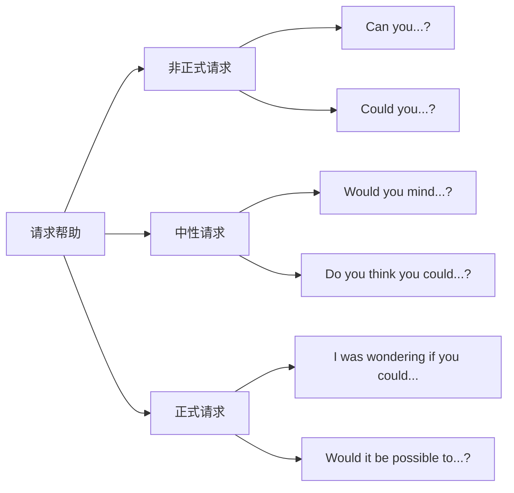
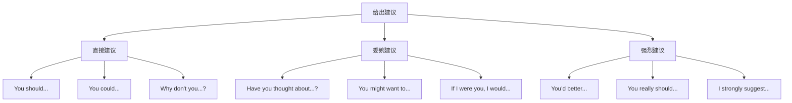

# 常用口语句型

口语交际不同于书面写作，它更强调即时性、简洁性和情感表达。掌握一套常用的口语句型模板，能够帮助学习者在各种日常场景中快速组织语言、流畅表达。本章将系统梳理英语口语中最实用的句型，按功能和场景分类讲解，配合大量真实例句和使用技巧。

## 1. 问候与寒暄句型

问候是人际交往的起点，得体的问候能给人留下良好印象。英语问候语根据正式程度、时间、关系亲疏有不同的表达方式。

### 1.1 基本问候句型

#### 1.1.1 通用问候模板

| 句型 | 适用场景 | 正式度 |
| --- | --- | --- |
| Hello! / Hi! | 任何场合 | 中性 |
| Hey! / Hey there! | 熟人、朋友 | 非正式 |
| Good morning/afternoon/evening. | 正式场合 | 正式 |
| How are you? | 通用问候 | 中性 |
| How's it going? | 日常交流 | 非正式 |
| How have you been? | 久未见面 | 中性 |

> [!example] 问候对话示例
>
> **场景一：朋友偶遇**
>
> A: Hey, Tom! How's it going?
> （嘿，汤姆！最近怎么样？）
>
> B: Pretty good! Haven't seen you in ages!
> （挺好的！好久没见你了！）
>
> **场景二：商务会面**
>
> A: Good morning, Mr. Johnson. How are you today?
> （早上好，约翰逊先生。您今天好吗？）
>
> B: Very well, thank you. And yourself?
> （非常好，谢谢。您呢？）

#### 1.1.2 回应问候的句型

当别人问候时，需要恰当回应。以下是常见的回应模式：

**积极回应：**
- I'm doing great, thanks! （我很好，谢谢！）
- Pretty good! / Not bad! （挺好的！/ 还不错！）
- Can't complain! （没什么好抱怨的！——即"还行"）
- Never been better! （从没这么好过！——非常好）

**中性回应：**
- I'm okay. / I'm alright. （我还行。）
- Same old, same old. （老样子。）
- You know, the usual. （你知道的，老样子。）
- Getting by. （还过得去。）

**消极但礼貌的回应：**
- Could be better. （可以更好。——暗示不太好）
- I've been better. （曾经更好过。——暗示现在不好）
- Hanging in there. （还撑着呢。——暗示艰难）

### 1.2 初次见面句型

初次见面的问候需要更正式，同时表达认识对方的荣幸。

```
Nice to meet you. （很高兴认识你。）
Pleased to meet you. （很高兴见到你。）
It's a pleasure to meet you. （认识您是我的荣幸。）
I've heard a lot about you. （久仰大名。）
```

> [!tip] 初次见面 vs 再次见面
>
> - **初次见面**：Nice to **meet** you.
> - **再次见面**：Nice to **see** you (again).
>
> 这是非常重要的区别！用错会显得不自然。

#### 1.2.1 自我介绍句型

| 句型 | 含义 | 使用场景 |
| --- | --- | --- |
| I'm [Name]. | 我是[名字]。 | 通用 |
| My name is [Name]. | 我的名字是[名字]。 | 正式 |
| You can call me [Nickname]. | 你可以叫我[昵称]。 | 非正式 |
| Let me introduce myself. | 请允许我自我介绍。 | 正式场合 |
| I don't think we've met. I'm... | 我想我们还没见过。我是... | 社交场合 |

### 1.3 告别句型

告别语同样需要根据场合和关系选择：

**通用告别：**
- Goodbye. / Bye. / Bye-bye. （再见。）
- See you. / See you later. （回见。/ 待会儿见。）
- See you around. （改天见。——不确定何时再见）
- Take care. （保重。）

**特定时间告别：**
- See you tomorrow. （明天见。）
- See you next week. （下周见。）
- See you at [time/place]. （[时间/地点]见。）

**非正式告别：**
- Later! / Catch you later! （回见！）
- Gotta go! （我得走了！）
- I'm off. （我走了。）
- I'm out of here. （我走了。——口语化）

**正式告别：**
- It was nice meeting you. （很高兴认识您。——初次见面后）
- It was nice seeing you. （很高兴见到您。——再次见面后）
- Have a nice day. （祝您愉快。）
- Take care of yourself. （请多保重。）

## 2. 请求与求助句型

在日常交流中，我们经常需要请求他人帮助或许可。礼貌程度的把握至关重要。

### 2.1 请求帮助句型



#### 2.1.1 非正式请求

用于朋友、家人或熟悉的同事之间：

| 句型 | 例句 | 中文 |
| --- | --- | --- |
| Can you + 动词原形? | Can you help me with this? | 你能帮我一下吗？ |
| Could you + 动词原形? | Could you pass me the salt? | 你能把盐递给我吗？ |
| Will you + 动词原形? | Will you do me a favor? | 你能帮我个忙吗？ |

#### 2.1.2 中性请求

适用于大多数日常场合：

| 句型 | 例句 | 中文 |
| --- | --- | --- |
| Would you mind + 动名词? | Would you mind opening the window? | 你介意开一下窗户吗？ |
| Do you think you could...? | Do you think you could give me a ride? | 你觉得你能载我一程吗？ |
| Is there any chance you could...? | Is there any chance you could help me move? | 有没有可能你能帮我搬家？ |

> [!warning] Would you mind 的回答
>
> 这个句型的回答逻辑与中文相反！
>
> - **同意帮忙**：No, not at all. / Of course not. / No problem.
>   （不介意 = 愿意帮忙）
>
> - **拒绝帮忙**：Actually, I'd rather you didn't. / Sorry, but...
>   （介意 = 不愿意帮忙）

#### 2.1.3 正式/委婉请求

用于正式场合或向陌生人、上级请求：

```
I was wondering if you could help me.
（我在想您是否能帮我一下。）

Would it be possible for you to send me the file?
（您能否把文件发给我？）

I would appreciate it if you could review this document.
（如果您能审阅这份文件，我将非常感激。）

Would you be so kind as to show me the way?
（您能否指一下路？——非常正式）
```

### 2.2 请求许可句型

请求许可是询问对方是否允许自己做某事。

#### 2.2.1 请求许可的层级

| 礼貌程度 | 句型 | 例句 |
| --- | --- | --- |
| 最不正式 | Can I...? | Can I use your phone? |
| 较不正式 | Could I...? | Could I borrow your pen? |
| 中性 | May I...? | May I come in? |
| 较正式 | Would it be okay if I...? | Would it be okay if I left early? |
| 最正式 | Would you mind if I...? | Would you mind if I opened the window? |

> [!example] 请求许可对话
>
> **场景：向同事借东西**
>
> A: Hey, could I borrow your charger for a minute?
> （嘿，我能借你充电器用一下吗？）
>
> B: Sure, go ahead.
> （当然，用吧。）
>
> **场景：向老板请假**
>
> A: I was wondering if it would be possible for me to take next Friday off.
> （我想问一下我是否可以下周五请假。）
>
> B: Let me check the schedule and get back to you.
> （让我看一下日程安排再回复你。）

### 2.3 回应请求的句型

**同意请求：**
- Sure! / Of course! / Absolutely! （当然！）
- No problem. / No worries. （没问题。）
- Go ahead. （请便。）
- Be my guest. （请便。——更热情）
- I'd be happy to. （我很乐意。）

**委婉拒绝：**
- I'm afraid I can't. （恐怕我不能。）
- I wish I could, but... （我希望我能，但是...）
- I'd love to, but... （我很想，但是...）
- Sorry, but I'm kind of busy right now. （抱歉，我现在有点忙。）
- Maybe some other time. （也许下次吧。）

## 3. 表达意见句型

表达意见是日常交流的重要部分。根据场合和确定程度，可以选择不同的句型。

### 3.1 陈述观点句型

#### 3.1.1 直接表达观点

| 确定程度 | 句型 | 例句 |
| --- | --- | --- |
| 非常确定 | I'm sure/certain that... | I'm sure that's the right answer. |
| 确定 | I think/believe that... | I think we should wait. |
| 较确定 | I feel that... | I feel that this is unfair. |
| 不太确定 | I guess/suppose that... | I guess we could try that. |
| 很不确定 | I'm not sure, but... | I'm not sure, but I think it's Monday. |

#### 3.1.2 委婉表达观点

在正式场合或讨论敏感话题时，委婉表达更为得体：

```
In my opinion, ... （在我看来，...）
From my point of view, ... （从我的角度来看，...）
As far as I'm concerned, ... （就我而言，...）
The way I see it, ... （在我看来，...）
If you ask me, ... （如果你问我的话，...）
To be honest, ... （老实说，...）
Personally, I think... （我个人认为...）
```

> [!example] 表达观点对话
>
> **场景：讨论工作方案**
>
> A: What do you think about the new proposal?
> （你觉得新方案怎么样？）
>
> B: Well, personally, I think it has potential, but we might need to adjust the timeline. From my point of view, three weeks is a bit too tight.
> （嗯，我个人认为它有潜力，但我们可能需要调整时间表。在我看来，三周有点太紧了。）

### 3.2 同意与反对句型

#### 3.2.1 表示同意

| 程度 | 句型 | 中文 |
| --- | --- | --- |
| 强烈同意 | Absolutely! / Exactly! / Definitely! | 完全同意！ |
| 同意 | I agree. / I think so too. | 我同意。 |
| 部分同意 | I agree to some extent. | 我在某种程度上同意。 |
| 委婉同意 | You have a point there. | 你说得有道理。 |
| 勉强同意 | I suppose so. / I guess you're right. | 我想是吧。 |

**更多同意表达：**
- That's true. / That's right. （没错。）
- I couldn't agree more. （我完全同意。——非常强烈）
- You're absolutely right. （你说得太对了。）
- That makes sense. （有道理。）
- I was thinking the same thing. （我也是这么想的。）
- My thoughts exactly. （正是我想说的。）

#### 3.2.2 表示反对

直接反对在英语文化中可能显得不礼貌，通常需要使用委婉表达：

**委婉反对：**
```
I'm not sure I agree with that.
（我不确定我同意这一点。）

I see your point, but...
（我理解你的观点，但是...）

I see what you mean, but I think...
（我明白你的意思，但我认为...）

That's one way to look at it, but...
（那是一种看法，但是...）

I'm afraid I have to disagree.
（恐怕我必须表示反对。）

With all due respect, I think...
（恕我直言，我认为...——非常正式）
```

**较直接的反对（慎用）：**
- I don't think so. （我不这么认为。）
- I disagree. （我不同意。）
- That's not how I see it. （我不是这么看的。）
- I beg to differ. （恕我不敢苟同。——正式）

> [!tip] 反对时的缓冲策略
>
> 在表达反对意见前，先承认对方观点的合理性：
>
> 1. **先肯定**：You have a point, but...
> 2. **表理解**：I understand where you're coming from, however...
> 3. **再转折**：That said, I think we should consider...
>
> 这种"三明治"策略能让反对意见更容易被接受。

### 3.3 询问意见句型

**询问对方观点：**
- What do you think? （你怎么想？）
- What's your opinion on this? （你对此有什么看法？）
- How do you feel about...? （你觉得...怎么样？）
- What are your thoughts on...? （你对...有什么想法？）
- Do you have any thoughts on...? （你对...有什么想法吗？）

**征求建议：**
- What would you suggest? （你有什么建议？）
- What do you recommend? （你推荐什么？）
- Any ideas? （有什么想法吗？）
- What should I do? （我该怎么办？）

## 4. 提供帮助与建议句型

### 4.1 主动提供帮助

主动提供帮助是社交礼仪的重要部分。以下句型按正式程度排列：

| 正式度 | 句型 | 例句 |
| --- | --- | --- |
| 非正式 | Need any help? | Need any help with that box? |
| 非正式 | Want me to...? | Want me to give you a hand? |
| 中性 | Can I help you? | Can I help you find something? |
| 中性 | Would you like me to...? | Would you like me to carry that? |
| 正式 | Is there anything I can do? | Is there anything I can do to help? |
| 正式 | Let me know if you need anything. | 如有需要请告诉我。 |

> [!example] 提供帮助对话
>
> **场景：同事看起来很忙**
>
> A: Hey, you look swamped. Is there anything I can help with?
> （嘿，你看起来忙得不可开交。有什么我能帮忙的吗？）
>
> B: That's really kind of you. Actually, could you help me proofread this report?
> （你真是太好了。其实，你能帮我校对一下这份报告吗？）

### 4.2 给出建议句型

#### 4.2.1 建议句型层级



#### 4.2.2 常用建议句型

**直接建议：**
```
You should try the new restaurant.
（你应该试试那家新餐厅。）

Why don't you take a break?
（你为什么不休息一下呢？）

How about going for a walk?
（去散步怎么样？）

What about trying a different approach?
（试试不同的方法怎么样？）
```

**委婉建议：**
```
You might want to reconsider that decision.
（你可能想重新考虑一下那个决定。）

Have you thought about taking some time off?
（你有没有考虑过休息一段时间？）

If I were you, I would talk to him directly.
（如果我是你，我会直接和他谈。）

You could always try again later.
（你随时可以之后再试。）
```

**强烈建议/警告：**
```
You'd better leave now, or you'll miss the train.
（你最好现在走，否则会错过火车。）

I strongly suggest you see a doctor.
（我强烈建议你去看医生。）

Whatever you do, don't sign anything yet.
（无论如何，先别签任何东西。）
```

> [!warning] You'd better 的语气
>
> "You'd better" (You had better) 带有警告意味，暗示如果不这样做会有不好的后果。
>
> - You'd better hurry, or you'll be late. （你最好快点，不然要迟到了。）
> - You'd better not do that. （你最好别那样做。——有威胁意味）
>
> 对上级或不熟悉的人使用可能显得不礼貌，要谨慎使用。

## 5. 道歉与原谅句型

### 5.1 道歉句型

道歉的表达需要根据事情严重程度选择合适的方式：

#### 5.1.1 轻微道歉

用于小事或日常打扰：

| 句型 | 使用场景 | 例句 |
| --- | --- | --- |
| Sorry. | 轻微失误 | Sorry, I didn't catch that. |
| Excuse me. | 打扰、借过 | Excuse me, could I get through? |
| Oops! | 小意外 | Oops! I dropped my phone. |
| My bad. | 非正式承认错误 | My bad, I forgot to tell you. |

#### 5.1.2 正式道歉

用于较严重的错误或正式场合：

```
I'm sorry for being late.
（抱歉我迟到了。）

I'm so sorry about the misunderstanding.
（对于这个误会我非常抱歉。）

I apologize for the inconvenience.
（对造成的不便我表示歉意。）

Please accept my apologies for the delay.
（请接受我对延误的歉意。）

I owe you an apology.
（我欠你一个道歉。）
```

#### 5.1.3 深刻道歉

用于严重错误或伤害他人时：

```
I'm really/terribly/deeply sorry.
（我真的/非常/深感抱歉。）

I can't tell you how sorry I am.
（我无法表达我有多抱歉。）

I feel terrible about what happened.
（对发生的事我感到非常愧疚。）

There's no excuse for what I did.
（我所做的事情没有任何借口。）

I hope you can forgive me.
（我希望你能原谅我。）
```

### 5.2 接受道歉/原谅句型

**轻松原谅：**
- That's okay. / It's okay. （没关系。）
- No problem. / No worries. （没问题。）
- Don't worry about it. （别担心。）
- It's no big deal. （没什么大不了的。）
- Forget about it. （别放在心上。）

**正式原谅：**
- I understand. （我理解。）
- Apology accepted. （我接受你的道歉。）
- I appreciate your apology. （感谢你的道歉。）
- Let's just move on. （我们向前看吧。）

**尚未完全原谅但表示理解：**
- I need some time to think about this. （我需要时间考虑。）
- I appreciate you saying that. （感谢你这么说。）
- I understand, but I'm still upset. （我理解，但我还是很难过。）

## 6. 感谢与回应句型

### 6.1 表达感谢

#### 6.1.1 感谢程度层级

| 程度 | 句型 | 使用场景 |
| --- | --- | --- |
| 简单 | Thanks. / Thank you. | 日常小事 |
| 一般 | Thanks a lot. / Thank you very much. | 一般帮助 |
| 较深 | I really appreciate it. | 较大帮助 |
| 很深 | I can't thank you enough. | 重大帮助 |
| 正式 | I'm grateful for your help. | 正式场合 |

#### 6.1.2 具体化感谢

更有诚意的感谢通常会具体说明感谢的原因：

```
Thank you for helping me with my luggage.
（谢谢你帮我搬行李。）

Thanks for being so understanding.
（谢谢你这么理解我。）

I appreciate you taking the time to explain this.
（感谢你花时间解释这个。）

I'm grateful for everything you've done.
（我对你所做的一切心存感激。）

That was so kind/thoughtful of you.
（你真是太好了/太贴心了。）
```

### 6.2 回应感谢

**常规回应：**
- You're welcome. （不客气。）
- No problem. / No worries. （没问题。）
- Don't mention it. （不用谢。）
- Anytime. （随时效劳。）
- My pleasure. （我的荣幸。）

**更热情的回应：**
- I'm glad I could help. （我很高兴能帮上忙。）
- It was nothing. （小事一桩。）
- That's what friends are for. （朋友就是用来帮忙的。）
- Happy to help. （乐意效劳。）

> [!info] 地区差异
>
> - 美式英语常用：You're welcome. / No problem. / Sure thing.
> - 英式英语常用：Not at all. / My pleasure. / You're most welcome.
> - 澳式英语常用：No worries. / She'll be right.

## 7. 邀请与回应句型

### 7.1 发出邀请

#### 7.1.1 非正式邀请

```
Want to grab a coffee?
（想去喝杯咖啡吗？）

Do you feel like going to the movies?
（你想去看电影吗？）

How about dinner tonight?
（今晚一起吃晚饭怎么样？）

Why don't you come over this weekend?
（这周末来我家怎么样？）

Are you free on Saturday?
（你周六有空吗？）
```

#### 7.1.2 正式邀请

```
Would you like to join us for dinner?
（您愿意和我们一起吃晚饭吗？）

I was wondering if you'd like to come to our party.
（我想问问您是否愿意来参加我们的派对。）

We would be delighted if you could attend.
（如果您能出席，我们将非常高兴。）

You're cordially invited to...
（诚挚邀请您参加...）
```

### 7.2 接受邀请

**热情接受：**
- I'd love to! （我很乐意！）
- Sounds great! / Sounds good! （听起来不错！）
- That would be wonderful! （那太好了！）
- Count me in! （算我一个！）
- I'm in! （我来！）

**礼貌接受：**
- Thank you for inviting me. I'd be happy to come.
  （感谢你的邀请。我很乐意来。）
- That's very kind of you. I'd love to.
  （你真是太好了。我很乐意。）

### 7.3 拒绝邀请

拒绝邀请需要委婉，并通常需要给出理由：

**委婉拒绝：**
```
I'd love to, but I already have plans.
（我很想去，但我已经有安排了。）

I'm afraid I can't make it.
（恐怕我去不了。）

I wish I could, but I have to work late.
（我希望我能去，但我得加班。）

Maybe another time?
（也许下次？）

Can I take a rain check?
（我能改天再去吗？——美式表达）
```

> [!tip] Rain Check 的含义
>
> "Take a rain check" 源自美国棒球比赛因雨取消时发的雨票，可用于下次比赛。
>
> 现在这个短语用于委婉拒绝邀请，同时表示希望以后有机会再参加。
>
> - A: Want to have lunch tomorrow?
> - B: Can I take a rain check? I'm swamped this week.
>   （能改天吗？我这周太忙了。）

## 8. 询问与回答句型

### 8.1 询问信息

#### 8.1.1 基本疑问句型

| 疑问词 | 询问内容 | 例句 |
| --- | --- | --- |
| What | 事物/内容 | What time is it? |
| Where | 地点 | Where is the bathroom? |
| When | 时间 | When does the store close? |
| Who | 人物 | Who is that? |
| Why | 原因 | Why are you late? |
| How | 方式/状态 | How do I get there? |

#### 8.1.2 礼貌询问句型

直接提问有时显得唐突，可以使用更礼貌的间接问句：

**直接 → 间接转换：**

| 直接问句 | 间接问句 |
| --- | --- |
| Where is the bank? | Could you tell me where the bank is? |
| What time does it start? | Do you know what time it starts? |
| How much is this? | I was wondering how much this is. |
| Is there a pharmacy nearby? | Do you happen to know if there's a pharmacy nearby? |

> [!warning] 间接问句的语序
>
> 间接问句使用陈述句语序，不用疑问句语序！
>
> - ✅ Could you tell me where the station **is**?
> - ❌ Could you tell me where **is** the station?
>
> - ✅ Do you know what time it **starts**?
> - ❌ Do you know what time **does it start**?

### 8.2 确认与澄清

当没听清或需要确认时使用：

**请求重复：**
- Sorry? / Pardon? （什么？/ 请再说一遍？）
- Could you say that again? （你能再说一遍吗？）
- I didn't catch that. （我没听清。）
- Could you speak more slowly? （你能说慢一点吗？）

**确认理解：**
- So you're saying...? （所以你是说...？）
- Do you mean...? （你的意思是...？）
- Let me make sure I understand. （让我确认一下我理解的。）
- Just to clarify, ... （只是澄清一下，...）
- In other words, ... （换句话说，...）

## 9. 情感表达句型

### 9.1 表达高兴

| 程度 | 表达 | 中文 |
| --- | --- | --- |
| 轻度 | I'm pleased. | 我很高兴。 |
| 中度 | I'm so happy! | 我太高兴了！ |
| 高度 | I'm thrilled! / I'm over the moon! | 我兴奋极了！ |
| 极度 | I can't believe it! This is amazing! | 我不敢相信！太棒了！ |

**更多表达：**
- That's great news! （太好了！）
- I'm so glad to hear that! （听到这个我太高兴了！）
- That made my day! （这让我一天都开心！）
- I couldn't be happier! （我开心极了！）

### 9.2 表达惊讶

**轻度惊讶：**
- Really? （真的吗？）
- Seriously? （认真的？）
- No way! （不会吧！）
- Are you kidding? （你在开玩笑吧？）

**强烈惊讶：**
- What?! / No kidding! （什么?!）
- You're joking! （你在开玩笑！）
- I can't believe it! （我不敢相信！）
- That's incredible! / That's unbelievable! （太不可思议了！）
- Get out of here! （不会吧！——美式俚语）

### 9.3 表达失望

```
That's too bad. / That's a shame.
（太可惜了。）

I'm disappointed.
（我很失望。）

I was really hoping for...
（我原本真的很期待...）

What a bummer!
（太扫兴了！——非正式）

I'm gutted.
（我太失望了。——英式俚语）
```

### 9.4 表达同情

当别人遇到困难或不幸时：

```
I'm sorry to hear that.
（听到这个我很难过。）

That's terrible. I'm so sorry.
（太糟糕了。我很抱歉。）

I can only imagine how you feel.
（我能想象你的感受。）

Is there anything I can do?
（有什么我能做的吗？）

If you need anything, I'm here.
（如果你需要什么，我在这里。）

Hang in there.
（坚持住。——鼓励）
```

### 9.5 表达愤怒与不满

**轻度不满：**
- That's annoying. （真烦人。）
- That's frustrating. （真令人沮丧。）
- I'm not happy about this. （我对此不满意。）

**中度愤怒：**
- I'm really upset about this. （我对此真的很不高兴。）
- This is unacceptable. （这不可接受。）
- I've had enough. （我受够了。）

**强烈愤怒（慎用）：**
- I'm furious! （我怒不可遏！）
- This is outrageous! （这太过分了！）
- How dare you! （你怎么敢！）

> [!warning] 表达愤怒的注意事项
>
> 在英语文化中，公开表达强烈愤怒可能被视为失态。在职场和正式场合，即使很生气，也应该使用相对克制的表达：
>
> - ✅ I'm quite concerned about this situation.
> - ✅ I have some serious concerns about...
> - ❌ I'm absolutely furious!（除非关系非常亲密）

## 10. 日常场景常用句型

### 10.1 购物场景

**店员常用语：**
- Can I help you? （需要帮忙吗？）
- Are you looking for something in particular? （您在找什么特别的东西吗？）
- How can I help you today? （今天我能帮您什么？）

**顾客常用语：**
```
I'm just looking, thanks.
（我只是看看，谢谢。）

I'm looking for...
（我在找...）

Do you have this in a different size/color?
（这个有其他尺码/颜色吗？）

How much is this?
（这个多少钱？）

Can I try this on?
（我能试穿一下吗？）

I'll take it.
（我要这个。）

Can I pay by card?
（我能刷卡吗？）

Could I get a receipt, please?
（请给我一张收据好吗？）
```

### 10.2 餐厅场景

**点餐用语：**
```
A table for two, please.
（请给我们一张两人桌。）

Could I see the menu, please?
（请给我看一下菜单好吗？）

What do you recommend?
（你推荐什么？）

I'll have the steak, please.
（请给我牛排。）

Could I have the check/bill, please?
（请给我账单好吗？）

Keep the change.
（不用找零了。）
```

### 10.3 问路场景

**问路：**
```
Excuse me, could you tell me how to get to the station?
（打扰一下，您能告诉我怎么去车站吗？）

Is there a bank around here?
（这附近有银行吗？）

How far is it from here?
（从这里有多远？）

Which way is the post office?
（邮局往哪边走？）
```

**指路：**
```
Go straight ahead.
（一直往前走。）

Turn left/right at the traffic lights.
（在红绿灯处左转/右转。）

It's on your left/right.
（就在你的左边/右边。）

It's about a five-minute walk.
（大约走五分钟。）

You can't miss it.
（你不会错过的。——很明显）
```

### 10.4 电话场景

**接电话：**
- Hello? （喂？）
- [Company name], how may I help you? （[公司名]，有什么可以帮您？）
- This is [Name] speaking. （我是[名字]。）

**打电话：**
```
Hi, this is [Name] calling.
（你好，我是[名字]。）

Is [Name] there?
（[名字]在吗？）

Could I speak to [Name], please?
（请问我能和[名字]通话吗？）

I'm calling about...
（我打电话是关于...）

Could you ask him/her to call me back?
（你能让他/她给我回电话吗？）
```

## 11. 口语句型综合练习

### 11.1 场景对话练习

> [!example] 综合场景对话
>
> **场景：朋友聚会上认识新朋友**
>
> A: Hi! I don't think we've met. I'm Alex.
> （嗨！我想我们还没见过。我是亚历克斯。）
>
> B: Nice to meet you, Alex. I'm Sarah. I'm a friend of Tom's.
> （很高兴认识你，亚历克斯。我是莎拉。我是汤姆的朋友。）
>
> A: Oh, cool! So, how do you know Tom?
> （哦，酷！那你是怎么认识汤姆的？）
>
> B: We work together. What about you?
> （我们是同事。你呢？）
>
> A: We went to college together. Hey, can I get you a drink?
> （我们大学同学。嘿，我能请你喝一杯吗？）
>
> B: That would be great, thanks! I'll have a beer if they have any.
> （太好了，谢谢！如果有啤酒的话我来一杯。）
>
> A: Sure thing! Be right back.
> （没问题！马上回来。）

### 11.2 句型转换练习

将以下直接表达转换为更礼貌的形式：

| 直接表达 | 礼貌表达 |
| --- | --- |
| Tell me the time. | Could you tell me what time it is? |
| Give me the salt. | Could you pass me the salt, please? |
| I want coffee. | I'd like a coffee, please. |
| Move. | Excuse me, could I get through? |
| What's your name? | May I ask your name? |

## 12. 常用口语句型速查表

### 12.1 功能分类速查

| 功能 | 非正式 | 正式 |
| --- | --- | --- |
| 问候 | Hey! What's up? | Good morning. How are you? |
| 告别 | Later! | It was nice seeing you. |
| 感谢 | Thanks! | I really appreciate it. |
| 道歉 | Sorry! My bad. | I apologize for the inconvenience. |
| 请求 | Can you...? | Would you mind...? |
| 建议 | You should... | You might want to consider... |
| 同意 | Yeah! Totally! | I completely agree. |
| 反对 | No way! | I'm afraid I have to disagree. |

### 12.2 情感表达速查

| 情感 | 表达 |
| --- | --- |
| 高兴 | I'm so happy! / That's great! / Awesome! |
| 惊讶 | Really?! / No way! / Are you serious? |
| 失望 | That's too bad. / What a bummer! |
| 同情 | I'm sorry to hear that. / That must be tough. |
| 感激 | I can't thank you enough. / You're the best! |
| 鼓励 | You can do it! / Hang in there! |

## 章节小结

本章系统梳理了英语日常口语中最实用的句型模板，涵盖以下核心内容：

1. **问候与寒暄**：从基本问候到初次见面、告别的完整句型
2. **请求与求助**：不同礼貌程度的请求句型及回应方式
3. **表达意见**：陈述观点、同意与反对的多种表达
4. **帮助与建议**：主动提供帮助和给出建议的句型
5. **道歉与原谅**：不同严重程度的道歉及接受方式
6. **感谢与回应**：表达和回应感谢的多种方式
7. **邀请与回应**：发出邀请、接受和委婉拒绝的句型
8. **询问与回答**：礼貌询问和确认澄清的技巧
9. **情感表达**：高兴、惊讶、失望、同情等情感的表达
10. **日常场景**：购物、餐厅、问路、电话等实用句型

掌握这些句型模板后，学习者可以在各种日常场景中更加自如地进行英语交流。记住，口语表达的关键不仅在于语法正确，更在于选择适合场合和关系的表达方式。
