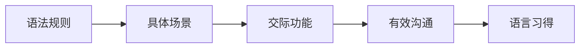
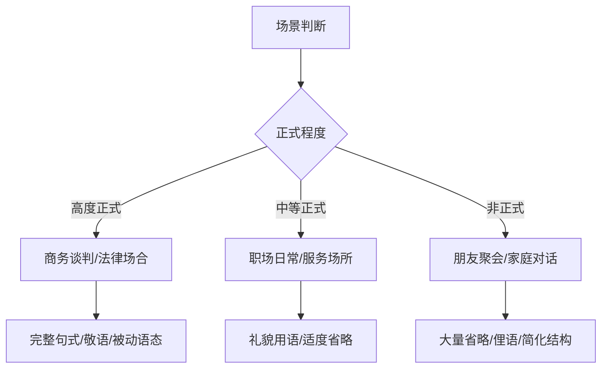
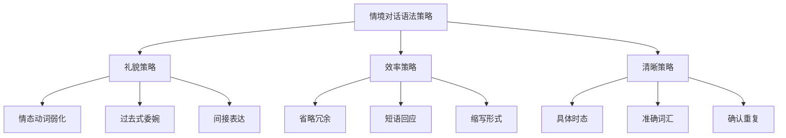

# 情境对话语法

在真实的英语交际环境中，语法不再是孤立的规则，而是融入具体场景的活用工具。不同场景有不同的语言风格、句型偏好和语法简化规律。掌握情境对话中的语法特点，能帮助学习者在实际交流中更加自然、得体地表达。

本文将通过职场、社交、旅行、就医、银行等五大核心场景的真实对话，系统分析口语语法的实际运用，帮助读者理解「语法如何服务于交际」。

---

## 1. 情境对话语法概述

### 1.1 情境语法的核心理念

传统语法教学往往脱离语境，而情境语法强调：

> [!info] 情境语法的三个维度
>
> 1. **场景适配**：不同场景使用不同的正式程度和句型
> 2. **功能导向**：语法服务于表达意图（请求、拒绝、建议等）
> 3. **文化嵌入**：语法选择反映社交礼仪和文化规范

### 1.2 口语语法的普遍特征

在各类情境对话中，口语语法呈现以下共同特点：

| 特征 | 说明 | 示例 |
| --- | --- | --- |
| **省略主语** | 上下文明确时省略 | *(I)* Got it. / *(Are you)* Ready? |
| **缩写形式** | 普遍使用缩写 | I'm, we'll, can't, wouldn't |
| **简短回应** | 完整句简化为短语 | Sure. / No problem. / Will do. |
| **填充词** | 思考时使用填充语 | Well, um, you know, I mean |
| **确认附加** | 句末加确认词 | ..., right? / ..., okay? |
| **情态弱化** | 使用弱化表达显得礼貌 | Could you...? / Would you mind...? |

### 1.3 正式程度的语法选择

不同场景需要调整语言的正式程度：

---

## 2. 职场对话语法

职场英语需要在效率与礼貌之间取得平衡，语法选择直接影响职业形象。

### 2.1 会议场景

#### 2.1.1 开场与议程

**对话示例**：

> **Chair**: Good morning, everyone. Thanks for joining. Let's get started, shall we?
>
> **Participant A**: Before we begin, could I just clarify one thing about the agenda?
>
> **Chair**: Of course. Go ahead.
>
> **Participant A**: The third item—are we making a decision today or just discussing options?
>
> **Chair**: Good question. We're aiming to reach a consensus if possible.

**语法分析**：

| 句子 | 语法要点 |
| --- | --- |
| *Thanks for joining.* | 动名词作介词宾语；省略主语 *I give you* |
| *Let's get started, shall we?* | 祈使句 + 反意疑问（*let's* 的固定搭配） |
| *Could I just clarify...?* | 情态动词 *could* 表礼貌请求；*just* 弱化语气 |
| *Go ahead.* | 祈使句表许可，省略主语 |
| *Are we making a decision...?* | 现在进行时表将来安排 |
| *We're aiming to reach...* | *aim to + 动词原形* 表示目标 |

> [!tip] 职场会议语法要点
>
> - 使用 **shall we?** 作为 *let's* 的反意疑问
> - **could/would** 比 *can/will* 更正式礼貌
> - 现在进行时可表示**已确定的将来安排**

#### 2.1.2 表达观点与回应

**对话示例**：

> **Manager**: I think we should postpone the launch. What's your take on this, Sarah?
>
> **Sarah**: I see your point, but wouldn't that affect our Q4 targets?
>
> **Manager**: That's a valid concern. Perhaps we could find a middle ground.
>
> **Sarah**: What if we did a soft launch first? That way, we'd have more flexibility.
>
> **Manager**: I hadn't thought of that. It might actually work.

**语法分析**：

| 表达 | 语法结构 | 功能 |
| --- | --- | --- |
| *I think we should...* | 主句 + 宾语从句 | 委婉提出建议 |
| *What's your take on this?* | 特殊疑问句 | 征求意见 |
| *I see your point, but...* | 让步 + 转折 | 礼貌反驳 |
| *wouldn't that affect...?* | 否定疑问句 | 委婉表达担忧 |
| *What if we did...?* | 虚拟条件句（过去式表假设） | 提出建议 |
| *That way, we'd have...* | 条件结果（*would* 表推测） | 解释好处 |
| *I hadn't thought of that.* | 过去完成时 | 表示此前未曾考虑 |

> [!warning] 职场反驳的语法策略
>
> 直接反驳显得不礼貌，应使用以下结构：
> - **I see your point, but...** — 先认可再转折
> - **Wouldn't that...?** — 用否定疑问表担忧
> - **What if...?** — 用虚拟语气提替代方案

### 2.2 邮件与口头汇报

#### 2.2.1 汇报工作进度

**对话示例**：

> **Employee**: I wanted to give you a quick update on the project.
>
> **Manager**: Sure, go ahead.
>
> **Employee**: We've completed the design phase and have started coding. We should be done by Friday, assuming no major issues come up.
>
> **Manager**: Sounds good. Keep me posted if anything changes.
>
> **Employee**: Will do.

**语法分析**：

| 句子 | 语法要点 |
| --- | --- |
| *I wanted to give you...* | 过去式 *wanted* 比 *want* 更委婉 |
| *We've completed... and have started...* | 现在完成时表示已完成的动作 |
| *We should be done by Friday* | *should* 表预期；被动语态 |
| *assuming no major issues come up* | 现在分词短语作条件状语 |
| *Keep me posted* | 祈使句；*keep + 宾语 + 过去分词* 结构 |
| *Will do.* | 省略式回应 = *I will do that* |

> [!example] 汇报常用句型
>
> **进度汇报**：
> - We've completed / finished / wrapped up...
> - We're currently working on / in the middle of...
> - We're on track to finish by...
>
> **预期与假设**：
> - Assuming everything goes well, ...
> - Barring any unforeseen issues, ...
> - If all goes according to plan, ...

### 2.3 处理问题与冲突

**对话示例**：

> **Client**: I'm not happy with the delivery delay. This wasn't what we agreed on.
>
> **Account Manager**: I completely understand your frustration, and I apologize for the inconvenience. There was an unexpected supply chain issue that we're working to resolve.
>
> **Client**: What are you going to do about it?
>
> **Account Manager**: We're expediting the shipment and will have it to you by Wednesday. Additionally, we'd like to offer you a 10% discount on your next order as a gesture of goodwill.
>
> **Client**: I appreciate that. Let's make sure this doesn't happen again.

**语法分析**：

| 表达 | 语法结构 | 功能 |
| --- | --- | --- |
| *This wasn't what we agreed on.* | 名词性从句作表语 | 指出问题 |
| *I completely understand...* | 副词修饰动词 | 强调理解 |
| *There was an unexpected issue that...* | *there be* 句型 + 定语从句 | 解释原因 |
| *we're working to resolve* | 不定式表目的 | 说明正在努力 |
| *What are you going to do...?* | *be going to* 表意图 | 要求解决方案 |
| *We're expediting... and will have...* | 进行时 + 将来时 | 说明行动 |
| *we'd like to offer...* | *would like to* 礼貌表达 | 提出补偿 |
| *Let's make sure this doesn't...* | 祈使句 + 宾语从句 | 提出期望 |

---

## 3. 社交聚会语法

社交场合的语言更加轻松随意，语法简化明显，情感表达丰富。

### 3.1 派对与聚会

#### 3.1.1 初次见面

**对话示例**：

> **Tom**: Hey, I don't think we've met. I'm Tom, a friend of Sarah's.
>
> **Lisa**: Oh hi! I'm Lisa. Nice to meet you. How do you know Sarah?
>
> **Tom**: We went to college together. What about you?
>
> **Lisa**: We work at the same company. She's in marketing; I'm in HR.
>
> **Tom**: Oh cool! So you must be the one she's always talking about.
>
> **Lisa**: *laughs* I hope it's good things!

**语法分析**：

| 句子 | 语法要点 |
| --- | --- |
| *I don't think we've met.* | 否定前移（*I don't think* 而非 *I think we haven't*） |
| *a friend of Sarah's* | 双重所有格（*of + 名词所有格*） |
| *How do you know Sarah?* | 一般现在时表持续状态 |
| *We went to college together.* | 一般过去时叙述经历 |
| *What about you?* | 省略式问句 = *What about you? How do you know her?* |
| *She's in marketing; I'm in HR.* | 分号连接并列句 |
| *you must be the one...* | *must be* 表推测 |
| *she's always talking about* | 现在进行时 + *always* 表习惯性动作 |

> [!tip] 社交寒暄的语法特点
>
> 1. **双重所有格** *a friend of mine/Sarah's* 比 *my friend* 更自然
> 2. **否定前移** *I don't think...* 是固定用法
> 3. **省略问句** 如 *What about you?* *And you?* *You?*
> 4. ***always + 进行时*** 表示「总是、老是」的习惯

#### 3.1.2 闲聊与话题延伸

**对话示例**：

> **Mike**: So, been up to anything interesting lately?
>
> **Jenny**: Actually, I just got back from Japan! It was amazing.
>
> **Mike**: No way! I've always wanted to go there. How was it?
>
> **Jenny**: Incredible. The food, the temples, everything. You should totally go.
>
> **Mike**: I really should. Any recommendations?
>
> **Jenny**: Definitely Kyoto if you're into history, and Tokyo for the nightlife.

**语法分析**：

| 句子 | 语法要点 |
| --- | --- |
| *Been up to anything interesting?* | 省略 *Have you* 的口语问句 |
| *I just got back from...* | 一般过去时 + *just* 表刚刚完成 |
| *I've always wanted to go* | 现在完成时表持续愿望 |
| *The food, the temples, everything.* | 名词短语独立成句（非完整句） |
| *You should totally go.* | *should* 表建议；*totally* 加强语气 |
| *I really should.* | 省略回应 = *I really should go* |
| *if you're into history* | *be into* 口语表达「对...感兴趣」 |

> [!example] 社交话题的常用省略句
>
> | 完整形式 | 省略形式 |
> | --- | --- |
> | Have you been up to anything? | Been up to anything? |
> | It sounds great. | Sounds great. |
> | I am not sure. | Not sure. |
> | That is so cool! | So cool! |
> | Are you coming? | Coming? |

### 3.2 告别与后续

**对话示例**：

> **Guest**: Well, I should probably get going. Early morning tomorrow.
>
> **Host**: Oh, already? Well, it was great having you!
>
> **Guest**: Thanks for having me. Everything was wonderful.
>
> **Host**: We should do this again sometime.
>
> **Guest**: Definitely! I'll text you. Take care!
>
> **Host**: You too! Get home safe.

**语法分析**：

| 表达 | 语法结构 | 功能 |
| --- | --- | --- |
| *I should probably get going* | *should* + 副词 *probably* 弱化 | 委婉告辞 |
| *Early morning tomorrow.* | 名词短语省略句 | 解释原因 |
| *it was great having you* | 动名词作真正主语 | 表达感谢 |
| *Thanks for having me.* | 动名词作介词宾语 | 回应感谢 |
| *We should do this again* | *should* 表建议 | 表达意愿 |
| *Get home safe.* | 祈使句；*safe* 作副词用 | 表达关心 |

---

## 4. 旅行出行语法

旅行场景涉及信息询问、服务请求和问题解决，需要清晰、礼貌的表达。

### 4.1 机场与航班

#### 4.1.1 值机对话

**对话示例**：

> **Agent**: Good morning. May I see your passport and booking confirmation, please?
>
> **Passenger**: Here you go. I was wondering if I could get a window seat.
>
> **Agent**: Let me check... Yes, 24A is available. Will that work?
>
> **Passenger**: Perfect, thanks. And could I check this bag through to London?
>
> **Agent**: Certainly. Are you carrying any liquids over 100ml or lithium batteries in your checked luggage?
>
> **Passenger**: No, I don't think so.
>
> **Agent**: Great. Your bag is checked through. Here's your boarding pass. Gate 15, boarding starts at 10:40.

**语法分析**：

| 句子 | 语法要点 |
| --- | --- |
| *May I see your passport?* | *may* 正式请求（比 *can* 更礼貌） |
| *I was wondering if I could...* | 过去进行时 + 虚拟 *could* = 非常礼貌的请求 |
| *Let me check...* | 祈使句式表示「让我...」 |
| *Will that work?* | *will* 征求确认 |
| *could I check this bag through* | *check through* 短语动词 |
| *Are you carrying...?* | 现在进行时表当前状态 |
| *I don't think so.* | 否定前移的固定回应 |
| *boarding starts at 10:40* | 一般现在时表时刻表 |

> [!info] 礼貌请求的级别
>
> | 礼貌程度 | 句型 | 适用场景 |
> | --- | --- | --- |
> | 最礼貌 | *I was wondering if I could...* | 特殊请求 |
> | 很礼貌 | *Would it be possible to...?* | 正式场合 |
> | 礼貌 | *Could I / Could you...?* | 日常服务 |
> | 一般 | *Can I / Can you...?* | 非正式场合 |

#### 4.1.2 航班延误处理

**对话示例**：

> **Passenger**: Excuse me, I was told my connecting flight might be delayed. Do you have any updates?
>
> **Agent**: Let me look that up for you. Yes, Flight BA456 is delayed by two hours due to weather conditions.
>
> **Passenger**: Oh no. Will I miss my connection to Paris?
>
> **Agent**: I'm afraid you might. But don't worry—we can rebook you on the next available flight at no extra charge.
>
> **Passenger**: That would be great. What time does it leave?
>
> **Agent**: There's one at 6:15 PM. Would that suit you?
>
> **Passenger**: Yes, that works. Thank you for your help.

**语法分析**：

| 表达 | 语法结构 | 功能 |
| --- | --- | --- |
| *I was told...* | 被动语态 | 转述信息 |
| *my connecting flight might be delayed* | 情态动词 *might* 表可能 | 表达不确定性 |
| *Let me look that up for you* | 祈使句 + 短语动词 | 主动帮助 |
| *is delayed by two hours* | 被动语态 + *by* 表程度 | 说明延误情况 |
| *due to weather conditions* | 介词短语表原因 | 解释原因 |
| *Will I miss my connection?* | *will* 表推测性疑问 | 询问后果 |
| *I'm afraid you might.* | *I'm afraid* 委婉表达坏消息 | 礼貌告知 |
| *we can rebook you* | *can* 表示能力/可能性 | 提供解决方案 |
| *at no extra charge* | 介词短语作状语 | 补充条件 |

### 4.2 酒店入住

**对话示例**：

> **Guest**: Hi, I have a reservation under the name Johnson.
>
> **Receptionist**: Let me find that... Yes, Mr. Johnson, a deluxe room for three nights, is that correct?
>
> **Guest**: That's right. Is it possible to check in early? I know it's only 11.
>
> **Receptionist**: The room isn't quite ready yet, but it should be available in about an hour. Would you like to wait in our lounge?
>
> **Guest**: Sure, that would be fine. Also, I'll need a wake-up call tomorrow at 6 AM.
>
> **Receptionist**: No problem. I'll make a note of that. Is there anything else I can help you with?
>
> **Guest**: That's all for now, thanks.

**语法分析**：

| 句子 | 语法要点 |
| --- | --- |
| *I have a reservation under the name...* | 介词短语 *under the name* 表示「以...的名义」 |
| *a deluxe room for three nights* | 介词短语作定语 |
| *Is it possible to check in early?* | *It is possible to...* 的疑问形式 |
| *I know it's only 11.* | 插入语表示自知 |
| *isn't quite ready yet* | *quite* 修饰形容词；*yet* 用于否定句 |
| *it should be available* | *should* 表预期 |
| *in about an hour* | *in + 时间* 表示「...之后」 |
| *I'll need a wake-up call* | *will* 表意愿 |
| *I'll make a note of that* | 固定短语 *make a note of* |
| *Is there anything else I can help you with?* | 定语从句（介词置于句末） |

> [!tip] 酒店常用语法结构
>
> **预订确认**：
> - I have a reservation under [name].
> - I booked a room through [website].
>
> **请求服务**：
> - Could I get / have...?
> - I'll need... (*will* 表意愿)
> - Is it possible to...?
>
> **确认信息**：
> - Is that correct?
> - Does that sound right?

### 4.3 问路与交通

**对话示例**：

> **Tourist**: Excuse me, could you tell me how to get to the National Museum?
>
> **Local**: Sure. You can either take the subway—that's the fastest—or walk. It's about 20 minutes on foot.
>
> **Tourist**: Which subway line should I take?
>
> **Local**: Take the Blue Line toward City Center, and get off at Museum Station. It's right there when you exit.
>
> **Tourist**: Got it. And is there somewhere nearby where I can grab a coffee?
>
> **Local**: There's a great café just across from the station. You can't miss it.
>
> **Tourist**: Thanks so much for your help!

**语法分析**：

| 句子 | 语法要点 |
| --- | --- |
| *could you tell me how to get to...* | 间接疑问句（陈述语序） |
| *You can either take... or walk* | *either...or* 表选择 |
| *that's the fastest* | 破折号插入补充说明 |
| *It's about 20 minutes on foot* | *on foot* 固定短语 |
| *Which subway line should I take?* | *should* 表建议询问 |
| *Take the Blue Line toward...* | 祈使句给出指示 |
| *get off at...* | 短语动词 *get off* 表下车 |
| *when you exit* | 时间状语从句 |
| *somewhere... where I can...* | *somewhere* + 定语从句 |
| *grab a coffee* | 口语表达「买杯咖啡」 |
| *You can't miss it* | 固定表达「你不会错过的」 |

---

## 5. 医院就医语法

医疗场景需要准确描述症状、理解医嘱，语法使用强调清晰性和精确性。

### 5.1 预约与挂号

**对话示例**：

> **Patient**: Hi, I'd like to make an appointment with Dr. Chen, please.
>
> **Receptionist**: Sure. Is this your first visit, or have you seen Dr. Chen before?
>
> **Patient**: I've been here before, but it's been a while.
>
> **Receptionist**: No problem. Can I get your name and date of birth?
>
> **Patient**: Sarah Miller, June 15th, 1985.
>
> **Receptionist**: Thank you. What seems to be the problem?
>
> **Patient**: I've been having headaches for about a week now.
>
> **Receptionist**: I see. Dr. Chen has an opening tomorrow at 2 PM. Would that work for you?
>
> **Patient**: That would be perfect.

**语法分析**：

| 句子 | 语法要点 |
| --- | --- |
| *I'd like to make an appointment* | *would like to* 礼貌请求 |
| *Is this your first visit, or...?* | 选择疑问句 |
| *have you seen Dr. Chen before?* | 现在完成时表经历 |
| *I've been here before* | 现在完成时表过去经历 |
| *it's been a while* | *it's been* = *it has been* 表时间流逝 |
| *Can I get your name...?* | *Can I get* 口语化表达 |
| *What seems to be the problem?* | 委婉问法（比 *What's wrong?* 更正式） |
| *I've been having headaches* | 现在完成进行时表持续症状 |
| *for about a week now* | 时间状语强调持续性 |
| *has an opening* | *opening* 表示「空档、可预约时段」 |

> [!warning] 描述症状的时态选择
>
> | 时态 | 用法 | 示例 |
> | --- | --- | --- |
> | **现在完成进行时** | 持续性症状 | *I've been coughing for a week.* |
> | **现在进行时** | 当前正在发生 | *My head is pounding right now.* |
> | **一般现在时** | 习惯性/反复性 | *I get migraines about once a month.* |
> | **一般过去时** | 已结束的症状 | *I had a fever yesterday.* |

### 5.2 问诊对话

**对话示例**：

> **Doctor**: Good afternoon, Sarah. What brings you in today?
>
> **Patient**: I've been having these terrible headaches. They started about a week ago and seem to be getting worse.
>
> **Doctor**: I'm sorry to hear that. Can you describe the pain? Is it a dull ache or more of a sharp, stabbing pain?
>
> **Patient**: It's more of a throbbing pain, usually on one side of my head.
>
> **Doctor**: And how often do they occur? Daily?
>
> **Patient**: Pretty much every day, especially in the afternoon.
>
> **Doctor**: Have you noticed anything that triggers them? Stress, certain foods, lack of sleep?
>
> **Patient**: Now that you mention it, I have been under a lot of stress at work lately.
>
> **Doctor**: That could definitely be a factor. Have you been taking anything for the pain?
>
> **Patient**: Just over-the-counter painkillers, but they don't seem to help much.
>
> **Doctor**: I'd like to run some tests just to rule out anything serious. In the meantime, I'll prescribe something stronger for the pain.

**语法分析**：

| 表达 | 语法结构 | 功能 |
| --- | --- | --- |
| *What brings you in today?* | 特殊疑问句；*bring in* = 使就诊 | 开场问诊 |
| *They started... and seem to be getting worse* | 系动词 *seem* + 不定式进行时 | 描述变化趋势 |
| *Is it a dull ache or...?* | 选择疑问句 | 明确症状类型 |
| *more of a throbbing pain* | *more of a* 表「更像是」 | 描述特征 |
| *how often do they occur?* | 频率疑问 | 了解发作频率 |
| *Have you noticed anything that triggers them?* | 现在完成时 + 定语从句 | 询问诱因 |
| *Now that you mention it* | *now that* 引导原因状语从句 | 回应引发思考 |
| *I have been under a lot of stress* | 现在完成进行时 | 描述持续状态 |
| *That could definitely be a factor* | *could* 表可能性 | 医生推测 |
| *Have you been taking anything...?* | 现在完成进行时 | 询问持续行为 |
| *they don't seem to help much* | *seem to* + 动词原形 | 描述效果 |
| *I'd like to run some tests* | *would like to* 委婉表达 | 建议检查 |
| *just to rule out anything serious* | 不定式表目的；*rule out* 排除 | 解释目的 |
| *In the meantime* | 时间状语 | 过渡表达 |

> [!example] 医疗场景常用句型
>
> **描述症状**：
> - I've been having... (持续性症状)
> - It started about... ago. (起始时间)
> - It seems to be getting worse/better. (趋势)
> - The pain is... (描述性质)
>
> **医生问诊**：
> - What brings you in today?
> - Can you describe the pain?
> - How often does this happen?
> - Have you noticed any triggers?
> - Have you been taking anything for it?
>
> **医生建议**：
> - I'd like to run some tests.
> - I'm going to prescribe...
> - You should try to...
> - Make sure you...

### 5.3 取药与医嘱

**对话示例**：

> **Pharmacist**: Hi, picking up a prescription?
>
> **Patient**: Yes, for Sarah Miller.
>
> **Pharmacist**: Let me find that... Here it is. This is a new medication for you, so let me go over the instructions.
>
> **Patient**: Sure.
>
> **Pharmacist**: Take one tablet twice daily with food. Don't take it on an empty stomach, or it might cause nausea.
>
> **Patient**: Got it. Are there any side effects I should know about?
>
> **Pharmacist**: Some people experience drowsiness, so avoid driving until you know how it affects you.
>
> **Patient**: Okay. And how long should I take it for?
>
> **Pharmacist**: The prescription is for two weeks. If symptoms persist, you should follow up with your doctor.
>
> **Patient**: Thank you for explaining everything.

**语法分析**：

| 句子 | 语法要点 |
| --- | --- |
| *picking up a prescription?* | 省略 *Are you* 的口语问句 |
| *let me go over the instructions* | *go over* = 详细解释 |
| *Take one tablet twice daily* | 祈使句；频率副词 *twice daily* |
| *Don't take it on an empty stomach* | 否定祈使句 |
| *or it might cause nausea* | *or* 表否则；*might* 表可能 |
| *Are there any side effects I should know about?* | 定语从句（介词置于句末） |
| *avoid driving until you know...* | *avoid + 动名词*；*until* 引导时间状语从句 |
| *how it affects you* | 间接疑问句作宾语 |
| *how long should I take it for?* | 介词 *for* 置于句末 |
| *If symptoms persist* | 条件状语从句 |
| *you should follow up with your doctor* | *follow up with* 跟进复诊 |

---

## 6. 银行办事语法

银行场景涉及正式交易和财务术语，语法表达需要准确、专业。

### 6.1 开户与咨询

**对话示例**：

> **Customer**: Hi, I'd like to open a savings account.
>
> **Teller**: Certainly. Do you already have an account with us, or would this be your first one?
>
> **Customer**: This would be my first.
>
> **Teller**: Great. I'll need to see two forms of ID. A passport and a utility bill would work.
>
> **Customer**: I have my passport. Would a bank statement from another bank work instead of a utility bill?
>
> **Teller**: Yes, that should be fine as long as it's dated within the last three months.
>
> **Customer**: Perfect. I also wanted to ask about interest rates.
>
> **Teller**: Our standard savings account offers 2.5% annual interest, compounded monthly.
>
> **Customer**: And is there a minimum balance requirement?
>
> **Teller**: Yes, you'll need to maintain a minimum balance of $500 to avoid monthly fees.

**语法分析**：

| 句子 | 语法要点 |
| --- | --- |
| *I'd like to open...* | *would like to* 礼貌请求 |
| *would this be your first one?* | *would* 表虚拟/推测 |
| *This would be my first.* | *would* 表假设情况 |
| *A passport and a utility bill would work* | *would work* 表示「可以接受」 |
| *Would a bank statement... work instead of...?* | *instead of* 表替代 |
| *as long as it's dated within...* | *as long as* 引导条件从句 |
| *I also wanted to ask about...* | 过去式 *wanted* 更委婉 |
| *compounded monthly* | 过去分词作后置定语 |
| *is there a minimum balance requirement?* | *there be* 句型询问存在 |
| *you'll need to maintain* | *will need to* 表必要条件 |
| *to avoid monthly fees* | 不定式表目的 |

> [!info] 银行术语与语法
>
> | 术语 | 含义 | 例句语法 |
> | --- | --- | --- |
| *open an account* | 开户 | 动宾短语 |
> | *minimum balance* | 最低余额 | 形容词 + 名词 |
> | *interest rate* | 利率 | 名词作定语 |
> | *compounded monthly* | 按月复利 | 过去分词 + 副词 |
> | *wire transfer* | 电汇 | 名词作定语 |
> | *overdraft protection* | 透支保护 | 名词作定语 |

### 6.2 转账与汇款

**对话示例**：

> **Customer**: I need to transfer some money to an international account.
>
> **Teller**: Sure. Do you have the recipient's bank details—the SWIFT code and account number?
>
> **Customer**: Yes, here they are. How long will the transfer take?
>
> **Teller**: International transfers typically take 3-5 business days. There's also a $25 wire transfer fee.
>
> **Customer**: That's fine. What's the exchange rate for euros?
>
> **Teller**: Today's rate is 1 dollar to 0.92 euros. The rate is locked in at the time of transfer.
>
> **Customer**: Okay. And will the recipient receive the full amount, or are there additional fees on their end?
>
> **Teller**: There may be intermediary bank fees, which are deducted from the transfer amount. To ensure they receive the full amount, you can choose to cover those fees here.
>
> **Customer**: I'll do that. Let's proceed.

**语法分析**：

| 表达 | 语法结构 | 功能 |
| --- | --- | --- |
| *I need to transfer some money* | *need to* + 动词原形 | 表达需求 |
| *Do you have the recipient's bank details* | 所有格 + 名词 | 询问信息 |
| *here they are* | 倒装结构 | 递交文件 |
| *How long will the transfer take?* | *take* 表示「花费（时间）」 | 询问时长 |
| *typically take 3-5 business days* | 副词 *typically* + 时间范围 | 说明一般情况 |
| *There's also a $25 wire transfer fee* | *there be* + 费用说明 | 告知费用 |
| *The rate is locked in* | 被动语态 | 说明汇率固定 |
| *at the time of transfer* | 介词短语表时间 | 指定时间点 |
| *will the recipient receive...* | 将来时疑问 | 询问结果 |
| *are there additional fees* | *there be* 疑问形式 | 询问其他费用 |
| *on their end* | 口语表达「在他们那边」 | 指代对方 |
| *There may be intermediary bank fees* | *may be* 表可能性 | 说明不确定因素 |
| *which are deducted from...* | 非限制性定语从句 | 补充说明 |
| *you can choose to cover those fees* | *can* + *choose to* | 提供选项 |

### 6.3 问题解决

**对话示例**：

> **Customer**: Excuse me, I think there's been an error with my account. I was charged twice for the same transaction.
>
> **Manager**: I'm sorry to hear that. Let me look into this for you. Can I have your account number?
>
> **Customer**: Sure, it's 4521-7890-3456.
>
> **Manager**: Thank you. I can see the duplicate charge here. This appears to be a system error on our end.
>
> **Customer**: Can I get a refund?
>
> **Manager**: Absolutely. I'll process the refund right away. It should appear in your account within 24 hours.
>
> **Customer**: Thank you. Will I receive any confirmation?
>
> **Manager**: Yes, you'll receive an email confirmation once the refund has been processed.
>
> **Customer**: Great. I appreciate your help.

**语法分析**：

| 句子 | 语法要点 |
| --- | --- |
| *I think there's been an error* | 现在完成时 *there has been* 表示已发生 |
| *I was charged twice* | 被动语态 + 频率副词 |
| *for the same transaction* | 介词短语修饰动词 |
| *Let me look into this* | *look into* = 调查 |
| *Can I have your account number?* | *can I have* 请求信息 |
| *I can see the duplicate charge* | *can* 表能力 |
| *This appears to be...* | *appear to be* 表示「看来是」 |
| *on our end* | 口语表达「在我们这边」 |
| *Can I get a refund?* | 请求句型 |
| *I'll process the refund right away* | *right away* = 立即 |
| *It should appear within 24 hours* | *should* 表预期；*within* 表时限 |
| *once the refund has been processed* | *once* 引导时间状语从句；现在完成时被动 |

---

## 7. 情境对话的语法策略总结

### 7.1 跨场景通用策略

### 7.2 场景-语法对照表

| 场景 | 正式程度 | 典型语法特征 | 关键句型 |
| --- | --- | --- | --- |
| **职场会议** | 高 | 完整句式、情态动词、被动语态 | *I was wondering if...* / *Would it be possible...* |
| **社交聚会** | 低 | 大量省略、缩写、非完整句 | *Been up to anything?* / *Sounds great!* |
| **旅行出行** | 中 | 礼貌请求、间接疑问句 | *Could you tell me how to...* / *I'd like to...* |
| **医院就医** | 中高 | 现在完成进行时、描述性形容词 | *I've been having...* / *It seems to be...* |
| **银行办事** | 高 | 专业术语、条件句、被动语态 | *I need to...* / *There may be...* |

### 7.3 礼貌等级与句型选择

> [!tip] 根据场景选择礼貌等级
>
> | 礼貌等级 | 句型 | 适用场景 |
> | --- | --- | --- |
> | ★★★★★ | *I was wondering if you could possibly...* | 特殊请求、敏感话题 |
> | ★★★★ | *Would it be possible to...?* | 正式场合、重要请求 |
> | ★★★ | *Could you please...?* | 日常服务、一般请求 |
> | ★★ | *Can you...?* | 非正式、熟人之间 |
> | ★ | *Do this.* | 命令、紧急情况 |

### 7.4 时态选择速查

| 交际功能 | 推荐时态 | 示例 |
| --- | --- | --- |
| 描述持续症状/状态 | 现在完成进行时 | *I've been feeling tired.* |
| 描述已完成的动作 | 现在完成时 | *I've finished the report.* |
| 叙述过去经历 | 一般过去时 | *I visited Japan last year.* |
| 表达习惯/事实 | 一般现在时 | *I usually take the bus.* |
| 已确定的安排 | 现在进行时 | *I'm meeting them tomorrow.* |
| 预期/推测 | *will* / *should* | *It should arrive by Friday.* |
| 礼貌请求 | 过去式 / *would* | *I wanted to ask...* |

---

## 8. 综合练习

### 8.1 场景判断练习

判断以下对话发生的场景，并分析语法特点：

> [!example] 练习 1
>
> **A**: I've been experiencing some dizziness, especially when I stand up quickly.
>
> **B**: How long has this been going on?
>
> **A**: About two weeks now.
>
> **场景**：____________
>
> **语法分析**：
> - *I've been experiencing* — ____________
> - *when I stand up quickly* — ____________
> - *How long has this been going on?* — ____________

查看答案

**场景**：医院就医（问诊）

**语法分析**：
- *I've been experiencing* — 现在完成进行时表持续症状
- *when I stand up quickly* — 时间状语从句表触发条件
- *How long has this been going on?* — 现在完成进行时疑问句询问持续时间

> [!example] 练习 2
>
> **A**: We should probably revisit the budget before the next meeting.
>
> **B**: I agree. There are a few items that need to be adjusted.
>
> **A**: Would it be possible to have the revised numbers by Friday?
>
> **场景**：____________
>
> **语法分析**：
> - *We should probably...* — ____________
> - *There are a few items that need to be adjusted* — ____________
> - *Would it be possible to...* — ____________

查看答案

**场景**：职场对话（工作讨论）

**语法分析**：
- *We should probably...* — *should* 表建议，*probably* 弱化语气
- *There are a few items that need to be adjusted* — *there be* + 定语从句 + 被动不定式
- *Would it be possible to...* — 礼貌请求句型

### 8.2 句型转换练习

将下列直接表达转换为更礼貌的版本：

| 直接表达 | 礼貌表达 |
| --- | --- |
| Give me the menu. | __________________________ |
| I want a window seat. | __________________________ |
| Tell me how to get there. | __________________________ |
| That's wrong. | __________________________ |

查看答案

| 直接表达 | 礼貌表达 |
| --- | --- |
| Give me the menu. | *Could I have the menu, please?* |
| I want a window seat. | *I was wondering if I could get a window seat.* |
| Tell me how to get there. | *Could you tell me how to get there?* |
| That's wrong. | *I'm not sure that's quite right.* 或 *I think there might be a mistake.* |

### 8.3 情境对话填空

根据上下文填写适当的表达：

> **At a hotel check-in**
>
> **Guest**: Hi, I _____________ (have/reservation) under the name Thompson.
>
> **Receptionist**: Let me check... Yes, I see it here. A double room for two nights, _____________ (correct)?
>
> **Guest**: That's right. _____________ (possible/check in early)? I know it's only noon.
>
> **Receptionist**: The room _____________ (not ready yet), but it _____________ (available/about an hour).
>
> **Guest**: That's fine. _____________ (wait/lobby)?
>
> **Receptionist**: Of course. _____________ (anything else/help with)?

查看答案

> **Guest**: Hi, I **have a reservation** under the name Thompson.
>
> **Receptionist**: Let me check... Yes, I see it here. A double room for two nights, **is that correct**?
>
> **Guest**: That's right. **Is it possible to check in early**? I know it's only noon.
>
> **Receptionist**: The room **isn't ready yet**, but it **should be available in about an hour**.
>
> **Guest**: That's fine. **Could I wait in the lobby**?
>
> **Receptionist**: Of course. **Is there anything else I can help you with**?

---

## 9. 情境对话语法小结

本章通过五大核心场景（职场、社交、旅行、就医、银行）的真实对话分析，揭示了口语语法的实际运用规律：

### 核心要点回顾

1. **语法为交际服务**：语法选择取决于场景、关系和交际意图，而非机械规则
2. **礼貌策略多样化**：通过情态动词弱化、过去式委婉、间接表达等方式调节礼貌程度
3. **省略是口语特征**：主语省略、短语回应、非完整句在口语中普遍存在且自然
4. **时态选择有规律**：现在完成进行时描述持续状态，一般过去时叙述经历，情态动词表推测建议
5. **专业场景有术语**：医疗、银行等场景有特定词汇和固定表达

### 学习建议

> [!success] 提升情境对话能力的方法
>
> 1. **场景浸入**：观看美剧、英剧中的相关场景片段
> 2. **角色扮演**：模拟不同场景进行对话练习
> 3. **语块积累**：记忆固定表达和常用句型
> 4. **语法意识**：分析对话中的语法选择及其效果
> 5. **文化理解**：了解英语国家的社交礼仪和语言习惯

掌握情境对话语法，不仅能让你的英语更加地道自然，更能帮助你在各种生活场景中自信、得体地进行交流。
