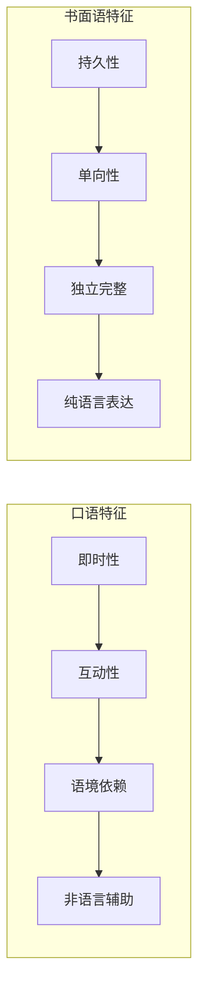
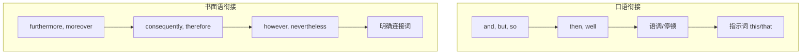

# 口语与书面语对比

英语口语和书面语虽然使用同一套语法系统，但在实际运用中呈现显著差异。口语追求即时性、互动性和自然流畅，而书面语强调精确性、完整性和逻辑严谨。理解这些差异，有助于学习者在不同场合选择恰当的表达方式。

本文将从词汇选择、句式结构、语法规则、篇章组织等多个维度，系统对比口语与书面语的特点，并提供实用的转换技巧。

---

## 1. 口语与书面语的本质区别

### 1.1 交际模式差异

| 维度 | 口语 | 书面语 |
| --- | --- | --- |
| **时间压力** | 实时产出，边想边说 | 有时间斟酌，可反复修改 |
| **反馈机制** | 即时反馈，可澄清误解 | 延时反馈或无反馈 |
| **语境依赖** | 依赖共享语境和非语言信息 | 必须语言自足 |
| **持久性** | 转瞬即逝 | 永久记录 |
| **正式程度** | 通常较随意 | 通常较正式 |

### 1.2 语法系统的调整

> [!info] 口语语法的特殊性
>
> 口语并非「不规范的书面语」，而是一套独立的语言系统。口语语法有其自身的规则和逻辑，许多在书面语中被视为「错误」的表达，在口语中完全自然、得体。

口语与书面语的语法差异主要体现在：

1. **句法复杂度**：口语倾向简单句和并列句，书面语使用更多复杂句和从句
2. **省略程度**：口语大量省略可推断成分，书面语要求结构完整
3. **词汇选择**：口语偏好常用词和短语动词，书面语使用正式词汇和拉丁词源词
4. **语法宽容度**：口语允许更多「语法偏离」，书面语严格遵守规则

---

## 2. 词汇层面的对比

### 2.1 正式程度的词汇选择

英语词汇存在日耳曼词源（通常较口语化）和拉丁/法语词源（通常较正式）的区分：

| 口语词汇（日耳曼词源） | 书面语词汇（拉丁词源） | 含义 |
| --- | --- | --- |
| get | obtain, acquire | 获得 |
| ask | inquire, request | 询问 |
| buy | purchase | 购买 |
| help | assist, aid | 帮助 |
| need | require | 需要 |
| use | utilize, employ | 使用 |
| show | demonstrate, illustrate | 展示 |
| start | commence, initiate | 开始 |
| end | conclude, terminate | 结束 |
| go up | increase, rise | 上升 |
| go down | decrease, decline | 下降 |
| find out | discover, ascertain | 发现 |
| make up | constitute, comprise | 构成 |
| put off | postpone, defer | 推迟 |
| look at | examine, inspect | 查看 |

> [!example] 口语与书面语词汇对比示例
>
> **口语版本**：
> *We need to find out why sales went down last month and figure out how to fix it.*
>
> **书面语版本**：
> *It is necessary to ascertain the reasons for the decline in sales during the previous month and devise strategies for improvement.*
>
> 两个句子表达相同意思，但词汇选择和句式结构差异显著。

### 2.2 短语动词 vs. 单一动词

口语偏好短语动词（phrasal verbs），书面语倾向使用单一正式动词：

| 短语动词（口语） | 单一动词（书面语） | 例句对比 |
| --- | --- | --- |
| put up with | tolerate | 口：*I can't put up with this noise.* 书：*Such noise is intolerable.* |
| come up with | devise, propose | 口：*She came up with a great idea.* 书：*She proposed an innovative solution.* |
| look into | investigate | 口：*We're looking into the problem.* 书：*The matter is being investigated.* |
| get rid of | eliminate, remove | 口：*We need to get rid of these old files.* 书：*These obsolete files should be eliminated.* |
| turn down | reject, decline | 口：*They turned down our offer.* 书：*Our proposal was declined.* |
| bring up | raise, mention | 口：*He brought up an important point.* 书：*An important issue was raised.* |
| put together | assemble, compile | 口：*I put together a report.* 书：*A comprehensive report was compiled.* |
| set up | establish | 口：*They set up a new company.* 书：*A new enterprise was established.* |

### 2.3 缩写与非缩写形式

| 口语形式 | 书面语形式 | 说明 |
| --- | --- | --- |
| I'm, you're, he's | I am, you are, he is | 主语 + be 动词 |
| don't, can't, won't | do not, cannot, will not | 否定形式 |
| I've, we've, they've | I have, we have, they have | 完成时助动词 |
| I'd, he'd, she'd | I would/had, he would/had | would/had 缩写 |
| gonna | going to | 非正式口语 |
| wanna | want to | 非正式口语 |
| gotta | got to / have to | 非正式口语 |
| kinda | kind of | 非正式口语 |
| sorta | sort of | 非正式口语 |

> [!warning] 书面语中的缩写使用
>
> **完全禁止**：gonna, wanna, gotta, kinda（仅用于极非正式口语）
>
> **一般避免**：I'm, don't, can't（学术论文、法律文件、商业报告）
>
> **可以使用**：缩写形式可用于非正式书面语，如电子邮件、博客、个人通信

### 2.4 填充词与犹豫标记

口语中常见但书面语几乎不出现的填充语：

| 填充词 | 功能 | 口语示例 |
| --- | --- | --- |
| well | 开启话题、过渡 | *Well, I think we should reconsider.* |
| you know | 寻求认同、解释 | *It's, you know, really complicated.* |
| I mean | 澄清、重述 | *I mean, we can't just ignore it.* |
| like | 引述、近似 | *She was like, "No way!"* |
| um, uh, er | 思考、犹豫 | *I was, um, thinking about it.* |
| so | 开启、总结 | *So, what do you think?* |
| actually | 对比、纠正 | *Actually, that's not quite right.* |
| basically | 简化、概括 | *Basically, we need more time.* |
| right | 确认、过渡 | *We need to finish this, right?* |
| anyway | 回归主题 | *Anyway, as I was saying...* |

> [!tip] 填充词在书面语中的处理
>
> 口语转书面语时，填充词通常需要删除或替换：
>
> | 口语 | 书面语 |
> | --- | --- |
> | *Well, I think...* | *It appears that...* / 直接陈述 |
> | *You know, it's...* | 删除或改为 *It is notable that...* |
> | *I mean, we should...* | *In other words, ...* / *To clarify, ...* |
> | *So, the result is...* | *Consequently, ...* / *Therefore, ...* |

---

## 3. 句式结构的对比

### 3.1 句子长度与复杂度

**口语特点**：
- 平均句长较短（7-10个词）
- 简单句和并列句为主
- 从句较少，层次较浅
- 允许片段句和省略句

**书面语特点**：
- 平均句长较长（15-25个词）
- 复合句和复杂句比例高
- 从句嵌套层次可达3-4层
- 要求句式完整

> [!example] 句式复杂度对比
>
> **口语版本**：
> *I went to the store. I needed milk. It was closed. So I went to another one. That one was open. I got the milk there.*
>
> **书面语版本**：
> *Having discovered that the first store I visited was closed, I proceeded to an alternative establishment, where I was able to purchase the milk I required.*
>
> 口语使用6个短句，书面语整合为1个包含分词结构和定语从句的复杂句。

### 3.2 省略现象

口语中省略极为常见，书面语则要求结构完整：

#### 3.2.1 主语省略

| 口语（省略主语） | 书面语（保留主语） |
| --- | --- |
| *(I)* Got it. | I understand. |
| *(I)* Don't know. | I am uncertain. |
| *(Are you)* Ready? | Are you prepared? |
| *(It)* Sounds good. | That sounds acceptable. |
| *(I)* Hope so. | I hope that is the case. |
| *(I)* Think so. | I believe so. |

#### 3.2.2 动词/助动词省略

| 口语（省略动词） | 书面语（保留动词） |
| --- | --- |
| You coming? | Are you coming? |
| Want some? | Would you like some? |
| Finished yet? | Have you finished? |
| Coffee? | Would you like coffee? |

#### 3.2.3 回应中的省略

| 完整形式 | 口语省略形式 |
| --- | --- |
| Yes, I would like to. | Sure. / Yes, please. |
| No, I do not think so. | Nope. / Don't think so. |
| I will do that. | Will do. |
| That is fine with me. | Fine. / Works for me. |
| I am not certain about that. | Not sure. |

### 3.3 句型偏好差异

#### 3.3.1 存在句

| 口语 | 书面语 |
| --- | --- |
| There's a problem. | A problem exists. / A problem has arisen. |
| There's no way to fix it. | No solution is apparent. / No remedy exists. |
| There are three reasons. | Three reasons account for this. |

#### 3.3.2 主语选择

口语偏好人称主语，书面语常用抽象名词或形式主语：

| 口语 | 书面语 |
| --- | --- |
| *We found that...* | *The study revealed that...* |
| *People think that...* | *It is commonly believed that...* |
| *I saw that...* | *Observation indicated that...* |
| *They didn't know...* | *There was insufficient awareness of...* |
| *You can see that...* | *It is evident that...* |

#### 3.3.3 语态选择

口语偏好主动语态，书面语（尤其是学术、法律文本）常用被动语态：

| 口语（主动） | 书面语（被动） |
| --- | --- |
| *We conducted the experiment.* | *The experiment was conducted.* |
| *Someone stole my car.* | *My car was stolen.* |
| *They will announce the results.* | *The results will be announced.* |
| *The company fired 50 workers.* | *Fifty workers were made redundant.* |

> [!info] 被动语态在书面语中的功能
>
> 1. **客观性**：隐藏施动者，显得更客观中立
> 2. **焦点转移**：将受事者置于句首，强调信息焦点
> 3. **衔接连贯**：保持主题一致，增强段落连贯性
> 4. **正式程度**：被动结构通常显得更正式

### 3.4 从句使用差异

书面语使用更多、更复杂的从句结构：

| 从句类型 | 口语倾向 | 书面语倾向 |
| --- | --- | --- |
| **定语从句** | 限制性、短小 | 非限制性、复杂 |
| **状语从句** | 简单时间/原因 | 多种类型、位置灵活 |
| **名词性从句** | 宾语从句为主 | 主语从句、同位语从句 |
| **分词结构** | 较少使用 | 频繁使用 |

**从句复杂度对比**：

> **口语**：
> *The guy who called yesterday wants to meet you.*
>
> **书面语**：
> *The representative who contacted our office on the previous day has expressed a desire to arrange a meeting at your earliest convenience.*

---

## 4. 语法规则的对比

### 4.1 时态使用差异

#### 4.1.1 口语中的时态简化

口语中，一些时态区分趋于模糊：

| 时态选择 | 书面语（严格） | 口语（灵活） |
| --- | --- | --- |
| 过去完成时 | *I realized I had forgotten my keys.* | *I realized I forgot my keys.* |
| 将来完成时 | *By then, I will have finished.* | *By then, I'll be done.* |
| 过去将来时 | *He said he would come.* | *He said he's coming.* |
| 虚拟语气 | *If I were you, I would...* | *If I was you, I'd...* |

#### 4.1.2 历史现在时

口语中，叙述过去事件时常用现在时增加生动性：

> **口语叙述**：
> *So I'm walking down the street, right? And this guy comes up to me and says, "Hey, do you have the time?" And I'm like, "Sure," and I look at my watch, and it's gone! Someone stole it!*

书面语则使用规范的过去时叙述：

> **书面叙述**：
> *As I was walking down the street, a man approached me and asked for the time. Upon checking my wrist, I discovered that my watch was missing. It had been stolen.*

### 4.2 情态动词使用

口语和书面语在情态动词选择上有明显差异：

| 功能 | 口语 | 书面语 |
| --- | --- | --- |
| **请求** | Can I...? / Could I...? | May I...? / Might I...? |
| **建议** | You should... | It is advisable to... |
| **必要** | You have to... / You gotta... | One must... / It is necessary to... |
| **推测** | It might be... | It may be... / It is possible that... |
| **许可** | You can... | Permission is granted to... |

> [!example] 情态动词正式程度
>
> **请求许可**（从最非正式到最正式）：
> 1. *Can I leave early?* — 口语
> 2. *Could I leave early?* — 礼貌口语
> 3. *May I leave early?* — 正式口语/书面语
> 4. *Might I be permitted to leave early?* — 极正式书面语

### 4.3 否定形式

| 口语否定 | 书面语否定 |
| --- | --- |
| don't, doesn't | do not, does not |
| can't | cannot |
| won't | will not |
| ain't（非标准） | am not, is not, are not, have not |
| no way | under no circumstances |
| not really | not entirely / not to a significant extent |

**双重否定**：

口语中有时出现双重否定（虽然语法书不推荐）：
- *I don't know nothing about it.* （口语）
- *I do not know anything about it.* （书面语）

### 4.4 关系代词选择

| 书面语 | 口语 |
| --- | --- |
| *The book **which** I read...* | *The book **that** I read...* 或 *The book **Ø** I read...* |
| *The person **whom** I met...* | *The person **that** I met...* 或 *The person **Ø** I met...* |
| *The reason **for which** we came...* | *The reason **why** we came...* 或 *The reason **Ø** we came...* |

> [!tip] 关系代词的省略
>
> 口语中，当关系代词作宾语时，常可省略：
> - *The man (that/whom) I saw...*
> - *The book (that/which) I borrowed...*
> - *The place (that/which) we visited...*
>
> 书面语，尤其是正式书面语，通常保留关系代词。

### 4.5 一致性规则

口语对主谓一致、代词一致的要求更宽松：

| 现象 | 口语（宽松） | 书面语（严格） |
| --- | --- | --- |
| **集体名词** | *The team are playing well.* | *The team is performing well.* |
| **不定代词** | *Everyone has their opinion.* | *Everyone has his or her opinion.* |
| **There be** | *There's two reasons.* | *There are two reasons.* |
| **就近原则** | *Neither he nor I are going.* | *Neither he nor I am going.* |

---

## 5. 篇章组织的对比

### 5.1 衔接方式

#### 5.1.1 连接词对比

| 逻辑关系 | 口语连接词 | 书面语连接词 |
| --- | --- | --- |
| **添加** | and, also, too | furthermore, moreover, additionally, in addition |
| **转折** | but, though | however, nevertheless, nonetheless, yet |
| **因果** | so, because | therefore, consequently, as a result, hence |
| **对比** | but, or | in contrast, conversely, on the other hand |
| **举例** | like | for example, for instance, such as |
| **总结** | so, anyway | in conclusion, to summarize, in summary |
| **顺序** | then, next | subsequently, following this, thereafter |
| **强调** | really, just | indeed, in fact, particularly |

#### 5.1.2 衔接示例对比

> **口语**：
> *So we went to the restaurant, and the food was great, but it was really expensive. And then we went to a movie, and it was terrible, so we left early.*
>
> **书面语**：
> *We dined at the restaurant, where the cuisine was excellent; however, the prices were considerably elevated. Subsequently, we attended a film screening, which proved disappointing, prompting our early departure.*

### 5.2 信息密度

书面语的信息密度通常高于口语：

> [!example] 信息密度对比
>
> **口语**（低密度）：
> *The company made a lot of money last year. They sold many products. The products were very popular. Many people bought them.*
>
> **书面语**（高密度）：
> *The company achieved substantial revenue growth in the preceding fiscal year, driven by robust sales of its highly popular product line.*
>
> 口语用4句话传递的信息，书面语压缩为1句话。

信息压缩的主要手段：

1. **名词化**：*They decided* → *The decision*
2. **分词结构**：*...because they were popular* → *...driven by popularity*
3. **复合定语**：*products that were popular* → *popular products*
4. **介词短语**：*last year* → *in the preceding fiscal year*

### 5.3 语篇结构

| 特征 | 口语 | 书面语 |
| --- | --- | --- |
| **开头** | 直接切入、随意开场 | 引言、背景铺垫 |
| **主体** | 松散、可离题 | 严密、围绕主题 |
| **结尾** | 可突然结束 | 总结、结论 |
| **段落** | 不明确 | 分段清晰 |
| **标记** | 语调、停顿 | 标点、格式 |

---

## 6. 语体转换技巧

### 6.1 口语转书面语

将口语转换为书面语时，遵循以下步骤：

> [!example] 口语转书面语示例
>
> **口语原文**：
> *So, um, basically what happened was, like, we had this meeting, right? And the boss, he was like, "We gotta cut costs." So, you know, everyone was pretty worried. But then someone came up with this idea to, like, use cheaper materials. And it actually worked out.*
>
> **转换步骤**：
>
> 1. **删除填充词**：So, um, basically, like, right, you know
> 2. **补全省略**：*he was like* → *he stated*
> 3. **替换词汇**：*gotta* → *need to*, *came up with* → *proposed*, *worked out* → *proved successful*
> 4. **整合句子**：合并短句
> 5. **添加连接词**：Consequently, However
>
> **书面语结果**：
> *During a recent meeting, management announced the necessity of cost reduction measures, which caused considerable concern among staff. However, a proposal to utilize more economical materials was subsequently introduced, and this approach has proven successful.*

### 6.2 书面语转口语

将书面语转换为口语时的注意事项：

| 转换操作 | 示例 |
| --- | --- |
| **使用缩写** | *It is not* → *It's not* / *It isn't* |
| **简化词汇** | *utilize* → *use*, *commence* → *start* |
| **使用短语动词** | *investigate* → *look into* |
| **缩短句子** | 拆分长句为多个短句 |
| **主动语态** | *It was decided that...* → *They decided...* |
| **添加填充词** | 适当添加 *well*, *so*, *you know* |
| **使用省略** | *That sounds good.* → *Sounds good.* |

> [!example] 书面语转口语示例
>
> **书面语原文**：
> *The implementation of the proposed measures is expected to result in a significant reduction in operational expenditure, thereby enhancing the organization's financial sustainability.*
>
> **口语转换**：
> *So basically, if we do what they're suggesting, we'll save a lot of money. That's gonna help the company stay financially healthy.*

### 6.3 混合语体的适当使用

在某些场合，口语和书面语可以混合使用：

| 场合 | 语体特点 | 示例 |
| --- | --- | --- |
| **商务邮件** | 半正式，可用缩写 | *I'm writing to follow up on our meeting.* |
| **博客文章** | 较口语化 | *So here's the thing about...* |
| **演讲稿** | 书面准备，口语呈现 | 用书面结构，口语词汇 |
| **对话报道** | 书面语叙述，口语引用 | *He said, "I don't know what to do."* |
| **学术论文** | 高度正式 | 避免所有口语特征 |

---

## 7. 典型场景对比示例

### 7.1 求职信 vs. 面试对话

**书面语：求职信**

> Dear Hiring Manager,
>
> I am writing to express my interest in the Marketing Manager position advertised on your company website. With over five years of experience in digital marketing and a proven track record of increasing brand engagement, I am confident that I would be a valuable addition to your team.
>
> During my tenure at ABC Corporation, I successfully led a campaign that resulted in a 40% increase in website traffic. Furthermore, I implemented a social media strategy that enhanced customer engagement by 60%.
>
> I would welcome the opportunity to discuss how my skills and experience align with your organization's goals. Thank you for considering my application.
>
> Sincerely,
> Jane Smith

**口语：面试对话**

> **Interviewer**: So, tell me about your experience in marketing.
>
> **Candidate**: Sure! So I've been doing digital marketing for about five years now. At my last job, at ABC Corporation, I ran this big campaign that really took off—we got like 40% more traffic to the site. And I also set up our whole social media thing, which got way more people engaging with us, like 60% more.
>
> **Interviewer**: That's impressive. What made those campaigns so successful?
>
> **Candidate**: Well, I think it's about really understanding your audience, you know? I spent a lot of time looking at the data and figuring out what people actually wanted to see.

**语法差异分析**：

| 特征 | 求职信 | 面试对话 |
| --- | --- | --- |
| **词汇** | express interest, tenure, implemented | doing, ran, set up, took off |
| **句式** | 复杂长句，从句嵌套 | 短句，并列结构 |
| **省略** | 无 | *I've been doing...* 省略主题 |
| **填充词** | 无 | like, you know, well |
| **数字表达** | a 40% increase | like 40% more |

### 7.2 学术论文 vs. 课堂讨论

**书面语：学术论文摘要**

> This study investigates the correlation between social media usage and academic performance among undergraduate students. Utilizing a mixed-methods approach, data were collected from 500 participants through surveys and in-depth interviews. The findings indicate a statistically significant negative correlation (r = -0.42, p < 0.01) between daily social media consumption and grade point average. However, qualitative analysis reveals that the nature of social media engagement, rather than mere duration, plays a crucial role in determining academic outcomes. These results suggest that educational institutions should focus on promoting mindful digital literacy rather than implementing blanket restrictions on social media use.

**口语：课堂讨论**

> **Professor**: So, what did you find in your research?
>
> **Student**: Okay, so basically I looked at how much time students spend on social media and whether it affects their grades. And yeah, there's definitely a connection—students who are on social media a lot tend to have lower GPAs. But here's the interesting part: it's not just about how long you're on there, it's more about what you're doing. Like, if you're using it for studying or networking, that's different from just scrolling through memes all day. So I think instead of just telling students to stay off social media, schools should teach them how to use it better.

### 7.3 法律文件 vs. 律师咨询

**书面语：合同条款**

> The Lessee shall be responsible for maintaining the premises in good condition throughout the duration of the lease. Any alterations or modifications to the property must receive prior written approval from the Lessor. Failure to comply with this provision may result in termination of the lease agreement and forfeiture of the security deposit.

**口语：律师解释**

> So what this means is, you've got to keep the place in good shape while you're renting it. If you want to change anything—like, paint the walls a different color or put up shelves—you need to get permission from the landlord first, and it has to be in writing. If you don't follow this rule, they can kick you out and keep your deposit.

**关键转换**：

| 书面语 | 口语 |
| --- | --- |
| The Lessee | you |
| shall be responsible for | you've got to |
| maintaining | keep |
| throughout the duration of | while you're |
| alterations or modifications | change anything |
| prior written approval | permission in writing |
| failure to comply | if you don't follow |
| termination | kick you out |
| forfeiture | keep |

---

## 8. 常见错误与纠正

### 8.1 口语化书面语的问题

在正式书面语中应避免的口语特征：

| 问题 | 错误示例 | 正确示例 |
| --- | --- | --- |
| **缩写形式** | *We can't accept this.* | *We cannot accept this.* |
| **非正式词汇** | *The results were pretty good.* | *The results were satisfactory.* |
| **短语动词** | *We looked into the issue.* | *We investigated the issue.* |
| **口语表达** | *a lot of* | *numerous, significant, considerable* |
| **填充词** | *So, the data shows...* | *The data indicate...* |
| **人称代词** | *You can see that...* | *It is evident that...* |
| **句子片段** | *Very important point.* | *This is a very important point.* |
| **省略** | *Think it's a problem.* | *I believe this constitutes a problem.* |

### 8.2 书面化口语的问题

过度正式的口语听起来不自然：

| 问题 | 不自然口语 | 自然口语 |
| --- | --- | --- |
| **过度正式** | *I would like to inquire as to whether...* | *Can I ask if...* |
| **被动过多** | *It has been decided that we shall proceed.* | *We've decided to go ahead.* |
| **复杂句式** | *The individual with whom I spoke indicated...* | *The guy I talked to said...* |
| **书面连接词** | *Furthermore, I would like to add...* | *Also, I wanted to say...* |
| **避免缩写** | *I do not know what we should do.* | *I don't know what to do.* |

### 8.3 语体混用的问题

同一文本中语体不一致会造成困惑：

> [!warning] 语体混用示例
>
> **问题文本**：
> *The research methodology employed in this study was, like, really comprehensive. We utilized a mixed-methods approach, but honestly, it was kinda hard to get participants. Nevertheless, the findings are gonna be significant.*
>
> **问题分析**：
> - *like, really* — 非正式口语
> - *utilized* — 正式书面语
> - *kinda* — 非正式口语
> - *Nevertheless* — 正式书面语
> - *gonna* — 非正式口语
>
> **统一为书面语**：
> *The research methodology employed in this study was comprehensive. A mixed-methods approach was utilized, although participant recruitment presented challenges. Nevertheless, the findings are expected to be significant.*
>
> **统一为口语**：
> *The research methods we used were really thorough. We did both surveys and interviews, but it was kind of hard to find people to participate. Still, the results are going to be really important.*

---

## 9. 综合练习

### 9.1 语体识别练习

判断以下句子属于口语还是书面语，并说明判断依据：

> [!example] 练习 1
>
> 1. *The implementation of sustainable practices has become increasingly imperative.*
> 2. *So anyway, I was thinking we could maybe try a different approach.*
> 3. *It's gonna rain tomorrow, I think.*
> 4. *Participants were randomly assigned to one of three experimental conditions.*
> 5. *Know what I mean?*

查看答案

1. **书面语** — 名词化结构(*implementation*)、正式词汇(*imperative*)
2. **口语** — 填充词(*so anyway*)、不确定表达(*maybe*)
3. **口语** — 非正式缩写(*gonna*)、句末附加(*I think*)
4. **书面语** — 被动语态、学术术语(*experimental conditions*)
5. **口语** — 确认附加语、省略主语

### 9.2 语体转换练习

将以下口语转换为书面语：

> [!example] 练习 2
>
> *So basically, the thing is, we really need to figure out how to get more customers. Like, sales have been going down for a while now, and if we don't do something about it soon, we're gonna be in trouble.*

参考答案

*The organization faces an urgent need to develop strategies for customer acquisition. Sales figures have demonstrated a declining trend over an extended period, and failure to address this issue promptly may result in significant financial difficulties.*

**转换要点**：
- 删除 *So basically, the thing is, like*
- *figure out* → *develop strategies*
- *get more customers* → *customer acquisition*
- *going down* → *declining trend*
- *for a while* → *over an extended period*
- *do something about it* → *address this issue*
- *gonna be in trouble* → *result in significant financial difficulties*

### 9.3 书面语转口语练习

将以下书面语转换为口语：

> [!example] 练习 3
>
> *The committee has determined that the proposed modifications to the existing policy framework are not sufficiently justified and therefore recommends that the proposal be rejected pending further consultation with relevant stakeholders.*

参考答案

*So the committee looked at the changes you're proposing, and they don't think there's enough reason to make them. They're saying no for now and think we should talk to more people about it first.*

**转换要点**：
- *has determined* → *looked at... and they don't think*
- *proposed modifications* → *the changes you're proposing*
- *not sufficiently justified* → *there's enough reason*
- *recommends that the proposal be rejected* → *They're saying no*
- *pending further consultation* → *should talk to more people first*
- *relevant stakeholders* → *more people*（根据语境简化）

---

## 10. 口语与书面语对比小结

本章从词汇、句式、语法规则、篇章组织等多个维度对比了英语口语与书面语的差异：

### 核心差异回顾

| 维度 | 口语特点 | 书面语特点 |
| --- | --- | --- |
| **词汇** | 常用词、短语动词、缩写 | 正式词、单一动词、完整形式 |
| **句式** | 短句、省略、片段 | 长句、完整、从句嵌套 |
| **语法** | 灵活、宽容 | 严格、规范 |
| **衔接** | and, but, so | however, therefore, furthermore |
| **信息** | 低密度、重复 | 高密度、精炼 |

### 语体选择原则

1. **场合决定语体**：正式场合用书面语风格，非正式场合用口语风格
2. **媒介影响语体**：书面媒介偏正式，口头媒介偏随意
3. **关系影响语体**：陌生人/上级用正式语体，熟人/同辈用非正式语体
4. **目的影响语体**：学术、法律、商务用书面语；日常交流用口语

### 学习建议

> [!success] 提升语体意识的方法
>
> 1. **对比阅读**：阅读同一主题的学术文章和博客文章，对比语言特点
> 2. **转录分析**：将口语对话转录成文字，分析与书面语的差异
> 3. **改写练习**：将书面语转口语、口语转书面语
> 4. **场景意识**：写作/说话前判断场合，选择合适的语体
> 5. **模仿范本**：积累不同语体的优秀范本，模仿其语言特点

掌握口语与书面语的差异，不仅能让你在各种场合都表达得体，更能帮助你成为一个真正灵活、自如的英语使用者。
