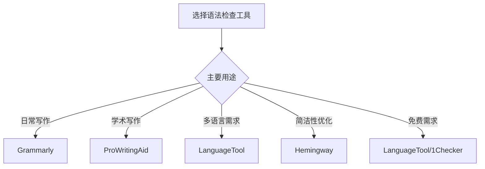
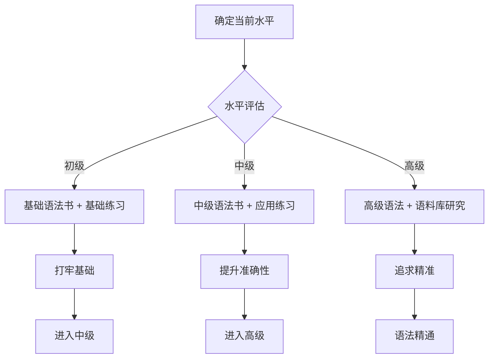

# 语法学习资源推荐

优质的学习资源能够事半功倍。本文精选适合不同水平学习者的语法学习资源，涵盖经典教材、在线课程、语法工具、学习网站和移动应用，帮助你构建系统的语法学习体系。

---

## 1. 经典语法教材

### 1.1 基础入门级

> [!info] 适合人群
>
> 英语初学者、语法基础薄弱者、希望系统学习基础语法的学习者

| 书名 | 作者 | 特点 | 推荐理由 |
| --- | --- | --- | --- |
| **《赖世雄美语语法》** | 赖世雄 | 讲解通俗、例句丰富 | 适合零基础，讲解深入浅出 |
| **《英语语法新思维》** | 张满胜 | 理念新颖、系统全面 | 从思维角度讲语法，易于理解 |
| **《薄冰英语语法》** | 薄冰 | 权威经典、体系完整 | 国内语法教材经典之作 |
| **Essential Grammar in Use** | Raymond Murphy | 练习丰富、循序渐进 | 剑桥出品，自学首选 |
| **《新概念英语》语法篇** | L.G. Alexander | 课文配套、实用性强 | 结合课文学习语法 |

**选书建议**：

- **完全零基础**：从《赖世雄美语语法》或 Essential Grammar in Use（红皮书）开始
- **有一定基础**：《英语语法新思维》帮助重建语法认知框架
- **系统学习**：《薄冰英语语法》作为查阅工具书

### 1.2 中级提高级

> [!info] 适合人群
>
> 已掌握基础语法、准备考试（四六级/考研/雅思托福）、希望提升准确性的学习者

| 书名 | 作者 | 特点 | 推荐理由 |
| --- | --- | --- | --- |
| **English Grammar in Use** | Raymond Murphy | 中级经典、练习充分 | 剑桥蓝皮书，全球畅销 |
| **《英语语法新思维·中级》** | 张满胜 | 深入浅出、思维训练 | 帮助建立语感 |
| **Practical English Usage** | Michael Swan | 实用导向、解疑释惑 | 解决实际使用中的困惑 |
| **《英语常见问题解答大词典》** | 赵振才 | 问答形式、针对性强 | 解答中国学生常见问题 |

**选书建议**：

- **备考四六级**：English Grammar in Use + 历年真题
- **备考考研**：《英语语法新思维·中级》+ 长难句分析
- **日常提升**：Practical English Usage 作为查阅工具

### 1.3 高级进阶级

> [!info] 适合人群
>
> 英语专业学生、教师、翻译工作者、追求语法精准的高级学习者

| 书名 | 作者 | 特点 | 推荐理由 |
| --- | --- | --- | --- |
| **Advanced Grammar in Use** | Martin Hewings | 高级语法、学术导向 | 剑桥绿皮书，高阶必备 |
| **A Comprehensive Grammar of the English Language** | Quirk et al. | 权威全面、学术经典 | 语法研究圣经 |
| **The Cambridge Grammar of the English Language** | Huddleston & Pullum | 现代语法学、学术前沿 | 语言学专业参考 |
| **Longman Grammar of Spoken and Written English** | Biber et al. | 语料库语法、口笔语对比 | 学术研究必备 |
| **《章振邦高级英语语法》** | 章振邦 | 系统深入、例句丰富 | 国内高级语法权威教材 |

**选书建议**：

- **英语专业学生**：Advanced Grammar in Use + 《章振邦高级英语语法》
- **语言学研究**：Quirk 语法或 Cambridge Grammar
- **翻译工作者**：Practical English Usage + 语法词典

---

## 2. 在线学习平台

### 2.1 免费学习网站

| 网站 | 网址 | 特点 | 适合人群 |
| --- | --- | --- | --- |
| **英语语法网** | yingyuyufa.com | 中文讲解、分类清晰 | 国内学习者 |
| **Grammar Monster** | grammar-monster.com | 趣味讲解、测试丰富 | 入门级学习者 |
| **English Grammar 101** | englishgrammar101.com | 系统课程、互动练习 | 系统学习者 |
| **Grammarly Blog** | grammarly.com/blog | 实用技巧、案例分析 | 写作提升 |
| **英国文化协会** | learnenglish.britishcouncil.org | 官方资源、权威可靠 | 各级别学习者 |
| **BBC Learning English** | bbc.co.uk/learningenglish | 多媒体资源、地道英语 | 听说结合 |
| **Perfect English Grammar** | perfect-english-grammar.com | 简洁明了、例句丰富 | 快速查阅 |
| **English Page** | englishpage.com | 时态专项、练习充足 | 时态学习 |
| **Daily Grammar** | dailygrammar.com | 每日一课、循序渐进 | 零散时间学习 |

### 2.2 付费课程平台

| 平台 | 特点 | 价格区间 | 适合人群 |
| --- | --- | --- | --- |
| **Coursera** | 大学课程、证书认证 | 免费审核/付费证书 | 系统学习者 |
| **Udemy** | 课程丰富、经常打折 | ￥50-200/课程 | 性价比优先 |
| **可可英语** | 国内平台、中文讲解 | 会员制 | 国内学习者 |
| **沪江网校** | 课程体系完整 | 课程付费 | 应试学习者 |
| **网易公开课** | 名校课程、免费观看 | 免费 | 自学者 |

> [!tip] 课程选择建议
>
> 1. **先试后买**：大多数平台有试听，先评估教学风格
> 2. **关注评价**：查看学员评价，了解课程质量
> 3. **考虑目标**：应试选专项课程，日常选通用课程
> 4. **善用促销**：Udemy、沪江常有打折活动

---

## 3. 语法检查工具

### 3.1 在线语法检查器

| 工具 | 网址/特点 | 免费功能 | 付费功能 |
| --- | --- | --- | --- |
| **Grammarly** | 最流行的语法检查工具 | 基础语法、拼写 | 高级语法、风格、抄袭检测 |
| **ProWritingAid** | 深度分析、报告详尽 | 限500词/次 | 无限制、更多分析维度 |
| **LanguageTool** | 开源免费、多语言 | 基础检查 | 高级功能 |
| **Hemingway Editor** | 简洁性分析、可读性评分 | 在线免费 | 桌面版付费 |
| **Ginger** | 整句改写、翻译功能 | 基础检查 | 高级功能 |
| **WhiteSmoke** | 翻译+语法+风格 | 试用版 | 付费订阅 |
| **1Checker** | 中国团队开发 | 免费使用 | 无 |

### 3.2 工具对比

> [!warning] 使用建议
>
> 1. **工具是辅助**：不要完全依赖工具，需理解修改原因
> 2. **学习修改建议**：每次修改时思考「为什么错」
> 3. **结合人工判断**：工具有时会误判，需自己判断
> 4. **多工具验证**：重要文档用多个工具交叉检查

### 3.3 浏览器插件推荐

| 插件 | 浏览器 | 功能 |
| --- | --- | --- |
| **Grammarly** | Chrome/Firefox/Edge/Safari | 实时检查网页输入 |
| **LanguageTool** | Chrome/Firefox | 开源免费语法检查 |
| **Ginger** | Chrome | 语法+翻译 |
| **PaperRater** | Chrome | 学术写作检查 |

---

## 4. 语法词典与工具书

### 4.1 纸质词典

| 词典 | 出版社 | 特点 | 适合人群 |
| --- | --- | --- | --- |
| **牛津高阶英汉双解词典** | 牛津大学出版社 | 权威经典、语法标注详细 | 各级别学习者 |
| **朗文当代高级英语辞典** | 培生教育 | 例句丰富、语法框图 | 中高级学习者 |
| **柯林斯COBUILD高阶英语词典** | 柯林斯 | 整句释义、语料库支撑 | 语感培养 |
| **韦氏大学词典** | 梅里亚姆-韦伯斯特 | 美式英语权威 | 美语学习者 |
| **牛津英语搭配词典** | 牛津大学出版社 | 搭配专项 | 写作提升 |
| **牛津英语语法词典** | 牛津大学出版社 | 语法查阅 | 语法学习 |

### 4.2 在线词典

| 词典 | 网址 | 特点 |
| --- | --- | --- |
| **牛津在线词典** | oxfordlearnersdictionaries.com | 权威释义、语法标注 |
| **剑桥在线词典** | dictionary.cambridge.org | 英美发音、例句丰富 |
| **朗文在线词典** | ldoceonline.com | 搭配信息、词频标注 |
| **韦氏在线词典** | merriam-webster.com | 美式英语、词源信息 |
| **有道词典** | youdao.com | 中文释义、例句丰富 |
| **欧路词典** | eudic.net | 支持多词典、离线使用 |

> [!tip] 词典使用技巧
>
> 1. **关注语法标注**：词典中的 [C]/[U]、[T]/[I] 等标注很重要
> 2. **学习例句**：例句展示词汇的真实用法
> 3. **注意搭配**：词典会标注常见搭配
> 4. **比较多词典**：不同词典角度不同，综合参考

---

## 5. 移动学习应用

### 5.1 语法学习APP

| 应用 | 平台 | 特点 | 价格 |
| --- | --- | --- | --- |
| **English Grammar in Use** | iOS/Android | 剑桥官方、配套教材 | 付费 |
| **Grammarly Keyboard** | iOS/Android | 输入时实时检查 | 免费/付费 |
| **Johnny Grammar** | iOS/Android | 游戏化学习、英国文化协会出品 | 免费 |
| **English Grammar Test** | iOS/Android | 练习题库丰富 | 免费/内购 |
| **LearnEnglish Grammar** | iOS/Android | 英国文化协会出品 | 免费 |
| **Lingvist** | iOS/Android | AI个性化学习 | 免费/订阅 |
| **可可英语** | iOS/Android | 听说读写综合 | 免费/会员 |
| **百词斩** | iOS/Android | 语法专项练习 | 免费/会员 |

### 5.2 综合学习APP

| 应用 | 特点 | 语法功能 | 价格 |
| --- | --- | --- | --- |
| **Duolingo** | 游戏化、趣味性强 | 语法融入课程 | 免费/Plus |
| **Babbel** | 实用会话导向 | 语法系统讲解 | 订阅制 |
| **Busuu** | 社区互动、母语者批改 | 语法专项课程 | 免费/Premium |
| **Rosetta Stone** | 沉浸式学习 | 隐性语法学习 | 订阅制 |
| **HelloTalk** | 语言交换、真人互动 | 实际应用中学习 | 免费/VIP |

> [!example] APP 选择建议
>
> **碎片时间学习**：Johnny Grammar、English Grammar Test
> **系统学习**：English Grammar in Use APP、LearnEnglish Grammar
> **写作提升**：Grammarly Keyboard
> **综合提升**：Duolingo、Busuu

---

## 6. 视频学习资源

### 6.1 YouTube 频道推荐

| 频道 | 特点 | 适合人群 | 链接 |
| --- | --- | --- | --- |
| **English with Lucy** | 英式发音、语法讲解 | 中级学习者 | youtube.com/@EnglishwithLucy |
| **mmmEnglish** | 澳式英语、实用语法 | 各级别 | youtube.com/@maboroshi_emma |
| **EngVid** | 多位教师、内容丰富 | 各级别 | youtube.com/@engvidEnglish |
| **Rachel's English** | 美式发音、语法结合 | 发音+语法 | youtube.com/@rachelsenglish |
| **Adam's English Lessons** | 学术写作、高级语法 | 高级学习者 | youtube.com/@EnglishTeacherAdam |
| **BBC Learning English** | 官方制作、地道表达 | 各级别 | youtube.com/@bbclearningenglish |
| **英语兔** | 中文讲解、动画演示 | 国内学习者 | B站/YouTube |
| **老友记学英语** | 影视场景、实用口语 | 口语学习 | B站 |

### 6.2 国内视频平台资源

| 平台 | 推荐资源 | 特点 |
| --- | --- | --- |
| **哔哩哔哩** | 英语兔、老友记学英语、英语语法精讲 | 免费丰富、弹幕互动 |
| **网易公开课** | 耶鲁/MIT公开课、TED演讲 | 名校课程、高质量 |
| **中国大学MOOC** | 英语语法精讲（各大学） | 系统课程、有证书 |
| **学堂在线** | 清华北大英语课程 | 名校资源 |

---

## 7. 语法练习资源

### 7.1 在线练习网站

| 网站 | 网址 | 特点 |
| --- | --- | --- |
| **English Grammar Exercises** | englisch-hilfen.de | 练习题丰富、分类清晰 |
| **Ego4u** | ego4u.com | 语法练习+讲解 |
| **To Learn English** | tolearnenglish.com | 免费练习、即时反馈 |
| **English Exercises** | englishexercises.org | 教师创建、多样练习 |
| **Quia** | quia.com | 游戏化练习 |
| **Road to Grammar** | roadtogrammar.com | 分级练习 |
| **Grammar Bytes** | chompchomp.com | 趣味练习 |

### 7.2 练习书籍推荐

| 书名 | 作者/出版社 | 特点 |
| --- | --- | --- |
| **Grammar in Use 系列练习册** | Cambridge | 配套Murphy语法书 |
| **English Grammar Workbook** | 各出版社 | 独立练习册 |
| **《高考英语语法填空》** | 各出版社 | 应试专项 |
| **《考研英语长难句》** | 各出版社 | 句法分析 |
| **《雅思语法精讲精练》** | 各出版社 | 雅思专项 |

---

## 8. 语料库资源

> [!info] 什么是语料库？
>
> 语料库是大规模真实语言文本的集合，可以帮助学习者了解词汇和语法的真实使用情况。

### 8.1 常用语料库

| 语料库 | 网址 | 特点 | 用途 |
| --- | --- | --- | --- |
| **COCA** | corpus.byu.edu/coca | 美国当代英语语料库 | 查词频、搭配 |
| **BNC** | corpus.byu.edu/bnc | 英国国家语料库 | 英式英语研究 |
| **iWeb** | corpus.byu.edu/iweb | 网络语料库 | 现代用法 |
| **COHA** | corpus.byu.edu/coha | 美国历史语料库 | 词汇演变 |
| **Sketch Engine** | sketchengine.eu | 多语言语料库 | 专业研究 |
| **English Corpora** | english-corpora.org | 综合入口 | 一站式访问 |

### 8.2 语料库使用场景

| 使用场景 | 操作方法 | 示例 |
| --- | --- | --- |
| **查词频** | 搜索单词，查看频率 | *affect* vs *effect* 哪个更常用 |
| **查搭配** | 搜索 [word] + [*] | *make* 后面常接什么词 |
| **查语法模式** | 使用语法标注搜索 | *suggest* 后接 that 从句还是动名词 |
| **查近义词区别** | 对比搜索 | *big* vs *large* 在不同语境的使用 |
| **查真实例句** | 浏览搜索结果 | 学习词汇在真实语境中的用法 |

---

## 9. 学习方法建议

### 9.1 不同水平的学习路径

### 9.2 高效学习策略

> [!success] 语法学习六步法
>
> 1. **理解规则**：先理解语法规则的原理
> 2. **分析例句**：通过例句理解规则的应用
> 3. **模仿造句**：用规则造自己的句子
> 4. **大量练习**：通过练习巩固记忆
> 5. **错题分析**：分析错误，找出薄弱点
> 6. **实际应用**：在阅读、写作、口语中使用

### 9.3 常见学习误区

| 误区 | 正确做法 |
| --- | --- |
| 只背规则不练习 | 规则+练习+应用三结合 |
| 追求100%正确 | 允许犯错，在错误中学习 |
| 孤立学习语法 | 结合阅读、写作、口语 |
| 只做选择题 | 加入写作、翻译等输出练习 |
| 一次学太多 | 每次专注一个语法点，学透再前进 |
| 忽视语境 | 在语境中理解语法的功能 |

### 9.4 学习时间规划

| 水平 | 每日学习时间 | 预计周期 | 目标 |
| --- | --- | --- | --- |
| **初级 → 中级** | 30-60 分钟 | 3-6 个月 | 掌握基础语法框架 |
| **中级 → 高级** | 30-45 分钟 | 6-12 个月 | 提升准确性和流利度 |
| **高级 → 精通** | 持续学习 | 长期 | 追求语法精准和地道 |

---

## 10. 资源使用规划

### 10.1 初学者推荐组合

> [!tip] 初学者资源包
>
> **教材**：《赖世雄美语语法》或 Essential Grammar in Use
> **视频**：英语兔（B站）
> **练习**：教材配套练习 + English Grammar Exercises 网站
> **APP**：Johnny Grammar（碎片时间）
> **工具**：有道词典 + Grammarly（免费版）

### 10.2 备考者推荐组合

> [!tip] 考试备考资源包
>
> **教材**：English Grammar in Use + 考试专项语法书
> **视频**：EngVid（针对考试讲解）
> **练习**：历年真题 + 专项练习册
> **APP**：Grammarly（检查写作）
> **工具**：COCA 语料库（查地道表达）

### 10.3 高级学习者推荐组合

> [!tip] 高级学习资源包
>
> **教材**：Advanced Grammar in Use + Practical English Usage
> **视频**：Adam's English Lessons
> **练习**：语料库研究 + 原版阅读
> **APP**：ProWritingAid（深度写作分析）
> **工具**：Sketch Engine + 专业语法词典

---

## 11. 语法学习资源小结

本文推荐的语法学习资源涵盖：

| 类别 | 资源数量 | 主要用途 |
| --- | --- | --- |
| **经典教材** | 15+ 本 | 系统学习 |
| **在线平台** | 15+ 个 | 在线学习 |
| **语法工具** | 10+ 个 | 写作检查 |
| **词典工具** | 10+ 个 | 查阅参考 |
| **移动应用** | 15+ 个 | 碎片学习 |
| **视频资源** | 10+ 个频道 | 视听学习 |
| **练习资源** | 10+ 个 | 巩固练习 |
| **语料库** | 5+ 个 | 深度研究 |

### 选择资源的原则

> [!success] 资源选择四原则
>
> 1. **适合自己的水平**：不要好高骛远，也不要原地踏步
> 2. **符合学习目标**：应试选应试资源，日常选实用资源
> 3. **能够坚持使用**：再好的资源不用也没用
> 4. **多种资源配合**：教材+视频+练习+工具组合使用

### 最后的建议

语法学习没有捷径，但有方法。选择适合自己的资源，制定可执行的计划，坚持每天学习一点，积累下来就会有质的飞跃。

记住：**最好的资源是你真正使用的资源**。
